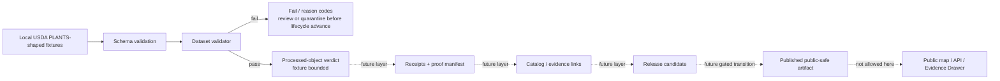
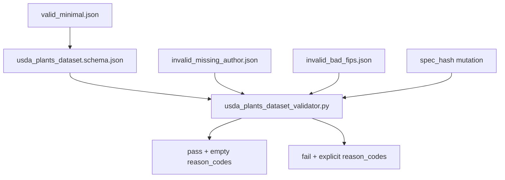

<!-- [KFM_META_BLOCK_V2]
doc_id: kfm://doc/NEEDS-VERIFICATION-usda-plants-ingestion
title: USDA PLANTS Ingestion
type: standard
version: v1
status: draft
owners: NEEDS_VERIFICATION-flora-steward
created: NEEDS_VERIFICATION
updated: 2026-05-08
policy_label: public
related: [./README.md, ./USDA_PLANTS_NEXT_LAYER.md, ./USDA_PLANTS_CATALOG_RELEASE_LAYER.md, ./USDA_PLANTS_LIVE_SOURCE_READINESS_LAYER.md, ./USDA_PLANTS_GUARDED_LIVE_WATCHER_LAYER.md, ./USDA_PLANTS_SCHEDULED_OBSERVER_LAYER.md, ./USDA_PLANTS_PUBLICATION_LAYER.md, ../../../../contracts/source/kansas_flora/usda_plants.md, ../../../../schemas/flora/usda_plants_dataset.schema.json, ../../../../tools/validators/flora/usda_plants_dataset_validator.py, ../../../../tests/flora/test_usda_plants_dataset_validator.py, ../../../../tests/flora/test_usda_plants_fixture_loader.py, ../../../../tests/fixtures/flora/usda_plants/valid_minimal.json]
tags: [kfm, flora, usda-plants, ingestion, no-network, fixtures, validation, evidence, policy]
notes: [doc_id, owner, created date, CODEOWNERS coverage, and workflow enforcement require verification before publication; this document replaces the earlier thin ingestion note with a complete no-network ingestion-layer guide; this is not a live USDA connector, promotion approval, publication workflow, or public map layer]
[/KFM_META_BLOCK_V2] -->

<a id="top"></a>

# USDA PLANTS Ingestion

No-network ingestion-layer guide for validating deterministic USDA PLANTS-shaped Flora fixtures before catalog closure, promotion, publication, API use, or map rendering.


> [!IMPORTANT]
> **Status:** `draft`  
> **Path:** `docs/domains/flora/usda_plants/USDA_PLANTS_INGESTION.md`  
> **Layer:** `usda_plants_ingestion`  
> **Lifecycle placement:** fixture-backed validation toward `PROCESSED` dataset objects  
> **Network posture:** disabled by default; no live USDA fetch is claimed here  
> **Publication posture:** blocked; this slice cannot publish, promote, release, render a public map layer, or produce an EvidenceBundle release by itself  
> **Implementation posture:** repository paths are documented where connector-visible; runtime behavior, CI enforcement, and release state remain **NEEDS VERIFICATION** unless a maintainer reruns the checks in a real checkout.

**Quick links:** [Purpose](#purpose) · [Repo fit](#repo-fit) · [Scope](#scope) · [Accepted inputs](#accepted-inputs) · [Exclusions](#exclusions) · [Source boundary](#source-boundary) · [Lifecycle](#lifecycle) · [Dataset contract](#dataset-contract) · [Validator behavior](#validator-behavior) · [Fixture flow](#fixture-flow) · [Quickstart](#quickstart) · [Policy posture](#policy-posture) · [Review checklist](#review-checklist) · [Open verification](#open-verification)

---

## Purpose

This document defines the first safe USDA PLANTS slice in the KFM Flora lane.

It exists to prove one narrow thing:

> USDA PLANTS-shaped fixture records can be validated deterministically, with source role, provenance, distribution caveats, rights posture, and validation reasons preserved before any broader lifecycle step is allowed.

This slice is intentionally small. It does **not** attempt to prove live source access, source freshness, endpoint stability, full catalog closure, promotion, publication, public map delivery, Evidence Drawer readiness, or Focus Mode behavior.

```text
This layer does:
  local fixtures + schema-backed validation + reason codes
  -> deterministic processed-object verdicts

This layer does not:
  live fetch, scrape, promote, publish, generate geometry, create tiles,
  answer Focus questions, or expose public map/runtime APIs
```

[Back to top](#top)

---

## Repo fit

This file belongs under `docs/domains/flora/usda_plants/` because it is a human-facing source-lane guide for one Flora ingestion seam. Executable policy, machine schemas, fixtures, validators, source contracts, lifecycle outputs, proofs, receipts, and releases stay in their own responsibility roots.

| Surface | Path | Role | Status |
| --- | --- | --- | --- |
| Source-lane README | [`./README.md`](./README.md) | Navigation and guardrails for all USDA PLANTS layer docs | **CONFIRMED path** |
| Next layer | [`./USDA_PLANTS_NEXT_LAYER.md`](./USDA_PLANTS_NEXT_LAYER.md) | Fixture loader, receipts, proof manifest, and policy bridge | **CONFIRMED path** |
| Catalog/release layer | [`./USDA_PLANTS_CATALOG_RELEASE_LAYER.md`](./USDA_PLANTS_CATALOG_RELEASE_LAYER.md) | Catalog closure and release-candidate posture | **CONFIRMED path** |
| Source contract | [`../../../../contracts/source/kansas_flora/usda_plants.md`](../../../../contracts/source/kansas_flora/usda_plants.md) | Human source-admission meaning and authority boundary | **CONFIRMED path** |
| Dataset schema | [`../../../../schemas/flora/usda_plants_dataset.schema.json`](../../../../schemas/flora/usda_plants_dataset.schema.json) | Machine-checkable processed dataset shape | **CONFIRMED path** |
| Dataset validator | [`../../../../tools/validators/flora/usda_plants_dataset_validator.py`](../../../../tools/validators/flora/usda_plants_dataset_validator.py) | Validates USDA PLANTS dataset objects and emits reason codes | **CONFIRMED path** |
| Validator tests | [`../../../../tests/flora/test_usda_plants_dataset_validator.py`](../../../../tests/flora/test_usda_plants_dataset_validator.py) | Valid and invalid validator fixture coverage | **CONFIRMED path** |
| Fixture-loader tests | [`../../../../tests/flora/test_usda_plants_fixture_loader.py`](../../../../tests/flora/test_usda_plants_fixture_loader.py) | Expected loader behavior and determinism checks | **CONFIRMED path** |
| Minimal fixture | [`../../../../tests/fixtures/flora/usda_plants/valid_minimal.json`](../../../../tests/fixtures/flora/usda_plants/valid_minimal.json) | Minimal public fixture for dataset validation | **CONFIRMED path** |
| Fixture loader | `../../../../tools/ingest/flora/usda_plants_fixture_loader.py` | Loader referenced by tests and downstream docs | **NEEDS VERIFICATION** in this authoring pass |
| Release and publication policy | `../../../../policy/flora/usda_plants*.rego` | Deny/abstain/review rules for later layers | **CONFIRMED family / enforcement NEEDS VERIFICATION** |

> [!NOTE]
> Directory placement follows the KFM responsibility-root rule: domain prose belongs under `docs/domains/`, source meaning under `contracts/source/`, machine shape under `schemas/`, executable decisions under `policy/`, fixtures under `tests/fixtures/`, and lifecycle artifacts under `data/` or `release/`.

[Back to top](#top)

---

## Scope

### This layer owns

| Area | Ingestion-layer responsibility |
| --- | --- |
| Fixture admission | Document what local USDA PLANTS-shaped fixture inputs are allowed into this slice. |
| Dataset object shape | Point to the `usda_plants_dataset` schema and required object families. |
| Validation result | Explain pass/fail reason codes without treating a pass as publication approval. |
| Source caveat propagation | Preserve the distinction between taxonomy/distribution context and occurrence/legal/image/cultural claims. |
| Determinism | Keep no-network validation repeatable and reviewable. |
| Negative cases | Keep invalid examples active so misuse fails visibly. |
| Boundary handoff | Define what the next layer may consume and what must remain blocked. |

### This layer does not own

| Out of scope | Correct destination |
| --- | --- |
| Source-admission meaning | `contracts/source/kansas_flora/usda_plants.md` |
| Full Flora architecture | `docs/domains/flora/` and grouped Flora architecture docs |
| Live USDA fetching | Live-source readiness and guarded watcher layer docs |
| Snapshot locking or staging | `USDA_PLANTS_LIVE_SOURCE_READINESS_LAYER.md` or watcher docs |
| Catalog closure | `USDA_PLANTS_CATALOG_RELEASE_LAYER.md` |
| Promotion decision | Future promotion / release decision object |
| Public publication | `USDA_PLANTS_PUBLICATION_LAYER.md` |
| County geometry publication | Dedicated county-geometry publication layer |
| MapLibre layer delivery | Map/layer registry and publication layer |
| Evidence Drawer payloads | Catalog/release layer and UI payload contracts |
| Focus Mode answers | Governed API / Focus layer after EvidenceBundle resolution |
| Legal protected-status claims | Separate legal/status authority source |
| Exact occurrence evidence | Separate occurrence/specimen source |
| Image reuse | Separate image-rights workflow |
| Cultural or tribal plant-use claims | Steward-reviewed cultural-sensitivity workflow |

[Back to top](#top)

---

## Accepted inputs

Inputs for this slice are local, no-network, source-shaped, and safe to validate in CI.

| Input | Expected shape | Admission rule |
| --- | --- | --- |
| Minimal dataset fixture | `tests/fixtures/flora/usda_plants/valid_minimal.json` | Must match `usda_plants_dataset.schema.json`. |
| Invalid author fixture | `tests/fixtures/flora/usda_plants/invalid_missing_author.json` | Must fail with `field.scientific_name.missing_author`. |
| Invalid FIPS fixture | `tests/fixtures/flora/usda_plants/invalid_bad_fips.json` | Must fail with a `field.county_fips.invalid*` reason. |
| Hash mismatch mutation | In-test mutation of `properties.kfm:spec_hash` | Must fail with `field.spec_hash.mismatch`. |
| Raw CSV fixtures | `tests/fixtures/flora/usda_plants/raw/*.csv` | Used only by loader tests; loader path is **NEEDS VERIFICATION** before commands are treated as runnable. |
| Snapshot date | `YYYY-MM-DD` | Required where loader-style outputs are produced. |
| Source URI | USDA PLANTS download/profile/source surface | Must remain source pointer context, not live-fetch proof. |
| Receipt refs | `receipt://flora/usda_plants/...` or repo-native equivalent | Required for processed object provenance; actual emitted receipts require test/run verification. |

[Back to top](#top)

---

## Exclusions

This ingestion layer must not admit, emit, or imply:

- live USDA downloads;
- web scraping;
- scheduled source observation;
- source freshness guarantees;
- credentials, cookies, API keys, or private operator notes;
- exact plant occurrence coordinates;
- rare plant exact public locations;
- image/media reuse;
- legal protected-status assertions;
- cultural or tribal plant-use claims;
- public county geometry files;
- vector tiles, MBTiles, PMTiles, or MapLibre style sources;
- release manifests, publication receipts, rollback cards, or proof packs;
- public API, Evidence Drawer, or Focus Mode runtime payloads;
- direct links from public clients to RAW, WORK, QUARANTINE, or live source systems;
- claims that a validator pass equals promotion, publication, or truth.

> [!CAUTION]
> USDA PLANTS distribution context is not exact occurrence evidence. County/state presence context may support broad distribution claims only after the source row, snapshot, citation, policy posture, and release state are inspectable.

[Back to top](#top)

---

## Source boundary

USDA PLANTS is useful and source-authoritative inside its own boundary. KFM must keep that boundary visible in every downstream object.

### Supported here as fixture-backed source context

| Claim class | Handling in this ingestion slice |
| --- | --- |
| USDA PLANTS symbol | Preserve as source-scoped identifier. |
| Scientific name with author token | Required by validator for this slice. |
| Family | Required by schema and validator. |
| National common name | Optional display context. |
| State distribution context | Allowed as broad source context. |
| County distribution context | Allowed as FIPS-keyed broad source context. |
| Source URI | Required in schema-level source/provenance fields. |
| Snapshot date | Required in provenance. |
| `spec_hash` | Required at top level and in `properties.kfm:spec_hash`; values must match. |
| Public policy label | Required as `properties.policy_label=public` in the dataset schema. |

### Unsupported here without additional sources and gates

| Claim class | Required outcome |
| --- | --- |
| Exact occurrence | **ABSTAIN** or **DENY** unless another occurrence/specimen source supports it. |
| Rare plant exact public location | **DENY** unless steward-reviewed authorization and geoprivacy transform exist. |
| Legal protected status | **ABSTAIN** unless legal/status authority evidence is resolved. |
| Image reuse | **DENY** unless image-specific rights are verified. |
| Habitat suitability | **ABSTAIN** unless model/habitat evidence and a method card exist. |
| Cultural or tribal plant-use claim | **REVIEW REQUIRED** before any outward use. |
| Public release | **DENY** until validation, policy, catalog closure, review, release manifest, and rollback target exist. |

[Back to top](#top)

---

## Lifecycle

This layer is deliberately early in the KFM truth path.



### State transition rule

```text
LOCAL FIXTURE
  -> VALIDATION VERDICT
  -> PROCESSED-CONTRACT CANDIDATE
  -/-> CATALOG
  -/-> RELEASE_CANDIDATE
  -/-> PUBLISHED
```

The blocked arrows are intentional. The next layers must add receipts, proof manifests, evidence links, catalog closure, review state, release blockers, and publication controls before the object can move outward.

[Back to top](#top)

---

## Dataset contract

The machine contract for this slice is `usda_plants_dataset.schema.json`.

### Required top-level fields

| Field | Requirement |
| --- | --- |
| `schema_version` | `1.0.0` |
| `object_type` | `usda_plants_dataset` |
| `id` | `kfm.dataset.flora.usda_plants.<PLANTS_SYMBOL>` pattern |
| `domain` | `flora` |
| `spec_hash` | `sha256:<64 lowercase hex chars>` |
| `source` | USDA PLANTS source block |
| `properties` | Source-scoped plant identity and public policy fields |
| `distributions` | State and county distribution arrays |
| `provenance` | Source URI, snapshot date, raw refs, receipt refs |
| `validation` | Validator ID, result, reason codes |

### Required source fields

| Field | Constraint |
| --- | --- |
| `source.source_id` | `usda_plants` |
| `source.source_type` | `usda_plants_bulk` |
| `source.source_name` | `USDA PLANTS Database` |
| `source.source_descriptor_ref` | Non-empty string |
| `source.source_uri` | Must match the USDA PLANTS downloads surface pattern used by the schema |

### Required property fields

| Field | Constraint |
| --- | --- |
| `plants:symbol` | Uppercase alphanumeric PLANTS symbol |
| `scientificName` | Non-empty string; validator expects an author token |
| `family` | Non-empty string |
| `license` | `USDA / U.S. Public Domain` |
| `rightsHolder` | `United States Department of Agriculture` |
| `datasetID` | `USDA_PLANTS` |
| `policy_label` | `public` |
| `kfm:spec_hash` | Must match top-level `spec_hash` |

### Distribution fields

| Field | Constraint |
| --- | --- |
| `distributions.state[]` | State code and presence enum |
| `distributions.county[]` | Five-digit FIPS, presence enum, and nullable `first_observed` |

> [!IMPORTANT]
> The schema permits county distribution context. It does not convert county context into occurrence evidence, verified current presence, or public geometry.

[Back to top](#top)

---

## Validator behavior

The dataset validator is the first executable guardrail for this slice. It should stay conservative and boring.

| Check | Reason code when failing |
| --- | --- |
| JSON Schema file is missing | `schema.missing` |
| `jsonschema` dependency is missing | `dependency.jsonschema_missing` |
| JSON Schema validation fails | `schema.invalid:<field_path>` |
| PLANTS symbol is missing or malformed | `field.symbol.invalid` |
| Scientific name lacks expected author token | `field.scientific_name.missing_author` |
| Family is empty | `field.family.empty` |
| License is not the expected USDA/public-domain string | `field.license.invalid` |
| Rights holder is not the expected USDA string | `field.rights_holder.invalid` |
| County FIPS is missing or malformed | `field.county_fips.invalid:<index>` |
| County distribution is not a list | `field.county_fips.invalid_type` |
| Top-level and property `spec_hash` values differ | `field.spec_hash.mismatch` |

The validator returns:

```json
{
  "result": "pass",
  "reason_codes": []
}
```

or:

```json
{
  "result": "fail",
  "reason_codes": ["field.scientific_name.missing_author"]
}
```

[Back to top](#top)

---

## Fixture flow

### Minimal confirmed validation path



### Loader handoff path

The fixture-loader test expects this future or repo-confirmed path:

```text
tools/ingest/flora/usda_plants_fixture_loader.py
```

It also expects local raw fixtures under:

```text
tests/fixtures/flora/usda_plants/raw/
├── checklist.csv
├── state_distribution.csv
└── county_distribution.csv
```

and deterministic outputs shaped like:

```text
<out-dir>/
├── processed/flora/usda_plants/*.json
└── receipts/flora/usda_plants/
    ├── ingest_receipt.json
    └── validation_receipt.json
```

> [!WARNING]
> The loader command path is referenced by tests and downstream docs, but this authoring pass did not verify the loader file content. Treat loader execution as **NEEDS VERIFICATION** until a maintainer checks the path in a mounted checkout or fetches the file from the target ref.

[Back to top](#top)

---

## Quickstart

Run commands from the repository root after confirming a real checkout.

### 1. Verify checkout and relevant files

```bash
git status --short
git branch --show-current || true

sed -n '1,220p' docs/domains/flora/usda_plants/USDA_PLANTS_INGESTION.md
sed -n '1,260p' contracts/source/kansas_flora/usda_plants.md
sed -n '1,260p' schemas/flora/usda_plants_dataset.schema.json
```

### 2. Run the confirmed validator tests

```bash
python -m pytest tests/flora/test_usda_plants_dataset_validator.py
```

### 3. Run the fixture-loader tests only after the loader path is verified

```bash
test -f tools/ingest/flora/usda_plants_fixture_loader.py

python -m pytest tests/flora/test_usda_plants_fixture_loader.py
```

### 4. Validate a single fixture manually

```bash
python tools/validators/flora/usda_plants_dataset_validator.py \
  tests/fixtures/flora/usda_plants/valid_minimal.json
```

### 5. Inspect no-network posture before expanding

```bash
grep -RInE 'requests|urllib|httpx|aiohttp|selenium|playwright|download|live|publish|promote' \
  docs/domains/flora/usda_plants \
  tools/validators/flora \
  tests/flora \
  tests/fixtures/flora/usda_plants \
  2>/dev/null || true
```

> [!CAUTION]
> A passing validator test proves only that fixture-shaped data passes this contract. It is not source freshness proof, live endpoint proof, policy enforcement proof, EvidenceBundle proof, release approval, or publication approval.

[Back to top](#top)

---

## Policy posture

Policy belongs outside this doc, but this layer should preserve the decisions that later policy must enforce.

| Policy question | Expected result at this layer |
| --- | --- |
| Can local fixtures validate without network access? | **ALLOW**, if schema and validator pass. |
| Can a passing fixture be promoted automatically? | **DENY**. |
| Can a passing fixture be published automatically? | **DENY**. |
| Can USDA PLANTS county context be rendered as an exact occurrence point? | **DENY**. |
| Can USDA PLANTS support a legal protected-status claim by itself? | **ABSTAIN**. |
| Can USDA PLANTS images be reused from this slice? | **DENY**. |
| Can cultural plant-use text be published from this slice? | **DENY / REVIEW REQUIRED**. |
| Can public clients read raw fixtures or generated work paths directly? | **DENY**. |
| Can Focus Mode answer from this slice without EvidenceBundle resolution? | **ABSTAIN**. |

[Back to top](#top)

---

## Outputs and non-outputs

### Allowed outputs

| Output | Status | Notes |
| --- | --- | --- |
| Validation verdict | **Allowed** | `pass` or `fail`. |
| Reason-code list | **Allowed** | Required for review and negative tests. |
| Processed-object candidate | **Allowed only in fixture-loader path** | Loader path and generated artifacts require verification. |
| Ingest / validation receipt candidate | **Allowed only in fixture-loader path** | Not proof of release. |
| Current-state doc updates | **Allowed** | Must keep runtime and CI claims bounded. |

### Blocked outputs

| Output | Status |
| --- | --- |
| Catalog record | Blocked until catalog layer. |
| Evidence link | Blocked until evidence-link builder layer. |
| EvidenceBundle | Blocked until evidence resolution layer. |
| Release candidate | Blocked until catalog/release layer. |
| PromotionDecision | Blocked. |
| ReleaseManifest | Blocked. |
| Publication receipt | Blocked. |
| Rollback card | Blocked. |
| Public GeoJSON | Blocked. |
| Public map layer | Blocked. |
| Tiles / PMTiles | Blocked. |
| API / Evidence Drawer / Focus payload | Blocked. |

[Back to top](#top)

---

## Failure handling

| Failure | Required response |
| --- | --- |
| Schema missing | Stop; do not infer shape from prose. |
| `jsonschema` missing | Mark validation incomplete; do not upgrade fixture status. |
| Scientific author token missing | Keep as validation failure or route to taxon review. |
| Bad county FIPS | Keep as validation failure; do not generate geography. |
| Hash mismatch | Stop; treat as integrity failure. |
| License or rights holder mismatch | Stop; route to rights review. |
| Loader path missing | Mark fixture-loader execution **NEEDS VERIFICATION**; do not claim generated outputs. |
| Raw fixture path missing | Mark loader slice incomplete. |
| Live source access attempted by this layer | Block; move to live-readiness / guarded watcher review. |
| Publication language appears in ingestion output | Block; remove or route to later publication layer. |

[Back to top](#top)

---

## Review checklist

Before approving this file or a change to the ingestion slice:

- [ ] The KFM meta block is present and unresolved values are explicitly marked.
- [ ] The document says no-network, no live connector, no publication, and no promotion.
- [ ] Relative links resolve from `docs/domains/flora/usda_plants/`.
- [ ] The USDA PLANTS source contract still separates supported and unsupported claim classes.
- [ ] The dataset schema still requires source, properties, distributions, provenance, validation, and `spec_hash`.
- [ ] The validator still emits finite pass/fail results with reason codes.
- [ ] Negative tests still cover author token, FIPS, and hash mismatch behavior.
- [ ] Loader commands are marked **NEEDS VERIFICATION** unless the loader path is verified.
- [ ] No exact occurrence, legal-status, image-rights, cultural-knowledge, publication, or map-layer claim is made from ingestion alone.
- [ ] No public client is routed to RAW, WORK, QUARANTINE, raw fixtures, or live USDA pages as a runtime source.
- [ ] Any change that affects schema, validator, fixtures, policy, receipts, or generated outputs updates the adjacent layer docs and current-state ledger.

[Back to top](#top)

---

## Definition of done

This ingestion document is ready to move from `draft` toward `review` when:

- [ ] `doc_id`, owner, created date, and policy label are verified.
- [ ] `CODEOWNERS` or steward registry confirms ownership.
- [ ] `schemas/flora/usda_plants_dataset.schema.json` is confirmed as the active machine contract for this slice.
- [ ] `tools/validators/flora/usda_plants_dataset_validator.py` passes repo-native tests.
- [ ] All referenced fixture files are present.
- [ ] `tools/ingest/flora/usda_plants_fixture_loader.py` is either verified or the loader references are downgraded to a proposed future layer.
- [ ] `tests/flora/test_usda_plants_dataset_validator.py` passes in the repo-native environment.
- [ ] `tests/flora/test_usda_plants_fixture_loader.py` is either passing or documented as blocked by the missing/unverified loader.
- [ ] Policy tests exist or a verification backlog item clearly states that policy enforcement is not yet wired.
- [ ] This file and `README.md` agree on USDA PLANTS layer ordering.
- [ ] The next-layer document owns receipts/proofs, and the catalog/release document owns catalog closure and release candidates.
- [ ] No generated artifact is described as public unless a release manifest and rollback target exist.

[Back to top](#top)

---

## Open verification

| Item | Status | Verification method |
| --- | --- | --- |
| `doc_id` | **NEEDS VERIFICATION** | Assign from repo-native doc registry. |
| Owner / steward | **NEEDS VERIFICATION** | Check `CODEOWNERS`, steward register, or governance docs. |
| Created date | **NEEDS VERIFICATION** | Inspect git history for this file. |
| Loader path | **NEEDS VERIFICATION** | Fetch or inspect `tools/ingest/flora/usda_plants_fixture_loader.py`. |
| Loader outputs | **NEEDS VERIFICATION** | Run fixture-loader tests in a mounted checkout. |
| Policy enforcement | **NEEDS VERIFICATION** | Inspect workflows and run policy tests. |
| CI status | **UNKNOWN** | Inspect GitHub Actions or run repo-native CI. |
| Branch protection | **UNKNOWN** | Inspect repository settings. |
| Live USDA access terms | **NEEDS VERIFICATION** | Re-check official source terms before any live connector activation. |
| Release artifacts | **UNKNOWN** | Inspect `release/`, `data/proofs/`, `data/receipts/`, `data/published/`. |
| Evidence Drawer / Focus integration | **UNKNOWN** | Inspect UI/runtime code and tests. |
| Public map layer | **UNKNOWN / not claimed** | Inspect layer registry and release manifests only after publication layer exists. |

[Back to top](#top)

---

## Appendix

<details>
<summary>Maintainer source pointers for re-verification</summary>

These links are source pointers, not live-ingestion approval. Reverify terms, access behavior, fields, cadence, and rights before enabling any live connector.

[USDA PLANTS landing]: https://plants.sc.egov.usda.gov/home  
[USDA PLANTS downloads]: https://plants.sc.egov.usda.gov/downloads  
[USDA PLANTS state search]: https://plants.sc.egov.usda.gov/state-search  
[data.gov PLANTS dataset search]: https://catalog.data.gov/dataset/?organization=usda-gov&publisher=Natural+Resources+Conservation+Service&tags=plants  

</details>

<details>
<summary>Minimum negative cases to preserve</summary>

| Negative case | Expected status |
| --- | --- |
| Missing scientific author token | `fail` |
| Bad county FIPS | `fail` |
| Top-level/property `spec_hash` mismatch | `fail` |
| Missing schema | `fail` / incomplete validation |
| Missing `jsonschema` dependency | `fail` / incomplete validation |
| License mismatch | `fail` |
| Rights holder mismatch | `fail` |
| Exact occurrence claim from county distribution | `DENY` in policy layer |
| Legal protected-status claim from PLANTS alone | `ABSTAIN` or `DENY` in policy layer |
| Image reuse claim | `DENY` in policy layer |
| Publication claim from ingestion alone | `DENY` in policy layer |

</details>

<details>
<summary>Change impact map</summary>

| Change | Required companion update |
| --- | --- |
| Dataset schema field changes | Validator, fixtures, validator tests, source contract, current-state ledger |
| Validator reason code changes | Tests, policy docs, layer docs, review checklist |
| Fixture files added or removed | Validator tests, fixture-loader tests, README layer map |
| Loader path added or repaired | Quickstart commands, next-layer doc, current-state file |
| Receipt shape changes | Next-layer doc, receipt schema/docs, proof manifest docs |
| Policy rule changes | USDA PLANTS README, source contract, policy tests, publication layer docs |
| Live source behavior changes | Live-source readiness doc, guarded watcher doc, source contract, source registry |
| Publication behavior changes | Publication layer, release manifest docs, rollback/correction docs |

</details>

[Back to top](#top)
