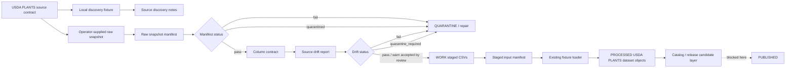

<!-- [KFM_META_BLOCK_V2]
doc_id: kfm://doc/NEEDS-VERIFICATION-usda-plants-live-source-readiness-layer
title: USDA PLANTS Live Source Readiness Layer
type: standard
version: v1
status: draft
owners: @bartytime4life (CODEOWNERS fallback; flora steward NEEDS VERIFICATION)
created: NEEDS_VERIFICATION
updated: 2026-05-08
policy_label: public
related: [docs/domains/flora/usda_plants/README.md, docs/domains/flora/usda_plants/USDA_PLANTS_NEXT_LAYER.md, docs/domains/flora/usda_plants/USDA_PLANTS_CATALOG_RELEASE_LAYER.md, docs/domains/flora/usda_plants/USDA_PLANTS_GUARDED_LIVE_WATCHER_LAYER.md, docs/domains/flora/usda_plants/USDA_PLANTS_PUBLICATION_LAYER.md, contracts/source/kansas_flora/usda_plants.md, schemas/flora/usda_plants_raw_snapshot_manifest.schema.json, schemas/flora/usda_plants_column_contract.schema.json, schemas/flora/usda_plants_source_drift_report.schema.json, schemas/flora/usda_plants_staged_input_manifest.schema.json, policy/flora/usda_plants_live_fetch.rego, tools/intake/flora/usda_plants_snapshot_intake.py, tools/quality/flora/usda_plants_column_contract_builder.py, tools/quality/flora/usda_plants_source_drift_detector.py, tools/normalize/flora/usda_plants_stage_raw_snapshot.py, tools/sources/flora/usda_plants_live_fetcher.py, tests/flora/test_usda_plants_snapshot_intake.py, tests/flora/test_usda_plants_live_fetcher.py, .github/CODEOWNERS]
tags: [kfm, flora, usda-plants, live-source-readiness, source-intake, no-network-ci, operator-snapshot, quarantine, drift-detection]
notes: [doc_id and created date require repository metadata verification; owner uses CODEOWNERS fallback until a flora steward is verified; this layer documents source readiness and operator-supplied snapshot staging, not live production ingestion, promotion, publication, public geometry, tiles, or UI runtime availability]
[/KFM_META_BLOCK_V2] -->

<a id="top"></a>

# USDA PLANTS Live Source Readiness Layer

Source-readiness layer for USDA PLANTS in KFM Flora: local source discovery, operator-supplied snapshot intake, raw snapshot manifests, column contracts, drift detection, quarantine, and staged-input handoff without CI network access or publication claims.


> [!IMPORTANT]
> **Status:** `draft`  
> **Path:** `docs/domains/flora/usda_plants/USDA_PLANTS_LIVE_SOURCE_READINESS_LAYER.md`  
> **Layer:** `usda_plants_live_source_readiness`  
> **Lifecycle placement:** `SOURCE EDGE → RAW → WORK / QUARANTINE → staged inputs → existing fixture loader`  
> **Network posture:** disabled in CI; operator-supplied snapshots only by default  
> **Promotion posture:** `not_promoted`  
> **Publication posture:** `not_published`  
> **Runtime claim:** this document does **not** prove workflow enforcement, branch protection, live USDA access, API availability, UI rendering, public map release, or production ingestion.

**Quick links:** [Purpose](#purpose) · [Repo fit](#repo-fit) · [Scope](#scope) · [Accepted inputs](#accepted-inputs) · [Exclusions](#exclusions) · [Readiness model](#readiness-model) · [Lifecycle](#lifecycle) · [Source discovery](#source-discovery-contract) · [Snapshot intake](#operator-supplied-snapshot-intake) · [Column contract](#column-contract) · [Drift detection](#drift-detection) · [Staging](#staged-input-generation) · [Policy gates](#policy-gates) · [CI](#ci-and-no-network-posture) · [Operator commands](#operator-commands) · [Definition of done](#definition-of-done)

---

## Purpose

This layer prepares USDA PLANTS source material for governed KFM Flora processing **without** turning source discovery into live ingestion and without turning staged files into publishable truth.

It answers one narrow question:

> Can an operator-supplied USDA PLANTS snapshot be identified, inventoried, checked against the expected source shape, quarantined when unsafe, normalized into deterministic staged inputs, and handed off to the existing fixture loader without weakening KFM lifecycle, source-role, rights, sensitivity, or publication controls?

The answer should remain boring and auditable:

```text
local source discovery
  + operator-supplied raw files
  + raw snapshot manifest
  + column contract
  + drift report
  + quarantine report when needed
  + deterministic WORK staging
  -> existing fixture loader
  -/-> promotion
  -/-> publication
```

This layer is deliberately **not** a scheduled watcher, not an automatic downloader, not a public map layer, and not a publication path.

[Back to top](#top)

---

## Repo fit

This file belongs under `docs/domains/flora/usda_plants/` because it is a human-facing source-lane lifecycle guide. It links to executable scripts, schemas, policy, tests, and source contracts rather than duplicating their authority.

| Surface | Path | Role | Status |
|---|---|---|---|
| Source-lane README | [`README.md`](./README.md) | USDA PLANTS navigation, boundary, layer map, and publication posture | **CONFIRMED path** |
| Fixture loader layer | [`USDA_PLANTS_NEXT_LAYER.md`](./USDA_PLANTS_NEXT_LAYER.md) | Existing deterministic fixture loader, receipts, proof manifest, and policy checks | **CONFIRMED path** |
| Catalog/release layer | [`USDA_PLANTS_CATALOG_RELEASE_LAYER.md`](./USDA_PLANTS_CATALOG_RELEASE_LAYER.md) | Catalog closure and release-candidate posture | **CONFIRMED path** |
| Guarded watcher layer | [`USDA_PLANTS_GUARDED_LIVE_WATCHER_LAYER.md`](./USDA_PLANTS_GUARDED_LIVE_WATCHER_LAYER.md) | Later manual guarded watcher and PR handoff posture | **CONFIRMED path** |
| Controlled publication layer | [`USDA_PLANTS_PUBLICATION_LAYER.md`](./USDA_PLANTS_PUBLICATION_LAYER.md) | Later sealed-package publication request, approval, receipt, audit, and rollback | **CONFIRMED path** |
| Source contract | [`../../../../contracts/source/kansas_flora/usda_plants.md`](../../../../contracts/source/kansas_flora/usda_plants.md) | Human source-admission boundary for USDA PLANTS | **CONFIRMED path** |
| Raw snapshot intake | [`../../../../tools/intake/flora/usda_plants_snapshot_intake.py`](../../../../tools/intake/flora/usda_plants_snapshot_intake.py) | Copies operator files, assigns roles, hashes files, emits raw snapshot manifest | **CONFIRMED path** |
| Column contract builder | [`../../../../tools/quality/flora/usda_plants_column_contract_builder.py`](../../../../tools/quality/flora/usda_plants_column_contract_builder.py) | Emits expected table and normalization contract | **CONFIRMED path** |
| Source drift detector | [`../../../../tools/quality/flora/usda_plants_source_drift_detector.py`](../../../../tools/quality/flora/usda_plants_source_drift_detector.py) | Checks required columns, unknown tables, duplicate columns, and quarantine need | **CONFIRMED path** |
| Stage raw snapshot | [`../../../../tools/normalize/flora/usda_plants_stage_raw_snapshot.py`](../../../../tools/normalize/flora/usda_plants_stage_raw_snapshot.py) | Normalizes, sorts, and stages accepted raw snapshot files into WORK-shaped inputs | **CONFIRMED path** |
| Live fetch helper | [`../../../../tools/sources/flora/usda_plants_live_fetcher.py`](../../../../tools/sources/flora/usda_plants_live_fetcher.py) | Plan-only and manually guarded live-fetch helper; not CI default | **CONFIRMED path** |
| Raw snapshot schema | [`../../../../schemas/flora/usda_plants_raw_snapshot_manifest.schema.json`](../../../../schemas/flora/usda_plants_raw_snapshot_manifest.schema.json) | Machine shape for raw snapshot manifest | **CONFIRMED path** |
| Column contract schema | [`../../../../schemas/flora/usda_plants_column_contract.schema.json`](../../../../schemas/flora/usda_plants_column_contract.schema.json) | Machine shape for column contract | **CONFIRMED path** |
| Staged manifest schema | [`../../../../schemas/flora/usda_plants_staged_input_manifest.schema.json`](../../../../schemas/flora/usda_plants_staged_input_manifest.schema.json) | Machine shape for staged input manifest | **CONFIRMED path** |
| Live fetch policy | [`../../../../policy/flora/usda_plants_live_fetch.rego`](../../../../policy/flora/usda_plants_live_fetch.rego) | Denies missing live-fetch plan/receipt hashes | **CONFIRMED path** |
| Snapshot intake test | [`../../../../tests/flora/test_usda_plants_snapshot_intake.py`](../../../../tests/flora/test_usda_plants_snapshot_intake.py) | Offline operator-snapshot smoke test | **CONFIRMED path** |
| Live fetcher test | [`../../../../tests/flora/test_usda_plants_live_fetcher.py`](../../../../tests/flora/test_usda_plants_live_fetcher.py) | Plan-only live-fetch smoke test | **CONFIRMED path** |
| Ownership routing | [`../../../../.github/CODEOWNERS`](../../../../.github/CODEOWNERS) | Conservative review routing until steward teams are verified | **CONFIRMED path** |

> [!NOTE]
> Paths above were verified through repository connector evidence. This authoring session did **not** have a mounted local checkout, so command execution, test results, workflow enforcement, branch rulesets, generated artifacts, dashboards, and runtime behavior remain **NEEDS VERIFICATION**.

[Back to top](#top)

---

## Scope

### What this layer owns

| Area | Responsibility | Output ceiling |
|---|---|---|
| Local source discovery | Parse a local downloads-page fixture and retain unknown links for review | Source-discovery evidence only |
| Operator-supplied snapshot intake | Inventory operator files, assign expected roles, hash files, and emit a raw snapshot manifest | RAW manifest and optional quarantine report |
| Raw snapshot manifest | Record `checklist`, `state_distribution`, `county_distribution`, unknown files, missing roles, sizes, hashes, and status | Source-intake process memory |
| Column contract | Define expected table names, required columns, optional columns, and normalization rules | Contract object and hash |
| Drift detection | Fail or quarantine when required shape is missing, empty, duplicate, or unknown | Drift report and quarantine signal |
| Quarantine routing | Block unknown or unsafe files from downstream staged-input generation | Open quarantine; no release candidate |
| Staged input generation | Normalize and sort accepted snapshot files into deterministic WORK-shaped staged CSVs | Staged input manifest |
| Fixture-loader handoff | Hand staged CSVs to the existing USDA PLANTS fixture loader path | Existing loader remains the only route to processed dataset objects |
| No-network CI posture | Keep normal tests fixture-backed and deterministic | No live USDA calls |

### What this layer does not own

| Out of scope | Correct surface |
|---|---|
| Source-admission meaning | [`contracts/source/kansas_flora/usda_plants.md`](../../../../contracts/source/kansas_flora/usda_plants.md) |
| Existing processed dataset creation | [`USDA_PLANTS_NEXT_LAYER.md`](./USDA_PLANTS_NEXT_LAYER.md) and fixture loader tooling |
| Catalog closure / release candidate assembly | [`USDA_PLANTS_CATALOG_RELEASE_LAYER.md`](./USDA_PLANTS_CATALOG_RELEASE_LAYER.md) |
| Manual guarded watcher / PR handoff | [`USDA_PLANTS_GUARDED_LIVE_WATCHER_LAYER.md`](./USDA_PLANTS_GUARDED_LIVE_WATCHER_LAYER.md) |
| Scheduled observe-only monitoring | [`USDA_PLANTS_SCHEDULED_OBSERVER_LAYER.md`](./USDA_PLANTS_SCHEDULED_OBSERVER_LAYER.md) |
| Public publication | [`USDA_PLANTS_PUBLICATION_LAYER.md`](./USDA_PLANTS_PUBLICATION_LAYER.md) |
| Public county geometry, GeoJSON, MBTiles, PMTiles, or MapLibre style output | Future geometry/tile publication layer |
| Exact occurrence or specimen evidence | Occurrence/specimen source contracts and sensitive-location policies |
| Legal protected-status authority | Appropriate legal/status source contract |
| Image/media reuse | Image/media rights workflow |
| Cultural or tribal plant-use publication | Steward/cultural-sensitivity review flow |

[Back to top](#top)

---

## Accepted inputs

Only source-bounded, reviewable, and local inputs belong in this layer.

| Input | Required condition | Normal handling |
|---|---|---|
| Local downloads-page HTML fixture | Used for discovery tests only | Parse links; preserve unknowns |
| Operator-supplied raw snapshot directory | Supplied outside CI live network path | Copy to RAW-shaped output and hash |
| `checklist.csv` | Present when required | Role: `checklist` |
| `state_distribution.csv` | Present when required | Role: `state_distribution` |
| `county_distribution.csv` | Present when required | Role: `county_distribution` |
| Unknown extra file | Any unrecognized name or non-CSV | Quarantine |
| Snapshot date | `YYYY-MM-DD` | Included in IDs and refs |
| Generated timestamp | ISO 8601 UTC | Fixed timestamp recommended for tests |
| Column contract | Built or checked before drift detection | Controls required/optional columns |
| Drift report | Must be non-failing and not require quarantine before staging | Blocks staging when unsafe |
| Raw snapshot manifest | Must have `status=pass` before staging | Blocks staging otherwise |

[Back to top](#top)

---

## Exclusions

Do not put these into this layer or treat them as allowed outputs:

- CI downloads from the real USDA endpoint.
- Scheduled live polling.
- Auto-opened or auto-merged pull requests.
- Promotion decisions.
- Publication approvals.
- Public map layers.
- County boundary geometry.
- Exact plant coordinates.
- Vector tiles, MBTiles, PMTiles, or MapLibre styles.
- Image/media reuse claims.
- Legal protected-status claims sourced only from USDA PLANTS.
- Cultural or tribal plant-use claims without review.
- Raw, work, or quarantine refs in public-facing artifacts.
- Generated AI summaries that bypass EvidenceBundle resolution.
- Any statement that live ingestion, policy enforcement, workflow enforcement, or runtime display exists without direct evidence.

> [!CAUTION]
> USDA PLANTS distribution context is not exact occurrence evidence. This layer must preserve that boundary even when county distribution fields are present.

[Back to top](#top)

---

## Readiness model

Readiness is not ingestion. This layer exists to prove that future operator-supplied USDA PLANTS snapshots can enter KFM safely **after** source-admission rules and before processed dataset creation.

| Posture | Network | Typical use | Required guard | Output ceiling |
|---|---:|---|---|---|
| `source_fixture_discovery` | Disabled | Parse local downloads-page fixture and identify expected/unknown links | Local HTML fixture | Discovery report or review notes |
| `operator_snapshot_intake` | Disabled | Stage operator-supplied source files already captured outside this run | Local raw directory + snapshot date + hashes | Raw snapshot manifest and optional quarantine report |
| `column_contract_build` | Disabled | Emit expected table and normalization contract | Fixed generated timestamp | Column contract with hash |
| `source_drift_check` | Disabled | Compare raw headers to expected contract | Raw directory + column contract | Drift report and quarantine signal |
| `work_staging` | Disabled | Normalize accepted files for existing loader | Passing raw manifest + non-failing drift report | Staged input manifest |
| `live_plan_only` | Disabled | Prepare a future live-fetch plan without downloading | `--plan-only` | Live fetch plan |
| `live_manual` | Manual guarded | Exceptional operator capture path documented by later watcher layer | `KFM_ALLOW_NETWORK=1`, operator acknowledgement, source host guard | RAW plan/receipt only; no promotion/publication |

[Back to top](#top)

---

## Lifecycle



### Lifecycle rule

```text
SOURCE EDGE
  -> RAW
  -> WORK / QUARANTINE
  -> PROCESSED
  -> CATALOG / TRIPLET
  -/-> PUBLISHED
```

This file governs the early seam only. It prepares the path into the existing fixture loader; it does not create a release candidate, approve promotion, or publish anything.

[Back to top](#top)

---

## Source discovery contract

Source discovery is local and conservative.

| Rule | Required behavior |
|---|---|
| Local fixture first | Parse local HTML fixtures in tests; do not call the live source in CI. |
| Expected roles | Recognize `checklist`, `state_distribution`, and `county_distribution` when filenames and source-readiness rules match. |
| Unknown links | Retain unknown links for review rather than silently dropping source-shape changes. |
| Download assumptions | Do not assume current endpoint shape, checksums, or file names without source verification. |
| Source host | Real network use belongs to guarded manual mode, not normal CI. |
| Publication | Source discovery cannot approve promotion or publication. |

> [!NOTE]
> USDA PLANTS source pages can change. Treat source-shape assumptions as checkable contracts, not timeless facts.

[Back to top](#top)

---

## Operator-supplied snapshot intake

Operator-supplied files remain raw evidence candidates until validation and policy gates pass.

The intake helper copies files from a local operator directory, assigns each file a role, computes hashes, records sizes, records missing required roles, and emits `raw_snapshot_manifest.json`.

| Expected file | Role | Required? | Intake behavior |
|---|---|---:|---|
| `checklist.csv` | `checklist` | Yes | Accepted if present and non-empty |
| `state_distribution.csv` | `state_distribution` | Yes | Accepted if present and non-empty |
| `county_distribution.csv` | `county_distribution` | Yes | Accepted if present and non-empty |
| Any other file | `unknown` | No | Quarantined and review-required |

### Raw snapshot manifest

The raw snapshot manifest must preserve enough process memory to explain what entered the lane.

| Field family | Requirement |
|---|---|
| Identity | `schema_version`, `object_type`, `manifest_id`, `domain=flora`, `source_id=usda_plants` |
| Source posture | `source_uri`, `network_mode` |
| Time | `snapshot_date`, `generated_at` |
| Raw files | `role`, `path`, `file_name`, `media_type`, `size_bytes`, `sha256`, `required`, `status` |
| Required roles | Expected roles and missing roles |
| Quarantine refs | Any source files blocked from downstream use |
| Status | `pass`, `fail`, or `quarantined` |
| Reason codes | Sorted finite reason codes |
| Integrity | `manifest_hash` |

### Intake reason codes

| Condition | Reason code |
|---|---|
| Unknown file is present | `USDA_PLANTS_RAW_UNKNOWN_FILE` |
| File is empty | `USDA_PLANTS_RAW_EMPTY_FILE` |
| Required role is missing | `USDA_PLANTS_RAW_MISSING_REQUIRED_FILE` |

[Back to top](#top)

---

## Column contract

The column contract is the boundary between source shape and normalized staging. It must be generated or verified before drift detection.

### Expected tables

| Table | Required columns | Optional columns |
|---|---|---|
| `checklist` | `symbol`, `scientificName`, `nationalCommonName`, `family` | `nativeStatus`, `growthHabit`, `wetlandStatus` |
| `state_distribution` | `symbol`, `state`, `presence` | none |
| `county_distribution` | `symbol`, `fips`, `presence` | none |

### Normalization rules

| Rule | Applies to | Purpose |
|---|---|---|
| `trim_whitespace` | all staged fields | deterministic comparison and stable staging |
| `preserve_scientific_name_authorship` | scientific names | avoid silently stripping authorship |
| `uppercase_symbol` | `symbol` | stable source-scoped identity |
| `uppercase_state` | `state` | stable state distribution values |
| `zero_pad_fips_to_5_digits` | `fips` | stable county FIPS join key |

> [!IMPORTANT]
> The column contract is not permission to publish. It only defines the expected local staging shape.

[Back to top](#top)

---

## Drift detection

Drift detection checks the operator-supplied snapshot against the column contract and blocks unsafe handoff.

| Drift condition | Status | Reason code | Downstream effect |
|---|---|---|---|
| Empty table/header | `fail` | `USDA_PLANTS_DRIFT_EMPTY_TABLE` | Stop |
| Duplicate column | `fail` | `USDA_PLANTS_DRIFT_DUPLICATE_COLUMN` | Stop |
| Unknown table/file | `quarantined` | `USDA_PLANTS_DRIFT_UNKNOWN_TABLE` | Quarantine required |
| Missing required column | `fail` | `USDA_PLANTS_DRIFT_MISSING_REQUIRED_COLUMN` | Quarantine required / stop |
| Unexpected column | `warn` | `USDA_PLANTS_DRIFT_UNEXPECTED_COLUMN` | Review before accepting |
| Required columns present | `pass` | none | Eligible for staging |

### Drift reading rule

```text
drift_report.status == "fail"           -> do not stage
drift_report.quarantine_required == true -> do not stage
raw_snapshot_manifest.status != "pass"  -> do not stage
```

Unknown or incomplete source shape must be visible. Do not normalize around drift silently.

[Back to top](#top)

---

## Quarantine behavior

Quarantine is a safety state, not a trash bin.

| Quarantine trigger | Required response |
|---|---|
| Unknown source file | Emit quarantine report and block staged input generation |
| Missing required role | Mark raw manifest `fail` and block staged input generation |
| Missing required column | Mark drift `fail` and block staged input generation |
| Unknown table | Mark drift `quarantined` and block staged input generation |
| Bad FIPS during staging | Stop staging and repair source/staging assumptions |
| Open quarantine refs | Do not feed release candidates or public outputs |

Quarantined snapshots must not feed release candidates, public artifacts, UI payloads, map descriptors, or Focus Mode context.

[Back to top](#top)

---

## Staged input generation

Staging is allowed only after the raw snapshot manifest passes and drift does not require quarantine.

The staging helper normalizes accepted CSVs into deterministic WORK-shaped staged inputs:

| Role | Sort key | Normalization |
|---|---|---|
| `checklist` | `symbol` | trim fields; uppercase `symbol`; preserve scientific-name authorship |
| `state_distribution` | `symbol`, `state` | trim fields; uppercase `symbol`; uppercase `state` |
| `county_distribution` | `symbol`, `fips` | trim fields; uppercase `symbol`; validate numeric FIPS; zero-pad FIPS to 5 digits |

### Staged input manifest

The staged input manifest must include:

| Field | Requirement |
|---|---|
| `object_type` | `usda_plants_staged_input_manifest` |
| `domain` | `flora` |
| `source_id` | `usda_plants` |
| `snapshot_date` | matching operator snapshot date |
| `network_mode` | `disabled` or `manual_enabled`, matching upstream evidence |
| `raw_snapshot_manifest_ref` | RAW manifest reference |
| `drift_report_ref` | drift report reference |
| `staged_files[]` | role, path, hash, and row count |
| `status` | `pass` or `fail` |
| `manifest_hash` | deterministic hash |

[Back to top](#top)

---

## How staged inputs feed the existing fixture loader

The existing fixture loader remains the only path to processed USDA PLANTS dataset objects.

```text
RAW operator snapshot
  -> raw_snapshot_manifest.json
  -> source_drift_report.json
  -> staged checklist/state/county CSVs in WORK
  -> staged_input_manifest.json
  -> existing fixture loader
  -> processed/flora/usda_plants/*.json
```

The handoff must preserve these guarantees:

| Guarantee | Why it matters |
|---|---|
| Source files are hashed before staging | Staging is traceable back to source inputs |
| Drift is checked before staging | Source shape changes cannot silently enter processed data |
| Staged rows are normalized deterministically | Loader output is reproducible |
| Staged manifest references raw and drift artifacts | Evidence chain remains inspectable |
| Existing loader owns processed output | This layer does not fork processed-object semantics |

[Back to top](#top)

---

## Policy gates

Policy in and around this layer should fail closed.

| Gate | Required behavior | Blocking outcome |
|---|---|---|
| Source admission | USDA PLANTS authority boundary is documented before use | `ABSTAIN` / `QUARANTINE` |
| Raw manifest | Required roles and hashes present | `DENY` downstream staging |
| Drift report | Missing required columns or unknown tables visible | `DENY` staging |
| Quarantine | Open quarantine refs cannot feed release candidates | `DENY` release-candidate use |
| Live fetch plan | Live plan hash required if live helper is used | `DENY` missing hash |
| Live fetch receipt | Live receipt hash required if download occurs | `DENY` missing hash |
| CI network | No real USDA calls in normal CI | `DENY` |
| Publication | No publication from this layer | `DENY` |
| Promotion | No promotion from this layer | `DENY` |
| Public geometry | No county geometry or exact occurrence geometry | `DENY` |
| Evidence Drawer / Focus | No raw/work/quarantine data as public context | `DENY` / `ABSTAIN` |

Current live-fetch Rego coverage is intentionally narrow: it denies missing `plan_hash` and missing `receipt_hash`. Treat wider enforcement as **NEEDS VERIFICATION** unless companion policy and test evidence are inspected.

[Back to top](#top)

---

## CI and no-network posture

Normal CI must remain deterministic and offline.

| CI expectation | Required behavior |
|---|---|
| Real USDA network | Denied by default |
| Source discovery | Use local HTML fixtures |
| Snapshot intake | Use local operator snapshot fixtures |
| Column contract | Build deterministic contract locally |
| Drift detection | Use local raw fixtures |
| Staging | Use local raw fixtures and fixed timestamps |
| Live fetcher | `--plan-only` test path only |
| Policy tests | Run only when OPA/toolchain availability is verified |
| Generated artifacts | Treat as test outputs unless committed under the correct lifecycle root |
| Publication | Not part of CI for this layer |

> [!WARNING]
> A passing offline test proves the fixture path, not production live ingestion. Do not upgrade fixture coverage into workflow, branch-protection, or runtime enforcement claims.

[Back to top](#top)

---

## Operator commands

Run from the repository root after confirming branch and working tree state.

### 1. Confirm checkout

```bash
pwd
git status --short
git branch --show-current || true
```

### 2. Build the column contract

```bash
OUT_DIR="/tmp/kfm-usda-plants-live-readiness"
mkdir -p "${OUT_DIR}/contracts"

python tools/quality/flora/usda_plants_column_contract_builder.py \
  --generated-at 2026-04-30T00:00:00Z \
  --out "${OUT_DIR}/contracts/usda_plants_column_contract.json"

python -m json.tool "${OUT_DIR}/contracts/usda_plants_column_contract.json"
```

### 3. Intake an operator-supplied snapshot

```bash
SNAPSHOT_DATE="2026-04-30"
GENERATED_AT="2026-04-30T00:00:00Z"
OPERATOR_RAW_DIR="tests/fixtures/flora/usda_plants/operator_snapshot/good"
RAW_OUT="${OUT_DIR}/raw/flora/usda_plants/${SNAPSHOT_DATE}"

python tools/intake/flora/usda_plants_snapshot_intake.py \
  --raw-dir "${OPERATOR_RAW_DIR}" \
  --snapshot-date "${SNAPSHOT_DATE}" \
  --generated-at "${GENERATED_AT}" \
  --out-dir "${RAW_OUT}"

python -m json.tool "${RAW_OUT}/raw_snapshot_manifest.json"
```

### 4. Detect source drift

```bash
DRIFT_OUT="${OUT_DIR}/work/flora/usda_plants/${SNAPSHOT_DATE}/source_drift_report.json"
mkdir -p "$(dirname "${DRIFT_OUT}")"

python tools/quality/flora/usda_plants_source_drift_detector.py \
  --raw-dir "${RAW_OUT}" \
  --column-contract "${OUT_DIR}/contracts/usda_plants_column_contract.json" \
  --snapshot-date "${SNAPSHOT_DATE}" \
  --generated-at "${GENERATED_AT}" \
  --out "${DRIFT_OUT}"

python -m json.tool "${DRIFT_OUT}"
```

### 5. Stage accepted inputs into WORK

```bash
STAGED_OUT="${OUT_DIR}/work/flora/usda_plants/${SNAPSHOT_DATE}/staged"

python tools/normalize/flora/usda_plants_stage_raw_snapshot.py \
  --raw-dir "${RAW_OUT}" \
  --raw-snapshot-manifest "${RAW_OUT}/raw_snapshot_manifest.json" \
  --drift-report "${DRIFT_OUT}" \
  --snapshot-date "${SNAPSHOT_DATE}" \
  --generated-at "${GENERATED_AT}" \
  --out-dir "${STAGED_OUT}"

python -m json.tool "${STAGED_OUT}/staged_input_manifest.json"
```

### 6. Plan-only live fetch check

```bash
LIVE_PLAN_OUT="${OUT_DIR}/raw/flora/usda_plants/${SNAPSHOT_DATE}/live_plan_only"

python tools/sources/flora/usda_plants_live_fetcher.py \
  --source-uri "https://plants.sc.egov.usda.gov/downloads" \
  --snapshot-date "${SNAPSHOT_DATE}" \
  --generated-at "${GENERATED_AT}" \
  --plan-only \
  --out-dir "${LIVE_PLAN_OUT}"

python -m json.tool "${LIVE_PLAN_OUT}/live_fetch_plan.json"
```

### 7. Run offline tests

```bash
python -m pytest \
  tests/flora/test_usda_plants_snapshot_intake.py \
  tests/flora/test_usda_plants_live_fetcher.py
```

### 8. Optional policy check

```bash
# Run only when OPA is installed and repo policy-test conventions are verified.
opa test policy/flora/usda_plants_live_fetch.rego policy/flora/usda_plants_live_fetch_test.rego
```

[Back to top](#top)

---

## Manual future live-download path

A future live-download path is reserved for explicit operator manual mode. It is not a CI default and not a publication shortcut.

| Guard | Required behavior |
|---|---|
| Operator acknowledgement | Required before live fetch |
| `KFM_ALLOW_NETWORK=1` | Required before live network mode |
| CI network | Refused by default |
| CI localhost exception | Requires explicit CI allow flag and localhost/127.0.0.1 source host |
| Source host | Must be USDA PLANTS or local test host |
| Writes | RAW only |
| Promotion | `false` |
| Publication | `false` |
| Receipt | Required if download occurs |
| Plan hash | Required |
| Receipt hash | Required |

> [!CAUTION]
> Before using manual live mode, reverify USDA PLANTS endpoint shape, source terms, current file names, response headers, checksum/ETag behavior, expected columns, and steward approval. A successful manual live capture still produces source-intake evidence only.

[Back to top](#top)

---

## Failure and repair behavior

| Failure | Required response |
|---|---|
| Missing required raw file | Mark manifest `fail`; repair source snapshot |
| Unknown file | Emit quarantine report; review before accepting |
| Empty raw file | Preserve reason code; repair source snapshot |
| Empty table header | Drift `fail`; do not stage |
| Duplicate column | Drift `fail`; do not stage |
| Missing required column | Drift `fail`; do not stage |
| Unexpected column | Drift `warn`; review before treating as normal |
| Non-numeric FIPS during staging | Stop; repair input or contract |
| Raw manifest not passing | Stop staging |
| Drift quarantine required | Stop staging |
| Missing live-fetch plan hash | Deny live-fetch policy |
| Missing live-fetch receipt hash | Deny live-fetch policy |
| Attempted publication | Deny; route to publication layer |
| Attempted promotion | Deny; route to governed promotion/release surface |

Preserve failure artifacts, reason codes, and quarantine refs. Do not silently delete or overwrite failed evidence.

[Back to top](#top)

---

## Review checklist

Before approving changes to this layer, verify:

- [ ] The change preserves `not_promoted` and `not_published` posture.
- [ ] Normal CI remains no-network.
- [ ] Operator-supplied snapshots remain raw evidence candidates until checks pass.
- [ ] Unknown files are quarantined, not silently ignored.
- [ ] Required roles remain explicit: `checklist`, `state_distribution`, `county_distribution`.
- [ ] Required columns remain explicit and reviewed.
- [ ] Drift detection blocks missing required columns and unknown tables.
- [ ] Staging requires a passing raw manifest and non-quarantine drift report.
- [ ] FIPS values are normalized as strings and zero-padded to 5 digits.
- [ ] Scientific-name authorship is preserved.
- [ ] Staged inputs feed the existing fixture loader instead of bypassing it.
- [ ] No public geometry, tiles, occurrence points, or MapLibre publication artifacts are introduced.
- [ ] No image reuse, legal status, cultural-use, or exact occurrence claim is inferred from USDA PLANTS.
- [ ] Any stronger claim about live ingestion, workflow enforcement, runtime behavior, or publication is backed by checked evidence.

[Back to top](#top)

---

## Definition of done

This document and layer are ready for maintained review when:

- [ ] `doc_id`, `created`, and steward owner fields are verified.
- [ ] Relative links are checked from `docs/domains/flora/usda_plants/`.
- [ ] The source contract and this layer agree on USDA PLANTS authority boundaries.
- [ ] Raw snapshot manifest, column contract, source drift report, quarantine report, and staged input manifest schemas align with generated artifacts.
- [ ] Offline snapshot-intake and live-fetch plan-only tests pass in the repo-native environment.
- [ ] Drift detector tests cover missing required columns, duplicate columns, unknown tables, and unexpected columns.
- [ ] Staging tests cover uppercase symbols/states, zero-padded FIPS, deterministic sorting, and bad FIPS failure.
- [ ] Live-fetch policy tests deny missing `plan_hash` and missing `receipt_hash`.
- [ ] No workflow claims live USDA network access unless `.github/workflows/`, protected environments, and run logs are inspected.
- [ ] No public release, promotion, geometry, or tile output is claimed by this document.
- [ ] Future guarded watcher and publication paths remain separate documents.

[Back to top](#top)

---

## Future work

| Future item | Correct next surface | Required guard |
|---|---|---|
| Richer source-shape fingerprints | This layer or schema/tool companion | Review column drift and hash behavior |
| Alias mapping expansion | Fixture loader / taxon-resolution layer | Preserve source-scoped USDA symbols |
| Operator audit UX | Guarded watcher or review console layer | Do not expose raw/work/quarantine publicly |
| Live manual watcher | Guarded watcher layer | Operator/network guards, receipt, PR handoff only |
| Scheduled observer | Scheduled observer layer | Observe-only; no release candidate or publication |
| Controlled publication | Publication layer | Sealed promoted package, human approval, audit ledger, rollback plan |
| County geometry | County geometry publication layer | FIPS join, public-safe geometry, separate policy, no exact occurrence |
| Tile archives | Tile archive publication layer | Release-backed artifacts, attribution, rollback, no raw leaks |

[Back to top](#top)

---

## Appendix

<details>
<summary>Thin original rules preserved and expanded</summary>

The original file established these core rules, all preserved here:

- prepare no-network, operator-supplied intake and staging for USDA PLANTS snapshots;
- preserve KFM lifecycle placement: `RAW → WORK/QUARANTINE → PROCESSED → CATALOG/TRIPLET → PUBLISHED`;
- make clear that this is not live ingestion;
- avoid CI downloads, promotion, publication, county geometries, and production live ingestion;
- use local HTML parsing for source discovery;
- retain unknown links;
- treat operator files as raw evidence candidates until validation and policy gates pass;
- emit raw snapshot manifests with checksums, sizes, required-role tracking, and quarantine links;
- define a canonical staged column contract for checklist/state/county tables;
- fail closed when required columns are missing;
- quarantine unknown tables/files;
- prevent quarantined snapshots from feeding release candidates;
- stage in WORK only after canonical normalization and sorting;
- hand off to the existing fixture loader;
- keep the fixture loader as the only path to processed USDA PLANTS dataset objects;
- block non-USDA URI misuse, CI network enablement, missing hashes/checksums, open quarantine, and published writes through policy or review gates;
- run tests with local fixtures only and no network;
- reserve manual future live download for explicit operator mode only;
- avoid direct live downloader and promotion/publication pipeline modifications in this layer.

</details>

<details>
<summary>Minimum negative cases to keep alive</summary>

- Missing `checklist.csv`
- Missing `state_distribution.csv`
- Missing `county_distribution.csv`
- Unknown extra file
- Empty file
- Empty table header
- Duplicate column
- Missing required column
- Unexpected column
- Unknown table
- Raw manifest `fail`
- Raw manifest `quarantined`
- Drift report `fail`
- Drift report `quarantine_required=true`
- Non-numeric FIPS
- Staged file missing hash
- Missing live-fetch plan hash
- Missing live-fetch receipt hash
- CI real USDA network call
- Non-USDA live source host
- Raw/work/quarantine ref in release candidate or public payload
- Public county geometry emitted from this layer
- Exact occurrence claim inferred from distribution context
- Legal protected-status claim from USDA PLANTS alone
- Image reuse claim without image-specific rights
- Cultural-use claim without review

</details>

<details>
<summary>Reference-style source links for maintainer review</summary>

These are source pointers only. Reverify source terms, field shapes, access behavior, cadence, file names, checksums, ETags, and response headers before any live activation.

[USDA PLANTS landing]: https://plants.sc.egov.usda.gov/home  
[USDA PLANTS downloads]: https://plants.sc.egov.usda.gov/downloads  
[USDA PLANTS Help document]: https://plants.sc.egov.usda.gov/DocumentLibrary/Pdf/PLANTS_Help_Document.pdf  
[NRCS Plants page]: https://www.nrcs.usda.gov/conservation-basics/plants  

</details>

[Back to top](#top)
