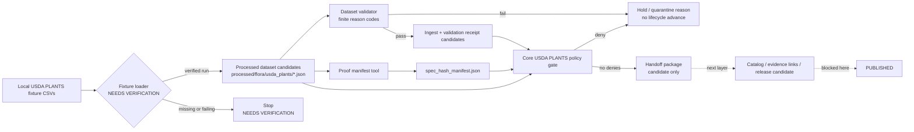

<!-- [KFM_META_BLOCK_V2]
doc_id: kfm://doc/NEEDS-VERIFICATION-usda-plants-next-layer
title: USDA PLANTS Next Layer
type: standard
version: v1
status: draft
owners: @bartytime4life
created: NEEDS_VERIFICATION
updated: 2026-05-08
policy_label: public
related: [./README.md, ./USDA_PLANTS_INGESTION.md, ./USDA_PLANTS_CATALOG_RELEASE_LAYER.md, ./USDA_PLANTS_LIVE_SOURCE_READINESS_LAYER.md, ./USDA_PLANTS_GUARDED_LIVE_WATCHER_LAYER.md, ./USDA_PLANTS_SCHEDULED_OBSERVER_LAYER.md, ./USDA_PLANTS_PUBLICATION_LAYER.md, ../../../../contracts/source/kansas_flora/usda_plants.md, ../../../../schemas/flora/usda_plants_dataset.schema.json, ../../../../tools/validators/flora/usda_plants_dataset_validator.py, ../../../../tools/proofs/flora/usda_plants_proof_manifest.py, ../../../../policy/flora/usda_plants.rego, ../../../../policy/flora/usda_plants_test.rego, ../../../../tests/flora/test_usda_plants_fixture_loader.py, ../../../../tests/flora/test_usda_plants_proof_manifest.py, ../../../../.github/CODEOWNERS]
tags: [kfm, flora, usda-plants, next-layer, fixtures, receipts, proofs, policy, no-network]
notes: [doc_id and created date require repository document-registry verification; CODEOWNERS currently routes docs to @bartytime4life but flora steward assignment and branch enforcement still need verification; this layer is not live USDA ingestion, promotion, publication, public map delivery, or runtime UI proof; fixture-loader path must be verified before loader execution is claimed]
[/KFM_META_BLOCK_V2] -->

<a id="top"></a>

# USDA PLANTS Next Layer

Deterministic bridge from USDA PLANTS fixture validation into processed dataset candidates, receipts, proof manifesting, and fail-closed policy checks.


> [!IMPORTANT]
> **Status:** `draft`  
> **Path:** `docs/domains/flora/usda_plants/USDA_PLANTS_NEXT_LAYER.md`  
> **Layer:** `usda_plants_next_layer`  
> **Lifecycle placement:** `LOCAL FIXTURE → PROCESSED candidate → receipt/proof/policy checks`  
> **Network posture:** no live USDA fetch, scrape, schedule, or watcher activation  
> **Publication posture:** no promotion, no publication, no public map layer, no county geometry, no tiles  
> **Execution posture:** validator and proof-manifest surfaces are documented; fixture-loader execution is **NEEDS VERIFICATION** until the loader path exists in the target branch and its tests pass.

**Quick links:** [Purpose](#purpose) · [Repo fit](#repo-fit) · [Current evidence posture](#current-evidence-posture) · [Accepted inputs](#accepted-inputs) · [Exclusions](#exclusions) · [Lifecycle flow](#lifecycle-flow) · [Layer contracts](#layer-contracts) · [Policy gates](#policy-gates) · [Quickstart](#quickstart) · [Failure handling](#failure-handling) · [Handoff](#handoff-to-catalog--release) · [Review checklist](#review-checklist) · [Definition of done](#definition-of-done)

---

## Purpose

This document defines the next safe USDA PLANTS slice after fixture-shape ingestion.

It exists to prove a narrow, reviewable claim:

> USDA PLANTS-shaped local fixtures can be transformed into deterministic processed dataset candidates, checked by schema/validator logic, connected to receipts, summarized in a proof manifest, and evaluated by fail-closed policy **without** live source access or public release.

This is a bridge layer. It is not the source contract, not the catalog/release layer, not the publication layer, not a MapLibre layer, and not a live connector.

```text
This layer may prepare:
  local fixture CSVs
  -> processed USDA PLANTS dataset JSON candidates
  -> ingest / validation receipt candidates
  -> spec_hash proof manifest
  -> policy-gate verdicts

This layer must not prepare:
  live USDA fetches, public outputs, publication requests, map geometry,
  vector tiles, EvidenceBundle release, Focus answers, or promotion decisions
```

[Back to top](#top)

---

## Repo fit

This file belongs under `docs/domains/flora/usda_plants/` because it is human-facing source-lane documentation. It explains how the no-network USDA PLANTS fixture slice should behave before later catalog, review, release, publication, map, or UI surfaces consume it.

Executable logic and lifecycle artifacts stay under their responsibility roots.

| Surface | Path | Role | Status |
| --- | --- | --- | --- |
| Source-lane README | [`./README.md`](./README.md) | Navigation and guardrails for USDA PLANTS layer docs | **CONFIRMED path** |
| Ingestion layer | [`./USDA_PLANTS_INGESTION.md`](./USDA_PLANTS_INGESTION.md) | No-network fixture-shape validation and reason-code posture | **CONFIRMED path** |
| Catalog/release layer | [`./USDA_PLANTS_CATALOG_RELEASE_LAYER.md`](./USDA_PLANTS_CATALOG_RELEASE_LAYER.md) | Catalog closure, evidence links, UI-safe payload refs, release candidate | **CONFIRMED path** |
| Source contract | [`../../../../contracts/source/kansas_flora/usda_plants.md`](../../../../contracts/source/kansas_flora/usda_plants.md) | Human source-admission meaning and authority boundary | **CONFIRMED path** |
| Dataset schema | [`../../../../schemas/flora/usda_plants_dataset.schema.json`](../../../../schemas/flora/usda_plants_dataset.schema.json) | Machine-checkable dataset candidate shape | **CONFIRMED path** |
| Dataset validator | [`../../../../tools/validators/flora/usda_plants_dataset_validator.py`](../../../../tools/validators/flora/usda_plants_dataset_validator.py) | Pass/fail validator with finite reason codes | **CONFIRMED path** |
| Proof manifest tool | [`../../../../tools/proofs/flora/usda_plants_proof_manifest.py`](../../../../tools/proofs/flora/usda_plants_proof_manifest.py) | Builds deterministic `spec_hash` manifest from processed dataset files | **CONFIRMED path** |
| Core policy gate | [`../../../../policy/flora/usda_plants.rego`](../../../../policy/flora/usda_plants.rego) | Dataset-level deny checks for hash, rights, provenance, FIPS, and source-role misuse | **CONFIRMED path** |
| Policy tests | [`../../../../policy/flora/usda_plants_test.rego`](../../../../policy/flora/usda_plants_test.rego) | Rego negative-path coverage for the core gate | **CONFIRMED path** |
| Fixture-loader tests | [`../../../../tests/flora/test_usda_plants_fixture_loader.py`](../../../../tests/flora/test_usda_plants_fixture_loader.py) | Test-expressed loader expectations | **CONFIRMED path** |
| Proof-manifest tests | [`../../../../tests/flora/test_usda_plants_proof_manifest.py`](../../../../tests/flora/test_usda_plants_proof_manifest.py) | Test-expressed manifest expectations | **CONFIRMED path** |
| Fixture loader | `../../../../tools/ingest/flora/usda_plants_fixture_loader.py` | Expected producer for processed candidates and receipts | **NEEDS VERIFICATION** |

> [!NOTE]
> Directory placement follows KFM responsibility-root discipline: docs explain, contracts define meaning, schemas define shape, policy decides admissibility, tests/fixtures prove behavior, tools execute work, and data/release roots hold lifecycle artifacts.

[Back to top](#top)

---

## Current evidence posture

Use the narrowest truthful label when reviewing this layer.

| Claim | Label | Basis / maintainer action |
| --- | --- | --- |
| The target Markdown file exists in the GitHub repository on the inspected `main` ref | **CONFIRMED** | Current file was fetched before this revision. |
| `docs/domains/flora/usda_plants/` is an active USDA PLANTS documentation sub-lane | **CONFIRMED** | README and adjacent layer docs were inspected. |
| The dataset schema path is present | **CONFIRMED** | `schemas/flora/usda_plants_dataset.schema.json` was inspected. |
| The dataset validator path is present | **CONFIRMED** | `tools/validators/flora/usda_plants_dataset_validator.py` was inspected. |
| The proof-manifest tool path is present | **CONFIRMED** | `tools/proofs/flora/usda_plants_proof_manifest.py` was inspected. |
| Tests reference a fixture loader at `tools/ingest/flora/usda_plants_fixture_loader.py` | **CONFIRMED** | Fixture-loader and proof-manifest tests call this path. |
| The fixture loader itself exists on the target branch | **NEEDS VERIFICATION** | Do not claim loader execution until the file is present and tests pass. |
| Receipt files are emitted by a current successful run | **UNKNOWN** | Requires a real checkout or CI artifact. |
| OPA policy is enforced by CI or branch protection | **NEEDS VERIFICATION** | Policy files and tests exist; enforcement must be checked separately. |
| This layer publishes public artifacts | **CONFIRMED false** | This layer is intentionally no-publication. |
| This layer performs live USDA network access | **CONFIRMED false by documented posture** | Live access belongs to later readiness/watcher layers only. |

> [!WARNING]
> A test expectation is not the same as a verified implementation. If the loader lands in the same PR as this doc revision, update this table and the checklist after running the loader and tests.

[Back to top](#top)

---

## Accepted inputs

Inputs must be local, deterministic, and safe to run without network access.

| Input | Expected path / shape | Required handling |
| --- | --- | --- |
| Checklist fixture CSV | `tests/fixtures/flora/usda_plants/raw/checklist.csv` | Local fixture only; not proof of live source freshness. |
| State distribution fixture CSV | `tests/fixtures/flora/usda_plants/raw/state_distribution.csv` | Broad distribution context only. |
| County distribution fixture CSV | `tests/fixtures/flora/usda_plants/raw/county_distribution.csv` | FIPS-keyed context only; not occurrence geometry. |
| Snapshot date | `YYYY-MM-DD` | Required for deterministic output context. |
| Output directory | Maintainer-provided temp or work path | Must keep generated candidates separate from public/published paths. |
| Dataset schema | `schemas/flora/usda_plants_dataset.schema.json` | Required before dataset candidate validation. |
| Validator | `tools/validators/flora/usda_plants_dataset_validator.py` | Must emit finite pass/fail and reason codes. |
| Proof-manifest tool | `tools/proofs/flora/usda_plants_proof_manifest.py` | Must read processed JSON candidates and write a manifest with dataset hashes. |
| Policy input | Processed dataset candidate JSON | Must not contain public exposure claims or raw/work/quarantine leaks. |

[Back to top](#top)

---

## Exclusions

This layer must not admit, generate, or imply:

- live USDA downloads, scraping, polling, scheduled observation, or watcher execution;
- credentials, cookies, API keys, private operator notes, or source access secrets;
- exact plant occurrence coordinates;
- rare plant exact public locations;
- legal protected-status claims;
- image/media reuse claims;
- cultural or tribal plant-use claims;
- county geometry, public GeoJSON, vector tiles, MBTiles, PMTiles, or MapLibre sources;
- EvidenceBundle release, public Evidence Drawer payloads, Focus Mode answers, or public API payloads;
- release manifests, promotion decisions, publication receipts, rollback cards, or public audit ledgers;
- direct public access to RAW, WORK, QUARANTINE, local fixtures, or generated work paths;
- a claim that passing validation equals publication approval.

> [!CAUTION]
> USDA PLANTS county/state distribution context is source-bounded distribution context. It is not exact occurrence evidence, legal status authority, image-rights clearance, or public release approval.

[Back to top](#top)

---

## Lifecycle flow

This layer sits after ingestion validation and before catalog/release closure.



### State transition rule

```text
LOCAL FIXTURE
  -> PROCESSED DATASET CANDIDATE
  -> RECEIPT CANDIDATES
  -> PROOF MANIFEST
  -> POLICY VERDICT
  -/-> CATALOG
  -/-> RELEASE_CANDIDATE
  -/-> PUBLISHED
```

Blocked arrows are intentional. Catalog closure belongs to `USDA_PLANTS_CATALOG_RELEASE_LAYER.md`; publication belongs to `USDA_PLANTS_PUBLICATION_LAYER.md`.

[Back to top](#top)

---

## Layer contracts

### 1. Fixture-loader contract

The loader contract is the central contract for this layer, but loader execution remains **NEEDS VERIFICATION** until the target branch contains the loader file and the tests pass.

| Requirement | Expected behavior |
| --- | --- |
| Command shape | Accepts `--checklist`, `--states`, `--counties`, `--snapshot-date`, and `--out-dir`. |
| Network posture | Reads local CSV fixtures only. |
| Dataset output | Writes deterministic JSON files under `processed/flora/usda_plants/`. |
| Receipt output | Writes `ingest_receipt.json` and `validation_receipt.json` under `receipts/flora/usda_plants/`. |
| Determinism | Repeated runs over the same fixtures produce equivalent outputs after volatile timestamps are ignored. |
| Validation | Each processed dataset candidate passes the dataset validator before handoff. |
| Public exposure | Does not write to `data/published/`, `release/`, public map directories, or UI runtime paths. |

Expected output shape:

```text
<out-dir>/
├── processed/
│   └── flora/
│       └── usda_plants/
│           ├── ACMI2.json
│           └── SORGH2.json
└── receipts/
    └── flora/
        └── usda_plants/
            ├── ingest_receipt.json
            └── validation_receipt.json
```

### 2. Dataset-validation contract

The validator must check both schema shape and KFM-specific misuse conditions.

| Check family | Required result |
| --- | --- |
| JSON Schema availability | Missing schema yields `schema.missing`. |
| `jsonschema` dependency | Missing dependency yields `dependency.jsonschema_missing`. |
| PLANTS symbol | Missing or malformed symbol yields `field.symbol.invalid`. |
| Scientific name | Missing author token yields `field.scientific_name.missing_author`. |
| Family | Empty family yields `field.family.empty`. |
| License | Non-expected license yields `field.license.invalid`. |
| Rights holder | Non-expected rights holder yields `field.rights_holder.invalid`. |
| County FIPS | Bad FIPS yields `field.county_fips.invalid:<index>`. |
| `spec_hash` | Top-level/property mismatch yields `field.spec_hash.mismatch`. |

Expected validator result shape:

```json
{
  "result": "pass",
  "reason_codes": []
}
```

or:

```json
{
  "result": "fail",
  "reason_codes": ["field.scientific_name.missing_author"]
}
```

### 3. Receipt contract

Receipts are process memory, not publication proof.

| Receipt | Required role |
| --- | --- |
| `receipts/flora/usda_plants/ingest_receipt.json` | Records fixture inputs, snapshot date, row counts, output refs, and run status. |
| `receipts/flora/usda_plants/validation_receipt.json` | Records validator ID, dataset refs, pass/fail counts, and reason-code summary. |

Receipts must not silently become release authority. Later release work must still build catalog records, evidence links, release candidates, approval objects, publication receipts, and rollback targets.

### 4. Proof-manifest contract

The proof manifest tool builds a deterministic manifest from processed dataset candidates.

| Field | Requirement |
| --- | --- |
| `schema_version` | `1.0.0` |
| `object_type` | `usda_plants_spec_hash_manifest` |
| `algorithm` | `sha256` |
| `canonicalization` | Documents sorted-key compact JSON canonicalization used by the tool |
| `dataset_count` | Count of processed dataset JSON files |
| `datasets[]` | Dataset ID, PLANTS symbol, file name, and `spec_hash` |
| `manifest_hash` | `sha256:<64 hex chars>` |

> [!NOTE]
> The proof manifest proves hash inventory for processed fixture candidates. It does not prove source freshness, source rights, publication approval, or public artifact integrity.

### 5. Policy-gate contract

The core Rego policy must deny obvious misuse before the layer can hand off to catalog/release work.

| Deny code | Meaning |
| --- | --- |
| `USDA_PLANTS_MISSING_SPEC_HASH` | Dataset candidate has no top-level `spec_hash`. |
| `USDA_PLANTS_SPEC_HASH_MISMATCH` | Top-level and property `spec_hash` values differ. |
| `USDA_PLANTS_NON_PUBLIC_POLICY` | Dataset candidate does not carry `policy_label=public`. |
| `USDA_PLANTS_BAD_LICENSE` | Dataset candidate does not carry expected USDA/public-domain license text. |
| `USDA_PLANTS_BAD_RIGHTS_HOLDER` | Dataset candidate does not carry expected USDA rights holder. |
| `USDA_PLANTS_MISSING_PROVENANCE` | Dataset candidate lacks source provenance. |
| `USDA_PLANTS_RAW_OUTPUT_REFERENCE` | Candidate leaks raw/work/quarantine-like refs into unsafe fields. |
| `USDA_PLANTS_BAD_FIPS` | County distribution contains malformed FIPS. |
| `USDA_PLANTS_MISSING_AUTHOR` | Scientific name lacks the expected author token. |

[Back to top](#top)

---

## Policy gates

This layer should be treated as an admission gate into later catalog/release work.

| Gate | Required pass condition | Failure response |
| --- | --- | --- |
| Loader presence | Loader file exists at the expected path or docs/tests are updated to the real path | Stop; mark loader execution **NEEDS VERIFICATION** |
| Local-only input | Loader reads fixture CSVs only | Stop; move live behavior to readiness/watcher layers |
| Dataset schema | Candidate conforms to `usda_plants_dataset.schema.json` | Fail validation; do not produce handoff package |
| Dataset validator | Candidate returns `result=pass` with no reason codes | Hold / quarantine candidate |
| Receipt closure | Ingest and validation receipts exist for the run | Hold; do not hand off to catalog/release |
| Proof closure | Manifest count matches processed dataset count | Hold; rebuild manifest or repair inputs |
| Core policy | Rego policy returns no denies | Hold; record deny codes |
| No public write | No output writes to published/release/map/UI public surfaces | Fail; repair writer |
| Source boundary | Distribution context is not upgraded into occurrence/legal/image/cultural authority | Deny / abstain / review |
| Handoff readiness | All refs point to processed candidates, receipts, proof manifest, and policy refs | Allow catalog/release layer to consume |

[Back to top](#top)

---

## Quickstart

Run these commands from the repository root after confirming a real checkout.

### 1. Confirm branch, docs, and owner routing

```bash
git status --short
git branch --show-current || true

sed -n '1,240p' docs/domains/flora/usda_plants/USDA_PLANTS_NEXT_LAYER.md
sed -n '1,220p' .github/CODEOWNERS
```

### 2. Verify the fixture-loader precondition

```bash
test -f tools/ingest/flora/usda_plants_fixture_loader.py || {
  echo "NEEDS_VERIFICATION: expected fixture loader is missing"
  exit 1
}
```

### 3. Run the loader contract tests

```bash
python -m pytest tests/flora/test_usda_plants_fixture_loader.py
```

### 4. Run the proof-manifest tests

```bash
python -m pytest tests/flora/test_usda_plants_proof_manifest.py
```

### 5. Run validator and policy checks

```bash
python -m pytest tests/flora/test_usda_plants_dataset_validator.py

# Optional: run only when OPA is installed and pinned in the repo environment.
opa test policy/flora/usda_plants.rego policy/flora/usda_plants_test.rego
```

### 6. Manual no-network run pattern

```bash
SNAPSHOT_DATE="2026-04-30"
OUT_DIR="/tmp/kfm-usda-plants-next-layer"

python tools/ingest/flora/usda_plants_fixture_loader.py \
  --checklist tests/fixtures/flora/usda_plants/raw/checklist.csv \
  --states tests/fixtures/flora/usda_plants/raw/state_distribution.csv \
  --counties tests/fixtures/flora/usda_plants/raw/county_distribution.csv \
  --snapshot-date "${SNAPSHOT_DATE}" \
  --out-dir "${OUT_DIR}"

python tools/proofs/flora/usda_plants_proof_manifest.py \
  --processed-dir "${OUT_DIR}/processed/flora/usda_plants" \
  --out "${OUT_DIR}/proofs/flora/usda_plants/spec_hash_manifest.json"
```

> [!WARNING]
> Do not copy these outputs into `data/published/` or treat them as release artifacts. This is a no-network candidate-generation and proof-inventory path only.

[Back to top](#top)

---

## Failure handling

| Failure | Required response |
| --- | --- |
| Fixture loader missing | Mark loader execution **NEEDS VERIFICATION**; do not claim receipts or processed outputs. |
| Raw fixture CSV missing | Stop; fixtures are not complete. |
| Loader reads network or source URLs | Stop; move behavior to live-readiness / guarded-watcher layer. |
| Dataset schema missing | Stop; do not infer schema from prose. |
| Validator dependency missing | Mark validation incomplete; do not advance candidate. |
| Validator fails author token, FIPS, license, rights, or hash checks | Hold candidate and preserve reason codes. |
| Receipt missing | Stop; no handoff to proof/catalog layer. |
| Manifest count mismatch | Stop; compare processed candidates and proof inputs. |
| Manifest hash missing or malformed | Stop; regenerate or repair proof tool. |
| Rego denies | Hold candidate and record deny codes. |
| Public output appears | Treat as policy violation; remove or move to controlled publication layer with gates. |
| USDA distribution context is converted to occurrence evidence | Deny claim; route to occurrence/specimen source review. |
| Legal protected-status claim appears | Abstain unless a legal/status source supports it. |
| Image or cultural-use claim appears | Deny or route to appropriate review workflow. |

[Back to top](#top)

---

## Handoff to catalog / release

The next layer may consume this layer only when the handoff package is complete.

### Handoff package

| Component | Required condition |
| --- | --- |
| Processed dataset candidates | Present under `processed/flora/usda_plants/` and validator-passing |
| Ingest receipt | Present and source-bounded |
| Validation receipt | Present with pass/fail counts and reason-code summary |
| Proof manifest | Present with one `spec_hash` entry per dataset candidate |
| Core policy verdict | No deny codes for handoff input |
| Source boundary caveats | Preserved in docs, candidate metadata, and later Evidence Drawer payloads |
| No-public-output proof | No generated public map, published artifact, tile, release manifest, or promotion decision |

### What the next layer adds

`USDA_PLANTS_CATALOG_RELEASE_LAYER.md` owns:

- evidence-link objects;
- catalog closure;
- DCAT/STAC/PROV-like companion records;
- release-candidate manifesting;
- Evidence Drawer payload refs;
- draft map contract refs;
- blockers, `not_promoted`, and `not_published` state.

This layer must not duplicate those responsibilities.

[Back to top](#top)

---

## Review checklist

Before approving a change to this file or layer:

- [ ] The KFM meta block is present and unresolved values are reviewable.
- [ ] The document still says no-network, no live connector, no promotion, and no publication.
- [ ] The fixture-loader path is either verified or clearly marked **NEEDS VERIFICATION**.
- [ ] Loader tests, proof-manifest tests, dataset-validator tests, and policy tests are listed separately.
- [ ] Receipt and proof language does not imply release approval.
- [ ] USDA PLANTS distribution context remains separate from exact occurrence evidence.
- [ ] Legal protected-status, image-rights, cultural-use, and rare-location claims remain denied, abstained, or review-gated.
- [ ] No public client is routed to raw fixtures, generated work paths, live USDA surfaces, or internal stores.
- [ ] Relative links resolve from `docs/domains/flora/usda_plants/`.
- [ ] Any changed schema, validator, policy, fixture, receipt, proof, or test path is reflected in adjacent layer docs.
- [ ] The handoff to catalog/release stays blocked unless processed candidates, receipts, proof manifest, and policy verdict are complete.

[Back to top](#top)

---

## Definition of done

This document is ready to move from `draft` toward `review` when:

- [ ] `doc_id` is assigned from the repo-native document registry.
- [ ] `created` date is verified from git history or the document registry.
- [ ] Flora steward ownership is verified beyond fallback CODEOWNERS routing.
- [ ] `tools/ingest/flora/usda_plants_fixture_loader.py` exists at the expected path or every reference is updated to the actual path.
- [ ] `python -m pytest tests/flora/test_usda_plants_fixture_loader.py` passes in the repo-native environment.
- [ ] `python -m pytest tests/flora/test_usda_plants_proof_manifest.py` passes in the repo-native environment.
- [ ] `python -m pytest tests/flora/test_usda_plants_dataset_validator.py` passes in the repo-native environment.
- [ ] OPA availability and policy test execution are either confirmed or tracked as **NEEDS VERIFICATION**.
- [ ] Generated output is inspected to confirm no public write, geometry write, tile write, release write, or UI runtime write occurs.
- [ ] Adjacent docs agree on layer ordering: ingestion → next layer → catalog/release → live readiness / watcher / observer → controlled publication.
- [ ] Source contract caveats are preserved in any later catalog, Evidence Drawer, or release-candidate payload.
- [ ] No publication, promotion, API, map, or Focus Mode readiness claim is made without release-backed evidence.

[Back to top](#top)

---

## Open verification

| Item | Status | How to close |
| --- | --- | --- |
| `doc_id` | **NEEDS VERIFICATION** | Assign from document registry. |
| Created date | **NEEDS VERIFICATION** | Inspect git history or document registry. |
| Flora steward | **NEEDS VERIFICATION** | Verify CODEOWNERS, team slug, or steward register. |
| Loader file | **NEEDS VERIFICATION** | Confirm `tools/ingest/flora/usda_plants_fixture_loader.py` exists on the target branch. |
| Loader execution | **NEEDS VERIFICATION** | Run fixture-loader tests in a real checkout or CI. |
| Receipt contents | **NEEDS VERIFICATION** | Inspect generated `ingest_receipt.json` and `validation_receipt.json`. |
| Proof manifest determinism | **NEEDS VERIFICATION** | Run proof-manifest tests with fixed inputs. |
| OPA policy enforcement | **NEEDS VERIFICATION** | Run OPA tests and inspect workflow/ruleset enforcement. |
| Branch protection | **UNKNOWN** | Inspect repository settings. |
| Release artifacts | **UNKNOWN / not claimed** | Inspect `release/`, `data/proofs/`, `data/receipts/`, and `data/published/` only after release work. |
| Public map/UI behavior | **UNKNOWN / not claimed** | Inspect layer registry, UI payloads, and governed API after publication layer work. |

[Back to top](#top)

---

## Appendix

<details>
<summary>Minimum negative cases to keep alive</summary>

| Negative case | Expected outcome |
| --- | --- |
| Missing `spec_hash` | Policy deny |
| Top-level/property `spec_hash` mismatch | Validator fail and policy deny |
| Non-public policy label | Policy deny |
| Bad license | Validator fail and policy deny |
| Bad rights holder | Validator fail and policy deny |
| Missing provenance source URI | Policy deny |
| Raw/work/quarantine-like reference leak | Policy deny |
| Bad county FIPS | Validator fail and policy deny |
| Missing scientific author token | Validator fail and policy deny |
| Loader tries live network access | Layer violation |
| County distribution converted to exact occurrence | Deny / abstain |
| Legal status inferred from PLANTS alone | Abstain / deny |
| Image reuse inferred from PLANTS | Deny |
| Cultural-use claim emitted without review | Deny / review required |
| Publication claim emitted from this layer | Deny |

</details>

<details>
<summary>Change impact map</summary>

| Change | Required companion update |
| --- | --- |
| Loader path changes | This doc, fixture-loader tests, catalog/release builder commands |
| Raw fixture CSV shape changes | Loader tests, dataset schema, validator, source contract |
| Dataset schema changes | Validator, valid/invalid fixtures, policy, ingestion doc |
| Validator reason codes change | Tests, policy docs, review checklist, Evidence Drawer payload docs |
| Receipt fields change | Next layer doc, catalog/release doc, release-candidate builder |
| Proof manifest fields change | Proof tests, catalog builder, release-candidate builder |
| Core policy deny codes change | Policy tests, this doc, source-lane README |
| Handoff package changes | Catalog/release layer and release-candidate schema |
| Public output introduced | Move to publication/geometry/tile layer with release and rollback gates |

</details>

<details>
<summary>Maintainer source pointers for future re-verification</summary>

These source pointers are recorded for maintainer review only. They do not activate live ingestion.

[USDA PLANTS landing]: https://plants.sc.egov.usda.gov/home  
[USDA PLANTS downloads]: https://plants.sc.egov.usda.gov/downloads  
[USDA PLANTS state search]: https://plants.sc.egov.usda.gov/state-search  
[data.gov PLANTS dataset]: https://catalog.data.gov/dataset/plant-list-of-accepted-nomenclature-taxonomy-and-symbols-plants-database  

</details>

[Back to top](#top)
