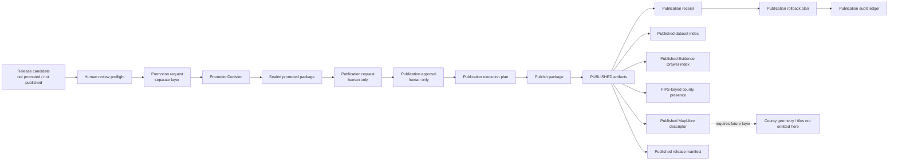

<!-- [KFM_META_BLOCK_V2]
doc_id: kfm://doc/TODO-uuid-usda-plants-publication-layer
title: USDA PLANTS Controlled Publication Layer
type: standard
version: v1
status: draft
owners: TODO: verify CODEOWNERS; adjacent USDA PLANTS docs route ownership through @bartytime4life or NEEDS_VERIFICATION-flora-steward
created: TODO-YYYY-MM-DD
updated: 2026-05-08
policy_label: public
related: [./README.md, ./USDA_PLANTS_CATALOG_RELEASE_LAYER.md, ./USDA_PLANTS_HUMAN_REVIEW_PREFLIGHT_LAYER.md, ./USDA_PLANTS_COUNTY_GEOMETRY_PUBLICATION_LAYER.md, ./USDA_PLANTS_TILE_ARCHIVE_PUBLICATION_LAYER.md, ./USDA_PLANTS_EXTERNAL_CDN_DEPLOYMENT_LAYER.md, ../../../../contracts/source/kansas_flora/usda_plants.md, ../../../../policy/flora/usda_plants_publication.rego, ../../../../policy/flora/usda_plants_publication_test.rego, ../../../../schemas/flora/usda_plants_publication_request.schema.json, ../../../../schemas/flora/usda_plants_publication_approval.schema.json, ../../../../schemas/flora/usda_plants_publication_execution_plan.schema.json, ../../../../schemas/flora/usda_plants_publication_receipt.schema.json, ../../../../schemas/flora/usda_plants_publication_rollback_plan.schema.json, ../../../../schemas/flora/usda_plants_publication_audit_ledger.schema.json, ../../../../tools/publication/flora/usda_plants_publication_request_builder.py, ../../../../tools/publication/flora/usda_plants_publication_approval_builder.py, ../../../../tools/publication/flora/usda_plants_publication_execution_plan_builder.py, ../../../../tools/publication/flora/usda_plants_publish_package.py, ../../../../tools/publication/flora/usda_plants_publication_rollback_plan_builder.py, ../../../../tools/publication/flora/usda_plants_publication_audit_ledger_builder.py]
tags: [kfm, flora, usda-plants, publication, published-artifacts, release-manifest, rollback, evidence-drawer, maplibre, public-safe]
notes: [doc_id, original created date, CODEOWNERS owner, and final policy label require repository verification before published status; this document revises a thin publication-layer note into a controlled-publication operating guide; it does not prove workflow enforcement, protected environments, runtime API behavior, UI rendering, branch protection, or external deployment]
[/KFM_META_BLOCK_V2] -->

<a id="top"></a>

# USDA PLANTS Controlled Publication Layer

Human-approved publication guidance for sealed USDA PLANTS promoted packages that emit only public-safe artifacts, release manifests, receipts, audit ledgers, and rollback plans.


> [!IMPORTANT]
> **Status:** `draft`  
> **Path:** `docs/domains/flora/usda_plants/USDA_PLANTS_PUBLICATION_LAYER.md`  
> **Authority level:** standard source-lane layer document  
> **Lifecycle placement:** `PROMOTED_PACKAGE → PUBLICATION_REQUEST → PUBLICATION_APPROVAL → PUBLICATION_EXECUTION_PLAN → PUBLISHED → PUBLICATION_RECEIPT → PUBLICATION_AUDIT_LEDGER → ROLLBACK_PLAN`  
> **Publication posture:** human-approved, sealed-package-only, public-safe outputs only  
> **Runtime claim:** this document does **not** prove workflow enforcement, runtime route behavior, public UI rendering, branch protection, or external CDN deployment.

**Quick jumps:** [Purpose](#purpose) · [Repo fit](#repo-fit) · [Accepted inputs](#accepted-inputs) · [Exclusions](#exclusions) · [Lifecycle placement](#lifecycle-placement) · [Publication contract](#publication-contract) · [Builder flow](#builder-flow) · [Published artifacts](#published-artifacts) · [Policy gates](#policy-gates) · [Validation checklist](#validation-checklist) · [Rollback and correction](#rollback-and-correction) · [Definition of done](#definition-of-done)

---

## Purpose

This layer defines how USDA PLANTS material becomes **published public-safe KFM output** after promotion has already sealed a candidate package.

It exists to keep one line bright:

> Promotion prepares and seals an internal package. Publication emits public-safe artifacts from that sealed package under human approval, policy checks, release hashes, receipts, audit ledger, and rollback plan.

### This layer does

| It does | Meaning |
|---|---|
| Require a sealed promoted package | Publication starts only from a package with `sealed=true`. |
| Require human publication request and approval | Non-human request/approval is refused by the publication builders and policy. |
| Emit only public-safe artifacts | Outputs are dataset index, Evidence Drawer index, FIPS-keyed county presence, map descriptor, release manifest, receipt, audit ledger, and rollback plan. |
| Preserve KFM source boundaries | USDA PLANTS remains taxonomy / symbol / broad distribution context, not exact occurrence or legal-status authority. |
| Keep spatial precision constrained | County presence is FIPS-keyed; this layer emits no county geometry, coordinates, or vector tiles. |
| Make rollback inspectable | A rollback plan exists for each published release and requires human approval for supersession. |

### This layer does not

| It does not | Correct home |
|---|---|
| Fetch USDA data | Live-source readiness or guarded watcher layers |
| Review source terms or source authority | USDA PLANTS source contract and human review preflight layer |
| Create promotion decisions | Promotion layer / release-state objects |
| Publish county geometry | County geometry publication layer |
| Publish PMTiles, MBTiles, vector tiles, or tile archives | Tile archive publication layer |
| Deploy to GitHub Pages, Cloudflare, or any external host | Static / external CDN deployment layers |
| Prove UI or API runtime behavior | Governed API, web/UI, and runtime proof surfaces |
| Certify legal protected status, image reuse, or exact occurrence | Separate status, image-rights, or occurrence authority lanes |

[Back to top](#top)

---

## Repo fit

`docs/domains/flora/usda_plants/USDA_PLANTS_PUBLICATION_LAYER.md` is a **human-facing publication-layer guide** under the USDA PLANTS source lane. Executable policy, schemas, publication tools, emitted artifacts, and release evidence remain under their own responsibility roots.

| Direction | Path | Role | Status |
|---|---|---|---:|
| Source-lane README | [`./README.md`](./README.md) | Source boundary, layer map, lifecycle posture, and reviewer checklist | **CONFIRMED path** |
| Catalog/release-candidate layer | [`./USDA_PLANTS_CATALOG_RELEASE_LAYER.md`](./USDA_PLANTS_CATALOG_RELEASE_LAYER.md) | Upstream release-candidate closure; not promoted or published | **CONFIRMED path** |
| Human review preflight | [`./USDA_PLANTS_HUMAN_REVIEW_PREFLIGHT_LAYER.md`](./USDA_PLANTS_HUMAN_REVIEW_PREFLIGHT_LAYER.md) | Review and preflight artifacts before promotion request | **CONFIRMED path** |
| County geometry layer | [`./USDA_PLANTS_COUNTY_GEOMETRY_PUBLICATION_LAYER.md`](./USDA_PLANTS_COUNTY_GEOMETRY_PUBLICATION_LAYER.md) | Separate reviewed county-boundary GeoJSON publication | **CONFIRMED path** |
| Tile archive layer | [`./USDA_PLANTS_TILE_ARCHIVE_PUBLICATION_LAYER.md`](./USDA_PLANTS_TILE_ARCHIVE_PUBLICATION_LAYER.md) | Separate tile/archive publication; not owned here | **CONFIRMED path** |
| External CDN layer | [`./USDA_PLANTS_EXTERNAL_CDN_DEPLOYMENT_LAYER.md`](./USDA_PLANTS_EXTERNAL_CDN_DEPLOYMENT_LAYER.md) | Optional guarded deployment after static artifacts already exist | **CONFIRMED path** |
| Source contract | [`../../../../contracts/source/kansas_flora/usda_plants.md`](../../../../contracts/source/kansas_flora/usda_plants.md) | Source-admission meaning and authority boundary | **CONFIRMED path** |
| Publication policy | [`../../../../policy/flora/usda_plants_publication.rego`](../../../../policy/flora/usda_plants_publication.rego) | Denies missing approval, unsealed package, missing hashes, and auto-merge claims | **CONFIRMED path** |
| Publication policy test | [`../../../../policy/flora/usda_plants_publication_test.rego`](../../../../policy/flora/usda_plants_publication_test.rego) | Minimal clean-input policy test | **CONFIRMED path** |
| Request schema | [`../../../../schemas/flora/usda_plants_publication_request.schema.json`](../../../../schemas/flora/usda_plants_publication_request.schema.json) | Machine shape for request object | **CONFIRMED path** |
| Request builder | [`../../../../tools/publication/flora/usda_plants_publication_request_builder.py`](../../../../tools/publication/flora/usda_plants_publication_request_builder.py) | Builds human publication request from sealed promoted package and promotion evidence | **CONFIRMED path** |
| Approval builder | [`../../../../tools/publication/flora/usda_plants_publication_approval_builder.py`](../../../../tools/publication/flora/usda_plants_publication_approval_builder.py) | Builds human approval / rejection / needs-changes / abstain artifact | **CONFIRMED path** |
| Execution plan builder | [`../../../../tools/publication/flora/usda_plants_publication_execution_plan_builder.py`](../../../../tools/publication/flora/usda_plants_publication_execution_plan_builder.py) | Builds publication plan and guards | **CONFIRMED path** |
| Publisher | [`../../../../tools/publication/flora/usda_plants_publish_package.py`](../../../../tools/publication/flora/usda_plants_publish_package.py) | Materializes public-safe published package and receipt | **CONFIRMED path** |
| Rollback plan builder | [`../../../../tools/publication/flora/usda_plants_publication_rollback_plan_builder.py`](../../../../tools/publication/flora/usda_plants_publication_rollback_plan_builder.py) | Builds human-approved supersession rollback plan | **CONFIRMED path** |
| Audit ledger builder | [`../../../../tools/publication/flora/usda_plants_publication_audit_ledger_builder.py`](../../../../tools/publication/flora/usda_plants_publication_audit_ledger_builder.py) | Hashes request, approval, plan, outputs, receipt, rollback, and promotion evidence | **CONFIRMED path** |

> [!NOTE]
> The paths above are confirmed as repository surfaces. Execution maturity, branch protection, CI enforcement, protected environments, runtime API behavior, and deployed UI behavior remain **NEEDS VERIFICATION** unless checked in the active repository environment.

[Back to top](#top)

---

## Accepted inputs

This layer accepts only publication-ready references from upstream governed surfaces.

| Input | Required shape | Why it belongs here |
|---|---|---|
| Sealed promoted package | `promoted/flora/usda_plants/<snapshot_date>/promoted_package.json` or repo-equivalent | The publisher reads only a package that has already passed promotion and has `sealed=true`. |
| Promotion receipt | Hash-bearing promotion receipt reference | Keeps the promotion-to-publication chain inspectable. |
| Promotion audit ledger | Hash-bearing promotion audit ledger reference | Links publication to the internal promotion proof chain. |
| Human publication request | `usda_plants_publication_request` | Captures request intent, requester, allowed outputs, blocked outputs, and request hash. |
| Human publication approval | `usda_plants_publication_approval` | Captures approver, decision, approval conditions, and approval hash. |
| Publication execution plan | `usda_plants_publication_execution_plan` | Defines target root, output plan, and safety guards. |
| Snapshot date | `YYYY-MM-DD` | Provides stable output path and release identity. |
| Generated timestamp | ISO 8601 UTC | Supports deterministic local tests and auditability. |

### Accepted nearby, not here

| Material | Correct home | Reason |
|---|---|---|
| Source rows, snapshots, raw profile pages | `data/raw/`, `data/work/`, or `data/quarantine/` after source review | Publication docs must not store source payloads. |
| Review packets and preflight records | Human review preflight layer / review root | Review and preflight are upstream. |
| Promotion decisions | Promotion/release-state root | Promotion is a separate state transition. |
| Published artifact bytes | `data/published/flora/usda_plants/<snapshot_date>/` or repo-equivalent | Published outputs are emitted artifacts, not documentation. |
| Receipts and audit ledgers | `data/receipts/`, `data/proofs/`, `release/`, or repo-equivalent | Process memory and release proof remain separate. |
| External deployment packets | Deployment or external CDN layer | Hosting does not belong to the publication layer itself. |

[Back to top](#top)

---

## Exclusions

Do **not** treat this layer as permission to create or expose:

- live USDA PLANTS downloads;
- raw, work, or quarantine references in public artifacts;
- precise coordinates, occurrence points, locality strings, geometry, bbox fields, or hidden coordinate fields;
- county boundary GeoJSON;
- vector tiles, PMTiles, MBTiles, TileJSON, or tile source refs;
- legal protected-status claims sourced only from USDA PLANTS;
- image reuse claims without image-specific rights;
- cultural or tribal plant-use claims without steward-aware review;
- automatic publication, automatic promotion, automatic PR creation, or auto-merge behavior;
- direct public UI/API reads from internal lifecycle zones;
- external CDN deployment or DNS changes;
- generated AI summaries that do not resolve through EvidenceBundles and policy outcomes.

> [!CAUTION]
> USDA PLANTS county distribution context can become a public-safe **FIPS-keyed presence product** in this layer. It must not become exact occurrence geometry or a protected-status claim.

[Back to top](#top)

---

## Lifecycle placement

USDA PLANTS publication is downstream of source intake, fixture validation, catalog closure, review, preflight, promotion, and sealing.



### State transition rule

```text
PROMOTED_PACKAGE
  -> PUBLICATION_REQUEST
  -> PUBLICATION_APPROVAL
  -> PUBLICATION_EXECUTION_PLAN
  -> PUBLISHED
  -> PUBLICATION_RECEIPT
  -> PUBLICATION_ROLLBACK_PLAN
  -> PUBLICATION_AUDIT_LEDGER
```

The transition is governed. It is not a file copy, not an auto-merge, not a scheduled task, and not a UI convenience export.

[Back to top](#top)

---

## Publication contract

### 1. Publication request

A publication request is a human request to publish from a sealed promoted package.

| Field / behavior | Required value or posture |
|---|---|
| `object_type` | `usda_plants_publication_request` |
| `intent` | `publish_public_safe_flora_dataset` |
| `target_stage` | `published` |
| `publication_state` | `requested` |
| `requested_by.requester_type` | `human` |
| Required upstream refs | promoted package, promotion receipt, promotion audit ledger |
| Allowed outputs | release manifest, dataset index, Evidence Drawer index, county presence, map descriptor |
| Blocked outputs | precise coordinates, county geometry, vector tiles, raw files, work files, quarantine files |
| Hash | `request_hash` |

### 2. Publication approval

Publication approval must be human and decision-bearing.

| Field / behavior | Required value or posture |
|---|---|
| `object_type` | `usda_plants_publication_approval` |
| `approver.approver_type` | `human` |
| Allowed decisions | `approved`, `rejected`, `needs_changes`, `abstain` |
| Publish path allowed only when | `decision=approved` |
| Conditions | no precise coordinates, no county geometry, no vector tiles, source attribution required |
| Hash | `approval_hash` |

### 3. Publication execution plan

The execution plan binds an approved request to the exact target root and output list.

| Field / behavior | Required value or posture |
|---|---|
| `object_type` | `usda_plants_publication_execution_plan` |
| `target_root` | `published/flora/usda_plants/<snapshot_date>` |
| Requires approval | `true` |
| Requires promoted package | `true` |
| Writes published only | `true` |
| Allows precise coordinates | `false` |
| Allows county geometry | `false` |
| Allows vector tiles | `false` |
| Allows raw/work/quarantine refs | `false` |
| Hash | `plan_hash` |

### 4. Publication execution

Publication execution materializes derived public-safe artifacts and records a receipt. The publisher must reject coordinate-like payloads before writing public outputs.

| Output | Path shape | Public role |
|---|---|---|
| Published release manifest | `published/flora/usda_plants/<snapshot_date>/release_manifest.json` | Release identity, output hashes, rights, safety flags, source attribution |
| Published dataset index | `published/flora/usda_plants/<snapshot_date>/dataset_index.json` | Taxon summaries and refs only |
| Evidence Drawer index | `published/flora/usda_plants/<snapshot_date>/evidence_drawer_index.json` | Index of sanitized Evidence Drawer payload refs |
| Evidence Drawer payloads | `published/flora/usda_plants/<snapshot_date>/evidence_drawer/<symbol>.json` | UI-safe evidence summaries with no coordinates or geometry |
| County presence | `published/flora/usda_plants/<snapshot_date>/county_presence.json` | FIPS-keyed presence table only |
| Map descriptor | `published/flora/usda_plants/<snapshot_date>/map_descriptor.json` | MapLibre descriptor that requires external county geometry and generates no geometry or tiles |
| Publication receipt | `publication/flora/usda_plants/<snapshot_date>/publication_receipt.json` | Materialization result and output hashes |
| Rollback plan | repo-equivalent publication rollback path | Human-approved supersession plan |
| Publication audit ledger | repo-equivalent publication audit path | Hash ledger across request, approval, plan, outputs, receipt, rollback, and promotion evidence |

[Back to top](#top)

---

## Builder flow

Run from the repository root. Replace paths with the actual promoted package and promotion evidence under review.

> [!IMPORTANT]
> These commands are no-source-fetch publication commands. They should not download USDA PLANTS, Census data, county geometry, tiles, basemaps, or external deployment assets.

```bash
SNAPSHOT_DATE="2026-01-01"
GENERATED_AT="2026-01-01T00:00:00Z"
OUT_ROOT="/tmp/kfm-usda-plants-publication"

PROMOTED_PACKAGE="${OUT_ROOT}/promoted/flora/usda_plants/${SNAPSHOT_DATE}/promoted_package.json"
PROMOTION_RECEIPT="${OUT_ROOT}/promotion/flora/usda_plants/${SNAPSHOT_DATE}/promotion_receipt.json"
PROMOTION_AUDIT_LEDGER="${OUT_ROOT}/promotion/flora/usda_plants/${SNAPSHOT_DATE}/promotion_audit_ledger.json"

PUBLICATION_ROOT="${OUT_ROOT}/publication/flora/usda_plants/${SNAPSHOT_DATE}"
PUBLISHED_ROOT="${OUT_ROOT}/published/flora/usda_plants/${SNAPSHOT_DATE}"

mkdir -p "${PUBLICATION_ROOT}" "${PUBLISHED_ROOT}"

# 1. Build a human-only publication request.
python tools/publication/flora/usda_plants_publication_request_builder.py \
  --promoted-package "${PROMOTED_PACKAGE}" \
  --promotion-receipt "${PROMOTION_RECEIPT}" \
  --promotion-audit-ledger "${PROMOTION_AUDIT_LEDGER}" \
  --requester-id "REPLACE_WITH_HUMAN_REQUESTER_ID" \
  --requester-type "human" \
  --snapshot-date "${SNAPSHOT_DATE}" \
  --generated-at "${GENERATED_AT}" \
  --out "${PUBLICATION_ROOT}/publication_request.json"

# 2. Build a separate human approval.
python tools/publication/flora/usda_plants_publication_approval_builder.py \
  --publication-request "${PUBLICATION_ROOT}/publication_request.json" \
  --approver-id "REPLACE_WITH_HUMAN_APPROVER_ID" \
  --approver-type "human" \
  --decision "approved" \
  --snapshot-date "${SNAPSHOT_DATE}" \
  --generated-at "${GENERATED_AT}" \
  --out "${PUBLICATION_ROOT}/publication_approval.json"

# 3. Build the publication execution plan.
python tools/publication/flora/usda_plants_publication_execution_plan_builder.py \
  --publication-request "${PUBLICATION_ROOT}/publication_request.json" \
  --publication-approval "${PUBLICATION_ROOT}/publication_approval.json" \
  --promoted-package "${PROMOTED_PACKAGE}" \
  --out-root "${OUT_ROOT}" \
  --snapshot-date "${SNAPSHOT_DATE}" \
  --generated-at "${GENERATED_AT}" \
  --out "${PUBLICATION_ROOT}/publication_execution_plan.json"

# 4. Materialize public-safe published artifacts and a publication receipt.
python tools/publication/flora/usda_plants_publish_package.py \
  --execution-plan "${PUBLICATION_ROOT}/publication_execution_plan.json" \
  --promoted-package "${PROMOTED_PACKAGE}" \
  --out-root "${OUT_ROOT}" \
  --snapshot-date "${SNAPSHOT_DATE}" \
  --generated-at "${GENERATED_AT}"

# 5. Build the rollback plan.
python tools/publication/flora/usda_plants_publication_rollback_plan_builder.py \
  --published-release-manifest "${PUBLISHED_ROOT}/release_manifest.json" \
  --snapshot-date "${SNAPSHOT_DATE}" \
  --generated-at "${GENERATED_AT}" \
  --out "${PUBLICATION_ROOT}/publication_rollback_plan.json"

# 6. Build the publication audit ledger.
python tools/publication/flora/usda_plants_publication_audit_ledger_builder.py \
  --publication-request "${PUBLICATION_ROOT}/publication_request.json" \
  --publication-approval "${PUBLICATION_ROOT}/publication_approval.json" \
  --execution-plan "${PUBLICATION_ROOT}/publication_execution_plan.json" \
  --published-release-manifest "${PUBLISHED_ROOT}/release_manifest.json" \
  --published-dataset-index "${PUBLISHED_ROOT}/dataset_index.json" \
  --published-evidence-drawer-index "${PUBLISHED_ROOT}/evidence_drawer_index.json" \
  --published-county-presence "${PUBLISHED_ROOT}/county_presence.json" \
  --published-map-descriptor "${PUBLISHED_ROOT}/map_descriptor.json" \
  --publication-receipt "${PUBLICATION_ROOT}/publication_receipt.json" \
  --publication-rollback-plan "${PUBLICATION_ROOT}/publication_rollback_plan.json" \
  --promoted-package "${PROMOTED_PACKAGE}" \
  --promotion-audit-ledger "${PROMOTION_AUDIT_LEDGER}" \
  --snapshot-date "${SNAPSHOT_DATE}" \
  --generated-at "${GENERATED_AT}" \
  --out "${PUBLICATION_ROOT}/publication_audit_ledger.json"
```

### Policy check

Run only when OPA is installed and repo tooling confirms this command.

```bash
opa test \
  policy/flora/usda_plants_publication.rego \
  policy/flora/usda_plants_publication_test.rego
```

### Local documentation check

```bash
git status --short
git branch --show-current || true

sed -n '1,260p' docs/domains/flora/usda_plants/USDA_PLANTS_PUBLICATION_LAYER.md

find tools/publication/flora -maxdepth 1 -type f -name 'usda_plants_publication*.py' -o -name 'usda_plants_publish_package.py' | sort
find schemas/flora -maxdepth 1 -type f -name 'usda_plants_publication*.schema.json' | sort
find policy/flora -maxdepth 1 -type f -name 'usda_plants_publication*.rego' | sort
```

[Back to top](#top)

---

## Published artifacts

### Release manifest

The release manifest is the public release anchor for this layer.

| Field | Requirement |
|---|---|
| `object_type` | `usda_plants_published_release_manifest` |
| `publication_state` | `published` |
| `package_root` | `published/flora/usda_plants/<snapshot_date>` |
| `public_outputs[]` | Must list output role, path, and sha256 |
| `rights.policy_label` | `public` |
| `rights.citation_required` | `true` |
| `safety.contains_precise_coordinates` | `false` |
| `safety.contains_county_geometry` | `false` |
| `safety.contains_vector_tiles` | `false` |
| `safety.public_ui_safe` | `true` |
| `release_hash` | Required |

### Dataset index

The dataset index is a compact taxon summary index.

| Allowed | Not allowed |
|---|---|
| `plants_symbol` | raw source rows |
| `scientificName` | work refs |
| `nationalCommonName` | quarantine refs |
| `family` | coordinates |
| `state_count` / `county_count` | county geometry |
| `spec_hash` | legal-status claims |
| Evidence Drawer refs | image reuse claims |

### County presence

The county presence product is **FIPS-keyed tabular presence only**.

| Field | Required posture |
|---|---|
| `join_key` | `fips` |
| `records[].fips` | Five-digit county FIPS strings |
| `records[].presence` | `present` |
| `safety.fips_only` | `true` |
| `safety.contains_county_geometry` | `false` |

> [!WARNING]
> FIPS-keyed presence is not county geometry. It needs a separate reviewed county-boundary layer before it can render as county polygons.

### Map descriptor

The map descriptor is intentionally modest.

| Field | Required posture |
|---|---|
| `source_type` | `geojson_join_required` |
| `data_ref` | Published county presence JSON |
| `requires_external_county_geometry` | `true` |
| `generates_geometry` | `false` |
| `generates_tiles` | `false` |
| `style_fragment.layers` | Empty unless later approved |
| `safety.contains_vector_tiles` | `false` |

[Back to top](#top)

---

## Evidence Drawer and Focus Mode posture

Published USDA PLANTS outputs may support Evidence Drawer and Focus Mode only after publication artifacts preserve source, evidence, rights, and safety cues.

| Surface | May consume | Must not consume |
|---|---|---|
| Evidence Drawer | Published Evidence Drawer payloads and release manifest refs | RAW / WORK / QUARANTINE, raw fixture rows, exact coordinates, unpublished release candidates |
| Focus Mode | Published or authorized EvidenceBundle-backed summaries | Direct model output as authority, source-page prose without evidence resolution, unreviewed legal-status claims |
| Map shell | Published map descriptor and FIPS presence table | County geometry generated here, vector tiles generated here, internal lifecycle refs |

### Required outward caveats

Any public UI or answer text derived from this layer must preserve these caveats:

- USDA PLANTS supports source-bounded plant identity, names, symbols, taxonomy context, checklist context, and broad distribution context.
- USDA PLANTS publication here does **not** prove exact occurrence, abundance, legal protected status, image rights, habitat suitability, or steward-reviewed field confirmation.
- County presence is a FIPS-keyed distribution product, not a precise observation or point location.
- Public map rendering requires separate geometry/layer approval.

[Back to top](#top)

---

## Policy gates

The executable publication policy is intentionally small and fail-closed.

| Deny code | Meaning |
|---|---|
| `USDA_PLANTS_PUBLICATION_APPROVAL_MISSING` | No publication approval object is present. |
| `USDA_PLANTS_PUBLICATION_NON_HUMAN_APPROVAL` | Approver is not human. |
| `USDA_PLANTS_PUBLICATION_PROMOTED_PACKAGE_MISSING` | Promoted package is missing. |
| `USDA_PLANTS_PUBLICATION_PROMOTED_PACKAGE_NOT_SEALED` | Promoted package is not sealed. |
| `USDA_PLANTS_PUBLICATION_MISSING_RELEASE_HASH` | Published release manifest hash is missing. |
| `USDA_PLANTS_PUBLICATION_MISSING_RECEIPT_HASH` | Publication receipt hash is missing. |
| `USDA_PLANTS_PUBLICATION_MISSING_LEDGER_HASH` | Publication audit ledger hash is missing. |
| `USDA_PLANTS_PUBLICATION_AUTO_MERGE_CLAIM` | Publication packet claims auto-merge behavior. |

### Builder refusal guards

In addition to policy deny codes, the publication tools refuse unsafe cases before publication materialization.

| Builder guard | Required behavior |
|---|---|
| Non-human request | Request builder exits with refusal. |
| Unsealed promoted package | Request and plan builders exit with refusal. |
| Approval not approved | Execution plan builder exits with refusal. |
| Coordinate-like payload | Publisher exits with coordinate-leak refusal. |

> [!IMPORTANT]
> Policy existence is not the same as enforcement. Treat CI, branch protection, protected environment, and runtime policy execution as **NEEDS VERIFICATION** until checked on the active branch.

[Back to top](#top)

---

## Validation checklist

Before publication artifacts are trusted as release-ready:

- [ ] Metadata placeholders in this document are resolved or intentionally retained with review notes.
- [ ] Relative links are checked from `docs/domains/flora/usda_plants/`.
- [ ] The promoted package exists, is sealed, and contains no raw/work/quarantine refs.
- [ ] The promoted package has no coordinate-like fields, geometry, bbox, tile refs, or hidden spatial precision.
- [ ] The publication request is human-requested and includes request hash.
- [ ] The publication approval is human-approved and includes approval hash.
- [ ] The execution plan writes only to `published/flora/usda_plants/<snapshot_date>/`.
- [ ] The execution plan blocks coordinates, county geometry, vector tiles, and raw/work/quarantine refs.
- [ ] Published `release_manifest.json` includes release hash, source attribution, rights posture, output hashes, safety flags, and rollback linkage.
- [ ] Published `dataset_index.json` contains summaries and refs only.
- [ ] Published `evidence_drawer_index.json` points only to sanitized Evidence Drawer payloads.
- [ ] Published `county_presence.json` is FIPS-keyed and geometry-free.
- [ ] Published `map_descriptor.json` requires external county geometry and does not generate geometry or tiles.
- [ ] `publication_receipt.json` records published item paths and hashes.
- [ ] `publication_rollback_plan.json` exists and requires human approval for supersession.
- [ ] `publication_audit_ledger.json` hashes request, approval, execution plan, public outputs, receipt, rollback plan, promoted package, and promotion audit ledger.
- [ ] Publication policy tests pass in the repo-native test environment.
- [ ] No public client reads RAW / WORK / QUARANTINE paths directly.
- [ ] Any downstream static site or CDN layer consumes only already-published, public-safe artifacts.

[Back to top](#top)

---

## Rollback and correction

Publication rollback is **human-approved supersession**, not silent deletion.

| Failure | Required response |
|---|---|
| Wrong source snapshot published | Build a correction notice and superseding publication; preserve prior release manifest and audit ledger. |
| Coordinate or geometry leak discovered | Withdraw or supersede affected outputs immediately; quarantine upstream package; open sensitivity review. |
| County presence issue found | Supersede `county_presence.json`, release manifest, receipt, audit ledger, and map descriptor. |
| Evidence Drawer payload error found | Supersede affected payload and indexes; preserve old hash chain. |
| Rights or citation issue found | Hold downstream deployment, update release manifest / citation text, and publish correction. |
| Map descriptor claims geometry or tiles | Supersede descriptor; route geometry or tiles to the correct future layer. |
| Publication receipt missing or hash mismatch | Treat publication as incomplete; rebuild receipt and audit ledger or supersede release. |
| Audit ledger incomplete | Block downstream deployment and rebuild ledger from artifacts. |
| Public artifact deployed externally before rollback plan exists | Freeze deployment, create rollback plan, and route through external deployment rollback procedure. |

### Rollback invariant

```text
No public artifact is complete unless the release can be traced to:
  promoted_package
  + publication_request
  + publication_approval
  + execution_plan
  + release_manifest
  + publication_receipt
  + publication_audit_ledger
  + rollback_plan
```

[Back to top](#top)

---

## CI posture

This layer can be tested locally and in CI, but no CI claim should be made from this document alone.

| Check | Command or evidence | Status |
|---|---|---:|
| Publication policy | `opa test policy/flora/usda_plants_publication.rego policy/flora/usda_plants_publication_test.rego` | **CONFIRMED files / execution NEEDS VERIFICATION** |
| Schema validation | Tool builders call publication schemas | **CONFIRMED code path / execution NEEDS VERIFICATION** |
| Publication Python slice | Builder chain in [Builder flow](#builder-flow) | **PROPOSED review command** |
| No source fetch | Negative search over tools and workflow scope | **NEEDS VERIFICATION** |
| No coordinates / geometry | Publisher scan and policy/document review | **CONFIRMED builder guard / execution NEEDS VERIFICATION** |
| Branch protection / protected environment | Repository settings | **UNKNOWN** |
| Runtime API / UI consumption | Governed API and UI tests | **UNKNOWN** |
| External deployment | External CDN layer | **Out of scope here** |

[Back to top](#top)

---

## Reviewer checklist

Before approving changes to this layer, verify:

- [ ] The file preserves the distinction between promotion and publication.
- [ ] Publication remains human-requested and human-approved.
- [ ] No auto-merge, auto-PR, schedule, or push-triggered publication is implied.
- [ ] The layer publishes from sealed promoted packages only.
- [ ] Allowed outputs match the current publisher and schemas.
- [ ] Blocked outputs still include precise coordinates, county geometry, vector tiles, raw files, work files, and quarantine files.
- [ ] County presence is described as FIPS-keyed tabular context, not geometry.
- [ ] Map descriptor remains a descriptor only and requires separate external county geometry.
- [ ] External CDN or static-hosting work is kept in separate deployment layers.
- [ ] Evidence Drawer and Focus Mode are framed as consumers of released/authorized evidence, not sources of truth.
- [ ] Rollback is a required artifact, not an optional afterthought.
- [ ] Any new output type updates schemas, policy, tools, docs, fixtures, release manifest, receipt, audit ledger, and rollback plan.

[Back to top](#top)

---

## Definition of done

This document is ready to move from `draft` to `review` when:

- [ ] `doc_id`, `created`, `owners`, and final `policy_label` are verified.
- [ ] The source-lane README layer map includes this layer and any adjacent canonical layers.
- [ ] The publication request, approval, execution plan, receipt, rollback plan, and audit ledger schemas are linked and validated.
- [ ] The publication policy and test run in the repo-native toolchain.
- [ ] A positive no-network publication fixture proves the full builder chain.
- [ ] Negative fixtures prove refusal for non-human approval, unsealed packages, missing release hash, missing receipt hash, missing ledger hash, auto-merge claims, and coordinate-like payloads.
- [ ] Published artifact examples contain no raw/work/quarantine refs.
- [ ] Published artifact examples contain no coordinates, geometry, bbox, TileJSON, or vector tile refs.
- [ ] The release manifest and audit ledger are hash-complete.
- [ ] The rollback plan is generated and requires human approval.
- [ ] Downstream static site, tile archive, county geometry, and external CDN docs are cross-linked but clearly out of scope.
- [ ] No text claims runtime UI, governed API, workflow, branch-protection, protected-environment, or deployment behavior without direct evidence.

[Back to top](#top)

---

## Open verification backlog

| Item | Status | Why it remains open |
|---|---|---|
| Final owner / CODEOWNERS entry | **NEEDS VERIFICATION** | Adjacent docs reference owner routing, but this file should use verified steward metadata before published status. |
| Original created date | **NEEDS VERIFICATION** | Existing thin file did not include a meta block. |
| Workflow enforcement | **UNKNOWN** | No workflow execution was checked here. |
| Branch protection / required checks | **UNKNOWN** | Requires repository settings inspection. |
| Protected environment for publication | **UNKNOWN** | Publication may be local/artifact-only unless a protected workflow is added and verified. |
| Full Python publication-chain test | **NEEDS VERIFICATION** | Tool files exist; full chain execution was not run in this documentation edit. |
| Runtime API route consumption | **UNKNOWN** | This doc does not inspect governed API routes. |
| MapLibre UI consumption | **UNKNOWN** | Published map descriptor exists as an artifact contract, not proof of UI rendering. |
| External deployment | **Out of scope / NEEDS VERIFICATION** | Must be handled by static/external deployment layers. |
| Current USDA rights and source terms | **NEEDS VERIFICATION** | Publication artifacts must keep source attribution and rights review synchronized with source-contract findings. |

[Back to top](#top)

---

## Appendix

<details>
<summary>Thin original layer points preserved</summary>

The earlier file established these core points, preserved and expanded here:

- publish only from sealed promoted packages;
- lifecycle: `PROMOTED_PACKAGE → PUBLICATION_REQUEST → PUBLICATION_APPROVAL → PUBLISHED`;
- promotion is internal sealing; publication emits sanitized public artifacts;
- publication request is human-only;
- approval is human-only;
- writes target `published/flora/usda_plants/<snapshot_date>/`;
- release manifest contains source attribution, rights, and safety flags;
- dataset index contains taxon summaries and references only;
- Evidence Drawer index contains sanitized payload refs;
- county-presence output is FIPS-keyed only;
- MapLibre descriptor requires future external county geometry;
- publication receipt records output hashes;
- rollback is human-approved supersession planning;
- audit ledger is deterministic hash ledger;
- policy denies missing approval, unsealed package, missing hashes, and auto-merge claims;
- no precise coordinates, county geometry, vector tiles, or auto-merge;
- future geometry/tile layers require separate controls.

</details>

<details>
<summary>Minimum negative cases to keep alive</summary>

- Missing publication approval
- Non-human publication approval
- Missing promoted package
- Promoted package not sealed
- Missing release hash
- Missing receipt hash
- Missing ledger hash
- Auto-merge claim
- Coordinate-like field in promoted package
- Geometry or bbox field in promoted package
- TileJSON / tiles field in promoted package
- Raw/work/quarantine ref leak
- Published county presence without FIPS-only posture
- Map descriptor that claims generated geometry
- Map descriptor that claims vector tiles
- Publication without rollback plan
- Publication without audit ledger
- External deployment before publication completion

</details>

<details>
<summary>Reference-style source links</summary>

These links are source pointers for maintainer review. Reverify source terms, field shapes, cadence, and access behavior before live activation or public release.

[USDA PLANTS landing]: https://plants.sc.egov.usda.gov/home  
[USDA PLANTS downloads]: https://plants.sc.egov.usda.gov/downloads  
[USDA PLANTS state search]: https://plants.sc.egov.usda.gov/state-search  
[data.gov PLANTS dataset]: https://catalog.data.gov/dataset/plant-list-of-accepted-nomenclature-taxonomy-and-symbols-plants-database  

</details>

[Back to top](#top)
