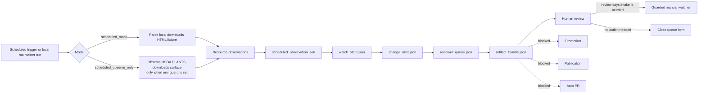

<!-- [KFM_META_BLOCK_V2]
doc_id: kfm://doc/NEEDS-VERIFICATION-usda-plants-scheduled-observer-layer
title: USDA PLANTS Scheduled Observer Layer
type: standard
version: v1
status: draft
owners: @bartytime4life (CODEOWNERS fallback; flora steward NEEDS VERIFICATION)
created: NEEDS_VERIFICATION
updated: 2026-05-08
policy_label: public
related: [docs/domains/flora/usda_plants/README.md, docs/domains/flora/usda_plants/USDA_PLANTS_GUARDED_LIVE_WATCHER_LAYER.md, docs/domains/flora/usda_plants/USDA_PLANTS_LIVE_SOURCE_READINESS_LAYER.md, docs/domains/flora/usda_plants/USDA_PLANTS_PUBLICATION_LAYER.md, contracts/source/kansas_flora/usda_plants.md, policy/flora/usda_plants_scheduled_observer.rego, policy/flora/usda_plants_scheduled_observer_test.rego, schemas/flora/usda_plants_scheduled_observation.schema.json, schemas/flora/usda_plants_watch_state.schema.json, schemas/flora/usda_plants_change_alert.schema.json, schemas/flora/usda_plants_reviewer_queue.schema.json, schemas/flora/usda_plants_artifact_bundle.schema.json, tools/watchers/flora/usda_plants_scheduled_observer.py, tools/alerts/flora/usda_plants_change_alert_builder.py, tools/review/flora/usda_plants_reviewer_queue_builder.py, tools/artifacts/flora/usda_plants_artifact_bundle_builder.py, tests/flora/test_usda_plants_scheduled_observer.py]
tags: [kfm, flora, usda-plants, scheduled-observer, observe-only, review-queue, artifact-bundle, no-promotion, no-publication]
notes: [doc_id and created date require repository metadata verification; owner uses current repository fallback until flora steward ownership is verified; this document describes an observe-only scheduled review layer, not promotion, publication, public map release, auto PR creation, or workflow enforcement proof]
[/KFM_META_BLOCK_V2] -->

<a id="top"></a>

# USDA PLANTS Scheduled Observer Layer

Observe-only scheduled review layer for USDA PLANTS source metadata: watch state, change alerts, reviewer queue items, and artifact bundles without promotion, publication, raw downloads by default, or automatic PR activity.


> [!IMPORTANT]
> **Status:** `draft`  
> **Path:** `docs/domains/flora/usda_plants/USDA_PLANTS_SCHEDULED_OBSERVER_LAYER.md`  
> **Layer:** `usda_plants_scheduled_observer`  
> **Lifecycle placement:** before RAW promotion and before release-candidate generation  
> **Default mode:** `scheduled_mock` / no-network fixture observation  
> **Guarded mode:** `scheduled_observe_only` only when `KFM_ALLOW_SCHEDULED_OBSERVATION=1` is explicitly set  
> **Output ceiling:** observation artifacts, watch state, alert, reviewer queue, and artifact bundle  
> **Hard boundary:** no publish, no promote, no auto PR, no auto merge, no release candidate

**Quick links:** [Purpose](#purpose) · [Repo fit](#repo-fit) · [Scope](#scope) · [Inputs](#accepted-inputs) · [Exclusions](#exclusions) · [Observer modes](#observer-modes) · [Flow](#observer-flow) · [Artifact contracts](#artifact-contracts) · [Policy gates](#policy-gates) · [CI posture](#ci-and-no-network-posture) · [Workflow contract](#scheduled-workflow-contract) · [Quickstart](#quickstart) · [Failure behavior](#failure-behavior) · [Review checklist](#review-checklist) · [Definition of done](#definition-of-done) · [Future paths](#future-paths)

---

## Purpose

The scheduled observer gives KFM a safe way to notice that USDA PLANTS source surfaces may have changed without treating that notice as source intake, release approval, public publication, or map truth.

It watches source metadata and fixture-backed resource signatures, compares them against prior watch state when available, emits review artifacts, and routes human attention toward the guarded manual watcher when a real intake decision is needed.

```text
This layer may emit:
  scheduled_observation.json
  watch_state.json
  change_alert.json
  reviewer_queue.json
  artifact_bundle.json

This layer must not emit:
  RAW source payloads by default
  release candidates
  promotion decisions
  publication approvals
  public map layers
  public county geometry
  vector tiles
  auto-created PRs
  auto-merged PRs
```

> [!NOTE]
> A scheduled observation is a signal. It is not evidence closure, promotion, publication, or release state.

[Back to top](#top)

---

## Repo fit

This file belongs under `docs/domains/flora/usda_plants/` because it is a human-facing source-lane lifecycle guide. It links to policy, schemas, tools, tests, and contracts under their responsibility roots rather than duplicating their authority.

| Surface | Path | Role | Status |
|---|---|---|---|
| Source-lane README | [`README.md`](./README.md) | USDA PLANTS navigation, source boundary, layer ladder, and publication posture | **CONFIRMED path** |
| Guarded live watcher layer | [`USDA_PLANTS_GUARDED_LIVE_WATCHER_LAYER.md`](./USDA_PLANTS_GUARDED_LIVE_WATCHER_LAYER.md) | Manual operator path after scheduled review finds work needing intake | **CONFIRMED path** |
| Live readiness layer | [`USDA_PLANTS_LIVE_SOURCE_READINESS_LAYER.md`](./USDA_PLANTS_LIVE_SOURCE_READINESS_LAYER.md) | Operator-supplied snapshot readiness and source-shape checks | **CONFIRMED path** |
| Publication layer | [`USDA_PLANTS_PUBLICATION_LAYER.md`](./USDA_PLANTS_PUBLICATION_LAYER.md) | Sealed-package-only controlled publication | **CONFIRMED path** |
| Source contract | [`../../../../contracts/source/kansas_flora/usda_plants.md`](../../../../contracts/source/kansas_flora/usda_plants.md) | Human source-admission meaning and authority boundary | **CONFIRMED path** |
| Scheduled observer tool | [`../../../../tools/watchers/flora/usda_plants_scheduled_observer.py`](../../../../tools/watchers/flora/usda_plants_scheduled_observer.py) | Builds scheduled observation and watch state | **CONFIRMED path** |
| Change alert builder | [`../../../../tools/alerts/flora/usda_plants_change_alert_builder.py`](../../../../tools/alerts/flora/usda_plants_change_alert_builder.py) | Converts observation/watch-state changes into alert posture | **CONFIRMED path** |
| Reviewer queue builder | [`../../../../tools/review/flora/usda_plants_reviewer_queue_builder.py`](../../../../tools/review/flora/usda_plants_reviewer_queue_builder.py) | Builds human review queue item and blocked-action list | **CONFIRMED path** |
| Artifact bundle builder | [`../../../../tools/artifacts/flora/usda_plants_artifact_bundle_builder.py`](../../../../tools/artifacts/flora/usda_plants_artifact_bundle_builder.py) | Bundles observation artifacts for upload/review | **CONFIRMED path** |
| Scheduled observer policy | [`../../../../policy/flora/usda_plants_scheduled_observer.rego`](../../../../policy/flora/usda_plants_scheduled_observer.rego) | Denies publish/promote/auto-PR claims, unsafe source use, missing hashes, and raw download misuse | **CONFIRMED path** |
| Policy tests | [`../../../../policy/flora/usda_plants_scheduled_observer_test.rego`](../../../../policy/flora/usda_plants_scheduled_observer_test.rego) | Minimal Rego policy test fixture | **CONFIRMED path** |
| Pytest smoke test | [`../../../../tests/flora/test_usda_plants_scheduled_observer.py`](../../../../tests/flora/test_usda_plants_scheduled_observer.py) | Offline mock test for observation/watch-state output | **CONFIRMED path** |

> [!NOTE]
> Repository paths above were verified through repository connector evidence. Runtime execution, branch protection, required checks, scheduled workflow enforcement, deployment, and published artifacts remain **NEEDS VERIFICATION** unless a checkout, CI run, or runtime log proves them.

[Back to top](#top)

---

## Scope

### What this layer owns

| Area | Responsibility | Output ceiling |
|---|---|---|
| Scheduled observation | Observe the USDA PLANTS downloads surface or a fixture equivalent | `scheduled_observation.json` |
| Watch-state update | Cache observed resource signatures and source refs for later comparison | `watch_state.json` |
| Change alert | Classify observation deltas into `none`, `info`, `warning`, or `critical` | `change_alert.json` |
| Human review queue | Create a queue item that points reviewers toward manual snapshot intake when needed | `reviewer_queue.json` |
| Artifact bundle | Package observation artifacts for upload/review without public publication | `artifact_bundle.json` |
| Policy boundary | Deny publication, promotion, auto PR, unsafe raw downloads, and missing hashes | Rego deny set |
| CI posture | Preserve no-network fixture behavior for ordinary tests | Offline mock only |

### What this layer does not own

| Out of scope | Correct surface |
|---|---|
| Source-admission meaning | Source contract |
| Operator-supplied snapshot intake | Live readiness + guarded live watcher layers |
| RAW payload capture | Guarded manual watcher with explicit operator approval |
| Release-candidate generation | Catalog/release layer |
| Promotion decision | Promotion gate / release control surfaces |
| Controlled publication | Publication layer |
| Public county geometry | County geometry publication layer |
| Tile archive publication | Tile archive publication layer |
| MapLibre public layer | Published layer descriptor / map contract |
| Evidence Drawer production payload | Catalog/release and UI payload builders |
| Branch protection and workflow enforcement | GitHub settings, workflow YAML, and run logs |

[Back to top](#top)

---

## Accepted inputs

Only review-safe, source-bounded, and hashable inputs should enter this layer.

| Input | Required condition | Why it belongs |
|---|---|---|
| USDA PLANTS downloads page URI | Must be the USDA PLANTS downloads surface unless running localhost test mode | Source surface being observed |
| Local downloads-page fixture | Required for `scheduled_mock` and ordinary CI | Keeps tests deterministic and no-network |
| Prior watch state | Optional; must be an earlier `usda_plants_watch_state` object | Enables changed/added/removed comparison |
| Snapshot date | `YYYY-MM-DD` | Anchors output path and watch-state record |
| Generated timestamp | ISO 8601 UTC; fixed in tests when deterministic hashes are needed | Hash-stable artifact production |
| Current scheduled-observation schema | Must validate emitted observation artifact | Keeps machine shape explicit |
| Watch-state schema | Must validate emitted watch-state artifact | Keeps review state explicit |
| Alert schema | Must validate emitted alert artifact | Keeps review severity bounded |
| Reviewer queue schema | Must validate emitted queue artifact | Keeps human handoff explicit |
| Artifact bundle schema | Must validate upload/review bundle | Keeps bundle non-public and non-promoted |

[Back to top](#top)

---

## Exclusions

Do not use this layer for:

- source payload downloads by default;
- RAW source-file capture except through a separately reviewed guarded manual path;
- public publication;
- promotion;
- release-candidate creation;
- auto-created PRs;
- auto-merged PRs;
- public county geometry;
- vector tiles, MBTiles, PMTiles, or static public map outputs;
- exact plant occurrence claims;
- rare-plant exact-location exposure;
- protected-status claims sourced only from USDA PLANTS;
- image reuse claims;
- credentials, cookies, tokens, environment secrets, or steward-only notes;
- direct public UI/API reads from RAW, WORK, QUARANTINE, or unpublished candidates.

> [!CAUTION]
> USDA PLANTS distribution context is not exact occurrence evidence. A scheduled observer can notice a source-surface change; it cannot make that change publishable.

[Back to top](#top)

---

## Observer modes

| Mode | Network posture | Intended use | Guard | Output ceiling |
|---|---:|---|---|---|
| `scheduled_mock` | Disabled | CI-safe and local deterministic observation | Local downloads-page fixture | Observation + watch state, with downstream alert/queue/bundle possible |
| `scheduled_observe_only` | Gated source observation | Controlled scheduled or operator-run metadata observation | `KFM_ALLOW_SCHEDULED_OBSERVATION=1` | Observation packet only; still no raw download, release candidate, promotion, or publication |

### Mode rules

| Rule | Required behavior |
|---|---|
| `publishes` | Always `false` |
| `promotes` | Always `false` |
| `creates_pr` | Always `false` |
| `downloads_raw` | Must remain `false` unless a separate reviewed exception is explicitly allowed |
| Real source URI | Must be USDA PLANTS downloads surface |
| Test source URI | May be localhost only when `test_mode` is present in policy input |
| Critical alert | Must require human review |
| Any changed observation | Must produce a non-`none` alert |
| Bundle refs | Must not point under `published/` |

[Back to top](#top)

---

## Observer flow



### Lifecycle reading rule

```text
OBSERVE
  -> WATCH_STATE
  -> ALERT
  -> REVIEW_QUEUE
  -> ARTIFACT_BUNDLE
  -/-> RAW promotion
  -/-> RELEASE_CANDIDATE
  -/-> PUBLISHED
```

This layer sits before RAW promotion and before release-candidate generation. It can point reviewers toward the guarded manual watcher, but it does not cross that boundary.

[Back to top](#top)

---

## Artifact contracts

### `scheduled_observation.json`

The scheduled observation records what was seen, how it was seen, and whether the source surface appears to have changed.

| Field family | Required meaning |
|---|---|
| Identity | `schema_version`, `object_type`, `observation_id`, `domain`, `source_id` |
| Source | `source_uri`, observed resources, resource roles, resource URLs |
| Timing | `generated_at`, snapshot-date-derived output path |
| Guard posture | `mode`, `network_mode`, `ci` |
| Hard denials | `publishes=false`, `promotes=false`, `creates_pr=false` |
| Raw download posture | `downloads_raw=false` by default |
| Change summary | `changed`, `added`, `removed`, `changed_resources`, `failed_resources` |
| Outcome | `status`, `reason_codes` |
| Integrity | `observation_hash` |

Resource roles are intentionally narrow:

```text
checklist
state_distribution
county_distribution
unknown
```

### `watch_state.json`

The watch state is a cache of observed source-resource signatures. It exists to make future comparisons deterministic.

| Field family | Required meaning |
|---|---|
| Identity | `schema_version`, `object_type`, `watch_state_id`, `domain`, `source_id` |
| Source | `source_uri`, resource role, URL, and observed signatures |
| Timing | `last_observed_at`, `last_snapshot_date` |
| Links | `last_observation_ref`, `last_alert_ref` |
| Integrity | `state_hash` |

### `change_alert.json`

The alert converts observation deltas into a bounded review signal.

| Severity | Meaning | Review posture |
|---|---|---|
| `none` | No review-worthy source change detected | No queue pressure |
| `info` | No prior state or unknown resource added | Human review may be useful |
| `warning` | Required resource changed | Human review required |
| `critical` | Required resource missing or failed | Human review required and failure path likely |

Alert artifacts must keep `publication_blocked=true` and `promotion_blocked=true`.

### `reviewer_queue.json`

The reviewer queue is a human handoff surface. It does not open a PR and does not approve ingestion.

| Queue field | Required meaning |
|---|---|
| `priority` | `none`, `low`, `medium`, or `high` |
| `review_status` | Starts as `not_started` |
| `reviewer_hint` | Steward routing hint, not proof of ownership |
| `required_review_gates` | Source, rights, drift, quarantine, manual snapshot intake, and release-candidate review |
| `blocked_actions` | Must include publication/promotion/automation blockers |
| `queue_hash` | Integrity hash for the queue item |

### `artifact_bundle.json`

The bundle packages observation artifacts for upload/review. It is not a publication bundle.

| Bundle field | Required meaning |
|---|---|
| `artifact_only` | Always `true` |
| `publication_state` | Always `not_published` |
| `promotion_state` | Always `not_promoted` |
| `refs[]` | Points to observation, watch state, alert, and queue artifacts |
| `refs[].path` | Must not begin with `published/` |
| `bundle_hash` | Integrity hash for the bundle |

> [!WARNING]
> None of these artifacts are EvidenceBundle replacements, release manifests, promotion approvals, publication receipts, rollback cards, or public tiles.

[Back to top](#top)

---

## Policy gates

The scheduled-observer policy is intentionally fail-closed.

| Deny code | Trigger |
|---|---|
| `USDA_PLANTS_SCHEDULE_PUBLICATION_CLAIM` | Observation claims it publishes |
| `USDA_PLANTS_SCHEDULE_PROMOTION_CLAIM` | Observation claims it promotes |
| `USDA_PLANTS_SCHEDULE_AUTO_PR_CLAIM` | Observation claims it creates PRs |
| `USDA_PLANTS_SCHEDULE_WRITES_PUBLISHED` | Bundle refs point under `published/` |
| `USDA_PLANTS_SCHEDULE_DOWNLOADS_RAW_BY_DEFAULT` | Observation downloads RAW without explicit allowance |
| `USDA_PLANTS_SCHEDULE_MISSING_OBSERVATION_HASH` | Observation hash missing |
| `USDA_PLANTS_SCHEDULE_MISSING_ALERT_HASH` | Alert hash missing |
| `USDA_PLANTS_SCHEDULE_MISSING_QUEUE_HASH` | Queue hash missing |
| `USDA_PLANTS_SCHEDULE_MISSING_BUNDLE_HASH` | Bundle hash missing |
| `USDA_PLANTS_SCHEDULE_CRITICAL_WITHOUT_REVIEW` | Critical alert does not require human review |
| `USDA_PLANTS_SCHEDULE_CHANGED_WITHOUT_ALERT` | Changed observation has `none` alert severity |
| `USDA_PLANTS_SCHEDULE_REAL_NETWORK_WITHOUT_ENV` | Real scheduled observation lacks `KFM_ALLOW_SCHEDULED_OBSERVATION=1` |
| `USDA_PLANTS_SCHEDULE_NON_USDA_SOURCE` | Source URI is neither USDA PLANTS downloads nor allowed localhost test URI |

> [!IMPORTANT]
> Policy files can be present without proving workflow enforcement, required checks, or runtime policy evaluation. Treat enforcement as **NEEDS VERIFICATION** until CI/workflow evidence is inspected.

[Back to top](#top)

---

## CI and no-network posture

The confirmed smoke test exercises `scheduled_mock` against local fixtures and asserts that `raw/` and `published/` directories are not created in the test output.

| CI rule | Required behavior |
|---|---|
| Default observer mode | `scheduled_mock` |
| Real USDA network | Denied in ordinary tests |
| Fixture source | Local downloads HTML fixture |
| Expected observer outputs | `scheduled_observation.json`, `watch_state.json` |
| Raw output | Must not be created |
| Published output | Must not be created |
| Alert/queue/bundle builders | May be tested separately as artifact builders |
| Promotion/publication | Denied |
| Workflow schedule claim | **NEEDS VERIFICATION** until workflow YAML and run logs are inspected |

[Back to top](#top)

---

## Scheduled workflow contract

A future scheduled workflow may run this layer only as an observer. The workflow itself is not established by this document.

| Workflow property | Required value |
|---|---|
| Trigger | `schedule` or manual dry-run only after workflow evidence is reviewed |
| Default source | Fixture or metadata-only observation |
| Environment gate | `KFM_ALLOW_SCHEDULED_OBSERVATION=1` for real source observation |
| RAW download | Not allowed by default |
| Release candidate | Not allowed |
| PR creation | Not allowed |
| PR merge | Not allowed |
| Promotion | Not allowed |
| Publication | Not allowed |
| Artifacts | Upload observation packet only |
| Failure behavior | Preserve failed artifact and reason code; do not silently skip |

> [!CAUTION]
> A scheduled workflow that downloads source payloads, creates release candidates, opens PRs, merges PRs, promotes, or publishes is not this layer. It requires separate review, policy, workflow, and rollback documentation.

[Back to top](#top)

---

## Quickstart

Run from the repository root after confirming the checkout and branch.

### 1. Confirm repository state

```bash
pwd
git status --short
git branch --show-current || true
```

### 2. Run CI-safe scheduled mock

```bash
OUT_DIR="/tmp/kfm-usda-plants-scheduled/2026-04-30"

python tools/watchers/flora/usda_plants_scheduled_observer.py \
  --mode scheduled_mock \
  --downloads-html tests/fixtures/flora/usda_plants/source_discovery/downloads_page_fixture.html \
  --snapshot-date 2026-04-30 \
  --generated-at 2026-04-30T00:00:00Z \
  --out-dir "${OUT_DIR}"

python -m json.tool "${OUT_DIR}/scheduled_observation.json"
python -m json.tool "${OUT_DIR}/watch_state.json"
```

### 3. Build alert, queue, and bundle artifacts

```bash
python tools/alerts/flora/usda_plants_change_alert_builder.py \
  --observation "${OUT_DIR}/scheduled_observation.json" \
  --current-watch-state "${OUT_DIR}/watch_state.json" \
  --generated-at 2026-04-30T00:00:00Z \
  --out "${OUT_DIR}/change_alert.json"

python tools/review/flora/usda_plants_reviewer_queue_builder.py \
  --alert "${OUT_DIR}/change_alert.json" \
  --observation "${OUT_DIR}/scheduled_observation.json" \
  --generated-at 2026-04-30T00:00:00Z \
  --out "${OUT_DIR}/reviewer_queue.json"

python tools/artifacts/flora/usda_plants_artifact_bundle_builder.py \
  --artifact-name usda-plants-scheduled-observer-2026-04-30 \
  --root-dir "${OUT_DIR}" \
  --generated-at 2026-04-30T00:00:00Z \
  --out "${OUT_DIR}/artifact_bundle.json"
```

### 4. Run the offline smoke test

```bash
python -m pytest tests/flora/test_usda_plants_scheduled_observer.py
```

### 5. Run policy tests after OPA/toolchain verification

```bash
opa test \
  policy/flora/usda_plants_scheduled_observer.rego \
  policy/flora/usda_plants_scheduled_observer_test.rego
```

### 6. Real observe-only mode

```bash
# CAUTION: observe-only source metadata path. Do not run in ordinary CI.
export KFM_ALLOW_SCHEDULED_OBSERVATION=1

OUT_DIR="/tmp/kfm-usda-plants-scheduled/$(date -u +%F)"

python tools/watchers/flora/usda_plants_scheduled_observer.py \
  --mode scheduled_observe_only \
  --source-uri "https://plants.sc.egov.usda.gov/downloads" \
  --snapshot-date "$(date -u +%F)" \
  --generated-at "$(date -u +%FT%TZ)" \
  --out-dir "${OUT_DIR}"
```

> [!WARNING]
> Real observe-only mode still does not approve intake, promotion, publication, or public map output. It only observes the source surface and emits review artifacts.

[Back to top](#top)

---

## Failure behavior

| Failure | Required response |
|---|---|
| Missing downloads fixture in `scheduled_mock` | Fail observation and emit discovery failure reason |
| Real observation without env guard | Deny by policy and do not treat output as valid |
| Non-USDA source URI | Deny unless localhost test mode is explicit in policy input |
| Required resource missing | Mark failed/critical and require human review |
| Required resource changed | Mark warning and require human review |
| Unknown resource added | Mark info and route to review |
| Missing prior watch state | Mark info/no-prior-state; do not treat as failure alone |
| Missing observation hash | Deny |
| Missing alert hash | Deny |
| Missing queue hash | Deny |
| Missing bundle hash | Deny |
| Bundle path points to `published/` | Deny |
| Observation claims publish/promote/auto PR | Deny |
| Raw download occurs by default | Deny |
| Critical alert lacks human review | Deny |

Failure artifacts are still useful process memory. Preserve reason codes and reviewer obligations instead of silently dropping them.

[Back to top](#top)

---

## Human review path

Scheduled observer output can recommend human review, but the next active lane is still manual.

```text
scheduled observation
  -> change alert
  -> reviewer queue item
  -> human source/rights/drift/quarantine review
  -> guarded manual watcher, if intake is approved
```

Human review must decide whether the source change is:

| Review outcome | Next action |
|---|---|
| No meaningful source change | Close queue item |
| Unknown source/resource appeared | Source-readiness review |
| Required resource changed | Drift and contract review |
| Required resource missing/failed | Quarantine or repair |
| Intake needed | Guarded manual watcher with operator-supplied snapshot or approved manual live path |
| Public output requested | Publication layer only after sealed promoted package and approval |

[Back to top](#top)

---

## Review checklist

Before approving a change to this layer, verify:

- [ ] The layer still says observe-only.
- [ ] `publishes`, `promotes`, and `creates_pr` remain false.
- [ ] Ordinary CI remains no-network.
- [ ] `scheduled_mock` works from local fixture input.
- [ ] `scheduled_observe_only` is gated by `KFM_ALLOW_SCHEDULED_OBSERVATION=1`.
- [ ] The observer does not download RAW payloads by default.
- [ ] Output refs do not point under `published/`.
- [ ] Critical alerts require human review.
- [ ] Changed observations produce a non-`none` alert.
- [ ] Reviewer queue blocked actions include publish, promote, auto PR, and auto merge.
- [ ] Artifact bundle remains `artifact_only=true`, `publication_state=not_published`, and `promotion_state=not_promoted`.
- [ ] No text implies release candidates are created by this layer.
- [ ] No text implies public map layers, geometry, or tiles are emitted by this layer.
- [ ] Any claim about scheduled workflow enforcement is backed by workflow YAML and run evidence.
- [ ] Any new artifact shape has a schema, fixture, and validation or verification item.

[Back to top](#top)

---

## Definition of done

This layer is ready for a maintained review state when:

- [ ] `doc_id`, `created`, and steward owner fields are verified.
- [ ] Relative links are checked from `docs/domains/flora/usda_plants/`.
- [ ] The scheduled observer, alert builder, reviewer queue builder, and artifact bundle builder agree with this document’s artifact contracts.
- [ ] Schemas validate scheduled observation, watch state, alert, queue, and artifact bundle examples.
- [ ] Pytest confirms the scheduled mock path emits observation/watch-state outputs and creates no `raw/` or `published/` output.
- [ ] Rego tests deny publication, promotion, auto PR, missing hashes, changed-without-alert, critical-without-review, unsafe source URI, and published bundle refs.
- [ ] Any workflow that runs this layer is inspected and documented as observe-only.
- [ ] Workflow artifacts are review packets, not release candidates.
- [ ] Human review routing is documented and does not bypass the guarded manual watcher.
- [ ] Publication remains confined to the controlled publication layer.
- [ ] Rollback and correction language is present only for future public artifacts, not for observer artifacts alone.

[Back to top](#top)

---

## Future paths

### Future guarded intake path

When the observer reports a meaningful source change, reviewers may choose the guarded manual watcher path. That path must remain operator-controlled and receipt-bearing.

Allowed handoff:

```text
reviewer_queue.json
  -> human review
  -> guarded manual watcher
  -> snapshot lock / diff
  -> staged input
  -> processed fixture-loader outputs
  -> release-candidate handoff
```

Still blocked here:

```text
publication
promotion
auto PR
auto merge
public map output
```

### Future scheduled workflow path

A scheduled workflow may be added only if it preserves this layer’s contract:

- observe-only;
- no RAW downloads by default;
- no release candidate;
- no PR creation;
- no merge;
- no promotion;
- no publication;
- artifact upload only;
- explicit source/environment guard for real source observation.

### Future publication path

Publication remains under the controlled publication layer and requires:

- sealed promoted package;
- human publication request;
- human approval;
- public-safe output plan;
- release manifest;
- publication receipt;
- audit ledger;
- rollback plan;
- no RAW, WORK, or QUARANTINE leaks.

[Back to top](#top)

---

## Appendix

<details>
<summary>Thin original rules preserved and expanded</summary>

The original document established these rules, all preserved here:

- observe-only scheduled checks;
- review artifacts only;
- placement before RAW promotion and before release-candidate generation;
- no publish;
- no promote;
- no PR opening;
- no merge;
- no release candidate creation;
- observer, alert, queue, and artifact bundle outputs;
- previous observed metadata/checksum cache;
- discovered resources and change summary;
- review-needed alert;
- human queue item;
- manual watcher remains release-candidate path;
- artifact bundle lists observation artifacts for upload;
- policy denies publication, promotion, auto PR claims, non-USDA source misuse, and unsafe network/source behavior;
- pytest uses fixtures and no real USDA calls;
- no county geometry;
- publication path remains future work.

</details>

<details>
<summary>Minimum negative cases to keep alive</summary>

- observation with `publishes=true`;
- observation with `promotes=true`;
- observation with `creates_pr=true`;
- bundle ref under `published/`;
- raw download by default;
- missing `observation_hash`;
- missing `alert_hash`;
- missing `queue_hash`;
- missing `bundle_hash`;
- critical alert without human review;
- changed observation with `severity=none`;
- `scheduled_observe_only` without `KFM_ALLOW_SCHEDULED_OBSERVATION=1`;
- non-USDA real source URI;
- missing required resource;
- required resource failed;
- unknown resource added without review routing;
- reviewer queue without blocked `publish` / `promote` / `auto_pr` / `auto_merge`;
- artifact bundle with `publication_state` other than `not_published`;
- artifact bundle with `promotion_state` other than `not_promoted`;
- scheduled workflow that creates a release candidate;
- scheduled workflow that opens or merges a PR;
- scheduled workflow that publishes public output.

</details>

[Back to top](#top)
