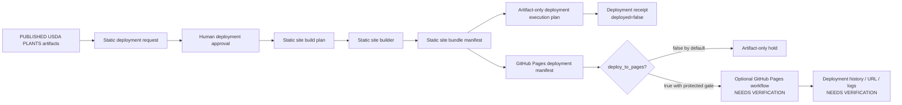

<!-- [KFM_META_BLOCK_V2]
doc_id: kfm://doc/NEEDS_VERIFICATION-usda-plants-static-deployment-layer
title: USDA PLANTS Static Deployment Layer
type: standard
version: v1
status: draft
owners: @bartytime4life
created: NEEDS_VERIFICATION
updated: 2026-05-08
policy_label: public
related: [./README.md, ./USDA_PLANTS_PUBLICATION_LAYER.md, ./USDA_PLANTS_EXTERNAL_CDN_DEPLOYMENT_LAYER.md, ../../../../policy/flora/usda_plants_static_deployment.rego, ../../../../policy/flora/usda_plants_static_deployment_test.rego, ../../../../schemas/flora/usda_plants_github_pages_deployment_manifest.schema.json, ../../../../schemas/flora/usda_plants_deployment_execution_plan.schema.json, ../../../../tools/deploy/flora/usda_plants_static_deployment_request_builder.py, ../../../../tools/deploy/flora/usda_plants_static_deployment_approval_builder.py, ../../../../tools/deploy/flora/usda_plants_static_site_build_plan_builder.py, ../../../../tools/deploy/flora/usda_plants_static_site_builder.py, ../../../../tools/deploy/flora/usda_plants_deployment_execution_plan_builder.py, ../../../../tools/deploy/flora/usda_plants_deployment_receipt_builder.py, ../../../../tools/deploy/flora/usda_plants_github_pages_manifest_builder.py, ../../../../tests/flora/test_usda_plants_static_deployment_chain.py, ../../../../.github/CODEOWNERS]
tags: [kfm, flora, usda-plants, static-deployment, github-pages, artifact-only, evidence, policy, rollback]
notes: [doc_id and created date require registry verification before published status; owner is routed through current CODEOWNERS fallback; this document revises the short static deployment note into a standard deployment-layer guide; workflow file path, protected environment reviewer settings, branch protection, runtime deployment status, and actual Pages publication remain NEEDS VERIFICATION]
[/KFM_META_BLOCK_V2] -->

<a id="top"></a>

# USDA PLANTS Static Deployment Layer

Artifact-first deployment guidance for USDA PLANTS public-safe static packages: build and verify deployable artifacts without turning tests, local packaging, or GitHub Pages manifests into publication proof.


> [!IMPORTANT]
> **Status:** `draft`  
> **Path:** `docs/domains/flora/usda_plants/USDA_PLANTS_STATIC_DEPLOYMENT_LAYER.md`  
> **Authority level:** standard USDA PLANTS source-lane deployment guide  
> **Default posture:** build static artifacts, validate manifests, emit receipts, and stop before real hosting  
> **Publication posture:** static deployment is downstream of controlled publication; it does not create new claims  
> **Runtime claim:** this document does **not** prove GitHub Pages deployment, protected-environment reviewer configuration, workflow enforcement, branch protection, CDN hosting, UI availability, or public endpoint status.

**Quick jumps:** [Purpose](#purpose) · [Repo fit](#repo-fit) · [Accepted inputs](#accepted-inputs) · [Exclusions](#exclusions) · [Deployment chain](#deployment-chain) · [Artifact contract](#artifact-contract) · [GitHub Pages guardrails](#github-pages-guardrails) · [Policy gates](#policy-gates) · [Builder flow](#builder-flow) · [Validation checklist](#validation-checklist) · [Rollback and audit](#rollback-and-audit) · [Definition of done](#definition-of-done)

---

## Purpose

This layer keeps deployment packaging separate from public publication.

It preserves the existing rule from the earlier short note:

> Static packaging is artifact-first. A deployment chain can build, hash, validate, and inspect static USDA PLANTS site artifacts without publishing them to a live endpoint.

### This layer does

| It does | Meaning |
|---|---|
| Build a static site bundle | Convert already-published, public-safe USDA PLANTS artifacts into local static site files. |
| Emit a bundle manifest | Record file paths and hashes for `index.html`, static assets, and copied data refs. |
| Produce an artifact-only execution plan | Keep `target_host=artifact_only` unless a later human-approved hosting step is explicitly invoked. |
| Emit a deployment receipt | Record deployment-chain execution while keeping `deployed=false` by default. |
| Build a GitHub Pages manifest | Prepare a Pages deployment manifest with required permissions and protected-environment posture. |
| Keep deployment and publication separate | Static deployment consumes already-published artifacts; it does not promote or publish source records. |
| Preserve rollback readiness | Deployment artifacts remain addressable by hashes and tied to receipts/manifests. |

### This layer does not

| It does not | Correct home |
|---|---|
| Fetch USDA PLANTS source data | Live source readiness / guarded watcher layers |
| Decide source authority, terms, or public-safe scope | Source contract and human review layers |
| Promote release candidates | Promotion / release-state layer |
| Publish source-derived claims | Controlled publication layer |
| Generate county geometry or vector tiles | County geometry and tile publication layers |
| Deploy to Cloudflare or external CDN | External CDN deployment layer |
| Prove GitHub environment reviewers are configured | GitHub repository settings / protected environment verification |
| Prove a live URL exists | Workflow run, deployment history, and runtime checks |

[Back to top](#top)

---

## Repo fit

`docs/domains/flora/usda_plants/USDA_PLANTS_STATIC_DEPLOYMENT_LAYER.md` is a **human-facing deployment-layer guide** under the USDA PLANTS source lane. It documents how static deployment artifacts should behave while leaving code, schemas, tests, policy, workflows, receipts, proofs, and published artifacts in their responsibility roots.

| Direction | Path | Role | Status |
|---|---|---|---:|
| Source-lane README | [`./README.md`](./README.md) | Source boundary, layer map, lifecycle posture, and reviewer checklist | **CONFIRMED path** |
| Controlled publication layer | [`./USDA_PLANTS_PUBLICATION_LAYER.md`](./USDA_PLANTS_PUBLICATION_LAYER.md) | Upstream human-approved publication from sealed packages | **CONFIRMED path** |
| External CDN layer | [`./USDA_PLANTS_EXTERNAL_CDN_DEPLOYMENT_LAYER.md`](./USDA_PLANTS_EXTERNAL_CDN_DEPLOYMENT_LAYER.md) | Optional external hosting seam after static artifacts exist | **CONFIRMED path** |
| Static deployment policy | [`../../../../policy/flora/usda_plants_static_deployment.rego`](../../../../policy/flora/usda_plants_static_deployment.rego) | Deny rules for approval, refs, coordinates, basemap claims, secrets, hashes, attribution, and Pages manifest fields | **CONFIRMED path** |
| Static deployment policy test | [`../../../../policy/flora/usda_plants_static_deployment_test.rego`](../../../../policy/flora/usda_plants_static_deployment_test.rego) | Minimal clean-input allow case | **CONFIRMED path** |
| Static deployment chain test | [`../../../../tests/flora/test_usda_plants_static_deployment_chain.py`](../../../../tests/flora/test_usda_plants_static_deployment_chain.py) | No-network artifact-chain smoke test | **CONFIRMED path** |
| Request builder | [`../../../../tools/deploy/flora/usda_plants_static_deployment_request_builder.py`](../../../../tools/deploy/flora/usda_plants_static_deployment_request_builder.py) | Builds deployment request from published artifact refs | **CONFIRMED path** |
| Approval builder | [`../../../../tools/deploy/flora/usda_plants_static_deployment_approval_builder.py`](../../../../tools/deploy/flora/usda_plants_static_deployment_approval_builder.py) | Builds human approval artifact | **CONFIRMED path** |
| Static build plan builder | [`../../../../tools/deploy/flora/usda_plants_static_site_build_plan_builder.py`](../../../../tools/deploy/flora/usda_plants_static_site_build_plan_builder.py) | Builds static site plan from request and approval | **CONFIRMED path** |
| Static site builder | [`../../../../tools/deploy/flora/usda_plants_static_site_builder.py`](../../../../tools/deploy/flora/usda_plants_static_site_builder.py) | Materializes local static site bundle and manifest | **CONFIRMED path** |
| Execution plan builder | [`../../../../tools/deploy/flora/usda_plants_deployment_execution_plan_builder.py`](../../../../tools/deploy/flora/usda_plants_deployment_execution_plan_builder.py) | Emits artifact-only deployment execution plan | **CONFIRMED path** |
| Receipt builder | [`../../../../tools/deploy/flora/usda_plants_deployment_receipt_builder.py`](../../../../tools/deploy/flora/usda_plants_deployment_receipt_builder.py) | Emits deployment receipt with `deployed=false` | **CONFIRMED path** |
| GitHub Pages manifest builder | [`../../../../tools/deploy/flora/usda_plants_github_pages_manifest_builder.py`](../../../../tools/deploy/flora/usda_plants_github_pages_manifest_builder.py) | Emits guarded Pages deployment manifest | **CONFIRMED path** |
| GitHub Pages manifest schema | [`../../../../schemas/flora/usda_plants_github_pages_deployment_manifest.schema.json`](../../../../schemas/flora/usda_plants_github_pages_deployment_manifest.schema.json) | Machine shape for the Pages manifest | **CONFIRMED path** |
| CODEOWNERS | [`../../../../.github/CODEOWNERS`](../../../../.github/CODEOWNERS) | Conservative review routing to `@bartytime4life` | **CONFIRMED path** |
| GitHub Pages workflow | `.github/workflows/<repo-confirmed-usda-plants-pages-workflow>.yml` | Optional guarded workflow that uploads/deploys the static bundle | **NEEDS VERIFICATION** |

> [!NOTE]
> Directory placement follows KFM responsibility roots: documentation stays under `docs/`, executable policy under `policy/`, schemas under `schemas/`, implementation helpers under `tools/`, tests under `tests/`, workflows under `.github/`, and emitted lifecycle artifacts under data/release roots. Do not create a new root-level USDA PLANTS deployment folder.

[Back to top](#top)

---

## Accepted inputs

This layer accepts only **already-published or publication-derived static inputs**. It must not reopen source intake.

| Input | Expected shape | Required condition |
|---|---|---|
| Published release manifest | `published/flora/usda_plants/<snapshot_date>/release_manifest.json` | Must already be public-safe and release-backed. |
| Dataset index | `published/flora/usda_plants/<snapshot_date>/dataset_index.json` | Must not include raw source rows or hidden restricted fields. |
| Evidence Drawer index | `published/flora/usda_plants/<snapshot_date>/evidence_drawer_index.json` | Must point only to sanitized drawer payloads. |
| County presence | `published/flora/usda_plants/<snapshot_date>/county_presence.json` | FIPS-keyed public-safe context; not occurrence points. |
| Map descriptor | `published/flora/usda_plants/<snapshot_date>/map_descriptor.json` | Must preserve renderer/downstream trust boundary. |
| Optional map artifacts | `map/county_presence.geojson`, `map/map_style.json` | Must come from reviewed publication layers, not be generated here. |
| Hosting handoff | `hosting/static_host_handoff.json` | Must describe static-host readiness without claiming deployment success. |
| Cache integrity manifest | `hosting/cache_integrity_manifest.json` | Must be hash-addressed and deployment-safe. |
| Static deployment request | `usda_plants_static_deployment_request` | Built from published artifact refs. |
| Static deployment approval | `usda_plants_static_deployment_approval` | Must be human-approved before static site build plan. |
| Static site bundle manifest | `usda_plants_static_site_bundle_manifest` | Hashes all local static site files. |
| Deployment execution plan | `usda_plants_deployment_execution_plan` | Must remain `target_host=artifact_only` unless a later reviewed deploy path changes it. |
| GitHub Pages manifest | `usda_plants_github_pages_deployment_manifest` | Must keep deploy toggle explicit and default-safe. |

[Back to top](#top)

---

## Exclusions

Do **not** use this layer to admit, emit, or imply:

- live USDA PLANTS fetches;
- Census or county-boundary fetches;
- external basemap fetches;
- raw, work, or quarantine references in public/deployment artifacts;
- exact plant occurrence coordinates;
- hidden coordinate-like fields;
- source rows copied into static assets;
- legal protected-status claims sourced only from USDA PLANTS;
- image reuse claims without image-specific rights;
- automatic promotion, publication, PR creation, merge, deployment, cache purge, or DNS change;
- GitHub Pages deployment without explicit human approval and protected environment review;
- long-lived secret use for Pages deployment;
- environment-reviewer enforcement claims based only on workflow YAML;
- direct public UI/API reads from internal lifecycle zones;
- AI-generated statements that do not resolve through EvidenceBundles and policy outcomes.

> [!CAUTION]
> A static site is a delivery carrier. It is not source authority, policy authority, publication authority, or citation authority.

[Back to top](#top)

---

## Deployment chain

The current static deployment chain is intentionally conservative.



### State transition rule

```text
PUBLISHED_ARTIFACTS
  -> STATIC_DEPLOYMENT_REQUEST
  -> STATIC_DEPLOYMENT_APPROVAL
  -> STATIC_SITE_BUILD_PLAN
  -> STATIC_SITE_BUNDLE_MANIFEST
  -> ARTIFACT_ONLY_DEPLOYMENT_EXECUTION_PLAN
  -> DEPLOYMENT_RECEIPT
  -> OPTIONAL_GITHUB_PAGES_MANIFEST
  -/-> GITHUB_PAGES_DEPLOYMENT unless protected human gate is verified
```

### Current default

| Field | Required default |
|---|---|
| Source fetch | `none` |
| Test network posture | no USDA fetch, no Census fetch, no basemap fetch |
| Execution plan host | `artifact_only` |
| Deployment receipt | `deployed=false` |
| Pages manifest deploy flag | `deploys=false` unless `--deploy-to-pages true` is explicitly passed |
| Long-lived secrets | `false` |
| Protected environment required | `true` |
| Publication claim | none; publication already happened upstream |
| Rollback | artifact-addressable; no silent overwrite |

[Back to top](#top)

---

## Artifact contract

### Static site bundle

The static site builder materializes a local artifact bundle under:

```text
site/flora/usda_plants/<snapshot_date>/
```

Expected generated files include:

| Output | Role |
|---|---|
| `index.html` | Lightweight static entrypoint with attribution and links to data refs |
| `manifest.json` | Local manifest for the static artifact site |
| `assets/kfm-usda-plants.css` | Minimal static styling |
| `assets/kfm-usda-plants.js` | Minimal static script |
| `data/release_manifest.json` | Copied published release anchor |
| `data/dataset_index.json` | Copied public-safe dataset index |
| `data/evidence_drawer_index.json` | Copied public-safe Evidence Drawer index |
| `data/county_presence.json` | Copied FIPS-keyed presence table |
| `data/map_descriptor.json` | Copied map descriptor |
| `data/map/county_presence.geojson` | Copied reviewed map artifact when present upstream |
| `data/map/map_style.json` | Copied reviewed style artifact when present upstream |
| `data/hosting/static_host_handoff.json` | Copied static-host handoff evidence |
| `data/hosting/cache_integrity_manifest.json` | Copied cache/integrity evidence |
| `static_site_bundle_manifest.json` | Hash inventory over the static site bundle |

### Deployment execution plan

The artifact-only deployment execution plan must keep static delivery reviewable without performing real hosting.

| Field | Required posture |
|---|---|
| `object_type` | `usda_plants_deployment_execution_plan` |
| `domain` | `flora` |
| `source_id` | `usda_plants` |
| `target_host` | `artifact_only` |
| `site_bundle_manifest_ref` | Static bundle manifest path |
| `status` | `pass` or `fail` |
| `plan_hash` | Required |

### Deployment receipt

The deployment receipt records local artifact-chain execution.

| Field | Required posture |
|---|---|
| `object_type` | `usda_plants_deployment_receipt` |
| `execution_plan_ref` | Required |
| `deployed` | `false` by default |
| `reason_codes` | Must make artifact-only posture visible |
| `receipt_hash` | Required |

[Back to top](#top)

---

## GitHub Pages guardrails

The GitHub Pages deployment manifest is a **guarded optional deployment packet**, not proof that Pages was deployed.

### Pages manifest requirements

| Field | Required value |
|---|---|
| `object_type` | `usda_plants_github_pages_deployment_manifest` |
| `artifact_name` | `github-pages` |
| `environment` | `github-pages` |
| `required_permissions.contents` | `read` |
| `required_permissions.pages` | `write` |
| `required_permissions.id-token` | `write` |
| `uses_long_lived_secrets` | `false` |
| `requires_environment_protection` | `true` |
| `claims.auto_merge` | `false` |
| `deploys` | Boolean; default `false` from the builder |
| `manifest_hash` | Required |

### Optional workflow requirements

A GitHub Pages workflow, when added or verified, must follow these guardrails:

| Requirement | Posture |
|---|---|
| Trigger | `workflow_dispatch` only |
| Deploy input | `deploy_to_pages` or repo-confirmed equivalent |
| Deploy input default | `false` |
| Deploy job condition | Runs only when the explicit deploy input is `true` |
| Artifact source | Previously built static site bundle, not raw source data |
| Permissions | `contents: read`, `pages: write`, `id-token: write` for the deploy job |
| Environment | `github-pages` |
| Environment reviewers | Configured in repository settings; YAML alone is not enough |
| Secret posture | No long-lived secrets for GitHub Pages deployment |
| CI/test behavior | Tests validate artifacts and manifests but do not deploy |

> [!WARNING]
> The exact workflow file path and protected-environment reviewer settings are **NEEDS VERIFICATION**. Do not claim deployment enforcement from this document or manifest alone.

[Back to top](#top)

---

## Policy gates

The static deployment policy is fail-closed. It guards both the general deployment packet and the GitHub Pages manifest.

### General static deployment denies

| Deny condition | Meaning |
|---|---|
| Missing human approval | Deployment packet lacks `deployment_approval.approved_by`. |
| Non-human approval | `approval_actor_type` is not `human`. |
| Raw/work/quarantine refs | Deployment refs point to internal lifecycle zones. |
| Occurrence coordinate leaks | Claims include coordinate-like occurrence fields. |
| External basemap claims | Static deployment claims external basemap use. |
| Long-lived secret claims | Static deployment claims long-lived secrets. |
| Missing hashes | Hash set is empty. |
| Bad attribution | Attribution does not include `USDA PLANTS`. |
| Auto-merge claims | Deployment claims auto-merge behavior. |

### GitHub Pages denies

| Deny condition | Meaning |
|---|---|
| Missing `pages: write` | Pages deployment permission is incomplete. |
| Missing `id-token: write` | OIDC token permission is incomplete. |
| Missing environment protection | Manifest does not require environment protection. |
| Long-lived secrets | Manifest claims long-lived secret use. |
| Auto-merge claims | Manifest claims auto-merge behavior. |
| Raw/work/quarantine refs | Pages manifest refs point to internal lifecycle zones. |

> [!IMPORTANT]
> Policy files can exist without proving enforcement in CI, branch protection, protected environments, or runtime. Treat enforcement as **NEEDS VERIFICATION** until workflow runs and repository settings are inspected.

[Back to top](#top)

---

## Builder flow

Run from the repository root. This is a local artifact-chain example; it should not fetch live sources or deploy.

```bash
SNAPSHOT_DATE="2026-01-01"
GENERATED_AT="2026-01-01T00:00:00Z"
OUT_ROOT="/tmp/kfm-usda-plants-static-deployment"

PUBLISHED_ROOT="${OUT_ROOT}/published/flora/usda_plants/${SNAPSHOT_DATE}"
CHAIN_ROOT="${OUT_ROOT}/deployment/flora/usda_plants/${SNAPSHOT_DATE}"
SITE_ROOT="site/flora/usda_plants/${SNAPSHOT_DATE}"

mkdir -p "${PUBLISHED_ROOT}" "${CHAIN_ROOT}"

# The published root must already contain public-safe artifacts from upstream publication.
# This layer does not create release truth; it only packages static deployment artifacts.

python tools/deploy/flora/usda_plants_static_deployment_request_builder.py \
  --published-root "${PUBLISHED_ROOT}" \
  --snapshot-date "${SNAPSHOT_DATE}" \
  --generated-at "${GENERATED_AT}" \
  --requested-by "REPLACE_WITH_HUMAN_REQUESTER_ID" \
  --out "${CHAIN_ROOT}/static_deployment_request.json"

python tools/deploy/flora/usda_plants_static_deployment_approval_builder.py \
  --deployment-request "${CHAIN_ROOT}/static_deployment_request.json" \
  --generated-at "${GENERATED_AT}" \
  --approved-by "REPLACE_WITH_HUMAN_APPROVER_ID" \
  --out "${CHAIN_ROOT}/static_deployment_approval.json"

python tools/deploy/flora/usda_plants_static_site_build_plan_builder.py \
  --deployment-request "${CHAIN_ROOT}/static_deployment_request.json" \
  --deployment-approval "${CHAIN_ROOT}/static_deployment_approval.json" \
  --site-root "${SITE_ROOT}" \
  --generated-at "${GENERATED_AT}" \
  --out "${CHAIN_ROOT}/static_site_build_plan.json"

python tools/deploy/flora/usda_plants_static_site_builder.py \
  --published-root "${PUBLISHED_ROOT}" \
  --snapshot-date "${SNAPSHOT_DATE}" \
  --generated-at "${GENERATED_AT}" \
  --out-root "${OUT_ROOT}"

SITE_BUNDLE="${OUT_ROOT}/${SITE_ROOT}/static_site_bundle_manifest.json"

python tools/deploy/flora/usda_plants_deployment_execution_plan_builder.py \
  --snapshot-date "${SNAPSHOT_DATE}" \
  --generated-at "${GENERATED_AT}" \
  --site-bundle-manifest "${SITE_BUNDLE}" \
  --out "${CHAIN_ROOT}/deployment_execution_plan.json"

python tools/deploy/flora/usda_plants_deployment_receipt_builder.py \
  --execution-plan "${CHAIN_ROOT}/deployment_execution_plan.json" \
  --generated-at "${GENERATED_AT}" \
  --out "${CHAIN_ROOT}/deployment_receipt.json"

python tools/deploy/flora/usda_plants_github_pages_manifest_builder.py \
  --snapshot-date "${SNAPSHOT_DATE}" \
  --generated-at "${GENERATED_AT}" \
  --deployment-plan-ref "${CHAIN_ROOT}/deployment_execution_plan.json" \
  --site-bundle-manifest-ref "${SITE_BUNDLE}" \
  --artifact-path "${OUT_ROOT}/${SITE_ROOT}" \
  --deploy-to-pages "false" \
  --out "${CHAIN_ROOT}/github_pages_manifest.json"
```

### Tests

Run only after repo-native dependencies are available.

```bash
python -m pytest tests/flora/test_usda_plants_static_deployment_chain.py
```

### Optional policy check

Run only when OPA is installed and pinned by repo tooling.

```bash
opa test \
  policy/flora/usda_plants_static_deployment.rego \
  policy/flora/usda_plants_static_deployment_test.rego
```

[Back to top](#top)

---

## Validation checklist

Before treating a static deployment packet as reviewable:

- [ ] Metadata placeholders in this document are resolved or intentionally retained with review notes.
- [ ] Relative links are checked from `docs/domains/flora/usda_plants/`.
- [ ] Published input root contains only upstream public-safe artifacts.
- [ ] Static deployment request references published artifacts, not RAW / WORK / QUARANTINE paths.
- [ ] Static deployment approval is human-approved.
- [ ] Static site build plan uses the approved request and approval artifact.
- [ ] Static site bundle manifest exists and includes file hashes.
- [ ] Deployment execution plan has `target_host=artifact_only`.
- [ ] Deployment receipt has `deployed=false` unless a later protected deployment step is explicitly approved and evidenced.
- [ ] GitHub Pages manifest uses `artifact_name=github-pages`.
- [ ] GitHub Pages manifest requires `contents: read`, `pages: write`, and `id-token: write`.
- [ ] GitHub Pages manifest has `uses_long_lived_secrets=false`.
- [ ] GitHub Pages manifest has `requires_environment_protection=true`.
- [ ] GitHub Pages manifest has `deploys=false` by default.
- [ ] Static deployment policy denies missing approval, non-human approval, raw/work/quarantine refs, occurrence coordinate leaks, basemap claims, long-lived secret claims, missing hashes, bad attribution, and auto-merge claims.
- [ ] Pages workflow file, if present, is manually triggered only and defaults deployment off.
- [ ] Protected environment `github-pages` and required reviewers are verified in repository settings.
- [ ] No test path or local command performs a real deployment.
- [ ] Rollback target and audit evidence are available before any public hosting step.
- [ ] Downstream external CDN layers consume only the finished static artifact bundle and its manifest.

[Back to top](#top)

---

## Rollback and audit

Static deployment rollback means restoring or superseding a static artifact pointer with evidence, not deleting history.

| Failure | Required response |
|---|---|
| Wrong published artifact included | Hold deployment, supersede bundle manifest, rebuild static site, and update receipt/audit chain. |
| RAW / WORK / QUARANTINE ref appears | Deny deployment, quarantine packet, fix upstream publication artifact. |
| Coordinate-like field discovered | Withdraw or supersede affected static artifact; open sensitivity review. |
| Missing release hash or bundle hash | Treat packet as incomplete; rebuild manifest and receipt. |
| Pages manifest lacks required permissions | Deny Pages deployment; regenerate manifest. |
| Protected environment missing | Block live deployment; configure repository environment before retry. |
| Environment reviewers not configured | Block live deployment; do not rely on workflow YAML alone. |
| Real deployment occurred from test path | Treat as incident; review workflow triggers and revoke unsafe path. |
| Stale static bundle served externally | Roll back to previous approved bundle pointer and record correction. |
| CDN or Pages serves wrong artifact | Restore previous artifact release, preserve deployment history, and emit correction notice. |

### Audit invariant

```text
No static deployment packet is complete unless a reviewer can trace:
  published artifact root
  + static deployment request
  + static deployment approval
  + static site build plan
  + static site bundle manifest
  + artifact-only execution plan
  + deployment receipt
  + optional GitHub Pages manifest
  + rollback target
```

[Back to top](#top)

---

## Definition of done

This document is ready for maintained status when:

- [ ] `doc_id` is replaced with a registry-backed identifier.
- [ ] `created` is verified or intentionally marked with a migration note.
- [ ] Related links are checked from the target file location.
- [ ] `CODEOWNERS` owner routing is still valid for `docs/`, `policy/`, `schemas/`, `tools/`, `tests/`, and `.github/workflows/`.
- [ ] The exact GitHub Pages workflow path is verified or explicitly deferred.
- [ ] Protected environment `github-pages` is verified in repository settings before any Pages deployment claim.
- [ ] Policy tests and static deployment-chain tests pass in the repo-native environment.
- [ ] The static deployment chain remains no-network and no-secrets by default.
- [ ] Any external CDN work stays in the external deployment layer, not this file.
- [ ] Any change to static artifact inputs updates the publication layer, static site builder expectations, tests, schemas, and policy gates.
- [ ] Any real deployment evidence is recorded through workflow run, deployment history, receipt, manifest, audit ledger, and rollback target.

[Back to top](#top)

---

## Appendix

<details>
<summary>Minimum negative cases to keep alive</summary>

- Missing deployment approval
- Non-human approval
- RAW path reference
- WORK path reference
- QUARANTINE path reference
- Coordinate-like occurrence claim
- External basemap claim
- Long-lived secret claim
- Empty hash set
- Missing USDA PLANTS attribution
- Auto-merge claim
- GitHub Pages manifest missing `pages: write`
- GitHub Pages manifest missing `id-token: write`
- GitHub Pages manifest missing environment protection
- GitHub Pages manifest using long-lived secrets
- GitHub Pages refs leaking internal lifecycle paths
- Test path attempting real deployment
- Workflow deploy input defaulting to true
- Workflow trigger allowing push/pull-request deployment without explicit approval
- Pages environment reviewers not verified

</details>

<details>
<summary>Maintainer notes for future workflow admission</summary>

A GitHub Pages workflow may be admitted only after a maintainer verifies:

1. the workflow file path;
2. `workflow_dispatch` trigger only;
3. explicit deploy input defaulting to `false`;
4. deploy job condition tied to explicit input;
5. `contents: read`, `pages: write`, and `id-token: write` permissions;
6. `github-pages` environment usage;
7. environment protection and reviewer settings in GitHub repository settings;
8. artifact upload/deploy steps consume the static site bundle only;
9. logs do not expose secrets, internal paths, or unpublished data;
10. deployment history, receipt, manifest, audit, and rollback evidence are retained.

</details>

[Back to top](#top)
