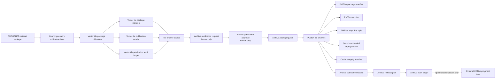

<!-- [KFM_META_BLOCK_V2]
doc_id: kfm://doc/NEEDS_VERIFICATION-usda-plants-tile-archive-publication-layer
title: USDA PLANTS Tile Archive Publication Layer
type: standard
version: v1
status: draft
owners: NEEDS_VERIFICATION-flora-steward
created: NEEDS_VERIFICATION
updated: 2026-05-08
policy_label: NEEDS_VERIFICATION-public
related: [./README.md, ./USDA_PLANTS_PUBLICATION_LAYER.md, ./USDA_PLANTS_COUNTY_GEOMETRY_PUBLICATION_LAYER.md, ./USDA_PLANTS_EXTERNAL_CDN_DEPLOYMENT_LAYER.md, ./USDA_PLANTS_CATALOG_RELEASE_LAYER.md, ../../../../policy/flora/usda_plants_tile_archives.rego, ../../../../policy/flora/usda_plants_tile_archives_test.rego, ../../../../schemas/flora/usda_plants_tile_archive_source.schema.json, ../../../../schemas/flora/usda_plants_tile_archive_publication_request.schema.json, ../../../../schemas/flora/usda_plants_tile_archive_publication_approval.schema.json, ../../../../schemas/flora/usda_plants_tile_archive_packaging_plan.schema.json, ../../../../schemas/flora/usda_plants_tile_archive_publication_audit_ledger.schema.json, ../../../../schemas/flora/usda_plants_tile_archive_rollback_plan.schema.json, ../../../../tools/archive/flora/usda_plants_tile_archive_source_builder.py, ../../../../tools/archive/flora/usda_plants_tile_archive_publication_request_builder.py, ../../../../tools/archive/flora/usda_plants_tile_archive_publication_approval_builder.py, ../../../../tools/archive/flora/usda_plants_tile_archive_packaging_plan_builder.py, ../../../../tools/archive/flora/usda_plants_publish_tile_archives.py, ../../../../tools/archive/flora/usda_plants_tile_archive_publication_audit_ledger_builder.py, ../../../../tools/archive/flora/usda_plants_tile_archive_rollback_plan_builder.py]
tags: [kfm, flora, usda-plants, tile-archive, pmtiles, mbtiles, maplibre, publication, public-safe, rollback]
notes: [doc_id, owner, created date, and final policy label require steward verification. This document replaces a thin three-line stub with a governed tile-archive publication guide. It documents confirmed repository surfaces where inspected, but it does not prove CI enforcement, branch protection, deployed runtime behavior, external CDN deployment, or public release maturity.]
[/KFM_META_BLOCK_V2] -->

<a id="top"></a>

# USDA PLANTS Tile Archive Publication Layer

Controlled tile-archive publication guidance for already-approved USDA PLANTS vector tile packages, producing portable archive artifacts without source fetching, CDN deployment, or new truth claims.


> [!IMPORTANT]
> **Status:** `draft`  
> **Path:** `docs/domains/flora/usda_plants/USDA_PLANTS_TILE_ARCHIVE_PUBLICATION_LAYER.md`  
> **Authority level:** standard source-lane layer document  
> **Lifecycle placement:** `PUBLISHED_VECTOR_TILE_PACKAGE → TILE_ARCHIVE_SOURCE → ARCHIVE_PUBLICATION_REQUEST → ARCHIVE_PUBLICATION_APPROVAL → ARCHIVE_PACKAGING_PLAN → PUBLISHED_TILE_ARCHIVES → ARCHIVE_RECEIPT → ARCHIVE_ROLLBACK_PLAN → ARCHIVE_AUDIT_LEDGER`  
> **Publication posture:** human-approved, vector-tile-derived, portable archive output only  
> **Runtime claim:** this document does **not** prove UI rendering, PMTiles protocol registration, branch protection, CI enforcement, release hosting, or external deployment.

**Quick jumps:** [Purpose](#purpose) · [Repo fit](#repo-fit) · [Scope](#scope) · [Accepted inputs](#accepted-inputs) · [Exclusions](#exclusions) · [Lifecycle placement](#lifecycle-placement) · [Archive contract](#archive-contract) · [Builder flow](#builder-flow) · [Policy gates](#policy-gates) · [MapLibre handoff](#maplibre-handoff) · [Validation checklist](#validation-checklist) · [Rollback and correction](#rollback-and-correction) · [Definition of done](#definition-of-done)

---

## Purpose

This layer defines how a USDA PLANTS **published vector tile package** may be transformed into portable archive artifacts for downstream review, hosting handoff, or future MapLibre consumption.

It exists to keep one boundary bright:

> Tile archives are downstream delivery artifacts. They may carry released, public-safe tile content, but they do not create source truth, approve publication, fetch USDA data, publish county geometry, deploy to a CDN, or become canonical evidence.

### This layer does

| It does | Meaning |
|---|---|
| Registers a tile archive source | Records the already-published vector tile package, publication receipt, and audit ledger as archive inputs. |
| Requires human request and approval | Non-human request or approval is refused before archive publication proceeds. |
| Builds a packaging plan | Records the archive engine, archive targets, source tile package refs, TileJSON refs, output root, and fail-closed guards. |
| Publishes archive artifacts | Creates a PMTiles archive manifest, optional MBTiles handling posture, MapLibre style handoff, cache integrity manifest, static host handoff, and archive receipt. |
| Keeps archives public-safe | Rejects occurrence-coordinate, point-occurrence, raw, work, quarantine, live-download, CDN-deploy, and cloud-upload expansion. |
| Preserves rollback | Emits a rollback plan that marks tile archive outputs as superseded rather than silently deleting or overwriting them. |
| Emits audit evidence | Records hash-addressed archive publication evidence in an audit ledger. |

### This layer does not

| It does not | Correct home |
|---|---|
| Fetch USDA PLANTS data | Live-source readiness, guarded watcher, or source-intake layer |
| Build source rows or taxon datasets | Ingestion / processing / catalog layers |
| Publish the source dataset | [`./USDA_PLANTS_PUBLICATION_LAYER.md`](./USDA_PLANTS_PUBLICATION_LAYER.md) |
| Publish county boundary GeoJSON | [`./USDA_PLANTS_COUNTY_GEOMETRY_PUBLICATION_LAYER.md`](./USDA_PLANTS_COUNTY_GEOMETRY_PUBLICATION_LAYER.md) |
| Create vector tile packages | Vector tile publication layer / tile package builders |
| Deploy archives to Cloudflare, GitHub Pages, S3, or any CDN | [`./USDA_PLANTS_EXTERNAL_CDN_DEPLOYMENT_LAYER.md`](./USDA_PLANTS_EXTERNAL_CDN_DEPLOYMENT_LAYER.md) or a future static-host layer |
| Prove public UI behavior | Governed API, MapLibre shell, Evidence Drawer, and runtime proof surfaces |
| Assert exact occurrence, abundance, rare-location, or legal-status claims | Occurrence/specimen/status authority lanes |
| Store canonical truth | Source, evidence, catalog, release, and proof roots |

[Back to top](#top)

---

## Repo fit

`docs/domains/flora/usda_plants/USDA_PLANTS_TILE_ARCHIVE_PUBLICATION_LAYER.md` is the human-facing guide for the USDA PLANTS tile archive layer. It stays under `docs/domains/` because it explains source-lane meaning and operating boundaries. Tooling, schemas, policies, tests, emitted archives, receipts, proofs, and releases stay under their responsibility roots.

| Direction | Path | Role | Verification posture |
|---|---|---|---:|
| Source-lane README | [`./README.md`](./README.md) | Source boundary, USDA PLANTS layer ladder, lifecycle posture, and reviewer checklist | **CONFIRMED path** |
| Controlled publication layer | [`./USDA_PLANTS_PUBLICATION_LAYER.md`](./USDA_PLANTS_PUBLICATION_LAYER.md) | Publishes public-safe USDA PLANTS non-tile artifacts from sealed promoted packages | **CONFIRMED path** |
| County geometry layer | [`./USDA_PLANTS_COUNTY_GEOMETRY_PUBLICATION_LAYER.md`](./USDA_PLANTS_COUNTY_GEOMETRY_PUBLICATION_LAYER.md) | Separate reviewed county-boundary GeoJSON publication | **CONFIRMED path** |
| External CDN layer | [`./USDA_PLANTS_EXTERNAL_CDN_DEPLOYMENT_LAYER.md`](./USDA_PLANTS_EXTERNAL_CDN_DEPLOYMENT_LAYER.md) | Optional guarded deployment after static artifacts already exist | **CONFIRMED path** |
| Tile archive policy | [`../../../../policy/flora/usda_plants_tile_archives.rego`](../../../../policy/flora/usda_plants_tile_archives.rego) | Denies missing approval, non-human approval, and deployment claims | **CONFIRMED path** |
| Tile archive policy test | [`../../../../policy/flora/usda_plants_tile_archives_test.rego`](../../../../policy/flora/usda_plants_tile_archives_test.rego) | Minimal clean-input policy test | **CONFIRMED path** |
| Archive source builder | [`../../../../tools/archive/flora/usda_plants_tile_archive_source_builder.py`](../../../../tools/archive/flora/usda_plants_tile_archive_source_builder.py) | Registers published vector tile package as archive source | **CONFIRMED path** |
| Archive request builder | [`../../../../tools/archive/flora/usda_plants_tile_archive_publication_request_builder.py`](../../../../tools/archive/flora/usda_plants_tile_archive_publication_request_builder.py) | Builds human-only archive publication request | **CONFIRMED path** |
| Archive approval builder | [`../../../../tools/archive/flora/usda_plants_tile_archive_publication_approval_builder.py`](../../../../tools/archive/flora/usda_plants_tile_archive_publication_approval_builder.py) | Builds human archive publication approval | **CONFIRMED path** |
| Packaging plan builder | [`../../../../tools/archive/flora/usda_plants_tile_archive_packaging_plan_builder.py`](../../../../tools/archive/flora/usda_plants_tile_archive_packaging_plan_builder.py) | Builds PMTiles/MBTiles packaging plan with guarded archive engine selection | **CONFIRMED path** |
| Archive publisher | [`../../../../tools/archive/flora/usda_plants_publish_tile_archives.py`](../../../../tools/archive/flora/usda_plants_publish_tile_archives.py) | Materializes archive artifacts, static host handoff, cache integrity manifest, and receipt | **CONFIRMED path** |
| Audit ledger builder | [`../../../../tools/archive/flora/usda_plants_tile_archive_publication_audit_ledger_builder.py`](../../../../tools/archive/flora/usda_plants_tile_archive_publication_audit_ledger_builder.py) | Hashes archive source, request, approval, plan, artifacts, receipt, and rollback | **CONFIRMED path** |
| Rollback plan builder | [`../../../../tools/archive/flora/usda_plants_tile_archive_rollback_plan_builder.py`](../../../../tools/archive/flora/usda_plants_tile_archive_rollback_plan_builder.py) | Builds human-approved supersession plan for archive artifacts | **CONFIRMED path** |
| Packaging plan schema | [`../../../../schemas/flora/usda_plants_tile_archive_packaging_plan.schema.json`](../../../../schemas/flora/usda_plants_tile_archive_packaging_plan.schema.json) | Machine shape for archive packaging plans | **CONFIRMED path** |
| Archive test files | `../../../../tests/tools/archive/flora/usda_plants_tile_archive*.py` | Test-facing copies or test fixtures for archive tooling | **SEARCH-VISIBLE / NEEDS VERIFICATION** |

> [!NOTE]
> Directory Rules treat `docs/`, `tools/`, `schemas/`, `policy/`, `tests/`, and `data/` as responsibility roots. This document links across those roots instead of creating a new `flora/` or `usda_plants/` root.

[Back to top](#top)

---

## Scope

### This layer owns

| Area | Responsibility |
|---|---|
| Archive source registration | Capture refs to published vector tile package manifest, vector tile publication receipt, and vector tile publication audit ledger. |
| Human archive publication request | Capture a human requester, snapshot date, requested output classes, blocked outputs, and request hash. |
| Human archive publication approval | Capture a human approver, decision, approval conditions, and approval hash. |
| Packaging plan | Capture source refs, TileJSON refs, archive engine, output root, required PMTiles target, optional MBTiles target, and safety guards. |
| Archive publication | Materialize PMTiles-centered archive artifacts from approved inputs and fixture or repo-approved archive engine. |
| Map style handoff | Emit a MapLibre style artifact that references PMTiles delivery and requires runtime PMTiles protocol registration. |
| Static host handoff | Emit handoff metadata for future hosting layers while keeping `deploys=false`. |
| Cache integrity | Emit immutable-cache-style integrity metadata for archive bytes without deploying them. |
| Archive receipt | Record produced archive artifacts, output hashes, and publication state. |
| Archive rollback | Create a plan to mark archive artifacts superseded under human approval. |
| Archive audit ledger | Hash-address the full archive publication chain. |

### This layer deliberately stays narrow

It is not a broad map-product layer. The only tile archive target currently documented as required is the USDA PLANTS county-presence PMTiles archive:

```text
published/flora/usda_plants/<snapshot_date>/archives/county_presence.pmtiles
```

The optional MBTiles target is an archive possibility, not a public deployment claim:

```text
published/flora/usda_plants/<snapshot_date>/archives/county_presence.mbtiles
```

[Back to top](#top)

---

## Accepted inputs

This layer accepts only already-published, already-reviewed, archive-ready tile material and human approval artifacts.

| Input | Required shape | Why it belongs here |
|---|---|---|
| Vector tile package manifest | `published/flora/usda_plants/<snapshot_date>/tiles/tile_package_manifest.json` or repo-equivalent | Establishes that the archive source is already a published vector tile package. |
| Vector tile publication receipt | Hash-bearing publication receipt for the upstream vector tile package | Keeps the tile-to-archive chain inspectable. |
| Vector tile publication audit ledger | Hash-bearing upstream tile publication ledger | Links archive publication to prior tile publication evidence. |
| TileJSON | Published or release-backed TileJSON ref | Binds archive planning to the tile delivery contract. |
| Archive publication request | `usda_plants_tile_archive_publication_request` | Captures human request intent and blocked outputs. |
| Archive publication approval | `usda_plants_tile_archive_publication_approval` | Captures human approval and approval conditions. |
| Archive packaging plan | `usda_plants_tile_archive_packaging_plan` | Binds approved archive source to archive engine and target refs. |
| Fixture PMTiles file | Local fixture or reviewed PMTiles input when using fixture path | Supports deterministic no-network archive publication tests. |
| Fixture MBTiles file | Optional local fixture when MBTiles output is reviewed | Optional output only; do not infer production support. |
| Snapshot date | `YYYY-MM-DD` | Provides stable output path and archive identity. |
| Generated timestamp | ISO 8601 UTC | Supports deterministic tests and auditability. |

### Accepted nearby, not here

| Material | Correct home | Reason |
|---|---|---|
| USDA source rows or snapshots | `data/raw/`, `data/work/`, or `data/quarantine/` after source review | Tile archive publication must not store source payloads. |
| Taxon dataset publication artifacts | Publication layer and `data/published/` | Dataset publication is upstream. |
| County boundary geometry | County geometry publication layer | Geometry publication is separate from archive packaging. |
| Vector tile generation logs | Tile generation layer / tiling tools | This layer archives already-published tiles. |
| CDN deployment credentials or provider config | External deployment layer / protected environment settings | This layer never deploys. |
| Runtime PMTiles protocol wiring | Map shell / UI adapter path | Archive artifacts do not prove runtime support. |
| Receipts and proofs | `data/receipts/`, `data/proofs/`, `release/`, or repo-equivalent | Process memory and proof stay separate from docs. |

[Back to top](#top)

---

## Exclusions

Do **not** use this layer to admit, create, expose, or claim:

- live USDA PLANTS downloads;
- Census or county geometry downloads;
- raw, work, or quarantine references;
- source rows copied into archive metadata;
- plant occurrence coordinates;
- point occurrence tiles;
- hidden coordinate fields;
- rare plant exact public geometry;
- legal protected-status claims;
- image reuse claims;
- raw MapLibre feature properties as evidence authority;
- external CDN deployment;
- Cloudflare upload;
- object storage upload;
- cache purge;
- auto-PR creation;
- auto-merge;
- scheduled publication;
- push-triggered deployment;
- direct public UI reads from archive builders;
- direct model/AI summary publication from archive outputs.

> [!WARNING]
> A tile archive is a delivery artifact. It may help serve or move already-released vector tile content, but it cannot make unreviewed material public-safe and cannot become canonical proof.

[Back to top](#top)

---

## Lifecycle placement

The archive layer begins only after upstream vector tiles are already published.



### State transition rule

```text
PUBLISHED_VECTOR_TILE_PACKAGE
  -> TILE_ARCHIVE_SOURCE
  -> ARCHIVE_PUBLICATION_REQUEST
  -> ARCHIVE_PUBLICATION_APPROVAL
  -> ARCHIVE_PACKAGING_PLAN
  -> PUBLISHED_TILE_ARCHIVES
  -> ARCHIVE_PUBLICATION_RECEIPT
  -> ARCHIVE_ROLLBACK_PLAN
  -> ARCHIVE_PUBLICATION_AUDIT_LEDGER
```

The transition is governed. It is not a file copy, a tile toggle, a style-only change, or a hosting operation.

[Back to top](#top)

---

## Archive contract

### 1. Archive source

The archive source object records the upstream published vector tile package.

| Field / behavior | Required value or posture |
|---|---|
| `object_type` | `usda_plants_tile_archive_source` |
| `domain` | `flora` |
| `source_id` | `usda_plants` |
| `source_tile_root` | `published/flora/usda_plants/<snapshot_date>/tiles` |
| `source_layer` | `county_presence` |
| `tile_format` | `mvt` |
| `tile_scheme` | `xyz` |
| `minzoom` / `maxzoom` | `0` / `8` unless reviewed and changed |
| Required upstream refs | tile package manifest, tile publication receipt, tile publication audit ledger |
| Safety posture | no occurrence coordinates, no point occurrences, no raw/work/quarantine refs, no CDN deployment |
| Hash | `source_hash` |

### 2. Archive publication request

The archive request records a human request to publish portable archive outputs.

| Field / behavior | Required value or posture |
|---|---|
| `object_type` | `usda_plants_tile_archive_publication_request` |
| `requested_by.requester_type` | `human` |
| `intent` | `publish_portable_tile_archive` |
| `publication_state` | `requested` |
| Allowed outputs | PMTiles archive, PMTiles manifest, static host handoff, cache integrity manifest, PMTiles map style |
| Optional outputs | MBTiles archive, MBTiles manifest |
| Blocked outputs | occurrence coordinates, point occurrences, raw files, work files, quarantine files, live downloads, CDN deploy, cloud upload |
| Hash | `request_hash` |

### 3. Archive publication approval

The approval object records a human decision before archive planning and publication.

| Field / behavior | Required value or posture |
|---|---|
| `object_type` | `usda_plants_tile_archive_publication_approval` |
| `approver.approver_type` | `human` |
| Allowed decisions | `approved`, `rejected`, `needs_changes`, or equivalent schema-supported decision |
| Approval conditions | derived only from published vector tile package; no plant occurrence coordinates; no raw/work/quarantine refs; no CDN deployment |
| Hash | `approval_hash` |

### 4. Packaging plan

The packaging plan binds source refs, approval refs, TileJSON, archive engine, target paths, and guards.

| Field / behavior | Required value or posture |
|---|---|
| `object_type` | `usda_plants_tile_archive_packaging_plan` |
| `output_root` | `published/flora/usda_plants/<snapshot_date>/archives` |
| Supported archive engines | `fixture_pmtiles`, `pmtiles_cli`, `mbtiles_fixture` |
| Required target | `published/flora/usda_plants/<snapshot_date>/archives/county_presence.pmtiles` |
| Optional target | `published/flora/usda_plants/<snapshot_date>/archives/county_presence.mbtiles` |
| Guards | human approval required; published vector tiles required; no occurrence coordinates; no raw/work/quarantine refs; no live downloads; no CDN deploy; no cloud upload |
| Hash | `plan_hash` |

> [!IMPORTANT]
> `pmtiles_cli` is an execution-mode dependency. If the repo-native environment cannot find a `pmtiles` executable, the packaging plan builder must fail rather than silently degrade.

### 5. Archive publication artifacts

| Artifact | Path shape | Public role |
|---|---|---|
| PMTiles archive | `published/flora/usda_plants/<snapshot_date>/archives/county_presence.pmtiles` | Portable archive for released county-presence vector tiles |
| PMTiles package manifest | `published/flora/usda_plants/<snapshot_date>/archives/pmtiles_package_manifest.json` | Archive identity, digest, size, source layer, zoom range, fixture/coverage caveats |
| PMTiles MapLibre style | `published/flora/usda_plants/<snapshot_date>/archives/pmtiles_map_style.json` | Style handoff for PMTiles-aware MapLibre runtime |
| Static host handoff | `published/flora/usda_plants/<snapshot_date>/hosting/static_host_handoff.json` | Future-hosting handoff with `deploys=false` |
| Cache integrity manifest | `published/flora/usda_plants/<snapshot_date>/hosting/cache_integrity_manifest.json` | Cache-control and digest evidence for archive bytes |
| Archive publication receipt | `archives/flora/usda_plants/<snapshot_date>/tile_archive_publication_receipt.json` | Archive publication state and produced item refs |
| Archive rollback plan | repo-equivalent archive rollback path | Human-approved supersession plan |
| Archive audit ledger | repo-equivalent archive audit path | Hash-addressed archive publication chain |

[Back to top](#top)

---

## Builder flow

Run from the repository root. Replace paths with the actual upstream published tile package and tile publication evidence under review.

> [!IMPORTANT]
> These commands are archive-publication commands. They must not download USDA PLANTS data, county geometry, Census data, basemaps, or external hosting assets.

```bash
SNAPSHOT_DATE="2026-01-01"
GENERATED_AT="2026-01-01T00:00:00Z"
OUT_ROOT="/tmp/kfm-usda-plants-tile-archive"

TILE_ROOT="${OUT_ROOT}/published/flora/usda_plants/${SNAPSHOT_DATE}/tiles"
ARCHIVE_ROOT="${OUT_ROOT}/archives/flora/usda_plants/${SNAPSHOT_DATE}"
PUBLISHED_ARCHIVE_ROOT="${OUT_ROOT}/published/flora/usda_plants/${SNAPSHOT_DATE}/archives"
HOSTING_ROOT="${OUT_ROOT}/published/flora/usda_plants/${SNAPSHOT_DATE}/hosting"

mkdir -p "${TILE_ROOT}" "${ARCHIVE_ROOT}" "${PUBLISHED_ARCHIVE_ROOT}" "${HOSTING_ROOT}"

VECTOR_TILE_PACKAGE_MANIFEST="${TILE_ROOT}/tile_package_manifest.json"
VECTOR_TILE_PUBLICATION_RECEIPT="${OUT_ROOT}/tiles/flora/usda_plants/${SNAPSHOT_DATE}/tile_publication_receipt.json"
VECTOR_TILE_PUBLICATION_AUDIT_LEDGER="${OUT_ROOT}/tiles/flora/usda_plants/${SNAPSHOT_DATE}/tile_publication_audit_ledger.json"
INPUT_TILEJSON="${TILE_ROOT}/tilejson.json"

# Fixture-mode archive input for deterministic local validation.
FIXTURE_PMTILES="${OUT_ROOT}/fixtures/flora/usda_plants/county_presence.pmtiles"
FIXTURE_MBTILES="${OUT_ROOT}/fixtures/flora/usda_plants/county_presence.mbtiles"
```

### 1. Register the archive source

```bash
python tools/archive/flora/usda_plants_tile_archive_source_builder.py \
  --vector-tile-package-manifest "${VECTOR_TILE_PACKAGE_MANIFEST}" \
  --vector-tile-publication-receipt "${VECTOR_TILE_PUBLICATION_RECEIPT}" \
  --vector-tile-publication-audit-ledger "${VECTOR_TILE_PUBLICATION_AUDIT_LEDGER}" \
  --snapshot-date "${SNAPSHOT_DATE}" \
  --generated-at "${GENERATED_AT}" \
  --out "${ARCHIVE_ROOT}/tile_archive_source.json"
```

### 2. Build a human-only archive publication request

```bash
python tools/archive/flora/usda_plants_tile_archive_publication_request_builder.py \
  --archive-source "${ARCHIVE_ROOT}/tile_archive_source.json" \
  --vector-tile-package-manifest "${VECTOR_TILE_PACKAGE_MANIFEST}" \
  --requester-id "REPLACE_WITH_HUMAN_REQUESTER_ID" \
  --requester-type "human" \
  --snapshot-date "${SNAPSHOT_DATE}" \
  --generated-at "${GENERATED_AT}" \
  --out "${ARCHIVE_ROOT}/tile_archive_publication_request.json"
```

### 3. Build a separate human approval

```bash
python tools/archive/flora/usda_plants_tile_archive_publication_approval_builder.py \
  --archive-publication-request "${ARCHIVE_ROOT}/tile_archive_publication_request.json" \
  --approver-id "REPLACE_WITH_HUMAN_APPROVER_ID" \
  --approver-type "human" \
  --decision "approved" \
  --snapshot-date "${SNAPSHOT_DATE}" \
  --generated-at "${GENERATED_AT}" \
  --out "${ARCHIVE_ROOT}/tile_archive_publication_approval.json"
```

### 4. Build the packaging plan

Use `fixture_pmtiles` for no-network deterministic validation.

```bash
python tools/archive/flora/usda_plants_tile_archive_packaging_plan_builder.py \
  --archive-source "${ARCHIVE_ROOT}/tile_archive_source.json" \
  --archive-publication-approval "${ARCHIVE_ROOT}/tile_archive_publication_approval.json" \
  --input-tile-package-manifest "${VECTOR_TILE_PACKAGE_MANIFEST}" \
  --input-tilejson "${INPUT_TILEJSON}" \
  --archive-engine "fixture_pmtiles" \
  --snapshot-date "${SNAPSHOT_DATE}" \
  --generated-at "${GENERATED_AT}" \
  --out "${ARCHIVE_ROOT}/tile_archive_packaging_plan.json"
```

Use `pmtiles_cli` only after the active repo environment confirms the CLI is installed and accepted for this lane.

```bash
python tools/archive/flora/usda_plants_tile_archive_packaging_plan_builder.py \
  --archive-source "${ARCHIVE_ROOT}/tile_archive_source.json" \
  --archive-publication-approval "${ARCHIVE_ROOT}/tile_archive_publication_approval.json" \
  --input-tile-package-manifest "${VECTOR_TILE_PACKAGE_MANIFEST}" \
  --input-tilejson "${INPUT_TILEJSON}" \
  --archive-engine "pmtiles_cli" \
  --snapshot-date "${SNAPSHOT_DATE}" \
  --generated-at "${GENERATED_AT}" \
  --out "${ARCHIVE_ROOT}/tile_archive_packaging_plan.json"
```

### 5. Publish the archive package

```bash
python tools/archive/flora/usda_plants_publish_tile_archives.py \
  --packaging-plan "${ARCHIVE_ROOT}/tile_archive_packaging_plan.json" \
  --fixture-pmtiles "${FIXTURE_PMTILES}" \
  --out-root "${OUT_ROOT}" \
  --snapshot-date "${SNAPSHOT_DATE}" \
  --generated-at "${GENERATED_AT}"
```

Optional MBTiles fixture, if the lane and tests explicitly admit it:

```bash
python tools/archive/flora/usda_plants_publish_tile_archives.py \
  --packaging-plan "${ARCHIVE_ROOT}/tile_archive_packaging_plan.json" \
  --fixture-pmtiles "${FIXTURE_PMTILES}" \
  --fixture-mbtiles "${FIXTURE_MBTILES}" \
  --out-root "${OUT_ROOT}" \
  --snapshot-date "${SNAPSHOT_DATE}" \
  --generated-at "${GENERATED_AT}"
```

### 6. Build the rollback plan

```bash
python tools/archive/flora/usda_plants_tile_archive_rollback_plan_builder.py \
  --pmtiles-package-manifest "${PUBLISHED_ARCHIVE_ROOT}/pmtiles_package_manifest.json" \
  --static-host-handoff "${HOSTING_ROOT}/static_host_handoff.json" \
  --snapshot-date "${SNAPSHOT_DATE}" \
  --generated-at "${GENERATED_AT}" \
  --out "${ARCHIVE_ROOT}/tile_archive_rollback_plan.json"
```

### 7. Build the audit ledger

```bash
python tools/archive/flora/usda_plants_tile_archive_publication_audit_ledger_builder.py \
  --archive-source "${ARCHIVE_ROOT}/tile_archive_source.json" \
  --archive-publication-request "${ARCHIVE_ROOT}/tile_archive_publication_request.json" \
  --archive-publication-approval "${ARCHIVE_ROOT}/tile_archive_publication_approval.json" \
  --packaging-plan "${ARCHIVE_ROOT}/tile_archive_packaging_plan.json" \
  --pmtiles-package-manifest "${PUBLISHED_ARCHIVE_ROOT}/pmtiles_package_manifest.json" \
  --static-host-handoff "${HOSTING_ROOT}/static_host_handoff.json" \
  --cache-integrity-manifest "${HOSTING_ROOT}/cache_integrity_manifest.json" \
  --pmtiles-map-style "${PUBLISHED_ARCHIVE_ROOT}/pmtiles_map_style.json" \
  --archive-publication-receipt "${ARCHIVE_ROOT}/tile_archive_publication_receipt.json" \
  --rollback-plan "${ARCHIVE_ROOT}/tile_archive_rollback_plan.json" \
  --snapshot-date "${SNAPSHOT_DATE}" \
  --generated-at "${GENERATED_AT}" \
  --out "${ARCHIVE_ROOT}/tile_archive_publication_audit_ledger.json"
```

### 8. Run policy checks

Run only when OPA is installed and the active repo confirms this command.

```bash
opa test \
  policy/flora/usda_plants_tile_archives.rego \
  policy/flora/usda_plants_tile_archives_test.rego
```

### 9. Run archive tests

Run only after the active checkout confirms the repo-native Python test runner and paths.

```bash
python -m pytest \
  tests/tools/archive/flora/usda_plants_tile_archive_source_builder.py \
  tests/tools/archive/flora/usda_plants_tile_archive_publication_request_builder.py \
  tests/tools/archive/flora/usda_plants_tile_archive_publication_approval_builder.py \
  tests/tools/archive/flora/usda_plants_tile_archive_packaging_plan_builder.py \
  tests/tools/archive/flora/usda_plants_publish_tile_archives.py \
  tests/tools/archive/flora/usda_plants_tile_archive_rollback_plan_builder.py \
  tests/tools/archive/flora/usda_plants_tile_archive_publication_audit_ledger_builder.py
```

> [!NOTE]
> Test file paths are search-visible in the repository, but this document does not claim those tests are currently wired into CI, passing on `main`, or merge-blocking.

[Back to top](#top)

---

## Policy gates

The tile archive policy is intentionally small and fail-closed.

| Deny code | Meaning |
|---|---|
| `USDA_PLANTS_ARCHIVE_APPROVAL_MISSING` | Archive publication approval object is missing. |
| `USDA_PLANTS_ARCHIVE_NON_HUMAN_APPROVAL` | Approver is not human. |
| `USDA_PLANTS_ARCHIVE_DEPLOYMENT_CLAIM` | Static host handoff claims deployment. |

### Builder refusal guards

| Builder guard | Required behavior |
|---|---|
| Non-human archive request | Request builder exits with `USDA_PLANTS_ARCHIVE_REQUEST_NON_HUMAN_REFUSED`. |
| Non-human approval | Approval builder exits with `USDA_PLANTS_ARCHIVE_NON_HUMAN_APPROVAL_REFUSED`. |
| Unsupported archive engine | Packaging plan builder exits with `USDA_PLANTS_ARCHIVE_PLAN_UNSUPPORTED_ENGINE`. |
| Missing PMTiles CLI when `pmtiles_cli` is selected | Packaging plan builder exits with `USDA_PLANTS_ARCHIVE_PLAN_PMTILES_CLI_UNAVAILABLE`. |
| Deployment attempt in archive layer | Policy denies `USDA_PLANTS_ARCHIVE_DEPLOYMENT_CLAIM`. |

### Minimum negative cases to preserve

- Approval missing.
- Approver is non-human.
- Static host handoff has `deploys=true`.
- Archive request comes from non-human requester.
- Archive engine is unsupported.
- `pmtiles_cli` is selected without a confirmed CLI.
- Archive refs point to `raw/`, `work/`, or `quarantine/`.
- Archive manifest claims occurrence coordinates.
- Archive package claims production coverage while running in fixture mode.
- PMTiles style points to unreviewed or non-published artifacts.
- Audit ledger is missing one or more required evidence artifacts.
- Rollback plan does not require human approval.

[Back to top](#top)

---

## MapLibre handoff

The archive publisher emits a `pmtiles_map_style.json` artifact for downstream MapLibre-aware runtime work.

### What the style may say

| Field / behavior | Meaning |
|---|---|
| `object_type` | `usda_plants_published_pmtiles_map_style` |
| `requires_protocol` | `pmtiles` |
| `requires_maplibre_addProtocol` | `true` |
| `pmtiles_ref` | Published PMTiles archive ref |
| `source-layer` | `county_presence` |
| `attribution` | USDA PLANTS and county-boundary attribution text |
| `safety.contains_occurrence_coordinates` | `false` |
| `safety.uses_pmtiles_protocol` | `true` |
| `safety.deploys_to_cdn` | `false` |

### What the style must not imply

| Not implied | Why |
|---|---|
| Runtime PMTiles protocol is wired | Runtime adapter must be verified separately. |
| MapLibre layer is live | UI shell and layer registry are separate implementation surfaces. |
| The tile archive is canonical evidence | Tiles and archives are downstream carriers. |
| County presence is exact occurrence | USDA PLANTS county context remains broad distribution context. |
| CDN deployment occurred | Static host handoff remains `deploys=false`. |
| The user can inspect claims without Evidence Drawer | Public claims still require EvidenceBundle-backed explanation. |

> [!CAUTION]
> The MapLibre style is a delivery convenience. It must stay downstream of source role, evidence resolution, policy, review, release manifest, archive receipt, and rollback target.

[Back to top](#top)

---

## Published archive artifacts

### PMTiles package manifest

| Field | Requirement |
|---|---|
| `object_type` | `usda_plants_pmtiles_package_manifest` |
| `archive_format` | `pmtiles` |
| `archive_ref` | `published/flora/usda_plants/<snapshot_date>/archives/county_presence.pmtiles` |
| `archive_engine` | Copied from packaging plan |
| `sha256` | Required |
| `size_bytes` | Required |
| `source_layer` | `county_presence` |
| `minzoom` / `maxzoom` | `0` / `8` unless reviewed |
| `fixture_mode` | `true` when fixture PMTiles source is used |
| `production_coverage_claim` | `false` unless separately validated |
| `safety.contains_occurrence_coordinates` | `false` |
| `manifest_hash` | Required |

### Static host handoff

| Field | Requirement |
|---|---|
| `object_type` | `usda_plants_static_host_handoff` |
| `artifact_root` | `published/flora/usda_plants/<snapshot_date>/archives` |
| `hosting_root` | `published/flora/usda_plants/<snapshot_date>/hosting` |
| `deploys` | `false` |
| `upload_target` | `null` |
| `blocked_actions` | `cdn_deploy`, `cloud_upload`, `auto_pr`, `auto_merge` |
| `status` | `ready_for_future_deploy` |
| `handoff_hash` | Required |

### Cache integrity manifest

| Field | Requirement |
|---|---|
| `object_type` | `usda_plants_cache_integrity_manifest` |
| `items[].path` | PMTiles archive ref |
| `items[].sha256` | PMTiles digest |
| `items[].content_type` | `application/octet-stream` unless repo policy changes |
| `items[].cache_control` | Immutable-style public cache instruction for future hosting review |
| `integrity_hash` | Required |

### Archive publication receipt

| Field | Requirement |
|---|---|
| `object_type` | `usda_plants_tile_archive_publication_receipt` |
| `packaging_plan_ref` | Required |
| `pmtiles_package_manifest_ref` | Required |
| `static_host_handoff_ref` | Required |
| `cache_integrity_manifest_ref` | Required |
| `pmtiles_map_style_ref` | Required |
| `published_items[]` | Each item has role, target ref, sha256, and status |
| `deploys` | `false` |
| `publication_state` | `published` |
| `receipt_hash` | Required |

### Audit ledger

The audit ledger should record at least:

```text
tile_archive_source
tile_archive_publication_request
tile_archive_publication_approval
tile_archive_packaging_plan
pmtiles_package_manifest
static_host_handoff
cache_integrity_manifest
pmtiles_map_style
tile_archive_publication_receipt
tile_archive_rollback_plan
```

[Back to top](#top)

---

## Safety posture

Tile archives preserve the safety posture of upstream public-safe tile products. They do not reduce the review burden.

| Risk | Required response |
|---|---|
| Occurrence coordinates appear in archive source, TileJSON, style, or manifest | Stop publication; quarantine archive packet; open sensitivity review. |
| Raw/work/quarantine refs appear in any archive artifact | Stop publication; rebuild from published-only refs. |
| Static host handoff claims deployment | Deny through policy; route to external deployment layer only after publication. |
| PMTiles style hides source or attribution | Regenerate style and manifest; block downstream UI use. |
| Fixture mode is confused with production coverage | Keep `fixture_mode=true` and `production_coverage_claim=false`; require separate production validation. |
| Archive engine changes | Rebuild packaging plan, receipt, audit ledger, and rollback plan. |
| Zoom extent or source layer changes | Rebuild package manifest and style; rerun validation and policy. |
| Archive is superseded | Mark superseded with rollback plan; do not silently overwrite. |

[Back to top](#top)

---

## Validation checklist

Before archive artifacts are trusted as release-ready:

- [ ] Metadata placeholders in this document are resolved or intentionally retained with review notes.
- [ ] Relative links are checked from `docs/domains/flora/usda_plants/`.
- [ ] Upstream vector tile package manifest exists and is published.
- [ ] Upstream vector tile publication receipt exists and has a stable hash.
- [ ] Upstream vector tile publication audit ledger exists and has a stable hash.
- [ ] Archive source object records only published vector tile refs.
- [ ] Archive request is human-requested.
- [ ] Archive approval is human-approved.
- [ ] Packaging plan uses one approved archive engine: `fixture_pmtiles`, `pmtiles_cli`, or `mbtiles_fixture`.
- [ ] `pmtiles_cli` is not selected unless the active environment confirms the CLI is available.
- [ ] Packaging plan requires published vector tiles and blocks occurrence coordinates, raw/work/quarantine refs, live downloads, CDN deploy, and cloud upload.
- [ ] PMTiles archive exists at the expected `published/flora/usda_plants/<snapshot_date>/archives/` path.
- [ ] PMTiles package manifest records digest, size, source layer, zoom range, and safety flags.
- [ ] PMTiles MapLibre style includes PMTiles protocol requirement but does not claim runtime wiring.
- [ ] Static host handoff has `deploys=false`.
- [ ] Cache integrity manifest records archive digest and content metadata.
- [ ] Archive publication receipt records published item refs and hashes.
- [ ] Rollback plan exists and requires human approval to mark archive artifacts superseded.
- [ ] Archive audit ledger hashes archive source, request, approval, plan, package manifest, style, static handoff, integrity manifest, receipt, and rollback plan.
- [ ] Policy tests pass in a repo-native environment.
- [ ] No public client reads RAW / WORK / QUARANTINE paths directly.
- [ ] External deployment remains out of scope unless the external deployment layer is separately reviewed.

[Back to top](#top)

---

## Rollback and correction

Tile archive rollback is **human-approved supersession**, not silent deletion.

| Failure | Required response |
|---|---|
| Wrong upstream tile package archived | Mark archive superseded; rebuild from correct tile package; emit correction and new audit ledger. |
| PMTiles digest mismatch | Block downstream use; regenerate package manifest, receipt, ledger, and rollback plan. |
| PMTiles style references wrong archive | Supersede style artifact and regenerate receipt / audit ledger. |
| Static handoff claims deployment | Deny archive packet and reroute any deployment request to external deployment layer. |
| Cache integrity manifest is wrong | Supersede cache integrity manifest; rebuild receipt and ledger. |
| Occurrence coordinates leak | Withdraw/supersede archive immediately, quarantine source tile package, open sensitivity review. |
| Raw/work/quarantine ref leaks | Withdraw/supersede archive and rebuild from published-only refs. |
| Unsupported archive engine used | Reject packaging plan and rebuild under supported engine. |
| Fixture archive is treated as production | Publish correction; update manifest caveats; require production validation before wider use. |
| Audit ledger incomplete | Block downstream deployment and rebuild ledger from archive artifacts. |

### Rollback invariant

```text
No tile archive publication is complete unless it resolves to:
  upstream vector tile package manifest
  + upstream vector tile publication receipt
  + upstream vector tile publication audit ledger
  + tile archive source
  + archive publication request
  + archive publication approval
  + archive packaging plan
  + PMTiles package manifest
  + PMTiles map style
  + static host handoff
  + cache integrity manifest
  + archive publication receipt
  + archive rollback plan
  + archive publication audit ledger
```

[Back to top](#top)

---

## CI posture

This layer can be tested locally and in CI, but no CI claim should be made from this document alone.

| Check | Command or evidence | Status |
|---|---|---:|
| Archive policy | `opa test policy/flora/usda_plants_tile_archives.rego policy/flora/usda_plants_tile_archives_test.rego` | **NEEDS VERIFICATION** |
| Archive source builder | `python -m pytest tests/tools/archive/flora/usda_plants_tile_archive_source_builder.py` | **NEEDS VERIFICATION** |
| Archive request builder | `python -m pytest tests/tools/archive/flora/usda_plants_tile_archive_publication_request_builder.py` | **NEEDS VERIFICATION** |
| Archive approval builder | `python -m pytest tests/tools/archive/flora/usda_plants_tile_archive_publication_approval_builder.py` | **NEEDS VERIFICATION** |
| Packaging plan builder | `python -m pytest tests/tools/archive/flora/usda_plants_tile_archive_packaging_plan_builder.py` | **NEEDS VERIFICATION** |
| Archive publisher | `python -m pytest tests/tools/archive/flora/usda_plants_publish_tile_archives.py` | **NEEDS VERIFICATION** |
| Rollback plan builder | `python -m pytest tests/tools/archive/flora/usda_plants_tile_archive_rollback_plan_builder.py` | **NEEDS VERIFICATION** |
| Audit ledger builder | `python -m pytest tests/tools/archive/flora/usda_plants_tile_archive_publication_audit_ledger_builder.py` | **NEEDS VERIFICATION** |
| PMTiles CLI availability | `command -v pmtiles` when `pmtiles_cli` is selected | **NEEDS VERIFICATION** |
| No source fetch | inspect builder commands and workflow triggers | **NEEDS VERIFICATION** |
| No external deploy | inspect static handoff, policy, and deployment workflows | **NEEDS VERIFICATION** |

> [!WARNING]
> Passing unit tests alone does not prove public release. Release readiness requires upstream publication evidence, human approval, public-safe artifacts, policy checks, receipts, audit ledger, rollback plan, and review of downstream deployment boundaries.

[Back to top](#top)

---

## Definition of done

This document is ready to move from `draft` toward `review` when:

- [ ] `doc_id`, owner, created date, and final policy label are verified.
- [ ] Relative links are checked from `docs/domains/flora/usda_plants/`.
- [ ] Archive schemas exist and validate the generated archive object family.
- [ ] Archive tools run in the repo-native Python/test environment.
- [ ] Policy tests deny missing approval, non-human approval, and deployment claims.
- [ ] Negative tests cover unsupported archive engine, missing PMTiles CLI, raw/work/quarantine refs, coordinate leaks, and deploy claims.
- [ ] PMTiles fixture path is deterministic and public-safe.
- [ ] Fixture output clearly marks `fixture_mode=true` and `production_coverage_claim=false`.
- [ ] Archive receipt, rollback plan, and audit ledger are generated for the same snapshot.
- [ ] MapLibre handoff style is reviewed as a delivery artifact, not as truth authority.
- [ ] Static host handoff keeps `deploys=false`.
- [ ] External deployment docs consume this layer only as an input, not as a shortcut.
- [ ] A maintainer has checked whether archive tests are CI-wired and merge-blocking.
- [ ] No section claims runtime, UI, CDN, or public deployment behavior without current evidence.

[Back to top](#top)

---

## Appendix

<details>
<summary>Archive object family</summary>

| Object type | Producer | Primary hash | Generated / maintained |
|---|---|---:|---|
| `usda_plants_tile_archive_source` | `usda_plants_tile_archive_source_builder.py` | `source_hash` | Generated |
| `usda_plants_tile_archive_publication_request` | `usda_plants_tile_archive_publication_request_builder.py` | `request_hash` | Generated from human input |
| `usda_plants_tile_archive_publication_approval` | `usda_plants_tile_archive_publication_approval_builder.py` | `approval_hash` | Generated from human decision |
| `usda_plants_tile_archive_packaging_plan` | `usda_plants_tile_archive_packaging_plan_builder.py` | `plan_hash` | Generated |
| `usda_plants_pmtiles_package_manifest` | `usda_plants_publish_tile_archives.py` | `manifest_hash` | Generated |
| `usda_plants_published_pmtiles_map_style` | `usda_plants_publish_tile_archives.py` | `style_hash` | Generated |
| `usda_plants_static_host_handoff` | `usda_plants_publish_tile_archives.py` | `handoff_hash` | Generated |
| `usda_plants_cache_integrity_manifest` | `usda_plants_publish_tile_archives.py` | `integrity_hash` | Generated |
| `usda_plants_tile_archive_publication_receipt` | `usda_plants_publish_tile_archives.py` | `receipt_hash` | Generated |
| `usda_plants_tile_archive_rollback_plan` | `usda_plants_tile_archive_rollback_plan_builder.py` | `rollback_hash` | Generated |
| `usda_plants_tile_archive_publication_audit_ledger` | `usda_plants_tile_archive_publication_audit_ledger_builder.py` | `ledger_hash` | Generated |

</details>

<details>
<summary>Path update rules</summary>

| Change | Required companion update |
|---|---|
| Archive engine changes | Packaging plan schema, builder tests, policy notes, this doc |
| PMTiles output path changes | Package manifest, MapLibre style, static host handoff, cache integrity manifest, audit ledger, rollback plan |
| Tile source layer changes | Archive source, packaging plan, PMTiles manifest, MapLibre style, validation checklist |
| Zoom range changes | Archive source, package manifest, UI/runtime caveat, test fixtures |
| Static host handoff changes | External deployment layer, policy, cache integrity docs, audit ledger |
| MapLibre style changes | MapLibre/UI docs, layer registry, Evidence Drawer caveats, runtime proof tests |
| Audit ledger entries change | Audit ledger builder, schema, rollback invariant, validation checklist |
| Rollback strategy changes | Rollback plan schema, correction docs, publication layer notes |
| External deployment begins | External CDN layer, protected environment docs, deployment policy, secret-handling docs |

</details>

<details>
<summary>Reference source pointers for steward review</summary>

These links are included as source pointers for maintainers. Reverify access paths, terms, cadence, field shapes, and attribution before live activation or publication changes.

[USDA PLANTS landing]: https://plants.sc.egov.usda.gov/home  
[USDA PLANTS downloads]: https://plants.sc.egov.usda.gov/downloads  
[USDA PLANTS state search]: https://plants.sc.egov.usda.gov/state-search  
[data.gov PLANTS dataset]: https://catalog.data.gov/dataset/plant-list-of-accepted-nomenclature-taxonomy-and-symbols-plants-database  

</details>

[Back to top](#top)
