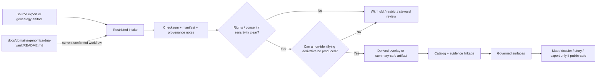

<!-- [KFM_META_BLOCK_V2]
doc_id: kfm://doc/NEEDS-VERIFICATION
title: Kansas Frontier Matrix — Genomics
type: standard
version: v1
status: draft
owners: NEEDS VERIFICATION
created: YYYY-MM-DD
updated: YYYY-MM-DD
policy_label: NEEDS VERIFICATION
related: [docs/domains/README.md, docs/domains/genomics/dna-vault/README.md]
tags: [kfm, genomics, genealogy, provenance, privacy]
notes: [Root target file is currently empty in the public repo view; owners, dates, policy label, and durable doc_id need verification before merge.]
[/KFM_META_BLOCK_V2] -->

# Kansas Frontier Matrix — Genomics

High-sensitivity lane index for provenance-bound handling of genetic and genealogy materials in KFM, anchored to the currently confirmed `dna-vault` subtree.


| Field | Value |
|---|---|
| Status | `experimental` |
| Owners | `NEEDS VERIFICATION` |
| Repo fit | `docs/domains/genomics/README.md` → upstream [`../README.md`](../README.md) → downstream [`./dna-vault/README.md`](./dna-vault/README.md) |
| Current confirmed subtree | `README.md`, `dna-vault/README.md` |
| Primary role | Lane boundary, routing, and publication-burden guidance |
| Public-safe default | Derived, non-identifying overlays only |

**Quick jumps:** [Scope](#scope) · [Repo fit](#repo-fit) · [Accepted inputs](#accepted-inputs) · [Exclusions](#exclusions) · [Directory tree](#directory-tree) · [Quickstart](#quickstart) · [Usage](#usage) · [Diagram](#diagram) · [Tables](#tables) · [Task list](#task-list) · [FAQ](#faq) · [Appendix](#appendix)

> [!IMPORTANT]
> In KFM, genomics is not a decorative topic tag. It is a review-bearing operating lane whose burden changes identity handling, consent posture, redistribution posture, evidence visibility, and what may reach a public-safe surface.

> [!WARNING]
> This README keeps implementation depth conservative. The current public repo view confirms a genomics lane directory and a populated downstream [`dna-vault`](./dna-vault/README.md) workflow, but it does **not** confirm mounted genomics contracts, CI, APIs, or schema inventories from this path.

---

## Scope

**CONFIRMED:** the public docs tree contains a `docs/domains/genomics/` lane with a populated downstream [`dna-vault/README.md`](./dna-vault/README.md), and that downstream document defines an evidence-first, provenance-bound, privacy-sensitive workflow for consumer DNA and genealogy materials.

**INFERRED:** this root README should act as the lane-level boundary document above `dna-vault`, clarifying what belongs in genomics, what must remain restricted, and what kinds of derived outputs are plausible candidates for governed outward use.

**UNKNOWN:** mounted genomics contracts, policy bundles, fixtures, API envelopes, runtime behaviors, and publication classes beyond the current documentation slice.

A practical reading rule for this directory:

- Use this file to understand **lane posture**.
- Use [`./dna-vault/README.md`](./dna-vault/README.md) to understand the **currently confirmed downstream workflow nucleus**.
- Treat any broader genomics expansion as **PROPOSED / NEEDS VERIFICATION** unless the repo later surfaces contracts, tests, or additional domain docs.

[Back to top](#kansas-frontier-matrix--genomics)

---

## Repo fit

| Aspect | Current reading |
|---|---|
| Path | `docs/domains/genomics/README.md` |
| Upstream doctrinal context | [`../README.md`](../README.md) |
| Confirmed downstream workflow | [`./dna-vault/README.md`](./dna-vault/README.md) |
| Adjacent lane examples | [`../soils/README.md`](../soils/README.md), [`../hydrology/README.md`](../hydrology/README.md) |
| Best current role | Root lane README for genomics/genealogy boundary-setting |
| Not this file’s job | To pretend that mounted schemas, CI, APIs, or public genomics products are already verified here |

### Current subtree certainty

| Path element | Status | Notes |
|---|---|---|
| `docs/domains/genomics/README.md` | **CONFIRMED** | Current target path |
| `docs/domains/genomics/dna-vault/README.md` | **CONFIRMED** | Current downstream documentation anchor |
| Additional genomics docs/subtrees | **UNKNOWN** | Not confirmed in the current public tree |
| Normalized lane expansion structure | **PROPOSED** | Useful for future growth, not a claim of current repo state |

---

## Accepted inputs

The currently **confirmed** accepted input families come from the downstream DNA Vault workflow and should be read as the lane’s present documented nucleus.

- SNP array exports such as `.txt`, `.csv`, and `.zip`
- Genealogy tree exchange files such as `.ged`
- Variant files such as `.vcf` and `.vcf.gz`
- Alignment files such as `.bam` and `.cram`

### Interpretation rule

These inputs are **not** equivalent in burden.

- Raw genotype or sequence-bearing exports are identity-bearing and review-heavy.
- Genealogy trees are family-linkage artifacts and may implicate third parties.
- Consent, rights, and manifest artifacts are governance objects, not decorative metadata.
- Derived overlays are the likeliest outward-facing outputs, but only after review.

---

## Exclusions

This lane should **not** be used for the following, and where possible the destination is named explicitly.

- Direct publication of raw genotype, genome, or identity-linkable family datasets. Route those to restricted handling workflows such as [`./dna-vault/README.md`](./dna-vault/README.md), not to outward map, story, or export surfaces.
- Identity linkage without an explicit consent and rights basis.
- Redistribution of provider exports where redistribution posture is unresolved.
- Treating inferred family relationships, matching results, or narrative summaries as sovereign truth.
- Quietly collapsing sensitive raw artifacts into “just another dataset.”
- Claiming genomics-specific CI, schema, contract, or runtime support from this directory unless later repo evidence confirms it.

> [!NOTE]
> The safe default in this lane is **withhold or restrict first**, then explicitly justify any narrower or more public release posture.

[Back to top](#kansas-frontier-matrix--genomics)

---

## Directory tree

### Confirmed current tree

```text
docs/domains/genomics/
├── README.md
└── dna-vault/
    └── README.md
```

### Proposed normalized expansion shape

<details>
<summary>PROPOSED / NEEDS VERIFICATION subtree for future growth</summary>

```text
docs/domains/genomics/
├── README.md
├── dna-vault/
│   └── README.md
├── sources/                    # source-role notes, provider/export descriptors
├── publication/                # public-safe overlay rules, review classes
├── validation/                 # integrity, checksum, consent, and schema notes
├── overlays/                   # outward-safe derived product guidance
└── examples/                   # illustrative non-identifying examples only
```

This is a documentation design convenience, not a statement that these paths already exist.
</details>

---

## Quickstart

### 1) Triage the incoming artifact

Decide what kind of object you are handling **before** you decide where it goes.

```yaml
lane_triage:
  source_role: raw_export | genealogy_tree | consent_artifact | derived_overlay
  publication_default: withhold_until_review
  downstream_workflow: docs/domains/genomics/dna-vault/README.md
  public_surface_allowed: non_identifying_overlay_only
```

*Illustrative example only.*

### 2) Route restricted material correctly

If the artifact contains raw genetic content, family-linkage content, or unresolved rights posture:

1. Treat it as restricted.
2. Route it to the downstream DNA Vault workflow.
3. Capture integrity and provenance artifacts before any downstream transformation.

### 3) Separate raw from outward-safe outputs

Keep the boundary explicit:

- raw exports
- manifests / checksums / receipts
- review-bearing governance artifacts
- derived, non-identifying overlays

Do **not** let those collapse into one publication object.

### 4) Record minimum provenance expectations

Before any outward-safe derivative is discussed, the lane should have a documented answer for:

- what the source was
- what rights or redistribution limits apply
- what consent posture applies
- what transform created the derivative
- what evidence object would let a reviewer reconstruct the claim

### 5) Link, do not duplicate

If a workflow is already documented downstream, link to it from this root lane README instead of restating it loosely here.

---

## Usage

Use this README in four narrow ways.

| Use this file when you need to… | Go to |
|---|---|
| understand the genomics lane boundary | [Scope](#scope) |
| confirm what currently belongs here | [Accepted inputs](#accepted-inputs) |
| check what must not be published or implied | [Exclusions](#exclusions) |
| move from lane posture to the currently confirmed workflow nucleus | [`./dna-vault/README.md`](./dna-vault/README.md) |

### Authoring rule

When expanding this lane:

- add **confirmed** structure only where the repo now proves it;
- keep broader lane logic **inferred** only when it is conservative and reversible;
- mark implementation gaps as **UNKNOWN** instead of smoothing them away.

### Review rule

A good genomics lane doc for KFM should feel more like a **trust boundary** than a feature brochure.

[Back to top](#kansas-frontier-matrix--genomics)

---

## Diagram



---

## Tables

### Source-role matrix

| Artifact family | Current lane role | Default handling | Outward-safe? | Notes |
|---|---|---|---|---|
| Raw genotype / sequence export | Authoritative source export | Restricted intake | No | Route through DNA Vault-style provenance/privacy handling |
| Genealogy tree / family-linkage artifact | Context-bearing source artifact | Restricted or review-bearing | No | May expose third-party relationships |
| Consent / rights / export-permission record | Governance artifact | Keep with manifest/review bundle | Rarely | Needed to justify broader handling |
| Manifest / checksum / spec-hash / receipt | Integrity and provenance object | Preserve with evidence chain | Sometimes | Useful if content-free and non-identifying |
| Derived non-identifying overlay | Downstream publication candidate | Review before release | Case-by-case | Must not recreate raw identity or genotype exposure |

### Publication caution registry

| Risk | Why it matters | Default response |
|---|---|---|
| Raw genetic content exposure | Direct identity or re-identification risk | Withhold from outward surfaces |
| Family-linkage exposure | Can implicate relatives who did not directly supply the artifact | Restrict and review |
| Rights or redistribution unknown | KFM doctrine fails closed when rights posture is unresolved | Do not publish |
| Place-linked lineage specificity | Combining family data with geography can raise exposure risk | Generalize or withhold |
| Thin or overly specific derived overlay | Small cohorts or sparse outputs can recreate identity cues | Aggregate further or deny |
| Narrative summary without inspectable support | Violates evidence-first trust posture | Abstain or withhold |

### Current certainty map

| Statement type | Status |
|---|---|
| The genomics lane exists in the public docs tree | **CONFIRMED** |
| `dna-vault` is the current downstream workflow anchor | **CONFIRMED** |
| The lane should remain restricted-by-default for raw genetic and family-linkage artifacts | **INFERRED** |
| Mounted genomics contracts, schemas, CI, or API surfaces exist here today | **UNKNOWN** |
| Additional genomics documentation subtrees should eventually exist | **PROPOSED** |

[Back to top](#kansas-frontier-matrix--genomics)

---

## Task list

### Definition of done for this README

- [ ] Replace placeholder metadata values in the KFM meta block with verified values.
- [ ] Confirm lane owners and responsibility boundaries.
- [ ] Verify that upstream and downstream relative links resolve in the target branch.
- [ ] Keep raw-data handling language aligned with [`./dna-vault/README.md`](./dna-vault/README.md).
- [ ] Do not add contracts, schema paths, CI jobs, APIs, or runtime claims unless repo evidence confirms them.
- [ ] Add public-safe overlay examples only if they are truly non-identifying and review-safe.
- [ ] Cross-link this README from adjacent docs if the lane becomes more central to the docs atlas.

### Merge gate intent

This file should not be treated as complete merely because it renders nicely. It is complete when the lane boundary is clearer, stronger, and more honest than before.

---

## FAQ

### Is genomics public-safe by default?

No. The current lane posture is restricted-first for raw genetic and family-linkage artifacts. Public-safe use is limited to derived, non-identifying outputs that survive review.

### Where should raw DNA and genealogy exports go?

To the downstream restricted workflow documented at [`./dna-vault/README.md`](./dna-vault/README.md), not directly to outward-facing domain surfaces.

### Does this README prove current genomics implementation depth?

No. It is a lane README, not proof that genomics contracts, CI, APIs, or release artifacts are already mounted and verified in this subtree.

### Why keep a root genomics README if the current subtree is small?

Because the lane still needs a clear boundary document above the workflow nucleus. Without it, the directory reads like a single special-case workflow instead of a governed operating lane.

[Back to top](#kansas-frontier-matrix--genomics)

---

## Appendix

<details>
<summary>Open verification backlog</summary>

### NEEDS VERIFICATION

- durable `doc_id`, `owners`, `created`, `updated`, and `policy_label` values for the meta block
- whether the genomics lane is intended to remain narrowly centered on DNA/genealogy provenance or expand into broader bioinformatics/public-health use cases
- any mounted contracts, schemas, fixtures, or policy bundles specific to genomics
- any public-safe overlay examples already emitted by the repo
- any review templates or evidence payloads specific to consent, kinship, or redistribution posture

### Recommended next documentation move

If this lane expands, the next strongest addition is not prose volume. It is a small, concrete set of review-bearing artifacts and examples that show:

1. one restricted raw input path,
2. one manifest / checksum / provenance pattern,
3. one non-identifying derived overlay pattern,
4. one explicit deny-or-withhold case.

That would make the lane more operational without pretending implementation certainty that is not yet visible.
</details>

[Back to top](#kansas-frontier-matrix--genomics)
