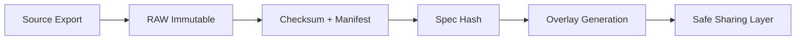

<!--
doc_id: NEEDS VERIFICATION
title: DNA Vault — Provenance & Privacy Workflow
type: standard
version: v1
status: draft
owners: [@bartytime4life]  <!-- NEEDS VERIFICATION -->
created: 2026-04-01
updated: 2026-04-01
policy_label: restricted  <!-- genetic data sensitivity -->
related: [
  docs/governance/ROOT_GOVERNANCE.md,
  docs/governance/ETHICS.md
]
tags: [kfm, provenance, dna, genealogy, privacy, evidence-first]
notes: [
  Repo visibility not confirmed,
  Paths and owners NEEDS VERIFICATION
]
-->

# 🧬 DNA Vault — Provenance & Privacy Workflow

> Evidence-first ingestion, integrity verification, and privacy-preserving overlays for consumer DNA and genealogy data.

---

## 📊 Status
| Field | Value |
|------|------|
| Status | experimental |
| Owners | @bartytime4life *(NEEDS VERIFICATION)* |
| Sensitivity | restricted |
| Trust Model | evidence-first, provenance-bound |
| Exposure | non-identifying overlays only |

---

## 🔗 Quick Jump
- [Scope](#scope)
- [Repo Fit](#repo-fit)
- [Inputs](#inputs)
- [Exclusions](#exclusions)
- [Directory Structure](#directory-structure)
- [Quickstart](#quickstart)
- [Usage](#usage)
- [Trust Model](#trust-model)
- [Task List](#task-list)

---

## 🧭 Scope

This module defines how to:

- Ingest raw DNA and genealogy exports **immutably**
- Attach **verifiable provenance metadata**
- Produce **non-identifying overlays** for downstream use
- Preserve **privacy boundaries and redistribution rights**

---

## 🧩 Repo Fit

| Layer | Role |
|------|------|
| RAW | Immutable genetic exports |
| WORK | Hashing + manifest generation |
| PROCESSED | Overlay bundles |
| CATALOG | Evidence references + rights flags |
| PUBLISHED | Overlay-only exposure |

Upstream:
- Consumer DNA providers
- Genealogy tools

Downstream:
- KFM evidence systems
- Trust UI / Evidence Drawer
- Lineage / migration modeling

---

## 📥 Inputs

| Type | Format |
|------|--------|
| SNP array | `.txt`, `.csv`, `.zip` |
| GEDCOM | `.ged` |
| VCF | `.vcf`, `.vcf.gz` |
| Alignment | `.bam`, `.cram` |

---

## 🚫 Exclusions

- No editing raw genetic data
- No direct publication of genotype files
- No identity linkage without explicit consent contract
- No redistribution unless explicitly allowed

---

## 📂 Directory Structure

```
dna-vault/
├── raw/                   # immutable
├── manifests/             # provenance metadata
├── derived_overlays/      # safe outputs
├── scripts/               # tooling
└── README.md
```

---

## ⚡ Quickstart

### 1. Place raw file
```
dna-vault/raw/2026-04-01_23andme.txt.gz
```

### 2. Generate manifest
```
python scripts/hash_and_manifest.py raw/file.txt.gz
```

### 3. Generate overlay
```
python scripts/generate_overlay.py manifests/file.json
```

---

## ⚙️ Usage

### Manifest fields

| Field | Purpose |
|------|--------|
| source_uri | origin |
| export_type | data class |
| product_version | provider build |
| last_updated | timestamp |
| file_checksum | SHA256 |
| spec_hash | canonical fingerprint |

---

### Overlay fields

| Field | Purpose |
|------|--------|
| kit_hmac | anonymized identifier |
| consent_token_hash | consent proof |
| evidence_refs | provenance chain |
| rights_flag | sharing rules |

---

## 🔐 Trust Model



---

## 🧾 Evidence Model

Each overlay includes:

- File checksum (integrity)
- Source metadata (provenance)
- Rights flag (policy enforcement)
- Consent hash (governance trace)

---

## ⚠️ Sensitivity Classes

| Class | Rule |
|------|------|
| public-safe | overlay only |
| generalized | reduced detail |
| restricted | no distribution |
| prohibited | no processing |

---

## 🧪 Task List

- [ ] Validate checksum reproducibility
- [ ] Confirm canonical spec hash method
- [ ] Add CI verification step
- [ ] Integrate with Evidence Drawer
- [ ] Define consent token contract
- [ ] Attach Catalog IDs

---

## 📎 Appendix

### Example Manifest
```json
{
  "source_uri": "23andMe export portal",
  "export_type": "snp-array",
  "product_version": "v5",
  "last_updated": "2026-04-01T21:12:03Z",
  "file_checksum": "sha256:...",
  "spec_hash": "sha256:..."
}
```

---

### Example Overlay
```json
{
  "kit_hmac": "hmac256:...",
  "consent_token_hash": "sha256:...",
  "evidence_refs": [
    {
      "source_uri": "...",
      "product_version": "...",
      "last_updated": "...",
      "file_checksum": "...",
      "rights_flag": "restricted"
    }
  ]
}
```

---

⬆ Back to top