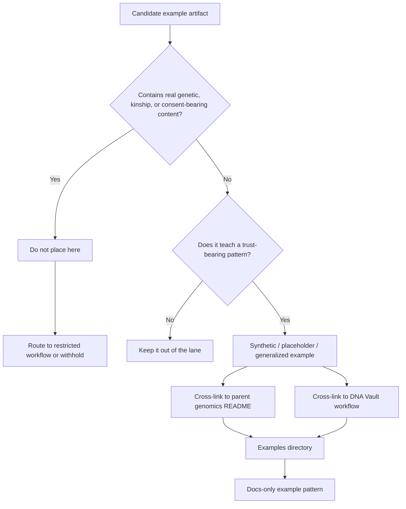

<!-- [KFM_META_BLOCK_V2]
doc_id: kfm://doc/NEEDS-VERIFICATION
title: Kansas Frontier Matrix — Genomics Examples
type: standard
version: v1
status: draft
owners: @bartytime4life
created: YYYY-MM-DD
updated: YYYY-MM-DD
policy_label: NEEDS VERIFICATION
related: [docs/domains/README.md, docs/domains/genomics/README.md, docs/domains/genomics/dna-vault/README.md]
tags: [kfm, genomics, examples, provenance, privacy]
notes: [Owner currently follows the checked-in /docs CODEOWNERS fallback; this examples subtree is not confirmed in the current public tree before merge, so final dates, doc_id, and policy label still need verification.]
[/KFM_META_BLOCK_V2] -->

# Kansas Frontier Matrix — Genomics Examples

Illustrative, non-identifying example index for the genomics lane, limited to patterns that teach provenance, review, and deny-by-default handling without turning sensitive genetic artifacts into demo content.


| Field | Value |
|---|---|
| Status | `experimental` |
| Doc state | `draft` |
| Owners | `@bartytime4life` *(current `/docs/` fallback via CODEOWNERS; genomics-specific split NEEDS VERIFICATION)* |
| Repo fit | `docs/domains/genomics/examples/README.md` → upstream [`../README.md`](../README.md) · workflow context [`../dna-vault/README.md`](../dna-vault/README.md) |
| Current public subtree | parent lane and `dna-vault/README.md` are confirmed; `examples/` is not confirmed before this addition |
| Primary role | directory README for example-safe genomics patterns |
| Public-safe default | illustrative, non-identifying examples only |
| Not this file’s job | to host raw genetic, family-linkage, consent, or live provider artifacts |

**Quick jumps:** [Scope](#scope) · [Repo fit](#repo-fit) · [Accepted inputs](#accepted-inputs) · [Exclusions](#exclusions) · [Directory tree](#directory-tree) · [Quickstart](#quickstart) · [Usage](#usage) · [Diagram](#diagram) · [Tables](#tables) · [Task list](#task-list) · [FAQ](#faq) · [Appendix](#appendix)

> [!IMPORTANT]
> This directory should behave like a **pattern library**, not a demo-data bucket. It is for example-safe structure, not for sample DNA, family trees, or real consent records.

> [!WARNING]
> Current public repo evidence confirms the genomics lane README and the downstream DNA Vault workflow README. It does **not** confirm a checked-in `examples/` subtree beyond this target file. Treat any example leaf inventory below as **PROPOSED / NEEDS VERIFICATION** until merged and re-verified.

---

## Scope

**CONFIRMED:** the genomics lane already frames genomics as a review-bearing operating lane, proposes an `examples/` subtree for **illustrative non-identifying examples only**, and recommends a concrete next documentation move built around four example classes: one restricted input path, one manifest/checksum/provenance pattern, one non-identifying derived overlay pattern, and one explicit deny-or-withhold case.

**INFERRED:** this README should define how those examples live together without duplicating the workflow logic already owned by [`../dna-vault/README.md`](../dna-vault/README.md).

**UNKNOWN:** checked-in example leaves, genomics-specific schemas, CI, APIs, fixtures, or review templates beneath this path.

This directory exists to make genomics examples useful **without** making them risky. Good examples here should preserve structure, vocabulary, and review posture while removing the very thing that would make them unsafe to circulate: real identifying or kinship-bearing content.

A practical reading rule for this directory:

- Use this file to understand **what a safe genomics example is**.
- Use [`../README.md`](../README.md) for **lane posture**.
- Use [`../dna-vault/README.md`](../dna-vault/README.md) for the **currently confirmed restricted workflow nucleus**.
- Treat any example file beyond this README as **PROPOSED / NEEDS VERIFICATION** unless the repo later proves it.

[Back to top](#kansas-frontier-matrix--genomics-examples)

---

## Repo fit

| Aspect | Current reading |
|---|---|
| Path | `docs/domains/genomics/examples/README.md` |
| Parent lane README | [`../README.md`](../README.md) |
| Confirmed workflow context | [`../dna-vault/README.md`](../dna-vault/README.md) |
| Owner fallback | [`../../../.github/CODEOWNERS`](../../../.github/CODEOWNERS) |
| Best current role | directory README for example-safe genomics patterns, review cues, and starter example classes |
| Not this file’s job | to prove mounted schemas, CI, APIs, or live genomics products |
| Downstream leaf inventory | no checked-in example leaves are confirmed in the public tree before this addition |

### Current subtree certainty

| Path element | Status | Notes |
|---|---|---|
| `docs/domains/genomics/README.md` | **CONFIRMED** | Current lane boundary and routing doc |
| `docs/domains/genomics/dna-vault/README.md` | **CONFIRMED** | Current downstream restricted workflow anchor |
| `docs/domains/genomics/examples/README.md` | **PROPOSED** | Target file for this addition; not confirmed in the public tree before merge |
| Additional files under `docs/domains/genomics/examples/` | **UNKNOWN** | No checked-in example leaf inventory confirmed pre-merge |

---

## Accepted inputs

This directory accepts **example-safe** material only: documentation leaves, snippets, and worked examples that demonstrate structure without carrying live genetic or family-linkage content.

### Example classes that belong here

| Example class | What it demonstrates | Allowed content | Keep out |
|---|---|---|---|
| Triage example | how the lane distinguishes `raw_export`, `genealogy_tree`, `consent_artifact`, and `derived_overlay` | synthetic keys, placeholder routes, illustrative YAML | real kits, trees, or provider exports |
| Manifest / checksum example | provenance-bearing structure such as `source_uri`, `export_type`, `product_version`, `last_updated`, `file_checksum`, `spec_hash` | placeholder or synthetic values only | raw payload excerpts or real account-linked values |
| Derived overlay example | outward-safe structure such as `kit_hmac`, `consent_token_hash`, `evidence_refs`, `rights_flag` | non-identifying, generalized, illustrative fields | cleartext identifiers, kinship-bearing detail, exact person-linked geography |
| Deny / withhold example | what a fail-closed case looks like when rights, consent, or sensitivity are unresolved | prose, policy notes, synthetic examples | any underlying restricted artifact |
| Review note example | how to explain why something is held, generalized, or withheld | minimal text, no live identifiers | claim language that implies a verified runtime or release state |

### Minimum safety bar

Examples placed here should meet all of the following:

- they are **synthetic, placeholder-based, or strongly redacted**
- they preserve **structure and terminology**, not live signal
- they help a reviewer understand **how to route or judge** a genomics artifact
- they do not recreate a usable genotype, genealogy tree, or consent record
- they do not imply current implementation depth the repo has not yet proven

> [!NOTE]
> If an example cannot survive being copied into a public docs subtree, it is not an example for this directory.

---

## Exclusions

This directory should stay small by refusing content that belongs in the restricted workflow or in other governed surfaces.

| Excluded material | Route it to | Why it does not belong here |
|---|---|---|
| Raw genotype / sequence-bearing exports (`.txt`, `.csv`, `.zip`, `.vcf`, `.vcf.gz`, `.bam`, `.cram`) | [`../dna-vault/README.md`](../dna-vault/README.md) and restricted handling surfaces | raw content is identity-bearing and review-heavy |
| Real genealogy trees or family-linkage examples (`.ged` and similar) | [`../dna-vault/README.md`](../dna-vault/README.md) | even “small” samples can implicate third parties |
| Real consent or redistribution records | governance / review bundle, not a public examples lane | rights and consent artifacts are governance-bearing, not decorative |
| Derived outputs that still permit person, kit, or family reconstruction | withhold, generalize further, or keep restricted | outward-safe examples must remain non-identifying |
| Claims about genomics-specific CI, schemas, validators, APIs, or runtime support | only add them when those surfaces are checked in elsewhere | this README must not turn prose into false implementation evidence |
| Repo inventory claims beyond the confirmed lane and DNA Vault docs | verification backlog or explicit placeholders | pre-merge certainty should stay honest |

> [!CAUTION]
> “Redacted” is not enough if the remaining structure still points back to a real person, kit, lineage, or place-linked family story.

[Back to top](#kansas-frontier-matrix--genomics-examples)

---

## Directory tree

### Confirmed context + target addition

```text
docs/
└── domains/
    └── genomics/
        ├── README.md                         # CONFIRMED
        ├── dna-vault/
        │   └── README.md                     # CONFIRMED
        └── examples/
            └── README.md                     # target file; PROPOSED until merged
```

### Proposed starter leaf set

<details>
<summary>PROPOSED / NEEDS VERIFICATION example leaves</summary>

```text
docs/domains/genomics/examples/
├── README.md
├── triage-example.yaml
├── manifest-example.json
├── overlay-example.json
└── deny-case.md
```

These names are a documentation convenience, not a statement that the repo already contains them.
</details>

---

## Quickstart

### 1) Pick the example class first

Do not start with “what sample can I paste here?” Start with “what trust pattern am I trying to teach?”

```yaml
example_review:
  example_class: triage | manifest | overlay | deny_case
  contains_real_genetic_content: false
  contains_real_family_linkage: false
  contains_real_consent_artifact: false
  upstream_context:
    - docs/domains/genomics/README.md
    - docs/domains/genomics/dna-vault/README.md
  publication_posture: illustrative_only
```

*Illustrative example only.*

### 2) Preserve structure, not live signal

Keep field names, routing logic, and review language intact, but swap live values for placeholders, clearly synthetic tokens, or generalized stand-ins.

### 3) Prefer pattern leaves over narrative bulk

A compact example that teaches one thing well is stronger than a long pseudo-manual. Favor one leaf per example class over one giant “all genomics examples” page.

### 4) Link back to the owning docs

If the example exists only to clarify a rule already owned by the parent lane or DNA Vault workflow, link there directly instead of rewriting the rule from scratch.

### 5) Keep deny paths visible

At least one example should make it obvious what happens when KFM should **not** publish, **not** widen, or **not** infer.

---

## Usage

| Use this directory when you need to… | Better home |
|---|---|
| show a safe triage example | this directory |
| show a manifest or checksum pattern with placeholder values | this directory |
| show an outward-safe overlay shape with non-identifying fields | this directory |
| explain the genomics lane boundary | [`../README.md`](../README.md) |
| explain restricted intake, provenance, and privacy workflow | [`../dna-vault/README.md`](../dna-vault/README.md) |
| document real runtime contracts, schema enforcement, or CI behavior | the checked-in contract / schema / policy / workflow surface that actually owns it |

### Authoring rule

When adding example leaves here:

- keep every example **illustrative**
- preserve existing genomics vocabulary
- reuse confirmed field names where possible
- mark file inventories and implementation assumptions **PROPOSED**, **UNKNOWN**, or **NEEDS VERIFICATION** when they are not checked in

### Review rule

A good examples README should make unsafe example material **easier to reject**, not easier to rationalize.

[Back to top](#kansas-frontier-matrix--genomics-examples)

---

## Diagram



---

## Tables

### Example pattern matrix

| Pattern | Confirmed upstream field cues | Why it belongs here |
|---|---|---|
| Triage pattern | `source_role`, `publication_default`, `downstream_workflow`, `public_surface_allowed` | teaches routing without exposing content |
| Manifest pattern | `source_uri`, `export_type`, `product_version`, `last_updated`, `file_checksum`, `spec_hash` | teaches provenance-bearing structure |
| Overlay pattern | `kit_hmac`, `consent_token_hash`, `evidence_refs`, `rights_flag` | teaches outward-safe derivative shape |
| Deny / withhold pattern | unresolved rights, consent, sensitivity, or re-identification risk | teaches fail-closed behavior instead of silent smoothing |

### Current certainty map

| Statement | Status |
|---|---|
| The genomics lane README exists | **CONFIRMED** |
| The DNA Vault workflow README exists | **CONFIRMED** |
| The genomics lane proposes an `examples/` subtree for illustrative non-identifying examples only | **CONFIRMED** |
| This target path exists in the public tree before merge | **PROPOSED** |
| Checked-in example leaf inventory beyond this README is available today | **UNKNOWN** |

[Back to top](#kansas-frontier-matrix--genomics-examples)

---

## Task list

### Definition of done for this README

- [ ] Replace placeholder metadata values in the KFM meta block after merge-time verification.
- [ ] Confirm whether `examples/` is accepted as the canonical subtree name in the target branch.
- [ ] Keep every example in this directory synthetic, placeholder-based, or otherwise non-identifying.
- [ ] Preserve the parent lane’s restricted-first posture and the DNA Vault field vocabulary where relevant.
- [ ] Do not add schema, CI, API, or runtime claims unless the repo later checks them in visibly.
- [ ] Add at least one explicit deny-or-withhold example before calling this directory “complete.”
- [ ] Verify all relative links resolve in the target branch.

### Merge gate intent

This file is only successful if it makes the genomics lane easier to extend **without** making it easier to leak, overclaim, or confuse illustrative structure with live evidence.

---

## FAQ

### Is sanitized real data acceptable here?

Not by default. Prefer synthetic or placeholder-based examples. If an example still carries person, kit, kinship, or rights-bearing signal, route it to restricted review instead of this docs subtree.

### Where should raw DNA or genealogy exports go?

To the restricted workflow documented at [`../dna-vault/README.md`](../dna-vault/README.md), not to this examples directory.

### What is the minimum useful example set?

The strongest starter set is small: one triage example, one manifest/checksum/provenance example, one non-identifying overlay example, and one explicit deny-or-withhold case.

### Does this directory prove genomics implementation depth?

No. It is a docs lane for examples, not proof that genomics contracts, CI, validators, APIs, or release artifacts are already mounted in the repo.

[Back to top](#kansas-frontier-matrix--genomics-examples)

---

## Appendix

<details>
<summary>Illustrative starter leaf set and sample snippets</summary>

### Suggested starter leaf set

```text
docs/domains/genomics/examples/
├── README.md
├── triage-example.yaml
├── manifest-example.json
├── overlay-example.json
└── deny-case.md
```

### Illustrative manifest snippet

```json
{
  "source_uri": "synthetic-provider-export",
  "export_type": "snp-array",
  "product_version": "illustrative-v0",
  "last_updated": "YYYY-MM-DDT00:00:00Z",
  "file_checksum": "sha256:EXAMPLE",
  "spec_hash": "sha256:EXAMPLE"
}
```

### Illustrative overlay snippet

```json
{
  "kit_hmac": "hmac256:EXAMPLE",
  "consent_token_hash": "sha256:EXAMPLE",
  "evidence_refs": [],
  "rights_flag": "illustrative-only"
}
```

### Illustrative deny-case prompt

```md
This example is withheld because its remaining structure still permits family-linkage or rights inference beyond the directory’s example-safe scope.
```

> [!NOTE]
> These snippets are **illustrative only**. Do not replace placeholder values with real identifiers in a public docs subtree.
</details>

[Back to top](#kansas-frontier-matrix--genomics-examples)
