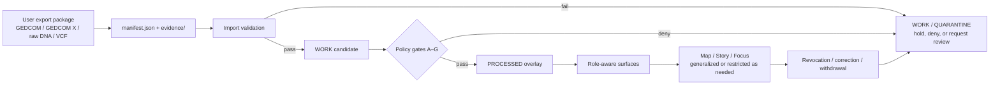

<!-- [KFM_META_BLOCK_V2]
doc_id: kfm://doc/NEEDS-VERIFICATION
title: Genomics Overlays
type: standard
version: v1
status: draft
owners: NEEDS VERIFICATION
created: YYYY-MM-DD
updated: YYYY-MM-DD
policy_label: restricted
related: [../README.md, ../../README.md]
tags: [kfm, genomics, overlays, consent, genealogy, consumer-genetics]
notes: [Policy label is INFERRED from consent, redaction, embargo, and revocation requirements; parent-path links are structurally inferred from the target path and need direct repo verification.]
[/KFM_META_BLOCK_V2] -->

# Genomics Overlays

Consent-aware routing and operating guide for genealogy and consumer-genetics overlay packages handled inside KFM’s governed truth path.

> [!NOTE]
> **Status:** experimental  
> **Owners:** NEEDS VERIFICATION  
>      
> **Quick jumps:** [Scope](#scope) · [Repo fit](#repo-fit) · [Accepted inputs](#accepted-inputs) · [Exclusions](#exclusions) · [Directory tree](#directory-tree) · [Quickstart](#quickstart) · [Usage](#usage) · [Diagram](#diagram) · [Contract matrices](#contract-matrices) · [Task list](#task-list--definition-of-done) · [FAQ](#faq) · [Appendix](#appendix)  
> **Repo fit:** `docs/domains/genomics/overlays/README.md` → expected upstream: [`../README.md`](../README.md), [`../../README.md`](../../README.md) (**NEEDS VERIFICATION**) · proposed downstream implementation surfaces: `contracts/overlays/`, `packages/overlays/`, `apps/overlay-ui/`, `examples/overlays/`

> [!IMPORTANT]
> This directory should function as a **consent-aware overlay lane**, not as a public genomics truth surface, not as a clinical interpretation area, and not as a bypass around KFM’s rights, sensitivity, review, and promotion rules.

> [!WARNING]
> Current-session workspace evidence is PDF-only. Treat local file inventory, adjacent lane ownership, schema paths, workflows, tests, and implementation claims in or around this directory as **NEEDS VERIFICATION** until the mounted repository is directly inspected.

## Scope

This directory is the documentation surface for **user-managed genomics overlays** inside KFM.

The strongest project evidence for this lane points to a practical focus on **genealogy and consumer-genetics overlays** rather than a broad clinical-genomics program. In current project materials, the clearest supported overlay types are GEDCOM 5.5.1 family-tree exports, GEDCOM X JSON, vendor raw-DNA text or TSV exports, and optional VCF-style sequence files. Those materials are treated as **overlays** because they arrive from user-controlled or partner-controlled packages and must remain subordinate to KFM’s governed evidence, consent, redaction, and publication rules.

This README should therefore prioritize four things:

1. **Intake discipline** for imported overlay packages.
2. **Consent and revocation discipline** for living-person and genetic data.
3. **Routing clarity** between this lane and the rest of the domain/docs tree.
4. **Truthful status labeling** so maintainers do not mistake design direction for mounted implementation.

## Repo fit

| Path | Role | Relationship | Status |
| --- | --- | --- | --- |
| `docs/domains/genomics/overlays/README.md` | this file | directory README for overlay-specific conventions | CONFIRMED target path |
| `../README.md` | expected genomics lane hub | parent context for the broader genomics domain | NEEDS VERIFICATION |
| `../../README.md` | expected domains index | higher-level domain routing surface | NEEDS VERIFICATION |
| `contracts/overlays/` | proposed contract home | manifest and consent-token schema family | PROPOSED |
| `schemas/run_receipt.schema.json` | proposed shared receipt surface | shared receipt contract used by overlay imports | PROPOSED |
| `packages/overlays/` | proposed implementation surface | parsers, normalizers, and consent-aware overlay logic | PROPOSED |
| `packages/policy/` or `policy/overlays/` | proposed policy surface | OPA / Conftest gates for scopes, redaction, embargo, and egress | PROPOSED |
| `apps/overlay-ui/` | proposed user-control surface | connect, import, revoke, export, delete | PROPOSED |
| `examples/overlays/` | proposed fixture surface | golden samples for validation and living-person redaction tests | PROPOSED |

## Accepted inputs

Place materials here when they are primarily about **governed overlay intake and handling** for genealogy or consumer-genetics packages.

Accepted inputs include:

- GEDCOM 5.5.1 family-tree exports
- GEDCOM X JSON exports
- vendor raw-DNA text or TSV exports
- optional VCF-based overlay inputs
- zipped overlay packages that include original raw data plus manifest and evidence files
- consent-token structure and revocation guidance
- run-receipt expectations for overlay imports and materialization
- redaction and embargo handling rules for living-person or otherwise sensitive overlay data
- role-aware UI notes for revoke, export, delete, and scope inspection
- scoped partner/API connection guidance **only when** it remains opt-in, revocable, and policy-gated

## Exclusions

Do **not** place the following here:

- clinical interpretation, diagnosis, or health-risk claims
- public-facing “DNA truth” summaries that bypass consent or review
- unrestricted export behavior for living-person data
- raw vendor kit IDs stored or discussed as plain identifiers
- free-form relationship claims with no evidence or receipt trail
- uncited match narratives treated as canonical truth
- direct writes to `PUBLISHED` or outward surfaces without WORK / policy / review steps
- general KFM-wide policy doctrine better owned by a core governance or standards lane
- speculative claims that a live OAuth sync, overlay UI, or schema family already exists when the mounted repo has not been inspected

## Directory tree

The tree below is an **expected local shape**, not a verified repository snapshot.

```text
docs/
└── domains/
    ├── README.md                         # NEEDS VERIFICATION
    └── genomics/
        ├── README.md                     # NEEDS VERIFICATION
        └── overlays/
            └── README.md                 # this file

contracts/
└── overlays/
    ├── manifest.schema.json              # PROPOSED
    └── consent_token.schema.json         # PROPOSED

schemas/
└── run_receipt.schema.json               # PROPOSED extension point

packages/
└── overlays/
    ├── parsers/                          # PROPOSED
    ├── normalizers/                      # PROPOSED
    └── policy/                           # PROPOSED

apps/
└── overlay-ui/                           # PROPOSED

examples/
└── overlays/                             # PROPOSED
```

That means this README should prioritize **safety boundaries, package shape, consent semantics, and routing** over claims about mature mounted implementation.

## Quickstart

### 1. Prepare an overlay package

Use an **export → import** package as the default intake pattern.

```text
family-overlay.zip
├── raw/
│   └── <original-export-file>
├── manifest.json
└── evidence/
    ├── consent_token.json
    ├── run_receipt.json
    └── provenance.json
```

### 2. Keep the package traceable

At minimum, the package should preserve:

- the original raw file
- a machine-readable manifest
- evidence for consent and provenance
- a receipt trail for import and later materialization

### 3. Validate before landing in WORK

Illustrative command shape only:

```bash
# illustrative only — command surface not yet verified in mounted repo
kfm overlays import family-overlay.zip
```

Expected behavior for a governed import:

1. validate package structure
2. verify hashes
3. evaluate consent scopes
4. apply living-person redaction defaults
5. emit or update `run_receipt`
6. write candidate material into `WORK` or `QUARANTINE`

### 4. Materialize only after policy gates pass

Overlay material should move toward `PROCESSED` only after fail-closed checks pass. Public or public-safe rendering is a later step, not the import step.

> [!CAUTION]
> A successful import is **not** the same thing as public-safe publication. Overlay data can be well-formed, receipt-backed, and still be too sensitive for outward map, story, or Focus surfaces.

## Usage

### Add a new overlay package convention

1. Keep the convention centered on a real intake shape such as GEDCOM, GEDCOM X, raw-DNA TSV, or VCF.
2. Specify what the package must contain.
3. State what consent scope is required.
4. State the default redaction posture.
5. State what receipts, hashes, and provenance references must exist.
6. Mark all unverified implementation details as **PROPOSED**, **UNKNOWN**, or **NEEDS VERIFICATION**.

### Extend this lane

Update this README when any of the following changes:

- a parent genomics README is directly verified
- the mounted repo confirms real contract or policy paths for overlays
- the accepted import formats expand or contract
- a live partner/API flow moves from proposal to confirmed implementation
- actual owners, policy labels, or review lanes are verified
- the lane gains enough depth that contract registries or a dedicated overlay safety guide should be linked directly

### Local writing rules for this lane

- keep the user’s package and consent posture visible
- prefer narrow, reviewable package guidance over broad genomics prose
- separate **current doctrine** from **current implementation**
- do not treat imported overlay data as canonical public truth
- do not imply that revocation, egress blocking, or UI controls are live unless directly verified
- route KFM-wide policy logic outward rather than duplicating it here once a stronger owner is verified

## Diagram



## Contract matrices

### Overlay package contents

| Package member | Why it exists | Minimum expectation |
| --- | --- | --- |
| `raw/` | preserves source-native material | original export retained without silent rewriting |
| `manifest.json` | gives the package a machine-readable identity | provider, format, source URL or source note, hash, creation time |
| `evidence/consent_token.json` | records what use is allowed | subject identifier, scopes, issued/expiry times, revocability |
| `evidence/run_receipt.json` | records what the system did | spec hash, inputs, outputs, policy decisions, logs/audit ref |
| `evidence/provenance.json` | preserves fetch/import context | retrieval method, timestamps, package origin notes |

### Policy gates A–G

| Gate | Primary concern | Default consequence |
| --- | --- | --- |
| A — Package integrity | hash match and allowed format set | deny or quarantine on mismatch |
| B — Consent scope | requested operation must fit granted scopes | deny when scope is missing or too broad |
| C — PII posture | living-person redaction defaults stay on | generalize, withhold, or deny |
| D — Data residency / embargo | embargo and residency constraints are respected | deny outward use until eligible |
| E — Materialization | revoked overlays must not materialize forward | stop promotion and mark inactive |
| F — Egress | no external sharing without explicit scope | block export or partner sync |
| G — Audit | `run_receipt` must exist and persist | fail closed on missing receipt trail |

### Stage and surface handling

| Stage or surface | Default handling | Why |
| --- | --- | --- |
| `RAW` / package archive | role-limited, not outward-facing | package may contain raw personal or genetic data |
| `WORK` / `QUARANTINE` | review-bearing | validation, redaction, and embargo checks still incomplete |
| `PROCESSED` overlay | governed and role-aware | normalized is not the same as public-safe |
| outward map/story/focus use | generalized or withheld unless policy passes | trust membrane and sensitivity rules remain load-bearing |
| revoked overlay | no active outward rendering | revocation must be effective at display/materialization time |

## Task list & definition of done

- [ ] `contracts/overlays/manifest.schema.json` exists or an equivalent verified path is linked
- [ ] `contracts/overlays/consent_token.schema.json` exists or an equivalent verified path is linked
- [ ] `schemas/run_receipt.schema.json` is linked, extended, or explicitly superseded
- [ ] import validation checks package structure, hashes, and consent scope
- [ ] living-person redaction is verified with at least one golden fixture
- [ ] revocation behavior is documented for both materialization and outward rendering
- [ ] OPA / Conftest policy gates are linked or the absence is marked **NEEDS VERIFICATION**
- [ ] any live partner/API flow is feature-flagged, revocable, and auditable
- [ ] this README has been reconciled against the mounted repo tree after direct inspection
- [ ] a neighboring standards or runbook doc owns deeper overlay safety details once verified

## FAQ

### Is this lane already implemented?

**UNKNOWN.** Current-session evidence does not include a mounted repository tree, schema inventory, workflow YAML, tests, or runtime logs. Treat this README as a repo-ready draft aligned to project doctrine and overlay design direction, not as proof that the implementation already exists.

### Why call these materials overlays instead of core datasets?

Because the current design direction treats them as **user-managed, consent-aware imports** that must remain subordinate to KFM’s truth path, policy checks, and publication rules. They are not automatically canonical public truth.

### Are live API connections required?

No. The strongest current direction is **export → import** as the default path, with OAuth or API-based partner flows reserved as an **opt-in** pattern behind stronger policy controls.

### Can this lane expose living-person precise data?

Not by default. The current overlay design direction assumes living-person redaction, consent-scoped use, revocation support, and fail-closed outward behavior.

### Does “genomics” here mean clinical interpretation?

Not in the current evidence. The clearest supported scope is genealogy and consumer-genetics overlay handling. Clinical interpretation should stay out of scope unless a stronger repo-local doctrine explicitly admits it.

## Appendix

<details>
<summary><strong>Illustrative manifest shape</strong></summary>

```json
{
  "provider": "23andMe",
  "format": "raw-dna-tsv",
  "source_url": "https://provider.example/download/abc",
  "sha256": "…",
  "created_at": "YYYY-MM-DDTHH:MM:SSZ",
  "evidence": {
    "consent_token_ref": "evidence/consent_token.json",
    "run_receipt_ref": "evidence/run_receipt.json",
    "provenance": {
      "fetched_at": "YYYY-MM-DDTHH:MM:SSZ",
      "method": "user-export"
    }
  }
}
```

This example is illustrative. Field names and final schema authority remain **PROPOSED** until directly verified against the mounted repo.

</details>

<details>
<summary><strong>Illustrative consent scope examples</strong></summary>

| Scope | What it should mean |
| --- | --- |
| `gedcom_read` | parse and normalize family-tree structure |
| `genotype_read` | parse raw genotype content |
| `match_sharing` | allow controlled use of match-level relationship data |
| `export_allowed` | allow user-requested outward export under policy |
| `partner_sync` | allow opt-in partner/API synchronization if separately enabled |

Use explicit, narrow scopes. Avoid broad “all-access” tokens.

</details>

<details>
<summary><strong>Maintainer note</strong></summary>

Because the mounted repository was not directly available in the current session, this README intentionally separates:

- **CONFIRMED doctrine** from KFM manuals,
- **PROPOSED overlay implementation direction** from exploratory overlay notes,
- and **UNKNOWN / NEEDS VERIFICATION** items that require real repo inspection.

Once the repo is mounted, reconcile this file against the actual genomics lane, actual contract paths, real owners, and any existing overlay safety or consent docs.

</details>

[Back to top](#genomics-overlays)
