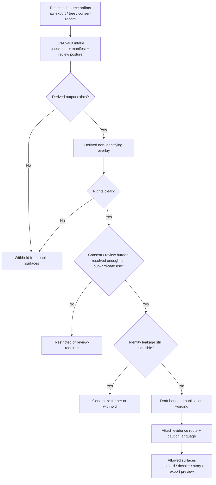

<!-- [KFM_META_BLOCK_V2]
doc_id: kfm://doc/NEEDS_VERIFICATION
title: Kansas Frontier Matrix — Genomics — Publication
type: standard
version: v1
status: draft
owners: [@bartytime4life, NEEDS VERIFICATION]
created: YYYY-MM-DD
updated: YYYY-MM-DD
policy_label: restricted
related: [docs/domains/genomics/README.md, docs/domains/genomics/dna-vault/README.md, docs/governance/ROOT_GOVERNANCE.md, docs/governance/ETHICS.md]
tags: [kfm, genomics, publication, genealogy, privacy, evidence-first]
notes: [Current public repo view shows this path as a placeholder and does not directly verify mounted contracts, CI, APIs, or emitted publication artifacts for this lane., Owners, dates, and exact governance anchors require repo verification before commit.]
[/KFM_META_BLOCK_V2] -->

# Kansas Frontier Matrix — Genomics — Publication

**Purpose:** define how genomics-derived material may be prepared for outward-facing KFM surfaces without collapsing privacy, consent, provenance, or review burden.

> [!IMPORTANT]
> In this lane, **publication is stricter than transformation**. A derivative is not public-safe merely because direct identifiers were removed. Publication still depends on evidence traceability, rights and consent posture, review burden, and whether the output remains genuinely non-identifying.

> [!WARNING]
> The current public repo view confirms this directory path exists, but its README is still a placeholder. Mounted genomics contracts, CI checks, API payloads, publication fixtures, and emitted public artifacts were **not** directly verified in this session.

**Status:**     

**Owners:** `@bartytime4life` · `NEEDS VERIFICATION`  
**Repo fit:** `docs/domains/genomics/publication/README.md` → sits between restricted DNA-vault handling and any outward-safe genomics-derived surface text  
**Accepted inputs:** publication rules, exposure classes, wording guidance, evidence-routing expectations, non-identifying overlay release patterns  
**Exclusions:** raw genotype/genome files, living-person identity linkage, consent source records as public content, unverified runtime/API claims, implementation promises not proven in repo evidence  

**Quick jumps:** [Scope](#scope) · [Repo fit](#repo-fit) · [Inputs](#accepted-inputs) · [Exclusions](#exclusions) · [Quickstart](#quickstart) · [Publication filter](#publication-filter) · [Exposure classes](#exposure-classes) · [Examples](#examples) · [Task list](#task-list) · [FAQ](#faq)

---

## Scope

This README governs the **publication-facing interpretation layer** for the genomics lane.

It is the place for:

- publication defaults for genomics-derived material
- review-safe wording guidance
- exposure classes for non-identifying overlays
- routing guidance between restricted intake and outward-safe surfaces
- evidence and caution expectations for map cards, dossier snippets, story copy, exports, and bounded assistance surfaces

It is **not** the place for:

- raw DNA or sequencing ingest mechanics
- vault storage procedures
- full validation or schema ownership
- consent source documents as public artifacts
- speculative claims that current public genomics products, APIs, or CI enforcement already exist

### Working publication rule

For this lane, the safest default is:

1. **ingest and verify first**
2. **derive and reduce second**
3. **publish only the minimum outward-safe expression**
4. **withhold when rights, consent, identity leakage, or review burden are unresolved**

A good publication artifact in this directory should answer:

- What exactly is being shown?
- Why is it public-safe?
- What was withheld or generalized?
- Where does the evidence route go next?
- What wording must stay visible so the reader does not over-interpret the output?

[Back to top](#kansas-frontier-matrix--genomics--publication)

---

## Repo fit

| Path | Role | Relationship |
| --- | --- | --- |
| `docs/domains/genomics/README.md` | lane hub | defines genomics as a review-bearing operating lane |
| `docs/domains/genomics/dna-vault/README.md` | upstream intake and restricted handling | owns immutable ingest, manifests, checksums, and overlay derivation |
| `docs/domains/genomics/publication/README.md` | this file | governs outward-safe publication behavior for genomics-derived material |
| `docs/domains/genomics/overlays/README.md` | adjacent derivative lane | expected home for overlay-specific structures and examples (**NEEDS VERIFICATION**) |
| `docs/domains/genomics/validation/README.md` | adjacent validation lane | expected home for schema and enforcement detail (**NEEDS VERIFICATION**) |
| `docs/governance/ROOT_GOVERNANCE.md` | governance anchor | use when publication posture needs project-level review rules (**NEEDS VERIFICATION**) |
| `docs/governance/ETHICS.md` | ethics anchor | use when rights, consent, kinship, or re-identification burden expands (**NEEDS VERIFICATION**) |

### What this README should help a maintainer do

- decide whether a genomics-derived artifact can be shown at all
- choose between `public-safe`, `generalized`, `restricted`, and `withheld`
- write restrained, evidence-linked copy for outward surfaces
- route unresolved cases back to restricted review rather than smoothing them into public prose

[Back to top](#kansas-frontier-matrix--genomics--publication)

---

## Accepted inputs

Place material here when it is primarily about **outward-safe publication behavior** for genomics-derived outputs.

Typical accepted inputs:

- publication-default statements for genealogy or genomics overlays
- release-language rules for non-identifying overlay summaries
- evidence-routing expectations for cards, maps, dossiers, stories, exports, or Focus panes
- downgrade logic such as “generalize,” “withhold,” or “review required”
- safe-vs-unsafe wording patterns
- public-surface rules for hashes, evidence references, and rights flags
- exposure-class definitions that help downstream docs stay consistent

### Publication inputs this doc expects upstream

This README assumes upstream work has already produced or checked items such as:

- immutable raw export handling
- source manifests and checksums
- consent or rights metadata
- derived overlay artifacts
- evidence references suitable for restricted or public-safe use

If those are not yet available, this directory should route the work back upstream instead of improvising publication language.

---

## Exclusions

Do **not** place the following here:

- raw genotype, sequence, or vendor export files
- family-tree source files that remain identity-linkable
- living-person identity or kinship linkage detail
- exact consent artifacts as public-facing content
- detailed validation logic better owned by `validation/`
- storage and integrity procedures already owned by `dna-vault/`
- claims that a genomics output is public-safe without explaining the reduction/generalization basis
- claims that mounted CI, API, schema, or publication automation already enforce these rules when that has not been directly verified

### Hard no-go items for outward surfaces

| Item | Publication status | Why |
| --- | --- | --- |
| Raw genotype/genome export | **Do not publish** | remains directly or indirectly identity-bearing |
| Family linkage specifics tied to identifiable persons | **Do not publish** | third-party and kinship burden exceeds casual public use |
| Consent record contents as public copy | **Do not publish** | governance object, not public narrative material |
| Rights-unclear derived artifact | **Withhold** | unresolved redistribution posture |
| Non-identifying overlay with evidence route and clear downgrade logic | **Potentially publishable** | only after review of privacy and rights posture |

[Back to top](#kansas-frontier-matrix--genomics--publication)

---

## Directory tree

```text
docs/
└── domains/
    └── genomics/
        ├── README.md
        ├── dna-vault/
        │   └── README.md
        ├── examples/
        ├── overlays/
        ├── publication/
        │   └── README.md   ← this file
        ├── sources/
        └── validation/
```

> [!NOTE]
> The sibling directories above are visible in the public repo tree. Their internal file inventories and exact ownership boundaries still need direct verification before this README starts depending on deeper leaf paths.

---

## Quickstart

### 1) Classify the artifact before you classify the wording

Use one of these working classes first:

- `raw_export`
- `genealogy_tree`
- `consent_artifact`
- `derived_overlay`
- `publication_summary`

Only the last two should normally reach this directory.

### 2) Refuse shortcut publication

Before drafting outward copy, confirm that the upstream artifact already has:

- a checksum or equivalent integrity anchor
- source metadata
- a rights or redistribution posture
- a consent or review basis when applicable
- an evidence route that does not expose restricted material

### 3) Pick an exposure class

Choose the narrowest honest class:

- `withhold`
- `restricted`
- `generalized`
- `public-safe`

If uncertain, move **left**, not right.

### 4) Write only what survives reduction

Publication wording should survive these tests:

- no direct identity leakage
- no implied certainty beyond the evidence
- no silent flattening of kinship, consent, or provenance burden
- no suggestion that derivative overlays equal canonical truth
- no public phrasing that outruns the upstream evidence object

### 5) Attach visible limits

When something was reduced, generalized, or withheld, say so in-place.

Bad:
> “This map shows family distribution patterns across Kansas.”

Better:
> “This view shows a non-identifying derived overlay prepared from restricted genealogy-source material. Exact kit, lineage, and consent-bearing source records are not exposed here.”

---

## Publication filter



### Interpretation

This lane is not a release accelerator. It is a **publication choke point**.

Its job is to stop three common failures:

1. a restricted artifact being summarized too early
2. a derivative being mistaken for a public-safe fact merely because it is hashed or transformed
3. a public narrative implying a level of identity, certainty, or permission that the upstream evidence does not support

[Back to top](#kansas-frontier-matrix--genomics--publication)

---

## Exposure classes

| Class | Meaning here | Typical outward action | Notes |
| --- | --- | --- | --- |
| **withhold** | not fit for outward use | show nothing or deny | default when rights, consent, or leakage risk are unresolved |
| **restricted** | valid for steward/review handling only | keep inside controlled review surfaces | may still have strong evidence value |
| **generalized** | derived output can be discussed only after reduction or masking | publish with explicit downgrade language | use when spatial, familial, or descriptive precision needs reduction |
| **public-safe** | non-identifying derivative that passed the lane’s publication burden | may appear on outward surfaces | should still expose provenance route, limits, and public-safe posture |

### Practical reading rule

In this lane, **public-safe** does not mean “harmless in every context.” It means the specific outward representation has been reduced enough, framed clearly enough, and linked carefully enough to be shown without exposing the restricted source object itself.

---

## What may be surfaced vs what should stay behind the membrane

| Content shape | Public map/card/story | Steward/review surface | Notes |
| --- | --- | --- | --- |
| `kit_hmac` or similar irreversible token | Avoid showing by default | Allowed when operationally useful | token presence alone does not make a surface useful to public readers |
| `consent_token_hash` | Usually do not show | Allowed | governance proof, not public storytelling copy |
| `evidence_refs` | Show only in reduced form when helpful | Show fully | route to evidence without exposing restricted source internals |
| rights flag / exposure class | Show if it helps interpretation | Show fully | useful public caveat |
| raw vendor/product export metadata | Show sparingly | Show fully | product/version context may be useful without exposing source file |
| exact family linkage detail | Do not show | Restricted handling only | high re-identification and third-party burden |
| generalized overlay summary | Allowed | Allowed | likely core publication object for this lane |
| review / revocation state | Show when it changes interpretation | Show fully | correction visibility matters |

---

## Surface guidance

### Map cards

Use map cards only for **derived overlay interpretation**, never for raw-source exposition.

Keep map-card language short, bounded, and visibly reduced.

**Good map-card pattern**

```md
**Genomics-derived overlay**
Non-identifying overlay prepared from restricted genealogy-source material.
Exact source records are not shown here.
```

**Avoid**

```md
This feature represents a family lineage cluster from uploaded DNA kits.
```

### Dossiers

Dossiers may carry slightly richer context, but they should still preserve these boundaries:

- no living-person disclosure
- no implied family proof beyond what the derivative actually supports
- no narrative jump from “derived overlay” to “historical certainty”
- no suppression of consent or rights caveats when they matter to interpretation

### Story surfaces

Story writing in this lane should be calm, explicit, and modest.

Prefer phrases like:

- “derived non-identifying overlay”
- “restricted-source material informed this view”
- “exact source records are not exposed”
- “interpret with caution”
- “evidence route available to authorized review”

Avoid phrases like:

- “proves ancestry”
- “identifies descendants”
- “pinpoints families”
- “shows who lived here”
- “confirms lineage”  
  unless a stricter, explicitly governed evidence chain is documented elsewhere and the surface is allowed to say so

### Export previews

Exports must not outrun the same exposure class used in the shell. If the shell can only show a generalized overlay, the export preview should not silently restore detail.

[Back to top](#kansas-frontier-matrix--genomics--publication)

---

## Examples

> [!NOTE]
> The examples below are **illustrative examples**, not verified live repo contracts.

### Illustrative public-safe summary block

```json
{
  "surface_class": "public-safe",
  "artifact_type": "derived_overlay",
  "title": "Generalized genealogy-derived overlay",
  "summary": "Prepared from restricted genealogy-source material and reduced for outward-safe viewing.",
  "rights_flag": "restricted-source-derived-public-safe-overlay",
  "evidence_route": "authorized review required for deeper source inspection"
}
```

### Illustrative generalized phrasing

```md
This layer shows a generalized, non-identifying overlay derived from restricted genealogy-source material.
Exact kits, lineages, and consent-bearing records remain outside this public surface.
```

### Illustrative withhold case

```md
Publication withheld. Rights, consent, or identity-leakage burden remains unresolved for this derivative.
```

---

## Anti-patterns to reject

| Anti-pattern | Why it fails |
| --- | --- |
| treating de-identification as the only publication test | ignores kinship, rights, and inference burden |
| exposing exact familial or person-linked claims in a public story surface | collapses review-bearing material into public prose |
| treating checksum/hash presence as permission to publish | integrity is not the same as publication safety |
| implying mounted CI or policy enforcement without repo proof | overclaims implementation maturity |
| writing confident ancestry narratives from weakly bounded overlays | removes uncertainty and evidence discipline |
| letting exports reveal more than the shell view | breaks trust consistency |

---

## Review checklist

Use this before treating a genomics-derived output as outward-safe.

- [ ] Artifact is derivative, not raw
- [ ] Rights or redistribution posture is known enough for the requested surface
- [ ] Consent/review burden has been considered
- [ ] Identity leakage remains implausible at the current level of detail
- [ ] Evidence route exists and does not expose restricted internals
- [ ] Wording says what was reduced, generalized, or withheld
- [ ] Output does not imply stronger proof than the evidence supports
- [ ] Surface class is explicit enough to preserve trust

### Definition of done

This README is doing its job when a maintainer can answer all three questions quickly:

1. **Can this be shown?**
2. **At what exposure class?**
3. **What wording keeps it honest?**

---

## Task list

### Immediate

- [ ] verify `doc_id`, owners, and dates before commit
- [ ] verify whether `overlays/`, `validation/`, and `sources/` already contain lane-local READMEs that should be linked directly
- [ ] confirm exact governance anchor paths under `docs/governance/`
- [ ] align any exposure-class vocabulary here with the repo’s broader standardized policy language if a registry already exists

### Next wave

- [ ] add publication examples tied to verified overlay fixtures, if safe to include
- [ ] add lane-local reason/obligation vocabulary if the repo surfaces a real policy registry
- [ ] add evidence-drawer expectations for genomics-derived overlays if a mounted contract or UI payload becomes visible
- [ ] add release-note guidance if this lane begins emitting public-safe artifacts with correction or withdrawal states

### Merge gate for this README

- [ ] no unsupported implementation claims
- [ ] no direct conflict with `docs/domains/genomics/README.md`
- [ ] no direct conflict with `docs/domains/genomics/dna-vault/README.md`
- [ ] examples remain clearly labeled illustrative
- [ ] outward-safe default remains **non-identifying overlay only**

[Back to top](#kansas-frontier-matrix--genomics--publication)

---

## FAQ

### Is a hashed or pseudonymized artifact automatically public-safe?

No. Hashing or pseudonymization may help integrity or internal linkage, but publication still depends on whether a reader could infer identity, lineage, consent-bearing relationships, or other restricted detail from the outward representation.

### Can this lane publish maps?

Yes, but only as **derived, non-identifying overlays** with visible caution language and without restoring raw familial or genotype detail.

### Can this README define storage, checksum, and vault procedures?

Not as the primary owner. Those belong upstream in the DNA-vault handling lane.

### Can a story mention ancestry or descent?

Only in a bounded, non-identifying, evidence-linked way that does not overstate certainty or expose restricted source structure. When in doubt, generalize further or withhold.

### Does this doc prove that genomics publication automation already exists?

No. This README is deliberately written to strengthen a placeholder path without claiming mounted contracts, CI, APIs, or emitted public artifacts that were not directly verified.

---

<details>
<summary><strong>Appendix — Working publication language palette</strong></summary>

### Preferred phrases

- derived non-identifying overlay
- restricted-source-informed
- generalized for outward-safe viewing
- exact source records not exposed here
- authorized review required for deeper inspection
- public-safe derivative, not raw source data
- interpretation should remain bounded to the visible evidence

### Phrases to avoid

- proves ancestry
- identifies descendants
- reveals family origins
- confirms lineage
- exact genetic relationship
- public DNA map
- de-identified therefore safe

### Tiny copy templates

**Map caption**

```md
Generalized genomics-derived overlay prepared from restricted-source material.
Exact source records and identity-bearing details are not exposed.
```

**Dossier note**

```md
This section uses a reduced derivative prepared for outward-safe interpretation.
It should not be read as direct access to raw genotype, family-tree, or consent records.
```

**Withhold note**

```md
This genomics-derived artifact is not currently suitable for outward publication.
Review or additional reduction is required before public-safe use.
```

</details>

---

## Appendix — Minimal publication posture matrix

| Question | Default answer |
| --- | --- |
| Can raw genomics data publish from this lane? | No |
| What is the likeliest public-safe product? | Derived non-identifying overlay |
| What if rights or consent are unresolved? | Withhold or restrict |
| What if wording becomes more specific than the derivative supports? | Generalize or remove |
| What if the repo does not prove automation or contracts? | Mark **NEEDS VERIFICATION** and avoid implementation claims |
