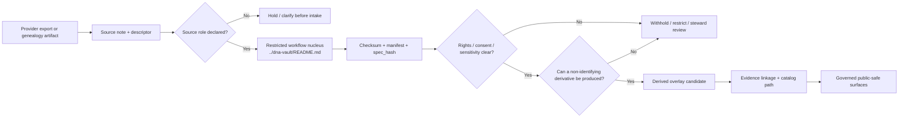

<!-- [KFM_META_BLOCK_V2]
doc_id: kfm://doc/<NEEDS_VERIFICATION_UUID>
title: Kansas Frontier Matrix — Genomics — Sources
type: standard
version: v1
status: draft
owners: NEEDS VERIFICATION
created: NEEDS VERIFICATION
updated: 2026-04-10
policy_label: restricted
related: [docs/domains/genomics/README.md, docs/domains/genomics/dna-vault/README.md]
tags: [kfm, genomics, sources, provenance, privacy, genealogy]
notes: [Exact prior contents of this path were not directly re-opened in the current session, Verify owners and original created date before commit]
[/KFM_META_BLOCK_V2] -->

# Kansas Frontier Matrix — Genomics — Sources
Source-role README for genomics and genealogy inputs, export descriptors, and provenance expectations before any material enters KFM’s restricted workflow or outward-safe overlay path.

| Status | Owners | Quick fit |
|---|---|---|
|      | `NEEDS VERIFICATION` | Source inventory, authority split, export/access posture, and provenance expectations for genomics materials entering KFM |

**Purpose:** classify genomics source families, keep provider/export burden visible, and prevent raw identity-bearing material from being mistaken for a public-safe dataset.

**Repo fit:** child page under `docs/domains/genomics/`; upstream [`../README.md`](../README.md); currently confirmed downstream workflow nucleus [`../dna-vault/README.md`](../dna-vault/README.md).

**Accepted inputs:** source-role inventories, provider/export descriptor notes, format and access notes, rights and consent posture notes, checksum/spec-hash expectations, and provenance-preserving intake guidance.

**Exclusions:** raw genotype/genome payloads, account secrets, publication defaults for outward surfaces, machine-facing contract claims, and any redistribution statement that is not explicitly verified.

**Quick jumps:** [Scope](#scope) · [Repo fit](#repo-fit) · [Accepted inputs](#accepted-inputs) · [Exclusions](#exclusions) · [Directory tree](#directory-tree) · [Quickstart](#quickstart) · [Usage](#usage) · [Diagram](#diagram) · [Tables](#tables) · [Task list](#task-list) · [FAQ](#faq) · [Appendix](#appendix)

> [!IMPORTANT]
> **Source rule:** this page must say whether an input is a raw export, a genealogy tree, a consent/rights artifact, or a derived overlay candidate before anyone summarizes, transforms, or routes it.

> [!WARNING]
> The public tree confirms a `docs/domains/genomics/` lane and a visible `sources/` subtree, but the exact prior contents of `docs/domains/genomics/sources/README.md` were not directly re-opened in this session. Keep file-level inventory inside this path marked **NEEDS VERIFICATION** until checked in the mounted branch.

---

## Scope

This page documents where genomics truth comes from, how source families differ, and what burden follows when KFM acquires, describes, hashes, reviews, or withholds genomics-linked material.

It exists to prevent common collapses:

- raw provider export becoming indistinguishable from a derived non-identifying overlay
- genealogy tree files being treated as low-risk merely because they are not genotype matrices
- consent and redistribution posture being dropped after ingest
- export portals or convenience downloads being mistaken for sovereign truth
- provenance notes being reconstructed later from memory instead of carried with the artifact

### Evidence posture used here

| Label | How it is used in this file |
|---|---|
| **CONFIRMED** | Directly supported by the visible public docs tree or adjacent genomics docs |
| **INFERRED** | Conservative structural completion that fits the lane and neighboring verified docs |
| **PROPOSED** | Useful next-step structure or documentation shape, not current repo proof |
| **UNKNOWN** | Not verified strongly enough in the current session |
| **NEEDS VERIFICATION** | Review flag for ownership, file inventory, contracts, CI, or exact path history |

### Reading rule

Use this file to keep source burden explicit.

Use [`../README.md`](../README.md) to understand the genomics lane boundary.

Use [`../dna-vault/README.md`](../dna-vault/README.md) to understand the currently confirmed restricted workflow nucleus for raw consumer DNA and genealogy material.

[Back to top](#kansas-frontier-matrix--genomics--sources)

---

## Repo fit

| Item | Value |
|---|---|
| Path | `docs/domains/genomics/sources/README.md` |
| Path status | **CONFIRMED** at subtree level; exact prior leaf contents **NEEDS VERIFICATION** |
| Upstream | [`../README.md`](../README.md) |
| Confirmed downstream workflow nucleus | [`../dna-vault/README.md`](../dna-vault/README.md) |
| Adjacent visible genomics subtrees | `../examples/`, `../overlays/`, `../publication/`, `../validation/` |
| Adjacent subtree certainty | Directories visible; deeper leaf inventory in those paths **NEEDS VERIFICATION** |
| Best current role | Source inventory, provider/export descriptor guidance, provenance expectations |
| Not this file’s job | Raw storage, outward publication policy, machine-facing validation harnesses, or claims that active genomics CI/contracts are already verified |

### Truth-path alignment

| Lifecycle seam | Genomics source concern | Current reading |
|---|---|---|
| RAW | identity-bearing provider exports and family-linkage artifacts | route to restricted handling, not outward-facing surfaces |
| WORK | checksums, manifests, `spec_hash`, and rights/consent notes | preserve extraction and review context |
| PROCESSED | derived non-identifying overlays and summary-safe artifacts | candidate outputs only after review |
| CATALOG / PUBLISHED | evidence-linked, public-safe exposure | overlay-only by default; raw exports stay withheld or restricted |

---

## Accepted inputs

Accept materials here when they are primarily about **source classification and intake burden**, not about storing or publishing the artifacts themselves.

### Accepted input families

- source-role inventories for genomics and genealogy inputs
- provider/export descriptor notes
- access and export posture notes
- format notes for raw exports or related governance artifacts
- rights, redistribution, and consent posture notes
- provenance expectations such as checksums, manifests, `spec_hash`, and evidence references
- source-specific caveats that explain what a material must **never** be mistaken for

### Current documented format families

The adjacent confirmed workflow nucleus currently documents these genomics/genealogy input classes:

- SNP array exports such as `.txt`, `.csv`, and `.zip`
- genealogy exchange files such as `.ged`
- variant files such as `.vcf` and `.vcf.gz`
- alignment files such as `.bam` and `.cram`

### Interpretation rule

These input families are not equivalent in burden.

- Raw genotype or sequence-bearing exports are identity-bearing and restricted-first.
- Genealogy trees are family-linkage artifacts and may implicate third parties.
- Consent and rights artifacts are governance objects, not decorative metadata.
- Derived overlays are plausible outward-facing candidates only after review and only when non-identifying.

---

## Exclusions

| Exclusion | Why it does not belong here | Route instead |
|---|---|---|
| Raw genotype, genome, or sequence-bearing payloads | This page is not a storage or intake surface | [`../dna-vault/README.md`](../dna-vault/README.md) |
| Account credentials, private portal links, tokens, or secret download URLs | Secrets are not documentation artifacts | restricted operational handling |
| Identity-linkage or kinship assertions treated as settled truth | Violates evidence-first and review-bearing posture | review workflow with evidence attached |
| Outward publication defaults for genomics products | Publication burden belongs in publication-facing docs | `../publication/` *(NEEDS VERIFICATION)* |
| Machine-facing schema, CI, contract, or API claims | Must not be invented from prose | `../validation/` or verified contract paths only |
| Provider redistribution claims without explicit support | Rights ambiguity must fail closed | source note with verification backlog |

> [!NOTE]
> The safe default in this lane remains **withhold or restrict first**, then explicitly justify any narrower or more public release posture.

[Back to top](#kansas-frontier-matrix--genomics--sources)

---

## Directory tree

### Confirmed current genomics context

```text
docs/domains/genomics/
├── README.md
├── dna-vault/
├── examples/
├── overlays/
├── publication/
├── sources/
└── validation/
```

### Working target for this file

```text
docs/domains/genomics/sources/
└── README.md
```

### Practical caution

The visible public tree confirms the lane and the `sources/` subtree. It does **not** by itself prove the deeper file inventory, child leaves, contracts, or runtime wiring behind this subtree. Keep deeper path claims conservative until directly inspected.

---

## Quickstart

### 1) Recheck the subtree before editing burden claims

```bash
# Run from repo root
find docs/domains/genomics -maxdepth 2 | sort
```

### 2) Read the lane boundary and the confirmed restricted workflow nucleus

```bash
sed -n '1,260p' docs/domains/genomics/README.md
sed -n '1,260p' docs/domains/genomics/dna-vault/README.md
```

### 3) Start every new source note with a minimal descriptor

```yaml
source_role: raw_export | genealogy_tree | consent_artifact | derived_overlay
artifact_class: snp_array | gedcom | vcf | alignment | source_note
publication_default: withhold_until_review
downstream_workflow: ../dna-vault/README.md
public_surface_allowed: non_identifying_overlay_only
```

*Illustrative example only.*

### 4) Capture burden before convenience

Record, in order:

1. what the source actually is
2. how it is acquired or exported
3. what rights or redistribution limits apply
4. what consent posture is required
5. what checksum / manifest / `spec_hash` chain must exist
6. what the source must never be mistaken for

### 5) Link, do not duplicate

If the workflow already lives downstream, link to it here instead of restating it loosely.

---

## Usage

Use this page whenever a new genomics or genealogy source family is introduced, or when an existing source needs a clearer authority split.

| Use this page when you need to… | Go to |
|---|---|
| classify what kind of input you are handling | [Scope](#scope) |
| record how a source is exported or acquired | [Accepted inputs](#accepted-inputs) |
| check what must remain withheld or restricted | [Exclusions](#exclusions) |
| move from source posture to the restricted processing nucleus | [`../dna-vault/README.md`](../dna-vault/README.md) |
| keep source burden distinct from release policy | [Tables](#tables) |

### Authoring rule

A good genomics sources page should read like a **trust-bearing intake guide**, not like a catalog of interesting files.

### Review rule

Do not let this page drift into either of these failure modes:

- a loose provider list with no burden logic
- a pseudo-contract page that claims machine enforcement not actually verified in the repo

---

## Diagram



---

## Tables

### Source-role register

| Source family | What it is | Typical formats | Default route | Outward-safe? |
|---|---|---|---|---|
| Raw provider export | Authoritative user-mediated export from a consumer genomics or sequence-bearing source | `.txt`, `.csv`, `.zip`, `.vcf`, `.vcf.gz`, `.bam`, `.cram` | restricted intake and provenance chain | No |
| Genealogy tree / family-linkage artifact | Relationship-bearing context artifact | `.ged` | restricted or review-bearing handling | No |
| Consent / rights artifact | Governance object that may justify narrower handling | text, form capture, token/hash reference | keep with manifest/review bundle | Rarely |
| Source note / export descriptor | Documentation object describing burden, access, and posture | `.md`, `.yaml`, `.json` | this directory | Not by itself |
| Derived non-identifying overlay candidate | Downstream candidate output built from restricted material | overlay bundle / summary-safe artifact | overlays or publication docs after review | Case-by-case |

### Minimum genomics source-descriptor fields

| Field family | Minimum content to capture here | Why it matters |
|---|---|---|
| Identity | `source_id`, title, provider, steward/contact, canonical reference URI or endpoint family | Prevents vague provider references from becoming untraceable |
| Access / export posture | access mode, auth model, export pattern, cadence, rate/size assumptions, retry/checkpoint notes where relevant | Distinguishes a one-off user export from a repeatable acquisition route |
| Artifact semantics | declared source role, format family, grain/support, time semantics, units if applicable, observed vs derived marker, publication intent | Prevents genealogy, genotype, and derived overlays from collapsing into one class |
| Rights and consent | license/terms, redistribution posture, attribution, privacy/care obligations, consent review requirement, third-party implications | This lane fails closed on unresolved rights or consent |
| Validation | checksum expectation, schema/shape checks, identity-linkage or sensitivity triggers, quarantine rules, stale-source policy | Makes intake and review reproducible instead of rhetorical |
| Lineage and promotion | raw landing path or artifact family, transform family, outbound review expectations, proof artifacts emitted | Keeps later claims reconstructable through manifests and evidence links |

### Review-trigger registry

| Trigger | Why it matters | Default response |
|---|---|---|
| Raw genetic or sequence-bearing export | Direct identity or re-identification risk | Restrict |
| Family-linkage artifact | May implicate relatives who did not directly provide the file | Restrict and review |
| Redistribution posture unresolved | Rights ambiguity must not be smoothed away | Hold / deny publication |
| Place-linked lineage specificity | Geography can sharply increase exposure risk | Generalize further or withhold |
| Missing checksum / manifest / `spec_hash` chain | Weakens provenance and reviewability | Treat intake as incomplete |
| Narrow derived output with small cohort implications | Thin overlays can leak identity cues | Aggregate further or deny |

### Current certainty map

| Statement | Status |
|---|---|
| The `docs/domains/genomics/` lane exists in the public docs tree | **CONFIRMED** |
| A `sources/` subtree is visible under that lane | **CONFIRMED** |
| `../dna-vault/README.md` is the current confirmed restricted workflow nucleus | **CONFIRMED** |
| Raw genomics and genealogy handling should remain restricted-first | **INFERRED** |
| Mounted genomics contracts, schemas, CI, or APIs are already verified from this path | **UNKNOWN** |
| Additional child leaves under `sources/` should exist or be added later | **PROPOSED** |

[Back to top](#kansas-frontier-matrix--genomics--sources)

---

## Task list

### Definition of done

- [ ] Verify whether this path is newly created or replacing an older leaf.
- [ ] Replace placeholder metadata values in the KFM meta block with verified values.
- [ ] Confirm lane owners and responsibility boundaries.
- [ ] Recheck all relative links in the target branch.
- [ ] Add child links under `sources/` only when those leaves are actually present.
- [ ] Link to machine-facing source descriptor schemas only if they are directly verified.
- [ ] Keep rights and redistribution statements source-backed rather than assumed.
- [ ] Keep language aligned with [`../dna-vault/README.md`](../dna-vault/README.md).

### Merge gate intent

This page is complete when it makes source burden clearer and more honest than before, not when it merely looks comprehensive.

---

## FAQ

### Is a source note the same thing as a raw export?
No. A source note documents the burden, origin, and handling posture of a source family. A raw export is the restricted artifact itself.

### Does a genealogy tree count as low sensitivity because it is not a genotype file?
No. It is a different burden, not a lower burden. Family-linkage artifacts can still expose third-party relationships and require review.

### Can this directory list provider names?
Yes, but only when the naming helps clarify burden or access posture. A provider name is not a substitute for verified rights, consent, or redistribution language.

### Does this page prove current genomics CI or contract support?
No. This is a documentation leaf. CI, contracts, schemas, APIs, and runtime behavior remain **UNKNOWN** unless directly verified in the repo.

### Where should raw DNA and genealogy exports go?
To the restricted workflow nucleus documented at [`../dna-vault/README.md`](../dna-vault/README.md), not directly to outward-facing domain surfaces.

---

## Appendix

<details>
<summary>Illustrative source-descriptor starter shape</summary>

This is an illustrative documentation shape, not a confirmed checked-in contract.

```yaml
source_id: NEEDS_VERIFICATION
title: provider export descriptor
source_role: raw_export
artifact_class: snp_array
provider: NEEDS_VERIFICATION
canonical_reference_uri: NEEDS_VERIFICATION

access:
  auth_model: user-mediated export
  fetch_pattern: manual account export
  cadence: episodic

rights:
  redistribution_posture: unresolved_until_verified
  consent_required: true
  third_party_implications: possible

validation:
  checksum_required: true
  spec_hash_required: true
  quarantine_on_missing_rights: true

lineage:
  downstream_workflow: ../dna-vault/README.md
  public_surface_allowed: non_identifying_overlay_only
```

</details>

<details>
<summary>Open verification backlog</summary>

- durable `doc_id`, `owners`, `created`, and long-term `policy_label` values
- exact prior history of `docs/domains/genomics/sources/README.md`
- deeper file inventory under `docs/domains/genomics/sources/`
- any mounted contracts, schemas, fixtures, or policy bundles specific to genomics intake
- any verified public-safe overlay examples already emitted by the repo

</details>

[Back to top](#kansas-frontier-matrix--genomics--sources)
