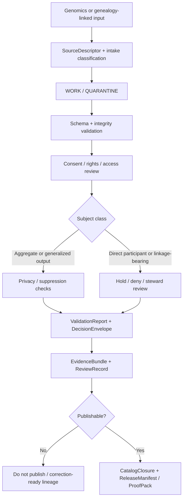

<!-- [KFM_META_BLOCK_V2]
doc_id: kfm://doc/NEEDS-VERIFICATION
title: Genomics Validation
type: standard
version: v1
status: draft
owners: NEEDS VERIFICATION
created: YYYY-MM-DD
updated: YYYY-MM-DD
policy_label: NEEDS-VERIFICATION
related: []
tags: [kfm, genomics, validation]
notes: [Current-session repo inspection was PDF-only; adjacent genomics inventory, owners, and mounted validation assets remain NEEDS VERIFICATION. Treat this lane as review-bearing and structure-first until the repo is directly surfaced.]
[/KFM_META_BLOCK_V2] -->

# Genomics Validation

Validation lane for consent-sensitive genomics inputs, proof objects, and publish-gate guidance in KFM.

> [!NOTE]
> **Status:** experimental  
> **Owners:** NEEDS VERIFICATION  
>     
> **Quick jumps:** [Scope](#scope) · [Repo fit](#repo-fit) · [Accepted inputs](#accepted-inputs) · [Exclusions](#exclusions) · [Current evidence posture](#current-evidence-posture) · [Directory tree](#directory-tree) · [Quickstart](#quickstart) · [Usage](#usage) · [Diagram](#diagram) · [Validation tables](#validation-tables) · [Task list](#task-list--definition-of-done) · [FAQ](#faq)  
> **Repo fit:** `docs/domains/genomics/validation/README.md` → upstream: genomics domain hub and broader domains/governance docs (**NEEDS VERIFICATION**) · downstream: leaf validation notes, fixtures, schema docs, and review artifacts in this lane (**PROPOSED**)

> [!IMPORTANT]
> This directory should function as a **validation lane**: a place for checks, proof objects, routing, and release posture. It should **not** become a raw genomics drop-zone, a generic bioinformatics notebook, or an informal workaround around KFM review and publication rules.

> [!WARNING]
> Current-session workspace evidence was PDF-only. Mounted repo inventory, adjacent genomics docs, schemas, fixtures, tests, CI workflows, and enforcement surfaces for this path remain **UNKNOWN / NEEDS VERIFICATION**. This README therefore prioritizes **structure, routing, and governance posture** over claims of mature implementation.

> [!CAUTION]
> Genomics material can carry re-identification, consent, and rights risks. Until mounted policy and access surfaces are directly verified, treat this lane as **review-bearing** and **non-public by default** even where downstream publication patterns are later introduced.

## Scope

This directory groups validation guidance for genomics-related material that KFM may admit only under governed conditions.

Place validation work here when it is about:

- schema and field expectations for genomics-related inputs
- consent-sensitive intake checks and release-decision routing
- valid/invalid fixtures, examples, and proof-bearing validation notes
- publication gates for aggregates, summaries, and other outward-facing derivatives
- linkage boundaries when genomics and genealogy-style materials intentionally intersect
- traceable proof objects such as validation reports, evidence bundles, and release-readiness records

This directory is **not** the owner of genomics science broadly, raw participant vaults, or clinical interpretation. Its job is narrower: to make the validation path explicit enough that KFM can **hold, quarantine, deny, generalize, or publish** with visible reasons.

## Repo fit

| Path or boundary | Status | Role in this lane |
| --- | --- | --- |
| `docs/domains/genomics/validation/README.md` | **CONFIRMED** | This file and lane entry point |
| Parent genomics domain entry under `docs/domains/genomics/` | **INFERRED / NEEDS VERIFICATION** | Likely upstream routing surface if a genomics domain hub exists |
| Broader domains subtree under `docs/domains/` | **INFERRED / NEEDS VERIFICATION** | Likely higher-level routing context |
| Governance / FAIR+CARE / verification docs under `docs/standards/**` or equivalent | **CONFIRMED doctrine, path inventory NEEDS VERIFICATION** | Normative source for rights, sensitivity, review, and publication posture |
| Validation leaves in this directory | **PROPOSED** | Subject-specific rules, schema notes, fixtures, and review guidance |
| Runtime-facing genomics pipelines or data stores outside `docs/` | **UNKNOWN** | Do not claim exact paths or implementation until directly verified |

## Accepted inputs

Place material here when it is primarily about **validation, release posture, or proof** for genomics-related subjects such as:

- tabular genotype exports whose canonical headers are expected to resemble fields such as `sample_id`, `rsid`, `chromosome`, `position`, `genotype`, `build`, `chip_version`, and `file_checksum`
- GEDCOM X, GEDCOM-adjacent, or genealogy-linked metadata **only when** the document is about validation boundaries rather than family-history content itself
- consent, access, and review artifacts that determine whether a subject may advance beyond intake
- schema definitions, shape constraints, fixture packs, and validation examples
- proof objects used to justify promotion or denial, such as validation reports, decision envelopes, evidence bundles, and release manifests
- public-safe aggregation rules, suppression/generalization notes, and cohort-level release checks

## Exclusions

Do **not** place the following here:

- raw participant genotype files intended for storage or analysis rather than documentation  
  → keep outside `docs/` in the governed intake path until a mounted runtime/data contract is verified
- unsecured identifiers, token maps, re-identification helpers, or access secrets  
  → steward-only operational surfaces, not documentation
- clinical interpretation, diagnosis, or health guidance  
  → outside this lane; requires a different authority and review model
- broad genealogy narratives or family-history walkthroughs that are not validation-focused  
  → route to a parent genomics/genealogy lane if one exists (**NEEDS VERIFICATION**)
- generic notebooks or experiments that do not define validation posture, proof objects, or release rules  
  → keep in the owning analysis or experiment lane, not here
- unsupported claims that KFM currently stores, publishes, de-identifies, or operationalizes genomics data  
  → mark such points as **UNKNOWN** until directly verified

## Current evidence posture

| Item | Status | Notes |
| --- | --- | --- |
| KFM cross-cutting validation doctrine and proof-object model | **CONFIRMED** | Applies across lanes and requires typed validation/proof objects |
| Current-session mounted repo evidence around this path | **UNKNOWN** | Workspace inspection was PDF-only |
| Genomics as a canonical Kansas operating lane in the core manuals | **NOT CONFIRMED** | The strongest central lane lists surfaced hydrology first and did not directly confirm a genomics lane |
| Genomics/genealogy integration precedents (rsID tables, GEDCOM X, consent-first governance) | **INFERRED** | Present in exploratory corpus material, not as a canonical first-wave lane |
| This directory’s exact neighboring files, owners, and CI hooks | **NEEDS VERIFICATION** | Do not imply mounted inventory or enforcement |

That means this README should prioritize **validation boundaries, routing, and proof-bearing expectations** over claims about mature implementation.

## Directory tree

**Review-first shape — PROPOSED until mounted repo verification**

```text
docs/
└── domains/
    └── genomics/
        ├── README.md                    # Parent domain hub (INFERRED / NEEDS VERIFICATION)
        └── validation/
            ├── README.md                # This file
            ├── schemas/                 # PROPOSED: schema notes and contract references
            ├── fixtures/                # PROPOSED: valid / invalid examples
            ├── policy/                  # PROPOSED: review and release-gate notes
            ├── reports/                 # PROPOSED: validation outcomes / decision records
            └── examples/                # PROPOSED: illustrative manifests and payloads
```

## Quickstart

Start narrow. A good first contribution to this lane is a single **subject-scoped validation note** with one clear input shape, one clear proof path, and one explicit default outcome.

1. Pick the subject you are validating.  
   Examples: raw genotype export, genealogy-linked join candidate, cohort aggregate, or release candidate.

2. State the exposure posture first.  
   Is the subject direct participant data, governed internal material, or a public-safe aggregate?

3. Define the minimum validation contract.  
   Use field expectations, support/time semantics where relevant, consent basis, and release intent.

4. Add at least one valid and one invalid example.  
   Validation lanes stay legible when they can show what should pass and what must fail.

5. Name the default fail outcome.  
   In KFM terms, that is usually **WORK / QUARANTINE**, **HOLD**, **DENY**, or **GENERALIZE**, not silent success.

6. Route publication through proof objects.  
   Do not treat a passing schema check as permission to publish.

**Illustrative starter manifest — adjust to mounted contracts when verified**

```yaml
subject: raw_genotype_export
local_status: draft
handling_posture: review-bearing
publish_default: hold
required_headers:
  - sample_id
  - rsid
  - chromosome
  - position
  - genotype
  - build
  - chip_version
  - file_checksum
required_proof_objects:
  - SourceDescriptor
  - IngestReceipt
  - ValidationReport
  - DecisionEnvelope
  - EvidenceBundle
notes:
  - "Illustrative only until mounted schema inventory is verified."
```

## Usage

### Add a validation leaf

1. Create a subject-scoped file in this directory.
2. Keep the leaf centered on **validation behavior**, not on broad science or narrative context.
3. Separate **CONFIRMED**, **INFERRED**, **PROPOSED**, **UNKNOWN**, and **NEEDS VERIFICATION** content explicitly.
4. Include at least one default fail outcome and one routing note for unresolved review.
5. Link back to this README and to the owning upstream lane once that path is verified.

### Review a release candidate

A candidate should not move forward because the data “looks structured.” Review should confirm, at minimum:

- intake identity and rights posture
- checksum/integrity evidence
- schema and fixture behavior
- consent/access basis
- aggregation/generalization posture where applicable
- outward proof objects for any public-safe release

### Update this README

Update this file when any of the following changes:

- mounted repo inventory for this lane is finally surfaced
- owners, adjacent docs, or parent routing paths are verified
- a stable genomics validation naming pattern is agreed
- specific schema or fixture directories become real rather than proposed
- publication, correction, or review rules are refined by mounted evidence

## Diagram



## Validation tables

### Subject matrix

| Subject | Typical examples | Minimum checks | Default fail outcome |
| --- | --- | --- | --- |
| Raw genotype export | rsID-based table from a direct-to-consumer export | required headers, checksum, build/chip metadata, genotype token sanity, consent basis | **WORK / QUARANTINE** |
| Genealogy-linked join candidate | GEDCOM X or GEDCOM-adjacent linkage to a genomics subject | explicit join rationale, source rights, subject scope, review-bearing linkage note | **HOLD / REVIEW** |
| Cohort aggregate or summary | counts, frequencies, summary QC outputs | aggregation policy, suppression/generalization, provenance, release scope | **GENERALIZE / DENY** |
| Public-facing derivative | catalog record, Story/Focus support asset, export preview | EvidenceBundle, DecisionEnvelope, ReleaseManifest/ProofPack, correction linkage | **DO NOT PUBLISH** |

### Minimum proof objects

| Proof object | Why it matters here |
| --- | --- |
| `SourceDescriptor` | Declares what the source is, who governs it, and what publication posture is even possible |
| `IngestReceipt` | Proves a fetch or landing event occurred and ties it to integrity evidence |
| `ValidationReport` | Records which checks passed, failed, or quarantined |
| `DatasetVersion` | Carries candidate or promoted subject state with provenance links |
| `DecisionEnvelope` | Makes consent / rights / release results machine-readable |
| `ReviewRecord` | Preserves human approval, denial, escalation, or note |
| `EvidenceBundle` | Packages support for any consequential downstream claim or release |
| `ReleaseManifest / ReleaseProofPack` | Required before treating an outward artifact as governed publication |
| `CorrectionNotice` | Preserves visible lineage if a release is superseded, narrowed, or withdrawn |

## Task list / definition of done

- [ ] Meta block placeholders are replaced or consciously retained with review notes
- [ ] Adjacent genomics inventory is directly verified from the mounted repo
- [ ] Owners are confirmed
- [ ] At least one real validation leaf exists beyond this README
- [ ] Accepted input shapes are backed by explicit schema notes or fixtures
- [ ] Consent and access-review posture is documented for each admitted subject family
- [ ] Public-safe aggregation or generalization rules are explicit where release is possible
- [ ] Proof-object examples are present for at least one end-to-end validation path
- [ ] No claims about runtime maturity, automation, or publication scope outrun visible evidence
- [ ] Long reference material remains collapsible and does not bury the scanning path

## FAQ

### Why is this lane validation-first instead of analysis-first?

Because KFM admits new lanes only when they can name their source descriptors, rights posture, support/time semantics, publication burden, and minimal verification obligations. For genomics, validation and review boundaries need to be legible before any outward-facing use.

### Does this directory store raw DNA files?

No. This is a documentation and validation lane. Raw participant data belongs in governed intake/storage surfaces, not in `docs/`.

### Can genealogy and genotype data be linked automatically here?

No. Any such join should be treated as explicitly review-bearing. The default posture is to require justification, rights handling, and visible proof objects rather than allowing quiet linkage.

### Why is the posture so conservative?

Because current-session repo evidence is thin, while the subject matter is consent- and privacy-sensitive. Conservative routing is safer than pretending the repo already proves a release model it has not yet surfaced.

### Is genomics already a confirmed first-wave KFM operating lane?

Not from the evidence directly available in this session. The strongest mounted manuals confirm KFM’s cross-cutting validation doctrine and Kansas-first lane logic, but they do not directly verify a mounted genomics lane here.

## Appendix

<details>
<summary><strong>Illustrative minimum tabular header set</strong></summary>

Use this only as a review starter until mounted schemas are surfaced:

```csv
sample_id,rsid,chromosome,position,genotype,build,chip_version,file_checksum
SAMPLE-0001,rs3094315,1,742429,AA,GRCh38,v5,sha256:REPLACE_ME
```

Notes:

- This example is intentionally minimal.
- It does **not** prove a repo-standard schema.
- Additional columns such as platform-specific QC, subject class, consent reference, or tokenized identifiers may be required once mounted evidence is available.

</details>

<details>
<summary><strong>Possible future leaf names once this lane is mounted</strong></summary>

Prefer one stable naming pattern and keep it consistent:

```text
raw-genotype-intake.md
genealogy-linkage-boundaries.md
cohort-aggregation-gates.md
publish-readiness.md
fixtures-and-invalid-cases.md
```

Use these only after the lane inventory is directly verified.

</details>

[Back to top](#genomics-validation)
