<!-- [KFM_META_BLOCK_V2]
doc_id: kfm://doc/NEEDS-VERIFICATION
title: Geology & Natural Resources Domain
type: standard
version: v1
status: draft
owners: NEEDS-VERIFICATION
created: NEEDS-VERIFICATION
updated: 2026-04-22
policy_label: NEEDS-VERIFICATION
related: [../../README.md, ../README.md, ../../../README.md, ./DOMAIN_INDEX.md, ./SCHEMA_INDEX.md, ./SOURCE_INDEX.md, ./DATASET_OR_LAYER_INDEX.md, ./CROSS_LANE_RELATIONS.md, ./VERIFICATION_BACKLOG.md, ../../architecture/geology/README.md, ../../runbooks/geology/SOURCE_ONBOARDING.md, ../../../schemas/contracts/v1/geology/, ../../../data/registry/geology/, ../../../policy/geology/, ../../../tests/geology/]
tags: [kfm, geology, natural-resources, domain, evidence, map-first, governed]
notes: [Target path requested by current task; current workspace exposed no mounted KFM repository; prior geology architecture corpus proposed a shorter docs/domains/geology/ home; lane slug, owners, doc_id, created date, policy label, and related-link finality need repo verification.]
[/KFM_META_BLOCK_V2] -->

<a id="top"></a>

# Geology & Natural Resources Domain

Governed entrypoint for Kansas-centered geology and non-biological natural-resource evidence, public-safe layers, reviewable claims, and downstream map/API trust surfaces.

> [!NOTE]
> **Status:** `experimental` · **Document status:** `draft` · **Owners:** `NEEDS_VERIFICATION`  
> **Path:** `docs/domains/geology-natural-resources/README.md`  
>        
> **Quick jumps:** [Scope](#scope) · [Repo fit](#repo-fit) · [Accepted inputs](#accepted-inputs) · [Exclusions](#exclusions) · [Directory tree](#directory-tree) · [Lifecycle](#governed-lifecycle) · [Boundaries](#semantic-boundaries) · [Quickstart](#quickstart) · [Definition of done](#definition-of-done) · [FAQ](#faq) · [Appendix](#appendix)

---

## Scope

This directory is the domain landing page for geology-first, non-biological natural-resource material in KFM.

It exists to keep geology claims evidence-bound, scale-aware, temporally explicit, policy-reviewed, and safe to render in the map-first shell. It is not a data dump, not a generic geoscience primer, and not a place to turn production, permit, lease, parcel, or model surfaces into physical geology truth.

| Family | Belongs here when | Trust posture |
|---|---|---|
| Bedrock and surficial geology | Source-backed map units, interpreted boundaries, source scale, map date, and publication context are visible. | `CONFIRMED doctrine` / implementation `NEEDS VERIFICATION` |
| Stratigraphy, lithology, and geologic age | Unit rank, nomenclature status, age interval, correlation basis, and evidence support are separable. | Evidence-bound; avoid unsupported harmonization. |
| Structures and geomorphology | Faults, folds, fractures, landforms, and related features carry observed/inferred certainty and source role. | No silent precision upgrade. |
| Boreholes, wells, logs, cores, sections | Subsurface references are managed with exact/internal versus public-safe geometry rules. | Restricted by default until public-safe policy is proven. |
| Geophysics and geochemistry | Method, processing level, detection limit, uncertainty, and source caveats are explicit. | Derived or observed status must be visible. |
| Mineral/resource/extraction/reclamation context | Occurrence, deposit, estimate, extraction, production, regulation, and reclamation remain distinct objects. | High-burden claims require classification/date/method/confidence. |
| Public-safe layers and runtime payloads | Layer descriptors, Evidence Drawer payloads, Focus envelopes, receipts, proofs, and release manifests are connected. | Published only through governed release state. |

> [!IMPORTANT]
> **Slug verification required.** The requested README path uses `geology-natural-resources/`. Some prior KFM geology planning material proposed shorter homes such as `docs/domains/geology/`, `schemas/contracts/v1/geology/`, and `policy/geology/`. Do not maintain parallel authoritative homes. Resolve the final lane slug and compatibility aliases through an ADR before widening implementation.

<p align="right"><a href="#top">Back to top ↑</a></p>

---

## Repo fit

| Relationship | Path | Role | Status |
|---|---|---|---|
| Current file | `docs/domains/geology-natural-resources/README.md` | Domain landing page and contributor orientation. | `PROPOSED` until committed in a mounted repo. |
| Domain index | [`../README.md`](../README.md) | Parent directory landing page for domain lanes. | `NEEDS VERIFICATION` |
| Docs landing | [`../../README.md`](../../README.md) | Canonical docs navigation and authority entrypoint. | `NEEDS VERIFICATION` |
| Root landing | [`../../../README.md`](../../../README.md) | Project entrypoint. | `NEEDS VERIFICATION` |
| Local domain index | [`./DOMAIN_INDEX.md`](./DOMAIN_INDEX.md) | Lane file map and local navigation. | `PROPOSED` |
| Local schema index | [`./SCHEMA_INDEX.md`](./SCHEMA_INDEX.md) | Schema authority and fixture map. | `PROPOSED` |
| Local source index | [`./SOURCE_INDEX.md`](./SOURCE_INDEX.md) | Human-readable source registry guide. | `PROPOSED` |
| Dataset/layer index | [`./DATASET_OR_LAYER_INDEX.md`](./DATASET_OR_LAYER_INDEX.md) | Public-safe dataset and layer registry guide. | `PROPOSED` |
| Cross-lane relations | [`./CROSS_LANE_RELATIONS.md`](./CROSS_LANE_RELATIONS.md) | Rules for linking geology to hydrology, soils, hazards, ownership, and other lanes. | `PROPOSED` |
| Architecture docs | [`../../architecture/geology/README.md`](../../architecture/geology/README.md) | Object model, trust path, and data lifecycle. | `PROPOSED`; slug mismatch requires ADR |
| Runbooks | [`../../runbooks/geology/SOURCE_ONBOARDING.md`](../../runbooks/geology/SOURCE_ONBOARDING.md) | Source onboarding, validation, promotion, and rollback operations. | `PROPOSED` |
| Machine contracts | [`../../../schemas/contracts/v1/geology/`](../../../schemas/contracts/v1/geology/) | JSON Schema or repo-native contract home for geology objects. | `PROPOSED`; schema home unresolved |
| Source registries | [`../../../data/registry/geology/`](../../../data/registry/geology/) | Source, dataset, layer, relation, sensitivity, and status registries. | `PROPOSED` |
| Policy gates | [`../../../policy/geology/`](../../../policy/geology/) | Publication, source-role, resource, borehole, AI, catalog, and cross-lane deny rules. | `PROPOSED` |
| Tests and fixtures | [`../../../tests/geology/`](../../../tests/geology/) | Offline pass/fail fixtures and validator tests. | `PROPOSED` |

<p align="right"><a href="#top">Back to top ↑</a></p>

---

## Accepted inputs

Use this directory for documentation that helps KFM make inspectable, policy-aware geology and natural-resource claims.

| Input type | Accepted here | Must include |
|---|---|---|
| Source registry guidance | Source-family descriptions, authority roles, rights caveats, update cadence notes, steward review status. | `source_role`, `rights`, `sensitivity`, `geographic_scope`, `temporal_scope`, `review_state`. |
| Domain semantics | Object-family definitions, anti-collapse rules, cross-lane relation notes, geology claim examples. | Clear distinction between observed, interpreted, modeled, generalized, and administrative records. |
| Schema/contract navigation | Human-readable schema index, fixture map, required object families, validation notes. | Canonical schema home or `NEEDS VERIFICATION` if unresolved. |
| Public-safe layer guidance | Layer metadata requirements, generalized geometry rules, drawer payload expectations, release state. | `evidence_lookup_ref`, `release_id`, `knowledge_character`, `review_state`, `policy_state`. |
| Verification backlog | Open questions about source endpoints, KGS/KDHE/KCC/USGS fields, public-safe geometry, toolchain, graph stack, or route paths. | Owner placeholder, closure artifact, status, and review trigger. |
| Promotion and rollback notes | Release gates, proof-pack expectations, correction notices, rollback card requirements. | Proof/receipt/catalog/release separation. |

---

## Exclusions

These materials do **not** belong in this README directory as canonical geology truth.

| Do not place here | Goes instead | Why |
|---|---|---|
| Raw source exports, downloaded geodatabases, LAS files, shapefiles, CSV dumps, or source-native captures | `../../../data/raw/geology/` or restricted source storage | Docs must not become data stores. |
| Intermediate transforms, extracted records, unreleased candidate features | `../../../data/work/geology/` or `../../../data/quarantine/geology/` | Public docs should not imply release state. |
| Hydrology measurements, water rights, streamflow, flood observations | [`../hydrology/README.md`](../hydrology/README.md) | Hydrostratigraphy can relate to hydrology; it cannot replace hydrology evidence. |
| Soil survey truth, soil parent-material claims, soil interpretations | [`../soil/README.md`](../soil/README.md) | Soil may relate to surficial geology but has separate source authority. |
| Hazard risk, emergency guidance, warning operations | [`../hazards/README.md`](../hazards/README.md) and official alert sources | Geology can support hazard context; it is not emergency alerting. |
| People, ownership, title, lease, operator, or parcel truth | Relevant people/land ownership or administrative lanes | Legal/administrative records can relate to extraction; they do not prove physical deposits. |
| Exact sensitive borehole, sample, private well, or resource coordinates for public release | Restricted internal stores plus public-safe derivatives | Public output requires redaction/generalization policy and receipts. |
| Free-form AI answers, summaries, or map popups without evidence closure | Governed Focus/API envelope after EvidenceBundle resolution | AI is interpretive, not the root truth source. |

<p align="right"><a href="#top">Back to top ↑</a></p>

---

## Directory tree

`PROPOSED` until a mounted repo confirms or corrects these homes.

```text
docs/domains/geology-natural-resources/
  README.md
  DOMAIN_INDEX.md
  FILE_MANIFEST.md
  EVOLUTION_LOG.md
  SCHEMA_INDEX.md
  SOURCE_INDEX.md
  DATASET_OR_LAYER_INDEX.md
  CROSS_LANE_RELATIONS.md
  VERIFICATION_BACKLOG.md
  OPEN_QUESTIONS.md
  CHANGE_IMPACT_MATRIX.md

docs/architecture/geology/
  README.md
  OBJECT_MODEL.md
  TRUST_PATH.md
  DATA_LIFECYCLE.md

docs/runbooks/geology/
  SOURCE_ONBOARDING.md
  PROMOTION_AND_ROLLBACK.md
  VALIDATION_COMMANDS.md

docs/adr/
  ADR-geology-lane-slug.md
  ADR-geology-schema-home.md
  ADR-geology-source-role-model.md
  ADR-geology-public-safe-geometry.md
  ADR-geology-doc-lineage-and-supersession.md

schemas/contracts/v1/geology/       # PROPOSED; use repo-native home if verified
data/registry/geology/              # sources, datasets, layers, relations, sensitivity, status
data/raw/geology/                   # source-native captures
data/work/geology/                  # intermediate transforms
data/quarantine/geology/            # blocked or unresolved artifacts
data/processed/geology/             # normalized validated artifacts
data/catalog/stac/geology/
data/catalog/dcat/geology/
data/catalog/prov/geology/
data/receipts/geology/              # process memory
data/proofs/geology/                # release-significant proof objects
data/published/geology/             # immutable released artifacts by digest

pipelines/geology/
packages/geology/
tools/validators/geology/
tools/diff/geology/
policy/geology/
tests/geology/
apps/governed-api/                  # exact API path NEEDS VERIFICATION
apps/web/                           # exact UI shell path NEEDS VERIFICATION
.github/workflows/
```

> [!WARNING]
> Do not force this tree over verified repo conventions. If the mounted repository uses different homes, update the ADRs, file manifest, migration notes, and links before landing files.

<p align="right"><a href="#top">Back to top ↑</a></p>

---

## Governed lifecycle

KFM geology outputs become public only after evidence, policy, catalog, proof, and release state close. A map layer is a delivery surface; it is not sovereign truth.

```mermaid
flowchart LR
  A["Source family<br/>KGS / KDHE / KCC / USGS / archive<br/><em>NEEDS VERIFICATION</em>"]
  B["SourceDescriptor<br/>role · rights · scope · cadence · caveats"]
  C["RAW<br/>source-native capture"]
  D["WORK<br/>extract · normalize · reconcile"]
  E["QUARANTINE<br/>blocked / disputed / rights unknown"]
  F["PROCESSED<br/>validated contract objects"]
  G["CATALOG / TRIPLET<br/>STAC · DCAT · PROV · relation edges"]
  H["PROOFS + RECEIPTS<br/>validation · redaction · release support"]
  I["PUBLISHED<br/>release manifest · immutable artifact"]
  J["Governed API<br/>EvidenceRef → EvidenceBundle"]
  K["MapLibre shell<br/>layers · Evidence Drawer · Focus · export"]

  A --> B --> C --> D
  D -->|valid| F
  D -->|failed or unresolved| E
  E -->|review / correction| D
  F --> G --> H --> I --> J --> K
```



### Runtime trust rule

Every consequential geology/resource assertion exposed through a map popup, dossier, story, export, or Focus answer must resolve from `EvidenceRef` to `EvidenceBundle`, retain policy/review/release context, and either cite support or return `ABSTAIN`, `DENY`, or `ERROR`.

<p align="right"><a href="#top">Back to top ↑</a></p>

---

## Semantic boundaries

| Distinction | Rule |
|---|---|
| Observed vs interpreted vs modeled geology | Keep observations, interpreted map products, and modeled potential surfaces separate. |
| Authoritative boundary vs generalized display boundary | Public-safe generalized geometry is a derivative with a transform receipt; it does not overwrite evidence geometry. |
| Mineral occurrence vs resource estimate/reserve | Occurrence evidence is not an economic reserve. Estimates require classification scheme, date, method, confidence, and source. |
| Potential map vs known occurrence vs active extraction | Potential surfaces cannot become occurrence, deposit, reserve, or extraction claims without higher-burden evidence. |
| Permit/lease/operator vs physical deposit | Administrative records may create relation edges; they do not prove physical geology. |
| Source document vs extracted record vs normalized object vs public layer | Each transform requires lineage, receipt, validation, and release linkage. |
| Exact location vs public-safe location | Exact borehole, well, sample, or sensitive resource coordinates are restricted unless policy explicitly allows public display. |
| Receipt vs proof vs catalog vs release | Receipts record process; proofs support release; catalogs aid discovery; releases publish. |
| Map visualization vs evidence-backed claim | Styling is not evidence. Features need evidence lookup, source role, review state, and release context. |
| Geology vs adjacent lanes | Geology can relate to hydrology, soil, hazards, ownership, infrastructure, and archaeology; it does not absorb their truth. |

<p align="right"><a href="#top">Back to top ↑</a></p>

---

## Source roles

The source-role registry should make claim support explicit before any connector, layer, or Focus answer uses a source.

| Source role | Can support | Cannot support by itself |
|---|---|---|
| `authoritative_interpreted` | State or county geologic map units, interpreted boundaries, scale/date/source-aware geology context. | Unqualified exact field observation or current extraction status. |
| `observed_measurement` | Sample, section, geochemistry, geophysics, or field observation claims where method and uncertainty are present. | Regional unit generalization without interpretation support. |
| `borehole_reference` | Subsurface reference, well log, core, measured section, or drilling record linkage. | Public exact location unless policy permits. |
| `official_regulatory_administrative` | Permit, lease, operator, program, compliance, or reporting context. | Physical deposit, reserve, or geologic occurrence truth. |
| `derived_interpreted` | Interpreted tops, correlations, derived surfaces, or normalized source extracts. | Original observation unless linked back to support. |
| `derived_modeled` | Resource potential, susceptibility, interpolation, or generalized public surfaces. | Known occurrence, deposit, or reserve. |
| `legacy_corroborative_external` | Context, corroboration, historical comparison. | Current authoritative state unless source review upgrades it. |

### Illustrative SourceDescriptor fragment

This example is documentation-only. It must not activate a live connector.

```yaml
# data/registry/geology/sources.yaml
# ILLUSTRATIVE — not a live source activation.
- source_id: kgs_surficial_geology_ks
  publisher: Kansas Geological Survey
  source_family: surficial_geology
  authoritative_role: authoritative_interpreted
  geographic_scope: Kansas
  temporal_scope: NEEDS_VERIFICATION
  update_cadence: NEEDS_VERIFICATION
  access_method:
    type: arcgis_hub_or_map_service
    url: NEEDS_VERIFICATION
    formats: [FeatureServer, MapServer, GeoJSON, FileGDB, Shapefile]
  identity_fields: [source_feature_id, unit_symbol, source_publication, source_scale]
  geometry_role: canonical_interpreted_boundary
  rights_license_use_constraints: NEEDS_VERIFICATION
  public_safe_policy_defaults:
    default_geometry: generalized_public
    exact_internal_allowed: true
  review_state: draft
  verification_status: unverified
```

<p align="right"><a href="#top">Back to top ↑</a></p>

---

## Public-safe layer contract

A geology layer is publishable only when the layer metadata can tell the shell what the feature means, what evidence backs it, what policy shaped it, and whether the geometry is exact, generalized, or redacted.

| Required field family | Purpose |
|---|---|
| `layer_id`, `dataset_id`, `release_id` | Makes the displayed layer traceable to a release. |
| `source_ids`, `source_roles` | Prevents map features from floating away from source authority. |
| `knowledge_character` | Distinguishes observed, interpreted, modeled, generalized, source-dependent, or administrative content. |
| `evidence_lookup_ref` | Lets the Evidence Drawer resolve supporting bundles. |
| `geometry_role` | Marks exact, interpreted, generalized, redacted, or display-only geometry. |
| `policy_state`, `rights_state`, `sensitivity_state` | Keeps public-safe posture visible at point of use. |
| `review_state`, `freshness_state`, `correction_state` | Keeps review and release meaning visible. |
| `transform_receipt_ref` | Records generalization, redaction, resampling, or other transform. |

---

## Quickstart

The real repo was not available when this README was drafted. Treat these commands as a proposed shape, not verified tooling.

```bash
# PROPOSED — run only after repo conventions and dependencies are verified.
python tools/validators/geology/validate_schema.py \
  --root . \
  --schemas schemas/contracts/v1/geology \
  --fixtures tests/fixtures/geology

python tools/validators/geology/run_all.py \
  --root . \
  --build build/geology

pytest -q tests/geology
```

First PRs should stay offline and fixture-first. Do not download live source data, publish public layers, bind production API routes, or activate AI/Focus behavior before source descriptors, public-safety policy, fixtures, and validators pass.

<p align="right"><a href="#top">Back to top ↑</a></p>

---

## Usage

### Adding a geology claim

1. Identify the exact claim and its spatial/temporal scope.
2. Add or update the `SourceDescriptor` with source role, rights, caveats, and review state.
3. Capture or fixture source material through the governed lifecycle.
4. Normalize into contract objects without collapsing source role or geometry meaning.
5. Validate schema, source role, public-safety posture, catalog closure, and EvidenceBundle resolution.
6. Publish only through a release manifest and proof pack.
7. Update this directory’s indexes and verification backlog.

### Adding a public layer

1. Confirm the dataset has release state, evidence closure, and public-safe geometry.
2. Create or update the layer descriptor with `evidence_lookup_ref`, `release_id`, trust cues, and geometry role.
3. Confirm the Evidence Drawer can show support, source role, scope, rights, sensitivity, freshness, review, transform, and audit linkage.
4. Confirm Focus can answer only from released evidence and can render `ABSTAIN`, `DENY`, and `ERROR`.

---

## Definition of done

A geology/natural-resources change is not done until the following are true or explicitly marked `NEEDS VERIFICATION`.

- [ ] The claim is scoped by place, time, source role, scale, and geometry role.
- [ ] Source descriptors exist and rights/sensitivity are not unknown for public release.
- [ ] Raw, work, quarantine, processed, catalog, receipt, proof, and published states remain separate.
- [ ] Public-safe geometry is proven by redaction/generalization receipt where needed.
- [ ] Schema fixtures include at least one valid and one invalid case for the touched object family.
- [ ] Validators fail closed on missing evidence, unknown rights, exact-public leakage, and catalog mismatch.
- [ ] Evidence Drawer payloads resolve `EvidenceRef → EvidenceBundle`.
- [ ] Focus outcomes are finite: `ANSWER`, `ABSTAIN`, `DENY`, `ERROR`.
- [ ] Cross-lane links preserve source-of-truth boundaries.
- [ ] The release manifest, proof pack, rollback card, and correction path are reviewable.
- [ ] `EVOLUTION_LOG.md`, `FILE_MANIFEST.md`, and affected indexes are updated.

<p align="right"><a href="#top">Back to top ↑</a></p>

---

## FAQ

### Can a production record prove a reserve?

No. Production records, permits, leases, and operators can support administrative or extraction context. A reserve or resource estimate needs its own classification scheme, date, method, confidence, and evidence.

### Can a KCC or KDHE record prove physical geology?

Not by itself. Regulatory and administrative records can be relation surfaces, but they do not prove a physical deposit, geologic unit, or subsurface interpretation without geology-specific evidence.

### Can hydrology use geology?

Yes, through governed relation edges. Hydrostratigraphic context can help interpret water systems, but it cannot overwrite hydrology measurements, water rights, or hydrologic release state.

### Can the map show exact boreholes or resource locations?

Only after policy explicitly allows it. Default public posture is generalized or restricted for exact borehole, sample, private well, and sensitive resource geometry.

### Can Focus answer geology questions?

Only from released, policy-safe EvidenceBundles. When support is missing, restricted, stale, or out of scope, Focus must return `ABSTAIN`, `DENY`, or `ERROR` instead of inventing an answer.

### Can 3D or subsurface views be used?

Yes, but only when they carry a real explanatory burden, preserve the same Evidence Drawer and policy model, and do not become a spectacle-first truth surface.

---

## Appendix

<details>
<summary>Truth labels used in this README</summary>

| Label | Meaning |
|---|---|
| `CONFIRMED` | Verified from current session evidence, attached KFM doctrine, visible workspace scan, or generated artifact evidence. |
| `INFERRED` | Conservative synthesis from multiple grounded sources; not direct implementation proof. |
| `PROPOSED` | Recommended design, file, path, schema, policy, validator, or process not verified as current repo behavior. |
| `UNKNOWN` | Not verified strongly enough because the mounted repo, runtime, tests, workflows, logs, dashboards, or platform settings were unavailable. |
| `NEEDS VERIFICATION` | A specific check can close the gap. |
| `CONFLICTED` | Evidence layers or conventions may conflict; resolve with ADR before implementation. |

</details>

<details>
<summary>Recommended first PR shape</summary>

The smallest safe first PR should create only documentation, ADRs, schema/source indexes, source-role and sensitivity registries, offline fixtures, and fail-closed validators.

It should not:

- activate live KGS/KDHE/KCC/USGS connectors,
- publish public layers,
- bind production API routes,
- expose exact restricted geometry,
- add AI/Focus behavior without EvidenceBundle closure,
- or choose a schema home without an ADR.

</details>

<details>
<summary>Open verification backlog</summary>

| Question | Why it matters | Closure artifact |
|---|---|---|
| Should the lane slug be `geology-natural-resources`, `geology`, or both with one compatibility alias? | Prevents duplicate documentation and schema authority. | `ADR-geology-lane-slug.md` |
| Should machine schemas live under `schemas/contracts/v1/geology/` or another repo-native home? | Prevents divergent contract definitions. | `ADR-geology-schema-home.md` |
| Which KGS layers are source-of-record for state, county, bedrock, and surficial geology? | Determines scale/date/source claims. | Verified `sources.yaml` and `SOURCE_INDEX.md` |
| Which borehole/well-log fields can be public exactly? | Prevents exact-location leakage. | Public-safe geometry ADR and redaction fixtures |
| Which resource classification schemes are accepted? | Prevents weak reserve/resource claims. | `resource_classification_schemes.yaml` and policy tests |
| What is the actual governed API path? | Prevents route docs from inventing implementation. | API path confirmation note |
| What is the actual MapLibre shell/component path? | Prevents UI docs from inventing component names. | UI path confirmation note |
| Which toolchain is repo-native for policy and signing? | Prevents unverified OPA/Conftest/Cosign claims. | Workflow/tooling ADR or runbook update |

</details>

<p align="right"><a href="#top">Back to top ↑</a></p>
