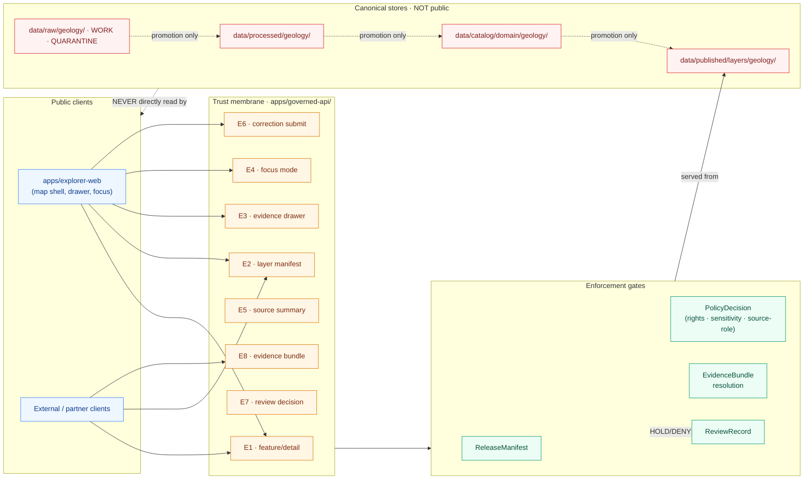

<!-- [KFM_META_BLOCK_V2]
doc_id: kfm://doc/geology-api-contracts
title: Geology · API Contracts
type: standard
version: v1
status: draft
owners: TBD-domain-steward-geology, TBD-api-owner
created: 2026-05-16
updated: 2026-05-16
policy_label: public
related:
  - docs/domains/geology/README.md
  - docs/domains/geology/SENSITIVITY_POSTURE.md
  - docs/domains/geology/OBJECT_FAMILIES.md
  - docs/architecture/trust-membrane.md
  - docs/doctrine/directory-rules.md
  - schemas/contracts/v1/domains/geology/
  - policy/domains/geology/
tags: [kfm, domain, geology, api, contracts, governed-api, evidence-bundle]
notes:
  - Path follows Directory Rules §12 (short-form domain segment "geology").
  - All routes and DTOs are PROPOSED; exact routes UNKNOWN until apps/governed-api wiring confirmed.
  - Borehole, well-log, sample, and private-well exact locations default to restricted or generalized.
[/KFM_META_BLOCK_V2] -->

# Geology · API Contracts

> Governed API surfaces, decision envelopes, and contract obligations for the Geology and Natural Resources domain — the trust membrane through which public clients consume geologic units, structures, boreholes, well logs, mineral occurrences, resource estimates, and extraction context.

<!-- BADGES -->


| Field | Value |
|---|---|
| **Status** | Draft (PROPOSED contracts; no live route claimed) |
| **Owners** | `TBD-domain-steward-geology` · `TBD-api-owner` · `TBD-security-steward` |
| **Last updated** | 2026-05-16 |
| **Authority of doctrine** | CONFIRMED (governs every claim labeled below) |
| **Authority of paths and route shapes** | PROPOSED until verified against mounted repo |
| **Schema home (default)** | `schemas/contracts/v1/domains/geology/` per Directory Rules §7.4 / ADR-0001 |
| **Trust-membrane app** | `apps/governed-api/` (canonical public path) |

---

## Contents

- [1. Purpose & scope](#1-purpose--scope)
- [2. Repo fit](#2-repo-fit)
- [3. Authority & truth posture](#3-authority--truth-posture)
- [4. Endpoint surface](#4-endpoint-surface)
- [5. Per-endpoint contracts](#5-per-endpoint-contracts)
- [6. Outcome envelope reference](#6-outcome-envelope-reference)
- [7. DTO sketches](#7-dto-sketches)
- [8. Source-role anti-collapse rules](#8-source-role-anti-collapse-rules)
- [9. Sensitivity, rights, and publication posture](#9-sensitivity-rights-and-publication-posture)
- [10. Validators, tests, and fixtures](#10-validators-tests-and-fixtures)
- [11. Cross-lane relations](#11-cross-lane-relations)
- [12. Governed AI behavior on this surface](#12-governed-ai-behavior-on-this-surface)
- [13. Open questions & verification backlog](#13-open-questions--verification-backlog)
- [14. Related docs](#14-related-docs)

---

## 1. Purpose & scope

This document defines the **PROPOSED governed API contracts** for the Geology and Natural Resources domain: the typed surfaces through which public clients, the map shell, the Evidence Drawer, the Focus Mode AI, the steward review console, and external consumers obtain geologic claims, layer manifests, evidence bundles, and decisions about them.

It is the geology-specific binding of three CONFIRMED cross-cutting doctrines:

1. **Governed API as trust membrane** — public clients and normal UI surfaces consume governed APIs that enforce release state, policy, evidence, and rights, never canonical or internal stores directly.
2. **Finite outcome envelopes** — every response is one of `ANSWER` / `ABSTAIN` / `DENY` / `ERROR` (and `HOLD` for review-paused promotions); `DENY` and `ABSTAIN` are first-class outcomes, not error conditions.
3. **Source-role anti-collapse** — observed, regulatory, modeled, aggregate, administrative, candidate, and synthetic source roles are never silently relabeled across the pipeline or at the API edge.

**In scope** — endpoint topology, request/response shapes, DTO/schema references, outcome semantics, geology-specific guardrails (borehole privacy, resource-class anti-collapse, source-role discipline), validators and tests that gate publication, cross-lane edges.

**Out of scope** — UI rendering details (see `docs/domains/geology/UI_MAP_SURFACES.md` · TODO), pipeline orchestration internals, ingestion connectors, executable route handlers, and authentication primitives shared across `apps/governed-api/`.

> [!NOTE]
> Every endpoint, DTO name, route, and field listed here is **PROPOSED**. Exact route paths, framework choice, package manager, validator language, and runtime behavior remain `UNKNOWN` / `NEEDS VERIFICATION` until the repository is inspected and the geology slice is wired in `apps/governed-api/`. Doctrine carries; implementation maturity does not.

[↑ Back to top](#contents)

---

## 2. Repo fit

This file lives under `docs/` because its primary responsibility is to explain governed API surfaces to humans (Directory Rules §4 Step 1). It is a doctrine-and-design document, not a runtime artifact. Machine-readable contract authority lives elsewhere.

```text
docs/domains/geology/
└── API_CONTRACTS.md          ← you are here
```

**Upstream (this doc cites / depends on):**

| Source | Role |
|---|---|
| `docs/doctrine/directory-rules.md` | Path placement law, schema-home rule, trust-membrane canonical path |
| `docs/architecture/trust-membrane.md` (PROPOSED) | Cross-domain governed API doctrine |
| `docs/domains/geology/README.md` (PROPOSED) | Domain orientation, scope, non-ownership boundaries |
| `docs/domains/geology/OBJECT_FAMILIES.md` (PROPOSED) | Canonical object types and identity rules |
| `docs/domains/geology/SENSITIVITY_POSTURE.md` (PROPOSED) | Borehole/well-log/extraction rights and tier matrix |
| KFM Domains Culmination Atlas v1.1 — §10 (Geology), §20.3, §24.1, §24.3 | Doctrine references |
| KFM Encyclopedia — §7.8 (Geology and Natural Resources) | Domain blueprint |

**Downstream (consumers of these contracts, all PROPOSED):**

| Consumer | What it obtains here |
|---|---|
| `apps/governed-api/` | Route shape, DTO obligations, finite outcome semantics |
| `apps/explorer-web/` (map shell) | Layer manifest, feature DTO, Evidence Drawer payload contract |
| `apps/review-console/` | Review queue surface, correction submission shape |
| `schemas/contracts/v1/domains/geology/` | Canonical DTO schemas (this doc is normative narrative; schemas are normative shape) |
| `policy/domains/geology/` | Policy gates anchored to the deny conditions named below |
| `tests/domains/geology/` and `fixtures/domains/geology/` | Negative-path fixtures matching the deny matrix |

> [!IMPORTANT]
> **This document is not the schema authority.** Per Directory Rules §7.4 and ADR-0001, `schemas/contracts/v1/domains/geology/` is the machine-shape authority. When a difference exists between the JSON schema and this document, the schema wins for shape, and `contracts/` (semantic Markdown) wins for meaning. This file is a coordinating narrative; treat any divergence as a drift entry to file in `docs/registers/DRIFT_REGISTER.md`.

[↑ Back to top](#contents)

---

## 3. Authority & truth posture

The geology governed API enforces the following invariants at the response boundary. These are CONFIRMED doctrine; their wiring is PROPOSED until verified.

| Invariant | What it means at the API edge |
|---|---|
| **Lifecycle membrane** | Public routes only serve from `PUBLISHED`; never from `RAW`, `WORK`, `QUARANTINE`, or internal `CATALOG/TRIPLET` stores. Direct internal-store reads are `DENY` / `ERROR`. |
| **Promotion is a governed state transition** | Geology features advance through `RAW → WORK/QUARANTINE → PROCESSED → CATALOG/TRIPLET → PUBLISHED` only via promotion gates with `EvidenceBundle`, `ValidationReport`, `PolicyDecision`, and `ReleaseManifest`. No promotion shortcut is exposed on a public route. |
| **EvidenceRef → EvidenceBundle closure** | Every substantive `ANSWER` resolves at least one `EvidenceRef` to a concrete `EvidenceBundle`. Resolution failure → `ABSTAIN` at runtime, `DENY` at publication. |
| **Cite-or-abstain** | The Focus Mode AI never asserts a geologic claim without a resolvable citation. Insufficient evidence → `ABSTAIN` with an `AIReceipt`. |
| **Source-role preservation** | The role set at admission (`SourceDescriptor.source_role`) is preserved on every response. A modeled estimate is never relabeled as an observed reading; an aggregate is never queried as a per-place observation. |
| **Sensitivity fail-closed** | Exact borehole, well-log, geochemistry sample, private-well, and sensitive resource coordinates default to restricted or generalized public geometry. Unresolved sensitivity → `DENY`. |
| **Watcher-as-non-publisher** | Geology ingestion watchers (KGS feed monitors, KCC update detectors, etc.) emit `SourceIntakeRecord` candidates only; they are never exposed on public routes. |

[↑ Back to top](#contents)

---

## 4. Endpoint surface

**PROPOSED endpoint family for Geology.** Route shapes follow the cross-domain pattern in the Encyclopedia §J ("API, contract, and schema possibilities") and the Atlas v1.1 §20.3 ("Master API Surface Table"), specialized for this domain. All routes are PROPOSED; exact paths are subject to the framework and route convention used in `apps/governed-api/` (NEEDS VERIFICATION).

| # | Surface | Proposed route shape | DTO / schema | Finite outcomes | Status |
|---|---|---|---|---|---|
| E1 | Geology feature / detail resolver | `GET /api/v1/domains/geology/features/{feature_id}` | `GeologyFeatureDTO` + `EvidenceRef[]` wrapped in `GeologyDecisionEnvelope` | `ANSWER` / `ABSTAIN` / `DENY` / `ERROR` | PROPOSED; exact route UNKNOWN |
| E2 | Geology layer manifest resolver | `GET /api/v1/layers/{layer_id}/manifest` (filtered to `domain=geology`) | `LayerManifest` (domain layer descriptor) | `ANSWER` / `DENY` / `ERROR` | PROPOSED; public-safe release only |
| E3 | Geology Evidence Drawer payload | `GET /api/v1/domains/geology/features/{feature_id}/evidence` | `EvidenceDrawerPayload` + `EvidenceBundle` projection | `ANSWER` / `ABSTAIN` / `DENY` / `ERROR` | PROPOSED; evidence- and policy-filtered |
| E4 | Geology Focus Mode answer | `POST /api/v1/focus/answer` (domain-scoped to `geology`) | `RuntimeResponseEnvelope` + `AIReceipt` | `ANSWER` / `ABSTAIN` / `DENY` / `ERROR` | PROPOSED; AI is interpretive, never root truth |
| E5 | Geology source summary resolver | `GET /api/v1/domains/geology/sources/{source_id}` | `SourceDescriptor` projection | `ANSWER` / `ABSTAIN` / `DENY` / `ERROR` | PROPOSED |
| E6 | Geology correction submit | `POST /api/v1/corrections` (domain=`geology`) | `CorrectionNoticeCandidate` | `ACCEPTED` / `DENY` / `ERROR` | PROPOSED; routes to review queue |
| E7 | Geology review decision | `POST /api/v1/review/geology/{id}/decision` | `ReviewRecord` + `PolicyDecision` | `ALLOW` / `RESTRICT` / `DENY` / `ERROR` | PROPOSED; steward-only, audited |
| E8 | Geology evidence bundle resolver | `GET /api/v1/evidence/{evidence_ref}` (geology-scoped where applicable) | `EvidenceBundle` | `ANSWER` / `DENY` / `ERROR` | PROPOSED; shared cross-domain resolver |

The trust membrane is the same for every row above: public clients enter only through `apps/governed-api/`; the renderer (MapLibre / `packages/maplibre/`) and any 3D view consume the same `EvidenceBundle` and `DecisionEnvelope` as the 2D shell. Cesium / 3D are alternate renderers, not alternate truth paths.

### 4.1 Trust-membrane topology (PROPOSED)



> [!NOTE]
> **NEEDS VERIFICATION** — The endpoint names, app path (`apps/governed-api/`), and lifecycle directory shapes shown above are PROPOSED. Verify against mounted-repo evidence; if the actual app path is `apps/governed_api/`, `packages/api/`, or another framework convention, file an ADR and revise this diagram accordingly.

[↑ Back to top](#contents)

---

## 5. Per-endpoint contracts

Each contract below names the request shape, the response envelope, the required gates, and the deny matrix specific to geology. All routes are PROPOSED.

### 5.1 E1 · Geology feature / detail resolver

**Purpose.** Return a single Geology feature (geologic unit, structure, borehole reference, mineral occurrence, etc.) with resolvable evidence and a finite outcome.

**Request (PROPOSED).**

```http
GET /api/v1/domains/geology/features/{feature_id}?as_of={iso8601}&observed_at={iso8601}
Accept: application/json
```

| Parameter | Required | Notes |
|---|---|---|
| `feature_id` | yes | Deterministic geology identity per `OBJECT_FAMILIES.md`: `source_id + object_role + temporal_scope + normalized_digest` (PROPOSED). |
| `as_of` | no | Valid-time view; defaults to current published valid-time. |
| `observed_at` | no | Observed-time filter for time-series-capable objects (e.g., `WellLog`, `GeophysicalObservation`). |

**Response (PROPOSED).** `GeologyDecisionEnvelope` wrapping a `GeologyFeatureDTO`. See [§7.1](#71-geologydecisionenvelope-sketch).

**Required gates.**

- `ReleaseManifest` resolves and `release_state == PUBLISHED`.
- `PolicyDecision.allow == true` for the requester's audience and the feature's sensitivity tier.
- All `EvidenceRef[]` resolve to retrievable `EvidenceBundle` objects.
- Source role matches the claim type (see [§8](#8-source-role-anti-collapse-rules)).

**Deny matrix (geology-specific).**

| Condition | Outcome | Reason code (PROPOSED) |
|---|---|---|
| Exact borehole coordinates requested without authorization | `DENY` | `geology.borehole.exact_geometry_restricted` |
| Exact private water-well location requested | `DENY` | `geology.private_well.exact_geometry_restricted` |
| Resource estimate queried as observed deposit | `DENY` | `geology.resource_estimate.role_collapse` |
| Mineral occurrence cited as production / reserve claim | `DENY` | `geology.occurrence.deposit_collapse` |
| Feature lives in `WORK` or `QUARANTINE` | `DENY` | `lifecycle.not_published` |
| Required `EvidenceBundle` does not resolve | `ABSTAIN` | `evidence.bundle.unresolved` |
| Stale beyond the source's freshness window with no released alternative | `ABSTAIN` | `evidence.stale` |
| Schema validation fails on response shape | `ERROR` | `contract.shape_violation` |

### 5.2 E2 · Geology layer manifest resolver

**Purpose.** Return the manifest describing a public-safe Geology layer (bedrock unit map, surficial geology, structure/fault view, stratigraphy correlation, borehole public-generalized view, mineral occurrence / deposit summary, extraction/reclamation context, hydrostratigraphy linkage layer).

**Outcome set.** `ANSWER` / `DENY` / `ERROR`. `ABSTAIN` is intentionally absent — a layer either has a current `ReleaseManifest` (serve) or it does not (deny).

**Required gates.**

- `ReleaseManifest` exists, current, signed, and references the layer's tile / artifact bundle.
- Layer's underlying features all have closed `EvidenceBundle` and `PolicyDecision == allow`.
- Layer geometry passes the public-safe geometry validator (see [§10](#10-validators-tests-and-fixtures)).
- Source roles for the layer are uniform or explicitly composited via a recorded transform.

> [!WARNING]
> **Borehole and well-log layers** MUST be public-safe-generalized variants by default. A raw borehole point layer with exact coordinates MUST NOT have a `ReleaseManifest` until rights, sensitivity, and exposure review have approved it. A request for the underlying exact layer returns `DENY` with `geology.borehole.layer_generalization_required`.

### 5.3 E3 · Geology Evidence Drawer payload

**Purpose.** Provide the Evidence Drawer UI with the projection it needs to surface trust signals — source family, source role, evidence refs, validation outcome, freshness, rights posture, citation list — for a clicked Geology feature.

**Response.** `EvidenceDrawerPayload` carrying an `EvidenceBundle` projection plus trust-badge state. Outcomes: `ANSWER` / `ABSTAIN` / `DENY` / `ERROR`.

**Geology-specific surfacing rules.**

- For `Borehole` and `WellLog` references in public mode, the drawer surfaces metadata, source, and uncertainty; exact coordinates are redacted and a `RedactionReceipt` reference appears in the drawer's transforms panel.
- For `ResourceEstimate`, the drawer always labels the aggregation unit (per `role_aggregation_unit`) and forbids per-place interpretation.
- For `MineralOccurrence`, the drawer must visually distinguish occurrence from deposit, and from extraction site and production claim. A single occurrence row never implies a deposit.
- For `Synthetic` content (e.g., AI-reconstructed cross-section), the drawer carries a Reality Boundary Note and a Representation Receipt.

### 5.4 E4 · Geology Focus Mode answer

**Purpose.** Allow the governed AI to summarize released Geology EvidenceBundles, compare evidence, explain limitations, and draft steward-review notes — bounded by evidence and policy.

**Response.** `RuntimeResponseEnvelope` + `AIReceipt`. Outcomes: `ANSWER` / `ABSTAIN` / `DENY` / `ERROR`.

**Required AI behavior (CONFIRMED doctrine).**

- `ABSTAIN` when `EvidenceBundle` is missing, citations cannot be validated, source roles conflict, temporal scope is insufficient, or the user asks for unsupported inference (e.g., extrapolating a deposit from an occurrence).
- `DENY` direct `RAW` / `WORK` / `QUARANTINE` access, sensitive-location exposure (exact borehole / well-log / private-well geometry), uncited authoritative claims, or extraction / production claims masquerading as observed.
- Always emit `AIReceipt` with `outcome`, `evidence_refs`, `policy_decision`, and `citation_validation`.

> [!IMPORTANT]
> Focus Mode is **interpretive**, not authoritative. Generated text is never a source. If an AI summary contradicts the underlying EvidenceBundle, the EvidenceBundle wins and the response must be re-emitted as `ABSTAIN` with an explanatory AIReceipt.

### 5.5 E5 · Geology source summary resolver

**Purpose.** Return a `SourceDescriptor` projection for a Geology source family (Kansas Geological Survey datasets, USGS NGMDB/GeMS, KCC oil and gas regulatory data, KGS/KDHE WWC5 water-well program, KGS LAS digital well logs, USGS MRDS, etc.).

**Response.** `SourceDescriptor` projection. Outcomes: `ANSWER` / `ABSTAIN` / `DENY` / `ERROR`.

The projection MUST include: `source_id`, `source_role`, `role_authority`, `rights_status`, `sensitivity_tier`, `update_cadence`, `permitted_claims`, `not_authoritative_for`, `current_terms_state` (CONFIRMED or `NEEDS VERIFICATION`). For Geology, several source families currently carry `NEEDS VERIFICATION` on rights and current terms — see [§13](#13-open-questions--verification-backlog).

### 5.6 E6 · Geology correction submit

**Purpose.** Accept a `CorrectionNoticeCandidate` against a published Geology feature, layer, or interpretation; route it to the review queue.

**Response.** `ACCEPTED` (candidate queued, identifier returned) / `DENY` (out of scope, malformed, against a non-published target) / `ERROR`.

The endpoint MUST NOT change any canonical record; it only emits a candidate. Promotion to a published correction is a separate, governed transition handled in [§5.7](#57-e7--geology-review-decision).

### 5.7 E7 · Geology review decision

**Purpose.** Steward-only endpoint that records a `ReviewRecord` + `PolicyDecision` on a Geology promotion, correction, or sensitivity exposure.

**Outcomes.** `ALLOW` / `RESTRICT` / `DENY` / `ERROR`. `HOLD` is allowed when a higher-tier sensitivity exposure (e.g., a well-log exposure request) needs sovereignty / rights-holder consultation.

Separation of duties: the reviewer of a sensitive-lane release MUST NOT be the same actor as the candidate's author (CONFIRMED doctrine for release-significant lanes).

### 5.8 E8 · Geology evidence bundle resolver

**Purpose.** Return an `EvidenceBundle` for a given `evidence_ref`. This endpoint is cross-domain; geology callers are gated on geology-specific sensitivity rules at resolution time.

**Outcomes.** `ANSWER` / `DENY` / `ERROR`. `ABSTAIN` does not apply — a bundle either exists, resolves, and is releasable, or it does not.

[↑ Back to top](#contents)

---

## 6. Outcome envelope reference

Every endpoint above returns one of the finite outcomes below. Outcomes are CONFIRMED doctrine; geology bindings are PROPOSED.

| Outcome | When (CONFIRMED) | Required artifacts | Public-surface effect |
|---|---|---|---|
| `ANSWER` | Evidence sufficient · policy allows · release state permits · review state (if required) recorded. | `EvidenceBundle` resolved · `PolicyDecision = allow` · `ReleaseManifest` applies. | Substantive payload with Evidence Drawer citation. |
| `ABSTAIN` | Evidence insufficient or stale with no released alternative · AI surface cannot cite. | `AIReceipt` with reason · no claim emitted. | Non-substantive note with a reason; never invents. |
| `DENY` | Policy / rights / sensitivity / release state forbids · sensitive lanes default here. | `PolicyDecision = deny` + reason code · `AIReceipt` records denial on AI surfaces. | Denial reason; offers alternative non-restricted surface where possible. |
| `ERROR` | Cannot evaluate — missing schema · malformed query · contract violation · infrastructure failure. | Error envelope with diagnostic code · no claim leakage. | Finite, actionable error; never silently falls through to a different lane. |
| `HOLD` | Promotion / release / correction paused for steward, rights-holder, or sovereignty review. | `ReviewRecord` pending · `PolicyDecision = hold`. | Surface remains in prior state; no silent rollback or replacement. |

**Forbidden behaviors on every geology surface:**

- Returning a `WORK` / `CATALOG` candidate as `ANSWER`.
- Returning a layer that lacks a `ReleaseManifest`.
- Returning exact borehole, well-log, sample, or private-well coordinates as `ANSWER` without a recorded sensitivity exposure authorization.
- Returning an `ABSTAIN` without an `AIReceipt` from a Focus Mode surface.
- Returning `ANSWER` for a `MineralOccurrence` queried as `ResourceDeposit`, `ResourceEstimate`, `ExtractionSite`, or production / reserve claim.

[↑ Back to top](#contents)

---

## 7. DTO sketches

DTOs below are **PROPOSED illustrative shapes**. The canonical machine shape lives at `schemas/contracts/v1/domains/geology/` (NEEDS VERIFICATION). The sketches communicate intent — required fields, role-preservation obligations, and EvidenceRef wiring — not exact serialization.

### 7.1 `GeologyDecisionEnvelope` sketch

<details>
<summary>Click to expand — <code>GeologyDecisionEnvelope</code> illustrative shape</summary>

```jsonc
// PROPOSED · illustrative · not a canonical schema · NEEDS VERIFICATION
{
  "object_type": "GeologyDecisionEnvelope",
  "schema_version": "v1",
  "envelope_id": "env-geology-<deterministic>",
  "created": "2026-05-16T00:00:00Z",
  "outcome": "ANSWER",                          // ANSWER | ABSTAIN | DENY | ERROR (HOLD on promotion paths)
  "reason_code": null,                          // populated on ABSTAIN / DENY / ERROR / HOLD
  "domain": "geology",
  "feature": {                                  // present on ANSWER for E1
    "object_type": "GeologyFeatureDTO",
    "feature_id": "geo-<deterministic>",
    "object_family": "GeologicUnit",            // see OBJECT_FAMILIES.md
    "source_role": "observed",                  // see §8
    "geometry": { "type": "Polygon", "coordinates": [...] },
    "geometry_class": "public_safe",            // public_safe | exact_restricted | generalized
    "attributes": { /* unit name, lithology, age, etc. */ },
    "temporal": {
      "source_time": "...",
      "observed_time": "...",
      "valid_time": "...",
      "retrieval_time": "...",
      "release_time": "...",
      "correction_time": null
    },
    "uncertainty": { /* interpretation version, bounds, model id if modeled */ }
  },
  "evidence_refs": [                            // resolve via E8
    { "evidence_ref_id": "er-...", "spec_hash": "sha256:..." }
  ],
  "policy_decision": {
    "allow": true,
    "rights_status": "open",
    "sensitivity_tier": "T0",
    "policy_bundle_hash": "sha256:..."
  },
  "release_manifest_ref": "rel-geology-<id>",
  "citation_validation": { "passed": true },
  "ai_receipt": null,                           // present on Focus Mode (E4) only
  "links": {
    "evidence_drawer": "/api/v1/domains/geology/features/.../evidence",
    "layer_manifest": "/api/v1/layers/<layer_id>/manifest",
    "correction_submit": "/api/v1/corrections"
  }
}
```

</details>

### 7.2 `GeologyFeatureDTO` field obligations

| Field | Required | Notes |
|---|---|---|
| `feature_id` | yes | Deterministic; reproducible across runs. |
| `object_family` | yes | One of: `GeologicUnit`, `SurficialUnit`, `Lithology`, `StratigraphicInterval`, `StratigraphicCorrelation`, `StructureFeature`, `FaultStructure`, `GeologyBoundaryVersion`, `BoreholeReference`, `WellLogReference`, `CoreSample`, `GeophysicalObservation`, `GeochemistrySampleReference`, `MineralOccurrence`, `ResourceDeposit`, `ResourceEstimate`, `ExtractionSite`, `ReclamationRecord`, `CrossSection`, `HydrostratigraphicUnit`. |
| `source_role` | yes | One of: `observed`, `regulatory`, `modeled`, `aggregate`, `administrative`, `candidate`, `synthetic`. Preserved from `SourceDescriptor`. |
| `geometry_class` | yes | One of: `public_safe`, `exact_restricted`, `generalized`. Public clients never receive `exact_restricted` without recorded authorization. |
| `temporal.*` | yes | Source / observed / valid / retrieval / release / correction times must remain distinct where material. |
| `uncertainty.*` | conditional | Required for modeled and interpreted objects (cross-sections, geophysics-derived surfaces, resource estimates). |

[↑ Back to top](#contents)

---

## 8. Source-role anti-collapse rules

Source role is a first-class identity attribute set at admission and **never upgraded by promotion**. Geology is one of the domains where role collapse causes concrete harm (occurrence ≠ deposit; aggregate ≠ per-place; regulatory permit ≠ observed extraction).

### 8.1 Roles relevant to Geology

| Role | Typical Geology examples |
|---|---|
| `observed` | Stream-cut outcrop description; core sample lithology log; geochemistry sample assay; geophysical survey reading; field-mapped contact. |
| `regulatory` | KCC oil-and-gas permit; reclamation order; designated extraction site under state authority. |
| `modeled` | Hydrostratigraphic surface; interpolated isopach; geostatistical resource model; reconstructed cross-section. |
| `aggregate` | County-level mineral resource summary; basin-scale reserve estimate; decadal production total. |
| `administrative` | Well registry compilation; lease tract roster; operator-of-record index. |
| `candidate` | Quarantined connector output; unmerged borehole record; unresolved geologic-unit assertion. |
| `synthetic` | AI-reconstructed cross-section; simulated subsurface scene; AI-drafted unit description. |

### 8.2 Geology-specific deny matrix

| Collapse | Outcome | Reason code (PROPOSED) |
|---|---|---|
| `modeled` resource estimate served as an `observed` deposit | `DENY` (publication) · `ABSTAIN` (Focus Mode) | `geology.role.modeled_as_observed` |
| `regulatory` permit cited as observed production | `DENY` | `geology.role.regulatory_as_observed` |
| `aggregate` county / basin total joined to a single per-place record | `DENY` on join · `ABSTAIN` at AI | `geology.role.aggregate_as_per_place` |
| `administrative` lease compilation cited as drilling-event timeline | `DENY` | `geology.role.administrative_as_observed` |
| `candidate` borehole exposed on a public surface | `DENY` at trust membrane · route to QUARANTINE | `lifecycle.candidate_on_public_surface` |
| `synthetic` cross-section presented as observed | `DENY` publication · `HOLD` for steward review · `ABSTAIN` at AI | `geology.synthetic.observed_collapse` |
| `MineralOccurrence` rendered as `ResourceDeposit` | `DENY` | `geology.occurrence.deposit_collapse` |
| `ResourceEstimate` rendered as confirmed `Reserve` / production | `DENY` | `geology.estimate.reserve_collapse` |

> [!CAUTION]
> **Promotion never upgrades a source role.** If a `modeled` surface improves with better inputs, the upgrade path is a new `SourceDescriptor` and a new `EvidenceBundle` — not a relabel of the existing record. Any pipeline that silently rewrites `source_role` is a critical defect; this is a `DENY` condition on emit and a CI failure on detection.

[↑ Back to top](#contents)

---

## 9. Sensitivity, rights, and publication posture

CONFIRMED / PROPOSED: exact borehole, sample, sensitive resource, well-log, and private well locations default to **restricted or generalized** public geometry. Occurrence, deposit, estimate, permit, production, and reserve claims **must remain distinct**.

### 9.1 Default tier matrix for Geology (PROPOSED, extends Atlas §24.5.2)

| Object class | Default tier | Allowed transforms (PROPOSED) | Required gates |
|---|---|---|---|
| `GeologicUnit` (bedrock / surficial polygons, public sources) | `T0` Open | none (already public-safe) | `ReleaseManifest` |
| `FaultStructure` (public regional structures) | `T0` Open | none | `ReleaseManifest` |
| `StratigraphicInterval` / `CrossSection` (public, generalized) | `T0` Open | generalization for scale | `ReleaseManifest` |
| `MineralOccurrence` (public records) | `T0` Open | none | `ReleaseManifest` |
| `BoreholeReference` (private well, exact location) | `T3 / T4` | generalization (cell binning) · redaction → `T1` | `RedactionReceipt` + `ReviewRecord` + `PolicyDecision` |
| `WellLogReference` (proprietary logs) | `T3 / T4` | rights review · partial redaction → `T2` (reviewer) | rights confirmation + `ReviewRecord` |
| `GeochemistrySampleReference` (exact site) | `T1 / T3` | generalization → `T1`; exact reserved for reviewers / partners | `RedactionReceipt` |
| `ResourceEstimate` | `T0 / T1` | aggregation receipt; never per-place inference | `AggregationReceipt` |
| `ExtractionSite` (sensitive geometry) | `T1 / T2` | generalization · exposure review | `ReviewRecord` |
| `ReclamationRecord` | `T0 / T1` | generalization where rights require | `ReleaseManifest` |
| Sacred / culturally sensitive joins (Geology × Archaeology) | `T4` | route through Archaeology sovereignty review; never auto-released | sovereignty review + `PolicyDecision` |

> [!WARNING]
> **Join-induced sensitivity is real.** A `MineralOccurrence` benign on its own may become sensitive when joined to a private parcel record or to a culturally significant site polygon. The deny condition applies to the *join product*, not just to the inputs. Validators MUST evaluate the output's sensitivity, not assume input sensitivity composes safely.

### 9.2 Rights posture (selected sources, NEEDS VERIFICATION on current terms)

| Source family | Role tags (PROPOSED) | Current terms |
|---|---|---|
| Kansas Geological Survey data and maps | observation / context / authority (mapped products) | `NEEDS VERIFICATION` |
| KGS surficial geology and geologic maps | observation / context / authority | `NEEDS VERIFICATION` |
| USGS NGMDB and GeMS | observation / authority | `NEEDS VERIFICATION` |
| KGS oil and gas wells and production | observation / administrative | `NEEDS VERIFICATION` |
| KCC oil and gas regulatory data | regulatory | `NEEDS VERIFICATION` |
| KGS / KDHE WWC5 and water-well program | observation / administrative | `NEEDS VERIFICATION`; private-well joins fail closed |
| KGS LAS digital well logs and well tops | observation; partially proprietary | `NEEDS VERIFICATION`; proprietary holdings deny-default |
| USGS MRDS | observation / context | `NEEDS VERIFICATION` |

[↑ Back to top](#contents)

---

## 10. Validators, tests, and fixtures

The endpoints in [§4](#4-endpoint-surface) are only as trustworthy as the validators behind them. The following are PROPOSED for Geology and align with the cross-domain test catalogue in Atlas §20.4.

**Domain validators (PROPOSED, all under `tools/validators/` with geology lane and `schemas/contracts/v1/domains/geology/` schemas).**

- Source-role validator — every emitted Geology object preserves `source_role` from its `SourceDescriptor`; rewriting is a `DENY`.
- Resource-class anti-collapse — occurrence ↛ deposit, estimate ↛ reserve, permit ↛ production; emit `DENY` on violation.
- Public-safe geometry — borehole / well-log / sample / private-well exact coordinates fail closed without recorded authorization.
- Borehole / well-log rights — proprietary log distribution requires rights confirmation; deny by default.
- Catalog closure — every `PUBLISHED` Geology layer resolves to a `ReleaseManifest`, an `EvidenceBundle`, and validation receipts.
- AI evidence-before-model — Focus Mode answers without a resolved `EvidenceBundle` emit `ABSTAIN` with an `AIReceipt`.
- Schema validation, rights validation, sensitivity validation, evidence closure, temporal logic, geometry validity, citation validation, release manifest validation, rollback drill, no-network fixtures, non-regression for prior lineage.

**Negative fixtures (PROPOSED, under `fixtures/domains/geology/invalid/`).**

| Fixture | Expected outcome |
|---|---|
| `borehole.exact_coords.public.json` | `DENY` (`geology.borehole.exact_geometry_restricted`) |
| `mineral_occurrence.served_as_deposit.json` | `DENY` (`geology.occurrence.deposit_collapse`) |
| `resource_estimate.served_as_reserve.json` | `DENY` (`geology.estimate.reserve_collapse`) |
| `modeled_isopach.labeled_observed.json` | `DENY` (`geology.role.modeled_as_observed`) |
| `aggregate.county.joined_to_well.json` | `DENY` (`geology.role.aggregate_as_per_place`) |
| `synthetic_cross_section.no_boundary_note.json` | `DENY` (`geology.synthetic.observed_collapse`) |
| `feature.work_lifecycle.served.json` | `DENY` (`lifecycle.not_published`) |
| `evidence_bundle.unresolved.json` | `ABSTAIN` (`evidence.bundle.unresolved`) |
| `focus_mode.uncited_claim.json` | `ABSTAIN` (`citation.unresolvable`) |
| `release_manifest.missing.layer.json` | `DENY` at E2 (`release.manifest.missing`) |
| `correction.against_unpublished.json` | `DENY` at E6 (`correction.target_not_published`) |

[↑ Back to top](#contents)

---

## 11. Cross-lane relations

Cross-lane edges must preserve ownership, source role, sensitivity, and `EvidenceBundle` support. Geology never claims another domain's canonical truth.

| Related lane | Relation type | API-edge constraint |
|---|---|---|
| Soil | Parent material and surficial context. | Geology may cite Soil via `EvidenceRef` to Soil's published bundle; never restate Soil's per-place soil measurements as Geology. |
| Hydrology | Hydrostratigraphy and aquifer context without replacing measurements. | Geology may publish a hydrostratigraphic unit linkage; stream-gauge observations remain Hydrology's claim. |
| Hazards | Fault / landslide / subsidence risk context without owning risk. | Geology may publish a structure layer; risk-state truth (designations, advisories) is Hazards. |
| People / Land | Lease, parcel, operator relation cannot prove deposits. | An administrative parcel join never authorizes a `DENY → ANSWER` flip on a deposit claim. |
| Archaeology | Subsurface joins potentially sensitive. | Joins to known sensitive sites route through Archaeology sovereignty review; defaults T4. |

[↑ Back to top](#contents)

---

## 12. Governed AI behavior on this surface

CONFIRMED doctrine / PROPOSED implementation. The Focus Mode AI on Geology surfaces:

- **MAY** summarize released Geology `EvidenceBundle` objects, compare evidence across sources, explain limitations and uncertainty, and draft steward-review notes.
- **MUST ABSTAIN** when evidence is insufficient — including: missing or unresolved `EvidenceBundle`, conflicting source roles, insufficient temporal scope, unsupported inference (e.g., extrapolating a deposit from an occurrence), or stale evidence with no released alternative.
- **MUST DENY** any request that would expose sensitive geometry, surface `RAW` / `WORK` / `QUARANTINE` records, present synthetic content as observed, or treat aggregate as per-place.
- **MUST** emit an `AIReceipt` on every Focus Mode response, with `outcome`, `evidence_refs`, `policy_decision`, and `citation_validation`.

> [!NOTE]
> The AI is interpretive, not authoritative. Fluency is not evidence. A Focus Mode answer about geology is downstream of an `EvidenceBundle`; if the bundle is silent or unresolvable, the answer is `ABSTAIN`.

[↑ Back to top](#contents)

---

## 13. Open questions & verification backlog

These items are explicitly **not resolved** by this document. They are tracked here and should be filed into `docs/registers/VERIFICATION_BACKLOG.md` and resolved via ADR, schema authorship, or steward review.

| # | Item | Status | Settled by |
|---|---|---|---|
| Q1 | Exact route paths in `apps/governed-api/` (framework, route convention, prefix) | `NEEDS VERIFICATION` | Mounted repo inspection + ADR if path differs from `apps/governed-api/`. |
| Q2 | Canonical schema files under `schemas/contracts/v1/domains/geology/` (presence, names, versions) | `NEEDS VERIFICATION` | Inspect mounted repo; this doc links narrative to schema, not the other way round. |
| Q3 | Identity rule for Geology objects (`source_id + object_role + temporal_scope + normalized_digest`) | `PROPOSED` | ADR + schema field definition + validator. |
| Q4 | KGS, KCC, USGS NGMDB, USGS MRDS, WWC5 source descriptors and current terms | `NEEDS VERIFICATION` | Source-rights confirmation + `SourceDescriptor` records under `data/registry/sources/geology/`. |
| Q5 | Public posture for borehole and well-log layers (tier, generalization radius, rights split between public KGS holdings and proprietary holdings) | `NEEDS VERIFICATION` | Steward decision + `policy/domains/geology/` rules + fixture coverage. |
| Q6 | Resource-classification scheme (occurrence / deposit / estimate / reserve / production) and the validator vocabulary that enforces it | `PROPOSED` | ADR + schema enum + anti-collapse validator. |
| Q7 | Geology API ↔ MapLibre ↔ Evidence Drawer wiring (data flow, manifest fields consumed) | `NEEDS VERIFICATION` | Mounted repo inspection + integration tests + per-layer manifest sample. |
| Q8 | Geology Focus Mode template inventory (allowed prompts, abstain conditions per template) | `PROPOSED` | ADR + Focus Mode template registry + AIReceipt evaluation tests. |
| Q9 | Sensitivity tier matrix application to specific KGS holdings (which datasets are `T0`, which are `T1` after generalization, which require `T2/T3`) | `NEEDS VERIFICATION` | Rights review + sensitivity register entry. |
| Q10 | Correction lifecycle for Geology interpretations (e.g., a re-mapped contact): correction vs. supersession vs. new `GeologyBoundaryVersion`? | `PROPOSED` | ADR; clarify whether `CorrectionNoticeCandidate` or a new boundary version is the right transition. |
| Q11 | Whether `docs/domains/geology/` (Directory Rules §12 short form) or `docs/domains/geology-and-natural-resources/` (Atlas v1.1 §2.1 long form) is the canonical path | `OPEN / CONFLICTED` | ADR; this doc follows Directory Rules §12 short form pending resolution. |
| Q12 | Audit posture for `AIReceipt` retention, query, and verification | `NEEDS VERIFICATION` | Cross-domain decision; not geology-specific but inherited. |

[↑ Back to top](#contents)

---

## 14. Related docs

> Linked entries are PROPOSED siblings or canonical references. Items marked `TODO` have not been verified to exist in the mounted repo.

- `docs/domains/geology/README.md` · domain orientation, non-ownership boundaries (TODO)
- `docs/domains/geology/OBJECT_FAMILIES.md` · canonical object types, identity rules, temporal handling (TODO)
- `docs/domains/geology/SENSITIVITY_POSTURE.md` · per-object tier matrix and transform catalogue (TODO)
- `docs/domains/geology/SOURCE_REGISTRY.md` · KGS, USGS, KCC, WWC5, MRDS source descriptors (TODO)
- `docs/domains/geology/UI_MAP_SURFACES.md` · MapLibre layer wiring, Evidence Drawer projections (TODO)
- `docs/doctrine/directory-rules.md` · path placement, schema-home rule, trust-membrane canonical path
- `docs/architecture/trust-membrane.md` · cross-domain governed API doctrine (TODO)
- `docs/architecture/contract-schema-policy-split.md` · schema vs. contract vs. policy authority (TODO)
- `schemas/contracts/v1/domains/geology/` · canonical machine shape (NEEDS VERIFICATION)
- `policy/domains/geology/` · policy gates and deny conditions (NEEDS VERIFICATION)
- `tests/domains/geology/` · validator coverage (NEEDS VERIFICATION)
- `fixtures/domains/geology/` · golden and negative fixtures (NEEDS VERIFICATION)
- KFM Domains Culmination Atlas v1.1 — §10 (Geology), §20.3 (Master API Surface), §24.1 (Source-Role Anti-Collapse), §24.3 (Outcome Envelope), §24.5 (Sensitivity Tiers)
- KFM Encyclopedia — §7.8 (Geology and Natural Resources)
- KFM Unified Implementation Architecture Build Manual — §6.11 (Geology / Natural Resources)

---

<sub>Last updated 2026-05-16 · doc version v1 (draft) · status PROPOSED · authority anchored in Directory Rules, KFM Domains Atlas v1.1, KFM Encyclopedia, and KFM Unified Implementation Architecture Build Manual.</sub>

[↑ Back to top](#contents)
