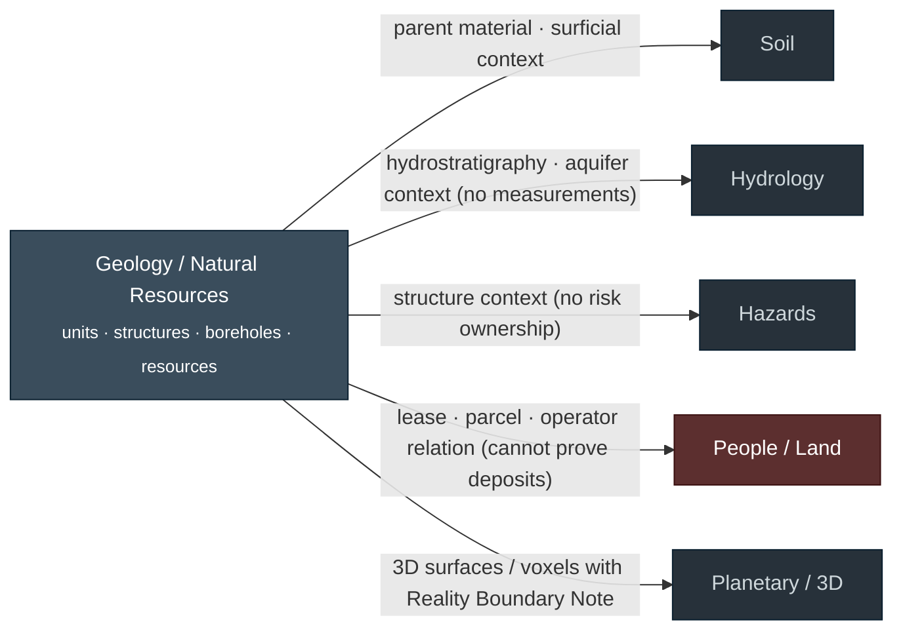
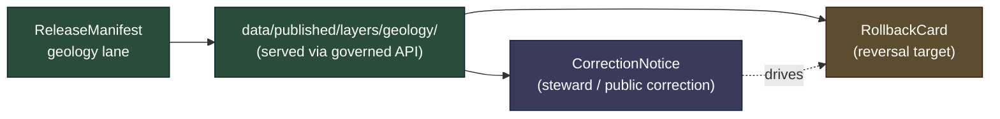
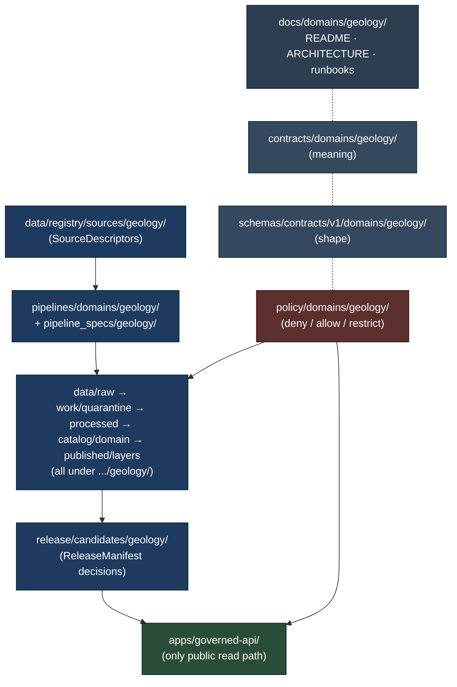

<!-- [KFM_META_BLOCK_V2]
doc_id: kfm://doc/geology-architecture
title: Geology and Natural Resources Domain — Architecture
type: standard
version: v1.1
status: draft
owners: TBD — Geology domain steward + Docs steward
created: 2026-05-16
updated: 2026-06-03
policy_label: public
related:
  - docs/domains/README.md
  - docs/domains/geology/README.md
  - directory-rules.md
  - docs/doctrine/lifecycle-law.md
  - docs/doctrine/trust-membrane.md
  - docs/doctrine/authority-ladder.md
  - docs/architecture/governed-api.md
  - docs/architecture/contract-schema-policy-split.md
  - docs/adr/ADR-0001-schema-home.md
  - ai-build-operating-contract.md
tags: [kfm, domain, geology, natural-resources, architecture]
notes:
  - Doctrine-adjacent; CONTRACT_VERSION pinned to 3.0.0 per ai-build-operating-contract.md.
  - Implementation-layer claims are PROPOSED until verified against mounted-repo evidence.
  - Source rights, KGS/KCC terms, and validator language are NEEDS VERIFICATION.
  - Placement-law location (directory-rules.md root vs docs/doctrine/) is itself OPEN/CONFLICTED — see §14.
[/KFM_META_BLOCK_V2] -->

# Geology and Natural Resources Domain — Architecture

> Governed, evidence-first architecture for Kansas geology, subsurface observations, and resource records — bedrock and surficial maps, stratigraphy, structures, boreholes, well logs, cores, geophysics, geochemistry, mineral occurrences, resource deposits, and extraction/reclamation context — published only as public-safe derivatives through KFM's trust membrane.


-yellow)


**Status:** draft · **Owners:** _Geology domain steward + Docs steward (placeholder)_ · **Last updated:** 2026-06-03 · **Contract:** `CONTRACT_VERSION = "3.0.0"`

---

## Mini Table of Contents

- [1. Mission and One-Line Purpose](#1-mission-and-one-line-purpose)
- [2. Scope, Boundary, and Explicit Non-Ownership](#2-scope-boundary-and-explicit-non-ownership)
- [3. Ubiquitous Language](#3-ubiquitous-language)
- [4. Source Families and Source Roles](#4-source-families-and-source-roles)
- [5. Canonical Object Families](#5-canonical-object-families)
- [6. Cross-Lane Relations](#6-cross-lane-relations)
- [7. Pipeline Shape — RAW → PUBLISHED](#7-pipeline-shape--raw--published)
- [8. Sensitivity, Rights, and Publication Posture](#8-sensitivity-rights-and-publication-posture)
- [9. API, Contract, and Schema Surfaces](#9-api-contract-and-schema-surfaces)
- [10. Validators, Tests, and Fixtures](#10-validators-tests-and-fixtures)
- [11. Governed AI Behavior](#11-governed-ai-behavior)
- [12. Publication, Correction, and Rollback](#12-publication-correction-and-rollback)
- [13. Repository Lane Map](#13-repository-lane-map)
- [14. Open Questions and Verification Backlog](#14-open-questions-and-verification-backlog)
- [15. Changelog](#15-changelog)
- [16. Definition of Done](#16-definition-of-done)
- [17. Related Docs](#17-related-docs)

---

## 1. Mission and One-Line Purpose

**CONFIRMED doctrine / PROPOSED implementation.** The Geology and Natural Resources lane governs Kansas geologic interpretation and subsurface evidence — bedrock and surficial geology, stratigraphy, lithology, structures, geomorphology, boreholes, well logs, cores, geophysics, geochemistry, mineral occurrences, resource deposits, and extraction/reclamation context — without turning interpretations or extraction records into unreviewed truth. The lane links to Hydrology via hydrostratigraphy and to Soil via parent-material context, but it does not own hydrologic measurements, soil profiles, hazard risk, or ownership/lease/permit/title claims.

> [!NOTE]
> The Geology lane is **interpretation-heavy**. A geologic unit, a borehole correlation, a structure picked off seismic, and a published resource estimate are all *derivatives* of underlying observations. KFM preserves source role at every promotion so that an *interpretation* never silently becomes an *observation* and an *estimate* never silently becomes a *per-place measurement*.

[Back to top](#geology-and-natural-resources-domain--architecture)

---

## 2. Scope, Boundary, and Explicit Non-Ownership

### 2.1 This domain owns

| Object family | Status | Citation |
|---|---|---|
| Geologic Unit · Surficial Unit · Lithology | CONFIRMED / PROPOSED | DOM-GEOL · ENCY |
| Stratigraphic Interval · Stratigraphic Correlation · Geologic Age | CONFIRMED / PROPOSED | DOM-GEOL · ENCY |
| Structure Feature (incl. Fault Structure) · Geology Boundary Version | CONFIRMED / PROPOSED | DOM-GEOL · ENCY |
| Borehole Reference · Well Log Reference · Core Sample | CONFIRMED / PROPOSED | DOM-GEOL · ENCY |
| Geophysical Observation · Geochemistry Sample Reference | CONFIRMED / PROPOSED | DOM-GEOL · ENCY |
| Mineral Occurrence · Resource Deposit · Resource Estimate | CONFIRMED / PROPOSED | DOM-GEOL · ENCY |
| Extraction Site · Reclamation Record | CONFIRMED / PROPOSED | DOM-GEOL · ENCY |
| Cross Section · Hydrostratigraphic Unit (geology side) | CONFIRMED / PROPOSED | DOM-GEOL · ENCY |
| Public-safe generalized geometry · Evidence Bundle · Release Manifest | CONFIRMED / PROPOSED | DOM-GEOL · ENCY |

### 2.2 This domain does **not** own

| Concern | Owning lane | Why |
|---|---|---|
| Streamflow, groundwater levels, aquifer measurements | Hydrology | Geology supplies hydrostratigraphic *context* only. |
| Soil profiles, taxonomy, suitability | Soil | Geology supplies parent-material *context* only. |
| Fault / landslide / subsidence **risk** characterization | Hazards | Geology supplies the structure; Hazards owns the risk frame. |
| Ownership, lease, permit, title, operator identity | People / Land | Administrative compilations cannot prove deposits. |
| UI / AI assertions, summaries, or generated map prose | UI · Governed AI | Derivatives; never sovereign truth. |

> [!IMPORTANT]
> **Source-role anti-collapse is non-negotiable here.** Occurrence, deposit, estimate, permit, production, and reserve claims must remain distinct at every stage (Atlas §10.I, verbatim). Conflating an aggregate resource estimate with a per-place observation is a DENY condition at publication and an ABSTAIN condition at the AI surface.

[Back to top](#geology-and-natural-resources-domain--architecture)

---

## 3. Ubiquitous Language

The Geology lane uses the following terms with KFM-bounded meaning. Each term is **CONFIRMED as a domain term** (Atlas §10.C); the **field realization** (schema property names, units, enumerations) is **PROPOSED** until verified in `schemas/contracts/v1/domains/geology/`.

| Term | Meaning inside this lane | Status |
|---|---|---|
| **Geologic Unit** | A mapped polygonal body of rock/sediment with assigned age, lithology, and stratigraphic context. | CONFIRMED term / PROPOSED field realization |
| **Surficial Unit** | A Quaternary or near-surface mapped unit, distinguished from bedrock. | CONFIRMED term / PROPOSED field realization |
| **Lithology** | A rock-type classification attached to a unit, borehole interval, or sample. | CONFIRMED term / PROPOSED field realization |
| **Stratigraphic Interval** | A defined depth or correlation range within a borehole, log, or section. | CONFIRMED term / PROPOSED field realization |
| **Stratigraphic Correlation** | A reasoned link between intervals across boreholes or outcrops; an *interpretation*, not an observation. | CONFIRMED term / PROPOSED field realization |
| **Structure Feature** | A mapped fault, fold, lineament, or other tectonic/structural element. | CONFIRMED term / PROPOSED field realization |
| **Geology Boundary Version** | A versioned representation of a contact or unit boundary on a specific map source. | CONFIRMED term / PROPOSED field realization |
| **Borehole Reference** | A pointer to an admitted borehole record; locations may be generalized in public payloads. | CONFIRMED term / PROPOSED field realization |
| **Well Log Reference** | A pointer to an admitted well-log record (e.g., LAS); subject to rights review. | CONFIRMED term / PROPOSED field realization |
| **Geochemistry Sample Reference** | A pointer to a geochemistry record with source-role and rights metadata. | CONFIRMED term / PROPOSED field realization |
| **Mineral Occurrence** | A *reported* mineral presence at a place — observation, not a quantified resource. | CONFIRMED term / PROPOSED field realization |
| **Resource Deposit** | An aggregated body inferred or delineated from multiple occurrences and evidence. | CONFIRMED term / PROPOSED field realization |
| **Resource Estimate** | An aggregate, modeled, or fitted quantity over a deposit; carries uncertainty and an aggregation receipt. | CONFIRMED term / PROPOSED field realization |
| **Extraction Site** | A place where extraction occurred or is occurring; not a deposit, not an estimate. | CONFIRMED term / PROPOSED field realization |
| **Reclamation Record** | A regulatory/administrative record of reclamation status. | CONFIRMED term / PROPOSED field realization |

> [!TIP]
> When schema fields are drafted under `schemas/contracts/v1/domains/geology/` (PROPOSED), reuse these term names verbatim. KFM-specific casing and compound terms (e.g., `MineralOccurrence`, `WellLogReference`) must not be replaced with generic synonyms.

[Back to top](#geology-and-natural-resources-domain--architecture)

---

## 4. Source Families and Source Roles

Source role is set at admission via `SourceDescriptor` and preserved through every promotion. Promotion never upgrades an observation to a regulation, or a model to an aggregate, or a candidate to a verified record — those are **separate governed transitions**. The Atlas §10.D source-family table lists each family with role tags `authority / observation / context / model` and `rights and current terms NEEDS VERIFICATION; sensitive joins fail closed` (CONFIRMED listing).

| Source family | Typical roles (Observed / Regulatory / Modeled / Aggregate / Administrative / Candidate / Synthetic) | Rights · sensitivity | Freshness | Status |
|---|---|---|---|---|
| **Kansas Geological Survey — data and maps** | Authority · Observation · Context · Model (as source role requires) | Rights and current terms **NEEDS VERIFICATION**; sensitive joins fail closed | Source-vintage / cadence specific | CONFIRMED dossier / PROPOSED admission |
| **KGS surficial geology and geologic maps** | Authority · Observation · Context · Model | Rights **NEEDS VERIFICATION** | Source-vintage specific | CONFIRMED dossier / PROPOSED admission |
| **USGS NGMDB and GeMS** | Authority · Observation · Context · Model | Rights **NEEDS VERIFICATION** | Source-vintage specific | CONFIRMED dossier / PROPOSED admission |
| **KGS oil and gas wells / production** | Observation · Administrative · Aggregate | Rights **NEEDS VERIFICATION**; locational sensitivity for private wells | Cadence specific | CONFIRMED dossier / PROPOSED admission |
| **KCC oil and gas regulatory data** | Regulatory · Administrative | Rights **NEEDS VERIFICATION** | Cadence specific | CONFIRMED dossier / PROPOSED admission |
| **KGS / KDHE WWC5 — water-well program** | Observation · Administrative | Rights **NEEDS VERIFICATION**; private-well location sensitivity | Cadence specific | CONFIRMED dossier / PROPOSED admission |
| **KGS LAS digital well logs and well tops** | Observation · Administrative | Rights **NEEDS VERIFICATION**; proprietary content possible | Cadence specific | CONFIRMED dossier / PROPOSED admission |
| **USGS MRDS — Mineral Resources Data System** | Observation · Aggregate · Administrative | Rights **NEEDS VERIFICATION** | Vintage specific | CONFIRMED dossier / PROPOSED admission |
| **USGS 3DEP — terrain (adjacent)** | Observation · Modeled (DEM products) | Public per USGS terms (verify) | Periodic | CONFIRMED adjacency / PROPOSED admission |

> [!NOTE]
> The seven-value role vocabulary used in this section (`observed`, `regulatory`, `modeled`, `aggregate`, `administrative`, `candidate`, `synthetic`) is a PROPOSED narrowing of the Atlas's uniform `authority / observation / context / model` tag set. Its canonical enum is ADR-class (ADR-S-04, source-role vocabulary).

### 4.1 Source-role anti-collapse — Geology-specific DENY conditions

> [!WARNING]
> The following collapses are **DENY** at publication and **ABSTAIN** at the AI surface. They are the most likely failure modes in this lane (Atlas §24.1 Source-Role Anti-Collapse Register).

| Collapse pattern | Denied outcome | Required guardrail |
|---|---|---|
| **Modeled** correlation or structure picked from interpretation labeled or queried as an **Observation** | DENY publication; ABSTAIN at AI. | Source-role enum on the DTO; run receipt; uncertainty surface. |
| **Regulatory** record (e.g., KCC permit) treated as evidence of an **Observed** event | DENY join from regulatory to event. | Separate regulatory and observed lanes; UI banner. |
| **Aggregate** resource estimate cited as a **per-place** truth | DENY join from aggregate cell to single record; ABSTAIN at AI. | Aggregation receipt; geometry-scope guard. |
| **Administrative** operator compilation cited as **Observed** production at a location | DENY publication as observation. | Administrative-context badge; separate lane. |
| **Candidate** mineral occurrence (unverified) appearing in PUBLISHED | DENY promotion; quarantine until review. | Catalog closure gate; ReviewRecord required for sensitive classes. |
| **Synthetic** subsurface surface (interpolated/modeled volume) presented as observed reality | Reality Boundary Note required; never presented as observation. | Representation Receipt; 3D scene admission policy. |

[Back to top](#geology-and-natural-resources-domain--architecture)

---

## 5. Canonical Object Families

Each object family below is **CONFIRMED as a domain object** (Atlas §10.B / §10.E); the **deterministic identity rule** (composite key) and **field realization** are **PROPOSED** until a schema is admitted under `schemas/contracts/v1/domains/geology/`. Temporal handling (source time, observed time, valid time, retrieval time, release time, correction time) stays distinct where material — this is **CONFIRMED doctrine**.

<details>
<summary><strong>Click to expand the full object-family register</strong></summary>

| Object family | Purpose in lane | Proposed identity basis | Temporal handling |
|---|---|---|---|
| `GeologicUnit` | Mapped bedrock unit. | source id + object role + temporal scope + normalized digest | Source / observed / valid / retrieval / release / correction distinct |
| `SurficialUnit` | Mapped near-surface / Quaternary unit. | same | same |
| `Lithology` | Rock-type classification. | same | same |
| `StratigraphicInterval` | Defined depth or correlation range. | same | same |
| `StratigraphicCorrelation` | Inter-borehole interpretation (modeled). | same | same |
| `GeologicAge` | Age assignment to unit or interval. | same | same |
| `StructureFeature` | Fault / fold / lineament. | same | same |
| `GeologyBoundaryVersion` | Versioned contact/boundary on a specific source. | same | same |
| `BoreholeReference` | Pointer to admitted borehole. | same | same |
| `WellLogReference` | Pointer to admitted well log (e.g., LAS). | same | same |
| `CoreSample` | Physical core / sample reference. | same | same |
| `GeophysicalObservation` | Seismic / gravity / magnetic / log-derived observation. | same | same |
| `GeochemistrySampleReference` | Pointer to geochemistry record. | same | same |
| `MineralOccurrence` | Reported mineral presence (observation). | same | same |
| `ResourceDeposit` | Delineated body (interpretive). | same | same |
| `ResourceEstimate` | Aggregated/modeled quantity over a deposit. | same | same |
| `ExtractionSite` | Place of extraction (administrative/observed). | same | same |
| `ReclamationRecord` | Regulatory/administrative reclamation status. | same | same |
| `CrossSection` | Derived cross-section product. | same | same |
| `HydrostratigraphicUnit` | Geology-side facet of hydrostratigraphic context (cross-lane). | same | same |

</details>

> [!NOTE]
> The shared **governance kernel** (`EvidenceBundle`, `EvidenceRef`, `SourceDescriptor`, `PromotionDecision`, `ReleaseManifest`, `PolicyDecision`, `DecisionEnvelope`, `RunReceipt`) lives outside the lane and is reused unchanged. Per Pass-20 DOC guidance, lane-specific copies of these objects must not be created (PROPOSED kernel ADR pending).

[Back to top](#geology-and-natural-resources-domain--architecture)

---

## 6. Cross-Lane Relations

Geology touches several adjacent lanes. Each relation must preserve **ownership**, **source role**, **sensitivity**, and **EvidenceBundle** support — relations never let one lane silently overwrite another's truth (Atlas §10.F, CONFIRMED doctrine).



| This domain | Related lane | Relation type | Constraint |
|---|---|---|---|
| Geology | Soil | Parent material and surficial context. | Preserve ownership, source role, sensitivity, EvidenceBundle support. |
| Geology | Hydrology | Hydrostratigraphy and aquifer context **without** replacing measurements. | Preserve ownership, source role, sensitivity, EvidenceBundle support. |
| Geology | Hazards | Fault / landslide / subsidence risk context **without** owning risk. | Preserve ownership, source role, sensitivity, EvidenceBundle support. |
| Geology | People / Land | Lease, parcel, operator relations **cannot prove** deposits. | Preserve ownership, source role, sensitivity, EvidenceBundle support. |
| Geology | Planetary / 3D | 3D subsurface surfaces, voxels, scenes. | Carries Reality Boundary Note and Representation Receipt. Cesium/3D consumes the same EvidenceBundle and DecisionEnvelope as 2D. |

> [!NOTE]
> The Geology↔Planetary/3D edge is INFERRED from the cross-domain 3D/Spatial-Foundation doctrine (Reality Boundary Note, Representation Receipt, "renderers stay downstream of released evidence"); the Atlas §10.F table itself names Soil, Hydrology, Hazards, and People/Land. The Geology↔Hydrology hydrostratigraphy joint-ownership rule is ADR-class — see §14 (ADR-S-14).

[Back to top](#geology-and-natural-resources-domain--architecture)

---

## 7. Pipeline Shape — RAW → PUBLISHED

**CONFIRMED doctrine / PROPOSED lane application.** Geology follows the canonical lifecycle (Atlas §10.H), and promotion is a **governed state transition, not a file move**.

```mermaid
flowchart LR
  classDef stage fill:#1f2a36,stroke:#0b2030,color:#fff;
  classDef gate fill:#2a4d3a,stroke:#0b2030,color:#fff;
  classDef deny fill:#5c2f2f,stroke:#3a1010,color:#fff;

  PRE["pre-RAW<br/>event_envelope · prefilter · event_run_receipt"]:::stage
  RAW["RAW<br/>SourceDescriptor + immutable payload"]:::stage
  WQ["WORK / QUARANTINE<br/>normalize · validate · hold failures"]:::stage
  PROC["PROCESSED<br/>EvidenceRef · ValidationReport · public-safe candidates"]:::stage
  CAT["CATALOG / TRIPLET<br/>EvidenceBundle · graph projection · release candidate"]:::stage
  PUB["PUBLISHED<br/>governed API · ReleaseManifest"]:::stage

  G1{{"Source descriptor present?"}}:::gate
  G2{{"Schema · geometry · time · rights · policy pass?"}}:::gate
  G3{{"Source-role · resource-class anti-collapse OK?"}}:::gate
  G4{{"Catalog / proof closure OK?"}}:::gate
  G5{{"Review · correction · rollback ready?"}}:::gate

  DENY["DENY · QUARANTINE<br/>rights / sensitivity / role-collapse"]:::deny

  PRE --> G1 --> RAW --> G2 --> WQ
  WQ -- "pass" --> PROC
  WQ -- "fail" --> DENY
  PROC --> G3 --> CAT --> G4 --> G5 --> PUB
```



| Stage | Handling | Gate | Status |
|---|---|---|---|
| **pre-RAW** | Record attempted intake before admission (event_envelope, prefilter, event_run_receipt). | Admission policy; watcher-as-non-publisher invariant. | PROPOSED (corpus card KFM-P21-PROG-0025) |
| **RAW** | Capture immutable source payload or reference with source role, rights, sensitivity, citation, time, and hash. | `SourceDescriptor` exists. | PROPOSED |
| **WORK / QUARANTINE** | Normalize schema, geometry, time, identity, evidence, rights, and policy; hold failures. | Validation and policy gate pass, or quarantine reason recorded. | PROPOSED |
| **PROCESSED** | Emit validated normalized objects, receipts, and public-safe candidates. | `EvidenceRef`, `ValidationReport`, and digest closure exist. | PROPOSED |
| **CATALOG / TRIPLET** | Emit catalog records, `EvidenceBundle`s, graph/triplet projections, and release candidates. | Catalog/proof closure passes. | PROPOSED |
| **PUBLISHED** | Serve released public-safe artifacts through governed APIs and manifests. | `ReleaseManifest`, correction path, rollback target, and review/policy state exist. | PROPOSED |

> [!NOTE]
> **pre-RAW is a CONFIRMED corpus pattern.** The "Pre-RAW watcher event envelope" (corpus card KFM-P21-PROG-0025) routes watcher output into an envelope carrying source identity, validator results, and a proposed next action — before any RAW admission. The Atlas §10.H stage table itself begins at RAW; pre-RAW is the admission antechamber, not a published lifecycle phase.

> [!CAUTION]
> **Lifecycle skip is forbidden** (Directory Rules §13.5, "Lifecycle skip"). A geology pipeline writing directly from `data/raw/geology/` to `data/published/layers/geology/` violates the lifecycle invariant. All phases run; gates are governed state transitions.

[Back to top](#geology-and-natural-resources-domain--architecture)

---

## 8. Sensitivity, Rights, and Publication Posture

**CONFIRMED / PROPOSED (Atlas §10.I, verbatim).** Exact borehole, sample, sensitive resource, well-log, and private well locations default to **restricted or generalized public geometry**. Occurrence, deposit, estimate, permit, production, and reserve claims **must remain distinct** at every stage.

**CONFIRMED doctrine.** Unclear rights, unresolved source role, missing evidence, unresolved sensitivity, or absent release state **blocks public promotion**.

### 8.1 PROPOSED tier assignments

The KFM tier scheme (T0–T4) is **PROPOSED** doctrine (Atlas §24.5); specific Geology assignments below are **PROPOSED** and **NEEDS VERIFICATION** against `policy/domains/geology/` and source terms. Note the Atlas §24.14 default for `GeologicUnit / Lithology` is **T0** (open), consistent with the bedrock/surficial row below.

| Object / class (geology) | Default tier (PROPOSED) | Allowed transforms (PROPOSED) | Required gates |
|---|---|---|---|
| Bedrock / surficial unit polygons (generalized) | T0 | None required if source terms permit; attribution preserved. | Source-term check; release manifest. |
| Generalized resource context (county/HUC aggregate) | T1 | Aggregation / generalization receipt. | AggregationReceipt + ReviewRecord. |
| Mineral occurrence — public catalog (e.g., MRDS-derived) | T1 | Coarse-cell generalization if source allows; otherwise T2. | RedactionReceipt + PolicyDecision. |
| Borehole / well-log reference — exact location | T2–T3 | Generalize to coarse cell; redact identifying attributes; release under named terms only. | RedactionReceipt + ReviewRecord + PolicyDecision. |
| Private well / proprietary log content | T3–T4 | No public release; named-agreement only at T3. | Sovereignty / rights review + PolicyDecision. |
| Resource estimate — quantified | T1–T2 | Aggregation receipt; uncertainty surface required. | AggregationReceipt + uncertainty validation. |
| Extraction site — exact coordinates of active operation | T2–T3 | Generalize; defer to regulatory release where applicable. | RedactionReceipt + PolicyDecision. |
| 3D subsurface scene (interpolated surface) | T1 (with Reality Boundary Note) | Representation Receipt required. | 3D admission policy (ADR-S-07 PROPOSED). |

> [!IMPORTANT]
> Geology sits at the intersection of **scientific evidence**, **regulatory data**, and **economically sensitive resource information**. Default to the *safest representation that still answers the steward's and the public's reasonable need*. When in doubt: generalize, quarantine, or defer to steward review.

[Back to top](#geology-and-natural-resources-domain--architecture)

---

## 9. API, Contract, and Schema Surfaces

All public client access flows through the **governed API** (`apps/governed-api/`, PROPOSED). Standard clients **MUST NOT** read `data/processed/geology/` or canonical stores directly — the trust membrane is the only sanctioned public path. The surface set below is the Atlas §10.J Geology table (CONFIRMED outcome columns).

| Endpoint or artifact | DTO / schema | Outcomes | Status |
|---|---|---|---|
| Geology feature / detail resolver (route TBD) | `GeologyDecisionEnvelope` | ANSWER · ABSTAIN · DENY · ERROR | PROPOSED governed API surface; exact route UNKNOWN |
| Geology layer-manifest resolver | `LayerManifest` / domain layer descriptor | ANSWER · DENY · ERROR | PROPOSED; public-safe release only |
| Geology Evidence Drawer payload | `EvidenceDrawerPayload` + `EvidenceBundle` projection | ANSWER · ABSTAIN · DENY · ERROR | PROPOSED; evidence and policy filtered |
| Geology Focus Mode answer | `RuntimeResponseEnvelope` + `AIReceipt` | ANSWER · ABSTAIN · DENY · ERROR | PROPOSED; AI is never root truth |
| Schema responsibility root | `schemas/contracts/v1/domains/geology/...` per **ADR-0001 schema home** | Finite validator outcomes | PROPOSED path; verify against mounted repo |

> [!NOTE]
> Per `directory-rules.md` §6.3–§6.4 (and the §13.1 anti-pattern fix), `contracts/domains/geology/` holds **semantic Markdown** (object meaning) and `schemas/contracts/v1/domains/geology/` holds **machine-checkable shape**. These layers MUST NOT diverge; maintaining divergent definitions in both is the "two parallel schema homes" anti-pattern, governed by ADR-0001.

[Back to top](#geology-and-natural-resources-domain--architecture)

---

## 10. Validators, Tests, and Fixtures

The validator and fixture set below is **PROPOSED** until verified under `tests/domains/geology/` and `fixtures/domains/geology/`. The first six rows match the Atlas §10.K Geology test list (CONFIRMED as PROPOSED items). Validator language, runner, and CI workflow remain **UNKNOWN** in this session.

| Validator / test class | Purpose | Status |
|---|---|---|
| Source-role validators | Enforce source-role enum and prevent collapse (Observed ≠ Modeled ≠ Regulatory ≠ Aggregate ≠ Administrative ≠ Candidate ≠ Synthetic). | PROPOSED |
| Resource-class anti-collapse tests | Block `MineralOccurrence` ↔ `ResourceDeposit` ↔ `ResourceEstimate` ↔ `ExtractionSite` ↔ permit/production conflations. | PROPOSED |
| Public-safe geometry tests | Verify generalization, coarse-cell snapping, attribute redaction in PUBLISHED layers. | PROPOSED |
| Borehole / well-log rights tests | Verify rights and proprietary content denial paths for `BoreholeReference` and `WellLogReference`. | PROPOSED |
| Catalog closure tests | Verify `EvidenceBundle` resolution, digest closure, and `ReleaseManifest` consistency. | PROPOSED |
| AI evidence-before-model tests | Verify AI surface ABSTAINS when evidence is insufficient and DENIES on policy/rights/sensitivity blocks. | PROPOSED |
| Temporal-logic tests | Verify source / observed / valid / retrieval / release / correction times stay distinct where material. | PROPOSED |
| Cross-lane join tests | Verify Geology↔Hydrology, Geology↔Soil, Geology↔Hazards joins preserve ownership and source role. | PROPOSED |

<details>
<summary><strong>Suggested first-slice fixtures (PROPOSED)</strong></summary>

- **One Kansas county bedrock unit fixture** with attached `Lithology`, `GeologicAge`, and a borehole-correlation cross-section evidence link (per `KFM_Encyclopedia.md` §7.8 example). Public-safe generalized geometry only; exact borehole coordinates redacted.
- **One MRDS-derived `MineralOccurrence` fixture** with source-role = Observation and a public-safe coarse-cell geometry.
- **One `ResourceEstimate` aggregate fixture** with explicit AggregationReceipt and uncertainty surface; negative fixture for "estimate cited as per-place."
- **One WWC5 borehole fixture** with rights metadata, redaction receipt, and generalized public geometry; negative fixture for "exact location publication."
- **One regulatory-vs-observed negative pair** (KCC permit record vs. KGS production observation) to exercise role-collapse DENY.

</details>

[Back to top](#geology-and-natural-resources-domain--architecture)

---

## 11. Governed AI Behavior

**CONFIRMED doctrine / PROPOSED implementation (Atlas §10.L).** AI in the Geology lane may:

- Summarize **released** Geology `EvidenceBundle`s.
- Compare evidence across sources or vintages.
- Explain uncertainty, source-role, and temporal limitations.
- Draft steward-review notes for promotion candidates.

AI **MUST**:

- **ABSTAIN** when evidence is insufficient, when source role is ambiguous, or when a claim would require collapsing two source-role classes.
- **DENY** when policy, rights, sensitivity, or release state blocks the request (e.g., a question that resolves to exact borehole coordinates for a private well).
- Carry a `RuntimeResponseEnvelope` with an `AIReceipt`, citation set, and bounded confidence. AI is **never** the root truth source.

> [!CAUTION]
> AI fluency is a known failure mode for Geology questions. A confident-sounding summary that conflates a *modeled stratigraphic correlation* with an *observed contact in a borehole* is exactly the failure the source-role guard exists to prevent. When in doubt, the AI surface narrows scope or abstains.

[Back to top](#geology-and-natural-resources-domain--architecture)

---

## 12. Publication, Correction, and Rollback

**CONFIRMED doctrine / PROPOSED implementation (Atlas §10.M).** Geology publication requires:

- `ReleaseManifest` (lane-specific release decision).
- `EvidenceBundle` resolved for every claim.
- `ValidationReport` and `PolicyDecision` recorded.
- `ReviewRecord` where required (sensitive locations, resource estimates, regulatory crosswalks).
- Active **correction path** (`CorrectionNotice` channel).
- Stale-state rule and freshness badge.
- **Rollback target** (`RollbackCard`) reachable from any PUBLISHED artifact.



> [!NOTE]
> Stale-state propagation across cross-lane joins (e.g., a stale KGS unit map cascading to a Soil parent-material context) is governed by **ADR-S-10 (PROPOSED)**. Until that ADR lands, downstream lanes mark Geology-sourced context as **stale** when the upstream release is stale.

[Back to top](#geology-and-natural-resources-domain--architecture)

---

## 13. Repository Lane Map

Per **Directory Rules §12 (Domain Placement Law)**, the Geology lane lives as **segments inside responsibility roots**, never as a root folder. The tree below is the **PROPOSED** canonical lane shape; paths must be verified against mounted-repo evidence before they are treated as repo facts. The Atlas §24.13 crosswalk confirms the short `geology` segment form (`schemas/contracts/v1/geology/`, `contracts/geology/`).

```text
docs/domains/geology/                            # human explanation (this file's home)
contracts/domains/geology/                       # object meaning (semantic Markdown)
schemas/contracts/v1/domains/geology/            # machine shape (per ADR-0001)
policy/domains/geology/                          # allow / deny / restrict / abstain
tests/domains/geology/                           # enforceability proofs
fixtures/domains/geology/                        # golden / valid / invalid samples
packages/domains/geology/                        # shared library code (if any)
pipelines/domains/geology/                       # executable pipeline logic
pipeline_specs/geology/                          # declarative pipeline configuration
data/raw/geology/                                # admitted source material
data/work/geology/                               # transformations / candidates
data/quarantine/geology/                         # rights / role / evidence defects
data/processed/geology/                          # validated normalized outputs
data/catalog/domain/geology/                     # catalog records
data/published/layers/geology/                   # released public-safe artifacts
data/registry/sources/geology/                   # source descriptors / registry
release/candidates/geology/                      # release-decision candidates
```

> [!WARNING]
> A `geology/` folder at repo root is an **anti-pattern** (Directory Rules §13.4, "Domain folders becoming root folders"). If such a folder is observed in the mounted repo, file a `docs/registers/DRIFT_REGISTER.md` entry and migrate piece-by-piece into the lane pattern above. Preserve the domain README in `docs/domains/geology/`.

### 13.1 Lane structure diagram



[Back to top](#geology-and-natural-resources-domain--architecture)

---

## 14. Open Questions and Verification Backlog

Settled by mounted-repo files, schemas, registry entries, tests, logs, emitted artifacts, review records, or release manifests.

| Item to verify | Status | Linked ADRs (PROPOSED) |
|---|---|---|
| KGS and KCC source descriptors (rights, terms, attribution, cadence) | NEEDS VERIFICATION | — |
| Borehole / well-log public policy (private wells, proprietary LAS) | NEEDS VERIFICATION | ADR-S-04 (source-role enum), ADR-S-05 (tier scheme) |
| Resource classification scheme (occurrence ↔ deposit ↔ estimate ↔ extraction) and corresponding anti-collapse tests | NEEDS VERIFICATION | ADR-S-04 |
| Geology governed-API route names, DTOs, and Evidence Drawer integration | UNKNOWN | — |
| MapLibre overlay registry entries for bedrock / surficial / structures / boreholes (generalized) | UNKNOWN | — |
| 3D admission policy for subsurface scenes (Reality Boundary Note, Representation Receipt) | NEEDS VERIFICATION | ADR-S-07 (3D admission) |
| Stale-state propagation from Geology to Soil / Hydrology / Hazards | NEEDS VERIFICATION | ADR-S-10 |
| Hydrostratigraphic unit joint-ownership rule between Geology and Hydrology | NEEDS VERIFICATION | ADR-S-14 (cross-lane join policy) |
| Validator language, runner, CI workflow names | UNKNOWN | — |
| Existence and class of `docs/domains/geology/README.md` (companion to this architecture doc) | NEEDS VERIFICATION | — |
| Schema-home section citation (Directory Rules §6.3–§6.4 + §13.1) confirmed against mounted `directory-rules.md` | NEEDS VERIFICATION | ADR-0001, ADR-S-01 |
| Canonical location of the placement law itself (`directory-rules.md` at repo root vs `docs/doctrine/directory-rules.md`) | OPEN / CONFLICTED | ADR; drift entry if citations and mounted repo disagree |

[Back to top](#geology-and-natural-resources-domain--architecture)

---

## 15. Changelog

| Change | Type (per contract §37) | Reason |
|---|---|---|
| Added `CONTRACT_VERSION = "3.0.0"` badge + meta pin + status line | housekeeping | Doctrine-adjacent doc requirement |
| Added Changelog and Definition of Done companion sections | gap closure | Doctrine-doc companion sections were absent |
| Bound each major section to its verbatim Atlas §10 anchor (A/C/D/E/F/H/I/J/K/L/M) | clarification | Make the CONFIRMED corpus basis explicit |
| Labeled pre-RAW stage with corpus card KFM-P21-PROG-0025; added explanatory NOTE | clarification | pre-RAW is CONFIRMED corpus doctrine, distinct from the RAW-first §10.H table |
| Refined §9 schema-split citation: `§13.1` → `§6.3–§6.4` (+ §13.1 anti-pattern) | reconciliation | The clean contracts/schemas split is defined at §6.3–§6.4; §13.1 is the matching anti-pattern |
| Cited §13.5 "Lifecycle skip" and §13.4 "Domain folders at root" by name in §7 and §13 callouts | clarification | Anti-patterns are named in the corpus; cite them precisely |
| Flagged Geology↔Planetary/3D edge as INFERRED (Atlas §10.F names Soil/Hydrology/Hazards/People-Land) | reconciliation | Avoid implying the 3D edge is in the §10.F table when it derives from cross-domain 3D doctrine |
| Changed `related` link `docs/doctrine/directory-rules.md` → `directory-rules.md`; added §14 backlog rows for the location conflict and §6.4 citation | reconciliation | Project file is `directory-rules.md`; location is an open question |
| Added §8.1 note that Atlas §24.14 defaults `GeologicUnit / Lithology` to T0 | clarification | Anchor the bedrock/surficial T0 row to the tier reference |

> **Backward compatibility.** All §1–§14 anchors are preserved (the back-to-top target `#geology-and-natural-resources-domain--architecture` is unchanged). Two doctrine companion sections (§15 Changelog, §16 Definition of Done) are inserted before "Related Docs", which moves from §15 to §17. Any external link to the old `#15-related-docs` anchor must update to `#17-related-docs`.

[Back to top](#geology-and-natural-resources-domain--architecture)

---

## 16. Definition of Done

This document is done enough to enter the repository when:

- it is placed according to Directory Rules at `docs/domains/geology/ARCHITECTURE.md` (short-form `geology` segment per Atlas §24.13);
- the Geology domain steward and a docs steward review it;
- it is linked from `docs/domains/geology/README.md` and the domains index;
- it does not conflict with accepted ADRs (notably ADR-0001 schema home; ADR-S-01/04/05/07/10/14);
- the schema-home citation (§6.3–§6.4) and the placement-law location are verified against the mounted `directory-rules.md`, or a drift entry is filed;
- any conflict with current repo conventions is logged in `docs/registers/DRIFT_REGISTER.md`;
- the `GENERATED_RECEIPT.json` planned in the PR is wired into CI;
- future changes follow the operating contract's §37 lifecycle.

[Back to top](#geology-and-natural-resources-domain--architecture)

---

## 17. Related Docs

- [`docs/domains/README.md`](../README.md) — Domains index (PROPOSED placeholder if absent)
- [`docs/domains/geology/README.md`](./README.md) — Geology lane orientation README (PROPOSED companion)
- [`docs/domains/geology/API_CONTRACTS.md`](./API_CONTRACTS.md) — Geology governed API contracts (companion)
- [`docs/domains/geology/surficial.md`](./surficial.md) — Surficial sublane doctrine (companion; PROPOSED)
- [`directory-rules.md`](../../../directory-rules.md) — Authority for placement, lane pattern, schema-home rule (§6.4), and anti-patterns (§13)
- [`ai-build-operating-contract.md`](../../../ai-build-operating-contract.md) — Canonical operating contract (`CONTRACT_VERSION = "3.0.0"`)
- [`docs/doctrine/lifecycle-law.md`](../../doctrine/lifecycle-law.md) — RAW → PUBLISHED invariant
- [`docs/doctrine/trust-membrane.md`](../../doctrine/trust-membrane.md) — Governed-API-only public path
- [`docs/doctrine/authority-ladder.md`](../../doctrine/authority-ladder.md) — Truth-source ranking
- [`docs/architecture/governed-api.md`](../../architecture/governed-api.md) — Public-read membrane (PROPOSED)
- [`docs/architecture/contract-schema-policy-split.md`](../../architecture/contract-schema-policy-split.md) — `contracts/` vs `schemas/` vs `policy/`
- [`docs/adr/ADR-0001-schema-home.md`](../../adr/ADR-0001-schema-home.md) — Schema-home decision
- Adjacent domain architectures: [`docs/domains/hydrology/ARCHITECTURE.md`](../hydrology/ARCHITECTURE.md) · [`docs/domains/soil/ARCHITECTURE.md`](../soil/ARCHITECTURE.md) · [`docs/domains/hazards/ARCHITECTURE.md`](../hazards/ARCHITECTURE.md) — _existence not verified this session_
- KFM Domains Culmination Atlas v1.1 — §10 (Geology / Natural Resources), §24.1 (Source-Role Anti-Collapse), §24.5 (Sensitivity Tiers), §24.13 (Responsibility-Root Crosswalk), §24.14 (Object Family × Domain Matrix)

---

**Last reviewed:** 2026-06-03 · **Document status:** draft · **`CONTRACT_VERSION = "3.0.0"`** · **Lane status:** PROPOSED architecture; awaiting mounted-repo verification.

[⬆ Back to top](#geology-and-natural-resources-domain--architecture)
