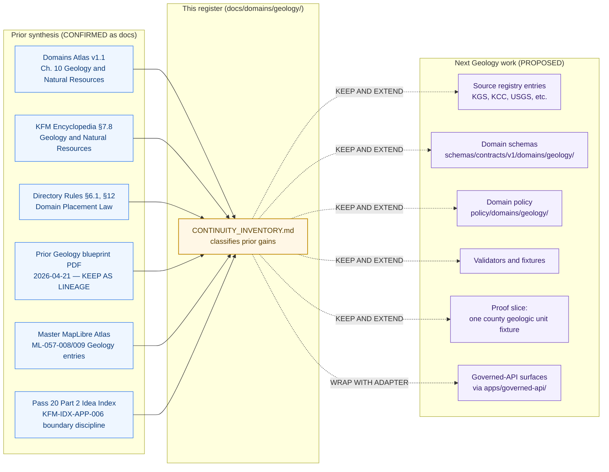

<!-- [KFM_META_BLOCK_V2]
doc_id: kfm://doc/docs.domains.geology.continuity_inventory
title: Geology — Continuity Inventory
type: standard
version: v1
status: draft
owners: <geology-domain-stewards>, <docs-steward>
created: 2026-05-16
updated: 2026-05-16
policy_label: public
related:
  - docs/domains/geology/README.md
  - docs/domains/README.md
  - docs/doctrine/lifecycle-law.md
  - docs/doctrine/trust-membrane.md
  - docs/registers/CANONICAL_LINEAGE_EXPLORATORY.md
  - docs/registers/VERIFICATION_BACKLOG.md
  - docs/registers/DRIFT_REGISTER.md
  - docs/adr/README.md
  - control_plane/object_family_register.yaml
  - control_plane/source_authority_register.yaml
tags: [kfm, domain, geology, continuity, lineage, register]
notes:
  - Continuity inventory pattern follows KFM_Whole_UI_Governed_AI_Expansion_Report.pdf §6.
  - Prior Geology architecture PDF treated as planning lineage only; not repo state.
[/KFM_META_BLOCK_V2] -->

# Geology — Continuity Inventory

> A register of prior gains, doctrine, and design pressure carried forward into the Geology / Natural Resources domain lane — classifying what is **kept and extended**, **kept as lineage**, **wrapped with an adapter**, or **deferred** as the lane advances toward a governed, evidence-first proof slice.

<!-- TODO: replace placeholder badges above with repo-verified CI / version / build targets once owning workflows are confirmed. -->

| Status | Owners | Last reviewed |
|---|---|---|
| `draft` (PROPOSED) | `<geology-domain-stewards>` · `<docs-steward>` | 2026-05-16 |

---

## Contents

- [1. Purpose and audience](#1-purpose-and-audience)
- [2. Authority and continuity posture](#2-authority-and-continuity-posture)
- [3. Continuity flow diagram](#3-continuity-flow-diagram)
- [4. Prior-gain register (master table)](#4-prior-gain-register-master-table)
- [5. Source families carried forward](#5-source-families-carried-forward)
- [6. Object families carried forward](#6-object-families-carried-forward)
- [7. Cross-lane relations carried forward](#7-cross-lane-relations-carried-forward)
- [8. Pipeline and gates carried forward](#8-pipeline-and-gates-carried-forward)
- [9. Sensitivity, rights, and publication posture carried forward](#9-sensitivity-rights-and-publication-posture-carried-forward)
- [10. Validators, tests, and fixtures carried forward](#10-validators-tests-and-fixtures-carried-forward)
- [11. Map and viewing products carried forward](#11-map-and-viewing-products-carried-forward)
- [12. Governed AI behavior carried forward](#12-governed-ai-behavior-carried-forward)
- [13. Open continuity items and verification backlog](#13-open-continuity-items-and-verification-backlog)
- [14. How to use this register](#14-how-to-use-this-register)
- [15. Related docs](#15-related-docs)

---

## 1. Purpose and audience

This document is the **Geology / Natural Resources** lane's continuity inventory: a register of prior synthesis, doctrine, and design pressure that the lane is expected to preserve — not discard, not silently rewrite — as new Geology work (proof slice, schema wave, registry entries, validators, policies) lands in the repo.

It exists for three audiences:

- **Geology stewards** who need a single place to see what is doctrine versus what is open.
- **Repo reviewers** who need a citation handle when judging whether a Geology PR honors or breaks continuity.
- **Documentation and registry maintainers** who need to keep `docs/registers/CANONICAL_LINEAGE_EXPLORATORY.md` and `control_plane/object_family_register.yaml` aligned with the lane's actual carried-forward objects.

> [!IMPORTANT]
> This register **explains and indexes**; it does **not decide**. Per Directory Rules §6.1, `docs/` explains, `control_plane/` indexes, `contracts/` defines meaning, `schemas/` defines shape, `policy/` decides admissibility. A continuity inventory entry alone is never sufficient evidence of repo implementation. Cite an EvidenceBundle, a passing test, a release manifest, or an accepted ADR for that.

[⬆ Back to top](#contents)

---

## 2. Authority and continuity posture

### 2.1 Authority order applied to this register

This document operates under KFM's standard authority ladder. Lower layers may clarify higher layers but never silently override them.

| # | Layer | Use here |
|---|---|---|
| 1 | KFM operating law, lifecycle law, trust membrane, authority ladder | Frames every classification below. |
| 2 | Accepted ADRs that amend Directory Rules | None known specifically for Geology; carried as `none-on-record`. |
| 3 | Directory Rules (`docs/doctrine/directory-rules.md`) | Governs the path `docs/domains/geology/CONTINUITY_INVENTORY.md` itself (§6.1, §12). |
| 4 | Per-root `README.md` (incl. `docs/domains/geology/README.md`) | Refines but cannot contradict. |
| 5 | Domain dossiers and prior architecture reports | Lineage / proposed only — explicitly never repo state. |
| 6 | Current mounted repo state | When in conflict with the above, raise as a `DRIFT_REGISTER` entry, not new authority. |

### 2.2 Continuity classifications used

Adapted directly from the continuity inventory pattern established in `KFM_Whole_UI_Governed_AI_Expansion_Report.pdf` §6.

| Classification | Meaning | Posture |
|---|---|---|
| **KEEP AND EXTEND** | Doctrine or pattern already strong; extend with concrete artifacts. | Carry forward into schemas, fixtures, tests, validators. |
| **KEEP AS LINEAGE** | Prior synthesis valid as design pressure, **not** repo state. | Cite as planning lineage; do not treat as implemented. |
| **WRAP WITH ADAPTER** | External or pre-KFM artifact that should sit behind a governed interface. | Define adapter/port boundary before normal callers touch it. |
| **DEFER** | Sound in concept but premature for the next slice. | Park with an open question and a re-evaluation trigger. |
| **PROPOSED CORRECTION** | Lower-layer evidence indicates a higher layer needs amendment. | Requires an ADR before it takes effect (§2.4 of Directory Rules). |

### 2.3 Non-collapse rule

> [!WARNING]
> Nothing in this register lets summaries, tables, prior PDFs, or this document itself substitute for **evidence, policy, review state, source authority, or release state**. EvidenceBundles and the governing doctrine remain authoritative. This non-collapse rule mirrors `KFM_Domains_Culmination_Atlas_v1_1.pdf` v1.1 front-matter doctrine and is reapplied to v1.1 itself: supersession is by extension, not by overwrite.

[⬆ Back to top](#contents)

---

## 3. Continuity flow diagram

How prior synthesis flows into this register and into the next Geology work. The right-hand column is **PROPOSED** and depends on repo evidence not visible in this session.

> [!NOTE]
> The right-hand cluster names **proposed** next work. Exact paths and the existence of the corresponding files are PROPOSED until verified against the mounted repo. Adjust via ADR or migration note if the repo proves a different convention (Directory Rules §2.5).

[⬆ Back to top](#contents)

---

## 4. Prior-gain register (master table)

This is the central inventory. Each row is a **named prior gain** for the Geology lane, classified per §2.2, with the source evidence basis and the preserved next behavior.

| Prior gain | Classification | Evidence basis | Preserved next behavior |
|---|---|---|---|
| Geology / Natural Resources lane scope and explicit non-ownership | KEEP AND EXTEND | Atlas v1.1 Ch. 10 §B; Encyclopedia §7.8 A | Lane owns bedrock, surficial, lithology, stratigraphy, structures, boreholes, well logs, cores, geophysics, geochemistry, mineral/resource distinctions, extraction/reclamation context. Does **not** own hydrology measurements, soils, hazards risk, or ownership/lease/permit/title claims. |
| Ubiquitous language for Geology objects | KEEP AND EXTEND | Atlas v1.1 Ch. 10 §C | Preserve KFM-specific casing and compound terms (GeologicUnit, StratigraphicInterval, ResourceEstimate, etc.) verbatim when authoring schemas, fixtures, and docs. |
| Pipeline shape `RAW → WORK/QUARANTINE → PROCESSED → CATALOG/TRIPLET → PUBLISHED` | KEEP AND EXTEND | Directory Rules §3 invariants; Atlas v1.1 Ch. 10 §H | Lane-level pipelines must traverse every phase; **no phase skipping**, **no connector-publishes**, **no watcher-publishes**. |
| Cite-or-abstain truth posture for geology claims | KEEP AND EXTEND | KFM operating law; Atlas v1.1 Ch. 10 §L | Public answers ANSWER / ABSTAIN / DENY / ERROR; AI never the root truth source. |
| Public-safe geometry posture for boreholes / wells / samples | KEEP AND EXTEND | Atlas v1.1 Ch. 10 §I | Exact borehole, sample, sensitive-resource, well-log, and private-well locations default to **restricted or generalized public geometry**. |
| Resource-class anti-collapse (occurrence ≠ deposit ≠ estimate ≠ permit ≠ production ≠ reserve) | KEEP AND EXTEND | Atlas v1.1 Ch. 10 §I; v1.1 Ch. 24.1 Source-Role Anti-Collapse Register | Distinct schemas, distinct fields, distinct validators. Never silently collapsed into a single "deposit" object. |
| Geology vs. legal/regulatory administration boundary | KEEP AND EXTEND | Pass 20 Part 2 KFM-IDX-APP-006 (CONFIRMED); Atlas v1.1 Ch. 10 §F | Lease, parcel, operator, permit, and production records do **not** prove deposits or estimates; cross-lane relations preserve ownership and source role. |
| Hydrology link via hydrostratigraphy, not measurements | KEEP AND EXTEND | Atlas v1.1 Ch. 10 §F; Encyclopedia §7.8 A | Hydrostratigraphy is the legitimate join; measurements remain owned by Hydrology. |
| Hazards link via faults / landslide / subsidence context | KEEP AND EXTEND | Atlas v1.1 Ch. 10 §F | Geology supplies context; Hazards owns risk. No claim of hazard severity from Geology. |
| Soil link via parent material / surficial context | KEEP AND EXTEND | Atlas v1.1 Ch. 10 §F | Surficial unit and lithology context inform Soil; never reverse-authority. |
| Map and viewing products inventory (bedrock unit, surficial unit, structure, cross-section, public-generalized borehole, mineral occurrence summary, extraction/reclamation context) | KEEP AND EXTEND | Atlas v1.1 Ch. 10 §G; Encyclopedia §7.8 E | Carry the viewing-mode list into `LayerManifest` and `LayerDescriptor` entries with legends, scale badges, uncertainty notes. |
| Geology layer rights-and-attribution gate (KGS rasterized geology, COG/tile publication only after license review) | KEEP AND EXTEND | Master MapLibre Atlas ML-057-008 (NEW) | Fail release when license, source series, or attribution is missing for any geology map output. |
| Geology layer legend / scale / uncertainty surfacing | KEEP AND EXTEND | Master MapLibre Atlas ML-057-009 (NEW) | `LayerManifest` must include legend, scale, and uncertainty display fields; test layer toggle surfaces caveats. |
| Geology thin-slice proof scope: one county geologic unit fixture with borehole/cross-section evidence | KEEP AND EXTEND | Encyclopedia §7.8 N | First proof slice = one county geologic unit + borehole/cross-section evidence + public-safe generalized resource context + EvidenceBundle-backed unit inspector. |
| Default-deny on public promotion when rights, source role, evidence, sensitivity, or release state is unresolved | KEEP AND EXTEND | Atlas v1.1 Ch. 10 §I; Directory Rules §13 | Promotion is a governed state transition, not a file move; lane policy must encode this. |
| Prior Geology architecture report (`KFM_Geology_Natural_Resources_Architecture_PDF_Only_Report_2026-04-21.pdf`) | KEEP AS LINEAGE | Pass 20 Part 2 source ledger; Master MapLibre Atlas SRC-033 | Cite as planning lineage and proof-slice candidate pressure. **Never** treat as repo implementation. Adapt path patterns through ADR/migration. |
| 3D / subsurface viewing surface for Geology | DEFER (KEEP AND EXTEND on 2D first) | Atlas v1.1 Ch. 24.4.8 Planetary/3D edge; Encyclopedia §7.8 E | Add Cesium / 3D admission only after 2D evidence continuity is preserved and a representation receipt is defined. |
| Governed-API surfaces for Geology (feature/detail resolver, layer manifest resolver, Evidence Drawer payload, Focus Mode) | WRAP WITH ADAPTER | Atlas v1.1 Ch. 10 §J | Public surfaces sit behind `apps/governed-api/`. Standard clients **must not** read canonical/raw stores or call models directly. |
| Geology API DTO names and exact routes | PROPOSED CORRECTION pending | Atlas v1.1 Ch. 10 §J (route TBD); Directory Rules §6.1 (canonical home `apps/governed-api/`) | Decide via ADR. Until then mark DTOs and routes PROPOSED in any draft. |

> [!TIP]
> When adding a new prior gain row, cite at least one **doctrine source** (Atlas, Encyclopedia, Directory Rules, ADR) and explicitly state the *preserved next behavior* in implementation-bearing language, not in pure description.

[⬆ Back to top](#contents)

---

## 5. Source families carried forward

These are the recognized source families for the Geology lane. Each is carried forward with its source-role posture intact; current terms, rights, attribution, and cadence remain **NEEDS VERIFICATION** until a `data/registry/sources/geology/` entry, a `policy/sensitivity/` rule, or a `policy/rights/` rule confirms them.

| Source family | Source role(s) | Rights / sensitivity posture | Freshness | Status |
|---|---|---|---|---|
| Kansas Geological Survey (KGS) data and maps | authority / observation / context / model | rights and current terms **NEEDS VERIFICATION**; sensitive joins **fail closed** | source-vintage or cadence specific | CONFIRMED doctrine / PROPOSED registry |
| KGS surficial and bedrock geology maps | authority / observation / context | as above | as above | CONFIRMED doctrine / PROPOSED registry |
| USGS NGMDB and GeMS | authority / observation / context / model | as above | as above | CONFIRMED doctrine / PROPOSED registry |
| KGS oil and gas wells / production | authority / observation / context | as above | as above | CONFIRMED doctrine / PROPOSED registry |
| KCC oil and gas regulatory data | authority / regulatory / context | as above | as above | CONFIRMED doctrine / PROPOSED registry |
| KGS / KDHE WWC5 and water-well program | authority / observation / context | as above | as above | CONFIRMED doctrine / PROPOSED registry |
| KGS LAS digital well logs and well tops | authority / observation | as above; well-log rights **NEEDS VERIFICATION** | as above | CONFIRMED doctrine / PROPOSED registry |
| USGS MRDS | authority / observation / context | as above | as above | CONFIRMED doctrine / PROPOSED registry |
| USGS 3DEP terrain | context / model | rights generally permissive — **verify per release** | source-vintage | CONFIRMED doctrine / PROPOSED registry |

> [!CAUTION]
> Adding a new source family for Geology requires a `SourceDescriptor` entry, a sensitivity classification, a rights record, and a documented cadence — **before** the source can feed any RAW intake. Connectors emit only to `data/raw/geology/<source_id>/<run_id>/` or `data/quarantine/...`; they do **not** publish.

Reference: source-role distinctions to preserve (Atlas v1.1 §24.1)

The Geology lane must preserve KFM's source-role anti-collapse posture: **authority**, **observation**, **context**, **model**, and **regulatory** are not interchangeable. A regulatory permit does not constitute a resource deposit observation; an observed core sample does not constitute an authority-level stratigraphic boundary; a model output is never a measurement.

Validation must include source-role checks at admission and again at catalog closure.

[⬆ Back to top](#contents)

---

## 6. Object families carried forward

The Geology object families below are CONFIRMED as **doctrine** by Atlas v1.1 Ch. 10 §B and §E and Encyclopedia §7.8 C. Their **schema realization** in `schemas/contracts/v1/domains/geology/` is PROPOSED and pending ADR-confirmed schema-home and per-object schemas.

| Object family | Purpose (preserved) | Identity rule (PROPOSED) | Temporal posture (CONFIRMED) |
|---|---|---|---|
| Geologic Unit | Bedrock unit evidence or released derivative within Geology. | source id + object role + temporal scope + normalized digest | source, observed, valid, retrieval, release, correction times stay distinct where material |
| Surficial Unit | Surficial geology unit evidence or released derivative. | as above | as above |
| Lithology | Lithology evidence or released derivative. | as above | as above |
| Stratigraphic Interval | Stratigraphic interval evidence or released derivative. | as above | as above |
| Geologic Age | Geologic age framing within Geology. | as above | as above |
| Structure Feature | Fault / fold / lineament evidence or released derivative. | as above | as above |
| Geology Boundary Version | Versioned geology boundary set. | as above | as above |
| Borehole Reference | Borehole / well location and metadata reference; public geometry generalized by default. | as above | as above |
| Well Log Reference | Well log artifact reference; rights and access gated. | as above | as above |
| Core Sample Reference | Physical or digital core sample reference. | as above | as above |
| Geophysical Observation | Seismic, gravity, magnetic, etc. observation reference. | as above | as above |
| Geochemistry Sample Reference | Sample analytic reference. | as above | as above |
| Mineral Occurrence | Mineral occurrence record; distinct from deposit / estimate. | as above | as above |
| Resource Deposit | Resource deposit assertion; distinct from estimate / permit / production / reserve. | as above | as above |
| Resource Estimate | Estimate of recoverable resource; never collapsed into occurrence or deposit. | as above | as above |
| Extraction Site | Extraction site context; distinct from permit and production claims. | as above | as above |
| Reclamation Record | Reclamation context record. | as above | as above |
| Cross Section | Constructed cross-section view object. | as above | as above |
| Hydrostratigraphic Unit | Geology-side hydrostratigraphy framing (joins Hydrology on context). | as above | as above |

> [!NOTE]
> Atlas v1.1 lists these as "CONFIRMED term / PROPOSED field realization." This register preserves that exact posture. **Do not** invent additional Geology object families without an ADR per Directory Rules §2.4(5).

[⬆ Back to top](#contents)

---

## 7. Cross-lane relations carried forward

Cross-lane relations preserve ownership, source role, sensitivity, and EvidenceBundle support. Geology is on the **owning** side or the **consuming** side as marked.

| Geology side | Related lane | Relation | Constraint carried forward |
|---|---|---|---|
| owns | Soil | parent material and surficial context | Soil consumes; Geology never replaces Soil measurements. |
| consumes/joins | Hydrology | hydrostratigraphy and aquifer context | Hydrology owns measurements; Geology does **not** publish hydrology gauges or flow values. |
| supplies context | Hazards | fault / landslide / subsidence | Hazards owns risk; Geology never claims hazard severity. |
| supplies context | Agriculture | resource and soil-parent material context (advisory) | Never regulatory or aggregate. |
| boundary | People / Land | lease, parcel, operator relations | These **cannot** prove deposits or estimates. |
| boundary | Planetary / 3D | subsurface scene context | Admission only via generalized geometry with representation receipt. |

[⬆ Back to top](#contents)

---

## 8. Pipeline and gates carried forward

Geology follows the universal lifecycle: `RAW → WORK / QUARANTINE → PROCESSED → CATALOG / TRIPLET → PUBLISHED`. Each phase has the doctrine-level gate carried forward; per-phase pipelines and policy bundles are PROPOSED.

| Stage | Handling (preserved) | Gate (preserved) | Status |
|---|---|---|---|
| RAW | Capture immutable source payload or reference with source role, rights, sensitivity, citation, time, and hash. | `SourceDescriptor` exists. | PROPOSED implementation |
| WORK / QUARANTINE | Normalize schema, geometry, time, identity, evidence, rights, and policy; hold failures. | Validation and policy gate pass, or quarantine reason is recorded. | PROPOSED implementation |
| PROCESSED | Emit validated normalized objects, receipts, and public-safe candidates. | `EvidenceRef`, `ValidationReport`, and digest closure exist. | PROPOSED implementation |
| CATALOG / TRIPLET | Emit catalog records, `EvidenceBundle`s, graph/triplet projections, and release candidates. | Catalog/proof closure passes. | PROPOSED implementation |
| PUBLISHED | Serve released public-safe artifacts through governed APIs and manifests. | `ReleaseManifest`, correction path, rollback target, and review/policy state exist. | PROPOSED implementation |

> [!IMPORTANT]
> **Watcher-as-non-publisher** is preserved unconditionally. Workers and watchers in the Geology lane emit receipts and candidate decisions; they **never** write to `data/catalog/` or `data/published/`. Promotion is reserved for the governed promotion pipeline.

[⬆ Back to top](#contents)

---

## 9. Sensitivity, rights, and publication posture carried forward

| Concern | Posture (CONFIRMED doctrine) | Lane application (PROPOSED implementation) |
|---|---|---|
| Exact borehole / sample / well-log / private-well geometry | Defaults to **restricted or generalized** public geometry. | `policy/domains/geology/` and `policy/sensitivity/` encode the redaction/generalization rules; tests prove they fail closed. |
| Resource-class distinctness | Occurrence, deposit, estimate, permit, production, and reserve claims must remain distinct. | Schemas and validators forbid collapse; fixtures cover good and bad cases. |
| Unclear rights or unresolved source role | **Blocks** public promotion. | Promotion-gate policy denies until resolved; quarantine reason recorded. |
| Missing evidence, unresolved sensitivity, absent release state | **Blocks** public promotion. | Catalog closure check is mandatory; release manifest cannot be issued otherwise. |
| Sensitive joins (e.g., precise borehole × parcel × operator) | **Fail closed** by default. | Cross-lane join policy denies until reviewed; review record retained. |
| License review for KGS / USGS layers prior to COG/tile publication | Required. | Release fails when license, source series, or attribution is missing (per Master MapLibre Atlas ML-057-008). |

[⬆ Back to top](#contents)

---

## 10. Validators, tests, and fixtures carried forward

These validators and test classes are PROPOSED in doctrine and must be realized in `tools/validators/domains/geology/`, `tests/domains/geology/`, and `fixtures/domains/geology/` once the schema home is confirmed via ADR (Directory Rules §2.4(3)).

- **Source-role validators** — assert every Geology admission carries an admissible source role and that role transitions through the pipeline are legal.
- **Resource-class anti-collapse tests** — assert that schemas do not allow `occurrence`, `deposit`, `estimate`, `permit`, `production`, and `reserve` to merge.
- **Public-safe geometry tests** — assert that public-facing artifacts contain only generalized geometry where the sensitivity rule requires it, with a transform receipt.
- **Borehole / well-log rights tests** — assert that exact location and proprietary content are denied to public consumers absent a rights record.
- **Catalog closure tests** — assert that no Geology release candidate advances without an `EvidenceBundle`, `ValidationReport`, and digest closure.
- **AI evidence-before-model tests** — assert Focus Mode answers in the Geology lane resolve `EvidenceRef` to `EvidenceBundle` **before** any model invocation and abstain/deny otherwise.

> [!TIP]
> First-PR thin slice from Encyclopedia §7.8 N: **one county geologic unit fixture** with borehole and cross-section evidence, public-safe generalized resource context, and an EvidenceBundle-backed unit inspector. This is the smallest sound proof of the lane.

[⬆ Back to top](#contents)

---

## 11. Map and viewing products carried forward

Domain viewing products (PROPOSED) carried forward from Atlas v1.1 Ch. 10 §G:

- Bedrock unit map
- Surficial unit map
- Structure / fault view
- Stratigraphy / correlation view
- Borehole **public-generalized** view
- Mineral occurrence / deposit summary
- Extraction / reclamation context view
- Geology cross-section view (per Encyclopedia §7.8 E)
- Uncertainty mode

Cross-cutting viewing surfaces preserved from MapLibre / UI doctrine: Evidence Drawer, time-aware state, trust badges, sensitivity-redacted view, correction/stale-state view, and governed Focus Mode.

> [!NOTE]
> Geology `LayerManifest` entries should expose **legend, scale, and uncertainty** display fields (Master MapLibre Atlas ML-057-009). A `LayerManifest` without these fields fails the lane's layer-publication validator.

[⬆ Back to top](#contents)

---

## 12. Governed AI behavior carried forward

| Behavior | Posture (CONFIRMED doctrine) | Lane application |
|---|---|---|
| Summarize released Geology `EvidenceBundle`s | Permitted | Focus Mode templates draw only from released bundles; cite or abstain. |
| Compare evidence across released Geology objects | Permitted | Citation set required; `AIReceipt` emitted per answer. |
| Explain limitations of geology data (e.g., scale, vintage, source-role) | Permitted | Encouraged; reduces false precision. |
| Draft steward-review notes | Permitted | Drafts go to review queue; never auto-promoted. |
| Answer when evidence is insufficient | **ABSTAIN** | Hard-required by trust-membrane doctrine. |
| Answer where policy, rights, sensitivity, or release state blocks the request | **DENY** | Hard-required; reason code recorded. |
| Treat AI output as root truth | **Never** | EvidenceBundle outranks generated language. |

[⬆ Back to top](#contents)

---

## 13. Open continuity items and verification backlog

Items to resolve before the next Geology slice can claim to fully satisfy this register. Each row also belongs in `docs/registers/VERIFICATION_BACKLOG.md`.

| # | Item to verify | Evidence that would settle it | Status |
|---|---|---|---|
| GEO-CI-01 | Existence and path of `docs/domains/geology/README.md` and conformance with Directory Rules §15 README contract. | Mounted-repo file listing. | NEEDS VERIFICATION |
| GEO-CI-02 | Existence of any Geology source descriptors under `data/registry/sources/geology/`. | Mounted-repo file listing; descriptor schema validation. | NEEDS VERIFICATION |
| GEO-CI-03 | Schema home for Geology objects: confirm `schemas/contracts/v1/domains/geology/` per ADR-0001. | ADR-0001 acceptance status and a schema file under that path. | NEEDS VERIFICATION |
| GEO-CI-04 | KGS data and KGS LAS well-log current rights, terms, attribution, and cadence. | Rights record entries; cadence configured in source descriptor. | NEEDS VERIFICATION |
| GEO-CI-05 | KCC oil and gas regulatory data redistribution terms. | Rights record entry; sensitivity classification. | NEEDS VERIFICATION |
| GEO-CI-06 | USGS NGMDB / GeMS conformance level for Geology layers. | Schema fixture pass; license review record. | NEEDS VERIFICATION |
| GEO-CI-07 | Public-safe geometry generalization policy for borehole / well / sample. | Policy file under `policy/domains/geology/`; tests that fail closed without it. | NEEDS VERIFICATION |
| GEO-CI-08 | Resource-class anti-collapse validator implementation. | Validator under `tools/validators/domains/geology/`; passing tests. | NEEDS VERIFICATION |
| GEO-CI-09 | Geology API endpoints / DTO names — currently route TBD per Atlas Ch. 10 §J. | Accepted ADR naming routes; OpenAPI or typed-client surface. | NEEDS VERIFICATION |
| GEO-CI-10 | Evidence Drawer / Focus Mode integration for Geology. | Fixture-driven component tests; `EvidenceDrawerPayload` for Geology. | NEEDS VERIFICATION |
| GEO-CI-11 | Whether `KFM_Geology_Natural_Resources_Architecture_PDF_Only_Report_2026-04-21.pdf` paths still match repo conventions. | Mounted-repo diff vs. PDF tree. | UNKNOWN |
| GEO-CI-12 | Naming of this file: `CONTINUITY_INVENTORY.md` vs. alternative (e.g., `CONTINUITY-INVENTORY.md`, `continuity-inventory.md`). | Convention in adjacent `docs/domains/*/` files. | NEEDS VERIFICATION |
| GEO-CI-13 | Whether `docs/registers/CANONICAL_LINEAGE_EXPLORATORY.md` already contains the prior Geology PDF; if not, add a lineage entry citing this register. | Register inspection. | NEEDS VERIFICATION |

[⬆ Back to top](#contents)

---

## 14. How to use this register

> [!TIP]
> Treat this document like a **changelog of doctrine commitments**, not a project plan. It tells the lane what it must not silently forget.

**When opening a Geology PR**

1. Identify which prior-gain rows your change touches.
2. If you are **extending** a `KEEP AND EXTEND` row, cite the row in the PR description and link the new artifact (schema, validator, policy, fixture, route).
3. If you are **moving away from** a row (changing the classification, removing the row, or reclassifying as `PROPOSED CORRECTION`), open an ADR per Directory Rules §2.4 — do **not** silently overwrite this file.
4. Reflect any verified item by promoting it out of §13 and updating the body of the register.

**When adding a new prior gain row**

1. Cite at least one doctrine source (Atlas, Encyclopedia, Directory Rules, an accepted ADR, or a cumulative Master atlas with explicit page anchors).
2. State the **preserved next behavior** in implementation-bearing language.
3. Add a verification-backlog entry in §13 if implementation is not yet visible.
4. Update `docs/registers/CANONICAL_LINEAGE_EXPLORATORY.md` to mention this register.

**When a row conflicts with the mounted repo**

1. Do not silently conform to the repo and call it canon.
2. Open a `DRIFT_REGISTER` entry and link this row.
3. Propose a resolution: ADR amending doctrine, or migration plan bringing the repo into conformance.
4. Mark the affected row `PROPOSED CORRECTION` until resolved.

[⬆ Back to top](#contents)

---

## 15. Related docs

- [`docs/domains/geology/README.md`](./README.md) — Geology domain landing page <!-- TODO: confirm presence -->
- [`docs/domains/README.md`](../README.md) — Domains overview
- [`docs/doctrine/lifecycle-law.md`](../../doctrine/lifecycle-law.md) — RAW → PUBLISHED invariant
- [`docs/doctrine/trust-membrane.md`](../../doctrine/trust-membrane.md) — Public path discipline
- [`docs/doctrine/directory-rules.md`](../../doctrine/directory-rules.md) — Path placement law
- [`docs/registers/CANONICAL_LINEAGE_EXPLORATORY.md`](../../registers/CANONICAL_LINEAGE_EXPLORATORY.md) — Canon vs. lineage classification
- [`docs/registers/VERIFICATION_BACKLOG.md`](../../registers/VERIFICATION_BACKLOG.md) — Cross-cutting verification items
- [`docs/registers/DRIFT_REGISTER.md`](../../registers/DRIFT_REGISTER.md) — Repo / doctrine conflicts
- [`docs/adr/README.md`](../../adr/README.md) — Accepted, proposed, and superseded ADRs
- [`control_plane/object_family_register.yaml`](../../../control_plane/object_family_register.yaml) — Machine-readable object family map
- [`control_plane/source_authority_register.yaml`](../../../control_plane/source_authority_register.yaml) — Machine-readable source authority register

<!-- TODO: confirm each relative link target exists once the repo is mounted. Targets shown reflect Directory Rules §6.1 canonical homes. -->

---

**Last updated:** 2026-05-16 · **Doc version:** v1 (draft) · **Lane:** Geology / Natural Resources · **Status:** PROPOSED implementation; CONFIRMED doctrine basis

[⬆ Back to top](#contents)
