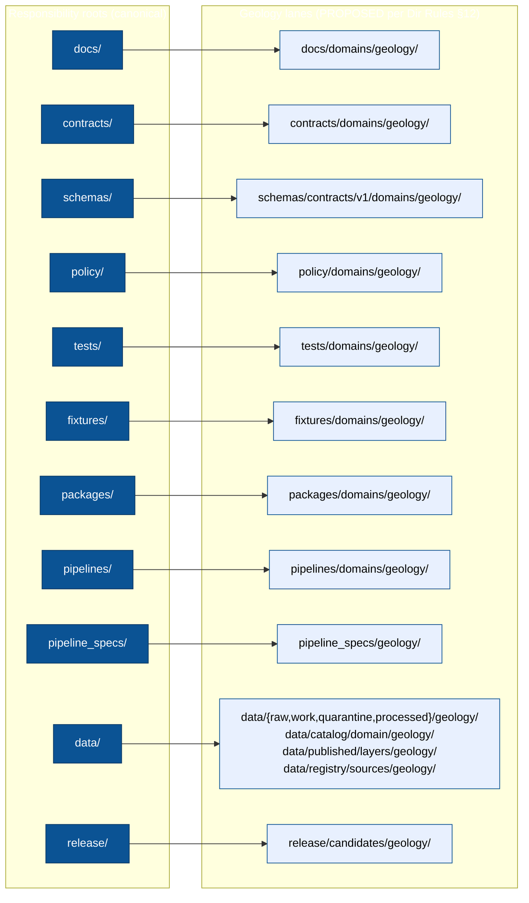

<!-- [KFM_META_BLOCK_V2]
doc_id: kfm://doc/geology-canonical-paths
title: Geology — Canonical Paths
type: standard
version: v1.2
status: draft
owners: TODO — Geology domain steward; Directory Rules owner
created: 2026-05-16
updated: 2026-06-03
policy_label: public
related:
  - directory-rules.md
  - docs/domains/geology/README.md
  - docs/adr/ADR-0001-schema-home.md
  - docs/registers/DRIFT_REGISTER.md
  - docs/registers/CANONICAL_LINEAGE_EXPLORATORY.md
  - ai-build-operating-contract.md
tags: [kfm, geology, directory-rules, canonical-paths, domain-placement-law]
notes:
  - Doctrine-adjacent; CONTRACT_VERSION pinned to 3.0.0 per ai-build-operating-contract.md.
  - Applies Directory Rules §12 (Domain Placement Law) to the Geology lane.
  - Surfaces a NEEDS VERIFICATION drift between Dir Rules §12 path form and Atlas v1.1 §24.13 crosswalk form (Atlas uses the short geology/ form — see §11).
  - Schema-home rule is Directory Rules §6.4 + ADR-0001 (the §13.1 entry is the matching anti-pattern).
  - Lifecycle gates verified against Atlas v1.1 §24.6 "Master Pipeline Gate Reference" (subsection 24.6.1).
  - Repo not mounted in this session; file-presence claims are PROPOSED / NEEDS VERIFICATION.
  - Placement-law location (directory-rules.md root vs docs/doctrine/) is itself OPEN/CONFLICTED — see §13.
[/KFM_META_BLOCK_V2] -->

# Geology — Canonical Paths

> Authoritative map of where Geology lives across KFM responsibility roots, derived from Directory Rules §12 (Domain Placement Law) and applied to the Geology / Natural Resources domain.


| Field | Value |
|---|---|
| **Status** | `draft` |
| **Owners** | TODO — Geology domain steward; Directory Rules owner |
| **Last updated** | 2026-06-03 |
| **Authority basis** | `directory-rules.md` §12 (lane pattern) · §6.4 + ADR-0001 (schema home) |
| **Domain dossier** | `[DOM-GEOL]` (Geology / Natural Resources) |
| **Contract** | Pinned `CONTRACT_VERSION = "3.0.0"` per `ai-build-operating-contract.md` |

---

## Contents

1. [Purpose & scope](#1-purpose--scope)
2. [Authority & truth posture](#2-authority--truth-posture)
3. [The Lane Pattern — visual summary](#3-the-lane-pattern--visual-summary)
4. [Responsibility-root canonical map](#4-responsibility-root-canonical-map)
5. [Geology lane tree (PROPOSED)](#5-geology-lane-tree-proposed)
6. [Data lifecycle paths](#6-data-lifecycle-paths)
7. [Sensitivity, rights & publication paths](#7-sensitivity-rights--publication-paths)
8. [Forbidden placements](#8-forbidden-placements)
9. [Cross-domain & shared placements](#9-cross-domain--shared-placements)
10. [Compatibility roots & legacy paths](#10-compatibility-roots--legacy-paths)
11. [Open naming drift — `contracts/geology/` vs `contracts/domains/geology/`](#11-open-naming-drift)
12. [Placement protocol checklist](#12-placement-protocol-checklist)
13. [Open questions & verification backlog](#13-open-questions--verification-backlog)
14. [Changelog](#14-changelog)
15. [Definition of done](#15-definition-of-done)
16. [Related docs](#16-related-docs)

---

## 1. Purpose & scope

This document is the **canonical path map for the Geology / Natural Resources domain** within KFM. It applies the Lane Pattern from Directory Rules §12 (Domain Placement Law) to Geology specifically, so that every Geology-bearing file has exactly one defensible home.

It answers three questions:

1. *Where does a Geology file go?* — by primary responsibility (docs, contracts, schemas, policy, data, …), not by topic.
2. *Where does a Geology file **never** go?* — root-level `geology/`, mixed-authority folders, compatibility-root permanent homes.
3. *How does a Geology artifact move through the lifecycle?* — RAW → WORK/QUARANTINE → PROCESSED → CATALOG/TRIPLET → PUBLISHED, as a governed transition rather than a file move.

It is **not** a substitute for:

- Directory Rules itself (`directory-rules.md`) — the governing doctrine.
- ADR-0001 — the schema-home decision.
- The Geology domain README (`docs/domains/geology/README.md`) — domain identity, scope, and ubiquitous language.
- The Geology dossier `[DOM-GEOL]` — source families, object families, sensitivity posture.

[Back to top](#contents)

---

## 2. Authority & truth posture

> [!IMPORTANT]
> **CONFIRMED doctrine:** Domains MUST NOT become repo-root folders. Geology files live as **lanes inside responsibility roots**. A root-level `geology/` directory is a Directory Rules §3 violation regardless of how much Geology content it would hold. *(Source: Directory Rules §3 "The Deeper Rule"; §12 Domain Placement Law.)*

| Layer | Source | Status |
|---|---|---|
| Lane Pattern itself | `directory-rules.md` §12 (and §4 Step 3 tree) | **CONFIRMED doctrine** |
| Schema-home (`schemas/contracts/v1/...`) | `directory-rules.md` §6.4 + ADR-0001 (the §13.1 entry is the matching anti-pattern) | **CONFIRMED doctrine** |
| Lifecycle invariant (RAW → PUBLISHED) | `directory-rules.md` §4 Step 2 (phase list); Atlas v1.1 §24.6 gate reference; Lifecycle Law; ENCY Operating Law | **CONFIRMED doctrine** |
| Geology object families & source families | `[DOM-GEOL]`; Atlas v1.1 ch. 10 | **CONFIRMED doctrine** |
| Geology sensitivity defaults | Atlas v1.1 §24.5 (tier scheme), §24.14 (object-family × domain matrix; GeologicUnit/Lithology = T0) | **CONFIRMED doctrine** |
| Specific geology paths existing in the mounted repo | Repo not mounted in this session | **UNKNOWN / NEEDS VERIFICATION** |
| Atlas v1.1 §24.13 path form (`contracts/geology/`, no `domains/` segment) | Atlas v1.1 §24.13 crosswalk | **PROPOSED**, conflicts with Dir Rules §12 — see §11 |

> [!NOTE]
> Every path listed below is **PROPOSED application** of CONFIRMED doctrine to the Geology lane. File presence, ownership, and CI enforcement are **NEEDS VERIFICATION** until a mounted-repo inspection is recorded against this doc.

[Back to top](#contents)

---

## 3. The Lane Pattern — visual summary



The pattern keeps the repo root **stable and boring** while letting the Geology lane grow without fragmenting the lifecycle. *(Source: Dir Rules §12; §4 Step 3 lane tree.)*

[Back to top](#contents)

---

## 4. Responsibility-root canonical map

Each row records: the responsibility root, the Geology lane within it, what the lane owns, and the truth label for the realization in the mounted repo.

| Responsibility root | Canonical Geology lane (PROPOSED path) | Owns (CONFIRMED doctrine) | Realization status |
|---|---|---|---|
| `docs/` | `docs/domains/geology/` | Human-facing Geology doctrine, READMEs, this canonical-paths doc, runbooks pointers | NEEDS VERIFICATION |
| `contracts/` | `contracts/domains/geology/` | Semantic Markdown defining object **meaning** (GeologicUnit, Borehole, …); never the only place validation lives | NEEDS VERIFICATION |
| `schemas/` | `schemas/contracts/v1/domains/geology/` | Machine-checkable **shape** for Geology objects, per **ADR-0001** | NEEDS VERIFICATION |
| `policy/` | `policy/domains/geology/` | Allow / deny / restrict / abstain rules for Geology release, joins, and source-role enforcement | NEEDS VERIFICATION |
| `tests/` | `tests/domains/geology/` | Proof that Geology validators, gates, and policies are enforceable | NEEDS VERIFICATION |
| `fixtures/` | `fixtures/domains/geology/` | Sample Geology data: valid, invalid, sensitive, quarantine-candidate | NEEDS VERIFICATION |
| `packages/` | `packages/domains/geology/` | Shared, reusable Geology library (object types, helpers); only if reused by ≥2 deployables | NEEDS VERIFICATION |
| `pipelines/` | `pipelines/domains/geology/` | Executable Geology pipeline logic (ingest, normalize, validate, catalog, publish) | NEEDS VERIFICATION |
| `pipeline_specs/` | `pipeline_specs/geology/` | Declarative pipeline configuration (what should run) | NEEDS VERIFICATION |
| `data/` | (see §6 below) | Lifecycle data for Geology — RAW through PUBLISHED | NEEDS VERIFICATION |
| `release/` | `release/candidates/geology/` | Release-candidate dossiers for Geology promotions | NEEDS VERIFICATION |
| `connectors/` | `connectors/<source_id>/` (NO `geology/` lane) | Source-specific fetchers; **not** a domain folder — see §9 | CONFIRMED rule |

> [!TIP]
> When in doubt, **the responsibility root wins over the topic name.** A Geology validator's *responsibility* is validation, not geology; its home is `tools/validators/...` not a Geology-only folder. *(Dir Rules §3.)*

[Back to top](#contents)

---

## 5. Geology lane tree (PROPOSED)

The full PROPOSED Geology lane layout, expanded from Dir Rules §12 (§4 Step 3 tree) and the Geology object/source families in `[DOM-GEOL]` and Atlas v1.1 ch. 10. Every path below is **PROPOSED / NEEDS VERIFICATION** until inspected against a mounted repo.

```text
docs/
└── domains/
    └── geology/
        ├── README.md                       # Domain identity, scope, ubiquitous language
        ├── CANONICAL_PATHS.md              # This document
        ├── SOURCES.md                      # Source families and source-role notes (PROPOSED)
        ├── SENSITIVITY.md                  # Geology sensitivity register (PROPOSED)
        └── runbooks/                       # Runbook references; runbooks themselves live in docs/runbooks/

contracts/
└── domains/
    └── geology/
        ├── README.md
        ├── geologic-unit.md                # Object-family meaning
        ├── lithology.md
        ├── stratigraphic-interval.md
        ├── fault-structure.md
        ├── borehole.md
        ├── well-log.md
        ├── core-sample.md
        ├── geophysical-observation.md
        ├── geochemistry-sample.md
        ├── mineral-occurrence.md
        ├── resource-deposit.md
        ├── extraction-site.md
        ├── reclamation-record.md
        ├── cross-section.md
        └── hydrostratigraphic-unit.md

schemas/
└── contracts/
    └── v1/
        └── domains/
            └── geology/
                ├── geologic-unit.schema.json
                ├── lithology.schema.json
                ├── borehole.schema.json
                ├── well-log.schema.json
                ├── core-sample.schema.json
                ├── mineral-occurrence.schema.json
                ├── resource-deposit.schema.json
                ├── extraction-site.schema.json
                ├── reclamation-record.schema.json
                └── ...                     # one .schema.json per object family in contracts/

policy/
└── domains/
    └── geology/
        ├── README.md
        ├── source-role.rego                # Source-role anti-collapse (observed/regulatory/modeled/aggregate/...)
        ├── public-geometry.rego            # Generalization / fuzzing for borehole and well-log locations
        ├── resource-class-anti-collapse.rego  # Occurrence ≠ deposit ≠ estimate ≠ reserve ≠ production
        └── borehole-rights.rego            # Rights gating for proprietary log content

tests/
└── domains/
    └── geology/
        ├── source-role.spec.*
        ├── public-safe-geometry.spec.*
        ├── borehole-rights.spec.*
        ├── catalog-closure.spec.*
        ├── ai-evidence-before-model.spec.*
        └── ...                             # Mirrors the validator set named in [DOM-GEOL] §K

fixtures/
└── domains/
    └── geology/
        ├── valid/
        ├── invalid/
        ├── sensitive/
        └── quarantine_candidates/

packages/
└── domains/
    └── geology/
        ├── README.md
        ├── src/                            # Reusable Geology types/helpers; only if shared ≥2 deployables
        └── tests/

pipelines/
└── domains/
    └── geology/
        ├── ingest/
        ├── normalize/
        ├── validate/
        ├── catalog/
        └── publish/

pipeline_specs/
└── geology/
    ├── README.md
    └── <pipeline_id>.yaml                  # Declarative pipeline configuration

data/                                       # See §6 for full lifecycle paths
└── (raw|work|quarantine|processed|catalog|published|registry|rollback)/...
    └── geology/...

release/
└── candidates/
    └── geology/
        └── <release_id>/                   # Release-candidate dossier
```

[Back to top](#contents)

---

## 6. Data lifecycle paths

The lifecycle invariant `RAW → WORK/QUARANTINE → PROCESSED → CATALOG/TRIPLET → PUBLISHED` is **CONFIRMED doctrine** (Dir Rules §4 Step 2 phase list; Atlas v1.1 §24.6 Master Pipeline Gate Reference; Lifecycle Law; ENCY Operating Law). Promotion is a **governed state transition, not a file move** — a path-level move that bypasses validators, policy gates, EvidenceBundle creation, catalog closure, and release-decision recording is a Lifecycle Law violation regardless of which directory the bytes end up in.

> [!NOTE]
> **Pre-RAW is a CONFIRMED corpus stage** (the "Pre-RAW watcher event envelope", corpus card KFM-P21-PROG-0025). Per the structure guiding doc, pre-RAW objects (`EventEnvelope`, `EventRunReceipt`) land under `data/registry/sources/` and `data/receipts/ingest/` — **never** in a new `data/pre_raw/` sibling. Receipts, proofs, registry, and rollback are emitted *alongside* lifecycle directories; they do not replace them (Dir Rules §4 Step 2).

### 6.1 Geology data lifecycle paths (PROPOSED)

| Phase | Geology path template (PROPOSED) | Allowed contents | MUST NOT contain |
|---|---|---|---|
| RAW | `data/raw/geology/<source_id>/<run_id>/` | Immutable source-edge captures with retrieval metadata and checksums (KGS, USGS NGMDB/GeMS, KGS oil/gas wells, KCC, WWC5, LAS well logs, USGS MRDS, …) | Public clients, AI context, UI layers, normalized records |
| WORK | `data/work/geology/<run_id>/` | Normalized intermediates, candidate assertions | Public API/UI, release aliases |
| QUARANTINE | `data/quarantine/geology/<reason>/<run_id>/` | Failed validation, unresolved rights/sensitivity, schema drift, over-precise borehole geometry | Promotion candidates without remediation |
| PROCESSED | `data/processed/geology/<dataset_id>/<version>/` | Validated canonical Geology records (e.g., normalized GeologicUnit, Borehole projections) | Assumption of public/release status |
| CATALOG | `data/catalog/domain/geology/` *(also `data/catalog/{stac,dcat,prov}/...` for cross-cutting catalog forms)* | STAC/DCAT/PROV records, domain catalog entries, EvidenceBundle pointers | Uncited claims, unclosed identifiers |
| TRIPLET | `data/triplets/{graph_deltas,exports}/...` *(no per-domain segment; cross-cutting)* | Graph/triplet projections referencing Geology | Canonical replacement semantics |
| PUBLISHED | `data/published/layers/geology/`, `data/published/pmtiles/...`, `data/published/api_payloads/...` | Released public-safe Geology artifacts (bedrock unit map, surficial unit map, generalized boreholes, …) | RAW, WORK, QUARANTINE, exact restricted geometry |
| RECEIPTS | `data/receipts/{ingest,validation,pipeline,ai,release}/...` | Process memory (no per-domain segment) | Proof of release by themselves |
| PROOFS | `data/proofs/{evidence_bundle,proof_pack,validation_report,citation_validation}/...` | EvidenceBundle, ProofPack, integrity bundle | Process-only receipts without release context |
| ROLLBACK | `data/rollback/geology/<release_id>/` | Rollback cards, alias revert receipts | Deleting prior meanings |
| REGISTRY | `data/registry/sources/geology/`, `data/registry/sensitivity/geology/` *(where applicable)* | Append-only source/layer/dataset/rights/sensitivity records for Geology | Canonical domain truth |

### 6.2 Lifecycle gates (CONFIRMED doctrine, summary)

The seven-gate sequence below is reproduced from the Atlas v1.1 **§24.6 Master Pipeline Gate Reference** (subsection 24.6.1, "Lifecycle gates"). Each transition fails closed when its required artifacts are absent; per §24.6.2, a transition is closed only when the artifacts exist, every `EvidenceRef`/`source_id`/`model_id` resolves (not just references), and the policy gate recorded its decision.

| Gate | Required artifact(s) (PROPOSED minimum) | Failure-closed outcome |
|---|---|---|
| Admission (→ RAW) | `SourceDescriptor` (role, authority, rights, sensitivity, cadence); payload/reference hash | Source not admitted; logged as candidate awaiting steward |
| Normalization (RAW → WORK/QUARANTINE) | `TransformReceipt`; `ValidationReport` (working set); `PolicyDecision` | Quarantine with reason; never silent promotion |
| Validation (WORK → PROCESSED) | `ValidationReport` pass; `RedactionReceipt` (if sensitivity applies); `AggregationReceipt` (if applies) | Stay in WORK; structured FAIL outcome |
| Catalog closure (PROCESSED → CATALOG/TRIPLET) | `CatalogMatrix` entry; `EvidenceBundle`; graph/triplet projections | HOLD at PROCESSED; no public edge |
| Release (CATALOG/TRIPLET → PUBLISHED) | `ReleaseManifest`; rollback target; correction path; `ReviewRecord` if required (release authority distinct from author when materiality applies) | HOLD at CATALOG; no public surface change |
| Correction (PUBLISHED → PUBLISHED′) | `CorrectionNotice`; `ReviewRecord`; invalidation list; `ReleaseManifest` update or supersession | Stale-state announcement; no silent edit |
| Rollback (PUBLISHED → prior release) | `RollbackCard`; `CorrectionNotice`; `ReleaseManifest` reverts; downstream derivative invalidation | Held at current state until rollback validated |

*(Source: Atlas v1.1 §24.6.1 lifecycle gates; Dir Rules §4 Step 2 / §5 phase rules.)*

[Back to top](#contents)

---

## 7. Sensitivity, rights & publication paths

Geology sensitivity defaults are **CONFIRMED doctrine** at the object-class level (Atlas §10.I; §24.5 tier reference; §24.14 sets `GeologicUnit / Lithology` default to T0). Path-level enforcement happens in `policy/domains/geology/` and is mirrored by lifecycle holding paths (QUARANTINE and the redaction/aggregation receipt set in `data/proofs/` and `data/receipts/`).

| Geology object class | Default sensitivity tier | Allowed transforms (PROPOSED) | Where the enforcement lives |
|---|---|---|---|
| `GeologicUnit` / `Lithology` (generalized) | **T0** — Open public | None required | `policy/domains/geology/public-geometry.rego` (passthrough); `data/published/layers/geology/` |
| `MineralOccurrence` / `ResourceEstimate` (aggregate) | **T0** | None required | `policy/domains/geology/resource-class-anti-collapse.rego` |
| `MineralOccurrence` / `ResourceEstimate` (detail in sensitive contexts) | **T2** — Reviewer | Steward review + transform receipt | `policy/domains/geology/` + `data/proofs/proof_pack/` |
| `Borehole` / `WellLog` (exact location) | **T1** generalized default; **T4** if private well or rights-restricted | Generalization (e.g., HUC, county, coarse cell) + `RedactionReceipt` | `policy/domains/geology/public-geometry.rego`, `borehole-rights.rego` |
| `CoreSample`, exact sample location (sensitive site) | **T1**/`T2` | Generalization + steward review | `policy/domains/geology/` + `data/proofs/proof_pack/` |
| Proprietary LAS log content / rights-restricted records | **T4** by default | None until rights resolved | `policy/domains/geology/borehole-rights.rego`; QUARANTINE pending |

> [!NOTE]
> The Atlas §24.5.2 tier-transition rule reinforces these rows: a tier **upgrade** toward more public always needs both a transform receipt and a `ReviewRecord` (e.g., `T4 → T1` needs `RedactionReceipt + ReviewRecord`; `T1 → T0` needs `ReleaseManifest + ReviewRecord`), while a **downgrade** toward less public needs only a `CorrectionNotice` — correction alone is sufficient to remove or restrict.

> [!CAUTION]
> **Resource-class anti-collapse is a deny rule, not a quality issue.** Occurrence, deposit, estimate, permit, production, and reserve are distinct claim types. A schema that conflates them, or a publication path that lets one masquerade as another, is a Source-Role Anti-Collapse violation under Atlas v1.1 §24.1. *(Source: `[DOM-GEOL]` §I; Atlas v1.1 §24.1.)*

> [!WARNING]
> **Exact borehole / sample / well-log / private-well locations fail closed by default.** Public release requires either generalization (T1) plus `RedactionReceipt`, or steward review plus named-party agreement (T2/T3). *(Source: `[DOM-GEOL]` §I, verbatim.)*

[Back to top](#contents)

---

## 8. Forbidden placements

> [!WARNING]
> The placements below are **MUST NOT** under Directory Rules. Any PR introducing them requires either remediation or an accepted ADR amending the Rules.

| Forbidden placement | Why it's forbidden | Correct home |
|---|---|---|
| Root-level `geology/` | Domain Placement Law — domains MUST NOT become root folders (Dir Rules §3, §12, §13.4) | Distribute across responsibility roots per §4 of this doc |
| `geology/data/`, `geology/schemas/`, `geology/policy/`, `geology/docs/` under a root `geology/` | Domain root fragments the lifecycle invariant (Dir Rules §13.4) | `data/{raw,work,…}/geology/`; `schemas/contracts/v1/domains/geology/`; `policy/domains/geology/`; `docs/domains/geology/` |
| `contracts/geology/*.schema.json` (schemas in contracts/) | Schema-home rule per ADR-0001 — `schemas/contracts/v1/...` is canonical (Dir Rules §6.4; §13.1 anti-pattern) | `schemas/contracts/v1/domains/geology/*.schema.json` |
| `jsonschema/geology/...` | `jsonschema/` is a compatibility/mirror root (Dir Rules §5, §8.1) | `schemas/contracts/v1/domains/geology/...` |
| `policies/domains/geology/...` | `policies/` is compatibility/mirror; canonical is `policy/` (Dir Rules §8.1) | `policy/domains/geology/...` |
| `data/published/geology/<release_id>/` mixing release decisions with artifacts | Release **decisions** vs released **artifacts** drift (Dir Rules §13.2) | Decisions → `release/...`; artifacts → `data/published/layers/geology/...` |
| A Geology connector writing to `data/processed/geology/...` or `data/published/...` | Connector-publishes anti-pattern (Dir Rules §13.5) | Connector emits to `data/raw/geology/<source_id>/<run_id>/` or `data/quarantine/...`; pipelines promote |
| A Geology watcher writing to `data/catalog/` or `data/published/` | Watcher-as-non-publisher invariant (Dir Rules §13.5; KFM Operating Law) | Watcher emits receipts and candidate decisions only |
| A Geology pipeline writing directly to `data/published/` from `data/raw/` | Lifecycle-skip anti-pattern (Dir Rules §13.5) | All lifecycle phases run; promotion is a governed state transition |
| Geology-specific shell components in `ui/`, `web/`, or `styles/` | Those are compatibility roots; canonical map shell is `apps/explorer-web/` + `packages/{ui,maplibre-runtime}` (Dir Rules §11, §13.3) | `apps/explorer-web/`, `packages/ui/`, `packages/maplibre-runtime/`; Geology-specific tweaks consume `EvidenceBundle` / `DecisionEnvelope` via the governed API |
| Public client (`apps/explorer-web/`) reading `data/processed/geology/...` directly | Trust-membrane violation — public routes go through `apps/governed-api/` (Dir Rules §7.1, §13.5) | Route reads via `apps/governed-api/` |

> [!NOTE]
> Dir Rules §13.3 (v1.3) names `packages/maplibre-runtime/` as the sole governed renderer adapter (Cesium retired); earlier drafts cited `packages/maplibre/` + `packages/cesium/`. The canonical-shell rows above are updated accordingly.

[Back to top](#contents)

---

## 9. Cross-domain & shared placements

Some Geology-adjacent files legitimately span domains. Per Dir Rules §12 ("Multi-domain and cross-cutting files"), these MUST live under the **lowest common responsibility root** without a `geology/` segment.

| File type | Correct cross-cutting home | Rationale |
|---|---|---|
| Geometry validator used by Geology + Hydrology + Hazards | `tools/validators/<topic>/...` (no `domains/<picked-one>/`) | Cross-domain validator (Dir Rules §12) |
| Cross-domain schema (e.g., hydrostratigraphic interface between Geology and Hydrology) | `schemas/contracts/v1/<topic>/...` (no single-domain segment) | Cross-domain schema (Dir Rules §12) |
| Cross-domain doctrine (e.g., subsurface-knowledge admission doctrine) | `docs/architecture/<topic>.md` | Cross-domain doctrine (Dir Rules §12) |
| Connector for a Geology source (KGS, USGS NGMDB, KCC, …) | `connectors/<source_id>/` | Connectors are organized by **source**, not by domain (Dir Rules §7, deployable/shared-code root) |
| Source descriptor for a Geology source | `data/registry/sources/geology/` *or* `data/registry/source_descriptors/...` per current convention | Source-descriptor home (Dir Rules §4 Step 3 / §5 registry tree) |
| 3D / scene admission for subsurface | `schemas/contracts/v1/scene/...`, `policy/release/scene/...` | Scene admission belongs under the Planetary/3D lane, not Geology (Atlas v1.1 §24.13 row 18) |

> [!NOTE]
> **Connectors are organized by source, not by domain.** A KGS connector lives at `connectors/kgs/`, not at `connectors/geology/kgs/`. Cross-reference into Geology happens through the source descriptor and the `data/raw/geology/<source_id>/<run_id>/` admission path. *(Source: Dir Rules §7 deployable/shared-code root; connector-publishes anti-pattern §13.5.)*

[Back to top](#contents)

---

## 10. Compatibility roots & legacy paths

Some compatibility roots may contain Geology content during migration windows. Treat these as **non-authority** mirrors — Geology rules, fields, and policy updates land in the canonical home first; the mirror regenerates or migrates. *(Source: Dir Rules §8 compatibility-root handling; §8.1 declared classes.)*

| Compatibility root | Class | Geology-relevant content (if any) | Canonical home for Geology |
|---|---|---|---|
| `jsonschema/` | `mirror` / `legacy` | Any `jsonschema/geology/...` (if present) | `schemas/contracts/v1/domains/geology/` |
| `policies/` | `mirror` / `legacy` | Any `policies/geology/...` or `policies/domains/geology/...` | `policy/domains/geology/` |
| `styles/`, `viewer_templates/` | Compatibility (UI migration target) | Any Geology-specific styling/templates | `apps/explorer-web/`, `packages/ui/`, `packages/maplibre-runtime/` |
| `ui/`, `web/` | Compatibility (UI migration target) | Any Geology-specific UI fragments | `apps/explorer-web/`, `packages/ui/` |
| `artifacts/` | Compatibility (build/docs/qa/temporary) | Geology QA/build outputs only — never receipts, proofs, or release manifests | Trust content moves to `data/receipts/`, `data/proofs/`, `release/` (Dir Rules §13.2) |

> [!NOTE]
> If both a canonical and compatibility home contain Geology content for the same authority, **open a drift entry in `docs/registers/DRIFT_REGISTER.md`** rather than letting the compatibility root evolve as parallel authority. *(Source: Dir Rules §2.5; §8 compatibility handling.)*

[Back to top](#contents)

---

## 11. Open naming drift

There is an unresolved form-level naming difference between two project sources that both speak about where Geology contracts and schemas live. **Both forms describe the same intent**; the difference is whether the `domains/` segment appears.

| Source | Form for `contracts/` | Form for `schemas/` |
|---|---|---|
| **Directory Rules §12** (Domain Placement Law lane pattern; §4 Step 3 tree) — **CONFIRMED canonical** | `contracts/domains/geology/` | `schemas/contracts/v1/domains/geology/` |
| **Atlas v1.1 §24.13** (Atlas Section ↔ Dossier ↔ Responsibility-Root Crosswalk) — **PROPOSED supplement** | `contracts/geology/` | `schemas/contracts/v1/geology/` |

> [!NOTE]
> **CONFIRMED:** the Atlas v1.1 §24.13 crosswalk row for Geology (ch. 10) does list the short form — `schemas/contracts/v1/geology/; contracts/geology/` — without the `domains/` segment. Directory Rules §4 Step 3 lists the segmented form (`contracts/domains/<domain>/`, `schemas/contracts/v1/domains/<domain>/`). The drift is therefore real and source-grounded, not an artifact of paraphrase.

**Resolution posture (PROPOSED in this doc):**

- **Preferred form for this CANONICAL_PATHS doc is the Dir Rules §12 form** with the explicit `domains/` segment, because Dir Rules §12 (and the §4 Step 3 tree) carries CONFIRMED-doctrine authority and the §6.4 schema-home rule / §13.1 anti-pattern both name the segmented `schemas/contracts/v1/domains/<domain>/<x>.schema.json` shape as ADR-0001-canonical.
- The Atlas v1.1 §24.13 form is a **PROPOSED supplement** whose role is crosswalk readability, not placement authority. Per Atlas v1.1's own conflict rule, where a Chapter 24 register and the lane doctrine disagree, the conflict is filed to `docs/registers/DRIFT_REGISTER.md` and resolved by ADR — Chapter 24 does not override.
- This discrepancy **SHOULD** be filed as a drift entry and resolved by ADR — either by reconciling Atlas v1.1 §24.13 to the §12 form, or by accepting the shorter form via ADR amending Dir Rules §12. **Status: NEEDS VERIFICATION / ADR-pending (cf. ADR-S-01 schema home).**

[Back to top](#contents)

---

## 12. Placement protocol checklist

Apply this before creating, moving, or renaming any Geology-bearing file. Adapted from Dir Rules §4.

```text
[ ] Step 1 — Primary responsibility identified (exactly one). If two, split the file.
[ ] Step 2 — Mapped to a responsibility root from §4 of this doc.
[ ] Step 3 — Confirmed it does NOT belong under a root-level geology/ (which doesn't exist anyway — see §8).
[ ] Step 4 — If cross-domain, placed under the lowest common responsibility root WITHOUT a geology/ segment (see §9).
[ ] Step 5 — Schema target verified against ADR-0001 + Dir Rules §6.4 (schemas/contracts/v1/domains/geology/).
[ ] Step 6 — If lifecycle data, the data/ phase is explicit (raw|work|quarantine|processed|catalog|triplets|published|receipts|proofs|registry|rollback).
[ ] Step 7 — Compatibility-root status checked; if writing to a compatibility root, drift entry filed.
[ ] Step 8 — Adjacent README updated if path conventions change (per Dir Rules §15 per-root README contract).
[ ] Step 9 — For structural moves (ADR-trigger conditions in Dir Rules §2.4), ADR drafted.
```

[Back to top](#contents)

---

## 13. Open questions & verification backlog

<details>
<summary><strong>Click to expand the open-questions register</strong></summary>

| # | Question / item | Evidence that would settle it | Status |
|---:|---|---|---|
| Q1 | Does the mounted repo currently use `contracts/domains/geology/` (Dir Rules §12 form) or `contracts/geology/` (Atlas v1.1 §24.13 form)? | Mounted repo inspection; ADR record if either form has been pinned | NEEDS VERIFICATION |
| Q2 | Does `schemas/contracts/v1/domains/geology/` exist, or is geology still being indexed at `schemas/contracts/v1/geology/`? | Mounted repo inspection; ADR-0001 conformance audit | NEEDS VERIFICATION |
| Q3 | Has `docs/domains/geology/README.md` been written? Are domain identity, scope, and ubiquitous language present? | Mounted repo inspection | NEEDS VERIFICATION |
| Q4 | Have any Geology connectors landed under `connectors/<source_id>/` (KGS, USGS-NGMDB, KCC, WWC5, LAS, MRDS)? | Mounted repo inspection; connector READMEs | NEEDS VERIFICATION |
| Q5 | Are Geology source descriptors registered under `data/registry/sources/geology/` or under `data/registry/source_descriptors/...`? | Mounted repo inspection; ADR if registry naming is pinned | NEEDS VERIFICATION |
| Q6 | Are Geology validators implemented (source-role, resource-class anti-collapse, public-safe geometry, borehole rights, catalog closure, AI evidence-before-model) per `[DOM-GEOL]` §K? | Mounted repo inspection; `tools/validators/...`; `tests/domains/geology/...` | NEEDS VERIFICATION |
| Q7 | Are Geology policy rules (`source-role`, `public-geometry`, `resource-class-anti-collapse`, `borehole-rights`) implemented under `policy/domains/geology/`? | Mounted repo inspection | NEEDS VERIFICATION |
| Q8 | Has the drift between Dir Rules §12 and Atlas v1.1 §24.13 path forms been filed in `docs/registers/DRIFT_REGISTER.md`? | Drift register entry | NEEDS VERIFICATION |
| Q9 | Is `data/published/layers/geology/` carved out, or is Geology published content sharing a flat layers folder? | Mounted repo inspection | NEEDS VERIFICATION |
| Q10 | What runbooks exist for Geology source refresh, rollback drill, and quarantine triage? | `docs/runbooks/` inspection | NEEDS VERIFICATION |
| Q11 | Confirm the lifecycle-invariant section number (this doc cites Dir Rules §4 Step 2 / §5, and Atlas §24.6 for the gate table; an earlier draft cited "§9.1") against the mounted `directory-rules.md`. | Mounted repo inspection of `directory-rules.md` headings | NEEDS VERIFICATION |
| Q12 | Confirm the canonical location of the placement law itself (`directory-rules.md` at repo root vs `docs/doctrine/directory-rules.md`). | Mounted repo inspection; drift entry if citations and repo disagree | OPEN / CONFLICTED |

</details>

[Back to top](#contents)

---

## 14. Changelog

| Change | Type (per contract §37) | Reason |
|---|---|---|
| Added `CONTRACT_VERSION = "3.0.0"` badge + meta pin + status row | housekeeping | Doctrine-adjacent doc requirement |
| Added Changelog and Definition of done companion sections | gap closure | Doctrine-doc companion sections were absent |
| Corrected schema-home citation: `Dir Rules §13.1` → `§6.4 + ADR-0001` (with §13.1 named as the matching anti-pattern) | reconciliation | §6.4 is the schema-home rule; §13.1 is the "two parallel schema homes" anti-pattern |
| Corrected lifecycle-invariant citation: `§9.1` → `§4 Step 2 (phase list) / §5` + Lifecycle Law; added Q11 to verify | reconciliation | The phase enumeration is at §4 Step 2; "§9.1" was unverifiable against the corpus |
| **v1.2:** anchored §6.2 gate table to Atlas v1.1 **§24.6 Master Pipeline Gate Reference** (subsection 24.6.1); added the **Rollback** gate row and the §24.6.2 closure rule | clarification | The gate table is verbatim-grounded in §24.6.1; rollback is the seventh gate and was missing |
| **v1.2:** added §7 NOTE reproducing the Atlas §24.5.2 tier-transition rule (upgrade needs transform receipt + ReviewRecord; downgrade needs only CorrectionNotice) | clarification | Strengthens the sensitivity-path basis with the verified transition matrix |
| Added a CONFIRMED note in §11 that the Atlas §24.13 short form is source-grounded, plus the Atlas Chapter-24 conflict rule | clarification | Strengthen the drift's evidence basis and name the resolution authority |
| Added a pre-RAW NOTE in §6 (corpus card KFM-P21-PROG-0025; pre-RAW objects land in `data/registry/sources/` + `data/receipts/ingest/`) | gap closure | pre-RAW placement is CONFIRMED corpus doctrine worth stating |
| Updated renderer-adapter references `packages/maplibre/` → `packages/maplibre-runtime/`; noted Cesium retirement (Dir Rules §13.3 v1.3) | reconciliation | Current Dir Rules name the sole governed renderer adapter |
| Changed `related` + body links `docs/doctrine/directory-rules.md` → `directory-rules.md`; added Q12 | reconciliation | Project file is `directory-rules.md`; location is an open question |
| Anchored §7 tiers to Atlas §24.5/§24.14 (GeologicUnit/Lithology = T0) | clarification | Cite the specific tier and matrix references rather than generic §§7, 20.5 |

> **Backward compatibility.** All §1–§13 anchors are preserved. The §14 Changelog and §15 Definition of done companion sections precede "Related docs", which sits at §16. The §6.2 table gained a Rollback row (additive; no anchor change). Any external link to a pre-v1.1 `#14-related-docs` anchor must use `#16-related-docs`.

[Back to top](#contents)

---

## 15. Definition of done

This document is done enough to enter the repository when:

- it is placed at `docs/domains/geology/CANONICAL_PATHS.md` per Directory Rules §12 (short-form `geology` segment per Atlas §24.13);
- the Geology domain steward and the Directory Rules owner review it;
- it is linked from `docs/domains/geology/README.md` and the domains index;
- it does not conflict with accepted ADRs (notably ADR-0001 schema home; ADR-S-01);
- the §12-vs-§24.13 path-form drift (§11) is filed in `docs/registers/DRIFT_REGISTER.md`;
- the lifecycle-section citation (Q11) and the placement-law location (Q12) are verified against the mounted `directory-rules.md`, or drift entries are filed;
- the `GENERATED_RECEIPT.json` planned in the PR is wired into CI;
- future changes follow the operating contract's §37 lifecycle.

[Back to top](#contents)

---

## 16. Related docs

- `directory-rules.md` — Directory Rules (governing doctrine for §3, §4 Step 2, §5, §6.4, §8, §12, §13, §15)
- `ai-build-operating-contract.md` — Canonical operating contract (`CONTRACT_VERSION = "3.0.0"`)
- `docs/adr/ADR-0001-schema-home.md` — Canonical schema-home decision
- `docs/domains/geology/README.md` — Geology domain identity and ubiquitous language *(TODO — verify presence)*
- `docs/domains/geology/ARCHITECTURE.md` — Geology lane architecture (companion)
- `docs/domains/geology/API_CONTRACTS.md` — Geology governed API contracts (companion)
- `docs/domains/geology/CONTINUITY_INVENTORY.md` — Geology continuity inventory (companion)
- `docs/domains/geology/SOURCES.md` — Geology source families *(PROPOSED — see §4)*
- `docs/domains/geology/SENSITIVITY.md` — Geology sensitivity register *(PROPOSED)*
- `docs/registers/DRIFT_REGISTER.md` — Drift entries (host for the Dir Rules §12 vs Atlas v1.1 §24.13 entry)
- `docs/registers/CANONICAL_LINEAGE_EXPLORATORY.md` — Lineage notes for path moves
- `docs/registers/VERIFICATION_BACKLOG.md` — Verification backlog (host for Q1–Q12 above)
- `[DOM-GEOL]` — Geology / Natural Resources dossier
- `[ENCY]` — KFM Domain and Capability Encyclopedia
- Atlas v1.1 ch. 10 (Geology), §24.6 (pipeline gate reference), and §24.13 (responsibility-root crosswalk)

---

<sub>Doc: `docs/domains/geology/CANONICAL_PATHS.md` · Version: v1.2 (draft) · Last updated: 2026-06-03 · `CONTRACT_VERSION = "3.0.0"` · Authority: Directory Rules §12 · [Back to top](#contents)</sub>
