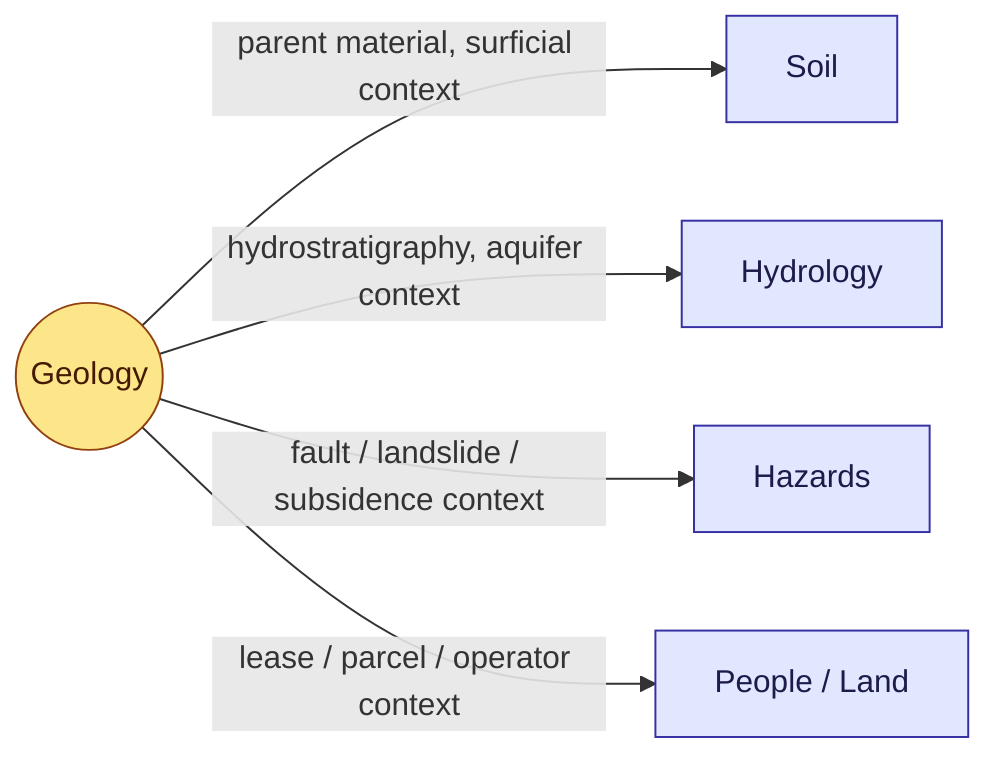

<!-- [KFM_META_BLOCK_V2]
doc_id: kfm://doc/<uuid-pending-assignment>
title: Geology Domain — Data Lifecycle
type: standard
version: v1
status: draft
owners: <geology-domain-steward>, <docs-steward>
created: 2026-05-16
updated: 2026-05-16
policy_label: public
related:
  - docs/doctrine/lifecycle-law.md
  - docs/doctrine/directory-rules.md
  - docs/domains/geology/README.md
  - docs/standards/PROV.md
  - docs/standards/ISO-19115.md
  - docs/standards/OAI-PMH.md
  - docs/standards/PMTILES.md
  - docs/standards/OGC-API-TILES.md
tags: [kfm, domain, geology, lifecycle, governance]
notes:
  - "Doctrine: CONFIRMED. Geology-specific implementation maturity: PROPOSED."
  - "Source-rights, schema homes, validator IDs, and runtime routes labeled NEEDS VERIFICATION / UNKNOWN until mounted-repo evidence confirms."
[/KFM_META_BLOCK_V2] -->

# Geology Domain — Data Lifecycle

> How geologic, subsurface, and resource material moves through the KFM lifecycle invariant **RAW → WORK / QUARANTINE → PROCESSED → CATALOG / TRIPLET → PUBLISHED**, gated, evidence-bound, and reversible at every step.


<!-- TODO badge: CI status (`/actions/workflows/<workflow>.yml/badge.svg`) once geology validator workflow exists -->
<!-- TODO badge: Last commit (`/last-commit/main?path=docs/domains/geology/DATA_LIFECYCLE.md`) once doc is on `main` -->

| Field | Value |
|---|---|
| **Status** | Draft — internal review |
| **Owners** | `<geology-domain-steward>`, `<docs-steward>` |
| **Updated** | 2026-05-16 |
| **Authority** | Doctrine CONFIRMED; Geology-specific application PROPOSED |
| **Lifecycle invariant** | RAW → WORK / QUARANTINE → PROCESSED → CATALOG / TRIPLET → PUBLISHED |
| **Schema-home convention** | `schemas/contracts/v1/...` per ADR-0001 (PROPOSED placement for geology lane) |

---

## Contents

- [1. Purpose and scope](#1-purpose-and-scope)
- [2. Lifecycle at a glance](#2-lifecycle-at-a-glance)
- [3. Stage 0 — Pre-RAW admission edge](#3-stage-0--pre-raw-admission-edge)
- [4. Stage 1 — RAW](#4-stage-1--raw)
- [5. Stage 2 — WORK / QUARANTINE](#5-stage-2--work--quarantine)
- [6. Stage 3 — PROCESSED](#6-stage-3--processed)
- [7. Stage 4 — CATALOG / TRIPLET](#7-stage-4--catalog--triplet)
- [8. Stage 5 — PUBLISHED](#8-stage-5--published)
- [9. Receipt × stage matrix](#9-receipt--stage-matrix)
- [10. Geology source families and roles](#10-geology-source-families-and-roles)
- [11. Sensitivity, rights, and publication posture](#11-sensitivity-rights-and-publication-posture)
- [12. Validators, tests, fixtures](#12-validators-tests-fixtures)
- [13. Governed AI behavior for the geology lane](#13-governed-ai-behavior-for-the-geology-lane)
- [14. Correction, rollback, and stale state](#14-correction-rollback-and-stale-state)
- [15. Cross-lane handoffs](#15-cross-lane-handoffs)
- [16. Repository placement (lane pattern)](#16-repository-placement-lane-pattern)
- [17. Open questions and verification backlog](#17-open-questions-and-verification-backlog)
- [18. Related docs](#18-related-docs)

---

## 1. Purpose and scope

This document explains how the **Geology and Natural Resources** domain applies KFM's canonical data lifecycle. It is the geology-specific operational reading of `docs/doctrine/lifecycle-law.md` and `docs/doctrine/directory-rules.md`, scoped to the object families, source families, and sensitivity posture documented in the geology dossier and capability encyclopedia.

It does **not** redefine the lifecycle, override doctrine, or assert implementation maturity. The lifecycle invariant is **CONFIRMED** at the KFM level; its geology-specific *application* is **CONFIRMED doctrine / PROPOSED lane application** until mounted-repo evidence (schemas, fixtures, validators, CI, emitted artifacts) verifies each step.

**In scope.** Geologic units, surficial geology, stratigraphy, lithology, structures, geomorphology, boreholes, well logs, cores, geophysics, geochemistry, mineral occurrences, resource deposits, resource estimates, extraction sites, reclamation context, hydrostratigraphic units, and public-safe generalized derivatives.

**Out of scope.** Hydrology measurements (Hydrology lane), soil claims (Soil lane), hazard risk truth (Hazards lane), ownership / lease / permit / title authority (People/DNA/Land lane), and the UI/AI surfaces themselves — those are downstream renderers and consumers, not canonical geology truth.

> [!IMPORTANT]
> **Promotion is a governed state transition, not a file move.** A path-level move that bypasses validators, policy gates, EvidenceBundle creation, catalog closure, and release-decision recording is a violation of the invariant regardless of which directory the bytes ended up in.

[Back to top](#contents)

---

## 2. Lifecycle at a glance

```mermaid
flowchart LR
  subgraph PRE["Pre-RAW admission edge (PROPOSED)"]
    EV[event_envelope] --> PF[prefilter_output] --> ERR[event_run_receipt]
  end

  ERR -. admission .-> RAW

  subgraph LIFE["Lifecycle invariant (CONFIRMED)"]
    RAW["RAW<br/><i>immutable source<br/>under source identity</i>"]
    WORK["WORK<br/><i>transformation +<br/>candidate space</i>"]
    QUAR["QUARANTINE<br/><i>rights / sensitivity /<br/>validation defects</i>"]
    PROC["PROCESSED<br/><i>normalized objects,<br/>receipts, candidates</i>"]
    CAT["CATALOG / TRIPLET<br/><i>EvidenceBundles,<br/>graph projections</i>"]
    PUB["PUBLISHED<br/><i>released public-safe<br/>artifacts via governed APIs</i>"]
  end

  RAW --> WORK
  RAW --> QUAR
  WORK --> PROC
  QUAR -. corrected .-> WORK
  PROC --> CAT
  CAT --> PUB
  PUB -. correction .-> PUB
  PUB -. rollback .-> CAT

  classDef pre fill:#fef3c7,stroke:#b45309,color:#451a03
  classDef raw fill:#e0e7ff,stroke:#3730a3,color:#1e1b4b
  classDef quar fill:#fee2e2,stroke:#991b1b,color:#450a0a
  classDef pub fill:#dcfce7,stroke:#166534,color:#052e16

  class EV,PF,ERR pre
  class RAW,WORK raw
  class QUAR quar
  class PROC,CAT,PUB pub
```



**Reading the diagram.** Solid arrows are governed promotions; dashed arrows are admission, correction, or rollback paths. The pre-RAW envelope governs *attempted* intake before geology material crosses the trust membrane into RAW. Nothing leaves a stage without the gate artifacts named in §§3–8.

[Back to top](#contents)

---

## 3. Stage 0 — Pre-RAW admission edge

> [!NOTE]
> **PROPOSED.** The pre-RAW event family is doctrine in BLD-GREEN v1.1 but its geology-lane realization is PROPOSED until pipeline_specs, watchers, and fixtures land.

The pre-RAW edge exists so that automated watchers, GitOps PR emission, KGS / USGS / KCC source refreshes, and model-assisted candidate generation cannot blur the line between *observed input* and *accepted source material*. Geology has several refresh patterns where this matters: KGS geologic-map versions, KCC oil & gas regulatory snapshots, and KGS/KDHE WWC5 water-well drops.

| Pre-RAW artifact | Purpose | Status |
|---|---|---|
| `event_envelope` | Captures the trigger (poll hit, manifest delta, manual nudge), source id, candidate hash, observed cadence. | PROPOSED |
| `prefilter_output` | Records the cheap structural verdict (size, type, source-role hint, deny on unknown rights). | PROPOSED |
| `event_run_receipt` | Pins the attempted intake — tool versions, timestamps, decision (admit / refuse / quarantine-on-arrival). | PROPOSED |

**Watcher-as-non-publisher.** Watchers observe and record; they never promote. A geology watcher detecting a new KGS geologic-map version emits the three artifacts above and opens a PR or queues a candidate. It does not write to `data/raw/geology/…` directly without admission, and never to `data/processed/`, `data/catalog/`, or `data/published/`.

[Back to top](#contents)

---

## 4. Stage 1 — RAW

| Field | Value |
|---|---|
| **Status** | Doctrine CONFIRMED · Geology realization PROPOSED |
| **Proposed home** | `data/raw/geology/<source_id>/<run_id>/` |
| **Public visibility** | None. RAW is not a public surface. |
| **Required artifact** | `SourceDescriptor` (CONFIRMED requirement; geology entries PROPOSED) |
| **Gate to enter** | Source identity and rights are minimally established; source-role intent is set. |
| **Default failure** | Source not admitted; logged as candidate awaiting steward. |

**What RAW holds.** Immutable, source-native payloads or references for KGS geologic maps, USGS NGMDB / GeMS releases, KGS oil-and-gas wells and production, KCC oil-and-gas regulatory data, KGS/KDHE WWC5 water-well records, KGS LAS digital well logs and well tops, USGS MRDS mineral resource records, geophysics and geochemistry datasets, and 3DEP terrain references used as geomorphology context. **Status: PROPOSED** — actual source rights, redistribution terms, and admission decisions remain **NEEDS VERIFICATION**.

**`SourceDescriptor` minimums for geology.** Role (authority / observation / context / model — these are not interchangeable), rights and license, sensitivity class, citation, source-vintage or cadence, retrieval method, and content/payload hash. Unclear rights or unresolved source role blocks admission. The four source-role channels are tracked explicitly to satisfy the **source-role anti-collapse** requirement called out for geology in the master register.

> [!CAUTION]
> **Borehole, well-log, sample, sensitive-resource, and private-well exact locations are treated as restricted-by-default in RAW.** Even though RAW is not public, downstream pipelines must already know that exact-location geometry is gated for any public-safe path. Recording the sensitivity class at RAW time prevents accidental promotion later.

[Back to top](#contents)

---

## 5. Stage 2 — WORK / QUARANTINE

| Field | Value |
|---|---|
| **Status** | Doctrine CONFIRMED · Geology realization PROPOSED |
| **Proposed homes** | `data/work/geology/<run_id>/` · `data/quarantine/geology/<reason>/<run_id>/` |
| **Public visibility** | None. |
| **Required artifacts** | `TransformReceipt`; `ValidationReport` (working set); `PolicyDecision`; quarantine reason record on failure. |
| **Gate to enter PROCESSED** | Schema, geometry, time, identity, evidence, rights, and policy rules pass; otherwise quarantine with structured reason. |
| **Default failure** | Hold in WORK or move to QUARANTINE; never silently promote. |

**WORK handles** schema normalization, geometry repair, temporal-scope reconciliation, identity assembly (the **PROPOSED** geology identity rule is `source id + object role + temporal scope + normalized digest`), source-role labelling, public-safe candidate generation, and EvidenceRef stubbing.

**QUARANTINE captures** rights ambiguity, source-role conflicts, sensitivity-class unknowns, evidence-closure failures, schema or geometry defects, temporal-scope gaps, and any unresolved interpretation-version mismatch on stratigraphic correlations or geologic-boundary versions. Quarantine is **not** a publishable staging area; corrections re-enter WORK.

### Geology-specific WORK concerns

| Concern | Why it matters here | Status |
|---|---|---|
| **Interpretation version** | Bedrock and surficial geologic maps carry interpretation versions; collapsing versions loses provenance. | PROPOSED |
| **Stratigraphic correlation drift** | Correlations between intervals can revise as new data arrives; identity must survive correlation revision. | PROPOSED |
| **Borehole / well-log generalization** | Exact locations stay restricted; generalized public-geometry candidates are produced here, not later. | PROPOSED |
| **Resource-class anti-collapse** | `MineralOccurrence`, `ResourceDeposit`, `ResourceEstimate`, `ExtractionSite`, and permits / production / reserves must remain distinct in WORK before they ever reach catalog. | PROPOSED |
| **Geophysics / raster framing** | Volume / voxel and raster outputs need CRS, units, and uncertainty captured before they normalize. | PROPOSED |

[Back to top](#contents)

---

## 6. Stage 3 — PROCESSED

| Field | Value |
|---|---|
| **Status** | Doctrine CONFIRMED · Geology realization PROPOSED |
| **Proposed home** | `data/processed/geology/<dataset_id>/<version>/` |
| **Public visibility** | None directly; PROCESSED is not a public path. |
| **Required artifacts** | `ValidationReport` (pass); `EvidenceRef` set; digest closure; `RedactionReceipt` and `AggregationReceipt` where applicable. |
| **Gate to enter CATALOG / TRIPLET** | Validators deterministic and tied to fixtures; required receipts present. |
| **Default failure** | Stay in WORK with a structured FAIL outcome. |

PROCESSED contains normalized geology objects from the canonical families — `GeologicUnit`, `SurficialUnit`, `Lithology`, `StratigraphicInterval`, `GeologicAge`, `StructureFeature` / `FaultStructure`, `GeologyBoundaryVersion`, `BoreholeReference`, `WellLogReference`, `CoreSample`, `GeophysicalObservation`, `GeochemistrySample` / `GeochemistrySampleReference`, `MineralOccurrence`, `ResourceDeposit`, `ResourceEstimate`, `ExtractionSite`, `ReclamationRecord`, `CrossSection`, and `HydrostratigraphicUnit` — together with their public-safe candidates and the receipts that prove how they got here.

PROCESSED is the last stage before evidence becomes catalog-discoverable. **EvidenceRefs must resolve** to a buildable `EvidenceBundle` projection before any object moves to CATALOG / TRIPLET; otherwise the gate fails closed.

[Back to top](#contents)

---

## 7. Stage 4 — CATALOG / TRIPLET

| Field | Value |
|---|---|
| **Status** | Doctrine CONFIRMED · Geology realization PROPOSED |
| **Proposed homes** | `data/catalog/domain/geology/` · `data/triplets/<exports-or-graph_deltas>/...` |
| **Public visibility** | Discovery only — released artifacts are surfaced through governed APIs, not raw catalog reads. |
| **Required artifacts** | `CatalogMatrix` entry; `EvidenceBundle`; graph / triplet projections if applicable; release candidate. |
| **Gate to enter PUBLISHED** | Catalog and proof closure pass. |
| **Default failure** | HOLD at PROCESSED. Structured FAIL outcome. No public edge. |

CATALOG records claim, layer, graph, provenance, and discovery surfaces downstream of evidence and processing. For geology this includes bedrock and surficial unit catalogs, structure / fault catalogs, stratigraphic interval indexes, borehole / well-log generalized indexes (exact geometry not exposed), mineral-occurrence and deposit summaries, extraction / reclamation context catalogs, and cross-section indexes. Graph / triplet projections express cross-lane relations to **Soil** (parent material, surficial context), **Hydrology** (hydrostratigraphy, aquifer context — without replacing hydrology measurements), **Hazards** (fault / landslide / subsidence context — without owning risk), and **People / Land** (lease / parcel / operator context — which cannot prove deposits).

External catalog conformance points include STAC items for raster / tile assets (cross-reference: [docs/standards/PMTILES.md](../../standards/PMTILES.md), [docs/standards/OGC-API-TILES.md](../../standards/OGC-API-TILES.md)), DCAT distributions, PROV-O activity records (cross-reference: [docs/standards/PROV.md](../../standards/PROV.md)), and ISO 19115 metadata crosswalks (cross-reference: [docs/standards/ISO-19115.md](../../standards/ISO-19115.md)). External standards are *crosswalk targets* — KFM's internal trust architecture remains authoritative.

[Back to top](#contents)

---

## 8. Stage 5 — PUBLISHED

| Field | Value |
|---|---|
| **Status** | Doctrine CONFIRMED · Geology realization PROPOSED |
| **Proposed homes** | `data/published/layers/geology/` · `data/published/api_payloads/...` · `data/published/pmtiles/...` · `data/published/geoparquet/...` |
| **Public visibility** | Public-safe artifacts only, served through governed APIs. |
| **Required artifacts** | `ReleaseManifest`; rollback target; correction path; `ReviewRecord` where required. |
| **Gate** | Review state where required; release authority distinct from the original author when materiality applies. |
| **Default failure** | HOLD at CATALOG. No public surface change. |

PUBLISHED exposes only released, policy-allowed, reviewable, rollback-capable artifacts. The geology public surfaces named in the dossier — bedrock unit map; surficial unit map; structure / fault view; stratigraphy / correlation view; borehole *public-generalized* view; mineral occurrence / deposit summary; extraction / reclamation context — all enter through this gate. The cross-cutting viewing surfaces (Evidence Drawer, time-aware state, trust badges, sensitivity-redacted view, correction / stale-state view, governed Focus Mode) consume `EvidenceBundle` and `DecisionEnvelope` — they do not bypass them.

> [!WARNING]
> **The trust membrane is non-negotiable.** Public clients and normal UI surfaces consume **governed interfaces and released artifacts** — never `data/raw/geology/`, `data/work/geology/`, `data/processed/geology/`, or `data/catalog/domain/geology/` directly. Cesium / 3D, where present, MUST consume the same `EvidenceBundle` and `DecisionEnvelope` as 2D.

### PROPOSED API surfaces (route names UNKNOWN)

| Endpoint or artifact | DTO / schema | Outcomes | Status |
|---|---|---|---|
| Geology feature / detail resolver | `GeologyDecisionEnvelope` | ANSWER / ABSTAIN / DENY / ERROR | PROPOSED; exact route **UNKNOWN** |
| Geology layer manifest resolver | `LayerManifest` (domain layer descriptor) | ANSWER / DENY / ERROR | PROPOSED; public-safe release only |
| Geology Evidence Drawer payload | `EvidenceDrawerPayload` + `EvidenceBundle` projection | ANSWER / ABSTAIN / DENY / ERROR | PROPOSED; evidence + policy filtered |
| Geology Focus Mode answer | Runtime Response Envelope + `AIReceipt` | ANSWER / ABSTAIN / DENY / ERROR | PROPOSED; AI never root truth |
| Schema responsibility root | `schemas/contracts/v1/...` per ADR-0001 | finite validator outcomes | PROPOSED; verify with Directory Rules and ADR |

[Back to top](#contents)

---

## 9. Receipt × stage matrix

Which receipts are emitted, amended, or referenced at each geology stage. Receipts created earlier remain *referenced* (not duplicated) at later phases via `EvidenceRef`. Status: doctrine CONFIRMED, geology realization PROPOSED.

| Receipt | RAW | WORK / QUARANTINE | PROCESSED | CATALOG / TRIPLET | PUBLISHED |
|---|:---:|:---:|:---:|:---:|:---:|
| `SourceDescriptor` | ● | ● | ● | ● | ● |
| `TransformReceipt` |   | ● | ● | ● |   |
| `RedactionReceipt` |   | ● | ● | ● | ● |
| `AggregationReceipt` |   | ● | ● | ● | ● |
| `ModelRunReceipt` |   | ● | ● | ● | ● |
| `RepresentationReceipt` |   |   | ● | ● | ● |
| `AIReceipt` |   |   |   |   | ● *(Focus Mode only)* |
| `ReviewRecord` |   | ● | ● | ● | ● |
| `PolicyDecision` | ● | ● | ● | ● | ● |
| `ValidationReport` |   | ● | ● | ● |   |
| `ReleaseManifest` |   |   |   | ● | ● |
| `CorrectionNotice` |   |   |   | ● | ● |
| `RollbackCard` |   |   |   | ● | ● |

[Back to top](#contents)

---

## 10. Geology source families and roles

Geology pulls from **observation**, **authority**, **regulatory**, **context**, and **model** sources. The source-role anti-collapse rule applies: an observed log is not a regulatory record; a regulatory submission is not an interpretation; a model-derived map is not a measurement. Rights and current terms are **NEEDS VERIFICATION** for every entry; sensitive joins fail closed.

| Source family | Typical role(s) | Geology objects served | Rights / sensitivity |
|---|---|---|---|
| Kansas Geological Survey (data & maps) | authority / observation / context | `GeologicUnit`, `SurficialUnit`, `StratigraphicInterval`, `StructureFeature` | NEEDS VERIFICATION |
| KGS surficial geology and geologic maps | authority / context | `SurficialUnit`, `GeologyBoundaryVersion`, `CrossSection` | NEEDS VERIFICATION |
| USGS NGMDB and GeMS | authority / context | `GeologicUnit`, `StratigraphicCorrelation`, `StructureFeature` | NEEDS VERIFICATION |
| KGS oil and gas wells and production | authority / observation | `BoreholeReference`, production-related context | NEEDS VERIFICATION; sensitive joins fail closed |
| KCC oil and gas regulatory data | regulatory / authority | regulatory permits, operator records | NEEDS VERIFICATION; permit / production / reserve must remain distinct |
| KGS / KDHE WWC5 and water-well program | authority / observation | water-well borehole references | NEEDS VERIFICATION; private-well exact locations restricted |
| KGS LAS digital well logs and well tops | observation | `WellLogReference` | NEEDS VERIFICATION; exact-geometry restricted |
| USGS MRDS | authority / context | `MineralOccurrence`, `ResourceDeposit` | NEEDS VERIFICATION |
| Geophysics / geochemistry datasets | observation / model | `GeophysicalObservation`, `GeochemistrySampleReference` | NEEDS VERIFICATION |
| 3DEP terrain (geomorphology context) | context / observation | terrain framing, cross-sections, geomorphology context | NEEDS VERIFICATION |

> [!NOTE]
> The list above is drawn from the geology dossier and capability encyclopedia. Source-cadence, exact endpoint, license text, attribution requirements, and live rights are **NEEDS VERIFICATION** until the registry and source descriptors are confirmed against the mounted repo.

[Back to top](#contents)

---

## 11. Sensitivity, rights, and publication posture

| Concern | Default posture | Why |
|---|---|---|
| Exact borehole / well-log locations | Restricted; generalize before any public-geometry path | Privacy of private wells; competitive sensitivity of subsurface data |
| Sample / core exact locations | Restricted; generalize | Sensitivity and provenance integrity |
| Sensitive-resource geometry | Restricted; generalize | Misuse risk; rights uncertainty |
| Private-well locations | Restricted | Privacy |
| `MineralOccurrence` vs `ResourceDeposit` vs `ResourceEstimate` | Always distinct; never collapsed | Each carries different evidence standards |
| Permit / production / reserve claims | Always distinct | Regulatory authority ≠ observation ≠ economic claim |
| Operational / current production figures | Public-safe only after rights, sensitivity, and freshness review | Stale operational data is misleading; rights vary |
| Reclamation status | Public-safe when generalized; site-level requires review | Stewardship + sensitivity |
| Interpretation version | Always carried; never silently overwritten | Geologic maps are versioned interpretations |

> [!IMPORTANT]
> **Unclear rights, unresolved source role, missing evidence, unresolved sensitivity, or absent release state blocks public promotion.** This is doctrine, not a geology-specific opinion.

[Back to top](#contents)

---

## 12. Validators, tests, fixtures

Validators are organized as gate families, each with a finite default failure outcome. The geology lane needs the following — all **PROPOSED** until tests, fixtures, schemas, and CI workflows are verified in the mounted repo.

| Gate family | Must answer (for geology) | Default failure |
|---|---|---|
| **Shape gate** | Does the object match its schema and required version? | ERROR / quarantine |
| **Meaning gate** | Does it conform to the geology contract and vocabulary (unit, lithology, structure, borehole, well-log, occurrence, deposit, estimate)? | ERROR / review |
| **Source gate** | Is source role, rights, cadence, and sensitivity known for the KGS / USGS / KCC / WWC5 / MRDS family at hand? | DENY / quarantine |
| **Evidence gate** | Do `EvidenceRef` values resolve to a buildable `EvidenceBundle`? | ABSTAIN |
| **Policy gate** | Is exposure allowed for this user, purpose, and release class — including exact-location and resource-class rules? | DENY |
| **Lifecycle gate** | Is the object in the correct RAW → PUBLISHED state? | DENY |
| **Receipt gate** | Are `RunReceipt` / `PromotionReceipt` / decision logs present? | ERROR |
| **Release gate** | Does the `ReleaseManifest` include proof, correction path, rollback target, and review state where required? | DENY |

### Geology-specific validators (all PROPOSED)

- **Source-role validators** — observed log ≠ regulatory record ≠ administrative compilation ≠ candidate ≠ model.
- **Resource-class anti-collapse tests** — `MineralOccurrence`, `ResourceDeposit`, `ResourceEstimate`, `ExtractionSite`, permits, production, and reserves stay distinct.
- **Public-safe geometry tests** — exact borehole / sample / sensitive-resource / private-well coordinates fail a public geometry probe before tile build or release.
- **Borehole / well-log rights tests** — rights and redistribution class confirmed before public exposure of any derivative.
- **Catalog closure tests** — every published geology layer / dataset has source, schema, validation, policy, and release metadata.
- **AI evidence-before-model tests** — Focus Mode geology answers fail closed if `EvidenceBundle` resolution does not precede language generation.

[Back to top](#contents)

---

## 13. Governed AI behavior for the geology lane

**Doctrine CONFIRMED / Implementation PROPOSED.** AI in the geology lane may:

- Summarize released geology `EvidenceBundle` content (e.g., a bedrock-unit description with citations).
- Compare evidence across sources (e.g., KGS map version A vs USGS GeMS rendering of the same area).
- Explain limitations (e.g., interpretation version, scale support, generalization).
- Draft steward-review notes for promotion or correction.

AI **must ABSTAIN** when evidence is insufficient, citations cannot be validated, source roles conflict, or temporal scope is missing. AI **must DENY** where policy, rights, sensitivity, or release state blocks the request — including exact-location asks, private-well or sensitive-resource probes, and any path that would treat a generated summary as canonical geology truth.

> [!CAUTION]
> The trust order is fixed: define scope → retrieve evidence → resolve `EvidenceRef` to `EvidenceBundle` → apply policy and sensitivity → answer with traceability or narrow scope. **Fluent generation never stands in for evidence, policy, review state, source authority, or release state.**

[Back to top](#contents)

---

## 14. Correction, rollback, and stale state

| Transition | Pre-condition | Required artifacts | Authority |
|---|---|---|---|
| **Correction** (PUBLISHED → PUBLISHED') | Detected error or new evidence; downstream derivatives identified | `CorrectionNotice`; updated `ReleaseManifest`; `ReviewRecord` | Steward (+ rights-holder where applicable) |
| **Rollback** | Failed release; correction blocked; downstream invalidation needed | `RollbackCard` (release_id, rollback_to, reason, invalidates, review_ref) | Steward + release authority |
| **Stale state** | Source cadence exceeded; freshness budget breached | Stale badge on layer / drawer; ABSTAIN on Focus Mode | Automatic + steward review |

**Geology-specific correction triggers** include: revised KGS / USGS geologic-map versions, KCC regulatory data corrections, WWC5 record amendments, well-log corrections from KGS LAS releases, MRDS revisions, source-role reclassification, and interpretation-version updates on stratigraphic correlations. Each triggers a `CorrectionNotice` that names the invalidated derivatives and the new release lineage.

[Back to top](#contents)

---

## 15. Cross-lane handoffs

Geology relates to other domains through governed crosswalks — never through direct ownership of another lane's canonical truth.



| This domain | Related lane | Relation type | Constraint |
|---|---|---|---|
| Geology | Soil | parent material and surficial context | Preserve ownership, source role, sensitivity, and `EvidenceBundle` support. |
| Geology | Hydrology | hydrostratigraphy and aquifer context without replacing measurements | Preserve ownership, source role, sensitivity, and `EvidenceBundle` support. |
| Geology | Hazards | fault / landslide / subsidence risk context without owning risk | Preserve ownership, source role, sensitivity, and `EvidenceBundle` support. |
| Geology | People / Land | lease, parcel, operator relation cannot prove deposits | Preserve ownership, source role, sensitivity, and `EvidenceBundle` support. |

> [!NOTE]
> Cross-lane joins emit their own receipts (`OverlayReceipt`, `AggregationReceipt`) and stay subject to the *more restrictive* sensitivity posture of the participating lanes.

[Back to top](#contents)

---

## 16. Repository placement (lane pattern)

Geology follows Directory Rules §12 — a **domain MUST NOT become a root folder**. The lane pattern, scoped to geology, is shown below. Path-level claims are **PROPOSED** until verified against mounted-repo evidence; any deviation routes through `docs/registers/DRIFT_REGISTER.md` and ADR.

<details>
<summary><strong>Proposed geology lane layout (path claims PROPOSED)</strong></summary>

```text
docs/domains/geology/
  README.md
  DATA_LIFECYCLE.md            # this document

contracts/domains/geology/
schemas/contracts/v1/domains/geology/
policy/domains/geology/
tests/domains/geology/
fixtures/domains/geology/
packages/domains/geology/
pipelines/domains/geology/
pipeline_specs/geology/

data/raw/geology/<source_id>/<run_id>/
data/work/geology/<run_id>/
data/quarantine/geology/<reason>/<run_id>/
data/processed/geology/<dataset_id>/<version>/
data/catalog/domain/geology/
data/triplets/exports/geology/                 # PROPOSED — verify subfolder convention
data/published/layers/geology/
data/published/pmtiles/geology/
data/published/geoparquet/geology/
data/registry/sources/geology/
data/receipts/{ingest,validation,pipeline,ai,release}/geology/   # PROPOSED arrangement
data/proofs/{evidence_bundle,proof_pack,validation_report,citation_validation}/geology/  # PROPOSED arrangement
data/rollback/geology/<release_id>/

release/candidates/geology/
```

</details>

> [!NOTE]
> **PROPOSED.** The exact subfolder shapes for `data/triplets/`, `data/receipts/`, and `data/proofs/` reflect the canonical `data/` layout in Directory Rules §9.1, but the geology-specific arrangement under each is **NEEDS VERIFICATION** until the mounted repo confirms it.

[Back to top](#contents)

---

## 17. Open questions and verification backlog

| Item to verify | Evidence that would settle it | Status |
|---|---|---|
| Verify KGS and KCC source descriptors. | Mounted-repo files, schemas, registry entries, tests, logs, emitted artifacts, review records, or release manifests | NEEDS VERIFICATION |
| Verify borehole / well-log public policy. | Mounted-repo policy files; geology policy gate fixtures | NEEDS VERIFICATION |
| Define resource classification scheme and tests. | Geology contracts; resource-class anti-collapse fixtures | NEEDS VERIFICATION |
| Verify geology API surface, MapLibre integration, and Evidence Drawer payload. | Apps, API routes, layer registry entries, drawer payload schemas | NEEDS VERIFICATION |
| Verify schema home for geology contracts under `schemas/contracts/v1/...`. | ADR-0001 conformance check in mounted repo | PROPOSED |
| Verify CI workflow names and badge URLs. | `.github/workflows/*.yml` and badge endpoints | UNKNOWN |
| Confirm receipt subfolder arrangement under `data/receipts/...` and `data/proofs/...`. | Repo evidence; existing emitted artifacts | NEEDS VERIFICATION |
| Confirm geology owner and steward placeholders. | `docs/governance/` ownership register | UNKNOWN |
| Resolve `PROV.md` vs `PROVENANCE.md` naming for the cross-link in this doc's `related:` block. | ADR decision | NEEDS VERIFICATION |
| Confirm geology-lane application of the pre-RAW event family. | Pipeline_specs / watcher implementations | PROPOSED |

[Back to top](#contents)

---

## 18. Related docs

- [Directory Rules](../../doctrine/directory-rules.md) — placement authority for this and every other lane.
- [Lifecycle Law](../../doctrine/lifecycle-law.md) — the canonical RAW → PUBLISHED invariant.
- [Trust Membrane](../../doctrine/trust-membrane.md) — why public clients never read canonical or internal stores.
- [Truth Posture](../../doctrine/truth-posture.md) — cite-or-abstain, labels, and the evidence rule.
- [Geology Domain README](./README.md) — geology orientation and lane fit *(TODO if not yet present)*.
- [PROV-O Profile](../../standards/PROV.md) — provenance-record standard used by catalog and release.
- [ISO 19115 Crosswalk](../../standards/ISO-19115.md) — geospatial metadata crosswalk used at catalog.
- [OAI-PMH Profile](../../standards/OAI-PMH.md) — harvest-side governance for incoming metadata.
- [PMTiles Profile](../../standards/PMTILES.md) — tile delivery and attestation profile.
- [OGC API — Tiles](../../standards/OGC-API-TILES.md) — tile delivery standard integration.
- [ADR-0001 — Schema Home](../../adr/ADR-0001-schema-home.md) *(referenced as canonical schema-home decision; verify path)*.

---

**Last updated:** 2026-05-16  ·  **Status:** draft  ·  **Owners:** `<geology-domain-steward>`, `<docs-steward>`

[Back to top](#contents)
