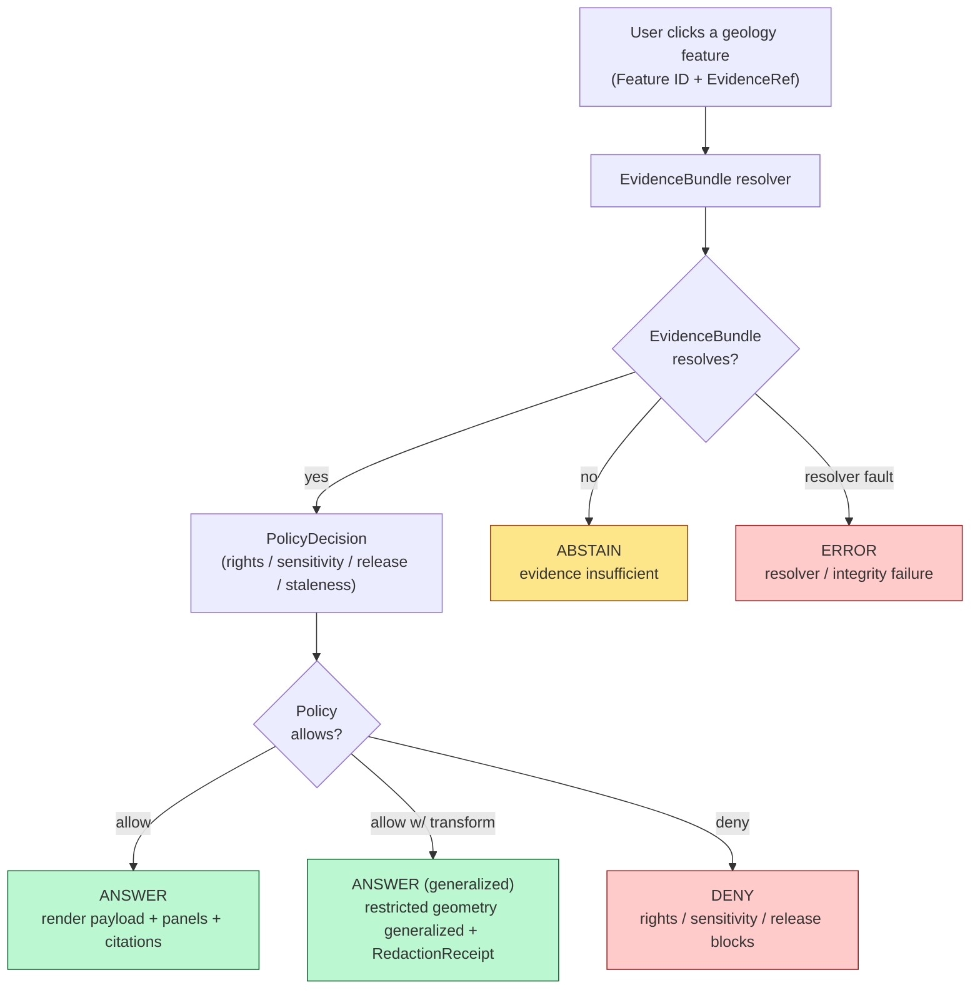

<!-- [KFM_META_BLOCK_V2]
doc_id: kfm://doc/geology-evidence-drawer-payload
title: Geology Domain — Evidence Drawer Payload
type: standard
version: v1
status: draft
owners: <geology-domain-steward> (PLACEHOLDER), <ai-surface-steward> (PLACEHOLDER), <schema-steward> (PLACEHOLDER)
created: 2026-06-03
updated: 2026-06-03
policy_label: public
contract_version: 3.0.0
related: [
  "docs/doctrine/directory-rules.md",
  "ai-build-operating-contract.md",
  "docs/domains/geology/README.md",
  "docs/domains/geology/EVIDENCE_DRAWER_LANGUAGE.md",
  "docs/domains/geology/CROSS_LANE_NOTES.md",
  "docs/domains/geology/SENSITIVITY.md",
  "docs/architecture/governed-ai/README.md",
  "contracts/runtime/evidence_drawer_payload.md",
  "docs/registers/VERIFICATION_BACKLOG.md",
  "docs/registers/DRIFT_REGISTER.md"
]
tags: [kfm, domain, geology, evidence-drawer, payload, contract, trust, governed-ai, sensitivity]
notes: [
  "CONTRACT_VERSION pinned to 3.0.0 per ai-build-operating-contract.md.",
  "This doc is the payload CONTRACT (fields, resolution flow, panels). The human-readable STRINGS live in EVIDENCE_DRAWER_LANGUAGE.md. The Evidence Drawer is a CONFIRMED cross-cutting surface; Geology supplies a payload projection, not a component.",
  "Atlas §10.J CONFIRMS the surface: EvidenceDrawerPayload + EvidenceBundle projection, outcomes ANSWER/ABSTAIN/DENY/ERROR, evidence-and-policy filtered.",
  "GeologyDecisionEnvelope (Atlas §10.J feature resolver) is RETIRED → RuntimeResponseEnvelope, per the cross-domain envelope migration.",
  "Atlas §10.I: exact borehole/sample/well-log/private-well locations default to restricted or generalized; occurrence/deposit/estimate/permit/production/reserve claims must remain distinct.",
  "All non-directory-rules.md repo paths are PROPOSED / NEEDS VERIFICATION until checked against a mounted KFM repo."
]
[/KFM_META_BLOCK_V2] -->

# 🪨 Geology Domain — Evidence Drawer Payload

> The contract for what the Evidence Drawer carries when a user clicks a geologic feature — fields, resolution flow, and panels, one hop from the EvidenceBundle.


| | |
|---|---|
| **Status** | draft |
| **Owners** | `<geology-domain-steward>`, `<ai-surface-steward>`, `<schema-steward>` (PLACEHOLDER) |
| **Last updated** | 2026-06-03 |
| **Contract** | `CONTRACT_VERSION = "3.0.0"` (`ai-build-operating-contract.md`) |
| **Authority** | KFM doctrine; `directory-rules.md` (v1.3); **Atlas v1.1 §10.J** (Geology Evidence Drawer payload, CONFIRMED surface), §10.I (sensitivity), §10.F (cross-lane), §24.1 (anti-collapse); Master MapLibre Components v2.1 §N |
| **Governs** | the *fields & flow*, not the *words* — the string catalog is `EVIDENCE_DRAWER_LANGUAGE.md` |

> [!IMPORTANT]
> **Resolve before you render.** Per Atlas §10.J the geology drawer payload is `EvidenceDrawerPayload + EvidenceBundle projection`, "evidence and policy filtered," with finite outcomes `ANSWER / ABSTAIN / DENY / ERROR`. The drawer MUST resolve the `EvidenceBundle` **before** producing output; there is **no rendered-feature-only answer**. A popup or trust badge is a *cue*, not the drawer. Where rights, sensitivity, source authority, stale state, or release proof is missing, the drawer renders `DENY` or `ABSTAIN`. Each implementation-shaped claim is labeled `CONFIRMED`, `PROPOSED`, `NEEDS VERIFICATION`, `UNKNOWN`, or `CONFLICTED`.

---

## Contents

1. [Purpose & scope](#1-purpose--scope)
2. [Where the drawer is mandatory](#2-where-the-drawer-is-mandatory)
3. [Click-to-evidence resolution flow](#3-click-to-evidence-resolution-flow)
4. [The geology EvidenceDrawerPayload](#4-the-geology-evidencedrawerpayload)
5. [Per-artifact minimum fields](#5-per-artifact-minimum-fields)
6. [Drawer panels](#6-drawer-panels)
7. [Resource-class anti-collapse in the payload](#7-resource-class-anti-collapse-in-the-payload)
8. [Sensitivity: restricted/generalized geometry](#8-sensitivity-restrictedgeneralized-geometry)
9. [Conflicting evidence](#9-conflicting-evidence)
10. [Negative outcomes — ABSTAIN, DENY, ERROR](#10-negative-outcomes--abstain-deny-error)
11. [Validators, tests, fixtures](#11-validators-tests-fixtures)
12. [File-home & placement notes](#12-file-home--placement-notes)
13. [Open questions register](#13-open-questions-register)
14. [Open verification backlog](#14-open-verification-backlog)
15. [Changelog](#15-changelog)
16. [Definition of done](#16-definition-of-done)
17. [Related docs](#17-related-docs)

---

## 1. Purpose & scope

This document is the **Evidence Drawer payload contract** for the Geology lane. It defines what a geology `EvidenceDrawerPayload` carries, how it resolves on click, which panels it renders, and how it handles resource-class distinction, sensitivity, conflict, and negative outcomes.

**It governs the payload.** The human-readable *strings* the drawer shows (labels, microcopy, redaction phrasing) live in `docs/domains/geology/EVIDENCE_DRAWER_LANGUAGE.md`. The two are a matched pair: this doc says *what fields exist*; the language doc says *what words clothe them*.

**CONFIRMED framing.** The Evidence Drawer is a **cross-cutting trust surface** shared across all sixteen domain lanes; Geology supplies a payload projection, not a component. [ATLAS §10.G "Evidence Drawer is a cross-cutting viewing product"] [MAP-MASTER §N]

**In scope:** the geology payload shape; per-artifact minimum fields; resolution flow; panel layout; resource-class anti-collapse; sensitivity behavior; conflict handling; negative-outcome rendering.

**Out of scope (see neighbors):**

- Drawer *strings / UX copy* — `EVIDENCE_DRAWER_LANGUAGE.md`.
- Object *meaning* — `contracts/domains/geology/` (PROPOSED).
- Field-level *schema* — `schemas/contracts/v1/domains/geology/` (PROPOSED).
- Sensitivity *policy* (what is denied) — `policy/domains/geology/` + `SENSITIVITY.md` (PROPOSED).
- Cross-lane *edge ownership* — `CROSS_LANE_NOTES.md` (PROPOSED).
- Focus Mode (the AI synthesis surface) — `docs/architecture/governed-ai/README.md`.

[Back to top ↑](#contents)

---

## 2. Where the drawer is mandatory

**CONFIRMED doctrine** (KFM-P1-FEAT-0065; Pass 20 Part II): the Evidence Drawer or equivalent trust-visible payload MUST be available wherever users encounter public claims, map features, layer states, or AI summaries.

| Surface | Drawer requirement | Citation |
|---|---|---|
| A clicked geology **feature** (geologic unit, fault, generalized borehole) | MUST resolve to EvidenceBundle and open the drawer | CONFIRMED [KFM-P1-FEAT-0065] [ATLAS §10.J] |
| A geology **layer state** (bedrock map, structure view, mineral summary) | MUST expose source, status, policy via the drawer | CONFIRMED [KFM-P1-FEAT-0065] |
| A map **popover / popup** | A cue only; MUST resolve to the drawer before any consequential claim | CONFIRMED [MAP-MASTER ML-059-061] |
| A **trust / attestation badge** | Badge click opens proof details; MUST NOT replace the drawer | CONFIRMED [MAP-MASTER ML-061-139] |
| A geology **Focus Mode answer** | Shares the same EvidenceBundle resolution; cites back into drawer evidence | CONFIRMED [ATLAS §10.J] [GAI] |

> [!CAUTION]
> **A popup is not the drawer.** Rendering a borehole's attributes in a hover popup and treating that as the answer is the canonical anti-pattern. The popup is a cue; the consequential claim only stands once the drawer resolves the EvidenceBundle. [MAP-MASTER ML-059-061]

[Back to top ↑](#contents)

---

## 3. Click-to-evidence resolution flow

**CONFIRMED behavior** (Atlas §10.J; MAP-MASTER §N). The drawer resolves a clicked feature through the EvidenceBundle resolver and a `PolicyDecision`, then renders one of the four finite outcomes.



> [!NOTE]
> **Diagram status: CONFIRMED flow / ILLUSTRATIVE layout.** The resolve-then-policy order and the four finite outcomes are CONFIRMED [ATLAS §10.J] [GAI]; the branch styling is illustrative. The drawer never reaches RAW, WORK, QUARANTINE, canonical stores, graph internals, or source APIs — only released, policy-filtered evidence. [ATLAS §24.6.2 trust membrane]

[Back to top ↑](#contents)

---

## 4. The geology EvidenceDrawerPayload

**CONFIRMED surface / PROPOSED field projection.** Atlas §10.J names the surface as `EvidenceDrawerPayload + EvidenceBundle projection`, evidence-and-policy filtered. The shared DTO takes `Feature ID`, `EvidenceRef`, and `EvidenceBundle` as inputs (MAP-MASTER §N). The geology projection (PROPOSED) carries:

```text
EvidenceDrawerPayload (geology projection)
├── feature_id                 # clicked geology feature
├── outcome                    # ANSWER | ABSTAIN | DENY | ERROR
├── object_family              # Geologic Unit | Fault Structure | BoreholeReference | ...
├── evidence_bundle_ref        # → resolved EvidenceBundle (REQUIRED for ANSWER)
├── citations[]                # resolvable source citations (KGS, USGS, KCC, ...)
├── source_role                # authority | observation | regulatory | model | context (anti-collapse)
├── resource_class             # occurrence | deposit | estimate | permit | production | reserve (NEVER merged — §7)
├── release_state              # PUBLISHED | review-authorized
├── review_state               # reviewed | pending | n/a
├── freshness                  # current | SOURCE_STALE
├── sensitivity_class          # public | restricted | generalized
├── geometry_treatment         # exact-withheld | generalized-to-grid | generalized-to-county | as-published
├── redaction_receipt_ref?     # → RedactionReceipt when geometry was generalized
├── boundary_version?          # → GeologyBoundaryVersion when a boundary was revised
├── temporal                   # { geologic_age, source, observed, valid, retrieval, release, correction }
├── trust_state                # verified | stale | unknown | failed
└── policy_decision_ref        # → PolicyDecision
```

> [!IMPORTANT]
> **No bundle, no answer.** The `evidence_bundle_ref` MUST resolve for an `ANSWER`. A payload referencing an `EvidenceRef` that does not resolve to an `EvidenceBundle` produces `ABSTAIN`, never a rendered-feature-only claim. [ATLAS §10.J] [ATLAS §24.6.2]

> [!NOTE]
> **`geologic_age` is distinct from record time.** Deep-time age is a property of the unit (per its authority); it is not a KFM timestamp and never collapses into `observed`/`valid`/`release`. See `EVIDENCE_DRAWER_LANGUAGE.md` §5 for how the two are phrased.

[Back to top ↑](#contents)

---

## 5. Per-artifact minimum fields

> [!NOTE]
> **This section answers KFM-P1-FEAT-0065's open question** ("what minimum fields must the drawer expose per artifact family?") for Geology. Rows are **PROPOSED** pending contract authoring and a mounted-repo check. Object families CONFIRMED from Atlas §10.B/§10.E.

| Geology artifact | Minimum drawer fields (beyond the common payload) | Sensitivity note |
|---|---|---|
| **Geologic Unit** | unit name, authority (KGS/USGS), `boundary_version`, geologic age | none (T0 typical) |
| **SurficialUnit** | unit type, authority, geologic age | none |
| **Lithology** | rock type, parent unit | property of a unit, not a location |
| **Stratigraphic Interval** | top/bottom, correlation basis | none |
| **StructureFeature / Fault Structure** | structure type, authority | **context for Hazards only — not a risk claim** (§7, §9) |
| **GeologyBoundaryVersion** | version id, what changed, prior-version link | none |
| **BoreholeReference** | taxon of log/sample types, generalization level | **exact location withheld by default** (§8) |
| **Well LogReference** | log curve types available, generalization level | **exact API/well number withheld** (§8) |
| **Core Sample / Geophysical Observation** | sample/observation type, source role | observation; not interpretation |
| **Geochemistry SampleReference** | analyte classes, uncertainty | observation; show uncertainty |
| **Mineral Occurrence** | commodity, occurrence basis, generalization level | **occurrence ≠ deposit ≠ reserve** (§7) |
| **Resource Deposit / ResourceEstimate** | commodity, **model basis**, uncertainty, `resource_class` | **model verb; never "reserve" unless bundle says so** (§7) |
| **Extraction Site / Reclamation Record** | site status, source role | context; never a permit/ownership claim |
| **Hydrostratigraphic Unit** | unit, Geology-owned-vs-Hydrology-owned marker | Geology owns the unit; Hydrology owns the measurement |
| **CrossSection** | line basis, interpretation flag | label as interpretation |
| **RedactionReceipt** | transform type, input/output class, reason, reviewer, residual risk | **withheld value never in the receipt** |

[Back to top ↑](#contents)

---

## 6. Drawer panels

Fixed panel order so trust reads the same on every geology feature (PROPOSED layout; panel content CONFIRMED by MAP-MASTER §N).

| # | Panel | Shows | Status |
|---|---|---|---|
| 1 | **Header** | object family, name/title, trust-state chip | PROPOSED |
| 2 | **Source & role** | source family (KGS/USGS/KCC), source role (authority/observation/regulatory/model/context), retrieval time | CONFIRMED content |
| 3 | **Evidence** | resolvable citations from the EvidenceBundle | CONFIRMED content |
| 4 | **Resource class** | occurrence / deposit / estimate / permit / production / reserve — shown distinctly, never merged | CONFIRMED content [§10.I] |
| 5 | **Time** | geologic age; source / observed / valid / release; freshness (`current` / `SOURCE_STALE`); boundary version | CONFIRMED content |
| 6 | **Policy & release** | release state, review state, `PolicyDecision` summary | CONFIRMED content |
| 7 | **Sensitivity** | sensitivity class; geometry treatment; RedactionReceipt link when generalized | CONFIRMED content [§10.I] |
| 8 | **Conflict** | lingering/conflicting signals when authorities disagree (see §9) | CONFIRMED content [ML-060-027] |
| 9 | **Proof / attestation** | manifest/proof id; badge → proof details (not a drawer substitute) | CONFIRMED [ML-061-139] |

> [!TIP]
> **Metadata panels aid explainability but are not proof alone.** Provenance/lineage panels support AI explainability, but they must still resolve to source evidence and catalog records. [MAP-MASTER ML-059-080]

[Back to top ↑](#contents)

---

## 7. Resource-class anti-collapse in the payload

**CONFIRMED doctrine** (Atlas §10.I): *"Occurrence, deposit, estimate, permit, production, and reserve claims must remain distinct."* This is geology's sharpest payload rule, and it has a dedicated field (`resource_class`) and panel (§6 panel 4).

| `resource_class` | What it means | Drawer must NOT imply |
|---|---|---|
| `occurrence` | a mineral was observed/recorded at a generalized location | a mineable deposit exists |
| `deposit` | a characterized body of material | it is economically recoverable |
| `estimate` | a **modeled** quantity | it is a measured/proven figure |
| `permit` | a regulatory authorization exists | a deposit is proven |
| `production` | extraction was recorded | remaining reserves |
| `reserve` | an economically recoverable quantity (rare; bundle-asserted) | anything beyond what the bundle states |

> [!WARNING]
> **The deposit-proof trap (Atlas §10.F).** A lease / parcel / operator / permit relation **cannot prove a deposit**. The payload must keep the administrative/regulatory record (`source_role = regulatory|administrative`) distinct from any resource claim, and the drawer must never let a People/Land or regulatory join populate `resource_class = deposit|reserve`. A validator enforces this (§11). [ATLAS §10.F] [§24.1]

[Back to top ↑](#contents)

---

## 8. Sensitivity: restricted/generalized geometry

**CONFIRMED doctrine** (Atlas §10.I): *"Exact borehole, sample, sensitive resource, well-log, and private well locations default to restricted or generalized public geometry."*

> [!CAUTION]
> **Sensitive-domain handling (operating contract §23.2).** Exact borehole/well/sample/deposit locations are sensitive geology content: **DENY public exact exposure · GENERALIZE before publication · REDACT · QUARANTINE uncertain source material · REQUIRE steward review · REQUIRE transform receipt (RedactionReceipt) · ABSTAIN when support is inadequate.** No `ANSWER` payload contains an exact coordinate, exact well/API number, or restricted-source-derived field; the drawer shows the *reason* and a RedactionReceipt link, never the withheld value.

**`geometry_treatment` values and what the payload carries:**

| Value | Payload contains | Receipt |
|---|---|---|
| `as-published` | the released geometry (T0-class features) | none required |
| `generalized-to-grid` | a grid cell, not the point | `redaction_receipt_ref` REQUIRED |
| `generalized-to-county` | a county/coarser footprint | `redaction_receipt_ref` REQUIRED |
| `exact-withheld` | metadata only; geometry absent | `redaction_receipt_ref` REQUIRED |

> [!NOTE]
> **Tier note.** Unlike Fauna/Flora/Archaeology, the Atlas §20.5 Deny-by-Default Register does **not** carry a named Geology row, and §24.5 does not assign Geology a default tier. Geology sensitivity is governed by §10.I ("restricted or generalized") — operationally T1/T2-class for sensitive locations — but the **exact default tier per object is NEEDS VERIFICATION** against `policy/domains/geology/`, not a confirmed T4. Do not assert a tier the corpus does not state.

[Back to top ↑](#contents)

---

## 9. Conflicting evidence

**CONFIRMED doctrine** (MAP-MASTER ML-060-027): when sources disagree, **both observations are retained**; trust tier and recency choose canonical status, and the drawer **exposes the conflict**.

For geology:

- A unit boundary mapped differently by KGS and USGS GeMS shows **both** and the canonical choice with its basis — never a silent winner; the `boundary_version` makes the lineage inspectable.
- A unit named differently by two authorities keeps both names in the Conflict panel.
- Source role is preserved across the conflict: a regulatory record and a modeled estimate are never merged into one undifferentiated resource claim (§7). [ATLAS §24.1]

[Back to top ↑](#contents)

---

## 10. Negative outcomes — ABSTAIN, DENY, ERROR

The drawer renders negative outcomes as **typed states**, never as blanks or fabricated content. [ATLAS §10.J] [MAP-MASTER §N] [GAI]

| Outcome | Trigger | What the drawer renders |
|---|---|---|
| `ANSWER` | EvidenceBundle resolves and policy allows | full payload + panels + citations |
| `ANSWER (generalized)` | allowed only with a geometry transform | generalized geometry + reason + RedactionReceipt link |
| `ABSTAIN` | `EvidenceRef` does not resolve to an EvidenceBundle | "insufficient evidence" state; no claim |
| `DENY` | rights unknown, sensitivity unresolved, or not released | "denied" state + reason **class** (no sensitive detail) |
| `ERROR` | resolver fault or integrity failure | "error" state; no partial claim |

> [!NOTE]
> A `DENY` reason is shown as a **class** (e.g., "rights unresolved", "location sensitivity"), never the underlying coordinate or restricted field. Exact phrasing is governed by `EVIDENCE_DRAWER_LANGUAGE.md` §7.

[Back to top ↑](#contents)

---

## 11. Validators, tests, fixtures

Atlas §10.K records the PROPOSED Geology validator set; the drawer-relevant ones are bound here.

| Test class | Example assertion | Default status |
|---|---|---|
| Click-to-drawer test | A clicked geology feature resolves to an EvidenceBundle before any claim renders | PROPOSED [ATLAS §10.J] |
| Citation-validation test | Every drawer citation resolves; no uncited claim | PROPOSED |
| No-rendered-only test | A feature with an unresolved `EvidenceRef` yields `ABSTAIN`, not a popup answer | PROPOSED |
| Resource-class anti-collapse test | `resource_class` never merges occurrence/deposit/estimate/permit/production/reserve; no regulatory join sets `deposit`/`reserve` | PROPOSED [ATLAS §10.K, §10.I, §10.F] |
| Public-safe geometry test | An exact borehole/well/sample point cannot publish or render publicly | PROPOSED [ATLAS §10.K] |
| Borehole/well-log rights test | Restricted log/well records carry resolved rights or fail closed | PROPOSED [ATLAS §10.K] |
| Source-role test | authority/observation/regulatory/model/context never collapse | PROPOSED [ATLAS §10.K, §24.1] |
| Conflict-panel test | Disagreeing authorities both appear; canonical basis shown | PROPOSED [ML-060-027] |
| Trust-state test | verified / stale / unknown / failed render distinctly | PROPOSED [ML-061-140] |
| Negative-outcome test | ABSTAIN / DENY / ERROR render as typed states | PROPOSED |
| AI-evidence-before-model test | Focus Mode resolves evidence before any model output | PROPOSED [ATLAS §10.K, §10.L] |

**CONFIRMED fixture rule.** Ship at least **one valid**, **one invalid**, **one denied**, **one abstention**, and **one rollback/correction** drawer fixture per major geology artifact; sensitive artifacts ship **public-safe generalized** fixtures (no real exact well/borehole coordinates). [UNIFIED §5.3]

[Back to top ↑](#contents)

---

## 12. File-home & placement notes

> [!NOTE]
> All paths below other than `directory-rules.md` are **PROPOSED / NEEDS VERIFICATION** per Directory Rules §12. The drawer is a shared shell; Geology supplies a payload projection, not a component.

```text
docs/domains/geology/EVIDENCE_DRAWER_PAYLOAD.md     # this file
docs/domains/geology/EVIDENCE_DRAWER_LANGUAGE.md    # the string catalog (sibling)
contracts/runtime/evidence_drawer_payload.md         # shared payload contract (cross-cutting)
schemas/contracts/v1/runtime/                         # shared EvidenceDrawerPayload schema home
contracts/domains/geology/                            # geology object families the payload projects
policy/domains/geology/                               # sensitivity / redaction policy the drawer obeys
fixtures/domains/geology/drawer/                       # geology drawer fixtures
tools/validators/ui/                                   # click-to-drawer / no-leak / anti-collapse validators
```

> [!WARNING]
> **DR-GEOL-PATH-01 (CONFLICTED).** Directory Rules §12 places geology artifacts under a `domains/` segment; Atlas §24.13 omits it. Directory Rules §2.1 wins on placement; this doc uses the §12 form. File a `DRIFT_REGISTER.md` row; resolve by ADR-S-01. Same conflict tracked in `EVIDENCE_DRAWER_LANGUAGE.md` §11.

> [!IMPORTANT]
> **The payload contract is shared, not geology-owned.** `EvidenceDrawerPayload` is a cross-cutting runtime contract (PROPOSED `contracts/runtime/`); this doc governs the **geology projection and field set**, not a parallel payload home. A geology-specific payload DTO would violate the no-parallel-homes rule — and the bespoke `GeologyDecisionEnvelope` named in Atlas §10.J is **RETIRED → `RuntimeResponseEnvelope`** per the cross-domain envelope migration.

[Back to top ↑](#contents)

---

## 13. Open questions register

| ID | Question | Owner role | Resolution path |
|---|---|---|---|
| OQ-GEOLDP-01 | Ratify the per-artifact minimum field set in §5 (the KFM-P1-FEAT-0065 open question for geology). | Geology + AI-surface steward | contract authoring + ADR |
| OQ-GEOLDP-02 | Where does the shared `EvidenceDrawerPayload` contract live — `contracts/runtime/` vs another home? | Schema steward | ADR; confirm against mounted repo |
| OQ-GEOLDP-03 | What default tier do BoreholeReference / Well LogReference / Mineral Occurrence carry (Atlas §10.I says "restricted or generalized" but assigns no T-number)? | Geology + policy steward | `policy/domains/geology/`; ADR-S-05 |
| OQ-GEOLDP-04 | What generalization levels back `generalized-to-grid` / `generalized-to-county` for boreholes/wells? | Policy steward | `policy/domains/geology/`; ADR |
| OQ-GEOLDP-05 | Exact tie-breaker the Conflict panel displays when KGS and USGS GeMS disagree on a unit/boundary? | Geology steward | conflict-panel policy; ADR |
| OQ-GEOLDP-06 | Which placement form is canonical (DR-GEOL-PATH-01)? | Docs + schema steward | ADR-S-01; Directory Rules §2.1 governs meanwhile |
| OQ-GEOLDP-07 | Confirm the `GeologyDecisionEnvelope` → `RuntimeResponseEnvelope` retirement is reflected in the governed-API route. | API surface steward | mounted-repo inspection |

[Back to top ↑](#contents)

---

## 14. Open verification backlog

These items remain `NEEDS VERIFICATION` before promotion from `draft` to `published`:

1. Confirm the shared `EvidenceDrawerPayload` contract/schema exists and accepts the geology projection in §4. — NEEDS VERIFICATION
2. Confirm the per-artifact field set (§5) against authored geology contracts. — NEEDS VERIFICATION
3. Confirm the resource-class anti-collapse validator enforces §7 (no regulatory join → `deposit`/`reserve`). — NEEDS VERIFICATION
4. Confirm public-safe geometry denial for exact borehole/well/sample points. — NEEDS VERIFICATION
5. Confirm the default tier per sensitive geology object (§8 tier note). — NEEDS VERIFICATION
6. Confirm conflict-panel and trust-state rendering. — NEEDS VERIFICATION
7. Confirm the `GeologyDecisionEnvelope` → `RuntimeResponseEnvelope` migration at the route. — NEEDS VERIFICATION
8. Resolve DR-GEOL-PATH-01 by ADR. — CONFLICTED
9. Confirm rights/terms for KGS, KCC, USGS NGMDB/GeMS/MRDS, KGS/KDHE WWC5 before any sourced field publishes. — NEEDS VERIFICATION

[Back to top ↑](#contents)

---

## 15. Changelog

| Change | Type (per contract §37) | Reason |
|---|---|---|
| Initial draft of the Geology Evidence Drawer payload contract | new | The lane needed a governed home for the geology drawer projection, paired with `EVIDENCE_DRAWER_LANGUAGE.md` |
| Anchored the surface to Atlas §10.J (`EvidenceDrawerPayload + EvidenceBundle projection`, finite outcomes) | reconciliation | §10.J CONFIRMS the surface, DTO, and outcome set verbatim |
| Added `resource_class` field + §7 (occurrence/deposit/estimate/permit/production/reserve distinct) | gap closure | Atlas §10.I and §10.F are geology's sharpest payload rules; the deposit-proof trap needs a field-level guard |
| Recorded the `GeologyDecisionEnvelope` → `RuntimeResponseEnvelope` retirement | reconciliation | Bespoke per-domain envelopes are retired; §10.J Focus Mode row already uses Runtime Response Envelope |
| Tier note (§8): geology has no §20.5 named row / no §24.5 T-number; sensitivity is §10.I "restricted or generalized" | clarification | Avoids asserting a T4 the corpus does not state (unlike Fauna/Flora) |
| Surfaced DR-GEOL-PATH-01 (§12 vs §24.13) as CONFLICTED | reconciliation | Consistent with the flora/geology doc set |
| Pinned `CONTRACT_VERSION = "3.0.0"`, `directory-rules.md` v1.3, `SOURCE_STALE` | housekeeping | Required pins |

> **Backward compatibility.** New document; no prior anchors to preserve. Anchors §1–§17 are stable for inbound links from the geology doc set. Paired with `EVIDENCE_DRAWER_LANGUAGE.md` (strings) — neither supersedes the other.

[Back to top ↑](#contents)

---

## 16. Definition of done

This document is done enough to enter the repository when:

- it is placed according to Directory Rules (`docs/domains/geology/EVIDENCE_DRAWER_PAYLOAD.md`, PROPOSED);
- a docs steward, the geology domain steward, and a schema/AI-surface steward review it;
- it is linked from `docs/domains/geology/README.md` and `EVIDENCE_DRAWER_LANGUAGE.md`;
- it does not conflict with accepted ADRs (and DR-GEOL-PATH-01 is filed in `DRIFT_REGISTER.md`);
- the §5 field set is ratified or explicitly left PROPOSED with a tracked open question;
- the §7 resource-class anti-collapse rule is wired into a validator or tracked as PROPOSED;
- the `GENERATED_RECEIPT.json` planned in Section 2 is wired into CI;
- future changes follow the operating contract's §37 lifecycle.

[Back to top ↑](#contents)

---

## 17. Related docs

> [!NOTE]
> All paths below other than `directory-rules.md` are **PROPOSED / NEEDS VERIFICATION**; their presence in the live repo has not been checked in this session.

- `docs/doctrine/directory-rules.md` — **CONFIRMED** (v1.3)
- `ai-build-operating-contract.md` — operating contract (`CONTRACT_VERSION = "3.0.0"`) — CONFIRMED (in project)
- `docs/domains/geology/README.md` — geology lane landing — PROPOSED
- `docs/domains/geology/EVIDENCE_DRAWER_LANGUAGE.md` — drawer string catalog (matched sibling) — PROPOSED
- `docs/domains/geology/CROSS_LANE_NOTES.md` — cross-lane edge ownership (Soil/Hydrology/Hazards/People-Land) — PROPOSED
- `docs/domains/geology/SENSITIVITY.md` — geology sensitivity register — PROPOSED
- `docs/architecture/governed-ai/README.md` — Focus Mode / finite outcomes — PROPOSED
- `contracts/runtime/evidence_drawer_payload.md` — shared payload contract — PROPOSED
- `docs/registers/VERIFICATION_BACKLOG.md`, `docs/registers/DRIFT_REGISTER.md` — PROPOSED

**Source-corpus tag legend:**

| Tag | Resolves to |
|---|---|
| `[ATLAS]` | Domains Culmination Atlas v1.1 — §10 Geology (10.B objects, 10.E objects, 10.F cross-lane, 10.G viewing products, 10.I sensitivity, 10.J API/DTO surfaces, 10.K validators, 10.L governed AI); §8.G sensitivity-redacted view; §20.5 deny register; §24.1 anti-collapse; §24.5 tiers; §24.6.2 trust membrane; §24.13 crosswalk |
| `[MAP-MASTER]` | Master MapLibre Components v2.1 §N Evidence Drawer; ML-059-061, ML-059-080, ML-060-027, ML-061-138/139/140 |
| `[ENCY]` | KFM Encyclopedia Geology chapter |
| `[UNIFIED]` | KFM Unified Implementation Architecture Build Manual §5.3 fixture rule |
| `[GAI]` | KFM governed-AI doctrine (finite outcomes, cite-or-abstain) |
| `[KFM-P1-FEAT-0065]` | Pass 23/32 idea card — Evidence Drawer required on layers, popovers, AI answers |
| `[DIRRULES]` | `docs/doctrine/directory-rules.md` (v1.3) |

---

<sub>
<b>Last reviewed:</b> 2026-06-03 ·
<b>Version:</b> v1 (draft) ·
<b>Contract:</b> CONTRACT_VERSION = "3.0.0" ·
<b>Owner:</b> &lt;geology-domain-steward&gt; (PLACEHOLDER) ·
<a href="#-geology-domain--evidence-drawer-payload">Back to top ↑</a>
</sub>
