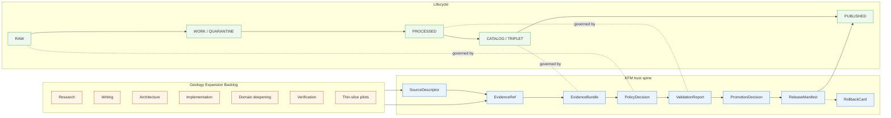

<!-- [KFM_META_BLOCK_V2]
doc_id: kfm://doc/docs-domains-geology-expansion-backlog
title: Geology Expansion Backlog
type: standard
subtype: domain-expansion-backlog
version: v0.2
status: draft
owners: <geology-domain-steward> · <docs-steward>   # PLACEHOLDERS — assign in PR
created: 2026-05-16
updated: 2026-06-03
policy_label: public
authoring_session: Docs-only. No mounted repo, CI run, workflow, dashboard, runtime log, or release artifact inspected. Implementation maturity is bounded per the current-session evidence limit.
authority_posture: Domain-scoped backlog register. Subordinate to ai-build-operating-contract.md (CONTRACT_VERSION 3.0.0), directory-rules.md, and accepted ADRs. Supersedes no source doctrine.
related:
  - docs/domains/geology/README.md            # PROPOSED placement; NEEDS VERIFICATION
  - docs/domains/geology/SOURCES.md            # PROPOSED placement; NEEDS VERIFICATION
  - docs/domains/geology/POLICY.md             # PROPOSED placement; NEEDS VERIFICATION
  - docs/registers/VERIFICATION_BACKLOG.md     # PROPOSED placement; NEEDS VERIFICATION
  - docs/registers/DRIFT_REGISTER.md           # PROPOSED placement; NEEDS VERIFICATION
  - control_plane/verification_backlog.yaml    # PROPOSED placement; NEEDS VERIFICATION
  - docs/doctrine/directory-rules.md           # v1.3 — canonical placement doctrine
  - docs/doctrine/ai-build-operating-contract.md   # CONTRACT_VERSION 3.0.0 — canonical operating contract
  - docs/runbooks/geology/SOURCE_REFRESH_RUNBOOK.md   # PROPOSED; subfolder convention pending ADR-S-13
truth_labels: [CONFIRMED, INFERRED, PROPOSED, NEEDS VERIFICATION, UNKNOWN, CONFLICTED]
tags: [kfm, domain, geology, backlog, expansion, governance, doctrine-adjacent]
notes:
  - "Domain-scoped expansion backlog. The cross-cutting backlog lives in docs/registers/ and control_plane/."
  - "All implementation-layer claims are PROPOSED until verified against a mounted repository."
  - "Related-doc paths are PROPOSED placeholders pending repo verification."
  - "Doctrine-adjacent: pins CONTRACT_VERSION = 3.0.0 (ai-build-operating-contract.md). Receipts and PRs reference this version."
  - "v0.2 surfaces the contracts/schemas path-form drift (segment vs flat) as CONFLICTED — see CDR-GEOL-01. v0.1 quietly used the segment form."
[/KFM_META_BLOCK_V2] -->

<a id="top"></a>

# Geology Expansion Backlog

> **Working backlog of expansion work for the Geology and Natural Resources domain — research, writing, architecture, implementation, verification, and thin-slice pilots — ordered by priority and tied to admissible KFM proof markers.**


| Field | Value |
|---|---|
| **Document type** | Domain expansion backlog (standard doc, doctrine-adjacent) |
| **Status** | `draft` |
| **Owners** | `<geology-domain-steward>` · `<docs-steward>` *(placeholders — assign in PR)* |
| **Authority of the framing** | **CONFIRMED** — domain backlog pattern is established KFM doctrine. |
| **Authority of specific items** | **PROPOSED** — see truth labels per row. No implementation maturity is asserted. |
| **Domain identity citation** | `[DOM-GEOL]` / `[ENCY §7.8]` — Geology and Natural Resources (Atlas Ch. 10). |
| **Path basis** | Directory Rules §12 Domain Placement Law; canonical home **CONFLICTED** between segment form (`…/v1/domains/geology/`, DIRRULES §6.3–§6.4) and flat form (`…/v1/geology/`, Atlas §24.13 / ENCY §7.1) — see [CDR-GEOL-01](#10-risks-sensitivity-posture-and-rollback-notes). |
| **Contract pin** | `CONTRACT_VERSION = "3.0.0"` (`ai-build-operating-contract.md`). |
| **Updated** | 2026-06-03 |

---

## Contents

1. [Purpose and scope](#1-purpose-and-scope)
2. [Authority, truth posture, and scope boundaries](#2-authority-truth-posture-and-scope-boundaries)
3. [How this backlog fits the KFM trust spine](#3-how-this-backlog-fits-the-kfm-trust-spine)
4. [Backlog organization](#4-backlog-organization)
5. [High-priority backlog](#5-high-priority-backlog)
6. [Medium-priority backlog](#6-medium-priority-backlog)
7. [Low-priority backlog](#7-low-priority-backlog)
8. [Thin-slice and pilot proposals](#8-thin-slice-and-pilot-proposals)
9. [Geology verification backlog (carryover)](#9-geology-verification-backlog-carryover)
10. [Risks, sensitivity posture, and rollback notes](#10-risks-sensitivity-posture-and-rollback-notes)
11. [Open questions register](#11-open-questions-register)
12. [Promotion criteria — how items leave this backlog](#12-promotion-criteria--how-items-leave-this-backlog)
13. [Related docs and cross-references](#13-related-docs-and-cross-references)
14. [Open verification backlog](#14-open-verification-backlog)
15. [Changelog](#15-changelog)
16. [Definition of done](#16-definition-of-done)
17. [Appendix A — Geology source-family anchor list](#appendix-a--geology-source-family-anchor-list)
18. [Appendix B — Backlog item template](#appendix-b--backlog-item-template)

---

## 1. Purpose and scope

This document is the **domain-scoped working backlog** for Geology and Natural Resources. It enumerates the expansion work — research, writing, architecture, implementation, domain deepening, verification, and thin-slice pilots — that the Geology lane needs in order to advance from CONFIRMED doctrine to PROPOSED-then-CONFIRMED implementation, while honoring KFM's lifecycle, evidence, policy, sensitivity, and release controls.

**It is not**:

- a release plan (release decisions live in `release/` and the publication path);
- a roadmap of features for public consumption (those follow `LayerManifest` and `ReleaseManifest` once items here are closed);
- a single source of truth for cross-cutting expansion work (that lives at `docs/registers/VERIFICATION_BACKLOG.md` and `control_plane/verification_backlog.yaml`, PROPOSED paths per Directory Rules §6.2).

**It is**: a focused, citation-bearing inventory of what Geology owes the trust membrane before broadening, and what proof-of-closure each owed item must produce.

> [!IMPORTANT]
> Every item in this backlog inherits the Geology sensitivity posture: **exact borehole, sample, sensitive resource, well-log, and private-well locations default to restricted or generalized public geometry**, and resource-class claims (occurrence / deposit / estimate / permit / production / reserve) **must remain distinct**. No item below relaxes that posture. CONFIRMED doctrine (`[DOM-GEOL §I]`, `[ENCY §7.8]`).

[⬆ back to top](#top)

---

## 2. Authority, truth posture, and scope boundaries

### 2.1 Authority chain

| Layer | Authority for this backlog | Truth label |
|---|---|---|
| KFM operating contract (`ai-build-operating-contract.md`, `CONTRACT_VERSION = "3.0.0"`) | Canonical spine; governs every row | **CONFIRMED** |
| KFM core invariants and doctrine (lifecycle, trust membrane, cite-or-abstain, watcher-as-non-publisher) | Governs every row | **CONFIRMED** |
| Accepted ADRs amending Directory Rules or schema homes | Governs naming, placement, and contract authority for items below | **CONFIRMED** (when ADR is accepted) |
| Directory Rules (`docs/doctrine/directory-rules.md`, v1.3) | Decides where each derived artifact lives | **CONFIRMED** (rules); **PROPOSED** (per-path applicability until mounted repo verifies) |
| Geology domain doctrine (`[DOM-GEOL]`, `[ENCY §7.8]`, Atlas Ch. 10) | Decides scope, ownership, source families, viewing products | **CONFIRMED** |
| Per-row implementation specifics (paths, schema names, validator commands, CI shape, dashboard URLs) | Treated as proposals only | **PROPOSED** / **NEEDS VERIFICATION** |

### 2.2 Truth posture

This document follows KFM's **cite-or-abstain** posture. Items are labeled:

- **CONFIRMED** — verified in this session from attached project doctrine (encyclopedia, atlas, build manual, operating contract, idea index) or Directory Rules.
- **PROPOSED** — design, recommendation, file path, or backlog framing not yet verified in a mounted repository.
- **INFERRED** — reasonably derivable from visible evidence but not directly stated.
- **NEEDS VERIFICATION** — checkable, but not yet checked strongly enough to act as fact.
- **CONFLICTED** — sources disagree, or doctrine and implementation appear inconsistent; held until an ADR or drift-register entry resolves it.
- **UNKNOWN** — not resolvable in this session.

> [!NOTE]
> The vast majority of "Status" cells in this file are **PROPOSED**. That is deliberate. Until a mounted repo is inspected, implementation-maturity claims (paths, tests, validators, workflows, package versions, dashboards) are not promoted to CONFIRMED. The framing of the backlog itself, the geology domain identity, and the lifecycle gates are CONFIRMED doctrine.

### 2.3 Out of scope

- **Object-family meaning**. Lives in `contracts/…/geology/` *(home **CONFLICTED** per [CDR-GEOL-01](#10-risks-sensitivity-posture-and-rollback-notes); Directory Rules §6.3 shows the `contracts/domains/<domain>/` segment form, Atlas §24.13 shows the flat `contracts/geology/` form)*.
- **Field-level schema shape**. Lives in `schemas/contracts/v1/…/geology/` *(home **CONFLICTED** per [CDR-GEOL-01](#10-risks-sensitivity-posture-and-rollback-notes); ADR-0001 fixes the schema *root* at `schemas/contracts/v1/`, but the segment-vs-flat sub-path is unresolved)*.
- **Source admissibility decisions**. Lives in `policy/…/geology/` and `data/registry/sources/geology/` (PROPOSED).
- **Release decisions**. Live in `release/candidates/geology/` and `release/` proper (PROPOSED).
- **Cross-cutting expansion items** that are not geology-specific. Those belong to `docs/registers/VERIFICATION_BACKLOG.md` or the cross-cutting Pass-20-style expansion register, not here.

[⬆ back to top](#top)

---

## 3. How this backlog fits the KFM trust spine

The diagram below shows where backlog items in this document feed the geology lane and how they pass through the KFM trust spine before any public surface is touched. **PROPOSED diagram** — labels reflect doctrine, not verified implementation.



> [!TIP]
> Read the diagram as: every backlog row exists to *produce or strengthen* at least one trust-spine object so the geology lane can move governed state through the lifecycle. A row that produces neither a source descriptor, an evidence-bundle artifact, a policy decision, a validation report, a promotion decision, nor a release/rollback object is **probably mis-categorized** and should be reconsidered or moved to a different lane.

[⬆ back to top](#top)

---

## 4. Backlog organization

### 4.1 Tracks

The geology backlog uses six tracks aligned to the cross-cutting expansion-agenda pattern used elsewhere in the corpus (`[KFM-IDX-PLN-003]` — domain lanes are proof-bearing slices). Track choice does not change priority; tracks group similar work for sequencing and reviewer assignment.

| Track | What it produces | Typical first artifact |
|---|---|---|
| **R — Research** | Source-rights and standards research outputs that unblock activation | Source-currentness report, rights memo |
| **W — Writing** | Doctrine / runbook / explainer Markdown that closes a documentation gap | `docs/domains/geology/<topic>.md` |
| **A — Architecture** | Schema-home, contract, and API-surface decisions (often ADR-required) | ADR draft, schema sketch |
| **I — Implementation** | Validators, fixtures, sidecars, governed-API mocks, viewer bindings | `schemas/…`, `tests/…`, `fixtures/…` |
| **D — Domain deepening** | Geology-specific anti-collapse and cross-lane proofs | Multi-source-role fixture pack |
| **V — Verification** | Repo and external-source verification passes that promote PROPOSED → CONFIRMED | `RepoEvidenceReport`, `SourceCurrentnessReport` |
| **P — Pilots / thin slices** | Closed, county-scale proof-bearing slices | Thin-slice fixture pack + drawer payload |

### 4.2 Priority semantics

| Priority | Meaning |
|---|---|
| **High** | Load-bearing for the next geology release candidate; blocks multiple downstream items; or proves a load-bearing invariant. |
| **Medium** | Important and well-defined, but not blocking the immediate proof lane. |
| **Low** | Valuable but lower-leverage; should not be scheduled ahead of any unblocked High or Medium item. |

### 4.3 ID format (PROPOSED)

Each row carries a stable ID of the form **`GEOL-EXP-NNN`** (zero-padded three digits). The prefix `GEOL-EXP-` is **PROPOSED** and chosen to be unambiguous against the cross-cutting `EXP-NNN` IDs used in Pass-20-style registers. IDs are stable once assigned and **MUST NOT** be reused; closed items move to the appendix or the canonical-lineage register rather than being deleted.

[⬆ back to top](#top)

---

## 5. High-priority backlog

> [!IMPORTANT]
> High-priority rows are the minimum geology lane work needed to demonstrate **catalog/proof closure on one geologic-unit + borehole + cross-section thin slice** — the geology "first credible thin slice" per `[ENCY §7.8]` / `[DOM-GEOL §N]`.

| ID | Track | Title | Status | First artifact | Proof-of-closure marker |
|---|---|---|---|---|---|
| GEOL-EXP-001 | R / V | KGS + KCC source-rights and cadence verification | **NEEDS VERIFICATION** | `SourceRightsDecision` matrix entries for KGS data/maps, KGS surficial, KGS oil & gas, KGS LAS digital well logs, KGS/KDHE WWC5, KCC oil & gas | Each source either activated with rights + cadence + endpoint recorded, or denied with reason; no public artifact references an unverified source. `[DOM-GEOL §D]` `[ENCY §7.8.B]` |
| GEOL-EXP-002 | I | Geology source-role validator + no-network fixtures | **PROPOSED** | `tests/…/geology/source_role/*` plus `fixtures/…/geology/source_role/*` (authority / observation / context / model) | Mismatched-role fixture is denied; aligned-role fixture is accepted; rights-denied fixture is denied with a useful `ValidationReport`. `[DOM-GEOL §K]` |
| GEOL-EXP-003 | I / A | Resource-class anti-collapse test suite | **PROPOSED** | Six paired fixtures covering Occurrence vs. Deposit vs. Estimate vs. Permit vs. Production vs. Reserve | A fixture that collapses any two classes is denied; a fixture that preserves them is accepted; release dry-run records the resource-class lineage in the `EvidenceBundle`. `[DOM-GEOL §I]` `[ENCY §7.8.A]` |
| GEOL-EXP-004 | A | Public-safe geometry policy + transform-receipt schema for geology | **PROPOSED** | `policy/…/geology/public_safe_geometry.policy.json` (PROPOSED path) + a `RedactionReceipt`-class geoprivacy transform-receipt schema under the geology schema home (PROPOSED path; subject to [CDR-GEOL-01](#10-risks-sensitivity-posture-and-rollback-notes)) | High-precision request for a sensitive borehole, well log, sample, or private well denied; generalized request granted only with a transform receipt resolvable through `EvidenceRef`. `[DOM-GEOL §I]` |
| GEOL-EXP-005 | I / D | Borehole + well-log + private-well rights gate | **PROPOSED** | Rights gate validator + `data/registry/sources/geology/` entries with `rights_class`, `redistribution_class`, and `sensitivity_class` fields (PROPOSED schema) | Borehole/well-log/private-well promotion is denied without rights closure; closed cases emit a `PromotionDecision` referencing the rights evidence. `[DOM-GEOL §I §K]` |
| GEOL-EXP-006 | I | One-county Geologic Unit thin-slice fixture pack | **PROPOSED** | `fixtures/…/geology/thin_slice_<county>/` (PROPOSED path) containing GeologicUnit, BoreholeReference, CrossSection, LayerManifest, EvidenceBundle, ReleaseManifest dry run | Catalog closure passes; `EvidenceRef` resolves to `EvidenceBundle`; Evidence Drawer payload renders public-safe; rollback target is exercised at least once. `[ENCY §7.8]` |
| GEOL-EXP-007 | V | Verification of validator exit-code contract for geology gates | **NEEDS VERIFICATION** | Confirmed exit-code mapping (ANSWER / ABSTAIN / DENY / ERROR) for each geology validator; ADR if the cross-cutting contract is not yet decided | Each finite outcome is reproducible; CI surfaces the outcome distinctly. References OPEN-DR-03 (validator exit-code contract canonicalization). *Open question — flagged for ADR resolution.* |
| GEOL-EXP-008 | A / I | Schema-home reconciliation for geology contracts and schemas | **CONFLICTED** | Drift-register entry [CDR-GEOL-01](#10-risks-sensitivity-posture-and-rollback-notes) + ADR confirming the geology sub-path under the ADR-0001 schema root; any pre-existing divergent home is mirrored or frozen | One canonical home; no parallel divergence. The schema *root* (`schemas/contracts/v1/`) is CONFIRMED via ADR-0001; the **segment-vs-flat sub-path is CONFLICTED** and must be resolved by ADR before new schemas land. `[DIRRULES §6.3 §6.4 §24.13]` |

> [!CAUTION]
> Rows **GEOL-EXP-001**, **GEOL-EXP-004**, and **GEOL-EXP-005** sit at the rights / sensitivity boundary. They MUST NOT be marked closed by tooling alone; closure requires a recorded steward review per `[DOM-GEOL §L]` and a stored `PolicyDecision` artifact.

[⬆ back to top](#top)

---

## 6. Medium-priority backlog

| ID | Track | Title | Status | First artifact | Proof-of-closure marker |
|---|---|---|---|---|---|
| GEOL-EXP-009 | I | Catalog-closure validator for geology | **PROPOSED** | `tests/…/geology/catalog_closure/*` + closure rubric | Missing-evidence and stale-source fixtures denied; closed fixtures emit a `RunReceipt` with digest closure. `[DOM-GEOL §K]` |
| GEOL-EXP-010 | I / D | Geology Evidence Drawer payload (geologic unit + borehole + cross-section) | **PROPOSED** | `EvidenceDrawerPayload` fixture set covering ANSWER / ABSTAIN / DENY / ERROR | Each state renders correctly against a no-network mock governed API; no path bypasses `EvidenceBundle`. `[DOM-GEOL §J]` `[GAI]` |
| GEOL-EXP-011 | I | Geology LayerManifest validator + MapLibre renderer-binding tests | **PROPOSED** | `LayerManifest` schema usage + renderer-binding fixtures for bedrock / surficial / structure / borehole-generalized / extraction-context layers | A LayerManifest that fails renderer-binding contracts is denied at publication; a passing manifest is accepted with a release-candidate decision. `[DOM-GEOL §G §J]` `[MAP-MASTER]` |
| GEOL-EXP-012 | I | AI evidence-before-model gate for geology Focus Mode | **PROPOSED** | `RuntimeResponseEnvelope` + `AIReceipt` fixtures requiring `EvidenceBundle` resolution before model output | Uncited or hallucinated geology answer denied; cited answer accepted; rights/sensitivity denials surface DENY with a steward-reviewable reason. `[DOM-GEOL §L]` `[GAI]` |
| GEOL-EXP-013 | W | Geology Evidence Drawer language guide (geology entries) | **PROPOSED** | `docs/domains/geology/EVIDENCE_DRAWER_LANGUAGE.md` (PROPOSED path) | Prose patterns for withheld precision, generalized geometry, stale source, abstention, and resource-class clarification, each tied to a fixture. |
| GEOL-EXP-014 | A | Cross-section + 3D subsurface admission rule | **PROPOSED** | ADR or registered convention referencing the Planetary/3D domain admission rule (`[ENCY §7.16]`, Atlas Ch. 18) | A 3D cross-section cannot be promoted without `SceneManifest`, `RepresentationReceipt`, and an evidence burden that justifies the upgrade from 2D. |
| GEOL-EXP-015 | D | Hydrostratigraphy relation to Hydrology (anti-replacement rule) | **PROPOSED** | Cross-lane relation fixture binding `HydrostratigraphicUnit` to Hydrology context without owning Hydrology measurements | A fixture that tries to publish a Hydrology measurement via the geology lane is denied. `[DOM-GEOL §F]` |
| GEOL-EXP-016 | I | KGS Geoportal / KGS LAS log harvester PROPOSED-WORK lane | **PROPOSED** | Source-watch sidecar fixture + `PROPOSED_WORK_RECORD` for KGS-driven candidate updates | Material-change candidate is generated only when a fixture mutates; clean fixture produces no candidate; missing attestation is denied. *Watcher-as-non-publisher invariant applies — see Appendix B note.* |
| GEOL-EXP-017 | W | Source-role matrix for geology source families | **PROPOSED** | `docs/domains/geology/SOURCE_ROLE_MATRIX.md` (PROPOSED path) | Each source family listed with role(s), rights class, sensitivity posture, cadence, and reference to its `SourceDescriptor` registry entry. |
| GEOL-EXP-018 | V | External-standards crosswalk verification (ISO 19115, STAC, DCAT, GeoSPARQL) for geology layers | **NEEDS VERIFICATION** | Crosswalk note per layer family referencing `docs/standards/*` profiles | Each geology layer family maps cleanly to a profile, or the gap is recorded with an open question. |

[⬆ back to top](#top)

---

## 7. Low-priority backlog

| ID | Track | Title | Status | First artifact | Proof-of-closure marker |
|---|---|---|---|---|---|
| GEOL-EXP-019 | D | Geochemistry anomaly analytical-function fixture | **PROPOSED** | Geochemistry anomaly compute + receipt | A computed anomaly is accompanied by an `AnalyticalReceipt` referencing source samples and method; consumer surfaces show uncertainty. `[ENCY §7.8]` |
| GEOL-EXP-020 | D | Reclamation status timeline view (proof-bearing slice) | **PROPOSED** | `ReclamationRecord` fixture + time-aware view | Time slider correctly distinguishes observed, valid, retrieval, release, and correction times. `[DOM-GEOL §E]` |
| GEOL-EXP-021 | W | Geology FAQ for public-safe geometry and resource-class confusion | **PROPOSED** | `docs/domains/geology/FAQ.md` (PROPOSED path) | Answers grounded in CONFIRMED doctrine with links to the relevant `EvidenceBundle` patterns. |
| GEOL-EXP-022 | I | Stratigraphic-correlation export contract | **PROPOSED** | DTO + JSON Schema for `StratigraphicCorrelation` exports | A correlation export carries identity, source roles, and citation; consumers cannot publish a correlation without a backing bundle. |

[⬆ back to top](#top)

---

## 8. Thin-slice and pilot proposals

The KFM doctrine recommends shipping new domain work as **proof-bearing thin slices** rather than broad horizontal coverage (`[KFM-IDX-PLN-003]` — *"Domain lanes are proof-bearing slices"*). The geology thin-slice plan recorded in the encyclopedia is summarized below.

> **CONFIRMED doctrine** *(paraphrased from `[ENCY §7.8]` / `[DOM-GEOL §N]`):* the first geology slice is a single-county geologic-unit fixture carrying borehole / cross-section evidence, public-safe generalized resource context, and an `EvidenceBundle`-backed unit inspector.

### 8.1 First pilot — One-county geologic-unit thin slice

| Aspect | Value |
|---|---|
| **ID** | GEOL-PILOT-001 |
| **Status** | **PROPOSED** |
| **AOI** | One Kansas county (TBD by steward review; selection criteria PROPOSED) |
| **Inputs** | KGS surficial/bedrock unit polygons; BoreholeReference subset; one CrossSection; one Mineral Occurrence summary (generalized); 3DEP terrain context |
| **Trust-spine objects produced** | `SourceDescriptor` (per source); `EvidenceRef` → `EvidenceBundle`; `LayerManifest`; `PolicyDecision`; `ValidationReport`; `PromotionDecision`; `ReleaseManifest` (dry-run); `RollbackCard` |
| **Proof-of-closure** | Catalog closure passes; Evidence Drawer renders public-safe; Focus Mode abstains when evidence is insufficient and denies where rights/sensitivity bar an answer; rollback drill exercised. |
| **Out of scope** | Live network ingestion; exact private-well coordinates; production volumes from non-public sources; AI inferences that would synthesize unreleased evidence. |
| **Rollback path** | Revert the geology `LayerManifest`; mark candidate `withdrawn`; record `CorrectionNotice`. |

### 8.2 Second pilot — Borehole/well-log rights gate

| Aspect | Value |
|---|---|
| **ID** | GEOL-PILOT-002 |
| **Status** | **PROPOSED** |
| **Purpose** | Prove the deny-by-default behavior for borehole, well-log, and private-well rights without exposing any real exact location. |
| **Inputs** | Synthetic borehole / WWC5-shaped / well-log fixtures with deliberately varied rights, sensitivity, and source roles. |
| **Proof-of-closure** | Rights-missing fixture denied; rights-closed fixture granted with generalized geometry only; transform receipt resolvable through `EvidenceRef`. |

### 8.3 Third pilot — Resource-class anti-collapse demonstration

| Aspect | Value |
|---|---|
| **ID** | GEOL-PILOT-003 |
| **Status** | **PROPOSED** |
| **Purpose** | Demonstrate that Occurrence / Deposit / Estimate / Permit / Production / Reserve cannot collapse to a single "resource" class. |
| **Inputs** | Six paired fixtures, one per class, each with a distinct source role and `EvidenceBundle` lineage. |
| **Proof-of-closure** | A deliberately collapsed fixture is denied; the six distinct fixtures publish to a public-safe summary that preserves the distinctions in the drawer. |

> [!NOTE]
> The AOI for **GEOL-PILOT-001** is intentionally left open. Selection criteria — evidence richness, low sensitivity load, presence of representative borehole and cross-section material, steward review feasibility — should be recorded as a short memo before the AOI is fixed.

[⬆ back to top](#top)

---

## 9. Geology verification backlog (carryover)

These items are carried forward in substance from `[DOM-GEOL §N]` and `[ENCY §7.8]` and remain **NEEDS VERIFICATION** until a mounted repository can confirm.

| # | Item to verify | Evidence that would settle it | Status |
|---|---|---|---|
| V-01 | Verify KGS and KCC source descriptors. | Mounted repo files, schemas, registry entries, tests, logs, emitted artifacts, review records, or release manifests. | **NEEDS VERIFICATION** |
| V-02 | Verify borehole / well-log public policy. | Same as above; plus a recorded `PolicyDecision`. | **NEEDS VERIFICATION** |
| V-03 | Define resource classification scheme and tests. | Same as above; plus anti-collapse test results. | **NEEDS VERIFICATION** |
| V-04 | Verify geology API, MapLibre, and Evidence Drawer integration. | Same as above; plus governed-API contract conformance. | **NEEDS VERIFICATION** |
| V-05 | Verify validator exit-code contract for geology gates (ADR-pending). | An accepted ADR or a documented cross-cutting validator contract (OPEN-DR-03). | **NEEDS VERIFICATION** |
| V-06 | Verify naming reconciliation for provenance docs (`PROV.md` vs. `PROVENANCE.md`). | An accepted ADR or a corpus-wide rename PR (OPEN-DR-01). | **NEEDS VERIFICATION** |
| V-07 | Verify runbook subfolder convention for geology (`docs/runbooks/geology/…` vs. flat-prefix). | Repo evidence and Directory Rules cross-check (OPEN-DR-02 / ADR-S-13). | **NEEDS VERIFICATION** |

> [!TIP]
> Items here are eligible for graduation to the cross-cutting `docs/registers/VERIFICATION_BACKLOG.md` when they affect more than one domain. V-05 (OPEN-DR-03), V-06 (OPEN-DR-01), and V-07 (OPEN-DR-02 / ADR-S-13) are already tracked as corpus-wide open-DR items and should graduate.

[⬆ back to top](#top)

---

## 10. Risks, sensitivity posture, and rollback notes

The geology domain inherits a strict sensitivity posture. The table below restates the risks and the **doctrine-level mitigations**; it does not assert implementation.

| Risk | Mitigation (CONFIRMED doctrine) | Status of implementation |
|---|---|---|
| Rights uncertainty for KGS/KCC/USGS sources. | Block public release until source terms and redistribution class are recorded. `[ENCY §7.8.M]` | **PROPOSED** |
| Sensitive location exposure (exact borehole, sample, well log, private well, sensitive resource). | Default redaction / generalization; restricted views; geoprivacy transform receipts (`RedactionReceipt`). `[DOM-GEOL §I]` | **PROPOSED** |
| Resource-class collapse (Occurrence ↔ Deposit ↔ Estimate ↔ Permit ↔ Production ↔ Reserve). | Anti-collapse validators; source-role separation; distinct field surfaces. `[DOM-GEOL §I §K]` | **PROPOSED** |
| Source-authority confusion across KGS, USGS NGMDB / GeMS / MRDS, KCC, KDHE. | Source-role registry; separate observation / model / regulatory / context contexts. `[DOM-GEOL §D]` | **PROPOSED** |
| False precision in cross-sections, surfaces, or 3D voxels. | Show uncertainty / support; scale badges; source-role badges; abstain on over-precise claims. `[DOM-GEOL §G]` | **PROPOSED** |
| AI hallucination on geology Focus Mode. | Citation validation; finite outcomes; no direct model-to-public path. `[DOM-GEOL §L]` `[GAI]` | **PROPOSED** |
| Stale geologic interpretations or out-of-date production records. | Freshness badges; retrieval / source / release time; stale-state policy. `[ENCY §7.8.M]` | **PROPOSED** |
| Rollback complexity for layered geology releases. | `ReleaseManifest` + `RollbackCard` + rollback drill for every release. `[ENCY §7.8.M]` | **PROPOSED** |

> [!WARNING]
> **CDR-GEOL-01 — Geology contract/schema path-form drift (CONFLICTED, ADR-class).**
> KFM doctrine carries **two live path forms** for a domain's contract and schema homes, and they disagree for geology:
> - **Segment form** *(Directory Rules §6.3, §6.4 trees)* — `contracts/domains/geology/` and `schemas/contracts/v1/domains/geology/`.
> - **Flat form** *(Atlas §24.13 Dossier-↔-Responsibility-Root crosswalk; Encyclopedia §7.1)* — `contracts/geology/` and `schemas/contracts/v1/geology/`.
>
> ADR-0001 fixes the schema **root** at `schemas/contracts/v1/`, but does **not** decide the segment-vs-flat sub-path. Per Directory Rules §2.5, affected paths are marked **PROPOSED / CONFLICTED** and divergent siblings MUST NOT be created until an ADR resolves it. This drift is tracked at **GEOL-EXP-008**, **Q-09**, and should be entered in `docs/registers/DRIFT_REGISTER.md`. *v0.1 of this backlog quietly used the segment form; v0.2 surfaces the conflict instead of choosing.*

<details>
<summary><strong>Doctrine-level rollback contract for any geology release (CONFIRMED)</strong></summary>

1. Every geology release **MUST** ship with a resolvable `RollbackCard` referencing the prior `ReleaseManifest`.
2. Rollback is a **governed state transition**, not a file delete: it produces a `CorrectionNotice` and updates the release-state register.
3. A rollback drill **SHOULD** be performed at least once before the first public geology release.
4. Public clients **MUST NOT** read the canonical store directly during or after rollback; they read through the governed API only. `[DIRRULES]` `[GAI]`

</details>

[⬆ back to top](#top)

---

## 11. Open questions register

Open questions tied to this backlog. Each gets a stable ID and is eligible for promotion to `docs/registers/VERIFICATION_BACKLOG.md` or an ADR when scope is decided.

| ID | Question | Owner placeholder | Status |
|---|---|---|---|
| Q-01 | What is the canonical home for the geology validator exit-code contract — geology lane only, or cross-cutting (OPEN-DR-03)? | `<docs-steward>` · `<geology-steward>` | **UNKNOWN** — pending ADR. |
| Q-02 | Should the geology source-role taxonomy expand beyond *authority / observation / context / model* to distinguish *regulatory* from *operational* (e.g., KCC production filings)? | `<geology-steward>` | **UNKNOWN** |
| Q-03 | What public-safe generalization level (rounding precision, grid binning, or polygon-of-uncertainty) applies to KGS LAS well-log location surfaces? | `<geology-steward>` · `<policy-steward>` | **NEEDS VERIFICATION** |
| Q-04 | How should geology cross-sections that depend on hydrostratigraphy declare their dependency on Hydrology evidence without claiming Hydrology authority? | `<geology-steward>` · `<hydrology-steward>` | **PROPOSED design** |
| Q-05 | What is the relationship between `PROV.md` and `PROVENANCE.md` (OPEN-DR-01)? *(Open repo-wide naming discrepancy.)* | `<docs-steward>` | **NEEDS VERIFICATION** — pending ADR. |
| Q-06 | Is `docs/runbooks/geology/` the agreed subfolder convention for domain-scoped runbooks, parallel to `docs/runbooks/fauna/` (OPEN-DR-02 / ADR-S-13)? | `<docs-steward>` | **NEEDS VERIFICATION** — pending ADR. |
| Q-07 | Which Kansas county is the right AOI for **GEOL-PILOT-001**? Selection memo PROPOSED. | `<geology-steward>` | **UNKNOWN** |
| Q-08 | Does the geology domain need a `kfm:` namespace IRI registration for stable cross-references in graph projections? | `<docs-steward>` · `<governance-steward>` | **UNKNOWN** — corpus-wide question (`[ENCY]`, `[KFM-IDX]`). |
| Q-09 | Segment form vs. flat form for `contracts/…/geology/` and `schemas/contracts/v1/…/geology/` (CDR-GEOL-01)? | `<docs-steward>` · `<governance-steward>` | **CONFLICTED** — pending ADR (ADR-0001 amendment or sibling). |

[⬆ back to top](#top)

---

## 12. Promotion criteria — how items leave this backlog

An item leaves this backlog only by one of the following governed routes. All routes preserve **default-deny promotion** (`[DIRRULES]`) and produce an auditable artifact.

| Route | Trigger | Resulting artifact | What gets removed from this backlog |
|---|---|---|---|
| **Closed by proof** | First artifact ships, proof-of-closure marker is verified by review, and at least one `RunReceipt` plus `ValidationReport` is recorded. | `PromotionDecision` (or `ReleaseManifest` for public artifacts). | The row, moved to **Appendix C — Closed items** *(file-local appendix to be added once the first row closes)* or to the canonical-lineage register. |
| **Superseded** | A newer item makes this one redundant. | ADR or backlog edit with `supersedes:` link. | The row, with a forward link recorded. |
| **Withdrawn** | The item is reclassified as out-of-scope for geology or moved to a different lane / register. | Drift-register entry or rationale memo. | The row, with reason recorded. |
| **Promoted cross-cutting** | The item is not geology-specific and is moved to `docs/registers/VERIFICATION_BACKLOG.md` or the cross-cutting expansion register. | Link to the new home; backlog entry replaced by a stub pointer. | The row body; a stub pointer remains until the cross-cutting item closes. |

> [!IMPORTANT]
> Closure **MUST NOT** be claimed for any sensitivity-bearing row (rights, exact-location, resource-class, AI behavior) without a recorded steward review. Tooling acceptance is necessary but not sufficient. `[DOM-GEOL §I §L]`.

[⬆ back to top](#top)

---

## 13. Related docs and cross-references

> [!NOTE]
> All paths below are **PROPOSED** until verified against a mounted repository. Authority for placement is Directory Rules §6 and §12; specific filename casing for register-style files follows the established `SCREAMING_SNAKE.md` pattern, and external-standard files follow the UPPERCASE-WITH-HYPHENS convention (Directory Rules §6.1.a).

**Within the geology lane**

- `docs/domains/geology/README.md` — Geology lane landing.
- `docs/domains/geology/SOURCES.md` — Source-family overview and rights/sensitivity matrix.
- `docs/domains/geology/POLICY.md` — Geology sensitivity, rights, and publication policy.
- `docs/domains/geology/EVIDENCE_DRAWER_LANGUAGE.md` — *(produced by GEOL-EXP-013)*.
- `docs/domains/geology/SOURCE_ROLE_MATRIX.md` — *(produced by GEOL-EXP-017)*.
- `docs/runbooks/geology/SOURCE_REFRESH_RUNBOOK.md` — Geology source-refresh runbook *(subfolder convention pending ADR-S-13 — Q-06)*.

**KFM doctrine and registers**

- `docs/doctrine/ai-build-operating-contract.md` — Canonical operating contract (`CONTRACT_VERSION = "3.0.0"`).
- `docs/doctrine/directory-rules.md` — Canonical placement rules (v1.3).
- `docs/registers/VERIFICATION_BACKLOG.md` — Cross-cutting verification backlog.
- `docs/registers/DRIFT_REGISTER.md` — Repo-vs-doctrine drift (CDR-GEOL-01 belongs here).
- `control_plane/verification_backlog.yaml` — Machine-readable mirror.
- `docs/standards/PROV.md` *(or `PROVENANCE.md` — pending ADR, Q-05 / OPEN-DR-01)* — Provenance profile.
- `docs/standards/ISO-19115.md` — ISO 19115 crosswalk and conformance profile.
- `docs/standards/PMTILES.md` — PMTiles governance profile.

**Cross-lane**

- `docs/domains/hydrology/` — Cross-lane relations via hydrostratigraphy (`[DOM-GEOL §F]`).
- `docs/domains/soil/` — Parent material and surficial context (`[DOM-GEOL §F]`).
- `docs/domains/hazards/` — Fault / landslide / subsidence context without owning risk (`[DOM-GEOL §F]`).
- `docs/domains/people-dna-land/` — Lease / parcel / operator relations that cannot prove deposits (`[DOM-GEOL §F]`).

[⬆ back to top](#top)

---

## 14. Open verification backlog

These items remain `NEEDS VERIFICATION` before this document is promoted from `draft` to `review`/`published`:

1. **Repo presence of every PROPOSED path** in §2.3, §5–§8, and §13 — confirm against a mounted repository.
2. **Owner assignment** — replace `<geology-domain-steward>` and `<docs-steward>` placeholders with real role/owner bindings.
3. **CDR-GEOL-01 resolution** — confirm the geology contract/schema sub-path form by ADR (segment vs flat); until then the home stays CONFLICTED.
4. **Validator exit-code contract** (OPEN-DR-03) — confirm the ANSWER/ABSTAIN/DENY/ERROR exit-code mapping for geology gates.
5. **Provenance doc naming** (OPEN-DR-01) — confirm `PROV.md` vs `PROVENANCE.md`.
6. **Runbook subfolder convention** (OPEN-DR-02 / ADR-S-13) — confirm `docs/runbooks/geology/`.
7. **GENERATED_RECEIPT.json wiring** — confirm the receipt for this AI-authored doc is wired into CI per `ai-build-operating-contract.md` §34.

[⬆ back to top](#top)

---

## 15. Changelog

| Version | Date | Change | Type | Reason |
|---|---|---|---|---|
| v0.1 | 2026-05-16 | Initial draft. Backlog tracks, High/Medium/Low rows, three pilots, carryover verification backlog, open questions, promotion criteria, two appendices. | new | First-pass domain backlog. |
| v0.2 | 2026-06-03 | Surfaced contract/schema path-form drift as **CDR-GEOL-01** (CONFLICTED); reframed GEOL-EXP-008 and §2.3 to stop asserting the segment form silently; added Q-09. | reconciliation | Atlas §24.13 / ENCY §7.1 flat form conflicts with DIRRULES §6.3–§6.4 segment form; doctrine requires surfacing, not silent choice (DIRRULES §2.5). |
| v0.2 | 2026-06-03 | Added `CONTRACT_VERSION = "3.0.0"` pin (badge, meta block, authority chain) and operating-contract reference. | new | Doc is doctrine-adjacent; receipts/PRs reference a stable contract version. |
| v0.2 | 2026-06-03 | Added companion sections (Open verification backlog, Changelog, Definition of done) per the doctrine-doc pattern. | enhancement | Aligns with `ai-build-operating-contract.md` / `authority-ladder.md` companion-section convention. |
| v0.2 | 2026-06-03 | Cross-referenced OPEN-DR-01/02/03 and ADR-S-13 against V-05/06/07 and Q-05/06; tightened citations; refreshed `updated` date and badges. | clarification | Tie domain-local items to corpus-wide open-DR tracking. |

> **Backward compatibility.** All `GEOL-EXP-NNN`, `GEOL-PILOT-NNN`, `V-NN`, and `Q-NN` IDs and their anchors are preserved. Section anchors are unchanged except for the appended sections (§14–§16) and a `#top` anchor; "back to top" links now target `#top` rather than `#contents` (the `#contents` heading remains present).

[⬆ back to top](#top)

---

## 16. Definition of done

This document is done enough to enter the repository when:

- it is placed according to Directory Rules (geology lane under the agreed `docs/domains/geology/` home, pending CDR-GEOL-01 having no bearing on the *docs* path);
- a docs steward and the geology domain steward review it;
- it is linked from the geology lane README and a docs/doctrine index;
- it does not conflict with accepted ADRs;
- any conflict with current repo conventions (notably CDR-GEOL-01) is logged in `docs/registers/DRIFT_REGISTER.md`;
- the `GENERATED_RECEIPT.json` planned for this AI-authored doc is wired into CI per operating-contract §34;
- owner placeholders are replaced with real bindings;
- future changes follow the operating contract's §37 lifecycle.

[⬆ back to top](#top)

---

## Appendix A — Geology source-family anchor list

The table below mirrors the geology source families documented in `[ENCY §7.8.B]` and `[DOM-GEOL §D]` for convenient cross-reference from backlog rows. It is **NOT** the source registry; the registry lives in `data/registry/sources/geology/` (PROPOSED path per Directory Rules §6 — source identity belongs under `data/registry/`).

| Source family | Typical role(s) | Sensitivity flags | Doctrine citation |
|---|---|---|---|
| Kansas Geological Survey data and maps | authority / observation / context / model (as descriptor requires) | rights NEEDS VERIFICATION; sensitive joins fail closed | `[DOM-GEOL §D]` |
| KGS surficial geology and geologic maps | authority / observation / context | rights NEEDS VERIFICATION; sensitive joins fail closed | `[DOM-GEOL §D]` |
| USGS NGMDB and GeMS | authority / observation / context | rights NEEDS VERIFICATION; sensitive joins fail closed | `[DOM-GEOL §D]` |
| KGS oil and gas wells and production | observation / regulatory-adjacent | rights NEEDS VERIFICATION; sensitive joins fail closed | `[DOM-GEOL §D]` |
| KCC oil and gas regulatory data | regulatory / context | rights NEEDS VERIFICATION; sensitive joins fail closed | `[DOM-GEOL §D]` |
| KGS / KDHE WWC5 and water-well program | observation / regulatory-adjacent | rights NEEDS VERIFICATION; deny-by-default exact location | `[DOM-GEOL §D]` |
| KGS LAS digital well logs and well tops | observation / model | rights NEEDS VERIFICATION; deny-by-default exact location | `[DOM-GEOL §D]` |
| USGS MRDS | observation / context | rights NEEDS VERIFICATION; sensitive joins fail closed | `[DOM-GEOL §D]` |
| USGS 3DEP terrain (shared with Planetary/3D) | context / observation (terrain) | public-safe by default | `[DOM-GEOL §D]` `[ENCY §7.16]` |

> [!NOTE]
> Source-family roles above are recorded in `[DOM-GEOL §D]` as *"authority / observation / context / model as source role requires."* The per-family role narrowing shown here is **INFERRED** from each source's typical function and is **NEEDS VERIFICATION** against the eventual `SourceDescriptor` registry entries.

[⬆ back to top](#top)

---

## Appendix B — Backlog item template

When adding a new row, use this template. Keep the row terse; expand below the table only if a row needs prose context.

```text
| GEOL-EXP-NNN | <Track> | <Title> | <Status> | <First artifact path or name> | <Proof-of-closure marker, with doctrine citation> |
```

Long-form fields, if needed:

```text
- Priority: High | Medium | Low
- Why: <one or two sentences tying the row to a trust-spine object or invariant>
- Dependencies: <other GEOL-EXP-* IDs, ADRs, or upstream registers>
- Next step: <the single next concrete action>
- First artifact: <name and PROPOSED home>
- Proof-of-closure: <fixture / validator / receipt / decision that closes the row>
- Rollback / withdraw path: <how to back out if the row fails review>
- Doctrine citation: <[DOM-GEOL §X]> <[ENCY §7.8]> <[DIRRULES §Z]>
- Truth label: CONFIRMED | INFERRED | PROPOSED | NEEDS VERIFICATION | CONFLICTED | UNKNOWN
```

> [!NOTE]
> **Watcher-as-non-publisher invariant**: a row whose "first artifact" is a watcher or probe **MUST NOT** declare a `data/catalog/` or `data/published/` write as part of its proof-of-closure. Watchers emit receipts and candidate decisions only. `[DIRRULES]`

[⬆ back to top](#top)

---

### Related docs

- [Geology README](README.md) *(PROPOSED — produced separately)*
- [Geology sources](SOURCES.md) *(PROPOSED — produced separately)*
- [Geology policy](POLICY.md) *(PROPOSED — produced separately)*
- [AI Build Operating Contract](../../doctrine/ai-build-operating-contract.md) *(`CONTRACT_VERSION = "3.0.0"`)*
- [Directory Rules](../../doctrine/directory-rules.md)
- [Cross-cutting verification backlog](../../registers/VERIFICATION_BACKLOG.md) *(PROPOSED path)*
- [Drift register](../../registers/DRIFT_REGISTER.md) *(PROPOSED path — CDR-GEOL-01 lands here)*

**Last updated:** 2026-06-03 · **Doc version:** v0.2 · **Status:** draft · **Contract:** `CONTRACT_VERSION = "3.0.0"`

[⬆ back to top](#top)
