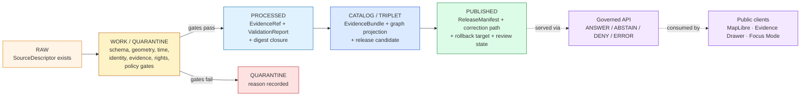
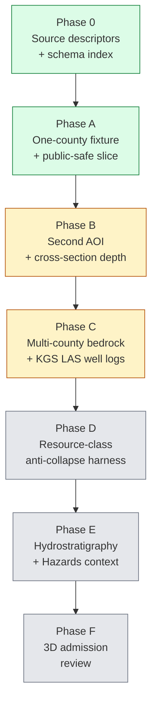

<!-- [KFM_META_BLOCK_V2]
doc_id: kfm://doc/domain-geology-expansion-plan
title: Geology and Natural Resources — Expansion Plan
type: standard
version: v0.1
status: draft
owners: <PLACEHOLDER — geology domain steward + release manager + policy admin>
created: 2026-05-16
updated: 2026-05-16
policy_label: public
related:
  - docs/domains/geology/README.md
  - docs/doctrine/lifecycle-law.md
  - docs/doctrine/trust-membrane.md
  - docs/doctrine/directory-rules.md
  - docs/architecture/governed-api.md
  - docs/adr/ADR-0001-schema-home.md
  - docs/registers/VERIFICATION_BACKLOG.md
  - docs/registers/DRIFT_REGISTER.md
tags: [kfm, domain, geology, natural-resources, expansion, thin-slice, planning]
notes:
  - PROPOSED placement under docs/domains/geology/ per Directory Rules §6.1 and §12.
  - All implementation-layer claims are PROPOSED until a mounted repo verifies them.
[/KFM_META_BLOCK_V2] -->

<a id="top"></a>

# Geology and Natural Resources — Expansion Plan

> Phased, thin-slice-first plan for promoting the KFM **Geology and Natural Resources** domain from CONFIRMED doctrine into proof-bearing, public-safe releases under the KFM trust membrane.


> [!IMPORTANT]
> **Status:** draft  ·  **Owners:** `<PLACEHOLDER — geology domain steward + release manager + policy admin>`  ·  **Updated:** 2026-05-16
>
> This is a **plan**, not an implementation record. Every claim about repository files, schemas, validators, tests, CI, routes, deployment, or runtime behavior is **PROPOSED** until verified against a mounted KFM repository.

---

## Contents

1. [Purpose and posture](#1-purpose-and-posture)
2. [Scope, boundary, and non-ownership](#2-scope-boundary-and-non-ownership)
3. [Pipeline shape (RAW → PUBLISHED)](#3-pipeline-shape-raw--published)
4. [Thin-slice plan (Phase A — one county)](#4-thin-slice-plan-phase-a--one-county)
5. [Phased expansion roadmap](#5-phased-expansion-roadmap)
6. [Source families and source roles](#6-source-families-and-source-roles)
7. [Source-role anti-collapse register (Geology)](#7-source-role-anti-collapse-register-geology)
8. [Sensitivity, rights, and public-safe posture](#8-sensitivity-rights-and-public-safe-posture)
9. [Validators, tests, and fixtures backlog](#9-validators-tests-and-fixtures-backlog)
10. [API, contract, and schema surfaces](#10-api-contract-and-schema-surfaces)
11. [Governed AI behavior for Geology](#11-governed-ai-behavior-for-geology)
12. [Cross-domain relations](#12-cross-domain-relations)
13. [Acceptance criteria and release gates](#13-acceptance-criteria-and-release-gates)
14. [Verification backlog and open questions](#14-verification-backlog-and-open-questions)
15. [Related docs](#15-related-docs)

---

## 1. Purpose and posture

This plan operationalizes the **Geology and Natural Resources** domain — bedrock and surficial geology, stratigraphy, lithology, structures, boreholes, well logs, cores, geophysics, geochemistry, mineral/resource distinctions, extraction and reclamation context, public-safe layers, and bounded AI — without turning interpretations or extraction records into unreviewed public truth. The mission statement is CONFIRMED doctrine; the realization is PROPOSED.

**Doctrinal anchors.** Three things govern this plan:

- **Trust membrane** — public clients consume only released artifacts through governed APIs; no public RAW/WORK/QUARANTINE/candidate path; no direct model client.
- **Lifecycle law** — `RAW → WORK/QUARANTINE → PROCESSED → CATALOG/TRIPLET → PUBLISHED`, with **promotion as a governed state transition**, not a file move.
- **Proof-bearing thin slices** — domain expansion is judged by closure (descriptor → evidence → policy → validation → release) on a small AOI, not by horizontal coverage.

> [!NOTE]
> **Cite-or-abstain.** Geology surfaces — including AI answers, Evidence Drawer payloads, layer manifests, and Focus Mode envelopes — default to **ABSTAIN** when evidence is insufficient and **DENY** when policy, rights, sensitivity, or release state blocks the request.

[⬆ Back to top](#top)

---

## 2. Scope, boundary, and non-ownership

CONFIRMED doctrine — the lists below are normative; field-level realization is PROPOSED.

### 2.1 Owns

The Geology domain owns the following canonical object families:

| Object family | Role |
|---|---|
| `GeologicUnit` | Bedrock and surficial polygon units |
| `Lithology` | Rock/sediment type description bound to a unit |
| `StratigraphicInterval` | Chronostratigraphic / lithostratigraphic interval |
| `GeologicAge` | Age assignment and its evidence basis |
| `FaultStructure` | Faults and other structural lines |
| `Borehole` | Borehole reference + location class |
| `WellLog` | LAS / digital well log reference |
| `CoreSample` | Physical core reference |
| `GeophysicalObservation` | Geophysics raster/profile reference |
| `GeochemistrySample` | Geochemistry sample reference |
| `MineralOccurrence` | Reported occurrence (observation) |
| `ResourceDeposit` | Named deposit (administrative/aggregate) |
| `ResourceEstimate` | Estimate (aggregate, modeled, or compiled) |
| `ExtractionSite` | Mine / well / quarry feature (sensitivity-tiered) |
| `ReclamationRecord` | Reclamation status record |
| `CrossSection` | 2D/2.5D subsurface section |
| `HydrostratigraphicUnit` | Hydrostratigraphy linkage to Hydrology |

### 2.2 Does **not** own

CONFIRMED / PROPOSED:

- Hydrology measurements (owned by Hydrology; Geology contributes hydrostratigraphic context only).
- Soils (owned by Soil; Geology contributes parent material / surficial context).
- Hazards **risk** (owned by Hazards; Geology contributes fault / landslide / subsidence **context** only).
- Ownership / lease / permit / title claims (owned by People/Land or Settlements).
- UI and AI statements (carriers, not authorities).

> [!CAUTION]
> **Anti-collapse invariant.** `MineralOccurrence`, `ResourceDeposit`, `ResourceEstimate`, permits, production records, and reserves are **not interchangeable**. They have different source roles, different temporal semantics, and different public-release postures. A query that joins them silently is a **DENY** condition at publication and an **ABSTAIN** at the AI surface.

[⬆ Back to top](#top)

---

## 3. Pipeline shape (RAW → PUBLISHED)

CONFIRMED lifecycle law; geology lane application PROPOSED.



**Gate summary (PROPOSED for Geology lane):**

| Stage | Gate |
|---|---|
| RAW | `SourceDescriptor` exists; rights, sensitivity, citation, time, hash captured. |
| WORK / QUARANTINE | Schema, geometry, time, identity, evidence, rights, policy gates; failures held in `quarantine` with a reason. |
| PROCESSED | `EvidenceRef`, `ValidationReport`, digest closure. |
| CATALOG / TRIPLET | `EvidenceBundle`, graph/triplet projection, release-candidate closure. |
| PUBLISHED | `ReleaseManifest`, `CorrectionNotice` path, `RollbackCard` target, review/policy state. |

[⬆ Back to top](#top)

---

## 4. Thin-slice plan (Phase A — one county)

CONFIRMED doctrine (encyclopedia thin-slice plan); PROPOSED implementation.

The first Geology release **is not** a state-wide bedrock map. It is:

> **One county `GeologicUnit` fixture with borehole/cross-section evidence, public-safe generalized resource context, and an `EvidenceBundle`-backed unit inspector.**

### 4.1 Slice contents

| Element | Description | Status |
|---|---|---|
| **AOI** | One Kansas county | PROPOSED — **steward decision**; criteria below |
| **`GeologicUnit` fixture** | Bedrock + surficial polygon set with `LayerManifest` | PROPOSED |
| **Borehole fixture** | ≥1 borehole with generalized public geometry + sensitivity transform receipt | PROPOSED |
| **`CrossSection`** | 1 cross-section linked to fixture boreholes | PROPOSED |
| **`MineralOccurrence` / `ResourceDeposit`** | Public-safe generalized resource context, **not** an estimate | PROPOSED |
| **`EvidenceBundle`** | Resolves every claim in the unit inspector | PROPOSED |
| **`LayerManifest` + `ReleaseManifest`** | Public-safe published layer | PROPOSED |
| **Evidence Drawer payload** | `ANSWER` / `ABSTAIN` / `DENY` states proven by fixture | PROPOSED |
| **Focus Mode answer (mock)** | Bounded summary citing the bundle; `ABSTAIN` on unsupported | PROPOSED |
| **`RollbackCard`** | Drill executed against the slice release | PROPOSED |

### 4.2 AOI selection criteria

> [!NOTE]
> The AOI is a **steward decision**, not a Claude decision. Candidates should be scored against the criteria below; the picked county is then recorded in an ADR or in `docs/registers/`.

| Criterion | Why it matters |
|---|---|
| **Evidence richness** | Existing KGS bedrock + surficial maps, KGS oil/gas, WWC5 wells, LAS well logs, NGMDB coverage. |
| **Source-rights clarity** | Terms for KGS, KCC, KDHE, USGS are documented and current. |
| **Sensitivity tractability** | Private well coordinates, sensitive resource sites, and proprietary log data can be generalized or excluded cleanly. |
| **Cross-domain test value** | Adjacent hydrology (hydrostratigraphy) and soil (parent material) evidence are available for cross-lane proof. |
| **Reclamation footprint** | Some active or historical extraction context is present to exercise `ReclamationRecord`. |

### 4.3 Slice closure checklist

- [ ] Source descriptors exist and resolve for every contributing source.
- [ ] Schema home decided per ADR-0001 (`schemas/contracts/v1/domains/geology/...`, PROPOSED).
- [ ] Public-safe geometry transform produces a **transform receipt** for every generalized feature.
- [ ] `EvidenceBundle` resolves for every claim in the unit inspector and the cross-section.
- [ ] `LayerManifest` references only `PUBLISHED` artifacts.
- [ ] `ReleaseManifest` and `RollbackCard` exist; rollback drill executed.
- [ ] Negative fixtures: missing rights → DENY; missing evidence → ABSTAIN; aggregate-as-per-place query → DENY.
- [ ] No-network dry run passes end-to-end.

[⬆ Back to top](#top)

---

## 5. Phased expansion roadmap

PROPOSED sequencing. Aligned with the Unified Build Manual greenfield phases and the IMPL-PIPE loop overlay; **does not** rename or extend greenfield phase identifiers.



### 5.1 Phase-by-phase summary

| Phase | Goal | Done criterion | Status |
|---|---|---|---|
| **0** — Bootstrap | `SourceDescriptor`s for KGS, KCC, KDHE-WWC5, USGS NGMDB/MRDS; schema home; offline fixtures; source-role policy | All descriptors validate; no-network fixture pass | PROPOSED |
| **A** — One-county slice | Section 4 thin-slice | All Section 4.3 checks pass; one release + rollback drill | PROPOSED |
| **B** — Second AOI + depth | Add a second county with `CrossSection` depth and ≥3 boreholes; exercise `CorrectionNotice` | Two releases, one supersession, one correction notice | PROPOSED |
| **C** — Bedrock multi-county | Extend bedrock + surficial coverage to a contiguous N-county block; ingest KGS LAS well-log references (not LAS payloads) | Multi-county `LayerManifest`; no rights violations | PROPOSED |
| **D** — Resource anti-collapse | Implement `MineralOccurrence` / `ResourceDeposit` / `ResourceEstimate` separation harness; add USGS MRDS context | Anti-collapse negative tests all DENY at publication | PROPOSED |
| **E** — Cross-domain | Hydrostratigraphic link to Hydrology; fault/landslide context to Hazards; parent-material to Soil | Cross-lane bundles resolve; ownership preserved | PROPOSED |
| **F** — 3D admission | Optional 3D subsurface view per 3D admission decision; `SceneManifest` + Reality Boundary Note | 3D admission gate passes; no-leak tests pass | PROPOSED |

> [!TIP]
> **Greenfield alignment.** Phases A–F sit *inside* greenfield phases that already require signing, attestation, watcher, and catalog closure (greenfield Phases 16–17 + Milestones M10–M11 per the Unified Build Manual). The geology lane does not introduce a new lifecycle phase; it instantiates the existing one.

[⬆ Back to top](#top)

---

## 6. Source families and source roles

CONFIRMED doctrine (Atlas v1.1 Ch. 10 §D); rights, cadence, and current terms **NEEDS VERIFICATION** per source.

| Source family | Typical role(s) | Sensitivity posture | Cadence | Status |
|---|---|---|---|---|
| Kansas Geological Survey — bedrock / surficial maps | Authority / Observation | Public-safe at unit polygon scale | Source-vintage | NEEDS VERIFICATION |
| KGS surficial geology and geologic maps | Authority / Observation | Public-safe; precision controls on outcrop points | Source-vintage | NEEDS VERIFICATION |
| USGS **NGMDB** and **GeMS** | Authority / Observation | Public-safe; preserve unit codes | Source-vintage | NEEDS VERIFICATION |
| KGS **oil & gas wells** and production | Administrative / Aggregate | Generalize private/proprietary fields; deny exact location for active sensitive wells | Operational | NEEDS VERIFICATION |
| **KCC** oil & gas regulatory data | Regulatory | Cite as regulatory context; never collapse with observation | Operational | NEEDS VERIFICATION |
| KGS/KDHE **WWC5** and water-well program | Administrative / Observation | Default-deny exact private well location; generalize | Operational | NEEDS VERIFICATION |
| KGS **LAS digital well logs** and well tops | Observation / Administrative (per log) | Strict rights review; LAS payloads excluded from public release by default | Source-vintage | NEEDS VERIFICATION |
| USGS **MRDS** mineral resources | Administrative / Aggregate | Generalize per occurrence sensitivity | Source-vintage | NEEDS VERIFICATION |
| USGS **3DEP** terrain | Observation (DEM) | Public | Operational | NEEDS VERIFICATION |

> [!WARNING]
> **No source activation without rights review.** A `SourceDescriptor` may exist in `RAW` for evaluation; promotion of its data into `PROCESSED` is blocked until rights, sensitivity, cadence, and steward are recorded.

[⬆ Back to top](#top)

---

## 7. Source-role anti-collapse register (Geology)

CONFIRMED doctrine (Atlas v1.1 Ch. 24 §24.1); PROPOSED implementation in this lane.

Geology is one of the domains the Atlas explicitly names as at-risk for the **aggregate-cited-as-per-place** collapse pattern. The table below makes the geology-specific collapse map explicit.

| Collapse pattern | Geology example | Required guardrail | Outcome on collapse |
|---|---|---|---|
| Modeled product labeled or queried as observed | `ResourceEstimate` returned as if it were an `Observation` at a point | Run receipt + uncertainty surface + role-preserving DTO field | **DENY** at publication; **ABSTAIN** at AI |
| Aggregate cited as a per-place truth | `MineralOccurrence` aggregate cell joined to a parcel as if it asserted that parcel | Aggregation receipt + geometry-scope guard + matrix-cell semantics | **DENY** join from aggregate cell to single record |
| Administrative compilation cited as observation | KGS oil & gas well roster cited as "production observed here" | Separate administrative-compilation and observation lanes | **DENY** publication of compilation as observed timeline |
| Regulatory determination cited as observation | KCC permit cited as "extraction confirmed" | Separate regulatory-context and observed-event lanes; UI banner | **DENY** publication of regulatory layer as event evidence |
| Candidate cited as authoritative | Quarantined connector output of a `Borehole` cited in a public layer | Promotion gate; never publish candidate | **DENY** publication |
| Synthetic cited as observed | AI-drafted unit summary or a reconstructed cross-section displayed without Reality Boundary Note | Reality Boundary Note + Representation Receipt | **DENY** sovereign display; AI **ABSTAIN** on reality-claim |

[⬆ Back to top](#top)

---

## 8. Sensitivity, rights, and public-safe posture

CONFIRMED / PROPOSED: exact borehole, sample, sensitive resource, well-log, and private-well locations default to **restricted or generalized** public geometry. Occurrence, deposit, estimate, permit, production, and reserve claims must remain distinct.

### 8.1 Sensitivity tiers (PROPOSED)

| Tier | Examples | Default public posture |
|---|---|---|
| **Open** | Bedrock unit polygons; 3DEP terrain; USGS NGMDB unit codes | Public-safe |
| **Generalize** | Borehole locations; `WellLog` references (not LAS payloads); mineral occurrence point footprints | Generalize to grid/township/county; **transform receipt required** |
| **Restricted** | LAS payload contents; private well exact coordinates; proprietary geochemistry; active extraction site exact location | Deny by default; steward-only behind governed API |
| **Deny** | Any unclear-rights source; any unresolved sensitivity; any active investigation flagged by steward | Deny; no public artifact |

### 8.2 Public-safe transforms

Every generalization or redaction must emit a **transform receipt** stating input class, output class, reason, policy, reviewer, and residual risk. Sensitive geometry **cannot be hidden by style alone** — it must be generalized or redacted **before** publication, with receipts.

```text
TransformReceipt (PROPOSED)
├── input_geometry_class        # exact, township, county, grid_N
├── output_geometry_class       # one of the above
├── transform_type              # suppress | generalize | buffer | jitter | delay
├── reason                      # policy_id / sensitivity_label
├── policy_decision_ref         # PolicyDecision.decision_id
├── reviewer                    # steward identity
└── residual_risk               # documented and bounded
```

> [!IMPORTANT]
> **Default-deny promotion.** Unclear rights, unresolved source role, missing evidence, unresolved sensitivity, or absent release state **blocks public promotion**. The default is not "publish unless flagged"; it is "do not publish unless cleared."

[⬆ Back to top](#top)

---

## 9. Validators, tests, and fixtures backlog

PROPOSED. Each row is a thin-slice deliverable; none are claimed as implemented.

| Validator / test | Purpose | Phase | Status |
|---|---|---|---|
| Source-role validator | Reject promotion when role is missing or mismatched | A | PROPOSED |
| Resource-class anti-collapse tests | DENY joins / labels that collapse `MineralOccurrence` / `ResourceDeposit` / `ResourceEstimate` / permit / production / reserve | D | PROPOSED |
| Public-safe geometry tests | DENY publication of exact sensitive geometry; verify transform receipts | A | PROPOSED |
| Borehole / well-log rights tests | DENY publication of restricted-rights well logs; verify generalization | A–C | PROPOSED |
| Catalog closure tests | Reject release candidates with missing `EvidenceBundle`, `ReleaseManifest`, or `RollbackCard` | A | PROPOSED |
| AI evidence-before-model tests | Focus Mode **ABSTAIN** when no `EvidenceBundle` resolves; **DENY** on policy block | A | PROPOSED |
| Hydrostratigraphy cross-lane test | Geology hydrostratigraphic link does not replace Hydrology measurements | E | PROPOSED |
| 3D admission gate test | Geology cross-sections in 3D require Reality Boundary Note + admission decision | F | PROPOSED |
| Stale-source fixture | Stale `SourceDescriptor` produces ABSTAIN or DENY with badge | A | PROPOSED |
| Rollback drill | A geology release can be rolled back via `RollbackCard`; viewer reflects the prior state | A | PROPOSED |

<details>
<summary><strong>PROPOSED fixture homes</strong> (subject to ADR-0001 and Directory Rules §6, §12)</summary>

```text
tests/domains/geology/
├── valid/                 # passes all gates
├── invalid/               # fails one gate at a time, fails closed
└── rollback/              # rollback-drill fixtures

fixtures/domains/geology/
├── source_descriptors/    # KGS, KCC, KDHE-WWC5, USGS NGMDB/MRDS (PROPOSED)
├── geologic_units/        # one-county bedrock + surficial polygons
├── boreholes/             # generalized public geometry + transform receipt
├── cross_sections/        # one CrossSection bound to fixture boreholes
├── evidence_bundles/      # bundles resolving every claim in the inspector
└── release/               # ReleaseManifest + RollbackCard

policy/domains/geology/
├── source_role.rego        # PROPOSED — language not yet decided
├── sensitivity.rego        # PROPOSED — language not yet decided
└── resource_anti_collapse.rego  # PROPOSED — language not yet decided
```

All paths above are **PROPOSED**. The path pattern follows Directory Rules §12 (domain-as-segment, not domain-as-root). The validator language (e.g., Rego, JSON-Schema-driven) is **NEEDS VERIFICATION** until ADR.
</details>

[⬆ Back to top](#top)

---

## 10. API, contract, and schema surfaces

PROPOSED. Exact routes, DTO fields, and schema paths are **UNKNOWN** until verified against a mounted repo and ADR-0001.

| Surface | DTO / schema (PROPOSED) | Outcomes | Status |
|---|---|---|---|
| Geology feature/detail resolver (route TBD) | `GeologyDecisionEnvelope` | `ANSWER` / `ABSTAIN` / `DENY` / `ERROR` | PROPOSED |
| Geology layer-manifest resolver | `LayerManifest` (domain layer descriptor) | `ANSWER` / `DENY` / `ERROR` | PROPOSED; public-safe release only |
| Geology Evidence Drawer payload | `EvidenceDrawerPayload` + `EvidenceBundle` projection | `ANSWER` / `ABSTAIN` / `DENY` / `ERROR` | PROPOSED; evidence and policy filtered |
| Geology Focus Mode answer | Runtime Response Envelope + `AIReceipt` | `ANSWER` / `ABSTAIN` / `DENY` / `ERROR` | PROPOSED; AI never root truth |
| Schema responsibility root | `schemas/contracts/v1/domains/geology/...` | Finite validator outcomes | PROPOSED per ADR-0001 |

```text
schemas/contracts/v1/domains/geology/                # PROPOSED home (ADR-0001)
├── geologic_unit.schema.json                        # PROPOSED
├── lithology.schema.json                            # PROPOSED
├── stratigraphic_interval.schema.json               # PROPOSED
├── fault_structure.schema.json                      # PROPOSED
├── borehole_reference.schema.json                   # PROPOSED
├── well_log_reference.schema.json                   # PROPOSED
├── core_sample.schema.json                          # PROPOSED
├── geophysical_observation.schema.json              # PROPOSED
├── geochemistry_sample.schema.json                  # PROPOSED
├── mineral_occurrence.schema.json                   # PROPOSED
├── resource_deposit.schema.json                     # PROPOSED
├── resource_estimate.schema.json                    # PROPOSED — distinct from occurrence
├── extraction_site.schema.json                      # PROPOSED — sensitivity-tiered
├── reclamation_record.schema.json                   # PROPOSED
├── cross_section.schema.json                        # PROPOSED
└── hydrostratigraphic_unit.schema.json              # PROPOSED — cross-lane link to Hydrology
```

[⬆ Back to top](#top)

---

## 11. Governed AI behavior for Geology

CONFIRMED doctrine / PROPOSED implementation. AI is interpretive, never authoritative.

| Capability | Allowed? | Constraint |
|---|---|---|
| Summarize a released Geology `EvidenceBundle` | ✅ | Must cite bundle ids; citation validation must pass |
| Compare two released bundles | ✅ | Both bundles resolved and within policy scope |
| Explain unit/limit boundaries and uncertainty | ✅ | Bound by `ValidationReport` and uncertainty surface |
| Draft a steward-review note | ✅ | Flagged as draft; not published until reviewed |
| Answer with no `EvidenceBundle` resolved | ❌ | **ABSTAIN** |
| Answer where policy / rights / sensitivity / release state blocks | ❌ | **DENY** |
| Generate a borehole exact-location surface or a synthetic well log | ❌ | **DENY**; Reality Boundary Note inapplicable |
| Treat an aggregate estimate as a per-place observation | ❌ | **DENY** — anti-collapse register §7 |

Every Focus Mode answer carries an `AIReceipt` (model identity, context hash, evidence ids used, citation report id, policy decisions, runtime, outcome). AI **never** reads RAW/WORK/QUARANTINE/candidate stores or direct model output.

[⬆ Back to top](#top)

---

## 12. Cross-domain relations

CONFIRMED relation types; PROPOSED field realizations. Every cross-lane relation must preserve **ownership**, **source role**, **sensitivity**, and **`EvidenceBundle` support**.

| This domain | Related lane | Relation | Constraint |
|---|---|---|---|
| Geology | **Soil** | Parent material; surficial context | Soil owns soil measurements; Geology does not replace them. |
| Geology | **Hydrology** | Hydrostratigraphy; aquifer context | Hydrology owns measurements; Geology contributes unit context only. |
| Geology | **Hazards** | Fault / landslide / subsidence context | Hazards owns risk truth; Geology contributes structural context only. |
| Geology | **People / Land** | Lease / parcel / operator references | People/Land owns ownership claims; Geology cannot prove deposits from parcels. |
| Geology | **3D / Planetary** | Subsurface cross-sections; 3D admission | Admission decision required; Reality Boundary Note for any synthetic surface. |

[⬆ Back to top](#top)

---

## 13. Acceptance criteria and release gates

CONFIRMED / PROPOSED. KFM does not work merely because a folder tree, map layer, route, or model response exists. A Geology release is acceptable only when **all** of the following are true for the released slice:

- [ ] **Source-role validation** — every contributing `SourceDescriptor` resolves and its role is preserved on every object.
- [ ] **Public-safe geometry** — every sensitive geometry carries a transform receipt; no sensitive geometry hidden by style alone.
- [ ] **Resource anti-collapse** — `MineralOccurrence`, `ResourceDeposit`, `ResourceEstimate`, permit, production, and reserve claims are distinct in the DTO and in the UI.
- [ ] **Rights review** — borehole/well-log rights cleared; LAS payloads excluded from public artifacts.
- [ ] **Evidence closure** — `EvidenceRef` → `EvidenceBundle` resolves for every public claim.
- [ ] **Catalog/proof closure** — `RunReceipt`, `ValidationReport`, `PromotionDecision`, and `ReleaseManifest` consistent and signed.
- [ ] **Correction path** — `CorrectionNotice` flow rehearsed against a deliberate error.
- [ ] **Rollback target** — `RollbackCard` exists; a rollback drill restores the prior release manifest in a dry run.

> [!IMPORTANT]
> **Watcher-as-non-publisher.** Any future ingest watcher (e.g., a KGS source-drift watcher analogous to the CDL drift slice EXP-001) emits **candidate** records and signed receipts only. Watchers never write to `data/catalog/` or `data/published/`.

[⬆ Back to top](#top)

---

## 14. Verification backlog and open questions

NEEDS VERIFICATION items. Each is checkable against a mounted KFM repository, schema set, registry, tests, logs, or release manifests.

| Item to verify | Evidence that would settle it | Status |
|---|---|---|
| KGS and KCC source descriptors | Mounted repo files, schemas, registry entries, tests, logs | NEEDS VERIFICATION |
| Borehole / well-log public policy | Policy files, deny fixtures, transform-receipt validators | NEEDS VERIFICATION |
| Resource classification scheme and tests | Schemas + anti-collapse fixtures + validators | NEEDS VERIFICATION |
| Geology API routes, MapLibre binding, Evidence Drawer integration | API routes, layer manifest, drawer fixtures, viewer release | NEEDS VERIFICATION |
| Validator language and policy engine | ADR + working CI job | NEEDS VERIFICATION |
| Hydrostratigraphy cross-lane bundle shape | Cross-lane fixture + Hydrology coordination | NEEDS VERIFICATION |
| 3D admission posture for subsurface views | `SceneManifest` + admission decision fixture | NEEDS VERIFICATION |
| Thin-slice AOI (Kansas county) | Steward decision recorded in ADR or register | UNKNOWN |
| Connection to a Geology-specific source-drift watcher (analog of EXP-001) | Watcher receipts + steward review summary | PROPOSED |

### 14.1 Open questions

- Which Kansas county offers the right combination of evidence richness, sensitivity, and review feasibility for the Phase A AOI? *(steward decision required)*
- How does the resource taxonomy formally distinguish `MineralOccurrence` / `ResourceDeposit` / `ResourceEstimate` / permit / production / reserve at the schema level? *(NEEDS ADR)*
- Are KGS LAS well logs admissible at all for public release, or only as references with payload excluded? *(rights review required)*
- Does Geology participate in the PMTiles attestation slice (EXP-002) for its bedrock layer? *(integration decision)*
- Should `HydrostratigraphicUnit` live under `schemas/contracts/v1/domains/geology/` or be hosted cross-domain? *(NEEDS ADR; affects Hydrology and Geology jointly)*

[⬆ Back to top](#top)

---

## 15. Related docs

- `docs/domains/geology/README.md` — domain README *(TODO — verify presence)*
- `docs/doctrine/lifecycle-law.md` — `RAW → PUBLISHED` law *(TODO — verify)*
- `docs/doctrine/trust-membrane.md` — public-client posture *(TODO — verify)*
- `docs/doctrine/directory-rules.md` — placement authority *(CONFIRMED in attached doctrine)*
- `docs/architecture/governed-api.md` — `ANSWER / ABSTAIN / DENY / ERROR` surface *(TODO — verify)*
- `docs/adr/ADR-0001-schema-home.md` — `schemas/contracts/v1/…` as canonical *(referenced in attached doctrine)*
- `docs/registers/VERIFICATION_BACKLOG.md` — global verification register *(TODO — verify)*
- `docs/registers/DRIFT_REGISTER.md` — drift register *(TODO — verify)*
- `docs/standards/PROV.md` — provenance profile *(referenced in prior project work)*
- `docs/standards/PMTILES.md` — PMTiles governance profile *(referenced in prior project work)*
- `docs/standards/OGC-API-TILES.md` — tiles delivery standard *(referenced in prior project work)*

---

> [!NOTE]
> **Authority order.** Where this plan and a future Geology ADR or per-root README differ, the ADR or README wins; this plan is updated accordingly with a drift-register entry.

---

*Last updated: 2026-05-16  ·  Doc id: `kfm://doc/domain-geology-expansion-plan`  ·  Status: draft*

[⬆ Back to top](#top)
