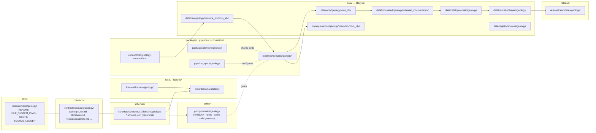
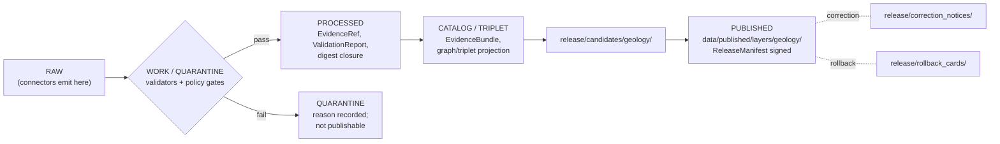

<!-- [KFM_META_BLOCK_V2]
doc_id: kfm://doc/geology-file-system-plan
title: Geology Domain File System Plan
type: standard
version: v1
status: draft
owners: <geology-domain-stewards> · <directory-governance-stewards>
created: 2026-05-16
updated: 2026-05-16
policy_label: public
related:
  - /directory-rules.md
  - docs/domains/geology/README.md
  - docs/standards/PROV.md
  - docs/standards/ISO-19115.md
  - docs/standards/PMTILES.md
  - docs/standards/OAI-PMH.md
  - schemas/contracts/v1/domains/geology/
  - contracts/domains/geology/
tags: [kfm, geology, directory-rules, file-system, lane, governance]
notes:
  - PROPOSED across all repo-state claims; no mounted repo was inspected
  - Companion to docs/domains/geology/README.md
  - Authority order: Directory Rules > ADRs > per-root README > this plan
[/KFM_META_BLOCK_V2] -->

# Geology Domain — File System Plan

> How the **Geology and Natural Resources** lane instantiates KFM's responsibility-root architecture across `docs/`, `contracts/`, `schemas/`, `policy/`, `tests/`, `fixtures/`, `packages/`, `pipelines/`, `pipeline_specs/`, `connectors/`, `data/`, and `release/` — without ever becoming a root folder of its own.

<p align="left">
  
  
  
  
  
  
  
</p>

| Status | Owners | Last updated |
|---|---|---|
| `draft` | `<geology-domain-stewards>` · `<directory-governance-stewards>` *(placeholder — fill on adoption)* | 2026-05-16 |

---

## 📑 Mini-TOC

1. [Purpose & scope](#1-purpose--scope)
2. [Repo fit](#2-repo-fit)
3. [What this lane owns · what it does not](#3-what-this-lane-owns--what-it-does-not)
4. [Cross-root layout at a glance](#4-cross-root-layout-at-a-glance)
5. [Per-responsibility-root expected files](#5-per-responsibility-root-expected-files)
6. [Lifecycle-phase mapping (RAW → PUBLISHED)](#6-lifecycle-phase-mapping-raw--published)
7. [Sensitivity, rights, and public-safe geometry posture](#7-sensitivity-rights-and-public-safe-geometry-posture)
8. [Cross-lane interactions](#8-cross-lane-interactions)
9. [Anti-patterns and drift prevention (geology-specific)](#9-anti-patterns-and-drift-prevention-geology-specific)
10. [Migration & ADR discipline](#10-migration--adr-discipline)
11. [Open questions and verification register](#11-open-questions-and-verification-register)
12. [Related docs](#12-related-docs)
13. [Appendix A — Full PROPOSED file inventory](#appendix-a--full-proposed-file-inventory)
14. [Appendix B — Object family → file-system map](#appendix-b--object-family--file-system-map)

---

## 1. Purpose & scope

This plan declares the **file-system layout** for the Geology and Natural Resources lane inside the Kansas Frontier Matrix monorepo. It is a *placement-and-naming* doctrine document — not an implementation status report and not a release artifact.

It exists because KFM's [Directory Rules](../../../directory-rules.md) establish that **a file's location encodes ownership, governance, lifecycle, and authority**, and that **a domain must not become a root folder**. Geology — like every other domain — must instead grow as a *lane* across the existing responsibility roots. This document is the lane's master map.

> [!IMPORTANT]
> Every concrete path below is **PROPOSED** until verified against the live KFM repository. No mounted repo was inspected during the drafting of this plan; placement is grounded in CONFIRMED Directory Rules doctrine and CONFIRMED geology domain doctrine from `kfm_encyclopedia.pdf` and the Domains Culmination Atlas. Specific file names are PROPOSED unless an existing repo file or ADR confirms them.

The reader audience is, in order: a directory steward checking placement, a geology contributor proposing a new file, a reviewer auditing a PR for drift, and a release engineer tracing rollback coverage.

[⬆ Back to top](#-mini-toc)

---

## 2. Repo fit

```text
<repo-root>/
├── docs/domains/geology/         ← THIS PLAN lives here
├── contracts/domains/geology/    ← object semantics (Markdown)
├── schemas/contracts/v1/domains/geology/   ← machine shape (JSON Schema, canonical)
├── policy/domains/geology/       ← allow / deny / restrict / abstain rules
├── tests/domains/geology/        ← enforceability proofs
├── fixtures/domains/geology/     ← golden / valid / invalid samples
├── packages/domains/geology/     ← shared geology library code
├── pipelines/domains/geology/    ← executable pipeline logic
├── pipeline_specs/geology/       ← declarative pipeline configuration
├── connectors/<source_id>/       ← source-specific fetchers (geology sources)
├── data/{raw,work,quarantine,processed}/geology/...
├── data/catalog/domain/geology/  ← catalog records
├── data/published/layers/geology/ ← released public-safe artifacts
├── data/registry/sources/geology/ ← geology source registry rows
└── release/candidates/geology/   ← release candidate dossiers
```

**Upstream authorities (this plan defers to them):**

| Authority | Role | Status |
|---|---|---|
| [`/directory-rules.md`](../../../directory-rules.md) §3, §4, §12, §13 | Responsibility-root law, placement protocol, Domain Placement Law, anti-patterns | **CONFIRMED doctrine** |
| Accepted ADRs (e.g., `ADR-0001` schema home) | Override Directory Rules only when explicit and not superseded | **CONFIRMED process** |
| Per-root README files (`docs/README.md`, `data/README.md`, …) | Refine but cannot contradict Directory Rules | **PROPOSED to exist** |
| `kfm_encyclopedia.pdf` §7.8 (Geology and Natural Resources) | Domain doctrine, object families, source families, sensitivity posture | **CONFIRMED doctrine** |
| `KFM_Domains_Culmination_Atlas_v1_1.pdf` ch. 10 (Geology) | Per-domain crosswalk to responsibility roots | **CONFIRMED doctrine** |

**Downstream consumers (they read this plan):**

- `docs/domains/geology/README.md` — landing page (orientation).
- `docs/domains/geology/SOURCE_LEDGER.md` *(PROPOSED)* — geology source registry overview.
- `pipelines/domains/geology/README.md` *(PROPOSED)* — pipeline-side mirror of this plan's pipeline section.
- Path-bearing PRs touching any geology lane file — every PR description SHOULD cite the §5 row that justifies its placement.

[⬆ Back to top](#-mini-toc)

---

## 3. What this lane owns · what it does not

### 3.1 Owns (canonical object families)

| Family | Stage support | Public-safe default | Citation |
|---|---|---|---|
| `GeologicUnit` (bedrock + surficial) | RAW → PUBLISHED | Generalized polygon; full geometry public-safe when source rights allow | `kfm_encyclopedia.pdf` §7.8.C |
| `Lithology`, `StratigraphicInterval`, `GeologicAge` | RAW → PUBLISHED | Public-safe when source rights allow | `kfm_encyclopedia.pdf` §7.8.C |
| `StructureFeature` / `FaultStructure`, `CrossSection` | RAW → PUBLISHED | Public-safe when source rights allow | `kfm_encyclopedia.pdf` §7.8.C; `KFM_Domains_Culmination_Atlas_v1_1.pdf` ch. 10 |
| `BoreholeReference`, `WellLogReference`, `CoreSample` | RAW → CATALOG; PUBLISHED only after rights review | **RESTRICTED / GENERALIZED by default** | `KFM_Domains_Culmination_Atlas_v1_1.pdf` ch. 10 §I |
| `GeophysicalObservation`, `GeochemistrySample` | RAW → PUBLISHED | Public-safe when source rights allow; exact sample coordinates may be generalized | `kfm_encyclopedia.pdf` §7.8.C |
| `MineralOccurrence`, `ResourceDeposit`, `ResourceEstimate` | RAW → PUBLISHED | **Anti-collapse**: occurrence, deposit, estimate, permit, production, and reserve must remain distinct | `KFM_Domains_Culmination_Atlas_v1_1.pdf` ch. 10 §I |
| `ExtractionSite`, `ReclamationRecord` | RAW → PUBLISHED with rights/exposure review | **RESTRICTED by default** when source terms require it | `KFM_Unified_Implementation_Architecture_Build_Manual.pdf` (DOM-GEOL §§8, 16) |
| `HydrostratigraphicUnit` | Boundary object (also cited by Hydrology) | Public-safe; cross-lane relation must preserve ownership | `KFM_Domains_Culmination_Atlas_v1_1.pdf` ch. 10 §F |
| `GeologyBoundaryVersion` | Lineage object | Public-safe metadata | `KFM_Domains_Culmination_Atlas_v1_1.pdf` ch. 10 §E |

### 3.2 Does not own

> [!NOTE]
> The boundary below is **CONFIRMED doctrine**. Cross-lane queries are allowed; cross-lane *truth ownership* is not.

- **Hydrology measurements, gauges, flow** → owned by Hydrology lane. Geology cites hydrostratigraphy.
- **Soils, soil components, horizons** → owned by Soil lane. Geology cites parent-material context.
- **Hazards risk assertions** (fault rupture probability, landslide hazard zones as risk) → owned by Hazards lane. Geology supplies structure context only.
- **Ownership / lease / permit / title claims** → owned by People/Land lane. Geology does not infer deposits from leases.
- **UI / AI statements about geology** → owned by their respective surfaces, governed by Focus Mode and Evidence Drawer. AI never becomes geology truth.

[⬆ Back to top](#-mini-toc)

---

## 4. Cross-root layout at a glance



> [!TIP]
> **Read this diagram as responsibility, not flow alone.** The arrows show information moving through the lane, but the *boxes* are the authority surfaces. A geology file's correct location is determined by which box owns its responsibility — not by which file it sits next to.

[⬆ Back to top](#-mini-toc)

---

## 5. Per-responsibility-root expected files

The tables in this section are the heart of the plan. Each row gives a PROPOSED path, its responsibility, and the upstream rule that justifies it.

> [!NOTE]
> All paths below carry the truth label **PROPOSED** unless a corresponding repo file is verified. Files marked *(landing)* are the per-lane README/orientation file; files marked *(canonical)* live in the canonical home for their authority class; *(emitted)* files are produced by pipelines, not authored.

### 5.1 `docs/domains/geology/` — human explanation (this lane)

| File | Responsibility | Status |
|---|---|---|
| `README.md` *(landing)* | Lane orientation: scope, links, status | PROPOSED |
| `FILE_SYSTEM_PLAN.md` | **This document** | PROPOSED |
| `SCOPE.md` | Owned object families, explicit non-ownership, cross-lane relations | PROPOSED |
| `SOURCE_LEDGER.md` | Geology source registry overview (KGS, USGS NGMDB/GeMS, KGS oil & gas, KCC, KGS/KDHE WWC5, KGS LAS, USGS MRDS, 3DEP-derived terrain inputs) | PROPOSED |
| `UBIQUITOUS_LANGUAGE.md` | Domain glossary (Geologic Unit, Lithology, …) | PROPOSED |
| `OBJECT_FAMILIES.md` | Per-object reference (identity rule, temporal handling, sensitivity default) | PROPOSED |
| `SENSITIVITY_POSTURE.md` | Borehole/well-log/extraction-site default redactions; resource-class anti-collapse | PROPOSED |
| `EVIDENCE_DRAWER_PAYLOAD.md` | Evidence Drawer projection for geology features | PROPOSED |
| `OPEN_QUESTIONS.md` | Verification backlog (mirrors §11 here) | PROPOSED |

### 5.2 `contracts/domains/geology/` — object meaning (Markdown)

| File | Object family | Status |
|---|---|---|
| `GeologicUnit.md` | Bedrock/surficial unit semantics | PROPOSED |
| `Lithology.md`, `StratigraphicInterval.md`, `GeologicAge.md` | Stratigraphy semantics | PROPOSED |
| `StructureFeature.md` | Fault/fold/joint/lineament semantics | PROPOSED |
| `CrossSection.md` | Profile-line semantics, vertical exaggeration disclosure rule | PROPOSED |
| `BoreholeReference.md`, `WellLogReference.md`, `CoreSample.md` | Subsurface reference semantics with sensitivity hooks | PROPOSED |
| `GeophysicalObservation.md`, `GeochemistrySample.md` | Observation semantics | PROPOSED |
| `MineralOccurrence.md`, `ResourceDeposit.md`, `ResourceEstimate.md` | Anti-collapse triplet (occurrence ≠ deposit ≠ estimate) | PROPOSED |
| `ExtractionSite.md`, `ReclamationRecord.md` | Operational semantics with rights/sensitivity gate | PROPOSED |
| `HydrostratigraphicUnit.md` | Cross-lane object (boundary with Hydrology) | PROPOSED |
| `GeologyBoundaryVersion.md` | Map-boundary lineage semantics | PROPOSED |

> `contracts/` is the **semantic** home. The machine shape lives under `schemas/contracts/v1/domains/geology/` per ADR-0001.

### 5.3 `schemas/contracts/v1/domains/geology/` — machine shape (canonical)

| File | Schema role | Status |
|---|---|---|
| `geologic_unit.schema.json` | Polygon feature with unit/age/lithology fields | PROPOSED |
| `lithology.schema.json`, `stratigraphic_interval.schema.json`, `geologic_age.schema.json` | Stratigraphy values | PROPOSED |
| `structure_feature.schema.json` | Line feature (fault/fold/joint) | PROPOSED |
| `cross_section.schema.json` | Section line + display rules | PROPOSED |
| `borehole_reference.schema.json`, `well_log_reference.schema.json`, `core_sample.schema.json` | Reference + sensitivity-classified geometry | PROPOSED |
| `geophysical_observation.schema.json`, `geochemistry_sample.schema.json` | Observation records | PROPOSED |
| `mineral_occurrence.schema.json`, `resource_deposit.schema.json`, `resource_estimate.schema.json` | Anti-collapse fields with required `source_role` discriminator | PROPOSED |
| `extraction_site.schema.json`, `reclamation_record.schema.json` | Operational records | PROPOSED |
| `hydrostratigraphic_unit.schema.json` | Shared boundary; cite Hydrology profile | PROPOSED |
| `geology_layer_manifest.schema.json` | LayerManifest profile for geology layers (public-safe only) | PROPOSED |
| `geology_decision_envelope.schema.json` | DecisionEnvelope profile (`ANSWER` / `ABSTAIN` / `DENY` / `ERROR`) | PROPOSED |

> [!WARNING]
> Do **not** create `contracts/geology/<x>.schema.json` or `jsonschema/geology/...` as a parallel authority. Per Directory Rules §13.1 / ADR-0001, `schemas/contracts/v1/...` is the canonical home. Any pre-existing mirror is compatibility-only.

### 5.4 `policy/domains/geology/` — allow / deny / restrict / abstain

| File | Decision class | Default outcome | Status |
|---|---|---|---|
| `sensitivity/borehole_exact_geometry.rego` *(or `.yaml`)* | Exact borehole coordinates | **DENY** for public; restricted release on review | PROPOSED |
| `sensitivity/well_log_disclosure.rego` | Private/proprietary well-log data | **DENY** for public | PROPOSED |
| `sensitivity/extraction_site_exposure.rego` | Active extraction site detail | RESTRICT / generalize per source terms | PROPOSED |
| `rights/kgs_terms.yaml` | KGS data-use terms binding | NEEDS VERIFICATION | PROPOSED |
| `rights/kcc_terms.yaml` | KCC regulatory data terms | NEEDS VERIFICATION | PROPOSED |
| `rights/usgs_ngmdb_terms.yaml` | USGS NGMDB/GeMS terms | NEEDS VERIFICATION | PROPOSED |
| `release/source_role_anti_collapse.rego` | Reject release that conflates occurrence / deposit / estimate / permit / production / reserve | **DENY** on conflation | PROPOSED |
| `release/public_safe_geometry.rego` | Reject release with over-precise sensitive geometry | **DENY** until generalization receipt exists | PROPOSED |

Validators that *enforce* these policies live under `tools/validators/` (cross-domain) and `tests/domains/geology/` (lane-specific proofs). Per Directory Rules §13 — anti-pattern *Test-only validator* — test files MUST NOT be the only home for a validator.

### 5.5 `tests/domains/geology/` and `fixtures/domains/geology/`

| Path | Role | Status |
|---|---|---|
| `tests/domains/geology/test_source_role_anti_collapse.py` *(language placeholder)* | Anti-collapse enforcement test | PROPOSED |
| `tests/domains/geology/test_public_safe_geometry.py` | Public-safe geometry enforcement | PROPOSED |
| `tests/domains/geology/test_borehole_rights.py` | Borehole/well-log rights gate | PROPOSED |
| `tests/domains/geology/test_catalog_closure.py` | Catalog closure for released geology layers | PROPOSED |
| `tests/domains/geology/test_evidence_before_ai.py` | AI evidence-bound behavior fixture | PROPOSED |
| `fixtures/domains/geology/units/<county>_unit_polygon.geojson` | Golden bedrock unit polygon | PROPOSED |
| `fixtures/domains/geology/boreholes/restricted_<id>.json` | Sensitive borehole fixture (negative) | PROPOSED |
| `fixtures/domains/geology/cross_sections/<id>.json` | Cross-section profile fixture | PROPOSED |
| `fixtures/domains/geology/source_role_conflation.json` | Negative fixture: occurrence labeled as deposit | PROPOSED |

> [!NOTE]
> Validator language, package manager, and test runner remain **UNKNOWN** in this plan (no mounted repo). File extensions above are illustrative; actual language is decided by ADR or visible repo convention.

### 5.6 `packages/domains/geology/` — shared library code

| Module | Role | Status |
|---|---|---|
| `identity/` | Deterministic identity helpers (source id + role + temporal scope + normalized digest) | PROPOSED |
| `geometry/` | Public-safe generalization, vertical exaggeration disclosure | PROPOSED |
| `crosswalk/` | KGS ↔ USGS unit/age crosswalks | PROPOSED |
| `evidence/` | Geology-shaped `EvidenceBundle` / `EvidenceRef` builders | PROPOSED |
| `layer_manifest/` | Geology `LayerManifest` emitter | PROPOSED |

Cross-domain helpers (e.g., a shared geometry validator usable by Geology, Hydrology, and Habitat) MUST live under `tools/validators/<topic>/...`, not under `packages/domains/geology/` — per Directory Rules §12 (multi-domain files).

### 5.7 `pipelines/domains/geology/` and `pipeline_specs/geology/`

| Path | Role | Status |
|---|---|---|
| `pipelines/domains/geology/bedrock_units/` | Executable pipeline: KGS bedrock → normalized unit polygons | PROPOSED |
| `pipelines/domains/geology/surficial_units/` | KGS surficial geology | PROPOSED |
| `pipelines/domains/geology/cross_sections/` | Cross-section generation | PROPOSED |
| `pipelines/domains/geology/boreholes/` | Borehole reference promotion (with sensitivity gate) | PROPOSED |
| `pipelines/domains/geology/well_logs/` | WWC5 / LAS well-log reference promotion (rights gate) | PROPOSED |
| `pipelines/domains/geology/mineral_occurrences/` | MRDS-style occurrence promotion (with anti-collapse) | PROPOSED |
| `pipeline_specs/geology/<pipeline>.spec.yaml` | Declarative spec per pipeline (sources, validators, gates, emitted artifacts) | PROPOSED |

### 5.8 `connectors/<source_id>/` — source-specific fetchers

Connectors are **source-specific**, not domain-specific. They MUST emit to `data/raw/<domain>/<source_id>/<run_id>/` or `data/quarantine/<domain>/<reason>/<run_id>/` and MUST NOT publish.

| Connector home (PROPOSED) | Source family | Notes |
|---|---|---|
| `connectors/kgs_bedrock/` | KGS bedrock geology | Rights/terms NEEDS VERIFICATION |
| `connectors/kgs_surficial/` | KGS surficial geology | Rights/terms NEEDS VERIFICATION |
| `connectors/usgs_ngmdb/` | USGS NGMDB / GeMS | Rights/terms NEEDS VERIFICATION |
| `connectors/kgs_oil_gas_wells/` | KGS oil & gas wells / production | Sensitivity: extraction context, **restricted by default** |
| `connectors/kcc_oil_gas_reg/` | KCC oil & gas regulatory | Rights/terms NEEDS VERIFICATION |
| `connectors/kgs_kdhe_wwc5/` | KGS/KDHE WWC5 water-well program | Borehole sensitivity, **restricted by default** |
| `connectors/kgs_las/` | KGS LAS digital well logs / well tops | Proprietary slices, **restricted by default** |
| `connectors/usgs_mrds/` | USGS MRDS mineral occurrences | Anti-collapse: occurrence vs deposit must remain distinct |

> [!CAUTION]
> A connector that writes anywhere other than `data/raw/` or `data/quarantine/` is a **drift pattern** (Directory Rules §13 — *Connector publishes*). Promotion is a pipeline + policy gate, not a connector responsibility.

### 5.9 `data/.../geology/` — lifecycle data

```text
data/raw/geology/<source_id>/<run_id>/
data/work/geology/<run_id>/
data/quarantine/geology/<reason>/<run_id>/
data/processed/geology/<dataset_id>/<version>/
data/catalog/domain/geology/<catalog_record_id>.json
data/published/layers/geology/<layer_id>/<release_id>/
data/registry/sources/geology/<source_id>.yaml
```

| Phase | What lives here | What MUST NOT live here |
|---|---|---|
| `raw/geology/` | Source-edge captures (KGS shapefiles, USGS GeMS exports, WWC5 dumps), immutable, with retrieval metadata and checksums | Public clients, AI context, UI layers, normalized records |
| `work/geology/` | Normalized intermediates: candidate `GeologicUnit` polygons before validation | Public API / UI / release aliases |
| `quarantine/geology/` | Schema drift, rights-unknown KGS extracts, over-precise borehole geometry, conflated `MineralOccurrence`/`ResourceDeposit` records | Promotion candidates without remediation |
| `processed/geology/` | Validated canonical records (per `schemas/contracts/v1/domains/geology/`) | Assumption of public/release status |
| `catalog/domain/geology/` | STAC / DCAT / PROV-O records for geology datasets and layers | Uncited claims |
| `published/layers/geology/` | Released public-safe artifacts: generalized unit polygons, public-safe layers, PMTiles, GeoParquet | Raw, work, quarantine, exact restricted borehole/extraction geometry |
| `registry/sources/geology/` | Append-only geology source registry entries (`SourceDescriptor` rows) | Canonical domain truth |

Receipts (`data/receipts/`), proofs (`data/proofs/`), and rollback cards (`release/rollback_cards/`) are **cross-domain** and live under their canonical homes, not under `data/.../geology/`. A geology-tagged receipt is still a receipt first.

### 5.10 `release/candidates/geology/` — release-candidate dossiers

| Path | Role | Status |
|---|---|---|
| `release/candidates/geology/<release_id>/manifest.json` | Geology-scoped contribution to a `ReleaseManifest` | PROPOSED |
| `release/candidates/geology/<release_id>/evidence_closure.json` | Pointer set to `EvidenceBundle`s required for this release | PROPOSED |
| `release/candidates/geology/<release_id>/rollback_target.json` | Prior release this can roll back to | PROPOSED |

Release **decisions** themselves (`release/manifests/`, `release/promotion_decisions/`, `release/rollback_cards/`, `release/correction_notices/`) are cross-domain and live at the `release/` root, not under `release/candidates/geology/`.

[⬆ Back to top](#-mini-toc)

---

## 6. Lifecycle-phase mapping (RAW → PUBLISHED)

The KFM lifecycle invariant is **governance, not storage organization**. Geology participates in the standard sequence:



| Stage | Gate (geology-specific) | Required artifacts | Status |
|---|---|---|---|
| RAW | `SourceDescriptor` exists for the geology source; rights and source role recorded | `data/raw/geology/<source_id>/<run_id>/`, `data/registry/sources/geology/<source_id>.yaml` | PROPOSED |
| WORK / QUARANTINE | Schema, geometry, time, identity, evidence, rights, **sensitivity (borehole / well-log / extraction)**, **anti-collapse (occurrence ≠ deposit ≠ estimate)** | `ValidationReport`, `PolicyDecision`, `QuarantineRecord` (if applicable) | PROPOSED |
| PROCESSED | `EvidenceRef` resolves; digest closure passes; **public-safe geometry transform receipt** when generalized | `data/processed/geology/<dataset_id>/<version>/`, `TransformReceipt` | PROPOSED |
| CATALOG / TRIPLET | Catalog record present; `EvidenceBundle` projection complete; triplet projection (if applicable) does not replace canonical truth | `data/catalog/domain/geology/<catalog_record_id>.json` | PROPOSED |
| PUBLISHED | `ReleaseManifest`, signed digests, evidence closure, **rollback target**, correction-path declaration | `data/published/layers/geology/<layer_id>/<release_id>/`, `release/manifests/<release_id>.json` | PROPOSED |

> [!IMPORTANT]
> **Promotion is a governed state transition, not a file move.** Per Directory Rules §9.1, a path-level move that bypasses validators, policy gates, evidence-bundle creation, catalog closure, and release-decision recording is a lifecycle violation regardless of which directory the bytes ended up in.

[⬆ Back to top](#-mini-toc)

---

## 7. Sensitivity, rights, and public-safe geometry posture

CONFIRMED doctrine (from `KFM_Domains_Culmination_Atlas_v1_1.pdf` ch. 10 §I and `KFM_Unified_Implementation_Architecture_Build_Manual.pdf` DOM-GEOL §§8, 16):

| Class | Default outcome | File-system consequence |
|---|---|---|
| Exact borehole / well-log coordinates | **RESTRICTED / GENERALIZED** | Raw geometry stays in `data/raw/geology/<source>/<run>/`; public-safe surface lives in `data/published/layers/geology/` only after a `TransformReceipt` is recorded |
| Private / proprietary well data | **DENY** for public | `data/quarantine/geology/rights_unknown/...` until rights resolved |
| Active extraction site detail | **RESTRICT** per source terms | `policy/domains/geology/sensitivity/extraction_site_exposure.rego` decides |
| Sensitive resource estimates (production / reserves under non-public terms) | **DENY** for public | Not eligible for `data/published/layers/geology/` |
| Source-role conflation (occurrence / deposit / estimate / permit / production / reserve mixed) | **DENY** at release | Caught by `policy/domains/geology/release/source_role_anti_collapse.rego` |
| Unclear rights / unresolved source role / missing evidence / absent release state | **BLOCKS public promotion** | Held in `data/quarantine/geology/<reason>/<run_id>/` |

> [!WARNING]
> The **anti-collapse rule** is geology-specific and load-bearing: an occurrence is *not* a deposit, a deposit is *not* an estimate, an estimate is *not* a reserve, and none of those is a permit or production record. Pipelines and schemas MUST keep these distinct in field names, source-role tags, and citation tier — collapsing them is a release-blocking violation.

[⬆ Back to top](#-mini-toc)

---

## 8. Cross-lane interactions

Geology touches several other lanes. Cross-cutting files belong to the *lowest common responsibility root*, not to a chosen "owner" domain (Directory Rules §12).

| Related lane | Relation | File-system handling |
|---|---|---|
| **Soil** | Parent material; surficial context | Cross-lane crosswalk lives in `packages/domains/geology/crosswalk/` only if the *primary* responsibility is geology; otherwise under `tools/crosswalks/<topic>/`. A `HydrostratigraphicUnit` ↔ `SoilMapUnit` shared schema lives under `schemas/contracts/v1/<topic>/`, not under either domain folder. |
| **Hydrology** | Hydrostratigraphy and aquifer context | `HydrostratigraphicUnit` is shared; the canonical schema MAY live under `schemas/contracts/v1/domains/geology/` *or* under a neutral `schemas/contracts/v1/hydrostratigraphy/` lane. **Decision is ADR-pending** (see §11). |
| **Hazards** | Fault / landslide / subsidence risk context | Geology supplies structure; Hazards owns risk. Cross-lane joins live in `tools/joins/<topic>/`. |
| **People / Land** | Lease, parcel, operator | Geology does not infer deposits from leases. Any cross-lane file lives under the responsibility root of its actual primary concern (usually `policy/` for join-restriction rules). |
| **Frontier Matrix (matrix cells)** | Cell-level resource indicators | Aggregation receipts are cross-domain and live under `data/receipts/aggregation/`, not under `data/.../geology/`. |

[⬆ Back to top](#-mini-toc)

---

## 9. Anti-patterns and drift prevention (geology-specific)

Directory Rules §13 lists the general anti-patterns. The table below adapts them to recurring geology temptations.

| Geology-specific anti-pattern | Why it shows up | Fix |
|---|---|---|
| A `geology/` folder at repo root | "Geology has lots of files, it deserves a root" | Apply Domain Placement Law (Directory Rules §12). Geology grows as lanes across responsibility roots, with `docs/domains/geology/` as its README home. |
| Borehole geometry in `data/published/` without a `TransformReceipt` | "The raw point felt safe, no one will query it" | Quarantine the release. Public release requires a public-safe geometry receipt. |
| `MineralOccurrence` and `ResourceDeposit` collapsed into one schema field | "They're the same thing in this dataset" | Two schemas, two source-role tags, separate validators. Release blocked on conflation. |
| Connector writing directly to `data/processed/geology/` | "I already validated it inside the connector" | Connector emits to `data/raw/geology/` only; validation runs in a pipeline step under `pipelines/domains/geology/`. |
| Schema in `contracts/domains/geology/<x>.schema.json` and `schemas/contracts/v1/domains/geology/<x>.schema.json` both | Mirror grew when no one was looking | Canonical home is `schemas/contracts/v1/...` (ADR-0001). The `contracts/` version becomes Markdown semantic doc only. |
| Cross-section vertical exaggeration not disclosed | Looks better that way on the map | `contracts/domains/geology/CrossSection.md` requires a vertical-exaggeration field; renderer surfaces it as a `RepresentationReceipt`. |
| Test-only sensitivity validator | "It already gates in CI" | Extract validator into `tools/validators/...` or `packages/domains/geology/`; tests call into it. |

[⬆ Back to top](#-mini-toc)

---

## 10. Migration & ADR discipline

### 10.1 Routine geology moves

For one or a few files moving inside the geology lane:

1. `git mv` to preserve history.
2. Update references in code, docs, schemas, fixtures, tests, workflows.
3. Add a one-line note in `docs/domains/geology/README.md` (or `docs/registers/CANONICAL_LINEAGE_EXPLORATORY.md`).
4. Run the validator suite; verify no drift entries open.

### 10.2 Structural moves that require an ADR

> [!IMPORTANT]
> An ADR is required when the move affects the **authority** of a file, not just its placement.

- Changing the canonical home of any geology schema (e.g., moving `geologic_unit.schema.json` out of `schemas/contracts/v1/domains/geology/`).
- Splitting a lifecycle phase (e.g., introducing a sub-phase under `data/work/geology/`).
- Adding a geology sub-segment to a compatibility root (`ui/`, `web/`, `jsonschema/`, `policies/`, `styles/`, `viewer_templates/`).
- Renaming a geology object family in a way that changes identity (e.g., `BoreholeReference` → `BoreholeRecord`). Per Directory Rules §14.3, this requires ADR + schema version bump + compatibility map + parity tests + correction notices for any released artifacts.

### 10.3 Open ADR-candidates surfaced by this plan

| Candidate | Question | Suggested ADR scope |
|---|---|---|
| Hydrostratigraphy home | Does `HydrostratigraphicUnit` live under `schemas/contracts/v1/domains/geology/` or under a neutral `schemas/contracts/v1/hydrostratigraphy/` lane? | ADR-`<next>`: shared-kernel decision; both lanes co-sign |
| Validator language for geology lane | Python / TypeScript / Rego / mixed? | Cross-domain ADR (not geology-only) |
| Release granularity | Is geology released as a single `ReleaseManifest` slice, or per-layer? | ADR coordinating with Hydrology proof-lane precedent |
| Triplet projection home | Per-domain `data/triplets/geology/` vs. central `data/triplets/exports/`? | Cross-domain ADR; geology participates |

[⬆ Back to top](#-mini-toc)

---

## 11. Open questions and verification register

The items below are **NEEDS VERIFICATION** unless otherwise noted. They are not blockers for placement decisions — every other rule in this plan continues to apply.

| Item | Evidence that would settle it | Status |
|---|---|---|
| Whether a `docs/domains/geology/` directory currently exists in the mounted repo | `ls docs/domains/` against a live checkout | UNKNOWN |
| Whether `contracts/domains/geology/` mirror still exists alongside `schemas/contracts/v1/domains/geology/` | Repo inspection + ADR-0001 drift register | UNKNOWN |
| Current KGS, KCC, USGS NGMDB/GeMS, WWC5, LAS, MRDS data-use terms | `data/registry/sources/geology/*.yaml` review with current source pages | NEEDS VERIFICATION |
| Validator language and test-runner used in `tests/domains/<other-domains>/` | Inspect any one peer lane that already exists | UNKNOWN |
| Public release sensitivity rules for borehole/well-log generalization (exact buffer, exact precision) | Reviewed `policy/domains/geology/sensitivity/` files; steward sign-off | NEEDS VERIFICATION |
| Whether `connectors/<source_id>/` is the active connector pattern, or if `connectors/geology/<source_id>/` is in use | Repo inspection; ADR if both | UNKNOWN |
| Whether `pipeline_specs/geology/` or `pipeline_specs/<spec>.yaml` (flat with domain tag) is the chosen form | Repo inspection; peer-lane convention | UNKNOWN |
| Whether `release/candidates/geology/` is per-domain or rolled into per-release dossiers | ADR / current `release/` layout | UNKNOWN |
| Owners of this lane (geology stewards, directory governance) | Filled in by repo `CODEOWNERS` and per-root README | UNKNOWN (placeholders kept) |

[⬆ Back to top](#-mini-toc)

---

## 12. Related docs

- [`/directory-rules.md`](../../../directory-rules.md) — Responsibility-root law, placement protocol, Domain Placement Law, drift prevention.
- `docs/domains/geology/README.md` *(PROPOSED)* — Lane landing page.
- `docs/domains/geology/SCOPE.md` *(PROPOSED)* — Owned objects and explicit non-ownership.
- `docs/domains/geology/SOURCE_LEDGER.md` *(PROPOSED)* — Geology source registry overview.
- `docs/standards/PROV.md` — Provenance profile (cited by `EvidenceBundle` resolution).
- `docs/standards/ISO-19115.md` — Geospatial metadata profile (catalog records).
- `docs/standards/PMTILES.md` — PMTiles delivery profile (geology PMTiles).
- `docs/standards/OAI-PMH.md` — Harvest profile (catalog records exposed via OAI-PMH).
- `kfm_encyclopedia.pdf` §7.8 — Geology and Natural Resources domain doctrine.
- `KFM_Domains_Culmination_Atlas_v1_1.pdf` ch. 10 — Geology cross-walk to responsibility roots.
- `KFM_Unified_Implementation_Architecture_Build_Manual.pdf` (DOM-GEOL §§1-4, 7-18) — Geology unified decisions.

---

## Appendix A — Full PROPOSED file inventory

<details>
<summary>Click to expand: every file/path this plan proposes for the geology lane (flat list)</summary>

```text
docs/domains/geology/README.md
docs/domains/geology/FILE_SYSTEM_PLAN.md            ← this document
docs/domains/geology/SCOPE.md
docs/domains/geology/SOURCE_LEDGER.md
docs/domains/geology/UBIQUITOUS_LANGUAGE.md
docs/domains/geology/OBJECT_FAMILIES.md
docs/domains/geology/SENSITIVITY_POSTURE.md
docs/domains/geology/EVIDENCE_DRAWER_PAYLOAD.md
docs/domains/geology/OPEN_QUESTIONS.md

contracts/domains/geology/GeologicUnit.md
contracts/domains/geology/Lithology.md
contracts/domains/geology/StratigraphicInterval.md
contracts/domains/geology/GeologicAge.md
contracts/domains/geology/StructureFeature.md
contracts/domains/geology/CrossSection.md
contracts/domains/geology/BoreholeReference.md
contracts/domains/geology/WellLogReference.md
contracts/domains/geology/CoreSample.md
contracts/domains/geology/GeophysicalObservation.md
contracts/domains/geology/GeochemistrySample.md
contracts/domains/geology/MineralOccurrence.md
contracts/domains/geology/ResourceDeposit.md
contracts/domains/geology/ResourceEstimate.md
contracts/domains/geology/ExtractionSite.md
contracts/domains/geology/ReclamationRecord.md
contracts/domains/geology/HydrostratigraphicUnit.md
contracts/domains/geology/GeologyBoundaryVersion.md

schemas/contracts/v1/domains/geology/geologic_unit.schema.json
schemas/contracts/v1/domains/geology/lithology.schema.json
schemas/contracts/v1/domains/geology/stratigraphic_interval.schema.json
schemas/contracts/v1/domains/geology/geologic_age.schema.json
schemas/contracts/v1/domains/geology/structure_feature.schema.json
schemas/contracts/v1/domains/geology/cross_section.schema.json
schemas/contracts/v1/domains/geology/borehole_reference.schema.json
schemas/contracts/v1/domains/geology/well_log_reference.schema.json
schemas/contracts/v1/domains/geology/core_sample.schema.json
schemas/contracts/v1/domains/geology/geophysical_observation.schema.json
schemas/contracts/v1/domains/geology/geochemistry_sample.schema.json
schemas/contracts/v1/domains/geology/mineral_occurrence.schema.json
schemas/contracts/v1/domains/geology/resource_deposit.schema.json
schemas/contracts/v1/domains/geology/resource_estimate.schema.json
schemas/contracts/v1/domains/geology/extraction_site.schema.json
schemas/contracts/v1/domains/geology/reclamation_record.schema.json
schemas/contracts/v1/domains/geology/hydrostratigraphic_unit.schema.json
schemas/contracts/v1/domains/geology/geology_layer_manifest.schema.json
schemas/contracts/v1/domains/geology/geology_decision_envelope.schema.json

policy/domains/geology/sensitivity/borehole_exact_geometry.rego
policy/domains/geology/sensitivity/well_log_disclosure.rego
policy/domains/geology/sensitivity/extraction_site_exposure.rego
policy/domains/geology/rights/kgs_terms.yaml
policy/domains/geology/rights/kcc_terms.yaml
policy/domains/geology/rights/usgs_ngmdb_terms.yaml
policy/domains/geology/release/source_role_anti_collapse.rego
policy/domains/geology/release/public_safe_geometry.rego

tests/domains/geology/test_source_role_anti_collapse.<ext>
tests/domains/geology/test_public_safe_geometry.<ext>
tests/domains/geology/test_borehole_rights.<ext>
tests/domains/geology/test_catalog_closure.<ext>
tests/domains/geology/test_evidence_before_ai.<ext>

fixtures/domains/geology/units/<county>_unit_polygon.geojson
fixtures/domains/geology/boreholes/restricted_<id>.json
fixtures/domains/geology/cross_sections/<id>.json
fixtures/domains/geology/source_role_conflation.json

packages/domains/geology/identity/
packages/domains/geology/geometry/
packages/domains/geology/crosswalk/
packages/domains/geology/evidence/
packages/domains/geology/layer_manifest/

pipelines/domains/geology/bedrock_units/
pipelines/domains/geology/surficial_units/
pipelines/domains/geology/cross_sections/
pipelines/domains/geology/boreholes/
pipelines/domains/geology/well_logs/
pipelines/domains/geology/mineral_occurrences/

pipeline_specs/geology/bedrock_units.spec.yaml
pipeline_specs/geology/surficial_units.spec.yaml
pipeline_specs/geology/cross_sections.spec.yaml
pipeline_specs/geology/boreholes.spec.yaml
pipeline_specs/geology/well_logs.spec.yaml
pipeline_specs/geology/mineral_occurrences.spec.yaml

connectors/kgs_bedrock/
connectors/kgs_surficial/
connectors/usgs_ngmdb/
connectors/kgs_oil_gas_wells/
connectors/kcc_oil_gas_reg/
connectors/kgs_kdhe_wwc5/
connectors/kgs_las/
connectors/usgs_mrds/

data/raw/geology/<source_id>/<run_id>/
data/work/geology/<run_id>/
data/quarantine/geology/<reason>/<run_id>/
data/processed/geology/<dataset_id>/<version>/
data/catalog/domain/geology/<catalog_record_id>.json
data/published/layers/geology/<layer_id>/<release_id>/
data/registry/sources/geology/<source_id>.yaml

release/candidates/geology/<release_id>/manifest.json
release/candidates/geology/<release_id>/evidence_closure.json
release/candidates/geology/<release_id>/rollback_target.json
```

</details>

---

## Appendix B — Object family → file-system map

<details>
<summary>Click to expand: which files each canonical geology object family touches</summary>

| Object family | `contracts/` (meaning) | `schemas/contracts/v1/...` (shape) | `policy/` (rules) | `tests/` + `fixtures/` | `data/published/layers/geology/` candidate? |
|---|---|---|---|---|---|
| `GeologicUnit` | `GeologicUnit.md` | `geologic_unit.schema.json` | release / public-safe-geometry | `units/` fixtures | ✅ (generalized polygons) |
| `Lithology` | `Lithology.md` | `lithology.schema.json` | — | unit-attribute tests | ✅ as unit attribute |
| `StratigraphicInterval` | `StratigraphicInterval.md` | `stratigraphic_interval.schema.json` | — | correlation tests | ✅ |
| `GeologicAge` | `GeologicAge.md` | `geologic_age.schema.json` | — | age-controlled-vocab tests | ✅ as unit attribute |
| `StructureFeature` | `StructureFeature.md` | `structure_feature.schema.json` | — | structure tests | ✅ |
| `CrossSection` | `CrossSection.md` | `cross_section.schema.json` | vertical-exaggeration disclosure | section fixtures | ✅ (with `RepresentationReceipt`) |
| `BoreholeReference` | `BoreholeReference.md` | `borehole_reference.schema.json` | sensitivity/borehole_exact_geometry | restricted fixtures | ⚠️ Only after `TransformReceipt` |
| `WellLogReference` | `WellLogReference.md` | `well_log_reference.schema.json` | sensitivity/well_log_disclosure | restricted fixtures | ⚠️ Only after rights review |
| `CoreSample` | `CoreSample.md` | `core_sample.schema.json` | sensitivity | restricted fixtures | ⚠️ Generally NO; metadata only |
| `GeophysicalObservation` | `GeophysicalObservation.md` | `geophysical_observation.schema.json` | — | observation tests | ✅ generalized |
| `GeochemistrySample` | `GeochemistrySample.md` | `geochemistry_sample.schema.json` | sensitivity (sample coords) | sample tests | ⚠️ Generalized only |
| `MineralOccurrence` | `MineralOccurrence.md` | `mineral_occurrence.schema.json` | release/source_role_anti_collapse | conflation negative fixtures | ✅ |
| `ResourceDeposit` | `ResourceDeposit.md` | `resource_deposit.schema.json` | release/source_role_anti_collapse | conflation negative fixtures | ✅ |
| `ResourceEstimate` | `ResourceEstimate.md` | `resource_estimate.schema.json` | release/source_role_anti_collapse | estimate tests | ⚠️ Only with rights review |
| `ExtractionSite` | `ExtractionSite.md` | `extraction_site.schema.json` | sensitivity/extraction_site_exposure | extraction fixtures | ⚠️ Generalized only |
| `ReclamationRecord` | `ReclamationRecord.md` | `reclamation_record.schema.json` | — | reclamation tests | ✅ |
| `HydrostratigraphicUnit` | `HydrostratigraphicUnit.md` | `hydrostratigraphic_unit.schema.json` *(home ADR-pending — see §11)* | — | cross-lane (Hydrology) tests | ✅ |
| `GeologyBoundaryVersion` | `GeologyBoundaryVersion.md` | *(not always its own schema — metadata)* | — | boundary-version tests | ✅ as catalog metadata |

</details>

---

<sub>**Last updated:** 2026-05-16 · **Status:** draft · **Repo state:** PROPOSED (no mounted repo inspected) · [⬆ Back to top](#-mini-toc)</sub>
