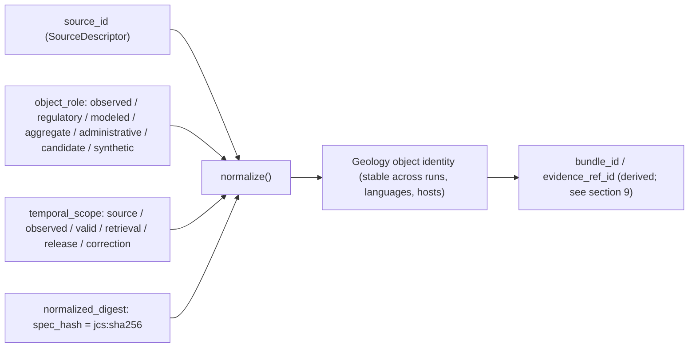
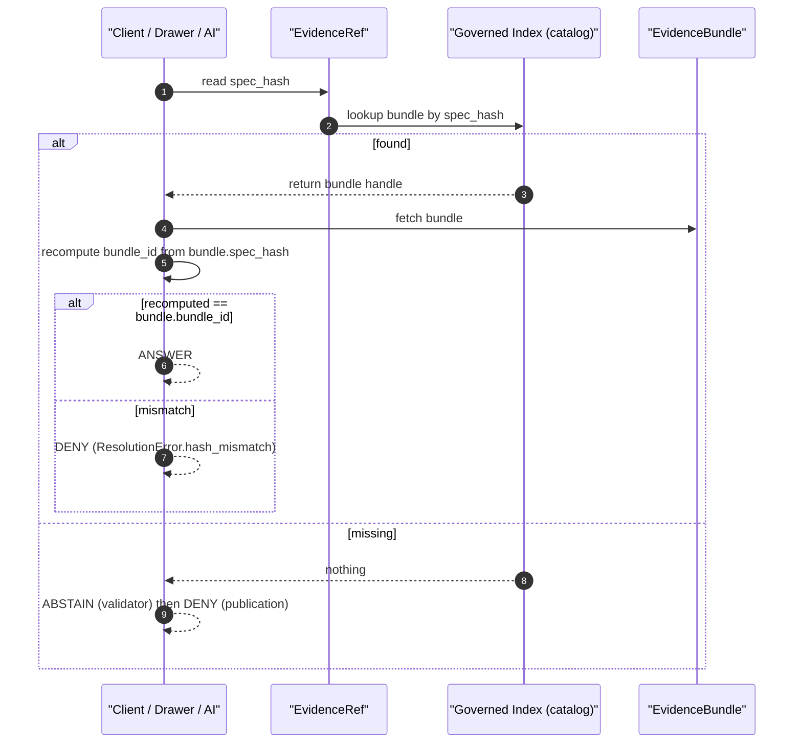
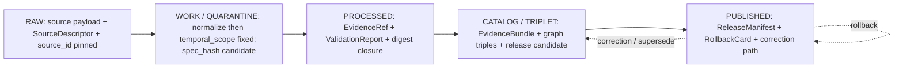
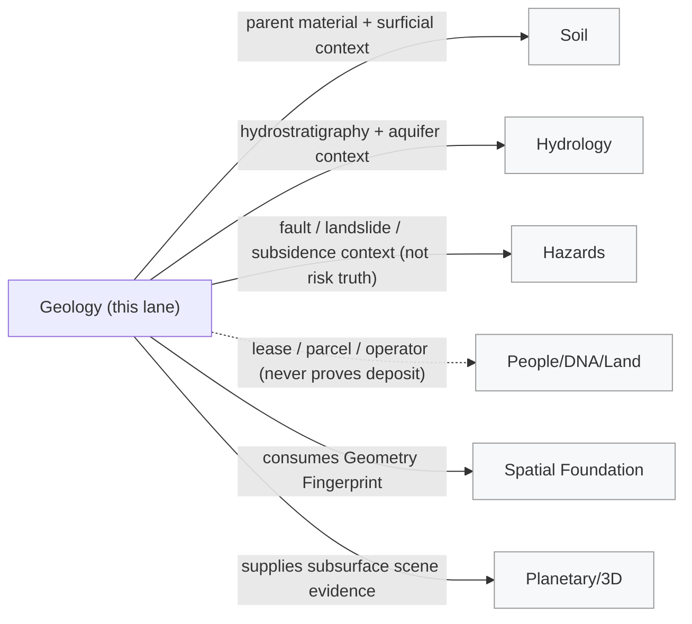

<!-- [KFM_META_BLOCK_V2]
doc_id: kfm://doc/domain/geology/identity-model
title: Geology Domain — Identity Model
type: standard
subtype: domain-identity-model
version: v1.1
status: draft
owners: <Geology domain steward — TBD>, <Doctrine steward — TBD>
created: 2026-05-16
updated: 2026-06-04
policy_label: public
authoring_session: Docs-only. No mounted repo, CI run, workflow, dashboard, runtime log, or release artifact inspected. Implementation maturity is bounded per the current-session evidence limit.
authority_posture: Domain identity-model doctrine crosswalk. Subordinate to ai-build-operating-contract.md (CONTRACT_VERSION 3.0.0), directory-rules.md, and accepted ADRs. Supersedes no source doctrine.
related:
  - docs/domains/geology/README.md
  - docs/domains/geology/FILE_SYSTEM_PLAN.md
  - docs/doctrine/ai-build-operating-contract.md       # CONTRACT_VERSION 3.0.0
  - docs/doctrine/lifecycle-law.md
  - docs/doctrine/trust-membrane.md
  - docs/doctrine/authority-ladder.md
  - docs/doctrine/directory-rules.md                   # v1.3
  - docs/standards/PROV.md                              # or PROVENANCE.md — pending ADR (OPEN-DR-01)
  - docs/standards/CANONICALIZATION.md                  # JCS vs URDNA2015 decision matrix
  - schemas/contracts/v1/source/source-descriptor.json
  - schemas/contracts/v1/evidence/evidence-bundle.json
tags: [kfm, domain, geology, identity, deterministic-identity, spec-hash, source-role, bounded-context, doctrine-adjacent]
notes:
  - "Identity formula and labels: PROPOSED deterministic basis, CONFIRMED temporal-distinction doctrine."
  - "spec_hash convention (JCS + SHA-256, recorded jcs:sha256:<hex>) is CONFIRMED (Pass 10 C1-02). URDNA2015 is the reserved alternative for RDF-semantic graph bundles (C8-05)."
  - "Schema homes and validator paths: PROPOSED until verified against mounted-repo evidence."
  - "Object roster reconciles Atlas (v1.1) and Encyclopedia (§7.8) spellings; see §3.1 for drift entry."
  - "Doctrine-adjacent — pins CONTRACT_VERSION = 3.0.0 (ai-build-operating-contract.md)."
  - "Path form: cross-cutting identity schemas live at schemas/contracts/v1/{source,evidence}/. Any geology-lane schema sub-path (segment vs flat) is governed by CDR-GEOL-01 — segment form is canonical per Directory Rules Step 3."
[/KFM_META_BLOCK_V2] -->

<a id="top"></a>

# Kansas Frontier Matrix — Geology Domain Identity Model

> *How KFM decides what a thing **is** inside the Geology bounded context — and what it means for two records, two runs, two rendered features, or two release builds to be **the same thing**.*

[](./README.md)
[](#top)
[](#top)
[](#status--authority)
[](#status--authority)
[](#normalized-digest-spec_hash)
[](../../doctrine/ai-build-operating-contract.md)
[](../../doctrine/lifecycle-law.md)
[](../../../LICENSE)
[](#top)

| Field             | Value                                                                          |
|-------------------|--------------------------------------------------------------------------------|
| **Status**        | `draft` — initial doctrine assembly                                            |
| **Owners**        | Geology domain steward · Doctrine steward *(placeholders — NEEDS VERIFICATION)* |
| **Last updated**  | 2026-06-04                                                                     |
| **Contract pin**  | `CONTRACT_VERSION = "3.0.0"` (`ai-build-operating-contract.md`)                |
| **Doctrine layer**| `docs/domains/geology/` *(domain lane per Directory Rules §12)*                |
| **Sibling docs**  | [`README.md`](./README.md) · [`FILE_SYSTEM_PLAN.md`](./FILE_SYSTEM_PLAN.md) · [`SOURCE_REGISTRY.md`](./SOURCE_REGISTRY.md) · [`SENSITIVITY.md`](./SENSITIVITY.md) *(some TODO — placeholders)* |

---

## 📑 Table of Contents

1. [Status & Authority](#status--authority)
2. [Purpose](#purpose)
3. [Scope & Non-Scope](#scope--non-scope)
4. [The Identity Formula](#the-identity-formula)
5. [Source ID](#source-id)
6. [Object Role](#object-role)
7. [Temporal Scope](#temporal-scope)
8. [Normalized Digest (`spec_hash`)](#normalized-digest-spec_hash)
9. [Derived IDs and Resolution](#derived-ids-and-resolution)
10. [Per-Object Identity Profiles](#per-object-identity-profiles)
11. [Identity Through the Lifecycle](#identity-through-the-lifecycle)
12. [Sensitivity Guards on Identity](#sensitivity-guards-on-identity)
13. [Cross-Lane Identity Relations](#cross-lane-identity-relations)
14. [Failure Modes & Required Outcomes](#failure-modes--required-outcomes)
15. [Validators, Tests, Fixtures (PROPOSED)](#validators-tests-fixtures-proposed)
16. [Open Questions / Verification Backlog](#open-questions--verification-backlog)
17. [Changelog](#changelog)
18. [Definition of Done](#definition-of-done)
19. [Related Docs](#related-docs)

---

## Status & Authority

The doctrine in this document is **CONFIRMED** as a faithful crosswalk of:

- the **DOM-GEOL** dossier (Geology and Natural Resources, Atlas Ch. 10),
- the **Encyclopedia** §7.8 (Geology and Natural Resources),
- the **DDD Reference** (Bounded Context, Entities / Reference Objects, Value Objects),
- KFM **operating law** (`ai-build-operating-contract.md`, `CONTRACT_VERSION = "3.0.0"`) on EvidenceBundle precedence and lifecycle promotion, and
- the cross-domain **Source-Role Anti-Collapse Register** (Atlas §24.1).

The **implementation surface** referenced below (schema paths, validator paths, field names, hash policy details, route names) is **PROPOSED** until verified against a mounted repository.

> [!IMPORTANT]
> *Memory is not evidence.* Where this document refers to specific files (e.g., `schemas/contracts/v1/source/source-descriptor.json`), the path is the **proposed canonical home** under Directory Rules + ADR-0001. Whether that file exists in the current repo, and what fields it actually carries, remains **NEEDS VERIFICATION**. The identity *concepts* (deterministic basis, `spec_hash`, role and temporal distinctions) are CONFIRMED doctrine; the *field realizations* are PROPOSED.

[⬆ Back to top](#top)

---

## Purpose

The Geology domain governs interpretive evidence about rock, sediment, structure, subsurface and resource context. The **identity model** answers four questions that every other governance gate downstream — validation, policy, promotion, citation, correction, rollback — depends on:

1. **What counts as a single Geology object** across runs, contributors, and pipeline lanes?
2. **When are two records the same thing**, and when are they two different claims that merely share a name?
3. **What identity invariants** must survive transformation, generalization, redaction, and release?
4. **What identity failures** must fail closed at the trust membrane?

> [!NOTE]
> Identity in KFM is **not** a primary key in a single table. It is a deterministic fingerprint over a normalized specification, anchored by source authority, object role, time, and content digest — designed so the same logical claim hashes the same in every language, runtime, and build host. This realizes the DDD *Entity / Reference Object* posture: *"the model must define what it means to be the same thing."* `[DDD Reference — Entities]` `[DOM-GEOL]` `[Pass 10 C1-02]`

[⬆ Back to top](#top)

---

## Scope & Non-Scope

### ✅ In scope (Geology owns these identities)

| Object family             | One-line role                                                                       | Status |
|---------------------------|-------------------------------------------------------------------------------------|--------|
| **GeologicUnit**          | Bedrock mapping unit assertion (polygon).                                           | CONFIRMED spine / PROPOSED field realization |
| **SurficialUnit**         | Surficial / unconsolidated unit assertion (polygon).                                | CONFIRMED spine / PROPOSED |
| **Lithology**             | Rock/sediment composition characterization.                                         | CONFIRMED spine / PROPOSED |
| **StratigraphicInterval** | Named stratigraphic interval (group/formation/member) with bounds.                  | CONFIRMED spine / PROPOSED |
| **GeologicAge**           | Geochronologic / chronostratigraphic age binding for an interval or unit.           | CONFIRMED spine / PROPOSED |
| **StructureFeature**      | Faults, folds, lineaments — line/polygon structural elements.                       | CONFIRMED spine / PROPOSED |
| **GeologyBoundaryVersion**| Versioned boundary geometry between mapping units (auditable replacement target).   | CONFIRMED spine / PROPOSED |
| **BoreholeReference**     | Borehole / well point with metadata; geometry sensitivity-controlled.               | CONFIRMED spine / PROPOSED |
| **WellLogReference**      | LAS / well-log artifact reference attached to a BoreholeReference.                  | CONFIRMED spine / PROPOSED |
| **CoreSample**            | Physical core / cuttings sample reference.                                          | CONFIRMED spine / PROPOSED |
| **GeophysicalObservation**| Geophysical survey product (gravity, magnetic, seismic) reference.                  | CONFIRMED spine / PROPOSED |
| **GeochemistrySampleReference** | Geochemical sample / analysis reference.                                      | CONFIRMED spine / PROPOSED |
| **MineralOccurrence**     | Reported mineral occurrence (point or polygon, sensitivity-controlled).             | CONFIRMED spine / PROPOSED |
| **ResourceDeposit**       | Reported resource deposit (distinct from occurrence and estimate).                  | CONFIRMED spine / PROPOSED |
| **ResourceEstimate**      | Reported reserve / resource estimate (distinct from deposit and occurrence).        | CONFIRMED spine / PROPOSED |
| **ExtractionSite**        | Active or historical extraction site reference.                                     | CONFIRMED spine / PROPOSED |
| **ReclamationRecord**     | Reclamation status / record reference.                                              | CONFIRMED spine / PROPOSED |
| **CrossSection**          | Cross-section interpretation (line + interpretive panel).                           | CONFIRMED spine / PROPOSED |
| **HydrostratigraphicUnit**| Hydrostratigraphic context unit (links to hydrology without owning aquifer truth).  | CONFIRMED spine / PROPOSED |

### ❌ Out of scope (other lanes own these — Geology references, never replaces)

- **Hydrology** owns measurements (gauges, levels, water quality). Geology contributes **hydrostratigraphic context** only.
- **Soil** owns horizons and pedons. Geology contributes **parent material / surficial context** only.
- **Hazards** owns risk truth (fault hazard, landslide hazard, subsidence hazard). Geology supplies **structural context**, never the risk claim.
- **People/DNA/Land** owns lease, parcel, operator, and title assertions. Geology **never** uses these as evidence of deposits or reserves.
- **UI / Governed AI** owns rendering and interpretive prose; their outputs are **never** canonical Geology truth.

[⬆ Back to top](#top)

### 3.1 Object-roster reconciliation note

The DOM-GEOL dossier and the Encyclopedia name the same object spine with minor spelling drift (e.g., `Borehole` vs `BoreholeReference`; `FaultStructure` vs `StructureFeature`). This document treats the **dossier spellings as canonical for identity** because they encode the *reference-object* posture KFM uses for sensitivity-controlled subsurface points. Where any downstream artifact (schema, contract, validator) settles on the shorter spelling, the divergence is **drift to record** (`DRIFT_REGISTER.md`), not a renaming — both names refer to the same identity.

> [!CAUTION]
> Spelling drift in object names is **not** an identity-rotation event. Two specs that differ only by canonical name should normalize to the same `spec_hash` once the rename is registered. A `spec_hash` rotation **must** be caused by a meaning-bearing field change, never by a serializer or terminology pass. `[Pass 10 C1-02]`

---

## The Identity Formula

Every Geology object family in this lane derives its identity from a **deterministic basis** with four components, evaluated in this exact order:

```text
identity( object ) := normalize(
    source_id          // who produced the evidence
  , object_role        // what kind of thing it is, in what role
  , temporal_scope     // when it is asserted to be valid / observed
  , normalized_digest  // canonical content fingerprint (spec_hash)
)
```



> [!NOTE]
> **Doctrine status:** The four-component basis is **PROPOSED** as the deterministic identity rule across every domain in the Atlas, including Geology (DOM-GEOL §E, object table). The **temporal-distinction** clause (source/observed/valid/retrieval/release/correction kept distinct where material) is **CONFIRMED** doctrine. The cryptographic mechanics (RFC 8785 JCS + SHA-256) are **CONFIRMED** in Pass 10 C1-02. `[DOM-GEOL]` `[Pass 10 C1-02]`

[⬆ Back to top](#top)

---

## Source ID

### What it is

`source_id` is the **stable handle of the SourceDescriptor** that admitted the underlying evidence into KFM. It is *not* a URL, a file path, or an HTTP ETag — those are validators, not identity. The SourceDescriptor itself carries rights, terms, source role, freshness cadence, and citation. **PROPOSED** schema home (Directory Rules + ADR-0001): `schemas/contracts/v1/source/source-descriptor.json` — a **cross-cutting** home, not a geology-lane schema.

### Geology source families and their default roles

The following families anchor Geology identity. Rights and current terms are **NEEDS VERIFICATION**; sensitive joins fail closed by default.

| Source family                                         | Typical roles (per claim type)                                       | Sensitivity baseline                       |
|-------------------------------------------------------|----------------------------------------------------------------------|--------------------------------------------|
| Kansas Geological Survey — data and maps              | `observed` (mapped) / `administrative` (compilations)                | public-safe geometry; rights NEEDS VERIFICATION |
| KGS surficial geology and geologic maps               | `observed`                                                           | public-safe; rights NEEDS VERIFICATION     |
| USGS NGMDB and GeMS                                   | `observed`                                                           | public-safe; rights NEEDS VERIFICATION     |
| KGS oil and gas wells and production                  | `administrative` (roster) / `aggregate` (production totals)          | well-point geometry **restricted/generalized** by default |
| KCC oil and gas regulatory data                       | `regulatory`                                                         | regulatory-vs-observed anti-collapse applies |
| KGS / KDHE WWC5 and water-well program                | `administrative` (program) / `observed` (per-well fields)            | private-well points **restricted** by default |
| KGS LAS digital well logs and well tops               | `observed` (log curves) / `modeled` (interpreted tops)               | log location **restricted/generalized** by default |
| USGS MRDS                                             | `aggregate` (compiled occurrences)                                   | sensitive occurrences **restricted**       |

> [!WARNING]
> A single source can play **different roles in different claim types**. KGS production data, for instance, is `observed` for a producing well's reported volume, but `aggregate` when it appears as a county-year total — the join from the aggregate cell to a single well must be **DENIED**. See §6 (Object Role) and the **Source-Role Anti-Collapse Register**. *(The seven-class role enum is the canonical axis. "authority / observation / context / model" in the geology dossier §D is a separate per-descriptor stance vocabulary, not the role enum — see §6.)* `[Atlas §24.1]`

[⬆ Back to top](#top)

---

## Object Role

### Roles are first-class identity attributes

Object role is **not** a styling tag. It is a structural identity property: a Geology record's role determines what downstream claims it may support, and a mismatch is a **deny condition**, not a quality issue. KFM defines **seven canonical source roles** (the `source_role` enum); Geology consumes all of them as shown.

| Role             | Definition                                                                                  | Geology example                                                              | Allowed downstream label                 |
|------------------|---------------------------------------------------------------------------------------------|------------------------------------------------------------------------------|-------------------------------------------|
| **observed**     | Direct reading / measurement / first-hand record tied to place and time.                    | Mapped contact at outcrop; LAS log curve; geochemistry analysis.             | May feed modeled or aggregate; never relabeled regulatory or administrative. |
| **regulatory**   | Authoritative determination by a governing body with legal/administrative force.            | KCC oil and gas regulatory designations.                                     | Cite as regulatory context; never an "observed" event or a modeled estimate. |
| **modeled**      | Derived product from inputs / assumptions / fitted parameters.                              | Hydrostratigraphic surface reconstruction; volumetric resource model.        | Cite with model identity, run receipt, and bounds; never labeled an observation. |
| **aggregate**    | Published summary over a unit; irreversible loss of per-record fidelity.                    | County-year production totals; resource-estimate summary.                    | Cite with aggregation receipt; **never** treated as a per-place record.       |
| **administrative** | Compiled record produced by an agency for administration / registration / accounting.    | WWC5 water-well program filings; permit registers.                           | Cite as administrative context; never collapsed with observation or regulation. |
| **candidate**    | Detected but un-promoted; awaiting steward review.                                          | Geochemistry anomaly auto-flagged from raster differencing.                  | **No PUBLISHED edge** until merged.       |
| **synthetic**    | Generated content (model fields, AI summaries, reconstructed scenes).                       | Synthetic 3D subsurface scene; AI-drafted unit description.                  | Bound to Reality Boundary Note + Representation Receipt; never observed truth. |

> [!IMPORTANT]
> The **Source-Role Anti-Collapse Register** explicitly enumerates Geology-relevant collapses that must be denied at the trust membrane: "aggregate cited as per-place truth" (Geology, People, Air, Agriculture); "regulatory layer cited as observed event"; "synthetic content presented as observed reality"; "AI text treated as evidence." Geology identity **rotates** when role rotates — an observation and a model output are not the same object even if they share geometry and a name. `[Atlas §24.1.2]` `[DOM-GEOL]`

### Role-to-SourceDescriptor field surface (PROPOSED, illustrative)

The Atlas proposes these descriptor fields (final field names **NEEDS VERIFICATION** against the mounted schema):

| Field                          | Required when                                              | Notes                                                                  |
|--------------------------------|------------------------------------------------------------|------------------------------------------------------------------------|
| `source_role`                  | Always (at admission)                                      | Enum: `observed \| regulatory \| modeled \| aggregate \| administrative \| candidate \| synthetic`. Never edited in place — corrections produce a **new descriptor** and a `CorrectionNotice`. Canonical home: `schemas/contracts/v1/source/source-descriptor.json` (Atlas §24.1.3). |
| `role_authority`               | role ∈ {regulatory, modeled, aggregate}                    | Issuing body / model identity / steward.                               |
| `role_aggregation_unit`        | role = aggregate                                           | Geometry-scope token (county, HUC, year, decade, lease block, …).      |
| `role_model_run_ref`           | role = modeled                                             | EvidenceRef → ModelRunReceipt pinning inputs, parameters, version.     |
| `role_synthetic_basis`         | role = synthetic                                           | `{ method, inputs, reality_boundary_note_ref }`.                       |
| `role_candidate_disposition`   | role = candidate                                           | Enum: `pending \| merged \| rejected \| quarantined`. PUBLISHED edge forbidden until `merged`. |

[⬆ Back to top](#top)

---

## Temporal Scope

### Six time dimensions, kept distinct where material

KFM treats time as a **structural** identity dimension, not a date field. Per the Atlas object table for Geology (and every other domain), the following six times are **CONFIRMED** to be kept distinct **where material**:

| Time dimension       | What it answers                                                                | Geology example                                              |
|----------------------|--------------------------------------------------------------------------------|--------------------------------------------------------------|
| **source_time**      | When the source authored / published the record.                               | KGS publishes a mapping revision.                            |
| **observed_time**    | When the underlying phenomenon was sensed / sampled / surveyed.                | Date of outcrop visit; date core was logged.                 |
| **valid_time**       | The period the claim is asserted to hold (often open-ended for geology).       | Stratigraphic interval valid throughout post-publication.    |
| **retrieval_time**   | When KFM fetched / harvested the source.                                       | Connector pull timestamp.                                    |
| **release_time**     | When KFM promoted the artifact to PUBLISHED.                                   | ReleaseManifest timestamp.                                   |
| **correction_time**  | When KFM corrected or superseded a prior assertion.                            | CorrectionNotice timestamp.                                  |

> [!TIP]
> Geology has weak natural rotation: a mapped unit can sit unchanged for decades. That makes **release_time** and **correction_time** especially important — they often carry the only freshness signal a public consumer sees. *"Stale" in geology is rarely about the rock; it is about KFM's published interpretation of the rock.*

### Temporal-scope component of identity

The `temporal_scope` segment of the identity formula is a **structured token**, not a single timestamp. It includes the time dimension(s) that are *material* for the specific object family — see §10. For example:

- A **GeologicUnit** asserted from a published map has `source_time` and `valid_time` material; `observed_time` may roll up to a survey-vintage range.
- A **GeochemistrySampleReference** has `observed_time` (sample collection) and `source_time` (analytical report) both material; collapsing them drops chain-of-custody.
- A **MineralOccurrence** cited from a compilation has `source_time` material and `observed_time` typically **UNKNOWN** for legacy records.

[⬆ Back to top](#top)

---

## Normalized Digest (`spec_hash`)

### Canonicalization

The fourth component, the **normalized digest**, is the `spec_hash`. It is computed by:

1. **Canonicalize** the object's identity-bearing JSON via **RFC 8785 JCS** (JSON Canonicalization Scheme) — sorted keys, no whitespace variance, normalized number representation.
2. **Hash** the canonical bytes with **SHA-256**.
3. **Record** as `jcs:sha256:<hex>`.

```python
# PROPOSED helper sketch — NEEDS VERIFICATION against mounted tools/spec_hash/
import hashlib, rfc8785
def spec_hash(spec_dict) -> str:
    canon = rfc8785.dumps(spec_dict)              # canonical bytes (RFC 8785 JCS)
    return "jcs:sha256:" + hashlib.sha256(canon).hexdigest()
```

> [!NOTE]
> **Two canonicalizations, two roles — do not substitute one for the other without an ADR.**
> - **JCS + SHA-256** is the **default** for descriptor-level and EvidenceBundle `spec_hash` (CONFIRMED, Pass 10 C1-02). Recorded as `jcs:sha256:<hex>`.
> - **URDNA2015 + SHA-256** is the **reserved alternative** for JSON-LD / RDF graph bundles where RDF-semantic equivalence is the relevant invariant (CONFIRMED tension, Pass 10 C8-05). Because EvidenceBundles are JSON-LD (C4-04), a graph bundle MAY require URDNA2015; the choice MUST be recorded in the receipt. The decision matrix belongs in `docs/standards/CANONICALIZATION.md`.
> - **BLAKE3** is recommended for **content / streaming artifact roots** (e.g., PMTiles root hashes), a different hash role from the identity `spec_hash`. `[Pass 10 C1-02, C8-05, C4-04]`

### What is *included* in the canonicalized spec

For Geology identity, the spec is the smallest set of fields that fix evidentiary meaning:

- `object_type` (e.g., `GeologicUnit`, `BoreholeReference`)
- `schema_version`
- `source_refs` (SourceDescriptor handles + roles)
- `object_refs` (this object's intrinsic key fields per §10)
- `evidence_refs` (resolved EvidenceBundle handles)
- `policy_label`, `rights_status`, `sensitivity_class`
- the **material** `temporal_scope` fields for this object family

### What is *excluded*

Transport, runtime, and storage-mutable fields are **excluded** so identity does not rotate on incidental change:

- timestamps reflecting *when this row was written*, storage URLs, build host, signature blobs, nonces, replication tags, cache headers.

> [!WARNING]
> Mis-classifying an inclusion vs. exclusion is a doctrine bug, not a code bug. Any field that **changes evidentiary meaning** (rights, sensitivity, role, version, geometry payload) belongs **inside** the spec. Any field that is **transport-only** belongs **outside**. The exclusion rules are normative and **MUST** be enforced by validators. `[Pass 10 C1-02]`

[⬆ Back to top](#top)

---

## Derived IDs and Resolution

### ID derivation (PROPOSED)

From the spec_hash, downstream IDs derive deterministically. The specific base32 scheme below is **PROPOSED** and **NEEDS VERIFICATION** — the corpus's confirmed content-addressing pattern for bundles is a `spec_hash`-keyed content address (`kfm://entity-bundle/<sha256>`, or `oci://` / `ipfs://`) per Pass 10 C4-04, which the `bundle_id` below must agree with:

```text
# PROPOSED derivation — reconcile with the C4-04 content-addressed bundle URI before adoption.
bundle_id        = "eb-" + base32(lowercase(SHA-256(spec_hash)))[:26]
evidence_ref_id  = "er-" + base32(lowercase(SHA-256(target_bundle_spec_hash)))[:26]
```

### Resolution path

A consumer that holds an `EvidenceRef` (e.g., embedded in a Geology MapLibre feature property, an Evidence Drawer payload, or an AI Focus Mode answer) resolves it to the underlying `EvidenceBundle` as follows:



> [!IMPORTANT]
> **Publication gate.** Promotion to PUBLISHED requires the resolved bundle's recomputed `spec_hash` to **match** the EvidenceRef's `spec_hash`. Mismatch is a `DENY` outcome — never a soft warning. This is the structural reason **path or location changes do not affect identity**: identity is content-addressed. `[Pass 10 C4-04]`

[⬆ Back to top](#top)

---

## Per-Object Identity Profiles

The table below specifies, per object family, the **intrinsic key fields** that go into `object_refs` and the **material temporal scope** that goes into `temporal_scope`. All entries are **PROPOSED** field realizations of CONFIRMED domain terms.

> [!NOTE]
> "Geometry payload" means *the canonical normalized geometry digest* (a `Geometry Fingerprint` from the Spatial Foundation lane), **not** raw coordinate strings. Geometry normalization is delegated to Spatial Foundation; this lane consumes the fingerprint. *(The Spatial Foundation `Geometry Fingerprint` contract is **NEEDS VERIFICATION** — see Q8.)*

| Object family                  | Intrinsic key fields (PROPOSED `object_refs`)                                                                 | Material temporal scope                                  |
|--------------------------------|---------------------------------------------------------------------------------------------------------------|----------------------------------------------------------|
| **GeologicUnit**               | unit_code, map_provenance_id, geometry_fingerprint, lithology_ref, age_ref                                    | source_time, valid_time                                  |
| **SurficialUnit**              | unit_code, map_provenance_id, geometry_fingerprint, parent_material_class                                     | source_time, valid_time                                  |
| **Lithology**                  | lithology_code, vocabulary_ref, descriptor_set_hash                                                           | source_time                                              |
| **StratigraphicInterval**      | interval_name, lower_bound_ref, upper_bound_ref, age_ref                                                      | source_time, valid_time                                  |
| **GeologicAge**                | age_code, vocabulary_ref (e.g., ICS chart version)                                                            | source_time                                              |
| **StructureFeature**           | feature_class (fault/fold/lineament), geometry_fingerprint, map_provenance_id                                 | source_time, valid_time                                  |
| **GeologyBoundaryVersion**     | boundary_id, version_index, geometry_fingerprint, supersedes_ref                                              | source_time, valid_time, correction_time                 |
| **BoreholeReference**          | borehole_id, operator_role_authority, public_safe_geometry_fingerprint, source_id                             | source_time, observed_time (drill date if material)      |
| **WellLogReference**           | borehole_ref, log_type, log_artifact_digest, source_id                                                        | source_time, observed_time                               |
| **CoreSample**                 | borehole_ref, depth_interval, sample_id, source_id                                                            | source_time, observed_time                               |
| **GeophysicalObservation**     | survey_id, geometry_fingerprint (footprint), instrument_class, source_id                                      | source_time, observed_time                               |
| **GeochemistrySampleReference**| sample_id, sample_medium, analytical_method_ref, source_id                                                    | source_time, observed_time                               |
| **MineralOccurrence**          | occurrence_id, commodity_set, public_safe_geometry_fingerprint, source_id                                     | source_time, observed_time (if material)                 |
| **ResourceDeposit**            | deposit_id, commodity_set, public_safe_geometry_fingerprint, source_id, **distinct** from occurrence/estimate | source_time, valid_time                                  |
| **ResourceEstimate**           | estimate_id, commodity_set, classification_scheme_ref, aggregation_unit, source_id                            | source_time, valid_time                                  |
| **ExtractionSite**             | site_id, operator_role_authority, public_safe_geometry_fingerprint                                            | source_time, valid_time, correction_time                 |
| **ReclamationRecord**          | site_ref, program_authority, reclamation_status_code                                                          | source_time, valid_time, correction_time                 |
| **CrossSection**               | section_id, line_geometry_fingerprint, interpretation_basis_ref                                               | source_time, valid_time                                  |
| **HydrostratigraphicUnit**     | unit_name, geometry_fingerprint, hydrology_link_ref                                                           | source_time, valid_time                                  |

> [!CAUTION]
> **Resource anti-collapse.** `MineralOccurrence`, `ResourceDeposit`, and `ResourceEstimate` are **structurally distinct identities** even when they share a commodity, an operator, and a location. Joining one to another *as identity equality* is a `DENY` outcome at validation. The same applies to **permit / production / reserve** distinctions inside the broader resource lane. This is the identity-layer expression of the public-facing distinction in the geology `FAQ.md`. `[DOM-GEOL §I]`

[⬆ Back to top](#top)

---

## Identity Through the Lifecycle

Identity is **constant** across the lifecycle for the same logical object; what changes is the **set of artifacts** carrying that identity at each phase.



| Stage              | Identity contribution fixed at this stage                            | Gate                                                                  |
|--------------------|----------------------------------------------------------------------|------------------------------------------------------------------------|
| **RAW**            | `source_id` bound via SourceDescriptor; nothing else yet authoritative. | SourceDescriptor exists with role, rights, sensitivity, citation, time, hash. |
| **WORK/QUARANTINE**| `object_role`, `temporal_scope`, and candidate `spec_hash` fixed.    | Validation + policy gate pass, or quarantine reason recorded.          |
| **PROCESSED**      | `spec_hash` final; `EvidenceRef` minted; `bundle_id` derivable.       | EvidenceRef + ValidationReport + digest closure exist.                 |
| **CATALOG/TRIPLET**| `EvidenceBundle` resolves; graph triples projected from same identity.| Catalog/proof closure passes; promotion candidate ready.               |
| **PUBLISHED**      | Identity exposed through governed API; release proof attached.        | ReleaseManifest + correction path + rollback target.                   |

> [!IMPORTANT]
> **Promotion is a governed state transition, not a file move.** Two artifacts with the same `spec_hash` in different lifecycle phases are *the same identity at different release states*. The trust membrane forbids public clients from reading `RAW`, `WORK`, or `QUARANTINE` artifacts even when the identity is identical to a published one. `[Lifecycle Law]` `[DIRRULES]`

[⬆ Back to top](#top)

---

## Sensitivity Guards on Identity

Geology carries a real publication risk: **exact subsurface point locations**. A BoreholeReference, a WellLogReference, a private well-water filing, a culturally sensitive mineral occurrence, or a high-confidence reserve estimate can all carry direct harm or rights-encumbered exposure if released with full geometry.

### Sensitivity-driven identity carriers

| Concern                            | Identity-level carrier (PROPOSED)                            | Behavior                                                                |
|------------------------------------|--------------------------------------------------------------|--------------------------------------------------------------------------|
| Exact borehole / well-log location | `public_safe_geometry_fingerprint` ≠ raw geometry            | Restricted exact geometry stays in PROCESSED/CATALOG with policy gate; PUBLISHED carries the generalized fingerprint and a **`RedactionReceipt`**. |
| Private water-well point           | `public_safe_geometry_fingerprint` + `sensitivity_class=restricted` | Default DENY for public release of exact point.                          |
| Sensitive mineral occurrence       | `sensitivity_class` + `role_authority` (where regulatory)     | Generalize, stage, or deny per policy.                                  |
| Resource estimate                  | `classification_scheme_ref` + role=`modeled` or `aggregate`   | Never relabeled as observation or deposit; estimate ≠ deposit ≠ occurrence. |

> [!WARNING]
> A redaction or generalization **changes the public artifact's content but not its identity**. The PUBLISHED artifact carries the **public-safe geometry fingerprint** while the canonical identity in CATALOG retains the restricted form behind the trust membrane. A **`RedactionReceipt`** is required as the auditable evidence of the transform, so identity equality across lifecycle phases is provable without exposing the restricted carrier. `[DOM-GEOL §I]` `[Atlas §G — sensitivity-redacted view]`

[⬆ Back to top](#top)

---

## Cross-Lane Identity Relations

Geology identities **reference** identities owned by other lanes; they never **replace** them. Cross-lane relations preserve ownership, source role, sensitivity, and EvidenceBundle support.



| Geology references…       | …owned by             | Constraint                                                                                                |
|---------------------------|-----------------------|------------------------------------------------------------------------------------------------------------|
| Parent material context   | Soil                  | Soil owns horizons/pedons; Geology may not relabel soil claims as geologic units.                          |
| Hydrostratigraphic context| Hydrology             | Hydrology owns measurements; HydrostratigraphicUnit is *context*, not aquifer truth.                        |
| Structural risk context   | Hazards               | Hazards owns risk; StructureFeature contributes structural context only.                                   |
| Lease / parcel / operator | People/DNA/Land       | **Never** treated as evidence of deposits or reserves; explicit anti-collapse rule.                        |
| Geometry Fingerprint      | Spatial Foundation    | Geology consumes geometry fingerprints; never re-canonicalizes geometry locally. *(Contract NEEDS VERIFICATION — Q8.)* |
| Subsurface scene          | Planetary/3D          | 3D scenes carry a Reality Boundary Note + Representation Receipt; synthetic ≠ observed.                     |

[⬆ Back to top](#top)

---

## Failure Modes & Required Outcomes

The governed API and validators must produce **finite outcomes** — `ANSWER`, `ABSTAIN`, `DENY`, `ERROR` — for every identity failure mode. The following are normative for Geology and are derived from the cross-domain identity decision applied through the Geology lane. *(Outcome mapping is PROPOSED until the validator exit-code contract is fixed by ADR — see Q6.)*

| #  | Failure mode                                                          | Validator outcome | Publication outcome | Error tag                                          |
|----|-----------------------------------------------------------------------|-------------------|---------------------|----------------------------------------------------|
| F1 | EvidenceRef resolves to no bundle.                                    | ABSTAIN           | DENY                | `ResolutionError.missing_bundle`                   |
| F2 | EvidenceRef.spec_hash ≠ EvidenceBundle.spec_hash.                     | DENY              | DENY                | `ResolutionError.hash_mismatch`                    |
| F3 | Non-deterministic serialization (same logical spec → different bytes).| ERROR             | DENY                | `NormalizationError.nondeterministic_serialization`|
| F4 | Identity-bearing field excluded from spec; or transport field included.| DENY              | DENY                | `NormalizationError.field_exclusion_violation`     |
| F5 | Hash algorithm tag drift (non-`jcs:sha256:` for descriptor hash).     | DENY              | DENY                | `HashAlgoUnsupported`                              |
| F6 | Role-collapse: occurrence / deposit / estimate identity equated.      | DENY              | DENY                | `RoleCollapse.resource_class`                      |
| F7 | Aggregate identity joined to a per-place record.                       | DENY              | DENY                | `RoleCollapse.aggregate_to_record`                 |
| F8 | Regulatory identity relabeled as observation (or vice versa).         | DENY              | DENY                | `RoleCollapse.regulatory_observation`              |
| F9 | Restricted geometry published without `RedactionReceipt`.            | DENY              | DENY                | `PublicationViolation.unredacted_geometry`         |
| F10| Candidate identity reaches PUBLISHED without `merged` disposition.    | DENY              | DENY                | `CandidatePromotionViolation`                      |
| F11| Synthetic identity published without Reality Boundary Note.           | DENY              | DENY                | `SyntheticIdentityViolation`                       |

[⬆ Back to top](#top)

---

## Validators, Tests, Fixtures (PROPOSED)

The Atlas notes a **PROPOSED** Geology test backlog whose identity-shaped items map directly into this model. Final paths are PROPOSED until verified; validator language is **NEEDS VERIFICATION** pending ADR (ADR-S-07).

<details>
<summary><strong>Proposed validator surface (click to expand)</strong></summary>

| Concern                                       | Validator (PROPOSED path)                                                              | Origin                          |
|-----------------------------------------------|----------------------------------------------------------------------------------------|----------------------------------|
| Spec normalization + spec_hash parity         | `tools/validators/evidence/validate_identity.<ext>`                                    | Pass 10 C1-02                    |
| Source-role classification                    | `tools/validators/sources/validate_source_role.<ext>`                                  | DOM-GEOL §K; Atlas §24.1         |
| Resource-class anti-collapse                  | `tools/validators/domains/geology/validate_resource_class_distinction.<ext>`           | DOM-GEOL §K                      |
| Public-safe geometry posture                  | `tools/validators/domains/geology/validate_public_safe_geometry.<ext>`                 | DOM-GEOL §K                      |
| Borehole / well-log rights                    | `tools/validators/domains/geology/validate_borehole_rights.<ext>`                      | DOM-GEOL §K; §I                  |
| Catalog closure (EvidenceRef → EvidenceBundle)| `tools/validators/catalog/validate_evidence_closure.<ext>`                             | Pass 10 C4-04                    |
| AI evidence-before-model                      | `tools/validators/ai/validate_evidence_before_model.<ext>`                             | DOM-GEOL §K; Governed AI         |
| Hash algorithm prefix enforcement             | `tools/validators/evidence/validate_hash_prefix.<ext>`                                 | Pass 10 C1-02                    |

</details>

<details>
<summary><strong>Proposed identity tests (negative + positive)</strong></summary>

- **T1 — Round-trip determinism.** Same fixture → same `spec_hash` across pinned JCS implementations (Python, TypeScript, Go).
- **T2 — Whitespace/ordering irrelevance.** Variants that differ only by whitespace or key order normalize to the same `spec_hash`.
- **T3 — Semantic change rotates hash.** Changing any meaning-bearing field (e.g., `rights_status`, `source_role`, `commodity_set`) rotates `spec_hash`.
- **T4 — Resolution happy path.** EvidenceRef → bundle lookup → recomputed `bundle_id` match → `ANSWER`.
- **T5 — Missing bundle.** Lookup miss → `ABSTAIN`/`DENY`; emits `ResolutionError.missing_bundle`.
- **T6 — Mismatch.** Force `spec_hash` mismatch → `DENY` with `ResolutionError.hash_mismatch`.
- **T7 — Cross-run stability.** Different machines / containers → identical hashes and IDs.
- **T8 — Algo-tag enforcement.** Non-`jcs:sha256:` inputs → `DENY` with `HashAlgoUnsupported`.
- **T9 — Resource-class anti-collapse.** Joining a `ResourceEstimate` to a `MineralOccurrence` as identity equality → `DENY` with `RoleCollapse.resource_class`.
- **T10 — Aggregate-to-record denial.** County-year production aggregate cited per-well → `DENY` with `RoleCollapse.aggregate_to_record`.
- **T11 — Borehole rights gate.** Restricted borehole geometry published without `RedactionReceipt` → `DENY` with `PublicationViolation.unredacted_geometry`.
- **T12 — Graph-bundle canonicalization.** A JSON-LD EvidenceBundle requiring RDF-semantic equivalence canonicalizes via URDNA2015; the chosen scheme is recorded in the receipt (C8-05).

</details>

[⬆ Back to top](#top)

---

## Open Questions / Verification Backlog

| #  | Item                                                                                                | Status               | What would settle it                                                                                                  |
|----|-----------------------------------------------------------------------------------------------------|----------------------|------------------------------------------------------------------------------------------------------------------------|
| Q1 | Final field names and exclusion list for the canonicalized Geology spec.                            | NEEDS VERIFICATION   | Mounted `schemas/contracts/v1/evidence/evidence-bundle.json` + a spec-normalization standard (or equivalent). |
| Q2 | Hash policy: is `jcs:sha256:` the only permitted descriptor hash? When URDNA2015 (graph bundles)? When BLAKE3 (artifact roots)? | UNKNOWN (open ADR) | Hash/Canonicalization ADR + `docs/standards/CANONICALIZATION.md` decision matrix.                                     |
| Q3 | Identity treatment of Atlas vs Encyclopedia spelling drift (`BoreholeReference` vs `Borehole`, etc.). | NEEDS VERIFICATION  | Object-naming ADR or `DRIFT_REGISTER.md` entry resolving the canonical name set for schemas, contracts, and validators. |
| Q4 | Resource-classification scheme (occurrence / deposit / estimate / reserve) and its identity-level vocabulary refs. | NEEDS VERIFICATION | Geology classification ADR + controlled vocabulary registry.                                                           |
| Q5 | Restricted-geometry storage and `RedactionReceipt` schema for boreholes, well-logs, and sensitive occurrences. | NEEDS VERIFICATION | Sensitivity policy ADR + mounted policy artifacts under `policy/domains/geology/`.                                     |
| Q6 | Validator exit-code contract for identity failures F1–F11.                                          | PROPOSED (open ADR — ADR-S-07) | Cross-domain validator-exit-code ADR.                                                                       |
| Q7 | Per-object `temporal_scope` materiality matrix (which times are required vs optional per family).   | PROPOSED             | Temporal-support acceptance checklist tied to fixtures.                                                                |
| Q8 | Geometry-Fingerprint contract from Spatial Foundation (consumed by Geology).                        | NEEDS VERIFICATION   | Mounted Spatial Foundation contract for `Geometry Fingerprint`.                                                        |
| Q9 | `PROV.md` vs `PROVENANCE.md` naming (OPEN-DR-01) and its impact on referenced provenance documents. | OPEN (pending ADR)   | Pending ADR resolution; not blocking this identity model.                                                              |
| Q10| Governed-API surface for Geology (route names, DTOs).                                                | UNKNOWN              | Mounted runtime / route registry + ADR.                                                                                |
| Q11| `bundle_id` / `evidence_ref_id` base32 derivation vs the C4-04 content-addressed bundle URI.        | PROPOSED             | Reconcile the §9 derivation with the confirmed `kfm://entity-bundle/<sha256>` content-addressing pattern; ADR if both. |
| Q12| Geology schema sub-path form (segment vs flat — CDR-GEOL-01).                                        | CONFLICTED           | ADR reconciling Atlas §24.13 / ENCY §7.1 flat form with Directory Rules Step 3 segment form (canonical for placement). |

[⬆ Back to top](#top)

---

## Changelog

| Version | Date | Change | Type | Reason |
|---|---|---|---|---|
| v1 | 2026-05-16 | Initial draft. Identity formula, source-id, object-role, temporal-scope, spec_hash, derived IDs/resolution, per-object profiles, lifecycle, sensitivity guards, cross-lane relations, failure modes, validators/tests, open questions. | new | First-pass geology identity model. |
| v1.1 | 2026-06-04 | Added the **URDNA2015 graph-bundle alternative** to the spec_hash section (was JCS-only beyond the BLAKE3 note); added test T12 and broadened Q2. | gap closure | Pass 10 C8-05 / C4-04: EvidenceBundles are JSON-LD; RDF-semantic equivalence may require URDNA2015, recorded in the receipt. |
| v1.1 | 2026-06-04 | Flagged the §9 base32 `bundle_id`/`evidence_ref_id` derivation as reconcile-against-C4-04 content-addressing; added Q11. | clarification | Corpus confirms `spec_hash`-keyed content addressing (`kfm://entity-bundle/<sha256>`); the base32 scheme is uncorroborated PROPOSED. |
| v1.1 | 2026-06-04 | Added `CONTRACT_VERSION = "3.0.0"` pin (badge, meta block, status table, authority list). | new | Doctrine-adjacent doc. |
| v1.1 | 2026-06-04 | Clarified that the seven-class `source_role` enum is the canonical axis and "authority/observation/context/model" (DOM-GEOL §D) is a separate per-descriptor stance vocabulary; reconciled §5 role assignments to the enum. | reconciliation | Avoids the two-vocabulary conflation flagged in the companion EXPANSION_PLAN. |
| v1.1 | 2026-06-04 | Named transform receipts as `RedactionReceipt` throughout (F9, §12); added Q12 (CDR-GEOL-01) and noted the source-descriptor/evidence-bundle homes are cross-cutting, not geology-lane. | clarification | KFM terminology + cross-doc consistency. |
| v1.1 | 2026-06-04 | Added companion sections (Changelog, Definition of Done); wrapped all Mermaid node/edge labels in quotes and removed `<br/>`, `<sub>`, `(`, `)`, `/` from labels per KFM Mermaid-safety rules; retargeted "Back to top" to `#top`. | enhancement / housekeeping | Doctrine-doc pattern + Mermaid safety + robust anchor. |

> **Backward compatibility.** All section anchors are preserved except the "Back to top" target, which now points to `#top` (a stable anchor) rather than the long generated heading slug; the H1 is unchanged so the old slug still resolves. New sections (§17–§18) are appended; Q11–Q12 are added to the existing backlog. No object-family names, field names, failure tags, or outcome vocabularies were altered.

[⬆ Back to top](#top)

---

## Definition of Done

This document is done enough to enter the repository when:

- it is placed at `docs/domains/geology/IDENTITY_MODEL.md` per Directory Rules §12;
- the geology domain steward and a doctrine steward review it;
- it is linked from the geology lane README and the doctrine/identity index;
- it does not conflict with accepted ADRs (notably ADR-0001 schema home and the canonicalization/hash ADR once accepted);
- CDR-GEOL-01 and the `bundle_id` derivation reconciliation (Q11) are logged in `docs/registers/DRIFT_REGISTER.md` / `VERIFICATION_BACKLOG.md`;
- the `GENERATED_RECEIPT.json` planned in the PR is wired into CI per operating-contract §34;
- owner placeholders are replaced with real bindings;
- future changes follow the operating contract's §37 lifecycle.

[⬆ Back to top](#top)

---

## Related Docs

> Some targets are placeholders; verify before linking from a navigation page.

- [`docs/domains/geology/README.md`](./README.md) — Geology domain overview *(TODO — placeholder)*
- [`docs/domains/geology/FILE_SYSTEM_PLAN.md`](./FILE_SYSTEM_PLAN.md) — Geology lane file-system plan
- [`docs/domains/geology/SOURCE_REGISTRY.md`](./SOURCE_REGISTRY.md) — Geology source families and role bindings *(TODO — placeholder)*
- [`docs/domains/geology/SENSITIVITY.md`](./SENSITIVITY.md) — Geology sensitivity, redaction, and generalization posture *(TODO — placeholder)*
- [`docs/doctrine/ai-build-operating-contract.md`](../../doctrine/ai-build-operating-contract.md) — Operating contract (`CONTRACT_VERSION = "3.0.0"`)
- [`docs/doctrine/lifecycle-law.md`](../../doctrine/lifecycle-law.md) — RAW → PUBLISHED governance *(target TBD)*
- [`docs/doctrine/trust-membrane.md`](../../doctrine/trust-membrane.md) — Public-client boundary *(target TBD)*
- [`docs/doctrine/directory-rules.md`](../../doctrine/directory-rules.md) — Path placement law
- [`docs/standards/PROV.md`](../../standards/PROV.md) — W3C PROV-O + PAV provenance profile *(or `PROVENANCE.md` — pending ADR, OPEN-DR-01)*
- [`docs/standards/CANONICALIZATION.md`](../../standards/CANONICALIZATION.md) — JCS vs URDNA2015 canonicalization decision matrix *(TODO — placeholder)*
- [`schemas/contracts/v1/source/source-descriptor.json`](../../../schemas/contracts/v1/source/source-descriptor.json) — SourceDescriptor schema *(PROPOSED path; cross-cutting)*
- [`schemas/contracts/v1/evidence/evidence-bundle.json`](../../../schemas/contracts/v1/evidence/evidence-bundle.json) — EvidenceBundle schema *(PROPOSED path; cross-cutting)*

---

<sub>**KFM · Geology Domain · Identity Model · v1.1 (draft) · Last updated 2026-06-04**  ·  Doctrine: CONFIRMED · Implementation: PROPOSED · Contract: `CONTRACT_VERSION = "3.0.0"` · NEEDS VERIFICATION against mounted-repo evidence before any path quoted here is treated as a repo fact.</sub>

[⬆ Back to top](#top)
