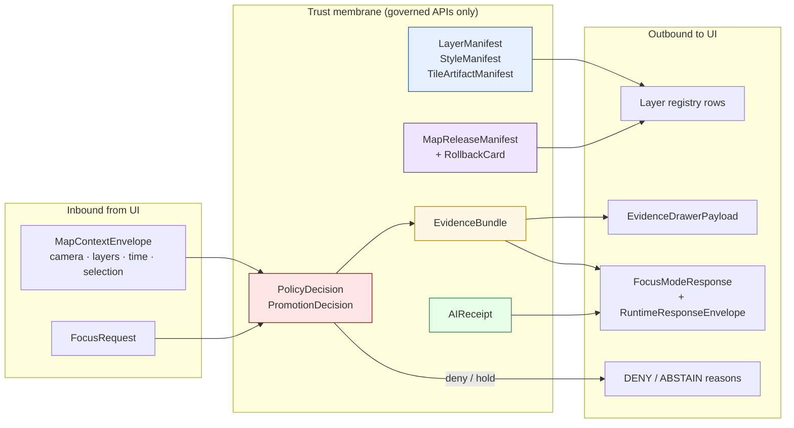
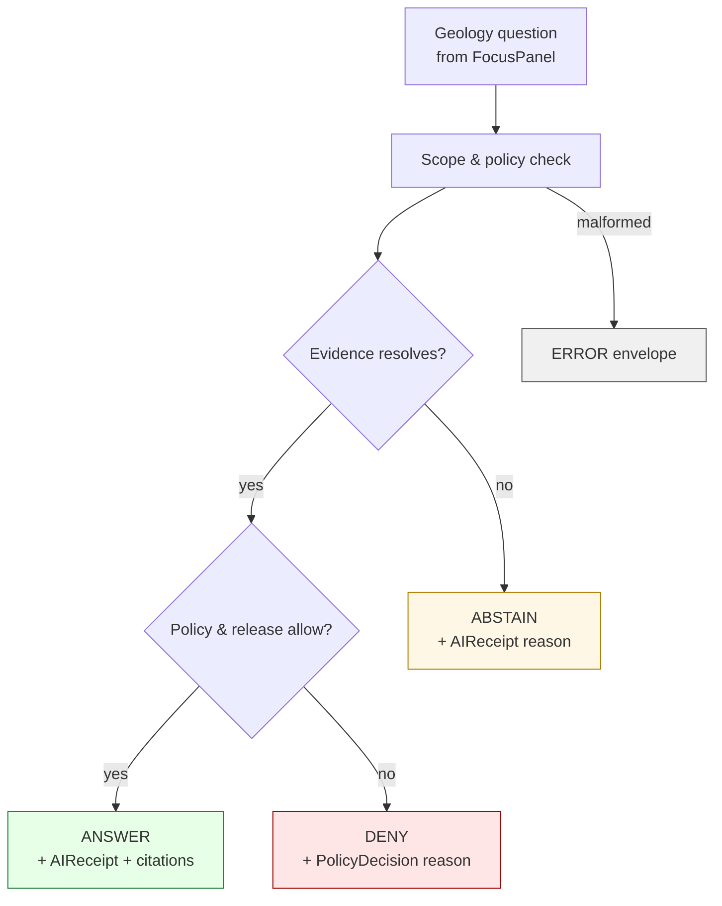

<!-- [KFM_META_BLOCK_V2]
doc_id: kfm://doc/geology-map-ui-contracts
title: Geology — Map & UI Contracts
type: standard
version: v1
status: draft
owners: <Geology domain steward + MapLibre/UI steward — TODO>
created: 2026-05-16
updated: 2026-05-16
policy_label: public
related:
  - docs/domains/geology/README.md
  - docs/architecture/maplibre-master.md
  - docs/architecture/governed-ai.md
  - docs/standards/PROV.md
  - docs/standards/PMTILES.md
  - docs/standards/OGC-API-TILES.md
  - docs/doctrine/directory-rules.md
  - docs/doctrine/trust-membrane.md
tags: [kfm, geology, maplibre, ui, governed-api, contracts]
notes:
  - All Geology API routes, schema files, and adapter paths quoted here are PROPOSED until verified against a mounted repository.
  - This document is a domain profile of the cross-cutting MapLibre + Governed-AI contract spine; it does not introduce new contract families.
[/KFM_META_BLOCK_V2] -->

# Geology — Map & UI Contracts

> Cross-cutting MapLibre and governed-AI contracts as they apply to the **Geology and Natural Resources** domain — what the map shell, Evidence Drawer, Focus Mode, and timeline are allowed to ask for, render, and deny on Geology surfaces.


| Field | Value |
|---|---|
| **Status** | Draft · PROPOSED implementation |
| **Owners** | Geology domain steward + MapLibre/UI steward · **TODO** confirm |
| **Last updated** | 2026-05-16 |
| **Authority** | CONFIRMED doctrine (cross-cutting contracts) · PROPOSED Geology specialization |

---

## Contents

1. [Scope & purpose](#1-scope--purpose)
2. [Repo fit](#2-repo-fit)
3. [Contract surface at a glance](#3-contract-surface-at-a-glance)
4. [Geology viewing products → contract bindings](#4-geology-viewing-products--contract-bindings)
5. [Inbound: `MapContextEnvelope` for Geology](#5-inbound-mapcontextenvelope-for-geology)
6. [Outbound: `LayerManifest` for Geology layers](#6-outbound-layermanifest-for-geology-layers)
7. [Outbound: `EvidenceDrawerPayload` for Geology features](#7-outbound-evidencedrawerpayload-for-geology-features)
8. [Outbound: Focus Mode envelope (`AIReceipt`-bearing)](#8-outbound-focus-mode-envelope-aireceipt-bearing)
9. [Sensitivity tiers, redaction, and public-safe geometry](#9-sensitivity-tiers-redaction-and-public-safe-geometry)
10. [Time model and timeline behavior](#10-time-model-and-timeline-behavior)
11. [3D, cross-section, and subsurface delivery](#11-3d-cross-section-and-subsurface-delivery)
12. [Trust-visible UI state](#12-trust-visible-ui-state)
13. [Anti-patterns](#13-anti-patterns)
14. [Validators, tests, fixtures](#14-validators-tests-fixtures)
15. [Open verification items](#15-open-verification-items)
16. [Related docs](#16-related-docs)
17. [Appendix · Illustrative envelopes](#17-appendix--illustrative-envelopes)

---

## 1. Scope & purpose

This document specifies, for the **Geology and Natural Resources** domain, the shape and behavior of every contract the map shell exchanges with the governed API and the Evidence Drawer / Focus Mode surfaces. It is a **domain profile** of the cross-cutting MapLibre + Governed-AI contract spine — it does not introduce new contract families, it constrains how the existing ones are populated and gated for Geology.

**In scope.** Geology layer registration; tile artifact binding; clicked-feature resolution into an Evidence Drawer payload; Focus Mode synthesis over released Geology evidence; sensitivity-driven UI behavior for boreholes, well logs, samples, and resource detail; timeline behavior over interpretation-versioned units; 3D/cross-section admission.

**Out of scope.** Authoring of Geology evidence (handled by ingestion/normalization in `pipelines/`), AI runtime selection (handled by `runtime/`), policy authoring (handled by `policy/domains/geology/`), and tile production (handled per [PMTILES](../../standards/PMTILES.md) and [OGC-API-TILES](../../standards/OGC-API-TILES.md)).

> [!IMPORTANT]
> The map renderer is **not** truth. Per KFM Operating Law, MapLibre and any 2D/3D renderer are downstream of the trust membrane; they render released artifacts and view state and never substitute for `EvidenceBundle` resolution. This rule is **CONFIRMED doctrine** and applies to Geology without exception.

---

## 2. Repo fit

| Aspect | Value |
|---|---|
| **This file** | `docs/domains/geology/MAP_UI_CONTRACTS.md` (PROPOSED) |
| **Owning root** | `docs/` (human explanation; [Directory Rules §4](../../doctrine/directory-rules.md)) |
| **Domain segment** | `docs/domains/geology/` per Directory Rules §12 Domain Placement Law |
| **Upstream doctrine** | `docs/architecture/maplibre-master.md` · `docs/architecture/governed-ai.md` · `docs/doctrine/trust-membrane.md` (paths PROPOSED) |
| **Downstream consumers** | Geology layer registry; Evidence Drawer renderer; Focus Mode adapter; MapLibre/Cesium adapter packages |
| **Schema homes (PROPOSED)** | `schemas/contracts/v1/domains/geology/` (per Directory Rules §7.4 + ADR-0001) |
| **Policy homes (PROPOSED)** | `policy/domains/geology/release/` · `policy/domains/geology/sensitivity/` |
| **Fixture homes (PROPOSED)** | `fixtures/domains/geology/map-ui/` |

> [!NOTE]
> Per Directory Rules §3 and §12, **geology is a lane, not a root.** Every path above places Geology as a `domains/geology/` segment inside an established responsibility root. No new root folder is introduced by this document.

---

## 3. Contract surface at a glance

The map/UI contract surface for Geology is the same set of governed objects used by every map-bearing domain. What changes is what populates them, which sensitivity defaults apply, and which finite outcomes a Geology surface is **allowed** to return.



| Contract family | Role on Geology surfaces | Source of authority | Status |
|---|---|---|---|
| `SourceDescriptor` | Identifies KGS, USGS geologic maps, borehole/well-log repositories, KCC, reclamation programs, 3DEP | [MAP-MASTER] [DOM-GEOL] | CONFIRMED family · PROPOSED schema home |
| `LayerManifest` | Public-safe Geology layer contract — bedrock, surficial, structures, generalized boreholes, etc. | [MAP-MASTER] | CONFIRMED family · PROPOSED Geology row |
| `StyleManifest` | Versioned style for Geology layers; legend, scale badges, uncertainty notes per ML-057-009 | [MAP-MASTER] | CONFIRMED family · PROPOSED Geology rows |
| `TileArtifactManifest` | Binds PMTiles/COG/MVT for Geology to digest, source, bounds, signatures | [MAP-MASTER] | CONFIRMED family · PROPOSED Geology rows |
| `MapReleaseManifest` | Ties released Geology layer/style/tile set + rollback target | [MAP-MASTER] | CONFIRMED family · PROPOSED Geology slice |
| `MapContextEnvelope` | Map-to-AI context (camera, visible Geology layers, time, selection) | [MAP-MASTER] [UIAI] | CONFIRMED family |
| `EvidenceDrawerPayload` | Governed projection of `EvidenceBundle` for a clicked Geology feature | [MAP-MASTER] [GAI] | CONFIRMED family · PROPOSED Geology projection |
| `RuntimeResponseEnvelope` + `AIReceipt` | Focus Mode outcome with citations / abstain / deny / error | [GAI] | CONFIRMED family |
| `PolicyDecision` / `PromotionDecision` | Allow / deny / hold over Geology release-state and sensitivity | [ENCY] [DIRRULES] | CONFIRMED |
| `RedactionReceipt` / `AggregationReceipt` | Records public-safe geometry transforms for boreholes, samples, sensitive deposits | [ENCY] [DOM-GEOL] | CONFIRMED family · PROPOSED implementation |

> [!NOTE]
> None of the contract files, route names, or adapter classes are claimed to exist in the repository from this document alone. All implementation maturity is **PROPOSED / NEEDS VERIFICATION** until inspected against mounted-repo evidence.

[Back to top](#contents)

---

## 4. Geology viewing products → contract bindings

The v1.1 Atlas Chapter 10 enumerates the viewing products Geology may expose on a public map. Each maps onto a `LayerManifest` row, a tile artifact, and a default sensitivity tier. The encyclopedia adds the cross-section and 3D subsurface views.

| Viewing product | Geometry | Default tier | Special handling | Sources |
|---|---|---|---|---|
| Bedrock unit map | Polygon | **T0** | Legend + scale + uncertainty fields required (ML-057-009) | [DOM-GEOL] [ENCY] |
| Surficial unit map | Polygon | **T0** | Same legend/scale/uncertainty discipline | [DOM-GEOL] [ENCY] |
| Structure / fault view | Line | **T0** | Interpretation version pinned in manifest | [DOM-GEOL] [ENCY] |
| Stratigraphy / correlation view | Tabular + cross-link | **T0** | Reference-only; not a coordinate-bearing layer | [DOM-GEOL] [ENCY] |
| Borehole public-generalized view | Point (generalized) | **T1** | `RedactionReceipt` required; exact coords are T2/T4 | [DOM-GEOL] [ENCY] |
| Mineral occurrence / deposit summary | Point / polygon (aggregate) | **T0 aggregate · T2 detail** | Occurrence ≠ deposit ≠ estimate ≠ reserve — anti-collapse | [DOM-GEOL] [ENCY] |
| Extraction / reclamation context | Polygon (often generalized) | **T1** | License review for KGS COGs/tiles (ML-057-008) | [MAP-MASTER] [DOM-GEOL] |
| Hydrostratigraphic context | Polygon | **T0** | Cited from Hydrology lane; do not replace measurements | [DOM-GEOL] [DOM-HYD] |
| Cross-section view | Line + section | **T0** | Bound to `InterpretationVersion`; uncertainty surfaced | [ENCY] |
| 3D subsurface view | Surface / voxel | **T0 / T1 / T2 / T4** by content | Requires admission policy + Reality Boundary Note | [MAP-MASTER] [UIAI] |
| Uncertainty mode | Overlay | **T0** | Renders `UncertaintySurface` from Spatial Foundation | [ENCY] [MAP-MASTER] |
| Evidence Drawer view | n/a (UI mode) | n/a | Cross-cutting; see §7 | [MAP-MASTER] [GAI] |
| Time-aware state | n/a (UI mode) | n/a | See §10 | [MAP-MASTER] |
| Sensitivity-redacted view | n/a (UI mode) | n/a | See §9 | [ENCY] |
| Correction / stale-state view | n/a (UI mode) | n/a | Driven by `CorrectionNotice` + freshness | [ENCY] |
| Governed Focus Mode | n/a (UI mode) | n/a | See §8 | [GAI] [UIAI] |

> [!IMPORTANT]
> **Resource-class anti-collapse is a Geology hard rule.** `MineralOccurrence`, `ResourceDeposit`, `ResourceEstimate`, `PermitRecord`, `ProductionRecord`, and `ReserveClaim` are distinct object families; the UI MUST NOT render them as a single layer or merge them into a single popup field. Source-role distinction follows v1.1 §24.1. (CONFIRMED / PROPOSED — `[DOM-GEOL]` `[ENCY]`.)

[Back to top](#contents)

---

## 5. Inbound: `MapContextEnvelope` for Geology

When the map shell asks the governed API for a Geology answer — whether a Focus Mode question, a click-to-drawer resolution, or a layer load — it sends a `MapContextEnvelope`. The cross-cutting envelope is defined by [MAP-MASTER]; the Geology-specific constraints below extend, not replace, that definition.

| Field | Geology constraint | Status |
|---|---|---|
| `camera` (bounds, zoom) | Required; zoom must be within the manifest's allowed scale support | CONFIRMED doctrine · PROPOSED field realization |
| `visible_layer_ids` | Must reference Geology rows that resolve to a current `MapReleaseManifest` | CONFIRMED doctrine · PROPOSED |
| `time_state` | Must distinguish source / observed / valid / retrieval / release times (see §10) | CONFIRMED doctrine |
| `selection` | If a borehole / well-log / sample is referenced, selection MUST carry the `RedactionReceipt` reference for any generalized geometry | PROPOSED |
| `interpretation_version` | Required when a layer represents a versioned interpretation (units, structures, cross-sections) | PROPOSED |
| `policy_label` | Carried unchanged from the map shell; the governed API re-validates and does not trust client value | CONFIRMED doctrine |

> [!CAUTION]
> The envelope is the only thing the governed API is allowed to see from the client. It **must not** include raw feature payloads, candidate IDs from `WORK`/`QUARANTINE`, or unmasked sensitive coordinates. Per [MAP-MASTER], the provider receives only allowed context. (CONFIRMED doctrine.)

[Back to top](#contents)

---

## 6. Outbound: `LayerManifest` for Geology layers

The `LayerManifest` is the layer contract. For Geology, every published row binds a source identity, a tile/style artifact pair, an evidence reference, a sensitivity posture, and a release state.

**Geology-specific required fields (PROPOSED on top of the cross-cutting manifest):**

| Field | Purpose | Why Geology cares |
|---|---|---|
| `source_role` | observed · regulatory · modeled · aggregate · administrative · candidate · synthetic | Resource-estimate vs. occurrence vs. permit confusion is the single most common Geology drift; explicit role is mandatory |
| `interpretation_version` | Identifier for the interpretation cycle (map series, edition) | Bedrock/surficial maps are interpretive; rendering without version pin is uncited claim |
| `uncertainty_descriptor` | Reference to `UncertaintySurface` or qualitative class | Required by ML-057-009 (legends/scale/uncertainty) |
| `license_review_ref` | Pointer to license review for KGS/USGS derived COGs/tiles | ML-057-008 — license gate before public tile/COG release |
| `legend_descriptor` | `unit_code` legend (lithology / age) | ML-057-009 |
| `scale_support` | Allowed zoom range + scale label | Prevents false-precision rendering of small-scale interpretive maps |
| `redaction_profile_ref` | Named profile if generalization applied (boreholes, samples) | Determinism — see C6-02 named redaction profiles |
| `release_state` | PUBLISHED | Only PUBLISHED layers reach the layer catalog |
| `rollback_target` | Prior `MapReleaseManifest` reference | Required for every release per [MAP-MASTER] |

Outcomes returned by the **Geology layer manifest resolver** are `ANSWER / DENY / ERROR` only — there is no ABSTAIN on layer enumeration (a layer is either released or not). (CONFIRMED per v1.0 Atlas §J for Geology and the v1.1 Master Outcome × Surface mapping.)

[Back to top](#contents)

---

## 7. Outbound: `EvidenceDrawerPayload` for Geology features

A clicked Geology feature MUST resolve through the governed API into an `EvidenceDrawerPayload`. Popups, hovers, and badges are not substitutes; they may display state but they are **not** the evidence surface. (CONFIRMED doctrine — [MAP-MASTER].)

**Geology projection requirements (PROPOSED):**

- The payload carries `EvidenceBundle` references for the unit / structure / borehole / occurrence claim — not raw source bytes.
- It surfaces **source role** prominently: a `MineralOccurrence` payload must not be readable as a `ResourceEstimate`.
- Borehole / well-log / sample payloads include the `RedactionReceipt` if any generalization was applied, plus the named profile id.
- Rights / license posture is visible alongside the data field (KGS license review status, attribution).
- Citations follow the project copyright/citation discipline; the drawer never silently strips attribution.
- Outcome surface is finite: `ANSWER / ABSTAIN / DENY / ERROR`. (CONFIRMED — v1.1 §24.3.)

> [!WARNING]
> A Geology drawer payload is **forbidden** from resolving against `RAW`, `WORK`, `QUARANTINE`, or unreleased catalog candidates. The trust-membrane invariant applies without exception. (CONFIRMED — [DIRRULES] [ENCY].)

[Back to top](#contents)

---

## 8. Outbound: Focus Mode envelope (`AIReceipt`-bearing)

Focus Mode may synthesize **only** over released Geology `EvidenceBundle`s. The cross-cutting rule from [GAI] holds verbatim here.



**Geology-specific Focus Mode behavior (CONFIRMED doctrine / PROPOSED implementation):**

- AI may summarize released Geology `EvidenceBundle`s, compare evidence, explain limitations, and draft steward-review notes.
- AI MUST **ABSTAIN** when evidence is insufficient (e.g., asked about a borehole with no released generalized representation).
- AI MUST **DENY** when policy, rights, sensitivity, or release state forbids — typical for exact borehole coordinates, sample locations, private well data, sensitive resource detail, and unreviewed KGS-licensed material.
- AI MUST NOT collapse `MineralOccurrence` / `ResourceDeposit` / `ResourceEstimate` / `PermitRecord` distinctions into a single statement; this is an enforced anti-collapse case under v1.1 §24.1.
- Every Focus Mode response emits an `AIReceipt` recording evidence refs, policy decision, citation validation, runtime configuration (per ML-063-032/-046/-047), and finite outcome.

[Back to top](#contents)

---

## 9. Sensitivity tiers, redaction, and public-safe geometry

Geology sits across the full tier range. The defaults below extend v1.1 §24.5 and the v1.0 §I posture for Chapter 10.

| Object class | Default tier | Allowed transforms | Gates required |
|---|---|---|---|
| `GeologicUnit`, `Lithology`, `StratigraphicInterval`, `StructureFeature` | **T0** | None typically needed | Standard release |
| `MineralOccurrence` (aggregate) | **T0** | None | Standard release |
| `MineralOccurrence` / `ResourceDeposit` (detail in sensitive context) | **T2** | Generalized geometry → T1 | `RedactionReceipt` + steward review |
| `BoreholeReference`, `WellLogReference`, `GeochemistrySample`, `CoreSample` | **T1 / T2 / T4** by source-rights | Generalization (named profile) → T1 | `RedactionReceipt` + rights review |
| Private well / proprietary log | **T4 default** | None to public | Steward + rights-holder agreement to demote |
| `ResourceEstimate`, `ReserveClaim`, production data | **T2** typically | Aggregate → T1 / T0 | `AggregationReceipt`; never published as observed truth |
| Sensitive `ExtractionSite` detail | **T2 / T4** | Generalized footprint → T1 | License + steward review |

> [!CAUTION]
> Exact borehole, sample, sensitive resource, well-log, and private well locations **default to restricted or generalized public geometry**. Occurrence / deposit / estimate / permit / production / reserve claims must remain distinct surfaces. (CONFIRMED / PROPOSED — `[DOM-GEOL]` `[ENCY]`.)

**At the UI layer, this means:**

- Layers carrying generalized geometry MUST advertise the redaction profile id in their `LayerManifest` and in any `EvidenceDrawerPayload` they emit.
- The drawer displays a redaction badge with the profile name and parameters; clicking it does **not** unmask.
- The Focus Mode adapter denies any synthesis that would re-narrow generalized coordinates back to a precise location.

[Back to top](#contents)

---

## 10. Time model and timeline behavior

Geology is interpretation-versioned, not just observation-versioned. The timeline must therefore separate:

| Time field | Geology meaning | Status |
|---|---|---|
| `source_time` | Date asserted by the source (map publication date, log date, sample date) | CONFIRMED doctrine |
| `observed_time` | When the underlying geological phenomenon was observed / measured | CONFIRMED |
| `valid_time` | The time range a unit / structure is asserted to apply to (often open) | CONFIRMED |
| `retrieval_time` | When KFM retrieved or harvested the artifact | CONFIRMED |
| `release_time` | When KFM published this version | CONFIRMED |
| `correction_time` | When a `CorrectionNotice` modified this surface | CONFIRMED |
| `interpretation_version` | Edition / map-series identifier — a Geology-specific extension of the temporal model | PROPOSED |

Per ML-061-091/-092 and ML-064-096, the timeline MUST NOT collapse these into a single "date." Per ML-P-001 and ML-P-002, unsupported time requests on Geology layers MUST result in **ABSTAIN** rather than a falsely confident render. (CONFIRMED evidence in [MAP-MASTER]; PROPOSED Geology fixtures.)

[Back to top](#contents)

---

## 11. 3D, cross-section, and subsurface delivery

3D subsurface views are a high-value, high-risk Geology capability. The doctrine from [MAP-MASTER] and [UIAI] applies in full.

| Surface | Contract bindings | Sensitivity default | Notes |
|---|---|---|---|
| Cross-section overlay (2D) | `LayerManifest` + interpretation_version | T0 | Bound to evidence drawer for the parent units |
| 3D subsurface scene | `SceneManifest` + `TerrainModel` + `3DTileSet` | T0 / T1 / T2 / T4 by content | Admission policy required; Reality Boundary Note mandatory for synthetic surfaces |
| Voxel / volume rendering | 3D Tiles + `RepresentationReceipt` | T1+ | Synthetic interpolations must be labeled, not rendered as observed |
| Borehole 3D markers | Generalized points + redaction profile | T1 / T2 | Never exact at public tier |

> [!IMPORTANT]
> **Cesium / 3D is an alternate renderer, not an alternate truth path.** It consumes the same `EvidenceBundle` and `DecisionEnvelope` as 2D. This is a [DIRRULES] invariant.

[Back to top](#contents)

---

## 12. Trust-visible UI state

Cross-cutting trust-visible state from [MAP-MASTER] S./ML-S-056..S-060 applies to Geology layers without modification.

| State | What it means on a Geology surface |
|---|---|
| **Released / fresh** | Layer reaches catalog via `MapReleaseManifest`; source/retrieval times are within freshness window |
| **Stale** | Source or retrieval time crossed a defined threshold (e.g., quarterly KGS update missed) — badge shown, drawer notes staleness |
| **Degraded** | Tile or style asset failed integrity check; layer rendered with warning |
| **Denied** | Sensitivity, rights, or release-state forbids — DENY reason surfaced |
| **Provisional** | Candidate that has not survived promotion — never on the public layer catalog; visible only in steward views |
| **Under correction** | A `CorrectionNotice` is active — drawer shows correction lineage |

Badges MUST NOT be used as the evidence surface. They are state indicators; the drawer is where evidence resolves. (CONFIRMED — [MAP-MASTER].)

[Back to top](#contents)

---

## 13. Anti-patterns

> [!WARNING]
> These patterns are explicitly forbidden for the Geology map/UI surface. Each is grounded in v1.1 Atlas §24.1 (Source-Role Anti-Collapse) or [MAP-MASTER] anti-pattern lists.

- **Treating a layer as truth.** A rendered Geology tile is a downstream carrier; the claim it depicts must resolve through `EvidenceBundle`.
- **Collapsing resource classes.** Rendering `MineralOccurrence`, `ResourceDeposit`, `ResourceEstimate`, `PermitRecord`, and `ProductionRecord` in the same color / popup field.
- **Aggregate → per-place inference.** Using a county- or HUC-aggregated Geology product to answer a per-borehole or per-parcel question. Per v1.1 §24.1.2, this MUST `DENY` at the trust membrane and `ABSTAIN` at Focus Mode.
- **Style-based sensitivity hiding.** Using MapLibre style filters to "hide" sensitive borehole points while leaving the underlying tile data intact. Sensitivity must be enforced at the manifest / tile / API layer, not the style layer. (Per [MAP-MASTER] anti-pattern list.)
- **Popup-as-drawer.** Stuffing evidence into a MapLibre popup so the user "doesn't have to" open the drawer. The drawer is the evidence surface; popups are state.
- **Badge-as-proof.** Treating a trust badge or freshness chip as if it were citation. Badges signal state; the drawer carries proof.
- **AI text as evidence.** Allowing Focus Mode prose to stand in for a `EvidenceBundle` citation. AI surfaces emit `AIReceipt`; they do not become primary truth.
- **Treating a screenshot, vector index, or graph projection as sovereign Geology truth.** All of these are derivatives.
- **Unreviewed KGS-licensed tile publication.** Publishing geology COGs/tiles before license review (ML-057-008) is a release-policy failure.

[Back to top](#contents)

---

## 14. Validators, tests, fixtures

Per Atlas Chapter 10 §K, the following validator/test families are **PROPOSED** for the Geology map/UI surface. Specific paths require mounted-repo verification.

| Test family | What it proves | Status |
|---|---|---|
| Source-role validators | A Geology surface cannot present `MineralOccurrence` as `ResourceEstimate` | PROPOSED · `[DOM-GEOL]` `[ENCY]` |
| Resource-class anti-collapse tests | Class-pair confusion fails closed | PROPOSED |
| Public-safe geometry tests | Boreholes, well logs, samples never expose exact coords on public tier | PROPOSED |
| Borehole / well-log rights tests | Private / proprietary records deny at the membrane | PROPOSED |
| Catalog closure tests | Every published Geology layer has `EvidenceBundle`, `MapReleaseManifest`, rollback target | PROPOSED |
| AI-evidence-before-model tests | Focus Mode answers only over released bundles; `ABSTAIN` on missing evidence | PROPOSED |
| License-review gate tests | KGS COG/tile publication blocked without license review (ML-057-008) | PROPOSED |
| Legend / scale / uncertainty surface tests | Manifests expose required display fields (ML-057-009) | PROPOSED |
| Time-field validation | Timeline distinguishes source / observed / valid / retrieval / release / correction times | PROPOSED |
| Click-to-drawer tests | Geology features resolve through governed API to `EvidenceDrawerPayload` | PROPOSED |
| No-public-RAW path test | UI cannot fetch `RAW`/`WORK`/`QUARANTINE` Geology artifacts | PROPOSED |
| Rollback replay | A prior Geology `MapReleaseManifest` can be restored | PROPOSED |

[Back to top](#contents)

---

## 15. Open verification items

| Item | Evidence that would settle it | Status |
|---|---|---|
| Confirm Geology layer manifest schema home in mounted repo | File presence under `schemas/contracts/v1/domains/geology/` (or wherever ADR-0001 directs) | NEEDS VERIFICATION |
| Confirm Geology Evidence Drawer projection schema | Schema file + fixtures + click-to-drawer test in repo | NEEDS VERIFICATION |
| Confirm KGS / USGS / KCC `SourceDescriptor` rows and rights status | Source-registry entries + license review records | NEEDS VERIFICATION |
| Define resource-classification scheme + tests | Atlas Ch. 10 §N item; requires ADR or steward decision | NEEDS VERIFICATION |
| Confirm borehole / well-log public policy + named redaction profiles | `policy/domains/geology/sensitivity/` content + profile catalog | NEEDS VERIFICATION |
| Confirm Geology API route(s) and `GeologyDecisionEnvelope` shape | Route inventory ADR + governed-API code | NEEDS VERIFICATION |
| Confirm MapLibre adapter for Geology layer binding | `packages/maplibre/` or equivalent + Geology adapter | NEEDS VERIFICATION |
| Confirm Focus Mode adapter behavior over Geology evidence | Adapter fixtures + ANSWER/ABSTAIN/DENY/ERROR test matrix | NEEDS VERIFICATION |
| Confirm 3D admission policy for Geology subsurface scenes | `policy/release/scene/` content per Atlas Ch. 18 | NEEDS VERIFICATION |
| Confirm `PROV.md` vs. `PROVENANCE.md` naming as it appears in cross-links | Repo doc index | NEEDS VERIFICATION |

[Back to top](#contents)

---

## 16. Related docs

- `docs/domains/geology/README.md` — Geology domain landing page (TODO link)
- `docs/architecture/maplibre-master.md` — Cross-cutting MapLibre contract spine (PROPOSED path)
- `docs/architecture/governed-ai.md` — Governed AI / Focus Mode doctrine (PROPOSED path)
- `docs/doctrine/directory-rules.md` — Placement law
- `docs/doctrine/trust-membrane.md` — Trust-membrane invariant
- `docs/standards/PROV.md` — W3C PROV-O / PAV profile
- `docs/standards/PMTILES.md` — PMTiles v3 governance
- `docs/standards/OGC-API-TILES.md` — OGC API Tiles delivery profile
- `docs/atlases/KFM_Domains_Culmination_Atlas_v1_1.pdf` — Chapter 10 (Geology) + §24.1 (source-role anti-collapse) + §24.5 (sensitivity tiers)

---

## 17. Appendix · Illustrative envelopes

> [!NOTE]
> The fragments below are **illustrative**. They are not authoritative schemas. Field names, casing, and presence are PROPOSED; the canonical schemas live (or will live) under `schemas/contracts/v1/...` per ADR-0001.

<details>
<summary><strong>A. Illustrative <code>MapContextEnvelope</code> for a Geology Focus Mode question</strong></summary>

```jsonc
{
  "object_type": "MapContextEnvelope",
  "schema_version": "v1",
  "envelope_id": "mce-geology-001",
  "camera": {
    "bounds": [-100.2, 37.9, -99.4, 38.7],
    "zoom": 10
  },
  "time_state": {
    "valid_time": "1900-01-01/..",
    "release_time_max": "2026-05-16T00:00:00Z"
  },
  "visible_layer_ids": [
    "geology.bedrock_units@v3",
    "geology.surficial_units@v2",
    "geology.boreholes_generalized@v1"
  ],
  "selection": {
    "feature_ref": "kfm://geology/borehole/redacted/abc123",
    "redaction_receipt_ref": "kfm://receipt/redaction/sinc-obscure-10km/xyz"
  },
  "interpretation_version": "kgs-bedrock-2024",
  "policy_label": "public"
}
```

</details>

<details>
<summary><strong>B. Illustrative <code>EvidenceDrawerPayload</code> for a clicked Geology unit</strong></summary>

```jsonc
{
  "object_type": "EvidenceDrawerPayload",
  "schema_version": "v1",
  "outcome": "ANSWER",
  "feature_ref": "kfm://geology/unit/Pleistocene_loess/abc",
  "claim": {
    "subject": "GeologicUnit",
    "predicate": "lithology",
    "object": "loess",
    "interpretation_version": "kgs-surficial-2023"
  },
  "evidence_refs": [
    "kfm://evidence/bundle/geology/abc",
    "kfm://evidence/source/kgs-surficial-map-2023"
  ],
  "source_role": "observed",
  "policy_decision": {"outcome": "allow", "reason_code": null},
  "release_state": "PUBLISHED",
  "uncertainty": {"class": "interpretive-map-scale"},
  "rights": {"license": "KGS - reviewed", "attribution_required": true}
}
```

</details>

<details>
<summary><strong>C. Illustrative Focus Mode <code>RuntimeResponseEnvelope</code> — ABSTAIN case</strong></summary>

```jsonc
{
  "object_type": "RuntimeResponseEnvelope",
  "schema_version": "v1",
  "outcome": "ABSTAIN",
  "ai_receipt": {
    "object_type": "AIReceipt",
    "evidence_refs": [],
    "abstain_reason": "no released EvidenceBundle for exact borehole coordinate at requested precision",
    "policy_decision": {"outcome": "allow", "reason_code": null},
    "model_config": {"runtime": "ollama", "num_ctx": 8192}
  },
  "citation_validation": {"required": true, "present": false}
}
```

</details>

<details>
<summary><strong>D. Illustrative Focus Mode <code>RuntimeResponseEnvelope</code> — DENY case (borehole exact coords)</strong></summary>

```jsonc
{
  "object_type": "RuntimeResponseEnvelope",
  "schema_version": "v1",
  "outcome": "DENY",
  "ai_receipt": {
    "object_type": "AIReceipt",
    "evidence_refs": [],
    "policy_decision": {
      "outcome": "deny",
      "reason_code": "sensitivity.borehole.exact_coordinate"
    },
    "alternative_surface": "geology.boreholes_generalized@v1"
  }
}
```

</details>

[Back to top](#contents)

---

**Related docs:** [Geology README](./README.md) · [MapLibre Master](../../architecture/maplibre-master.md) · [Governed AI](../../architecture/governed-ai.md) · [Directory Rules](../../doctrine/directory-rules.md) · [Trust Membrane](../../doctrine/trust-membrane.md)
**Last updated:** 2026-05-16
**[↑ Back to top](#contents)**
