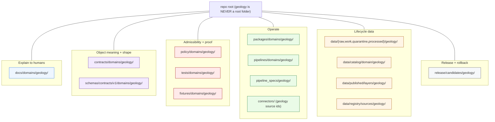

<!-- [KFM_META_BLOCK_V2]
doc_id: kfm://doc/missing-or-planned-files/geology
title: Geology — Missing or Planned Files
type: standard
subtype: domain-file-inventory
version: v1.1
status: draft
owners: <docs-steward + geology-domain-steward>   # PLACEHOLDER, NEEDS VERIFICATION
created: 2026-05-17
updated: 2026-06-04
policy_label: public
authoring_session: Docs-only. No mounted repo, CI run, workflow, dashboard, runtime log, or release artifact inspected. Every path-existence claim is PROPOSED / NEEDS VERIFICATION.
authority_posture: Inventory / planning tracker. Not normative. Subordinate to ai-build-operating-contract.md (CONTRACT_VERSION 3.0.0), directory-rules.md, DOM-GEOL (Atlas Ch. 10), and accepted ADRs.
related:
  - docs/doctrine/ai-build-operating-contract.md   # CONTRACT_VERSION 3.0.0
  - docs/doctrine/directory-rules.md               # v1.3 — placement law
  - docs/domains/geology/README.md                 # PROPOSED, NEEDS VERIFICATION
  - docs/domains/geology/FILE_SYSTEM_PLAN.md        # companion lane map
  - docs/domains/geology/IDENTITY_MODEL.md          # object identity
  - docs/domains/geology/MAP_UI_CONTRACTS.md        # map/ui contract profile
  - docs/domains/geology/EXPANSION_BACKLOG.md       # GEOL-EXP-* backlog
  - docs/registers/VERIFICATION_BACKLOG.md          # PROPOSED, NEEDS VERIFICATION
  - docs/registers/DRIFT_REGISTER.md                # PROPOSED, NEEDS VERIFICATION
tags: [kfm, geology, dom-geol, planning, inventory, missing-files, doctrine-adjacent]
notes:
  - "Paths are PROPOSED until verified against the mounted repo."
  - "Object families and source families are CONFIRMED from DOM-GEOL (Atlas Ch. 10 §B, §D); SurficialUnit and ResourceEstimate are INFERRED expansions, not in the Atlas §B roster verbatim."
  - "The four N. verification-backlog items mirror v1.1 Atlas Ch. 10 §N verbatim."
  - "Doctrine-adjacent — pins CONTRACT_VERSION = 3.0.0 (ai-build-operating-contract.md)."
  - "Path form uses the canonical SEGMENT form (Directory Rules Step 3). The flat form (Atlas §24.13 / ENCY §7.1) is a known crosswalk drift, CDR-GEOL-01 — see §9."
  - "This file was completed from a truncated draft that ended mid-Mermaid at §3; §3 onward reconstructed per the document's own TOC and established geology-lane conventions."
[/KFM_META_BLOCK_V2] -->

<a id="top"></a>

# Geology — Missing or Planned Files

> Inventory of files the geology domain lane is **expected to host** across KFM's responsibility roots, but which are **not yet verified to exist** in the mounted repository. This is a planning and verification tracker — not authority.

<!-- Top-of-file badge row -->


-2ea44f)


<!-- TODO: replace once CI/build is verified --> 

| Field | Value |
|---|---|
| **Status** | draft |
| **Owners** | `<docs-steward>` + `<geology-domain-steward>` *(placeholder, NEEDS VERIFICATION)* |
| **Last updated** | 2026-06-04 |
| **Authority** | Inventory / planning artifact (not normative; subordinate to the operating contract, Directory Rules, and DOM-GEOL) |
| **Contract pin** | `CONTRACT_VERSION = "3.0.0"` (`ai-build-operating-contract.md`) |
| **Repo evidence in this session** | **None mounted** — all path-existence claims are PROPOSED |

---

## Quick jump

- [1. Purpose](#1-purpose)
- [2. How to read this file](#2-how-to-read-this-file)
- [3. Geology lane map](#3-geology-lane-map)
- [4. Inventory by responsibility root](#4-inventory-by-responsibility-root)
  - [4.1 `docs/domains/geology/`](#41-docsdomainsgeology)
  - [4.2 `contracts/domains/geology/`](#42-contractsdomainsgeology)
  - [4.3 `schemas/contracts/v1/domains/geology/`](#43-schemascontractsv1domainsgeology)
  - [4.4 `policy/domains/geology/`](#44-policydomainsgeology)
  - [4.5 `tests/domains/geology/`](#45-testsdomainsgeology)
  - [4.6 `fixtures/domains/geology/`](#46-fixturesdomainsgeology)
  - [4.7 `packages/domains/geology/`](#47-packagesdomainsgeology)
  - [4.8 `pipelines/domains/geology/` and `pipeline_specs/geology/`](#48-pipelinesdomainsgeology-and-pipeline_specsgeology)
  - [4.9 `data/<phase>/geology/` (lifecycle)](#49-dataphasegeology-lifecycle)
  - [4.10 `data/registry/sources/geology/`](#410-dataregistrysourcesgeology)
  - [4.11 `release/candidates/geology/`](#411-releasecandidatesgeology)
- [5. Object family ↔ file crosswalk](#5-object-family--file-crosswalk)
- [6. Source family ↔ source descriptor crosswalk](#6-source-family--source-descriptor-crosswalk)
- [7. Validator / test home inventory](#7-validator--test-home-inventory)
- [8. Verification backlog](#8-verification-backlog)
- [9. Open ADRs that gate placement](#9-open-adrs-that-gate-placement)
- [10. Anti-patterns specific to geology](#10-anti-patterns-specific-to-geology)
- [11. Status snapshot & next smallest useful PR](#11-status-snapshot--next-smallest-useful-pr)
- [12. Changelog](#12-changelog)
- [Related docs](#related-docs)

---

## 1. Purpose

The geology domain lane is described doctrinally by **DOM-GEOL** (Atlas Ch. 10) and placed structurally by **Directory Rules §12 — Domain Placement Law**. Together they say *what* geology owns and *where* its files belong. They do not, by themselves, say *which of those files currently exist in the repository*.

This document fills the gap. It enumerates the files the geology lane is expected to host — domain docs, contracts, schemas, policies, tests, fixtures, packages, pipelines, lifecycle data, source registry entries, and release candidates — and tracks each as **PRESENT**, **MISSING (PROPOSED to create)**, or **NEEDS VERIFICATION**. It is a planning surface, a review checklist, and a drift-prevention aid.

> [!IMPORTANT]
> This file is **inventory, not authority**. It cites doctrine; it does not create it. Where this file appears to disagree with Directory Rules, DOM-GEOL, or an accepted ADR, those higher sources win, and the conflict should be opened against `docs/registers/DRIFT_REGISTER.md` *(path PROPOSED)* per Directory Rules §2.5.

[⬆ Back to top](#top)

---

## 2. How to read this file

Each inventory row carries a status label. Apply the narrowest truthful label:

| Label | Meaning here |
|---|---|
| **CONFIRMED** | Verified in this session from attached doctrine / Atlas / Directory Rules. Used for *doctrinal* claims, not path-existence. |
| **PRESENT** | The file is verified to exist in the mounted repo. **No row currently uses this label** — no repo is mounted in this session. |
| **MISSING (PROPOSED)** | The file is expected by Directory Rules §12 + DOM-GEOL but its existence is not verified. Default state for everything below. |
| **PARTIAL** | A neighboring or compatibility-root copy is suspected; canonical home unverified. Requires a Drift Register entry on confirmation. |
| **NEEDS VERIFICATION** | Existence is checkable with a single `ls`-equivalent action; not yet checked. |
| **UNKNOWN** | Existence cannot be resolved from available evidence and is not trivially checkable. |
| **DEFERRED** | Intentionally not created; deferral reason recorded in §11 or the relevant ADR. |

> [!NOTE]
> Throughout §4–§7, the **base path is PROPOSED** for every entry. The first reviewer with mounted-repo access SHOULD walk the inventory, mark PRESENT rows where files already exist, and open Drift Register entries for any divergence from Directory Rules.

> [!CAUTION]
> **Path form (CDR-GEOL-01).** This inventory uses the canonical **segment form** (`docs/domains/geology/`, `schemas/contracts/v1/domains/geology/`, …) per Directory Rules Step 3. The Atlas §24.13 crosswalk and Encyclopedia §7.1 use a **flat** form (`schemas/contracts/v1/geology/`). That divergence is a known, ADR-class drift tracked at [§9](#9-open-adrs-that-gate-placement); a reviewer who finds the flat form in the repo records a Drift Register entry rather than creating a parallel home. *(The manifest contract families — `LayerManifest`, `EvidenceDrawerPayload`, etc. — are cross-cutting under `schemas/contracts/v1/map/` and `…/ui/`, not the geology lane; see [§7](#7-validator--test-home-inventory) and `MAP_UI_CONTRACTS.md`.)*

[⬆ Back to top](#top)

---

## 3. Geology lane map

The geology domain is a **segment inside many responsibility roots**, never a root itself. The map below is the canonical lane shape per Directory Rules §12 / Step 3.



> [!TIP]
> Read the lane map as **responsibility, not topic**. "Geology has lots of files" is never a reason to make a `geology/` root. Each box is an existing responsibility root; geology enters each as a `domains/geology/` segment (or `data/<phase>/geology/`, `pipeline_specs/geology/`, `release/candidates/geology/`). Two forms are deliberately not segment-prefixed and match Directory Rules Step 3 exactly: `pipeline_specs/geology/` (no `domains/`) and `data/catalog/domain/geology/` (singular `domain`).

[⬆ Back to top](#top)

---

## 4. Inventory by responsibility root

> Default status for every row below is **MISSING (PROPOSED)** unless otherwise noted. No repo is mounted; nothing is PRESENT. Object/source families are CONFIRMED doctrine (Atlas Ch. 10 §B/§D); file *names* and *paths* are PROPOSED.

### 4.1 `docs/domains/geology/`

Human explanation for the lane. Several of these already exist as drafts in this doc series.

| File | Responsibility | Status |
|---|---|---|
| `README.md` | Lane landing / orientation | MISSING (PROPOSED) |
| `FILE_SYSTEM_PLAN.md` | Cross-root layout plan | PROPOSED *(drafted)* |
| `IDENTITY_MODEL.md` | Deterministic identity + source roles | PROPOSED *(drafted)* |
| `MAP_UI_CONTRACTS.md` | Map/UI contract profile | PROPOSED *(drafted)* |
| `EXPANSION_BACKLOG.md` · `EXPANSION_PLAN.md` | Backlog + phased plan | PROPOSED *(drafted)* |
| `FAQ.md` | Public-safe-geometry / resource-class FAQ | PROPOSED *(drafted)* |
| `MISSING_OR_PLANNED_FILES.md` | **This document** | PROPOSED |
| `SOURCES.md` / `SOURCE_REGISTRY.md` | Source-family overview + rights matrix | MISSING (PROPOSED) |
| `POLICY.md` | Sensitivity, rights, publication policy | MISSING (PROPOSED) |
| `SCOPE.md` / `OBJECT_FAMILIES.md` | Owned objects + non-ownership | MISSING (PROPOSED) |
| `SENSITIVITY_POSTURE.md` | Borehole/well-log/extraction redactions | MISSING (PROPOSED) |

### 4.2 `contracts/domains/geology/`

Object **meaning** (Markdown). One file per CONFIRMED object family (Atlas Ch. 10 §B).

| File | Object family | Status |
|---|---|---|
| `GeologicUnit.md` | Geologic Unit | MISSING (PROPOSED) |
| `Lithology.md` · `StratigraphicInterval.md` · `GeologicAge.md` | Stratigraphy semantics | MISSING (PROPOSED) |
| `FaultStructure.md` | Fault Structure (a.k.a. StructureFeature) | MISSING (PROPOSED) |
| `CrossSection.md` | Cross-section + vertical-exaggeration disclosure | MISSING (PROPOSED) |
| `Borehole.md` · `WellLog.md` · `CoreSample.md` | Subsurface references (sensitivity hooks) | MISSING (PROPOSED) |
| `GeophysicalObservation.md` · `GeochemistrySample.md` | Observation semantics | MISSING (PROPOSED) |
| `MineralOccurrence.md` · `ResourceDeposit.md` | Anti-collapse pair | MISSING (PROPOSED) |
| `ResourceEstimate.md` | Estimate (INFERRED expansion — not in Atlas §B roster verbatim) | MISSING (PROPOSED) · INFERRED |
| `ExtractionSite.md` · `ReclamationRecord.md` | Operational semantics + rights gate | MISSING (PROPOSED) |
| `HydrostratigraphicUnit.md` | Cross-lane boundary with Hydrology | MISSING (PROPOSED) |

> [!NOTE]
> Atlas §B names `Borehole` and `Fault Structure`; the identity model uses `BoreholeReference` and `StructureFeature`. The naming drift is recorded in `IDENTITY_MODEL.md` §3.1 and is **not** an identity change — both refer to the same object. `SurficialUnit` and `ResourceEstimate` are INFERRED expansions used in companion docs but not listed verbatim in Atlas §B.

### 4.3 `schemas/contracts/v1/domains/geology/`

Machine **shape** (JSON Schema). Canonical home root is `schemas/contracts/v1/` per ADR-0001; the geology sub-path form is **CONFLICTED** (CDR-GEOL-01, §9).

| File | Schema role | Status |
|---|---|---|
| `geologic_unit.schema.json` | Polygon feature + unit/age/lithology | MISSING (PROPOSED) |
| `lithology.schema.json` · `stratigraphic_interval.schema.json` · `geologic_age.schema.json` | Stratigraphy values | MISSING (PROPOSED) |
| `fault_structure.schema.json` | Line feature | MISSING (PROPOSED) |
| `cross_section.schema.json` | Section line + display rules | MISSING (PROPOSED) |
| `borehole_reference.schema.json` · `well_log_reference.schema.json` · `core_sample.schema.json` | Reference + sensitivity-classified geometry | MISSING (PROPOSED) |
| `geophysical_observation.schema.json` · `geochemistry_sample.schema.json` | Observation records | MISSING (PROPOSED) |
| `mineral_occurrence.schema.json` · `resource_deposit.schema.json` · `resource_estimate.schema.json` | Anti-collapse trio, each carrying a `source_role` reference | MISSING (PROPOSED) |
| `extraction_site.schema.json` · `reclamation_record.schema.json` | Operational records | MISSING (PROPOSED) |
| `hydrostratigraphic_unit.schema.json` | Shared boundary; cite Hydrology profile | MISSING (PROPOSED) |

> [!WARNING]
> Do **not** create `contracts/geology/<x>.schema.json` or `jsonschema/geology/...` as a parallel authority (Directory Rules §13 / ADR-0001). `source_role` is **not** a geology schema — it is a cross-cutting `SourceDescriptor` field at `schemas/contracts/v1/sources/source_descriptor.schema.json` (Atlas §24.1.3); geology schemas reference it.

### 4.4 `policy/domains/geology/`

Allow / deny / restrict / abstain. Note: `release/*.rego` at the `release/` **root** is a drift pattern — these policy files live under `policy/domains/geology/release/…`.

| File | Decision class | Default | Status |
|---|---|---|---|
| `sensitivity/borehole_exact_geometry.rego` | Exact borehole coords | DENY public | MISSING (PROPOSED) |
| `sensitivity/well_log_disclosure.rego` | Private/proprietary logs | DENY public | MISSING (PROPOSED) |
| `sensitivity/extraction_site_exposure.rego` | Active extraction detail | RESTRICT/generalize | MISSING (PROPOSED) |
| `rights/kgs_terms.yaml` · `rights/kcc_terms.yaml` · `rights/usgs_ngmdb_terms.yaml` | Source rights bindings | NEEDS VERIFICATION | MISSING (PROPOSED) |
| `release/source_role_anti_collapse.rego` | Occurrence/deposit/estimate/permit/production/reserve | DENY on conflation | MISSING (PROPOSED) |
| `release/public_safe_geometry.rego` | Over-precise sensitive geometry | DENY until receipt | MISSING (PROPOSED) |

### 4.5 `tests/domains/geology/`

Enforceability proofs. Per Directory Rules §13, a validator MUST NOT live only in a test file; tests call into validators under `tools/validators/`.

| File | Proves | Status |
|---|---|---|
| `test_source_role_anti_collapse.<ext>` | Role mismatch fails closed | MISSING (PROPOSED) |
| `test_resource_class_distinction.<ext>` | Occurrence ≠ deposit ≠ estimate | MISSING (PROPOSED) |
| `test_public_safe_geometry.<ext>` | No exact sensitive geometry on public tier | MISSING (PROPOSED) |
| `test_borehole_rights.<ext>` | Restricted-rights logs deny | MISSING (PROPOSED) |
| `test_catalog_closure.<ext>` | Released layer has bundle + manifest + rollback | MISSING (PROPOSED) |
| `test_evidence_before_ai.<ext>` | Focus Mode abstains without evidence | MISSING (PROPOSED) |

### 4.6 `fixtures/domains/geology/`

Golden / valid / invalid samples (no-network).

| Path | Role | Status |
|---|---|---|
| `units/<county>_unit_polygon.geojson` | Golden bedrock/surficial unit | MISSING (PROPOSED) |
| `boreholes/restricted_<id>.json` | Negative: sensitive borehole | MISSING (PROPOSED) |
| `cross_sections/<id>.json` | Cross-section profile | MISSING (PROPOSED) |
| `source_role_conflation.json` | Negative: occurrence labeled as deposit | MISSING (PROPOSED) |
| `map-ui/*` | Map/UI envelope fixtures (per `MAP_UI_CONTRACTS.md`) | MISSING (PROPOSED) |

### 4.7 `packages/domains/geology/`

Shared library code. Cross-domain helpers belong under `tools/validators/<topic>/`, not here.

| Module | Role | Status |
|---|---|---|
| `identity/` | Deterministic identity helpers | MISSING (PROPOSED) |
| `geometry/` | Public-safe generalization + VE disclosure | MISSING (PROPOSED) |
| `crosswalk/` | KGS ↔ USGS unit/age crosswalks | MISSING (PROPOSED) |
| `evidence/` | Geology `EvidenceBundle`/`EvidenceRef` builders | MISSING (PROPOSED) |
| `layer_manifest/` | Geology `LayerManifest` emitter | MISSING (PROPOSED) |

### 4.8 `pipelines/domains/geology/` and `pipeline_specs/geology/`

Executable pipeline logic and declarative specs. `pipeline_specs/geology/` carries **no** `domains/` segment (Directory Rules Step 3).

| Path | Role | Status |
|---|---|---|
| `pipelines/domains/geology/bedrock_units/` · `surficial_units/` | Unit normalization | MISSING (PROPOSED) |
| `pipelines/domains/geology/cross_sections/` | Cross-section generation | MISSING (PROPOSED) |
| `pipelines/domains/geology/boreholes/` · `well_logs/` | Promotion with sensitivity/rights gates | MISSING (PROPOSED) |
| `pipelines/domains/geology/mineral_occurrences/` | MRDS-style with anti-collapse | MISSING (PROPOSED) |
| `pipeline_specs/geology/<pipeline>.spec.yaml` | Declarative specs (`spec_hash` via JCS + SHA-256) | MISSING (PROPOSED) |

### 4.9 `data/<phase>/geology/` (lifecycle)

Lifecycle data. Promotion is a governed state transition, not a file move. Receipts/proofs/rollback are cross-cutting `data/` siblings, not geology sub-folders.

```text
data/raw/geology/<source_id>/<run_id>/
data/work/geology/<run_id>/
data/quarantine/geology/<reason>/<run_id>/
data/processed/geology/<dataset_id>/<version>/
data/catalog/domain/geology/<catalog_record_id>.json     # singular "domain"
data/published/layers/geology/<layer_id>/<release_id>/
```

| Phase | Status |
|---|---|
| `raw/` · `work/` · `quarantine/` · `processed/` | MISSING (PROPOSED) |
| `catalog/domain/geology/` | MISSING (PROPOSED) |
| `published/layers/geology/` | MISSING (PROPOSED) |

### 4.10 `data/registry/sources/geology/`

Append-only `SourceDescriptor` rows, one per geology source family (see [§6](#6-source-family--source-descriptor-crosswalk)).

| Path | Status |
|---|---|
| `data/registry/sources/geology/<source_id>.yaml` (per family) | MISSING (PROPOSED) · rights NEEDS VERIFICATION |

### 4.11 `release/candidates/geology/`

Release-candidate dossiers. Release *decisions* (`release/manifests/`, `release/rollback_cards/`, `release/correction_notices/`) are cross-cutting at the `release/` root.

| Path | Status |
|---|---|
| `release/candidates/geology/<release_id>/manifest.json` | MISSING (PROPOSED) |
| `release/candidates/geology/<release_id>/evidence_closure.json` | MISSING (PROPOSED) |
| `release/candidates/geology/<release_id>/rollback_target.json` | MISSING (PROPOSED) |

[⬆ Back to top](#top)

---

## 5. Object family ↔ file crosswalk

Object families are **CONFIRMED** from Atlas Ch. 10 §B. The file homes are PROPOSED (segment form; CDR-GEOL-01).

| Object family (Atlas §B) | `contracts/` | `schemas/…/domains/geology/` | `policy/` touch | Public-safe default |
|---|---|---|---|---|
| Geologic Unit | `GeologicUnit.md` | `geologic_unit.schema.json` | release/public-safe-geometry | T0 (generalized polygons) |
| Lithology | `Lithology.md` | `lithology.schema.json` | — | T0 (unit attribute) |
| Stratigraphic Interval | `StratigraphicInterval.md` | `stratigraphic_interval.schema.json` | — | T0 |
| Geologic Age | `GeologicAge.md` | `geologic_age.schema.json` | — | T0 |
| Fault Structure | `FaultStructure.md` | `fault_structure.schema.json` | — | T0 |
| Borehole | `Borehole.md` | `borehole_reference.schema.json` | sensitivity/borehole_exact_geometry | ⚠️ generalized only, `RedactionReceipt` |
| Well Log | `WellLog.md` | `well_log_reference.schema.json` | sensitivity/well_log_disclosure | ⚠️ rights review first |
| Core Sample | `CoreSample.md` | `core_sample.schema.json` | sensitivity | ⚠️ metadata only |
| Geophysical Observation | `GeophysicalObservation.md` | `geophysical_observation.schema.json` | — | T0 generalized |
| Geochemistry Sample | `GeochemistrySample.md` | `geochemistry_sample.schema.json` | sensitivity (coords) | ⚠️ generalized |
| Mineral Occurrence | `MineralOccurrence.md` | `mineral_occurrence.schema.json` | release/source_role_anti_collapse | T0 aggregate / restricted detail |
| Resource Deposit | `ResourceDeposit.md` | `resource_deposit.schema.json` | release/source_role_anti_collapse | ⚠️ distinct from occurrence/estimate |
| Resource Estimate *(INFERRED expansion)* | `ResourceEstimate.md` | `resource_estimate.schema.json` | release/source_role_anti_collapse | ⚠️ rights review; never "observed" |
| Extraction Site | `ExtractionSite.md` | `extraction_site.schema.json` | sensitivity/extraction_site_exposure | ⚠️ generalized only |
| Reclamation Record | `ReclamationRecord.md` | `reclamation_record.schema.json` | — | T0/T1 |
| CrossSection | `CrossSection.md` | `cross_section.schema.json` | VE disclosure | T0 (with `RepresentationReceipt`) |
| Hydrostratigraphic Unit | `HydrostratigraphicUnit.md` | `hydrostratigraphic_unit.schema.json` *(home ADR-pending)* | — | T0 (cites Hydrology) |

> [!CAUTION]
> **Resource anti-collapse.** Occurrence, deposit, estimate, permit, production, and reserve are distinct families and MUST remain distinct surfaces. Collapsing any two is a DENY at release. CONFIRMED (`[DOM-GEOL §I]`, Atlas §24.1.2).

[⬆ Back to top](#top)

---

## 6. Source family ↔ source descriptor crosswalk

Source families are **CONFIRMED** from Atlas Ch. 10 §D. Each needs a `SourceDescriptor` row under `data/registry/sources/geology/`. Rights and current terms are **NEEDS VERIFICATION**; sensitive joins fail closed.

| Source family | Canonical source role(s) | Sensitivity baseline | Descriptor file (PROPOSED) | Rights |
|---|---|---|---|---|
| Kansas Geological Survey — data & maps | `observed` / `administrative` | public-safe at unit scale | `kgs_data_maps.yaml` | NEEDS VERIFICATION |
| KGS surficial geology & geologic maps | `observed` | public-safe | `kgs_surficial.yaml` | NEEDS VERIFICATION |
| USGS NGMDB / GeMS | `observed` | public-safe | `usgs_ngmdb.yaml` | NEEDS VERIFICATION |
| KGS oil & gas wells & production | `administrative` (roster) / `aggregate` (totals) | well-point restricted/generalized | `kgs_oil_gas.yaml` | NEEDS VERIFICATION |
| KCC oil & gas regulatory | `regulatory` | regulatory-vs-observed anti-collapse | `kcc_oil_gas_reg.yaml` | NEEDS VERIFICATION |
| KGS/KDHE WWC5 water-well program | `administrative` / `observed` (per-well) | private-well points restricted | `kgs_kdhe_wwc5.yaml` | NEEDS VERIFICATION |
| KGS LAS digital well logs / well tops | `observed` (curves) / `modeled` (tops) | log location restricted/generalized | `kgs_las.yaml` | NEEDS VERIFICATION |
| USGS MRDS | `aggregate` (compiled) | sensitive occurrences restricted | `usgs_mrds.yaml` | NEEDS VERIFICATION |
| USGS 3DEP terrain (shared w/ 3D) | `observed` (DEM) | public-safe | `usgs_3dep.yaml` | NEEDS VERIFICATION |

> [!NOTE]
> The seven-class `source_role` enum is the canonical axis (Atlas §24.1). The per-family role assignment here is **INFERRED** from each source's function and is NEEDS VERIFICATION against the eventual descriptor rows. Connector homes are `connectors/<source_id>/` (source-scoped) — see `FILE_SYSTEM_PLAN.md` §5.8.

[⬆ Back to top](#top)

---

## 7. Validator / test home inventory

The Atlas §K validator/test families, with their CONFIRMED-doctrine cross-cutting homes. Validator language is NEEDS VERIFICATION pending ADR-S-07.

| Validator / test (Atlas §K) | Cross-cutting home (PROPOSED) | Geology test home | Status |
|---|---|---|---|
| Source-role validator | `tools/validators/sources/` | `tests/domains/geology/` | MISSING (PROPOSED) |
| Resource-class anti-collapse | `tools/validators/domains/geology/` | `tests/domains/geology/` | MISSING (PROPOSED) |
| Public-safe geometry | `tools/validators/domains/geology/` | `tests/domains/geology/` | MISSING (PROPOSED) |
| Borehole / well-log rights | `tools/validators/domains/geology/` | `tests/domains/geology/` | MISSING (PROPOSED) |
| Catalog closure | `tools/validators/catalog/` | `tests/domains/geology/` | MISSING (PROPOSED) |
| AI evidence-before-model | `tools/validators/ai/` | `tests/domains/geology/` | MISSING (PROPOSED) |

> [!IMPORTANT]
> **Manifest contract families are not geology files.** `LayerManifest`, `StyleManifest`, `TileArtifactManifest`, `MapReleaseManifest`, `EvidenceDrawerPayload`, and `MapContextEnvelope` live under cross-cutting `schemas/contracts/v1/map/` and `…/ui/` homes (Master MapLibre object map). Geology *fills* them via profiles; it does not redefine them. See `MAP_UI_CONTRACTS.md` §2.

[⬆ Back to top](#top)

---

## 8. Verification backlog

The four items below are the **Atlas Ch. 10 §N verification backlog, verbatim** — they are CONFIRMED to be the doctrinal backlog and remain **NEEDS VERIFICATION** until a mounted repo can settle them.

| # | Item to verify (Atlas §N) | Evidence that would settle it | Status |
|---|---|---|---|
| N-1 | Verify KGS and KCC source descriptors. | Mounted repo files, schemas, registry entries, tests, logs, emitted artifacts, review records, or release manifests. | NEEDS VERIFICATION |
| N-2 | Verify borehole/well-log public policy. | Same as above; plus a recorded `PolicyDecision`. | NEEDS VERIFICATION |
| N-3 | Define resource classification scheme and tests. | Same as above; plus anti-collapse test results. | NEEDS VERIFICATION |
| N-4 | Verify geology API, MapLibre, and Evidence Drawer integration. | Same as above; plus governed-API contract conformance. | NEEDS VERIFICATION |

**Inventory-specific verification items** (this document's own, beyond Atlas §N):

| # | Item | Status |
|---|---|---|
| INV-1 | Walk `docs/domains/geology/` against §4.1; mark PRESENT rows; open Drift entries for divergence. | NEEDS VERIFICATION |
| INV-2 | Confirm the schema sub-path form (segment vs flat — CDR-GEOL-01). | CONFLICTED |
| INV-3 | Confirm `contracts/domains/geology/` has no parallel `*.schema.json` mirror (ADR-0001). | NEEDS VERIFICATION |
| INV-4 | Confirm validator language / test runner from a peer lane (ADR-S-07). | UNKNOWN |
| INV-5 | Confirm connector-home shape (`connectors/<source_id>/` vs `connectors/geology/<source_id>/`). | UNKNOWN |
| INV-6 | Confirm rollback-card home (`release/rollback_cards/` vs `data/rollback/`). | NEEDS VERIFICATION |

[⬆ Back to top](#top)

---

## 9. Open ADRs that gate placement

These open/ADR-class questions determine where some geology files land. Until resolved, affected rows stay PROPOSED/CONFLICTED and divergent siblings MUST NOT be created (Directory Rules §2.5).

| ID | Question | Affects | Status |
|---|---|---|---|
| **CDR-GEOL-01** | Geology contract/schema sub-path: segment form (`schemas/contracts/v1/domains/geology/`, canonical per Directory Rules Step 3) vs flat form (`schemas/contracts/v1/geology/`, Atlas §24.13 / ENCY §7.1). | §4.2, §4.3, §5 | CONFLICTED — pending ADR (ADR-0001 amendment or sibling) |
| **ADR-S-07** | Validator language / exit-code contract for geology gates. | §4.5, §7 | OPEN |
| **OPEN-DR-01** | `PROV.md` vs `PROVENANCE.md` naming. | Related docs | OPEN — pending ADR |
| **OPEN-DR-02 / ADR-S-13** | Runbook subfolder convention (`docs/runbooks/geology/`). | (runbooks, out of this inventory) | OPEN |
| Hydrostratigraphy home | `HydrostratigraphicUnit` schema under geology lane vs neutral `…/hydrostratigraphy/`. | §4.3, §5 | OPEN — co-signed with Hydrology |
| Connector-home shape | `connectors/<source_id>/` vs `connectors/geology/<source_id>/`. | §4.8, §6 | OPEN |

[⬆ Back to top](#top)

---

## 10. Anti-patterns specific to geology

> [!WARNING]
> Each is a placement or governance failure mode the inventory exists to prevent. Grounded in Directory Rules §13, Atlas §24.1, and DOM-GEOL §I.

- **A `geology/` root folder.** Domain Placement Law: geology is a lane across responsibility roots, never a root.
- **Parallel schema home.** `contracts/geology/*.schema.json` or `jsonschema/geology/...` alongside `schemas/contracts/v1/...` — canonical home is `schemas/contracts/v1/` (ADR-0001).
- **Flat-form schema path introduced as a second home.** Segment form is canonical (Directory Rules Step 3); log the Atlas/ENCY flat-form crosswalk as CDR-GEOL-01, do not create a sibling.
- **Resource-class collapse.** `MineralOccurrence` / `ResourceDeposit` / `ResourceEstimate` (and permit/production/reserve) merged into one schema field, layer, or popup.
- **Borehole geometry in `data/published/` without a `RedactionReceipt`.**
- **Connector writing past `data/raw/`/`data/quarantine/`.** Connectors do not publish (Directory Rules §7.3).
- **Test-only validator.** A sensitivity/anti-collapse validator living only in `tests/` — extract to `tools/validators/`.
- **`release/*.rego` at the release root.** Release policy code lives under `policy/domains/geology/release/…`, not the `release/` root (drift pattern).
- **Treating this inventory as authority.** It tracks; Directory Rules and DOM-GEOL govern.

[⬆ Back to top](#top)

---

## 11. Status snapshot & next smallest useful PR

**Snapshot (this session).** No repo mounted → 0 PRESENT, 0 PARTIAL. Every inventory row is MISSING (PROPOSED) or NEEDS VERIFICATION. Six companion docs are drafted (`FILE_SYSTEM_PLAN`, `IDENTITY_MODEL`, `MAP_UI_CONTRACTS`, `EXPANSION_BACKLOG`, `EXPANSION_PLAN`, `FAQ`) and this one; the rest of `docs/domains/geology/` and all non-docs roots are unverified.

**Next smallest useful PR (PROPOSED, smallest reversible change first):**

1. **Mount + walk.** Run the §4 inventory against a checkout; mark PRESENT rows; open `DRIFT_REGISTER.md` entries for any divergence (especially CDR-GEOL-01 segment-vs-flat).
2. **Land the docs lane.** Add `docs/domains/geology/README.md` linking the drafted companions; assign real owners.
3. **One descriptor + one schema.** Add one `data/registry/sources/geology/<source_id>.yaml` (e.g., KGS surficial, the clearest-rights `observed` source) and its `geologic_unit.schema.json`, to exercise the segment-form home before bulk creation.
4. **One negative fixture.** Add `fixtures/domains/geology/source_role_conflation.json` + the matching anti-collapse test, proving the DENY path closes before any public artifact exists.

> [!NOTE]
> **DEFERRED rows.** No row is intentionally deferred yet. Record deferral reasons here (with an ADR link) once a reviewer decides any planned file should not be created.

[⬆ Back to top](#top)

---

## 12. Changelog

| Version | Date | Change | Type | Reason |
|---|---|---|---|---|
| v1 | 2026-05-17 | Initial draft. Meta block, badges, purpose, label legend, TOC, lane-map intro. *(Draft was truncated mid-Mermaid at §3.)* | new | First-pass planning inventory. |
| v1.1 | 2026-06-04 | **Completed §3 onward** per the document's own TOC: finished the lane-map Mermaid; built §4 inventory (4.1–4.11), §5 object crosswalk, §6 source crosswalk, §7 validator homes, §8 verification backlog (Atlas §N verbatim + INV items), §9 open ADRs, §10 anti-patterns, §11 status snapshot, Related docs. | gap closure | Original ended mid-§3; reconstructed from verified Atlas Ch. 10 §B/§D/§K/§N and established geology-lane conventions. |
| v1.1 | 2026-06-04 | Recorded the §N backlog as **Atlas Ch. 10 §N verbatim** (N-1..N-4); added CDR-GEOL-01 path-form note; clarified that manifest contract families are cross-cutting, not geology files. | reconciliation | Consistency with companion docs; avoid over-claiming geology ownership of cross-cutting schemas. |
| v1.1 | 2026-06-04 | Added `CONTRACT_VERSION = "3.0.0"` pin; flagged `SurficialUnit`/`ResourceEstimate` as INFERRED expansions (not in Atlas §B verbatim); added Changelog. | clarification | Doctrine-adjacency + truth-label discipline. |
| v1.1 | 2026-06-04 | Wrapped all Mermaid node/edge labels in quotes and removed `<br/>`, `{ }`, `( )`, `/` from labels per KFM Mermaid-safety rules; added `#top` anchor + back-to-top links. | housekeeping | Mermaid safety + navigation. |

> **Backward compatibility.** The original §1, §2, badges, meta block, and Quick-jump TOC are preserved. Everything from §3's Mermaid block onward was missing in the source and is newly authored; one TOC entry (§12 Changelog) is added.

[⬆ Back to top](#top)

---

## Related docs

- `docs/doctrine/ai-build-operating-contract.md` — Operating contract (`CONTRACT_VERSION = "3.0.0"`).
- `docs/doctrine/directory-rules.md` — Placement law (§12 Domain Placement Law, Step 3).
- `docs/domains/geology/README.md` — Lane landing *(PROPOSED)*.
- `docs/domains/geology/FILE_SYSTEM_PLAN.md` — Companion cross-root layout plan.
- `docs/domains/geology/IDENTITY_MODEL.md` — Object identity, source roles, sensitivity carriers.
- `docs/domains/geology/MAP_UI_CONTRACTS.md` — Map/UI contract profile (cross-cutting manifest homes).
- `docs/domains/geology/EXPANSION_BACKLOG.md` · `EXPANSION_PLAN.md` — Backlog and phased plan.
- `docs/registers/VERIFICATION_BACKLOG.md` — Cross-cutting verification backlog *(PROPOSED)*.
- `docs/registers/DRIFT_REGISTER.md` — Drift register (CDR-GEOL-01 lands here) *(PROPOSED)*.
- Domains Culmination Atlas Ch. 10 (Geology) — §B owns/non-ownership, §D sources, §K validators, §N verification backlog.

---

<sub>**KFM · Geology · Missing or Planned Files · v1.1 (draft) · Last updated 2026-06-04** · Contract: `CONTRACT_VERSION = "3.0.0"` · Repo evidence: none mounted — all path-existence claims PROPOSED · Inventory, not authority.</sub>

[⬆ Back to top](#top)
