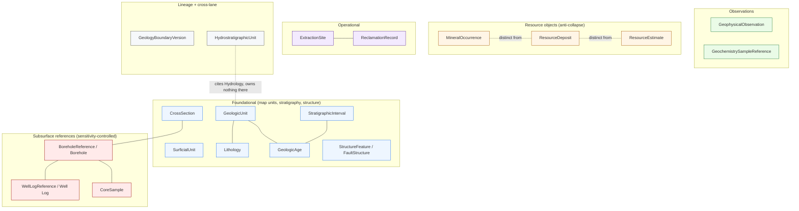

<!-- [KFM_META_BLOCK_V2]
doc_id: kfm://doc/domains-geology-object-families
title: Geology — Object Families
type: standard
subtype: domain-object-reference
version: v0.1
status: draft
owners: <geology-domain-steward> · <docs-steward>   # PLACEHOLDERS — assign in PR
created: 2026-06-04
updated: 2026-06-04
policy_label: public
authoring_session: Docs-only. No mounted repo, CI run, workflow, dashboard, runtime log, or release artifact inspected. Implementation maturity is bounded per the current-session evidence limit.
authority_posture: Per-object reference for the Geology lane. Subordinate to ai-build-operating-contract.md (CONTRACT_VERSION 3.0.0), directory-rules.md, DOM-GEOL (Atlas Ch. 10), and accepted ADRs. Supersedes no source doctrine.
related:
  - docs/domains/geology/README.md
  - docs/domains/geology/IDENTITY_MODEL.md
  - docs/domains/geology/MAP_UI_CONTRACTS.md
  - docs/domains/geology/FILE_SYSTEM_PLAN.md
  - docs/domains/geology/MISSING_OR_PLANNED_FILES.md
  - docs/domains/geology/POLICY.md
  - docs/doctrine/ai-build-operating-contract.md     # CONTRACT_VERSION 3.0.0
  - docs/doctrine/directory-rules.md                 # v1.3
  - schemas/contracts/v1/sources/source_descriptor.schema.json
tags: [kfm, domain, geology, object-families, ubiquitous-language, identity, sensitivity, doctrine-adjacent]
notes:
  - "Object families, identity rule, and temporal handling are CONFIRMED from Atlas Ch. 10 §B/§C/§E. Per-object sensitivity defaults are CONFIRMED from §I posture; field realizations are PROPOSED."
  - "Roster drift: Atlas §B (owns) and §E/§INDEX-18 (main object families) use slightly different spellings and sets. This doc presents the union and surfaces the drift as a naming-reconciliation note (CDR-GEOL-02), not a silent merge."
  - "Doctrine-adjacent — pins CONTRACT_VERSION = 3.0.0 (ai-build-operating-contract.md)."
  - "Schema sub-path form (segment vs flat) is CONFLICTED per CDR-GEOL-01; segment form used per Directory Rules Step 3. source_role is a cross-cutting SourceDescriptor field, not a geology schema."
[/KFM_META_BLOCK_V2] -->

# Geology — Object Families

> The canonical reference for **every object family the Geology and Natural Resources lane owns** — its purpose, identity rule, temporal handling, default sensitivity posture, typical source roles, and the resource-class distinctions that must never collapse.

| Field | Value |
|---|---|
| **Document type** | Per-object reference (standard doc, doctrine-adjacent) |
| **Status** | `draft` |
| **Owners** | `<geology-domain-steward>` · `<docs-steward>` *(placeholders — assign in PR)* |
| **Grounded in** | Atlas Ch. 10 §B (owns), §C (ubiquitous language), §E (main object families), §I (sensitivity); `IDENTITY_MODEL.md`. |
| **Contract pin** | `CONTRACT_VERSION = "3.0.0"` (`ai-build-operating-contract.md`). |
| **Updated** | 2026-06-04 |

> [!NOTE]
> Object families, the identity rule, and the temporal-handling rule are **CONFIRMED** doctrine (Atlas Ch. 10 §B/§C/§E). Per-object *field realizations* (intrinsic key fields, schema names) are **PROPOSED**. Sensitivity defaults restate the §I posture (CONFIRMED) with PROPOSED implementation. No repo is mounted; all paths are PROPOSED.

---

## Contents

1. [Purpose and how to read this](#1-purpose-and-how-to-read-this)
2. [The shared identity and temporal rule](#2-the-shared-identity-and-temporal-rule)
3. [Object family map](#3-object-family-map)
4. [Roster reconciliation note (CDR-GEOL-02)](#4-roster-reconciliation-note-cdr-geol-02)
5. [Foundational geology objects](#5-foundational-geology-objects)
6. [Subsurface reference objects (sensitivity-controlled)](#6-subsurface-reference-objects-sensitivity-controlled)
7. [Observation objects](#7-observation-objects)
8. [Resource objects (anti-collapse)](#8-resource-objects-anti-collapse)
9. [Operational objects](#9-operational-objects)
10. [Lineage and cross-lane objects](#10-lineage-and-cross-lane-objects)
11. [Sensitivity default summary](#11-sensitivity-default-summary)
12. [Per-object quick reference table](#12-per-object-quick-reference-table)
13. [Open questions and verification backlog](#13-open-questions-and-verification-backlog)
14. [Related docs](#14-related-docs)

---

## 1. Purpose and how to read this

This document is the per-object reference for the Geology lane. For each owned object family it records: what the object *is*, how its **identity** is fixed, which **times** are material, its default **sensitivity** posture, the typical **source roles** it carries, and the schema/contract homes that realize it. It complements `IDENTITY_MODEL.md` (the general identity machinery) by giving the family-by-family detail.

Read each family's entry as: *this is the smallest set of facts a contributor, reviewer, or validator needs to place, gate, and cite the object correctly.* Where a claim's confidence matters, it carries a truth label:

| Label | Meaning |
|---|---|
| **CONFIRMED** | Verified this session from Atlas Ch. 10 / Directory Rules / operating contract. |
| **PROPOSED** | Field realization, schema name, or path not yet verified in a mounted repo. |
| **INFERRED** | Reasonably derived from visible doctrine but not stated verbatim. |
| **NEEDS VERIFICATION** | Checkable; not yet checked. |
| **CONFLICTED** | Sources disagree; held until an ADR or drift entry resolves it. |

[⬆ back to top](#top)

---

## 2. The shared identity and temporal rule

Every Geology object family shares the same identity and temporal discipline. These are **CONFIRMED** doctrine (Atlas Ch. 10 §E), so they are stated once here rather than repeated per family.

**Identity rule (CONFIRMED basis; PROPOSED field realization).** Every family's identity derives from the deterministic four-component basis:

> `identity = normalize( source_id + object_role + temporal_scope + normalized_digest )`

where `normalized_digest` is the `spec_hash` (RFC 8785 JCS + SHA-256, recorded `jcs:sha256:<hex>`). See `IDENTITY_MODEL.md` for the full machinery, the seven-class `source_role` enum, and the derived-ID / resolution path.

**Temporal rule (CONFIRMED).** For every family, the six KFM times — **source, observed, valid, retrieval, release, correction** — stay distinct **where material**. Geology has weak natural rotation (a mapped unit can sit unchanged for decades), so `release_time` and `correction_time` often carry the only freshness signal a public consumer sees.

> [!IMPORTANT]
> Because the identity and temporal rules are uniform, the per-family entries below focus on what **differs**: intrinsic key fields, which times are *most* material, sensitivity default, and typical source roles. The identity formula and the six-time distinction apply to **all** of them.

[⬆ back to top](#top)

---

## 3. Object family map

> [!TIP]
> The dashed "distinct from" edges between `MineralOccurrence`, `ResourceDeposit`, and `ResourceEstimate` are the load-bearing geology invariant: these are **separate identities**, never collapsible. See [§8](#8-resource-objects-anti-collapse).

[⬆ back to top](#top)

---

## 4. Roster reconciliation note (CDR-GEOL-02)

> [!WARNING]
> **CDR-GEOL-02 — Geology object-roster spelling/membership drift (CONFLICTED, ADR-class).** The Atlas carries the Geology roster in two places that do not match exactly:
>
> - **Atlas §B (owns)** lists: Geologic Unit, Lithology, Stratigraphic Interval, **Geologic Age**, **Fault Structure**, **Borehole**, **Well Log**, **Core Sample**, **Geophysical Observation**, Geochemistry Sample, Mineral Occurrence, **Resource Deposit**, **Extraction Site**, **Reclamation Record**, **CrossSection**, **Hydrostratigraphic Unit**.
> - **Atlas §E / §INDEX-18 (main / core object families)** lists: Geologic Unit, **SurficialUnit**, Lithology, Stratigraphic Interval, **StructureFeature**, **GeologyBoundaryVersion**, **BoreholeReference**, **Well LogReference**, **Geochemistry SampleReference**, Mineral Occurrence, **Resource Deposit**, **ResourceEstimate**.
>
> The differences are (a) **spelling**: `Borehole`↔`BoreholeReference`, `Well Log`↔`Well LogReference`, `Fault Structure`↔`StructureFeature`, `Geochemistry Sample`↔`Geochemistry SampleReference`; and (b) **membership**: `SurficialUnit`, `GeologyBoundaryVersion`, and `ResourceEstimate` appear only in §E/§INDEX-18, while `Geologic Age`, `Core Sample`, `Geophysical Observation`, `Extraction Site`, `Reclamation Record`, and `Hydrostratigraphic Unit` appear only in §B.
>
> This is the same drift `IDENTITY_MODEL.md` §3.1 flags. **It is a naming/membership reconciliation, not an identity rotation** — two specs differing only by canonical name must normalize to the same `spec_hash` once the rename is registered. Per Directory Rules §2.5, this doc presents the **union** of both rosters and labels each family's spelling status; it does not silently pick one. Resolution is routed to an ADR (or `DRIFT_REGISTER.md`). The **dossier/Reference spellings** (`BoreholeReference`, etc.) are treated as canonical-for-identity per `IDENTITY_MODEL.md` §3.1 until an ADR says otherwise.

[⬆ back to top](#top)

---

## 5. Foundational geology objects

Map units, stratigraphy, structure, and sections. Default tier **T0** (public-safe at unit/line scale when source rights allow).

### GeologicUnit
- **Purpose.** A bedrock mapping-unit assertion (polygon). CONFIRMED (Atlas §E).
- **Intrinsic key fields (PROPOSED).** `unit_code`, `map_provenance_id`, `geometry_fingerprint`, `lithology_ref`, `age_ref`.
- **Material times.** `source_time`, `valid_time` (often open-ended).
- **Sensitivity default.** T0 — generalized/full polygon public-safe when rights allow.
- **Typical source roles.** `observed` (mapped contacts), occasionally `modeled`.
- **Notes.** Interpretive; MUST carry `interpretation_version`. Rendering without a version pin is an uncited claim (see `MAP_UI_CONTRACTS.md` §6).

### SurficialUnit *(§E/§INDEX-18 spelling; not in §B verbatim — CDR-GEOL-02)*
- **Purpose.** A surficial / unconsolidated mapping-unit assertion (polygon). CONFIRMED (Atlas §E).
- **Intrinsic key fields (PROPOSED).** `unit_code`, `map_provenance_id`, `geometry_fingerprint`, `parent_material_class`.
- **Material times.** `source_time`, `valid_time`.
- **Sensitivity default.** T0.
- **Typical source roles.** `observed`.
- **Notes.** Supplies **parent-material / surficial context** to Soil; Soil owns horizons/pedons. Cross-lane reference only.

### Lithology
- **Purpose.** Rock/sediment composition characterization bound to a unit. CONFIRMED (Atlas §E).
- **Intrinsic key fields (PROPOSED).** `lithology_code`, `vocabulary_ref`, `descriptor_set_hash`.
- **Material times.** `source_time`.
- **Sensitivity default.** T0 (usually a unit attribute).

### StratigraphicInterval
- **Purpose.** A named chronostratigraphic / lithostratigraphic interval (group / formation / member) with bounds. CONFIRMED (Atlas §E).
- **Intrinsic key fields (PROPOSED).** `interval_name`, `lower_bound_ref`, `upper_bound_ref`, `age_ref`.
- **Material times.** `source_time`, `valid_time`.
- **Sensitivity default.** T0.

### GeologicAge *(§B spelling; not in §E table verbatim — CDR-GEOL-02)*
- **Purpose.** A geochronologic / chronostratigraphic age binding for an interval or unit. CONFIRMED (Atlas §B).
- **Intrinsic key fields (PROPOSED).** `age_code`, `vocabulary_ref` (e.g., ICS chart version).
- **Material times.** `source_time`.
- **Sensitivity default.** T0 (usually a unit/interval attribute).

### StructureFeature / FaultStructure *(spelling drift — CDR-GEOL-02)*
- **Purpose.** Faults, folds, joints, lineaments — line/polygon structural elements. CONFIRMED (Atlas §B `Fault Structure` / §E `StructureFeature`).
- **Intrinsic key fields (PROPOSED).** `feature_class` (fault/fold/joint/lineament), `geometry_fingerprint`, `map_provenance_id`.
- **Material times.** `source_time`, `valid_time`.
- **Sensitivity default.** T0.
- **Notes.** Supplies **structural context** to Hazards; Hazards owns the *risk* claim. Geology never asserts rupture probability or hazard zoning.

### CrossSection
- **Purpose.** A 2D/2.5D subsurface section (line + interpretive panel). CONFIRMED (Atlas §B).
- **Intrinsic key fields (PROPOSED).** `section_id`, `line_geometry_fingerprint`, `interpretation_basis_ref`.
- **Material times.** `source_time`, `valid_time`.
- **Sensitivity default.** T0, **but** any synthetic/reconstructed surface requires a `RepresentationReceipt` and a Reality Boundary Note; vertical exaggeration MUST be disclosed (`MAP_UI_CONTRACTS.md` §11, §13).

[⬆ back to top](#top)

---

## 6. Subsurface reference objects (sensitivity-controlled)

These carry the lane's real publication risk: **exact subsurface point locations**. Default to **restricted or generalized** public geometry (Atlas §I, CONFIRMED).

> [!CAUTION]
> Exact borehole, well-log, core-sample, and private-well locations **default to restricted or generalized public geometry**. A public artifact carries a `public_safe_geometry_fingerprint` and, where generalized, a resolvable `RedactionReceipt`. The exact geometry stays behind the trust membrane in PROCESSED/CATALOG. CONFIRMED (Atlas §I; `IDENTITY_MODEL.md` §12).

### BoreholeReference / Borehole *(spelling drift — CDR-GEOL-02)*
- **Purpose.** A borehole / well point with metadata; geometry sensitivity-controlled. CONFIRMED (Atlas §B `Borehole` / §E `BoreholeReference`).
- **Intrinsic key fields (PROPOSED).** `borehole_id`, `operator_role_authority`, `public_safe_geometry_fingerprint`, `source_id`.
- **Material times.** `source_time`, `observed_time` (drill date, if material).
- **Sensitivity default.** T1 generalized public / **T3–T4** for exact or private-well points.
- **Typical source roles.** `administrative` (registry) / `observed` (per-well fields).
- **Gate.** Public release requires `RedactionReceipt` + rights review; private/proprietary wells deny by default.

### WellLogReference / Well Log *(spelling drift — CDR-GEOL-02)*
- **Purpose.** A LAS / digital well-log artifact reference attached to a `BoreholeReference`. CONFIRMED (Atlas §B `Well Log` / §E `Well LogReference`).
- **Intrinsic key fields (PROPOSED).** `borehole_ref`, `log_type`, `log_artifact_digest`, `source_id`.
- **Material times.** `source_time`, `observed_time`.
- **Sensitivity default.** T1–T4 by source rights; **LAS payloads excluded from public release by default** — references only.
- **Typical source roles.** `observed` (log curves) / `modeled` (interpreted tops).

### CoreSample *(§B; not in §E table verbatim — CDR-GEOL-02)*
- **Purpose.** A physical core / cuttings sample reference. CONFIRMED (Atlas §B).
- **Intrinsic key fields (PROPOSED).** `borehole_ref`, `depth_interval`, `sample_id`, `source_id`.
- **Material times.** `source_time`, `observed_time`.
- **Sensitivity default.** Generally **metadata-only** to public; exact location restricted.

[⬆ back to top](#top)

---

## 7. Observation objects

### GeophysicalObservation *(§B; not in §E table verbatim — CDR-GEOL-02)*
- **Purpose.** A geophysical survey product (gravity, magnetic, seismic) reference. CONFIRMED (Atlas §B).
- **Intrinsic key fields (PROPOSED).** `survey_id`, `geometry_fingerprint` (footprint), `instrument_class`, `source_id`.
- **Material times.** `source_time`, `observed_time`.
- **Sensitivity default.** T0 generalized; footprint may be coarsened where rights/sensitivity require.
- **Typical source roles.** `observed`; `modeled` for derived surfaces (labeled, never "observed").

### GeochemistrySampleReference / Geochemistry Sample *(spelling drift — CDR-GEOL-02)*
- **Purpose.** A geochemical sample / analysis reference. CONFIRMED (Atlas §B / §E).
- **Intrinsic key fields (PROPOSED).** `sample_id`, `sample_medium`, `analytical_method_ref`, `source_id`.
- **Material times.** `source_time` (analytical report) **and** `observed_time` (collection) — collapsing them drops chain-of-custody.
- **Sensitivity default.** Generalized sample coordinates; exact location restricted where sensitive.
- **Typical source roles.** `observed`.

[⬆ back to top](#top)

---

## 8. Resource objects (anti-collapse)

> [!CAUTION]
> **The resource anti-collapse invariant is load-bearing.** `MineralOccurrence`, `ResourceDeposit`, and `ResourceEstimate` — and the broader `PermitRecord` / `ProductionRecord` / `ReserveClaim` distinctions — are **structurally distinct identities** even when they share a commodity, an operator, and a location. Joining one to another *as identity equality* is a **DENY** at validation and an **ABSTAIN** at the AI surface. CONFIRMED (Atlas §I, §24.1.2; `FAQ.md` §2).

### MineralOccurrence
- **Purpose.** A *reported* mineral occurrence (point or polygon, sensitivity-controlled). CONFIRMED (Atlas §B/§E).
- **Intrinsic key fields (PROPOSED).** `occurrence_id`, `commodity_set`, `public_safe_geometry_fingerprint`, `source_id`.
- **Material times.** `source_time`, `observed_time` (if material; often UNKNOWN for legacy compilations).
- **Sensitivity default.** T0 aggregate / **T3** detail in sensitive context.
- **Typical source roles.** `observed` (field report) or `aggregate` (compiled, e.g., MRDS).
- **Means.** Material was *reported observed* here — **not** that it is economic, measured, owned, or mined.

### ResourceDeposit
- **Purpose.** A *named* resource deposit, distinct from occurrence and estimate. CONFIRMED (Atlas §B/§E).
- **Intrinsic key fields (PROPOSED).** `deposit_id`, `commodity_set`, `public_safe_geometry_fingerprint`, `source_id` — explicitly **distinct** from occurrence/estimate.
- **Material times.** `source_time`, `valid_time`.
- **Sensitivity default.** T0 aggregate / restricted detail.
- **Typical source roles.** `administrative` / `aggregate`.
- **Means.** A named body of material, compiled administratively — **not** a quantified or producing resource.

### ResourceEstimate *(§E/§INDEX-18 + §C; not in §B verbatim — CDR-GEOL-02)*
- **Purpose.** A *modeled or compiled* reserve / resource estimate, distinct from deposit and occurrence. CONFIRMED (Atlas §E/§C).
- **Intrinsic key fields (PROPOSED).** `estimate_id`, `commodity_set`, `classification_scheme_ref`, `aggregation_unit`, `source_id`.
- **Material times.** `source_time`, `valid_time`.
- **Sensitivity default.** **T3** typically; aggregate → T1/T0; never published as observed truth.
- **Typical source roles.** `modeled` or `aggregate` — **never relabeled `observed`**.
- **Means.** A modeled/compiled quantity with assumptions — **not** a direct measurement, **not** a deposit, **not** an occurrence.

> [!NOTE]
> `PermitRecord`, `ProductionRecord`, and `ReserveClaim` are named in the distinct-claims rule (Atlas §I) and the map/UI anti-collapse list but are **not** listed as Geology-owned object families in Atlas §B/§E. Treat them as **INFERRED** related families (likely `regulatory` / `aggregate` / `regulatory` source roles respectively); their ownership and home are NEEDS VERIFICATION pending the resource-classification ADR (Atlas §N item 3).

[⬆ back to top](#top)

---

## 9. Operational objects

### ExtractionSite *(§B; also §C — CDR-GEOL-02 membership)*
- **Purpose.** An active or historical extraction site (mine / well / quarry) reference. CONFIRMED (Atlas §B/§C).
- **Intrinsic key fields (PROPOSED).** `site_id`, `operator_role_authority`, `public_safe_geometry_fingerprint`.
- **Material times.** `source_time`, `valid_time`, `correction_time`.
- **Sensitivity default.** **T3–T4** for active/sensitive detail; generalized footprint → T1 with license + steward review.
- **Typical source roles.** `administrative` / `regulatory` context.

### ReclamationRecord *(§B; not in §E table verbatim — CDR-GEOL-02)*
- **Purpose.** A reclamation status / record reference. CONFIRMED (Atlas §B).
- **Intrinsic key fields (PROPOSED).** `site_ref`, `program_authority`, `reclamation_status_code`.
- **Material times.** `source_time`, `valid_time`, `correction_time`.
- **Sensitivity default.** T0/T1.
- **Typical source roles.** `administrative` / `regulatory`.

[⬆ back to top](#top)

---

## 10. Lineage and cross-lane objects

### GeologyBoundaryVersion *(§E/§INDEX-18; not in §B verbatim — CDR-GEOL-02)*
- **Purpose.** A versioned boundary geometry between mapping units; the auditable replacement target for boundary changes. CONFIRMED (Atlas §E).
- **Intrinsic key fields (PROPOSED).** `boundary_id`, `version_index`, `geometry_fingerprint`, `supersedes_ref`.
- **Material times.** `source_time`, `valid_time`, `correction_time`.
- **Sensitivity default.** T0 (public-safe metadata).
- **Notes.** Lineage object — carries history, not current authority by itself. Supports correction/rollback for unit boundaries.

### HydrostratigraphicUnit *(§B; not in §E table verbatim — CDR-GEOL-02)*
- **Purpose.** A hydrostratigraphic context unit linking to Hydrology **without owning aquifer truth**. CONFIRMED (Atlas §B/§F).
- **Intrinsic key fields (PROPOSED).** `unit_name`, `geometry_fingerprint`, `hydrology_link_ref`.
- **Material times.** `source_time`, `valid_time`.
- **Sensitivity default.** T0.
- **Notes.** **Boundary object.** Hydrology owns measurements; this unit contributes *unit context* only. Its schema home (geology lane vs neutral `hydrostratigraphy/`) is ADR-pending (`IDENTITY_MODEL.md` Q; `FILE_SYSTEM_PLAN.md` §10.3).

[⬆ back to top](#top)

---

## 11. Sensitivity default summary

Restates the Atlas §I posture per family (CONFIRMED posture; PROPOSED tier numbers against the T0–T4 rubric, ADR-S-05).

| Family | Default tier | Public-safe behavior |
|---|---|---|
| GeologicUnit · SurficialUnit · Lithology · StratigraphicInterval · GeologicAge · StructureFeature | **T0** | Public-safe at unit/line scale when rights allow |
| CrossSection | **T0** | Public-safe; `RepresentationReceipt` + VE disclosure for synthetic surfaces |
| BoreholeReference | **T1 / T3 / T4** | Generalized point only; exact/private → restricted; `RedactionReceipt` required |
| WellLogReference | **T1 / T4** | Reference only; LAS payloads excluded by default; rights review |
| CoreSample | **T1 / T3** | Metadata only to public; exact location restricted |
| GeophysicalObservation | **T0 / T1** | Generalized footprint |
| GeochemistrySampleReference | **T1 / T3** | Generalized sample coordinates |
| MineralOccurrence | **T0 aggregate / T3 detail** | Aggregate public; sensitive detail restricted |
| ResourceDeposit | **T0 / T3** | Distinct from occurrence/estimate; detail may restrict |
| ResourceEstimate | **T3** | Aggregate → T1/T0; never published as observed |
| ExtractionSite | **T3 / T4** | Generalized footprint with license + steward review |
| ReclamationRecord | **T0 / T1** | Generally public |
| GeologyBoundaryVersion | **T0** | Public-safe metadata |
| HydrostratigraphicUnit | **T0** | Public-safe; cites Hydrology |

> [!NOTE]
> Tier numbers are PROPOSED defaults extending the §I posture; the exact mapping onto the canonical T0–T4 rubric is **NEEDS VERIFICATION** (ADR-S-05). The *posture* (generalize/restrict/deny by rising sensitivity, deny-by-default for exact subsurface and private-well locations) is CONFIRMED.

[⬆ back to top](#top)

---

## 12. Per-object quick reference table

The Atlas §E "main object families" table, expanded with the §B-only families and the sensitivity/role columns. Identity rule and temporal handling are CONFIRMED and uniform (see [§2](#2-the-shared-identity-and-temporal-rule)); only differences are shown.

| Object family | Roster | Most-material times | Default tier | Typical source role(s) | Schema (PROPOSED) |
|---|---|---|---|---|---|
| GeologicUnit | §B + §E | source, valid | T0 | observed | `geologic_unit.schema.json` |
| SurficialUnit | §E only | source, valid | T0 | observed | `surficial_unit.schema.json` |
| Lithology | §B + §E | source | T0 | observed | `lithology.schema.json` |
| StratigraphicInterval | §B + §E | source, valid | T0 | observed | `stratigraphic_interval.schema.json` |
| GeologicAge | §B only | source | T0 | observed | `geologic_age.schema.json` |
| StructureFeature / FaultStructure | §B + §E | source, valid | T0 | observed | `fault_structure.schema.json` |
| CrossSection | §B only | source, valid | T0 | observed / modeled | `cross_section.schema.json` |
| BoreholeReference / Borehole | §B + §E | source, observed | T1/T3/T4 | administrative / observed | `borehole_reference.schema.json` |
| WellLogReference / Well Log | §B + §E | source, observed | T1/T4 | observed / modeled | `well_log_reference.schema.json` |
| CoreSample | §B only | source, observed | T1/T3 | observed | `core_sample.schema.json` |
| GeophysicalObservation | §B only | source, observed | T0/T1 | observed / modeled | `geophysical_observation.schema.json` |
| GeochemistrySampleReference | §B + §E | source, observed | T1/T3 | observed | `geochemistry_sample.schema.json` |
| MineralOccurrence | §B + §E | source, observed | T0/T3 | observed / aggregate | `mineral_occurrence.schema.json` |
| ResourceDeposit | §B + §E | source, valid | T0/T3 | administrative / aggregate | `resource_deposit.schema.json` |
| ResourceEstimate | §E only | source, valid | T3 | modeled / aggregate | `resource_estimate.schema.json` |
| ExtractionSite | §B + §C | source, valid, correction | T3/T4 | administrative / regulatory | `extraction_site.schema.json` |
| ReclamationRecord | §B only | source, valid, correction | T0/T1 | administrative / regulatory | `reclamation_record.schema.json` |
| GeologyBoundaryVersion | §E only | source, valid, correction | T0 | observed | *(metadata; may not be own schema)* |
| HydrostratigraphicUnit | §B only | source, valid | T0 | observed | `hydrostratigraphic_unit.schema.json` |

> [!IMPORTANT]
> Schema homes use the **segment form** (`schemas/contracts/v1/domains/geology/<file>`) per Directory Rules Step 3; the segment-vs-flat sub-path is **CONFLICTED** (CDR-GEOL-01). `source_role` itself is a cross-cutting `SourceDescriptor` field (`schemas/contracts/v1/sources/...`), not a geology schema.

[⬆ back to top](#top)

---

## 13. Open questions and verification backlog

| ID | Question | Status |
|---|---|---|
| OQ-OBJ-01 | **CDR-GEOL-02** — reconcile the §B vs §E/§INDEX-18 roster spelling and membership (canonical name set for schemas/contracts/validators). | CONFLICTED — pending ADR / `DRIFT_REGISTER.md` |
| OQ-OBJ-02 | Are `PermitRecord` / `ProductionRecord` / `ReserveClaim` Geology-owned object families, or related families owned elsewhere? | NEEDS VERIFICATION — resource-classification ADR (Atlas §N item 3) |
| OQ-OBJ-03 | Per-object intrinsic key fields and the canonicalized-spec inclusion/exclusion list. | NEEDS VERIFICATION — mounted `evidence-bundle` schema + `IDENTITY_MODEL.md` Q1 |
| OQ-OBJ-04 | Sensitivity-band → T0–T4 rubric mapping per family (§11). | NEEDS VERIFICATION — ADR-S-05 |
| OQ-OBJ-05 | `HydrostratigraphicUnit` schema home: geology lane vs neutral `hydrostratigraphy/`. | OPEN — co-signed with Hydrology |
| OQ-OBJ-06 | Schema sub-path form (segment vs flat — CDR-GEOL-01). | CONFLICTED — pending ADR |
| OQ-OBJ-07 | Does `GeologyBoundaryVersion` warrant its own schema, or is it metadata on `GeologicUnit`? | NEEDS VERIFICATION |

[⬆ back to top](#top)

---

## 14. Related docs

- `docs/domains/geology/README.md` — Lane landing *(PROPOSED)*.
- `docs/domains/geology/IDENTITY_MODEL.md` — Identity machinery, source roles, `spec_hash`, resolution.
- `docs/domains/geology/MAP_UI_CONTRACTS.md` — How these objects render and gate on the map/UI surface.
- `docs/domains/geology/POLICY.md` — Sensitivity, rights, publication policy *(PROPOSED)*.
- `docs/domains/geology/FILE_SYSTEM_PLAN.md` — Where each object's contract/schema/policy/test lives.
- `docs/domains/geology/MISSING_OR_PLANNED_FILES.md` — Inventory + crosswalks.
- `docs/domains/geology/FAQ.md` — Public-facing occurrence/deposit/estimate distinction.
- `docs/doctrine/ai-build-operating-contract.md` — Operating contract (`CONTRACT_VERSION = "3.0.0"`).
- `docs/doctrine/directory-rules.md` — Placement law (Step 3 segment form).
- Domains Culmination Atlas Ch. 10 — §B owns, §C ubiquitous language, §E main object families, §I sensitivity, §N verification backlog.

---

**KFM · Geology · Object Families · v0.1 (draft) · Last updated 2026-06-04** · Contract: `CONTRACT_VERSION = "3.0.0"` · Object families CONFIRMED (Atlas Ch. 10 §B/§C/§E); field realizations PROPOSED; roster drift CDR-GEOL-02.

[⬆ back to top](#top)
