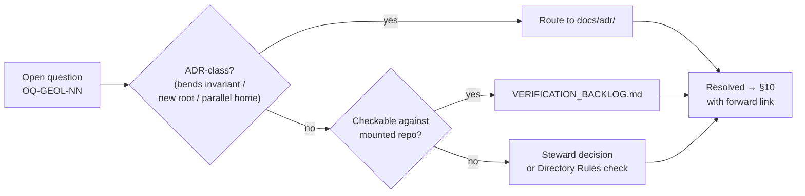

<!-- [KFM_META_BLOCK_V2]
doc_id: kfm://doc/geology-open-questions
title: Geology Domain — Open Questions Register
type: standard
version: v1
status: draft
owners: <geology-domain-stewards>   # PLACEHOLDER — assign before review
created: 2026-06-04
updated: 2026-06-04
policy_label: public
related: [docs/domains/geology/README.md, docs/domains/geology/SOURCE_REGISTRY.md, docs/domains/geology/CANONICAL_PATHS.md, docs/registers/VERIFICATION_BACKLOG.md, docs/registers/DRIFT_REGISTER.md, docs/adr/, ai-build-operating-contract.md, directory-rules.md]
tags: [kfm]
notes: [Doctrine-adjacent; pins CONTRACT_VERSION = "3.0.0". All repo-state path claims PROPOSED; no repo mounted this session. Geology domain = [DOM-GEOL], Atlas v1.1 Ch. 10.]
[/KFM_META_BLOCK_V2] -->

# Geology Domain — Open Questions Register

> Tracks unresolved, ADR-class, and `NEEDS VERIFICATION` questions for the Geology / Natural Resources lane (`[DOM-GEOL]`). Triage surface only — resolutions migrate to `docs/adr/`, `docs/registers/VERIFICATION_BACKLOG.md`, or `docs/registers/DRIFT_REGISTER.md`.

| Field | Value |
|---|---|
| **Status** | `draft` |
| **Owners** | `<geology-domain-stewards>` · `<docs-steward>` *(placeholders — assign before review)* |
| **Authority** | Subordinate to `ai-build-operating-contract.md` (`CONTRACT_VERSION = "3.0.0"`) and `directory-rules.md` |
| **Lane** | Geology / Natural Resources — `[DOM-GEOL]`, Atlas v1.1 Ch. 10 |
| **Responsibility root (PROPOSED)** | `schemas/contracts/v1/geology/`, `contracts/geology/` |
| **Updated** | 2026-06-04 |

> [!NOTE]
> **No repository was mounted in this session.** Every path, route, schema home, validator, and source-descriptor reference below is **PROPOSED** or **NEEDS VERIFICATION** until checked against the mounted repo. This register does not assert that any geology file, route, or test currently exists.

---

## Contents

- [1. Scope](#1-scope)
- [2. How this register works](#2-how-this-register-works)
- [3. Question lifecycle](#3-question-lifecycle)
- [4. Open questions — source & rights](#4-open-questions--source--rights)
- [5. Open questions — modeling & identity](#5-open-questions--modeling--identity)
- [6. Open questions — sensitivity & publication](#6-open-questions--sensitivity--publication)
- [7. Open questions — API, schema & integration](#7-open-questions--api-schema--integration)
- [8. ADR-class questions](#8-adr-class-questions)
- [9. Verification backlog](#9-verification-backlog)
- [10. Resolved / superseded](#10-resolved--superseded)
- [11. Related docs](#11-related-docs)

---

## 1. Scope

This register holds the unsettled questions for the Geology / Natural Resources lane. The geology domain governs (per Atlas Ch. 10, `[DOM-GEOL]`) bedrock and surficial geology, stratigraphy, lithology, structures, boreholes, well logs, cores, geophysics, geochemistry, the mineral-vs-resource distinction, extraction/reclamation context, public-safe layers, and bounded AI over released geology evidence. **CONFIRMED doctrine / PROPOSED implementation.**

It explicitly does **not** own hydrology measurements, soils, hazards risk, or ownership/lease/permit/title claims; those remain outside canonical geology truth and are tracked in their own lanes. **CONFIRMED / PROPOSED.**

In scope for this file: questions whose resolution would change a geology contract, schema, policy entry, source descriptor, validator, route, or map product. Out of scope: cross-cutting doctrine questions (those live in `directory-rules.md §18` and the encyclopedia register) — referenced here only where they block a geology decision.

[↑ Back to top](#top)

---

## 2. How this register works

Questions carry a scope-local ID of the form `OQ-GEOL-NN`. ADR-class questions (those that would bend a `directory-rules.md §3` invariant, add/rename a canonical root, or create a parallel authority home) are flagged and routed to `docs/adr/`. Everything else resolves by routine PR plus the relevant steward's sign-off.

| Column | Meaning |
|---|---|
| **ID** | `OQ-GEOL-NN`, stable once assigned |
| **Question** | The unresolved decision, phrased so a single answer closes it |
| **Posture** | Truth label: `PROPOSED` · `NEEDS VERIFICATION` · `UNKNOWN` · `CONFLICTED` |
| **Owner role** | Role accountable for resolution (not a named person unless assigned) |
| **Resolution path** | ADR · repo inspection · steward decision · Directory Rules check |

> [!IMPORTANT]
> A question is **closed** only when its resolution is recorded in `docs/adr/`, `docs/registers/VERIFICATION_BACKLOG.md`, or `docs/registers/DRIFT_REGISTER.md` — never by quiet edit here. Closed entries move to [§10](#10-resolved--superseded) with a forward link.

[↑ Back to top](#top)

---

## 3. Question lifecycle

> [!NOTE]
> This diagram reflects the triage routing this document **proposes**. The existence and exact behavior of `docs/adr/`, `VERIFICATION_BACKLOG.md`, and `DRIFT_REGISTER.md` are **NEEDS VERIFICATION** against the mounted repo.

[↑ Back to top](#top)

---

## 4. Open questions — source & rights

The geology source spine (Atlas Ch. 10.D) names Kansas Geological Survey (KGS) data/maps and surficial geology, USGS NGMDB/GeMS, KGS oil-and-gas wells and production, KCC oil-and-gas regulatory data, KGS/KDHE WWC5 water-well program, KGS LAS digital well logs and well tops, and USGS MRDS. Every one carries **rights and current terms `NEEDS VERIFICATION`** and **sensitive joins fail closed**. **CONFIRMED / PROPOSED.**

| ID | Question | Posture | Owner role | Resolution path |
|---|---|---|---|---|
| OQ-GEOL-01 | Are the KGS and KCC `SourceDescriptor` entries authored, with current rights/terms and source roles recorded? | NEEDS VERIFICATION | `<source-steward>` | Repo inspection of `data/registry/sources/`; confirm terms; record in VERIFICATION_BACKLOG |
| OQ-GEOL-02 | What is the public-use policy for KGS oil-and-gas well, production, and KGS LAS well-log data — restricted, generalized, or licensed-only? | NEEDS VERIFICATION | `<source-steward>` + `<rights-holder-rep>` | Confirm upstream terms; encode in `policy/sensitivity/` (or `policy/release/geology/`) |
| OQ-GEOL-03 | For WWC5 water-well records, does private-well location require generalization before any public surface? | PROPOSED (default: generalize) | `<geology-domain-stewards>` | Apply §23.2 matrix; record `RedactionReceipt` design |

[↑ Back to top](#top)

---

## 5. Open questions — modeling & identity

The lane owns Geologic Unit, Lithology, Stratigraphic Interval, Geologic Age, Fault Structure, Borehole, Well Log, Core Sample, Geophysical Observation, Geochemistry Sample, Mineral Occurrence, Resource Deposit, Extraction Site, Reclamation Record, CrossSection, and Hydrostratigraphic Unit. The deterministic identity basis for each is **PROPOSED** as `source id + object role + temporal scope + normalized digest`. **CONFIRMED / PROPOSED.**

| ID | Question | Posture | Owner role | Resolution path |
|---|---|---|---|---|
| OQ-GEOL-04 | Is the resource classification scheme defined, distinguishing occurrence, deposit, estimate, permit, production, and reserve as separate claim types? | NEEDS VERIFICATION | `<geology-domain-stewards>` | Define scheme; author resource-class anti-collapse tests |
| OQ-GEOL-05 | Is the proposed deterministic identity basis (`source id + object role + temporal scope + normalized digest`) adequate for boreholes and well logs, where the same physical hole has multiple log runs? | PROPOSED | `<geology-domain-stewards>` | Schema review of `Borehole` / `Well Log` contracts; possible ADR if identity grammar changes |
| OQ-GEOL-06 | How is `Hydrostratigraphic Unit` reconciled with the Hydrology lane so geology supplies aquifer/hydrostratigraphy *context* without replacing hydrology measurements? | PROPOSED | `<geology-domain-stewards>` + `<hydrology-domain-stewards>` | Cross-lane relation review; CROSS_LANE_RELATIONS entry; possible ADR (cross-lane join policy, ADR-S-14) |

> [!TIP]
> The "claim types must remain distinct" rule (OQ-GEOL-04) is the geology analogue of the Atmosphere lane's source-role anti-collapse. Conflating an *occurrence* with a *reserve estimate* is a correctness failure, not a formatting one.

[↑ Back to top](#top)

---

## 6. Open questions — sensitivity & publication

> [!CAUTION]
> Exact borehole, sample, sensitive-resource, well-log, and private-well locations default to **restricted or generalized public geometry** per Atlas Ch. 10.I. Disposition for any sensitive geology object MUST route through the sensitive-domain decision matrix in `ai-build-operating-contract.md §23.2`; this register does not re-derive disposition. Where no row clearly matches: **DENY public exact exposure, GENERALIZE before publication, REQUIRE steward review, REQUIRE `RedactionReceipt`.**

| ID | Question | Posture | Owner role | Resolution path |
|---|---|---|---|---|
| OQ-GEOL-07 | Is there a `policy/sensitivity/` (or `policy/release/geology/`) entry governing borehole / well-log / private-well geometry generalization? If missing, it is a gap. | NEEDS VERIFICATION | `<policy-steward>` | Repo inspection of `policy/`; if absent, author entry and link it |
| OQ-GEOL-08 | What generalization rule applies to mineral-occurrence and deposit coordinates that could enable extraction-targeting harm? | PROPOSED (default: generalize) | `<geology-domain-stewards>` + `<policy-steward>` | §23.2 matrix; define geometry-generalization transform + receipt |
| OQ-GEOL-09 | Does geology publication wire a `ReleaseManifest`, correction path, stale-state rule, and rollback target as required by Atlas Ch. 10.M / Encyclopedia Appendix E? | NEEDS VERIFICATION | `<release-steward>` | Inspect `release/manifests/`; confirm rollback target binding |

[↑ Back to top](#top)

---

## 7. Open questions — API, schema & integration

Atlas Ch. 10.J names a geology feature/detail resolver (route TBD) returning a `GeologyDecisionEnvelope`, a layer-manifest resolver returning a `LayerManifest`, an Evidence Drawer payload, and a Focus Mode answer returning a `RuntimeResponseEnvelope` + `AIReceipt`. All are **PROPOSED governed-API surfaces; exact routes UNKNOWN.**

| ID | Question | Posture | Owner role | Resolution path |
|---|---|---|---|---|
| OQ-GEOL-10 | What is the canonical route for the geology feature/detail resolver, and does it return `GeologyDecisionEnvelope` with finite outcomes `ANSWER / ABSTAIN / DENY / ERROR`? | UNKNOWN (route) / PROPOSED (DTO) | `<governed-api-steward>` | Inspect `apps/governed-api/`; confirm or assign route |
| OQ-GEOL-11 | Are geology schemas homed at `schemas/contracts/v1/geology/` per ADR-0001, with no parallel schema home? | NEEDS VERIFICATION | `<schema-steward>` | Directory Rules §6.4 + ADR-0001 check against repo; drift entry if divergent |
| OQ-GEOL-12 | Is geology wired into the MapLibre map shell and Evidence Drawer (public-generalized borehole view, bedrock/surficial/structure layers), reading only governed APIs and released artifacts? | NEEDS VERIFICATION | `<map-shell-steward>` | Inspect map shell + layer-manifest resolver; confirm no direct canonical-store read |
| OQ-GEOL-13 | Do the proposed geology validators exist — source-role, resource-class anti-collapse, public-safe geometry, borehole/well-log rights, catalog closure, AI evidence-before-model? | PROPOSED | `<geology-domain-stewards>` | Inspect `tests/` and `tools/validators/`; author missing tests |

[↑ Back to top](#top)

---

## 8. ADR-class questions

These bend an invariant, touch a canonical root, or risk a parallel authority home and therefore require an ADR per `directory-rules.md §2.4`.

| ID | Question | Posture | Resolution path |
|---|---|---|---|
| OQ-GEOL-14 | Is the geology dossier directory `docs/domains/geology/` (prior user-authored form) or `docs/domains/geology-and-natural-resources/` (Encyclopedia §7.8 form)? Parallels OPEN-ENC-04 / OPEN-DR-01. | CONFLICTED | ADR, then alias the other form |
| OQ-GEOL-15 | Does the schema home for geology resolve to `schemas/contracts/v1/geology/` (ADR-0001 default) or any parallel `contracts/`-rooted machine-schema home in the live repo? | NEEDS VERIFICATION → potentially CONFLICTED | Directory Rules §6.4 check; drift entry; resolve under existing schema-home ADR rather than a new geology-local one |

> [!IMPORTANT]
> OQ-GEOL-14 is a **naming conflict to surface, not resolve quietly.** Two defensible directory forms exist for the same lane; this document records the conflict and routes it to ADR rather than picking one. Until the ADR lands, both forms are `PROPOSED / CONFLICTED` and no divergent sibling should be created.

[↑ Back to top](#top)

---

## 9. Verification backlog

These items remain `NEEDS VERIFICATION` and must be checked against a mounted repo before any geology doc promotes from `draft` to `published`. They mirror the Atlas Ch. 10.N backlog; the evidence that would settle each is *mounted repo files, schemas, registry entries, tests, logs, emitted artifacts, review records, or release manifests.*

1. Verify KGS and KCC `SourceDescriptor` entries exist with current rights/terms. *(OQ-GEOL-01, OQ-GEOL-02)*
2. Verify borehole/well-log/private-well public-geometry policy is encoded. *(OQ-GEOL-02, OQ-GEOL-03, OQ-GEOL-07)*
3. Define the resource-classification scheme and its anti-collapse tests. *(OQ-GEOL-04)*
4. Verify geology API route, MapLibre layers, and Evidence Drawer integration. *(OQ-GEOL-10, OQ-GEOL-12)*
5. Verify schema home at `schemas/contracts/v1/geology/` per ADR-0001. *(OQ-GEOL-11, OQ-GEOL-15)*
6. Verify the proposed geology validator suite is authored and wired into CI. *(OQ-GEOL-13)*

Evidence sources that would settle a backlog item

A geology `NEEDS VERIFICATION` item moves to `CONFIRMED` only when at least one of the following is inspected in-session:

- mounted repository files and directory listings;
- machine schemas under `schemas/contracts/v1/geology/`;
- object-family contracts under `contracts/geology/`;
- `data/registry/sources/` entries for KGS / KCC / USGS sources;
- policy entries under `policy/sensitivity/` or `policy/release/geology/`;
- validator tests under `tests/` / fixtures under `fixtures/`;
- emitted receipts, `ReleaseManifest`, `ReviewRecord`, or rollback target;
- CI workflow files that enforce the relevant gate.

Per `ai-build-operating-contract.md §17`, a docs-only session (no mounted repo) cannot settle any of these.

[↑ Back to top](#top)

---

## 10. Resolved / superseded

*No geology open questions have been resolved yet.* Resolved entries move here with their ID, the resolving artifact (ADR number, backlog entry, or drift-register row), and a forward link.

| ID | Resolved by | Date | Link |
|---|---|---|---|
| — | — | — | — |

[↑ Back to top](#top)

---

## Open questions register

| ID | Question | Owner role | Resolution path |
|---|---|---|---|
| OQ-GEOL-META-01 | Are the steward owner roles named above the right accountable roles for this lane? | `<docs-steward>` | Governance roster check; update meta block |
| OQ-GEOL-META-02 | Should this register fold into a single domain `VERIFICATION_BACKLOG.md`, or stay a separate `OPEN_QUESTIONS.md` per the suite pattern? | `<docs-steward>` | Steward decision; align with sibling domain docs |

## Open verification backlog

These items remain `NEEDS VERIFICATION` before this document promotes from `draft` to `published`:

1. Mounted-repo presence of `docs/domains/geology/` (vs `geology-and-natural-resources/`) — see OQ-GEOL-14.
2. Presence and exact names of `docs/registers/VERIFICATION_BACKLOG.md` and `docs/registers/DRIFT_REGISTER.md`.
3. Whether `docs/adr/` numbering for the schema-home and dossier-naming decisions is already assigned.

## Changelog v0 → v1

| Change | Type (per contract §37) | Reason |
|---|---|---|
| Initial geology open-questions register authored | new | Fill domain-suite gap; consolidate Atlas Ch. 10.N backlog into a governed register |
| OQ-GEOL-14 surfaced as CONFLICTED | new | Record geology dossier naming conflict (parallels OPEN-ENC-04 / OPEN-DR-01) for ADR routing |

> **Backward compatibility.** New file; no prior anchors to preserve. Section anchors (`#1-scope` … `#11-related-docs`) are introduced here and should be treated as stable.

## Definition of done

This document is done enough to enter the repository when:

- it is placed according to Directory Rules (pending OQ-GEOL-14 resolution on the dossier directory name);
- a geology domain steward and a docs steward review it;
- it is linked from `docs/domains/geology/README.md` and any docs/doctrine index;
- it does not conflict with accepted ADRs;
- any conflict with current repo conventions is logged in `docs/registers/DRIFT_REGISTER.md`;
- the `GENERATED_RECEIPT.json` planned in the authoring notes is wired into CI;
- future changes follow `ai-build-operating-contract.md §37` lifecycle.

---

## 11. Related docs

- `docs/domains/geology/README.md` — geology lane landing page *(TODO: verify path)*
- `docs/domains/geology/SOURCE_REGISTRY.md` — KGS / KCC / USGS source descriptors *(TODO)*
- `docs/domains/geology/CANONICAL_PATHS.md` — geology responsibility-root paths *(TODO)*
- `docs/registers/VERIFICATION_BACKLOG.md` — cross-domain verification tracking
- `docs/registers/DRIFT_REGISTER.md` — drift and conflict log
- `docs/adr/` — ADR home for OQ-GEOL-14 / OQ-GEOL-15
- `ai-build-operating-contract.md` — operating contract (`CONTRACT_VERSION = "3.0.0"`), §23.2 sensitive-domain matrix, §37 lifecycle
- `directory-rules.md` — canonical placement and §2.4 ADR triggers

---

*Last updated: 2026-06-04 · Status: `draft` · `CONTRACT_VERSION = "3.0.0"` · `[DOM-GEOL]`*

[↑ Back to top](#top)
