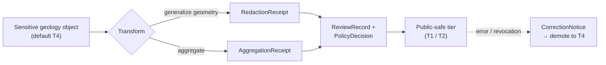

<!-- [KFM_META_BLOCK_V2]
doc_id: kfm://doc/geology-policy
title: Geology Domain — Policy & Sensitivity Posture
type: standard
version: v1
status: draft
owners: <geology-domain-stewards>   # PLACEHOLDER — assign before review
created: 2026-06-04
updated: 2026-06-04
policy_label: public
related: [docs/domains/geology/README.md, docs/domains/geology/OPEN_QUESTIONS.md, docs/domains/geology/SOURCE_REGISTRY.md, policy/sensitivity/, policy/release/, docs/registers/VERIFICATION_BACKLOG.md, docs/registers/DRIFT_REGISTER.md, ai-build-operating-contract.md, directory-rules.md]
tags: [kfm]
notes: [Doctrine-adjacent; pins CONTRACT_VERSION = "3.0.0". This file STATES geology policy intent and DEFERS enforcement to the canonical policy/ root. Geology = [DOM-GEOL], Atlas v1.1 Ch. 10 + Ch. 24.5. No repo mounted this session; all path/enforcement claims PROPOSED / NEEDS VERIFICATION.]
[/KFM_META_BLOCK_V2] -->

# Geology Domain — Policy & Sensitivity Posture

> States the admissibility, rights, sensitivity-tier, redaction, and publication posture for the Geology / Natural Resources lane (`[DOM-GEOL]`). This document **states intent**; the canonical, machine-enforced rules live under the `policy/` responsibility root.

-red)

| Field | Value |
|---|---|
| **Status** | `draft` |
| **Owners** | `<geology-domain-stewards>` · `<policy-steward>` *(placeholders — assign before review)* |
| **Authority** | Subordinate to `ai-build-operating-contract.md` (`CONTRACT_VERSION = "3.0.0"`), §23.2 sensitive-domain matrix; and `directory-rules.md` §6.5 (`policy/` canonical) |
| **Lane** | Geology / Natural Resources — `[DOM-GEOL]`, Atlas v1.1 Ch. 10, tier scheme Ch. 24.5 |
| **Enforcement home (PROPOSED)** | `policy/sensitivity/`, `policy/release/geology/` |
| **Updated** | 2026-06-04 |

> [!IMPORTANT]
> **This file is not the enforcement surface.** Per `directory-rules.md §6.5`, allow/deny/restrict/abstain decisions are owned by the canonical singular `policy/` root. This document records geology's *intended* posture and links to (or flags the absence of) the corresponding `policy/` entries. Where this doc and a `policy/` bundle disagree, the bundle governs and the conflict is logged in `docs/registers/DRIFT_REGISTER.md`.

> [!NOTE]
> No repository was mounted in this session. Every `policy/` path, tier assignment realization, validator, and route reference is **PROPOSED** or **NEEDS VERIFICATION** until checked against the mounted repo. This document does not assert any geology policy bundle currently exists.

---

## Contents

- [1. Scope & non-ownership](#1-scope--non-ownership)
- [2. Posture summary](#2-posture-summary)
- [3. Sensitivity tier scheme (T0–T4)](#3-sensitivity-tier-scheme-t0t4)
- [4. Geology object-class tier matrix](#4-geology-object-class-tier-matrix)
- [5. Deny-by-default register](#5-deny-by-default-register)
- [6. Allowed transforms & required gates](#6-allowed-transforms--required-gates)
- [7. Tier transitions](#7-tier-transitions)
- [8. Rights & source-role posture](#8-rights--source-role-posture)
- [9. Promotion gate (RAW → PUBLISHED)](#9-promotion-gate-raw--published)
- [10. Governed AI posture](#10-governed-ai-posture)
- [11. Where the rules actually live](#11-where-the-rules-actually-live)
- [12. Open questions & verification](#12-open-questions--verification)
- [13. Related docs](#13-related-docs)

---

## 1. Scope & non-ownership

The geology lane governs bedrock and surficial geology, stratigraphy, lithology, structures, boreholes, well logs, cores, geophysics, geochemistry, the mineral-vs-resource distinction, and extraction/reclamation context (Atlas Ch. 10.A–B). **CONFIRMED doctrine / PROPOSED implementation.**

This policy posture covers the geology objects only. It does **not** restate or override:

- hydrology measurement policy (geology supplies hydrostratigraphy *context* only);
- soils, hazards-risk, or ownership/lease/permit/title policy;
- the cross-cutting trust-membrane, cite-or-abstain, and lifecycle rules in doctrine.

Where a geology object joins a sensitive object in another lane (e.g., a person-parcel join via People/Land), the **most restrictive applicable lane policy** governs, not geology's.

[↑ Back to top](#top)

---

## 2. Posture summary

The geology lane is **mixed-tier**: most published cartographic products (bedrock and surficial unit maps, structure views, stratigraphy/correlation views) are intended to be public-safe, while subsurface point data and resource detail are sensitive by default.

> [!CAUTION]
> **Exact borehole, sample, sensitive-resource, well-log, and private-well locations default to restricted or generalized public geometry** (Atlas Ch. 10.I). Mineral-occurrence and deposit coordinates that could enable extraction-targeting harm are treated the same way. Disposition for any sensitive geology object MUST route through `ai-build-operating-contract.md §23.2`; this document does not re-derive the matrix.

A second, non-geometric correctness rule applies throughout: **occurrence, deposit, estimate, permit, production, and reserve claims must remain distinct** (Atlas Ch. 10.I). Collapsing an *occurrence* into a *reserve estimate* is a publication failure even when no coordinates are exposed.

> [!IMPORTANT]
> Per shared doctrine: unclear rights, unresolved source role, missing evidence, unresolved sensitivity, or absent release state **blocks public promotion** — the gate fails closed. **CONFIRMED doctrine.**

[↑ Back to top](#top)

---

## 3. Sensitivity tier scheme (T0–T4)

Geology uses the project-wide tier scheme (Atlas Ch. 24.5.1; adoption as canonical is **PROPOSED**, tracked as ADR-S-05). **PROPOSED.**

| Tier | Name | Definition | Default audience |
|---|---|---|---|
| **T0** | Open | Public-safe, no transformation required; standard release only. | Any public client via governed API |
| **T1** | Generalized | Public-safe only after generalization, fuzzing, aggregation, or redaction; transform reviewed and recorded. | Any public client via governed API |
| **T2** | Reviewer | Released only to authenticated reviewers or domain stewards; policy-bounded; correction path active. | Stewards, reviewers, named collaborators |
| **T3** | Restricted | Released only under named agreement (rights/sovereignty/consent), recorded. | Named authorized parties only |
| **T4** | Denied | Not released to any audience; record existence disclosed only as steward review permits. | — |

[↑ Back to top](#top)

---

## 4. Geology object-class tier matrix

> [!WARNING]
> The Atlas v1.0 §16 / Ch. 24.5.2 per-domain tier matrix enumerates archaeology, fauna, flora, infrastructure, and people rows explicitly but **does not state an explicit geology row**. The tier assignments below are **INFERRED** from the geology sensitivity posture (Ch. 10.I) plus the project-wide transform/gate pattern. They are **PROPOSED** and require a steward decision (see OQ in [§12](#12-open-questions--verification)) before they become canon.

| Object class | Proposed default tier | Allowed transform (PROPOSED) | Required gates |
|---|---|---|---|
| Bedrock / surficial unit map | T0 | None required. | Standard release gates |
| Structure / fault view, stratigraphy / correlation view | T0 | None required. | Standard release gates |
| Mineral-occurrence / deposit *summary* (no precise coords) | T1 | Generalized geometry; claim-type preserved. | `RedactionReceipt` or `AggregationReceipt` + `ReviewRecord` |
| Borehole / core-sample exact location | **T4** | Generalized geometry (coarse cell) + `RedactionReceipt` → T1. | `RedactionReceipt` + `ReviewRecord` + `PolicyDecision` |
| Well log (incl. KGS LAS) exact location / restricted content | **T4** | Generalize + rights clearance + `RedactionReceipt` → T1/T2. | `RedactionReceipt` + `ReviewRecord` + `PolicyDecision` |
| Private water-well (WWC5) location | **T4** | Generalize / suppress owner join + `RedactionReceipt` → T1. | `RedactionReceipt` + `ReviewRecord` |
| Sensitive resource / extraction-targetable deposit coords | **T4** | Generalize / withhold geometry + steward review → T1/T2. | `RedactionReceipt` + `ReviewRecord` + `PolicyDecision` |

[↑ Back to top](#top)

---

## 5. Deny-by-default register

The geology surfaces below are **denied by default** and are allowed only when the named support exists. This mirrors the project-wide Deny-by-Default Register (Atlas §20.5) applied to `[DOM-GEOL]`.

| Geology surface | Denied by default | Allowed only when |
|---|---|---|
| Exact borehole / core / well-log location | Public exact geometry | Generalized geometry + `RedactionReceipt` + `EvidenceBundle` + steward review |
| Private water-well (WWC5) point + owner join | Public point or person-parcel join | Generalized geometry, owner-join suppressed, `RedactionReceipt` |
| Sensitive / extraction-targetable resource coords | Public exact geometry | Steward review + public-safe generalization + `RedactionReceipt` |
| Rights-restricted source content (e.g., licensed LAS) | Public reproduction | Verified rights/terms + recorded source role |
| AI access to RAW / WORK geology content | Any model read of unreleased material | Released `EvidenceBundle` + policy-safe context + `AIReceipt` (see [§10](#10-governed-ai-posture)) |

> [!CAUTION]
> If a geology object's rights, source role, sensitivity, or release state is unresolved, the correct action is **QUARANTINE / ABSTAIN / DENY**, not "publish and review later." Promotion is a governed transition that fails closed.

[↑ Back to top](#top)

---

## 6. Allowed transforms & required gates

Every move toward more-public exposure requires a **transform receipt** *and* a **review record**; a move toward less-public exposure (downgrade) needs only a correction.

> [!NOTE]
> This diagram shows the **intended** transform-and-gate flow for geology. The schema bodies for `RedactionReceipt`, `AggregationReceipt`, `ReviewRecord`, and `PolicyDecision` are CONFIRMED object families / PROPOSED implementations; their realization in the repo is **NEEDS VERIFICATION**.

[↑ Back to top](#top)

---

## 7. Tier transitions

Geology follows the project-wide governed tier transitions (Atlas Ch. 24.5.3). All transitions are reversible. **CONFIRMED doctrine.**

| From → To | Required artifact | Required reviewer | Reversibility |
|---|---|---|---|
| T4 → T2 | `PolicyDecision` + `ReviewRecord` | Steward | Reversible — review revocation returns to T4 |
| T4 → T1 | `RedactionReceipt` + `ReviewRecord` | Steward | Reversible — correction may demote a published T1 to T4 |
| T2 → T1 | `RedactionReceipt` + `ReviewRecord` | Steward | Reversible |
| T1 → T0 | `ReleaseManifest` + `ReviewRecord` | Steward + release authority | Reversible — rollback via `RollbackCard` |
| Any → T4 (downgrade) | `CorrectionNotice` + `ReviewRecord` | Steward (+ rights-holder where applicable) | Always permitted; precedes derivative invalidation |

> [!TIP]
> Reading rule: an upgrade (toward public) always needs **both** a transform receipt **and** a review record; a downgrade (toward restricted) needs **neither both** — a `CorrectionNotice` alone is sufficient to remove or restrict.

[↑ Back to top](#top)

---

## 8. Rights & source-role posture

The geology source spine (Atlas Ch. 10.D) carries **rights and current terms `NEEDS VERIFICATION`** for every source, and **sensitive joins fail closed**.

| Source family | Rights / sensitivity posture | Status |
|---|---|---|
| KGS data, maps, surficial geology | Rights/terms `NEEDS VERIFICATION`; sensitive joins fail closed | `[DOM-GEOL]` |
| USGS NGMDB / GeMS | Rights/terms `NEEDS VERIFICATION`; sensitive joins fail closed | `[DOM-GEOL]` |
| KGS oil-and-gas wells & production | Rights/terms `NEEDS VERIFICATION`; restricted/generalized public geometry | `[DOM-GEOL]` |
| KCC oil-and-gas regulatory data | Rights/terms `NEEDS VERIFICATION`; sensitive joins fail closed | `[DOM-GEOL]` |
| KGS/KDHE WWC5 water-well program | Rights/terms `NEEDS VERIFICATION`; private-well location generalized | `[DOM-GEOL]` |
| KGS LAS digital well logs / well tops | Rights/terms `NEEDS VERIFICATION`; exact location restricted | `[DOM-GEOL]` |
| USGS MRDS | Rights/terms `NEEDS VERIFICATION`; sensitive joins fail closed | `[DOM-GEOL]` |

> [!IMPORTANT]
> **Source-role anti-collapse.** A source admitted as *authority*, *observation*, *context*, or *model* must keep that role through publication. A modeled resource estimate must never be presented with the authority of an observed measurement. Geology source-role validators are **PROPOSED** (Atlas Ch. 10.K); ADR-S-04 governs the canonical source-role vocabulary.

[↑ Back to top](#top)

---

## 9. Promotion gate (RAW → PUBLISHED)

Geology follows the lifecycle invariant `RAW → WORK / QUARANTINE → PROCESSED → CATALOG / TRIPLET → PUBLISHED`, with promotion as a governed state transition (Atlas Ch. 10.H). The policy-relevant gates are summarized below; the universal gate ladder lives in Atlas Ch. 24.6.

| Transition | Policy-relevant precondition | Fail-closed outcome |
|---|---|---|
| Admission (— → RAW) | `SourceDescriptor` with role, rights, sensitivity exists | Not admitted; logged as candidate awaiting steward |
| Normalization (RAW → WORK / QUARANTINE) | Rights & policy rules runnable; `PolicyDecision` emitted | Quarantine with reason; never silently promotes |
| Validation (WORK → PROCESSED) | `RedactionReceipt` if sensitivity applies; `AggregationReceipt` if applies | Stay in WORK; structured `FAIL` |
| Catalog closure (PROCESSED → CATALOG/TRIPLET) | `EvidenceRef` resolves to `EvidenceBundle`; digests close | HOLD at PROCESSED; no public edge |
| Release (CATALOG → PUBLISHED) | `ReleaseManifest` + rollback target + correction path; `ReviewRecord` where required | HOLD at CATALOG; no public surface change |

[↑ Back to top](#top)

---

## 10. Governed AI posture

> [!CAUTION]
> AI is interpretive, never the root truth source for geology. `EvidenceBundle` outranks generated language.

For geology, AI **may** summarize released geology `EvidenceBundle`s, compare evidence, explain limitations, and draft steward-review notes. AI **MUST ABSTAIN** when evidence is insufficient, and **MUST DENY** where policy, rights, sensitivity, or release state blocks the request (Atlas Ch. 10.L). **CONFIRMED doctrine / PROPOSED implementation.**

AI **MUST NOT** read RAW or WORK geology content; it sees only released `EvidenceBundle`s, and every answer carries an `AIReceipt`. Geology Focus Mode answers return a `RuntimeResponseEnvelope` with finite outcomes `ANSWER / ABSTAIN / DENY / ERROR`.

[↑ Back to top](#top)

---

## 11. Where the rules actually live

Per `directory-rules.md §6.5`, allow/deny/restrict/abstain decisions belong under the canonical singular `policy/` root — **not** in this doc. This document is the human-facing statement of intent; the machine-enforced bundles are (proposed) here:

| Concern | Proposed enforcement home | Status |
|---|---|---|
| Sensitivity tiers, geometry generalization, deny lanes | `policy/sensitivity/` *(geology entries)* | NEEDS VERIFICATION — entry may not exist |
| Geology release / promotion-gate rules | `policy/release/geology/` | PROPOSED |
| Source rights / terms | `data/registry/rights/` | NEEDS VERIFICATION |
| Validators proving the rules | `tools/validators/`, `tests/` | PROPOSED |

> [!WARNING]
> If no `policy/sensitivity/` entry governing geology geometry exists in the mounted repo, that is a **gap**, not an implicit allow. Until the bundle exists, sensitive geology objects stay denied by default and the gap is logged in `docs/registers/DRIFT_REGISTER.md`.

[↑ Back to top](#top)

---

## Open questions register

| ID | Question | Owner role | Resolution path |
|---|---|---|---|
| OQ-GEOL-POL-01 | What is the explicit canonical geology object-class tier matrix? (Atlas §16 omits a geology row; [§4](#4-geology-object-class-tier-matrix) is INFERRED.) | `<geology-domain-stewards>` + `<policy-steward>` | Steward decision; possibly ADR-S-05 extension |
| OQ-GEOL-POL-02 | Does a `policy/sensitivity/` entry governing borehole / well-log / private-well geometry exist, or is it a gap? | `<policy-steward>` | Repo inspection; author entry if absent |
| OQ-GEOL-POL-03 | Are KGS LAS well-log and KGS/KCC oil-and-gas rights/terms cleared for any public reproduction tier? | `<rights-holder-rep>` + `<source-steward>` | Confirm upstream terms; encode in `data/registry/rights/` |
| OQ-GEOL-POL-04 | Is the canonical home `policy/release/geology/` or a shared `policy/release/` lane? | `<policy-steward>` | Directory Rules §6.5 check + ADR if a parallel home is proposed |

## Open verification backlog

These items remain `NEEDS VERIFICATION` before this document promotes from `draft` to `published`:

1. Existence of any geology entry under `policy/sensitivity/` and `policy/release/`.
2. Realized schema bodies for `RedactionReceipt`, `AggregationReceipt`, `ReviewRecord`, `PolicyDecision` as applied to geology.
3. Adoption status of the T0–T4 tier scheme (ADR-S-05) and the source-role vocabulary (ADR-S-04).
4. Whether the geology object-class tiers in [§4](#4-geology-object-class-tier-matrix) match a steward-ratified matrix.

## Changelog v0 → v1

| Change | Type (per contract §37) | Reason |
|---|---|---|
| Initial geology policy & sensitivity posture authored | new | Fill domain-suite gap; consolidate Atlas Ch. 10.I + Ch. 24.5 into a governed posture doc |
| Geology object-class tier matrix proposed | new | Atlas §16 omits a geology row; surfaced as INFERRED/PROPOSED pending steward ratification (OQ-GEOL-POL-01) |
| Enforcement deferred to `policy/` root | clarification | Keep this doc as statement-of-intent per Directory Rules §6.5; avoid a parallel policy authority |

> **Backward compatibility.** New file; no prior anchors to preserve. Section anchors introduced here should be treated as stable.

## Definition of done

This document is done enough to enter the repository when:

- it is placed according to Directory Rules (under `docs/domains/geology/`);
- a geology domain steward **and** a policy steward review it;
- the geology object-class tier matrix is ratified or replaced by a steward decision (OQ-GEOL-POL-01);
- it is linked from `docs/domains/geology/README.md` and the policy index;
- it does not conflict with accepted ADRs (esp. ADR-S-04, ADR-S-05, ADR-0003);
- any conflict with current `policy/` bundles or repo conventions is logged in `docs/registers/DRIFT_REGISTER.md`;
- the `GENERATED_RECEIPT.json` planned in the authoring notes is wired into CI;
- future changes follow `ai-build-operating-contract.md §37` lifecycle.

[↑ Back to top](#top)

---

## 13. Related docs

- `docs/domains/geology/README.md` — geology lane landing page *(TODO: verify path)*
- `docs/domains/geology/OPEN_QUESTIONS.md` — geology open-questions register
- `docs/domains/geology/SOURCE_REGISTRY.md` — KGS / KCC / USGS source descriptors *(TODO)*
- `policy/sensitivity/` — canonical sensitivity bundles *(enforcement home)*
- `policy/release/` — canonical release-gate policy *(enforcement home)*
- `docs/registers/VERIFICATION_BACKLOG.md` · `docs/registers/DRIFT_REGISTER.md`
- `ai-build-operating-contract.md` — §23.2 sensitive-domain matrix, §37 lifecycle, `CONTRACT_VERSION = "3.0.0"`
- `directory-rules.md` — §6.5 `policy/` canonical, §2.4 ADR triggers

---

*Last updated: 2026-06-04 · Status: `draft` · `CONTRACT_VERSION = "3.0.0"` · `[DOM-GEOL]`*

[↑ Back to top](#top)
