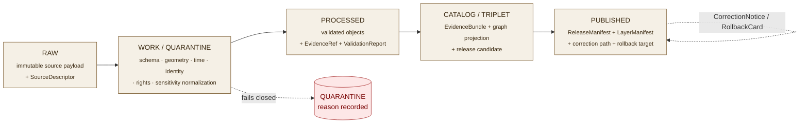
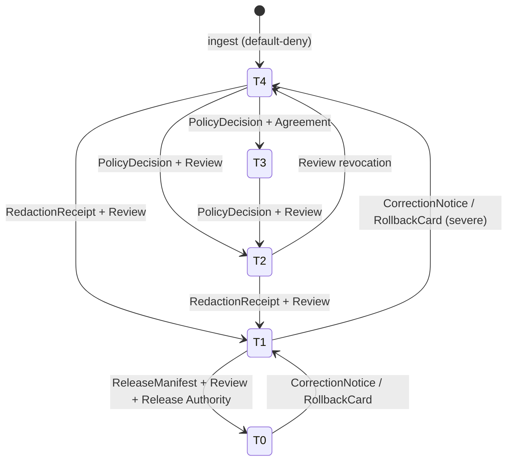

<!-- [KFM_META_BLOCK_V2]
doc_id: kfm://doc/geology-preservation-matrix
title: Geology Preservation Matrix
type: standard
version: v1
status: draft
owners: Geology domain steward (TBD); Docs steward (TBD)
created: 2026-05-17
updated: 2026-06-04
policy_label: public
related:
  - docs/domains/geology/README.md (PROPOSED)
  - docs/domains/geology/POLICY.md (PROPOSED)
  - docs/domains/geology/OPEN_QUESTIONS.md (PROPOSED)
  - docs/standards/PROV.md   # naming variance vs PROVENANCE.md tracked as OPEN-DR-01
  - docs/doctrine/directory-rules.md
  - ai-build-operating-contract.md   # CONTRACT_VERSION = "3.0.0"
  - control_plane/policy_gate_register.yaml (PROPOSED)
  - policy/domains/geology/ (PROPOSED lane root)
  - schemas/contracts/v1/domains/geology/ (PROPOSED lane root)
tags: [kfm, geology, preservation, sensitivity, lifecycle, governance]
notes:
  - Doctrine-adjacent; pins CONTRACT_VERSION = "3.0.0".
  - Per-family tier assignments are PROPOSED extensions of confirmed DOM-GEOL §I posture and Atlas v1.1 §24.5 tier scheme, except GeologicUnit/Lithology (T0) and MineralOccurrence/ResourceEstimate (T0 aggregate / T2 detail), now CONFIRMED-grounded in Atlas §24.14.
  - Object-family naming drift in the source corpus (§10.B owns-list vs §10.E table) is surfaced as CONFLICTED, not silently resolved — see §5 note and Q9.
  - Segment-form lane paths (policy/domains/geology/, schemas/contracts/v1/domains/geology/) follow Directory Rules §12; the Atlas §24.13 flat form differs — surfaced as CONFLICTED, see Q10.
  - All repo-shaped paths PROPOSED pending mounted-repo and ADR verification.
[/KFM_META_BLOCK_V2] -->

# Geology Preservation Matrix

> Per-object-family preservation, sensitivity, transform, and release rules for the **Geology and Natural Resources** domain (`[DOM-GEOL]`) — the operational table that binds DOM-GEOL doctrine to the `RAW → PUBLISHED` lifecycle.

<!-- Badge row — placeholders until CI/registries are wired. -->

<!-- TODO: replace with real CI / coverage / last-validated Shields.io endpoints once a workflow exists. -->

**Status:** `draft` · **Owners:** Geology domain steward *(TBD)* + Docs steward *(TBD)* · **Last updated:** 2026-06-04

> [!IMPORTANT]
> This file **states preservation intent**; it is not the enforcement surface. Per `directory-rules.md`, allow/deny/restrict/abstain decisions are owned by the canonical `policy/` root and machine shape by `schemas/`. Where this matrix and a `policy/` bundle or schema disagree, the bundle/schema governs and the conflict is logged in `docs/registers/DRIFT_REGISTER.md`.

---

## Contents

1. [Purpose & Scope](#1-purpose--scope)
2. [Doctrinal Basis & Authority](#2-doctrinal-basis--authority)
3. [Lifecycle Preservation (RAW → PUBLISHED)](#3-lifecycle-preservation-raw--published)
4. [Sensitivity / Rights Tier Scheme (T0–T4)](#4-sensitivity--rights-tier-scheme-t0t4)
5. [Per-Object-Family Preservation Matrix](#5-per-object-family-preservation-matrix)
6. [Source-Role Preservation](#6-source-role-preservation)
7. [Claim-Class Preservation (Occurrence ≠ Deposit ≠ Estimate ≠ Reserve)](#7-claim-class-preservation)
8. [Allowed Transforms, Receipts, and Required Gates](#8-allowed-transforms-receipts-and-required-gates)
9. [Tier Transitions](#9-tier-transitions)
10. [Correction, Rollback, and Re-Preservation](#10-correction-rollback-and-re-preservation)
11. [Validators, Tests, and Fixtures](#11-validators-tests-and-fixtures)
12. [Open Questions & Verification Backlog](#12-open-questions--verification-backlog)
13. [Related Docs](#13-related-docs)
14. [Appendix A — Truth Labels Used in This Document](#appendix-a--truth-labels-used-in-this-document)

---

## 1. Purpose & Scope

The Geology Preservation Matrix is the **per-object-family operational expression** of DOM-GEOL's sensitivity, rights, and publication posture. It answers, for every canonical geology object family, four questions:

- **What is the default sensitivity / rights tier** at which the object family is preserved and exposed?
- **Which lifecycle phases** must the object survive intact, and which phases are permitted to derive public-safe forms?
- **Which transforms** are admissible to move the object from one tier to another, and **what receipts** must accompany each transform?
- **Which gates** must close before the object can advance toward `PUBLISHED`?

This document does **not** redefine geology's object families, schemas, or APIs — those live in `contracts/`, `schemas/`, and `apps/governed-api/` lanes. It encodes only the **preservation policy view** of those objects.

> [!IMPORTANT]
> This matrix is **subordinate to** the [KFM Operating Law](#2-doctrinal-basis--authority): the public unit of value is an **inspectable claim** whose evidence, source role, policy posture, review state, and release state are auditable. The matrix below is one of the surfaces that makes that auditability concrete for geology.

<strong>Out of scope (explicit non-ownership)</strong>

- Hydrology measurements (geology may **reference** hydrostratigraphy without owning gauge or flow truth — see DOM-HYD).
- Soils, hazards risk, ownership/lease/permit/title claims, and UI/AI statements — governed by their own domain lanes and **never** canonical geology truth (DOM-GEOL §B).
- The decision of *whether* a geology object exists — a `contracts/` + `policy/` + ADR decision, not a Preservation Matrix decision.
- Field-level schema shape — owned by `schemas/contracts/v1/domains/geology/` *(PROPOSED path; see [Q10](#12-open-questions--verification-backlog))*.

[Back to top ↑](#top)

---

## 2. Doctrinal Basis & Authority

| Source | Status | What it grounds in this doc |
|---|---|---|
| `ai-build-operating-contract.md` (`CONTRACT_VERSION = "3.0.0"`) — operating law, evidence hierarchy, §23.2 sensitive-domain matrix, §37 lifecycle | **CONFIRMED** doctrine | The non-negotiable spine of every row below; sensitive-disposition deferral. |
| DOM-GEOL §A–§I — geology mission, object families, sensitivity posture | **CONFIRMED** doctrine / **PROPOSED** implementation | Object inventory, claim-class distinctions, exact-location defaults. |
| Atlas v1.1 §24.5 — Master Sensitivity / Rights Tier Reference (T0–T4) | **PROPOSED** scheme (adoption tracked as ADR-S-05) | The tier vocabulary; geology rows were not enumerated in §24.5.2 and are introduced here. |
| Atlas v1.1 §24.14 — Master Object Family × Domain Reference Matrix | Owner column **CONFIRMED**; geology sensitivity defaults **CONFIRMED for two rows** | `GeologicUnit / Lithology` = **T0**; `MineralOccurrence / ResourceEstimate` = **T0 aggregate / T2 detail in sensitive contexts**. |
| Atlas v1.1 §24.2 — Master Receipt Catalog | **CONFIRMED** doctrine / **PROPOSED** schema home | Names `RedactionReceipt`, `AggregationReceipt`, `RepresentationReceipt`, etc.; `AggregationReceipt` is cited to `[DOM-GEOL]`. |
| Directory Rules §12 — Domain Placement Law (segment form) | **CONFIRMED** doctrine | This file lives under `docs/domains/geology/` as a lane segment, never a root folder. |
| ADR-0001 — Schema-home rule (`schemas/contracts/v1/…`) | **CONFIRMED** referenced doctrine; **NEEDS VERIFICATION** in mounted repo | Anchors any schema-bearing claim in this doc. |

> [!NOTE]
> When this matrix appears to contradict DOM-GEOL or Atlas v1.0/v1.1 doctrine, **doctrine wins**. Per Atlas v1.1's conflict rule, where a Chapter 24 register and a v1.0 section disagree, **v1.0 governs** the original claim and the conflict is filed to `docs/registers/DRIFT_REGISTER.md` per Directory Rules §2.5, to be resolved by ADR or `CorrectionNotice`.

[Back to top ↑](#top)

---

## 3. Lifecycle Preservation (RAW → PUBLISHED)

**CONFIRMED doctrine** — every geology object traverses the standard KFM lifecycle. Promotion between phases is a **governed state transition**, not a file move. Preservation discipline differs by phase.

**Per-phase preservation rules** *(CONFIRMED doctrine / PROPOSED lane application)*:

| Phase | What MUST be preserved | What MUST NOT be discarded | Gate |
|---|---|---|---|
| **RAW** | Immutable source payload (or signed reference), `SourceDescriptor`, source role, rights, sensitivity flag, citation, observation/retrieval times, content hash. | Original source bytes; original coordinate precision; original units; vendor identifiers. | `SourceDescriptor` exists and resolves. |
| **WORK / QUARANTINE** | Normalization receipts (`TransformReceipt`); geometry-validity report; identity assignment receipt; quarantine reason if held. | Original RAW lineage pointer; transform receipts; failure metadata. | Validation + policy gate pass, **or** quarantine reason recorded. |
| **PROCESSED** | Validated normalized objects; `EvidenceRef`; `ValidationReport`; public-safe candidate geometry (where applicable). | Coordinate-precision generalization receipt; transform chain back to RAW. | `EvidenceRef`, `ValidationReport`, and digest closure exist. |
| **CATALOG / TRIPLET** | Catalog records; `EvidenceBundle`; graph/triplet projection; release candidate envelope. | Bundle-level provenance; per-claim sensitivity tier; review state. | Catalog/proof closure passes. |
| **PUBLISHED** | `ReleaseManifest`; `LayerManifest`; correction path; rollback target; `ReviewRecord` where required. | Public-safe layer artifacts; sensitivity-redacted receipts; signature/digest evidence. | `ReleaseManifest` + correction path + rollback target + review/policy state exist. |

> [!WARNING]
> **Watcher-as-non-publisher invariant.** Geology watchers (e.g., source-drift detectors for KGS, KCC, USGS NGMDB) observe and record only. They emit `RunReceipt` and candidate decisions; they **never** write to `data/catalog/` or `data/published/`. Promotion remains a governed transition under steward and release-authority control.

[Back to top ↑](#top)

---

## 4. Sensitivity / Rights Tier Scheme (T0–T4)

The tier scheme below is **PROPOSED** doctrine from Atlas v1.1 §24.5.1 (adoption tracked as ADR-S-05) and is reused verbatim here; the per-geology-family rows in §5 extend the scheme into this domain.

| Tier | Name | Definition | Default audience |
|---|---|---|---|
| **T0** | Open | Public-safe with no transformation required beyond standard release. | Any public client via governed API. |
| **T1** | Generalized | Public-safe only after generalization, fuzzing, aggregation, or redaction; the transform is reviewed and recorded. | Any public client via governed API. |
| **T2** | Reviewer | Released only to authenticated reviewers or domain stewards; policy-bounded; correction path active. | Stewards, reviewers, named research collaborators. |
| **T3** | Restricted | Released only under named agreement (rights, sovereignty, or consent) and recorded. | Named authorized parties only. |
| **T4** | Denied | Not released to any audience; existence of a record may be released only as steward review permits. | — |

> [!TIP]
> Tier ≠ phase. A `MineralOccurrence` at **T0** aggregate may still sit in `WORK/QUARANTINE` if validation has not closed. A `WellLog` at **T4** is still preserved through all lifecycle phases — it is the **release** that is denied, not the preservation.

[Back to top ↑](#top)

---

## 5. Per-Object-Family Preservation Matrix

**Object-family spine.** The geology family names carry an **unresolved naming drift in the source corpus**, surfaced here rather than silently resolved:

> [!CAUTION]
> **CONFLICTED — geology object-family casing.** DOM-GEOL §B "owns" list uses short forms (`Borehole`, `Well Log`, `Core Sample`, `Mineral Occurrence`, `Resource Deposit`, `Extraction Site`). The DOM-GEOL §E "Main object families" table uses `…Reference` and variant forms (`BoreholeReference`, `Well LogReference`, `GeochemistrySampleReference`, `SurficialUnit`, `StructureFeature`, `GeologyBoundaryVersion`). Atlas §24.14 uses `GeologicUnit / Lithology` and `MineralOccurrence / ResourceEstimate`. This document uses the §B short forms as section keys for readability and notes the variant in each row, but **the canonical family names are NEEDS VERIFICATION against `contracts/domains/geology/` and resolvable only by ADR or schema PR (see [Q9](#12-open-questions--verification-backlog)).**

The default tier and allowed transforms below are **PROPOSED extensions** of the confirmed DOM-GEOL §I posture ("exact borehole, sample, sensitive resource, well-log, and private well locations default to restricted or generalized public geometry"), **except** the two rows now grounded in Atlas §24.14 (marked **CONFIRMED default**).

| Object family | Default tier | Allowed transforms (PROPOSED) | Required gates | Notes |
|---|---|---|---|---|
| `GeologicUnit` | **T0** *(CONFIRMED default — §24.14)* | None required for published bedrock/surficial maps; generalization for cartographic scale. | `ReleaseManifest` + `LayerManifest`. | Canonical public surface; interpretation version preserved. |
| `Lithology` | **T0** *(CONFIRMED default — §24.14, bound to `GeologicUnit`)* | None required. | `ReleaseManifest`. | Descriptive, not locational. |
| `StratigraphicInterval` | **T0** | None required. | `ReleaseManifest`. | Correlation strength preserved as uncertainty annotation. |
| `GeologicAge` | **T0** | None required. | `ReleaseManifest`. | Age-model version preserved with `spec_hash`. |
| `FaultStructure` *(also §E `StructureFeature`)* | **T0** *(public maps)* / **T2** *(detailed seismotectonic)* | Generalization of trace where sensitive-infrastructure proximity applies. | `RedactionReceipt` if generalized; steward review for sensitive joins. | Hazards lane consumes risk context; geology does not own risk (§F). See [Q5](#12-open-questions--verification-backlog). |
| `Borehole` *(public well; §E `BoreholeReference`)* | **T1** | Coordinate generalization to a steward-set cell; `RedactionReceipt`. | `RedactionReceipt` + `ReviewRecord`. | DOM-GEOL §I: exact borehole locations default to restricted/generalized public geometry. |
| `Borehole` *(private / proprietary)* | **T4** | T3 only under data-use agreement; T2 to named reviewers; generalized aggregate → T1. | Named agreement + `ReviewRecord` + `PolicyDecision`. | Private-well locations default restricted/generalized — CONFIRMED posture (§I). |
| `WellLog` *(KGS LAS public archive)* | **T1** | Generalize well coordinate; publish curve-level metadata; raw LAS via reviewer tier. | `RedactionReceipt` + `ReviewRecord`. | DOM-GEOL §K names borehole/well-log rights tests as PROPOSED. |
| `WellLog` *(proprietary / embargoed)* | **T4** | T3 under named research agreement only. | Named agreement + `PolicyDecision`. | Rights/embargo status preserved on `SourceDescriptor`. |
| `CoreSample` | **T2** | Aggregate sample-density layer → T1; sample-level access via reviewer tier. | `AggregationReceipt` + `ReviewRecord`. | Sample existence may be public; precise locality and analytical detail tier-gated. |
| `GeophysicalObservation` | **T1** | Generalized raster product public; full-resolution grid via reviewer tier where rights permit. | `RedactionReceipt` or `ReviewRecord`. | Raster vintages preserved per `DatasetVersion`. |
| `GeochemistrySample` *(§E `GeochemistrySampleReference`)* | **T2** | Aggregated/binned anomaly layer → T1; sample-level via reviewer tier. | `AggregationReceipt` + `ReviewRecord`. | Anomaly mapping risks resource fingerprinting — see §7. |
| `MineralOccurrence` | **T0 aggregate / T2 detail** *(CONFIRMED default — §24.14, "T0 for aggregate; T2 for detail in sensitive contexts")* | Generalized occurrence-density layer at T0; locality detail via reviewer tier when sensitivity applies. | `AggregationReceipt` for T0 rollups; `ReviewRecord` for T2. | Distinct from deposit/estimate — see §7. |
| `ResourceEstimate` *(§B owns-list says `Resource Deposit`; §C & §24.14 say `ResourceEstimate`)* | **T2** *(default; §24.14 detail tier)* | Aggregate basin/play-level estimate → T1 only after steward and rights review. | `ReviewRecord` + `PolicyDecision`. | Estimate ≠ reserve ≠ production (§7). Family-name drift surfaced in [Q9](#12-open-questions--verification-backlog). |
| `ExtractionSite` | **T1** | Generalized site footprint public; operator-linked condition detail tier-gated. | `RedactionReceipt`. | Operator linkage to People/Land must preserve PEOPLE-domain restrictions. |
| `ReclamationRecord` | **T0** | None required. | `ReleaseManifest`. | Reclamation status is a public-interest signal. |
| `CrossSection` | **T0** *(public maps)* / **T2** *(detailed proprietary)* | Generalized cross-section for public display; full sections via reviewer tier. | `RedactionReceipt` if derived from T2/T4 sources; `RepresentationReceipt` if 3D. | Carries interpretation-version receipt; 3D exposure adds reality-boundary note — see [Q7](#12-open-questions--verification-backlog). |
| `HydrostratigraphicUnit` | **T0** | None required. | `ReleaseManifest`. | Cross-domain bridge to Hydrology; preserves "context without replacing measurements" (§F). |

> [!CAUTION]
> A **T0 aggregate does not authorize T0 detail.** Aggregating `MineralOccurrence` to a county-level rollup is a transform with an `AggregationReceipt`; the underlying point-level records remain at their default tier. Do not back-fill the T0 label onto the source records.

[Back to top ↑](#top)

---

## 6. Source-Role Preservation

Source role is recorded on `SourceDescriptor` and **must be preserved** through every transform. The §24.1 Source-Role Anti-Collapse Register names geology explicitly: confusing a `model` source with an `observation` source is a doctrinal violation this matrix must defend against.

| Source family | Role(s) per DOM-GEOL §D | Rights / sensitivity | Freshness | Preservation note |
|---|---|---|---|---|
| Kansas Geological Survey (KGS) — geologic maps, surficial geology | authority / observation / context / model *as role requires* | NEEDS VERIFICATION; sensitive joins fail closed | source-vintage / cadence specific | KGS map vintages preserved per `DatasetVersion`. |
| USGS NGMDB / GeMS | authority / observation / context / model | NEEDS VERIFICATION; sensitive joins fail closed | source-vintage specific | GeMS-style attributes preserved during normalization; no schema flattening at WORK. |
| KGS oil and gas wells / production | authority / observation / context / model | NEEDS VERIFICATION; sensitive joins fail closed | source-vintage / cadence | Public-vs-proprietary split preserved at RAW. |
| KCC oil and gas regulatory data | authority / observation / context / model | NEEDS VERIFICATION; sensitive joins fail closed | cadence-specific | Regulatory channel — distinct provenance from observation. |
| KGS/KDHE WWC5 water-well program | authority / observation / context / model | NEEDS VERIFICATION; sensitive joins fail closed | cadence-specific | Private-well coordinates default to T4 — see §5. |
| KGS LAS digital well logs / well tops | authority / observation / context / model | rights-bearing; NEEDS VERIFICATION | source-vintage | LAS curves and well tops carry separate rights envelopes. |
| USGS MRDS | authority / observation / context / model | NEEDS VERIFICATION; sensitive joins fail closed | source-vintage specific | Occurrence vs deposit class must be preserved. |
| USGS 3DEP terrain | authority / observation *(INFERRED — not in §D list)* | typically open *(NEEDS VERIFICATION)* | release-specific | Geomorphology context; preserve resolution and acquisition date. *(INFERRED addition — not enumerated in DOM-GEOL §D.)* |

> [!NOTE]
> All rights/sensitivity entries above are **NEEDS VERIFICATION** until current source-use terms are recorded in `data/registry/sources/geology/` *(PROPOSED path)* and signed off by the source steward. DOM-GEOL §D records each source's role envelope as "authority / observation / context / model **as source role requires**" — the role is fixed per descriptor at admission, not chosen per query.

[Back to top ↑](#top)

---

## 7. Claim-Class Preservation (Occurrence ≠ Deposit ≠ Estimate ≠ Reserve)

**CONFIRMED doctrine (DOM-GEOL §I):** *"Occurrence, deposit, estimate, permit, production, and reserve claims must remain distinct."*

| Claim class | Definition (CONFIRMED term / PROPOSED field realization) | Distinct from | Anti-collapse rule |
|---|---|---|---|
| **Occurrence** | A documented observation of a mineral or hydrocarbon presence at a location. | Deposit, Estimate, Reserve. | Aggregation into a "deposit" layer requires a transform receipt; source occurrence records preserve their class. |
| **Deposit** | A geologically delineated body of resource material with characterized extent. | Estimate, Reserve. | Delineation method, vintage, and authority preserved; no implicit promotion from "many occurrences" to "deposit." |
| **Estimate** | A quantitative resource estimate produced under a stated reporting framework. | Reserve, Production. | Reporting framework preserved on the estimate; cross-framework comparison requires an explicit crosswalk receipt. |
| **Reserve** | An economically recoverable subset of an estimate under specified conditions. | Estimate, Production. | Economic/regulatory conditions preserved; a reserve never decays silently into an estimate or vice versa. |
| **Permit** | A regulatory authorization tied to a site or operator. | Production, Extraction Site. | Regulatory provenance (e.g., KCC) preserved; permits are not production evidence. |
| **Production** | Reported extraction over a defined interval. | Permit, Estimate. | Operator self-reporting role preserved on `SourceDescriptor`; production never proves estimate. |

> [!IMPORTANT]
> Anti-collapse is enforced at three places: (1) the `contracts/` Markdown for each class, (2) `schemas/contracts/v1/domains/geology/` *(PROPOSED)* via distinct types, and (3) a PROPOSED `tests/domains/geology/` resource-class anti-collapse fixture (DOM-GEOL §K). This matrix is the **doctrinal** anchor for those enforcement points.

[Back to top ↑](#top)

---

## 8. Allowed Transforms, Receipts, and Required Gates

Every demotion in sensitivity ("show less precisely") or aggregation ("show in summary") is a **transform** with a **receipt** linked into the object's `EvidenceBundle`. Receipt names and triggers below align with the Atlas §24.2 Master Receipt Catalog; `AggregationReceipt` is cited there to `[DOM-GEOL]`.

| Transform | Effect | Receipt | Tier motion |
|---|---|---|---|
| **Coordinate generalization (cell-binning)** | Snap point to a cell of stated size (e.g., 1 km, 10 km — PROPOSED defaults, [Q3](#12-open-questions--verification-backlog)). | `RedactionReceipt` (cell size, method, reason; or `TransformReceipt` for non-sensitive cartographic snap). | T4 → T1, T2 → T1, T1 → T0 *(only with steward + release authority)*. |
| **Coordinate fuzzing** | Apply a randomized offset within a stated radius. | `RedactionReceipt` (radius, RNG seed reference). | T4 → T1, T2 → T1. |
| **Geometry generalization** | Reduce polyline/polygon vertices, snap to scale. | `TransformReceipt` (cartographic) or `RedactionReceipt` (sensitivity-driven). | within-tier *(scale variant)*, T2 → T1. |
| **Aggregation** | Roll up records to a coarser unit (county, HUC, basin, play). | `AggregationReceipt` (geometry_scope, time_scope, aggregation_method, suppression_rule, output_unit). | T2 → T1, T1 → T0. |
| **Attribute suppression** | Remove a sensitive attribute (operator, owner, condition). | `RedactionReceipt` (kept_fields, removed_fields, reason). | T2 → T1, T4 → T2. |
| **Interpretation versioning** | Mark interpretation vintage on cross-section, age model, or correlation. | `DatasetVersion` annotation. | within-tier — does not move tier. |
| **Reality-boundary annotation** *(3D only)* | Distinguish measured vs interpretive 3D content. | `RepresentationReceipt` + `RealityBoundaryNote` (per MAP-MASTER / UIAI). | Required for any geology object exposed via Planetary/3D admission. |

> [!CAUTION]
> **Renderer/style filters are not a valid sensitive-geometry protection mechanism.** Hiding a layer with a client-side filter does not redact the underlying tile. Generalization, suppression, and aggregation are the only doctrinally sound mechanisms; receipts must reflect the change **at the data layer**.

[Back to top ↑](#top)

---

## 9. Tier Transitions

**PROPOSED transitions** (Atlas v1.1 §24.5.3 scheme, geology-applied). All transitions are reversible (CONFIRMED doctrine).

| From → To | Required artifact | Required reviewer | Reversibility |
|---|---|---|---|
| T4 → T3 | `PolicyDecision` + `ReviewRecord` + named agreement | Geology steward + rights-holder where applicable | Reversible: agreement revocation returns to T4 with `CorrectionNotice`. |
| T4 → T2 | `PolicyDecision` + `ReviewRecord` | Geology steward | Reversible: review revocation returns to T4. |
| T4 → T1 | `RedactionReceipt` + `ReviewRecord` | Geology steward | Reversible: redaction may be re-evaluated; correction may demote a published T1 back to T4 via `RollbackCard`. |
| T3 → T2 | `PolicyDecision` + `ReviewRecord` | Geology steward | Reversible. |
| T2 → T1 | `RedactionReceipt` + `ReviewRecord` | Geology steward | Reversible. |
| T1 → T0 | `ReleaseManifest` + `ReviewRecord` | Geology steward + release authority | Reversible: rollback via `RollbackCard`. |
| Any → T4 *(downgrade)* | `CorrectionNotice` + `ReviewRecord` | Geology steward (+ rights-holder where applicable) | Always permitted; precedes derivative invalidation. |

> [!NOTE]
> **Reading rule (CONFIRMED doctrine, §24.5.3).** A tier upgrade (toward more public) always needs **both** a transform receipt **and** a review record; a downgrade (toward less public) **never needs both** — a `CorrectionNotice` alone is sufficient to remove or restrict.

> [!TIP]
> **Default-deny on ingest.** New geology source families enter the WORK lane with an implicit T4 sensitivity flag until a `SourceDescriptor` + rights review establish a higher-trust default — consistent with the KFM posture that the safe state is quarantine, denial, restriction, or abstention until rights, source role, access conditions, cadence, and release class are recorded.

[Back to top ↑](#top)

---

## 10. Correction, Rollback, and Re-Preservation

Geology preservation is **reversible by design**.

| Event | Required artifact | Effect on tier | Effect on lifecycle |
|---|---|---|---|
| Source-side correction (KGS, USGS, KCC issues an erratum) | `CorrectionNotice` linked to the source's `EvidenceBundle`. | May trigger tier re-evaluation. | Released artifact remains; supersession entry recorded. |
| Rights change (license revocation, embargo activation) | `PolicyDecision` + `RollbackCard`. | T0/T1 published may demote to T4. | Released artifact withdrawn via `RollbackCard`; correction path active. |
| Steward review revocation | `ReviewRecord` (revocation) + `CorrectionNotice`. | Returns object to default tier. | Published descendants tracked through release supersession. |
| Discovered class-collapse error (e.g., estimate published as reserve) | `CorrectionNotice` + `ReleaseManifest` revision. | Class correction; tier may shift. | Republish under the correct class; the wrong publication retained for audit. |
| Discovered geometry over-exposure (e.g., raw borehole published instead of generalized) | `RollbackCard` + `RedactionReceipt`. | T0/T1 → T4 immediate. | Layer withdrawn; corrected layer republished only after re-review. |

> [!WARNING]
> **Corrections are not silent.** A released layer that demotes from T0 to T4 leaves a public, citable `CorrectionNotice`. Re-publishing under the same name without lineage is anti-doctrine and reviewable as drift.

[Back to top ↑](#top)

---

## 11. Validators, Tests, and Fixtures

The validators listed below are **PROPOSED** per DOM-GEOL §K and bind directly into the Preservation Matrix rows.

| Validator (PROPOSED) | What it enforces | Likely home *(PROPOSED, segment form per Directory Rules §12)* |
|---|---|---|
| Source-role validator | `SourceDescriptor.role` is a canonical role; no role drift across pipeline phases. | `tools/validators/source/` |
| Resource-class anti-collapse test | `MineralOccurrence`, `Deposit`, `ResourceEstimate`, `Reserve`, `Permit`, `Production` types do not interchange. | `tests/domains/geology/claim-class/` |
| Public-safe geometry test | Published geology layers carry the appropriate `RedactionReceipt` / `AggregationReceipt` when their source class defaults to T1+. | `tests/domains/geology/public-safe-geometry/` |
| Borehole / well-log rights test | Private and proprietary `Borehole` / `WellLog` records never appear at T0/T1 without rights closure. | `tests/domains/geology/well-rights/` |
| Catalog closure test | Geology `CATALOG` records resolve to a complete `EvidenceBundle` with all referenced sources, transforms, and reviews. | `tests/domains/geology/catalog-closure/` |
| AI evidence-before-model test | Geology Focus Mode answers ABSTAIN when `EvidenceBundle` is insufficient and DENY when policy blocks. | `tests/domains/geology/governed-ai/` |
| Tier-transition fixture set | Each row in §9 has a positive (valid) and negative (forbidden) transition fixture. | `fixtures/domains/geology/tier-transitions/` |

> [!TIP]
> These tests are the enforcement surface of this matrix. Adding a new geology object family or source family **without** adding the corresponding fixtures is a drift event.

[Back to top ↑](#top)

---

## 12. Open Questions & Verification Backlog

| # | Question / item | Why it matters | Status |
|---|---|---|---|
| Q1 | Confirm the canonical home for geology schemas (`schemas/contracts/v1/domains/geology/` per ADR-0001 + Directory Rules §12). | Anchors every schema-bearing claim in this doc. | **NEEDS VERIFICATION** — mounted repo + ADR. |
| Q2 | Are KGS LAS public archive coordinates already generalized at source, or is generalization KFM's responsibility on ingest? | Determines whether the WORK phase needs a default coordinate-generalization step. | **NEEDS VERIFICATION** — source-use terms + steward sign-off. |
| Q3 | What cell size(s) are canonical defaults for borehole coordinate generalization (proposed: 1 km, 10 km)? | Steward decision with downstream tile-pyramid implications. | **PROPOSED** — needs steward decision + ADR. |
| Q4 | Where is the canonical `data/registry/sources/geology/` index, and how does it relate to `control_plane/source_authority_register.yaml`? | Required to resolve rights/sensitivity claims to operational state. | **NEEDS VERIFICATION**. |
| Q5 | Should `FaultStructure` carry a sensitive-infrastructure proximity override (auto-T2 within N m of named critical assets)? | Cross-lane policy interaction with Settlements/Infrastructure. | **OPEN** — cross-domain ADR likely (cf. ADR-S-14 cross-lane join policy). |
| Q6 | Canonical `RedactionReceipt` schema home, and does it differ for geology vs other domains (per-domain subclass vs single envelope)? | §24.2 proposes `schemas/contracts/v1/receipts/`; per-domain split is ADR-class (ADR-S-03). | **NEEDS VERIFICATION**. |
| Q7 | Does planetary/3D admission for `CrossSection` require a per-section `RepresentationReceipt`, or is one bundle-level receipt sufficient? | Affects 3D scene release flow for subsurface views. | **OPEN** — MAP-MASTER / UIAI intersection (cf. ADR-S-07). |
| Q8 | Confirm `ResourceEstimate` reporting frameworks supported on the public surface (CRIRSCO-family vs USGS Circular 831 vs internal). | Cross-framework comparison without a crosswalk receipt is anti-doctrine. | **OPEN** — needs source-steward enumeration. |
| Q9 | **Resolve geology object-family naming drift:** §B short forms vs §E `…Reference` forms vs §24.14 forms (and `Resource Deposit` vs `ResourceEstimate`). | The matrix keys, schemas, and contracts all depend on one canonical family-name set. | **CONFLICTED** — ADR or schema PR required; file to `DRIFT_REGISTER.md`. |
| Q10 | **Resolve lane-path form:** segment form (`policy/domains/geology/`, `schemas/contracts/v1/domains/geology/`, Directory Rules §12) vs Atlas §24.13 flat form (`policy/sensitivity/`, `schemas/contracts/v1/geology/`). | Two defensible path forms for the same lane; new files must target one. | **CONFLICTED** — ADR-class; this doc uses the §12 segment form pending resolution. |

[Back to top ↑](#top)

---

## 13. Related Docs

- `docs/domains/geology/README.md` — geology domain landing page *(PROPOSED home — verify path)*.
- `docs/domains/geology/POLICY.md` — geology policy & sensitivity posture *(PROPOSED)*.
- `docs/domains/geology/OPEN_QUESTIONS.md` — geology open-questions register *(PROPOSED)*.
- `docs/standards/PROV.md` — provenance standard governing `EvidenceBundle` lineage *(naming variance vs `PROVENANCE.md` → OPEN-DR-01)*.
- `docs/doctrine/directory-rules.md` — §12 Domain Placement Law authorizing this file's location.
- `ai-build-operating-contract.md` — operating law, §23.2 sensitive-domain matrix, §37 lifecycle (`CONTRACT_VERSION = "3.0.0"`).
- `contracts/domains/geology/` — geology object-family meaning *(PROPOSED lane)*.
- `schemas/contracts/v1/domains/geology/` — geology object-family machine shape *(PROPOSED lane, ADR-0001)*.
- `policy/domains/geology/` — geology admissibility, sensitivity, release policy *(PROPOSED lane; vs flat `policy/sensitivity/` → Q10)*.
- `control_plane/source_authority_register.yaml` — source rights and authority state *(PROPOSED)*.
- `docs/registers/DRIFT_REGISTER.md` — open the entry here for the Q9 / Q10 conflicts *(PROPOSED)*.
- KFM Domains Culmination Atlas v1.1 §24.2 / §24.5 / §24.13 / §24.14 — receipt catalog, tier scheme, crosswalk, family × domain matrix.
- KFM Encyclopedia — Geology and Natural Resources domain doctrine.

[Back to top ↑](#top)

---

## Appendix A — Truth Labels Used in This Document

| Label | Meaning in this doc |
|---|---|
| **CONFIRMED** | Anchored in attached KFM doctrine (DOM-GEOL, Atlas v1.0/v1.1, Encyclopedia, Directory Rules, operating contract). |
| **PROPOSED** | Extension, recommendation, path, or placement not yet verified in a mounted repo or ratified by ADR. |
| **INFERRED** | Reasonably derivable from visible evidence but not directly stated (e.g., USGS 3DEP role). |
| **NEEDS VERIFICATION** | Checkable against repo evidence or steward sign-off; not yet checked strongly enough to act as fact. |
| **CONFLICTED** | Sources disagree (e.g., object-family naming drift, lane-path form); held until ADR or drift-register entry resolves it. |
| **OPEN** | Cross-domain or scope question whose resolution requires more than a single ADR or review. |
| **UNKNOWN** | Not resolvable in the current session. |

> [!NOTE]
> Memory is not evidence. Any specific path, route, owner, or maturity claim in this document remains **PROPOSED / NEEDS VERIFICATION** until inspected against the mounted repository. No repository was mounted in the session that produced this revision.

---

**Related docs:** see [§13](#13-related-docs) · **Doctrine basis:** see [§2](#2-doctrinal-basis--authority) · **Open verification items:** see [§12](#12-open-questions--verification-backlog)

**Last updated:** 2026-06-04 · Status: `draft` · `CONTRACT_VERSION = "3.0.0"` · `[DOM-GEOL]` · [Back to top ↑](#top)
