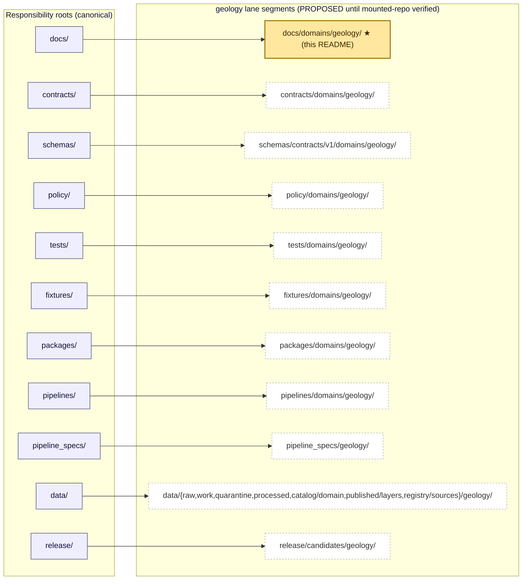

<!-- [KFM_META_BLOCK_V2]
doc_id: kfm://doc/docs-domains-geology-readme
title: Geology and Natural Resources Domain — Documentation Landing
type: domain-readme
version: v1
status: draft
owners: <docs-steward> + <geology-domain-steward>   # placeholder — confirm in CODEOWNERS
created: 2026-05-17
updated: 2026-05-17
policy_label: public
related:
  - docs/doctrine/directory-rules.md
  - docs/architecture/contract-schema-policy-split.md
  - docs/domains/README.md
  - kfm://doc/dom-geol
  - kfm://doc/ency-geology-and-natural-resources
tags: [kfm, domain, geology, natural-resources]
notes:
  - Lane landing README, not a doctrine root. Doctrine lives in DOM-GEOL and the Encyclopedia.
  - Path home confirmed by Directory Rules §6.1 and Domain Placement Law (§12).
  - All implementation-layer claims default to PROPOSED until verified against mounted repo evidence.
[/KFM_META_BLOCK_V2] -->

# Geology and Natural Resources Domain

*Documentation landing for KFM's geology lane — bedrock and surficial geology, stratigraphy, structures, subsurface observations, and resource context, governed by evidence and bounded by public-safe geometry.*

<!-- Top-of-file badge row — placeholders. Replace with real Shields.io endpoints once owners and CI are wired. -->


> **Status:** `draft` &nbsp;·&nbsp; **Owners:** `<docs-steward>` + `<geology-domain-steward>` _(placeholders — confirm in CODEOWNERS)_ &nbsp;·&nbsp; **Last updated:** 2026-05-17

> [!IMPORTANT]
> This README is a **lane landing page**, not a doctrine source. Domain doctrine for Geology lives in `DOM-GEOL` (canonical dossier) and the Domain & Capability Encyclopedia §7.8. Where this page summarizes doctrine, the upstream sources prevail.

---

## Contents

- [1. Scope and mission](#1-scope-and-mission)
- [2. Authority and repo fit](#2-authority-and-repo-fit)
- [3. What belongs in this folder](#3-what-belongs-in-this-folder)
- [4. What does NOT belong here](#4-what-does-not-belong-here)
- [5. The geology lane across the repo](#5-the-geology-lane-across-the-repo)
- [6. Pipeline shape (RAW → PUBLISHED)](#6-pipeline-shape-raw--published)
- [7. Ubiquitous language](#7-ubiquitous-language)
- [8. Object families](#8-object-families)
- [9. Source families and rights posture](#9-source-families-and-rights-posture)
- [10. Sensitivity, rights, and publication posture](#10-sensitivity-rights-and-publication-posture)
- [11. Cross-lane relations](#11-cross-lane-relations)
- [12. Map and viewing products](#12-map-and-viewing-products)
- [13. API, contract, and schema surfaces](#13-api-contract-and-schema-surfaces)
- [14. Governed AI behavior](#14-governed-ai-behavior)
- [15. Validators, tests, and fixtures (proposed)](#15-validators-tests-and-fixtures-proposed)
- [16. Verification backlog and open questions](#16-verification-backlog-and-open-questions)
- [17. Related docs](#17-related-docs)
- [18. FAQ](#18-faq)
- [19. Appendix](#19-appendix)

---

## 1. Scope and mission

**CONFIRMED doctrine / PROPOSED implementation.** The Geology and Natural Resources domain governs geologic maps, stratigraphy, lithology, structures, subsurface observations, and resource context **without turning interpretations or extraction records into unreviewed truth**. It owns bedrock and surficial geology, geologic age, structures, geomorphology, boreholes, well logs, cores, geophysics, geochemistry, mineral occurrences, oil/gas/resource deposits, and extraction and reclamation context. It links to Hydrology via hydrostratigraphy.

The domain's first job is **anti-collapse**: keep `Occurrence`, `Deposit`, `Estimate`, `Permit`, `Production`, and `Reserve` claims distinct, and never let a generalized map polygon or an AI summary stand in for a sourced, dated, role-typed observation.

> [!NOTE]
> "Govern" here means: enforce source-role discipline, bind every public claim to an `EvidenceBundle`, deny-by-default for exact subsurface and private-well exposure, and route every promotion through a governed state transition — not a file move.

---

## 2. Authority and repo fit

| Field | Value | Status |
|---|---|---|
| Canonical home of this README | `docs/domains/geology/README.md` | **CONFIRMED** by Directory Rules §6.1 and Domain Placement Law (§12) |
| Authority level of this folder | Lane documentation under `docs/` (canonical root) | **CONFIRMED** |
| Doctrinal source of truth for the domain | `DOM-GEOL` dossier + Encyclopedia §7.8 + Culmination Atlas §10 | **CONFIRMED** |
| Schema responsibility root for geology objects | `schemas/contracts/v1/domains/geology/...` | **PROPOSED** per ADR-0001 (schema-home); verify against mounted repo |
| Policy responsibility root | `policy/domains/geology/...` | **PROPOSED** |
| Pipeline spec home | `pipeline_specs/geology/...` | **PROPOSED** |
| Public trust path | `apps/governed-api/` (the trust membrane) — **never** direct reads of `data/raw\|work\|quarantine\|processed` | **CONFIRMED doctrine** |
| Lifecycle invariant | `RAW → WORK / QUARANTINE → PROCESSED → CATALOG / TRIPLET → PUBLISHED` | **CONFIRMED** |
| Last reviewed | 2026-05-17 | placeholder |

> [!WARNING]
> A geology-specific root (`geology/` at repo root) **MUST NOT** exist. Per Directory Rules §12 (Domain Placement Law), the domain appears as a **segment inside each responsibility root**, never as a root itself. If a `geology/` root is encountered in the mounted repo, raise it as a drift entry in `docs/registers/DRIFT_REGISTER.md`.

[Back to top ↑](#contents)

---

## 3. What belongs in this folder

`docs/domains/geology/` is the **human-facing** landing for the geology lane. It explains; it does not store machine artifacts.

Accepted content (all **PROPOSED** filenames; verify against mounted repo before creating):

| File pattern | Purpose | Status |
|---|---|---|
| `README.md` (this file) | Lane orientation, governance summary, links into the rest of the lane | CONFIRMED placement |
| `DOM-GEOL.md` _(or equivalent)_ | The canonical geology domain dossier; doctrine source for this lane | PROPOSED |
| `source-roles.md` | Source-role discipline for KGS, USGS, KCC, etc. (authority / observation / context / model) | PROPOSED |
| `anti-collapse.md` | Distinctness rules for Occurrence vs Deposit vs Estimate vs Permit vs Production vs Reserve | PROPOSED |
| `public-safe-geometry.md` | Generalization rules for borehole, well-log, sample, sensitive resource locations | PROPOSED |
| `cross-section-protocol.md` | Cross-section authorship, uncertainty annotation, evidence binding | PROPOSED |
| `hydrostratigraphy.md` | The geology ↔ hydrology bridge for hydrostratigraphic units | PROPOSED |
| `ai-behavior.md` _(or link out)_ | Domain-specific governed-AI rules (ABSTAIN / DENY conditions for geology) | PROPOSED |

> [!TIP]
> Doctrine files (`DOM-GEOL.md`, etc.) should each carry a KFM Meta Block v2 header and link back to this README under "Related docs."

---

## 4. What does NOT belong here

Per Directory Rules §6.1 and the contract-schema-policy split, **none** of the following live under `docs/domains/geology/`:

| Content | Belongs in | Why not here |
|---|---|---|
| JSON Schema files | `schemas/contracts/v1/domains/geology/...` | `docs/` explains; `schemas/` defines machine shape. |
| Contract Markdown (object meaning) | `contracts/domains/geology/...` | Object meaning is a separate canonical authority. |
| Policy rules / sensitivity bundles | `policy/domains/geology/...` | Allow / deny / restrict / abstain lives in `policy/`. |
| Tests, fixtures | `tests/domains/geology/`, `fixtures/domains/geology/` | Proof of enforceability lives in `tests/` + `fixtures/`. |
| Source descriptors | `data/registry/sources/geology/...` | Source identity / rights / sensitivity belongs to the registry. |
| Pipeline executable code | `pipelines/domains/geology/...` | Executable pipeline logic is a separate root. |
| Pipeline declarative configs | `pipeline_specs/geology/...` | What runs vs. how it runs are separate authorities. |
| Lifecycle data (raw, work, processed, catalog, published) | `data/<phase>/geology/...` | The lifecycle invariant lives in `data/`. |
| Release manifests, rollback cards, correction notices | `release/candidates/geology/...`, `release/...` | Release **decisions** are a separate root from documentation. |
| Receipts, proofs, evidence bundles | `data/receipts/`, `data/proofs/` | Trust-bearing artifacts never live in `docs/` or `artifacts/`. |
| Domain-specific UI code | `apps/explorer-web/...`, `packages/ui/...`, `packages/maplibre/...` | Renderer is not a truth path. |
| ADRs | `docs/adr/` | ADRs are repo-wide; they refine but do not live inside a lane. |

[Back to top ↑](#contents)

---

## 5. The geology lane across the repo

**CONFIRMED doctrine / PROPOSED file homes.** Per Directory Rules §12, the geology lane appears as a segment inside every relevant responsibility root. This README sits at the ★ node:



Reference tree (PROPOSED — verify against mounted repo):

```text
docs/domains/geology/                            # ← this folder
contracts/domains/geology/
schemas/contracts/v1/domains/geology/
policy/domains/geology/
tests/domains/geology/
fixtures/domains/geology/
packages/domains/geology/
pipelines/domains/geology/
pipeline_specs/geology/
data/raw/geology/
data/work/geology/
data/quarantine/geology/
data/processed/geology/
data/catalog/domain/geology/
data/published/layers/geology/
data/registry/sources/geology/
release/candidates/geology/
```

> [!NOTE]
> Cross-cutting files (e.g., a shared geometry validator used by geology + hydrology + soil) do **not** live under a domain segment. They belong at the lowest common responsibility root without a domain folder — e.g., `tools/validators/geometry/` rather than `tools/validators/domains/geology/`. See Directory Rules §12 ("Multi-domain and cross-cutting files").

[Back to top ↑](#contents)

---

## 6. Pipeline shape (RAW → PUBLISHED)

**CONFIRMED doctrine / PROPOSED lane application.** Geology follows the lifecycle invariant; promotion is a **governed state transition**, not a file move. Watchers observe and record; they never publish.

```mermaid
flowchart LR
  RAW["RAW<br/><sub>immutable source payload<br/>+ SourceDescriptor + hash</sub>"]
  WORK["WORK / QUARANTINE<br/><sub>normalize schema, geometry,<br/>time, identity, evidence, rights</sub>"]
  PROC["PROCESSED<br/><sub>validated objects, receipts,<br/>public-safe candidates</sub>"]
  CAT["CATALOG / TRIPLET<br/><sub>EvidenceBundle, graph projection,<br/>release candidates</sub>"]
  PUB["PUBLISHED<br/><sub>ReleaseManifest, rollback target,<br/>correction path</sub>"]

  RAW -->|gate: SourceDescriptor exists| WORK
  WORK -->|gate: validation + policy pass<br/>or quarantine reason recorded| PROC
  PROC -->|gate: EvidenceRef +<br/>ValidationReport + digest closure| CAT
  CAT -->|gate: catalog / proof closure| PUB
  PUB -. correction / rollback .-> CAT
```



| Stage | Handling | Gate | Status |
|---|---|---|---|
| **RAW** | Capture immutable source payload or reference with source role, rights, sensitivity, citation, time, and hash. | `SourceDescriptor` exists. | PROPOSED |
| **WORK / QUARANTINE** | Normalize schema, geometry, time, identity, evidence, rights, and policy; hold failures. | Validation and policy gate pass, or quarantine reason recorded. | PROPOSED |
| **PROCESSED** | Emit validated normalized objects, receipts, and public-safe candidates. | `EvidenceRef`, `ValidationReport`, and digest closure exist. | PROPOSED |
| **CATALOG / TRIPLET** | Emit catalog records, `EvidenceBundle`s, graph/triplet projections, and release candidates. | Catalog / proof closure passes. | PROPOSED |
| **PUBLISHED** | Serve released public-safe artifacts through governed APIs and manifests. | `ReleaseManifest`, correction path, rollback target, and review/policy state exist. | PROPOSED |

[Back to top ↑](#contents)

---

## 7. Ubiquitous language

Project-specific terms. **Preserve casing and compound forms exactly** when referenced elsewhere.

| Term | One-line meaning | Status |
|---|---|---|
| **GeologicUnit** | A mapped lithostratigraphic or chronostratigraphic body, evidence-bound and version-tracked. | CONFIRMED term / PROPOSED field realization |
| **Lithology** | The material character of a unit or sample, role-typed and source-cited. | CONFIRMED term / PROPOSED field realization |
| **StratigraphicInterval** | A named interval with bounded contacts, age model, and interpretation version. | CONFIRMED term / PROPOSED field realization |
| **GeologicAge** | A time-scope assertion (chronostratigraphic / geochronologic) with uncertainty. | CONFIRMED term / PROPOSED field realization |
| **FaultStructure** | A line / surface structure with sense-of-slip and confidence. | CONFIRMED term / PROPOSED field realization |
| **Borehole** | A drilled location with subsurface observations; **default-restricted exact location**. | CONFIRMED term / PROPOSED field realization |
| **WellLog** | A subsurface log series tied to a `Borehole`; rights-controlled (e.g., KGS LAS). | CONFIRMED term / PROPOSED field realization |
| **CoreSample** | A physical core / sample reference with location and chain-of-custody context. | CONFIRMED term / PROPOSED field realization |
| **GeophysicalObservation** | Field or remote-sensed geophysical measurement; raster/volume support. | CONFIRMED term / PROPOSED field realization |
| **GeochemistrySample** | A geochemical sample reference with analyte set and uncertainty. | CONFIRMED term / PROPOSED field realization |
| **MineralOccurrence** | A documented presence — **not** a deposit, **not** an estimate. | CONFIRMED term / PROPOSED field realization |
| **ResourceDeposit** | A delineated body with characterization — **not** an estimate. | CONFIRMED term / PROPOSED field realization |
| **ResourceEstimate** | A quantitative estimate with method, confidence class, and date. | CONFIRMED term / PROPOSED field realization |
| **ExtractionSite** | A site where extraction is or was active; operator and permit context distinct from physical claims. | CONFIRMED term / PROPOSED field realization |
| **ReclamationRecord** | Reclamation status, plan, and observations; not a closure attestation. | CONFIRMED term / PROPOSED field realization |
| **CrossSection** | A 2D interpretive line through subsurface, with explicit interpretation version. | CONFIRMED term / PROPOSED field realization |
| **HydrostratigraphicUnit** | A geology↔hydrology bridge object; **does not replace** hydrology measurements. | CONFIRMED term / PROPOSED field realization |

[Back to top ↑](#contents)

---

## 8. Object families

The geology lane owns the following object families. Each family carries source role, evidence binding, distinct temporal scopes (source / observed / valid / retrieval / release / correction times), and a deterministic identity rule.

| Object | Purpose | Identity rule (PROPOSED) | Status |
|---|---|---|---|
| `GeologicUnit` | Bedrock / surficial unit polygon and attribution | `source_id + object_role + temporal_scope + normalized_digest` | PROPOSED |
| `SurficialUnit` | Surficial mapping body with QC and vintage | same pattern | PROPOSED |
| `Lithology` | Material descriptor for units / samples | same pattern | PROPOSED |
| `StratigraphicInterval` | Named interval with bounded contacts | same pattern | PROPOSED |
| `GeologicAge` | Time-scope assertion with uncertainty | same pattern | PROPOSED |
| `FaultStructure` / `StructureFeature` | Structural line / surface | same pattern | PROPOSED |
| `GeologyBoundaryVersion` | Versioned boundary geometry for a unit | same pattern | PROPOSED |
| `BoreholeReference` | Borehole reference (default-restricted exact loc.) | same pattern | PROPOSED |
| `WellLogReference` | Well-log reference (rights-controlled) | same pattern | PROPOSED |
| `CoreSampleReference` | Core / sample reference | same pattern | PROPOSED |
| `GeophysicalObservation` | Geophysical measurement record | same pattern | PROPOSED |
| `GeochemistrySampleReference` | Geochemical sample reference | same pattern | PROPOSED |
| `MineralOccurrence` | Documented occurrence (not a deposit) | same pattern | PROPOSED |
| `ResourceDeposit` | Delineated body (not an estimate) | same pattern | PROPOSED |
| `ResourceEstimate` | Quantitative estimate with method and confidence | same pattern | PROPOSED |
| `ExtractionSite` | Site of past / present extraction | same pattern | PROPOSED |
| `ReclamationRecord` | Reclamation status and observations | same pattern | PROPOSED |
| `CrossSection` | 2D interpretive section with version | same pattern | PROPOSED |
| `HydrostratigraphicUnit` | Geology↔hydrology bridge | same pattern | PROPOSED |

[Back to top ↑](#contents)

---

## 9. Source families and rights posture

Geology source families are real and well-defined doctrinally; **current rights, redistribution class, and operational terms remain NEEDS VERIFICATION** until each source has a confirmed `SourceDescriptor` in `data/registry/sources/geology/`.

| Source family | Source role(s) | Rights / sensitivity | Status |
|---|---|---|---|
| Kansas Geological Survey (KGS) data & maps | authority / observation / context / model (role per record) | current terms NEEDS VERIFICATION; sensitive joins fail closed | PROPOSED |
| KGS surficial geology and geologic maps | same role-typed split | as above | PROPOSED |
| USGS NGMDB / GeMS | same role-typed split | as above | PROPOSED |
| KGS oil and gas wells and production | same role-typed split | as above; **exact private-well exposure DENY by default** | PROPOSED |
| KCC (Kansas Corporation Commission) oil and gas regulatory data | authority / observation | as above | PROPOSED |
| KGS / KDHE WWC5 water-well program | authority / observation | as above; private-well details DENY | PROPOSED |
| KGS LAS digital well logs and well tops | observation (rights-controlled) | redistribution class **NEEDS VERIFICATION** per dataset | PROPOSED |
| USGS MRDS (Mineral Resources Data System) | authority / context | as above | PROPOSED |
| 3DEP terrain (USGS) | context (terrain for geomorphology) | publicly redistributable; verify version pin | PROPOSED (terrain rights generally permissive) |
| Mining / oil / gas extraction records (state & operator) | observation / context | rights vary by operator | PROPOSED |
| Reclamation program records | observation / authority | rights vary | PROPOSED |
| Geophysics / geochemistry archives (state, federal, academic) | observation / model | rights vary; consent & attribution required | PROPOSED |

> [!CAUTION]
> Until a source has a `SourceDescriptor` with confirmed rights, attribution, and source-role classification, it MUST NOT be promoted past `WORK / QUARANTINE`. Rights are evidence properties, not metadata fluff.

[Back to top ↑](#contents)

---

## 10. Sensitivity, rights, and publication posture

**CONFIRMED / PROPOSED.** Exact borehole, sample, sensitive resource, well-log, and private-well locations **default to restricted or generalized public geometry**. Anti-collapse rules apply across the resource lifecycle:

> [!IMPORTANT]
> **Distinctness rule.** `Occurrence`, `Deposit`, `Estimate`, `Permit`, `Production`, and `Reserve` claims MUST remain distinct in storage, in evidence bundles, in the graph projection, and in any public-facing summary. A polygon labelled "deposit" is **not** an estimate. A permit is **not** an attestation of production. AI-generated language MUST NOT collapse these categories.

**CONFIRMED doctrine.** Any of the following blocks public promotion:

- Unclear rights or unresolved redistribution class.
- Unresolved source role (authority vs observation vs context vs model).
- Missing or unresolved `EvidenceBundle`.
- Unresolved sensitivity classification.
- Absent or non-current release state.

| Concern | Default posture | Mitigation |
|---|---|---|
| Exact private-well locations | DENY for public release | Generalize geometry, restrict to steward views, emit redaction receipt |
| Exact borehole / core locations | RESTRICT or GENERALIZE | Public-safe geometry transform; record transform in receipt |
| Resource estimates / reserves | RESTRICT pending rights + steward review | Promotion blocked without confirmed terms |
| Operator / permit joins with private parcels | DENY by default | Cross-lane policy review; see §11 (Geology ↔ People/Land) |
| Sensitive geophysics / geochemistry | RESTRICT | Steward review; transform receipts on any public derivative |

[Back to top ↑](#contents)

---

## 11. Cross-lane relations

The geology lane integrates with several neighbors. All cross-lane relations preserve ownership, source role, sensitivity, and `EvidenceBundle` support.

| This domain | Related lane | Relation type | Constraint |
|---|---|---|---|
| Geology | Soil | Parent material and surficial context | Soil owns soil objects; geology provides parent-material context only. |
| Geology | Hydrology | Hydrostratigraphy and aquifer context | Geology provides `HydrostratigraphicUnit`; **does not replace** hydrology measurements. |
| Geology | Hazards | Fault / landslide / subsidence risk context | Geology provides structural context; **Hazards owns risk**. |
| Geology | People / Land | Lease, parcel, operator relation | Geology objects MUST NOT prove ownership; People/Land owns assertions. |
| Geology | Planetary / 3D | Subsurface 3D and cross-section scenes | 3D is an alternate renderer, not an alternate truth path; same `EvidenceBundle`. |
| Geology | Archaeology | Lithic source-area context | Read-only context; archaeology owns sensitivity and review. |

[Back to top ↑](#contents)

---

## 12. Map and viewing products

**PROPOSED viewing products** (domain-specific):

- Bedrock unit map
- Surficial unit map
- Structure / fault view
- Stratigraphy / correlation view
- Borehole **public-generalized** view _(exact locations restricted)_
- Mineral occurrence / deposit summary _(anti-collapse labels visible)_
- Extraction / reclamation context view
- Geology cross-section view
- 3D subsurface view _(conditional; representation receipt required)_
- Uncertainty mode

**CONFIRMED cross-cutting products** apply uniformly: Evidence Drawer, time-aware state, trust badges, sensitivity-redacted view, correction / stale-state view, and governed Focus Mode.

[Back to top ↑](#contents)

---

## 13. API, contract, and schema surfaces

All surfaces are PROPOSED governed API artifacts; exact routes are UNKNOWN until verified.

| Surface | DTO / schema | Finite outcomes | Status |
|---|---|---|---|
| Geology feature / detail resolver | `GeologyDecisionEnvelope` | `ANSWER` / `ABSTAIN` / `DENY` / `ERROR` | PROPOSED; route UNKNOWN |
| Geology layer manifest resolver | `LayerManifest` / domain layer descriptor | `ANSWER` / `DENY` / `ERROR` | PROPOSED; public-safe only |
| Geology Evidence Drawer payload | `EvidenceDrawerPayload` + `EvidenceBundle` projection | `ANSWER` / `ABSTAIN` / `DENY` / `ERROR` | PROPOSED; evidence- and policy-filtered |
| Geology Focus Mode answer | `RuntimeResponseEnvelope` + `AIReceipt` | `ANSWER` / `ABSTAIN` / `DENY` / `ERROR` | PROPOSED; AI never root truth |
| Schema responsibility root | `schemas/contracts/v1/domains/geology/...` | finite validator outcomes | PROPOSED per ADR-0001 |

> [!NOTE]
> The public trust path is `apps/governed-api/`. Explorer-web, review-console, and any 3D renderer consume the same `EvidenceBundle` and `DecisionEnvelope` — they are not alternate truth paths.

[Back to top ↑](#contents)

---

## 14. Governed AI behavior

**CONFIRMED doctrine / PROPOSED implementation.** Within the geology lane, governed AI MAY:

- Summarize released `EvidenceBundle`s.
- Compare evidence across sources.
- Explain limitations, uncertainty, and source-role distinctions.
- Draft steward-review notes for promotion or correction.

Governed AI **MUST**:

- `ABSTAIN` when evidence is insufficient or temporal alignment is unverified.
- `DENY` when policy, rights, sensitivity, or release state blocks the request.
- Preserve anti-collapse distinctions (`Occurrence` ≠ `Deposit` ≠ `Estimate` ≠ `Permit` ≠ `Production` ≠ `Reserve`).
- Never collapse a `CrossSection` interpretation into an attestation.
- Emit an `AIReceipt` with `evidence_refs`, `policy_decision`, and `citation_validation` alongside every answer.

> [!WARNING]
> AI is interpretive, not root truth. Fluent generation **never** stands in for evidence, policy, source authority, or release state.

[Back to top ↑](#contents)

---

## 15. Validators, tests, and fixtures (proposed)

The lane's first-PR scope is **docs / registry / schema / fixture / validator / policy / dry-run only** — no live fetch, no public promotion, no UI / API binding beyond typed contract notes.

- [ ] **Source-role validators** — authority / observation / context / model split is enforced per record.
- [ ] **Resource-class anti-collapse tests** — `Occurrence` / `Deposit` / `Estimate` / `Permit` / `Production` / `Reserve` cannot interchange.
- [ ] **Public-safe geometry tests** — exact borehole, well, sample geometries are denied on public outputs.
- [ ] **Borehole / well-log rights tests** — KGS LAS and similar rights-controlled sources fail closed without confirmed terms.
- [ ] **Catalog closure tests** — every released geology object has a resolvable `EvidenceBundle`.
- [ ] **Temporal logic tests** — source / observed / valid / retrieval / release / correction times remain distinct where material.
- [ ] **AI evidence-before-model tests** — no AI ANSWER without resolved `EvidenceBundle`; ABSTAIN / DENY paths exercised.
- [ ] **No-network fixtures** — full lane runnable offline.
- [ ] **Rollback drill** — `ReleaseManifest` + `RollbackCard` for every release candidate.
- [ ] **Non-regression tests** — prior lineage preserved on schema or boundary updates.

All items above are **PROPOSED**; concrete file paths and validator names depend on mounted-repo evidence.

[Back to top ↑](#contents)

---

## 16. Verification backlog and open questions

| Item | What would settle it | Status |
|---|---|---|
| Confirmed `SourceDescriptor` set for KGS, KCC, USGS NGMDB / GeMS, USGS MRDS, KGS LAS, WWC5, KDHE | Files in `data/registry/sources/geology/` with rights and source-role fields populated | NEEDS VERIFICATION |
| Schema home for geology objects (ADR-0001 alignment) | Presence of `schemas/contracts/v1/domains/geology/...` and absence of divergent `contracts/<domain>/<x>.schema.json` | NEEDS VERIFICATION |
| Geology policy bundles | Files in `policy/domains/geology/` covering rights, sensitivity, public-safe geometry, anti-collapse | NEEDS VERIFICATION |
| Pipeline first-slice (offline fixture) | `pipeline_specs/geology/` + matching `pipelines/domains/geology/` | NEEDS VERIFICATION |
| Public-safe geometry transform implementation | `tools/validators/geometry/...` or similar; geology-specific tests | NEEDS VERIFICATION |
| Governed-API geology routes | Routes in `apps/governed-api/` returning `GeologyDecisionEnvelope` | UNKNOWN |
| Domain thin-slice fixture | One county geologic unit fixture with borehole / cross-section evidence, public-safe generalized resource context, and `EvidenceBundle`-backed unit inspector | PROPOSED |
| 3D / cross-section representation policy | Representation receipts required for 3D subsurface scenes | PROPOSED |
| CODEOWNERS entries for geology lane | Confirmed in `.github/CODEOWNERS` | NEEDS VERIFICATION |

> [!NOTE]
> Items marked **UNKNOWN** require both repo evidence and a decision (e.g., route names). Items marked **NEEDS VERIFICATION** are checkable once the repo is mounted in a session.

[Back to top ↑](#contents)

---

## 17. Related docs

- [`docs/doctrine/directory-rules.md`](../../doctrine/directory-rules.md) — placement rules, lane pattern, README contract _(path PROPOSED)_
- [`docs/domains/README.md`](../README.md) — domain index across the lane atlas _(path PROPOSED)_
- [`docs/architecture/contract-schema-policy-split.md`](../../architecture/contract-schema-policy-split.md) — the four-layer authority _(path PROPOSED)_
- [`docs/architecture/governed-api.md`](../../architecture/governed-api.md) — trust membrane and finite outcomes _(path PROPOSED)_
- [`docs/sources/SOURCE_DESCRIPTOR_STANDARD.md`](../../sources/SOURCE_DESCRIPTOR_STANDARD.md) — `SourceDescriptor` contract _(path PROPOSED)_
- [`docs/standards/PROV.md`](../../standards/PROV.md) — W3C PROV-O + PAV profile _(path PROPOSED)_
- [`docs/standards/ISO-19115.md`](../../standards/ISO-19115.md) — ISO 19115 crosswalk _(path PROPOSED)_
- [`docs/standards/PMTILES.md`](../../standards/PMTILES.md) — PMTiles v3 governance _(path PROPOSED)_
- [`docs/standards/OGC-API-TILES.md`](../../standards/OGC-API-TILES.md) — OGC API Tiles delivery _(path PROPOSED)_
- Doctrinal upstream: `DOM-GEOL` dossier (canonical); Encyclopedia §7.8; Culmination Atlas §10
- Cross-lane neighbors: `docs/domains/hydrology/`, `docs/domains/soil/`, `docs/domains/hazards/`, `docs/domains/people-dna-land/`, `docs/domains/archaeology/` _(paths PROPOSED)_

[Back to top ↑](#contents)

---

## 18. FAQ

<details>
<summary><b>Why isn't there a top-level <code>geology/</code> folder?</b></summary>

Per **Domain Placement Law** (Directory Rules §12), a domain MUST NOT become a root folder. Topic does not justify a root; responsibility does. Geology appears as a **segment** inside each responsibility root (`docs/domains/geology/`, `schemas/contracts/v1/domains/geology/`, etc.), which keeps the root stable and the lifecycle uniform across domains.

</details>

<details>
<summary><b>Can I put a JSON Schema for <code>GeologicUnit</code> in this folder?</b></summary>

No. `docs/` **explains**; `schemas/` **defines machine shape**. Per ADR-0001 (schema-home convention), the canonical home is `schemas/contracts/v1/domains/geology/`. If you find a `*.schema.json` here, raise a drift entry in `docs/registers/DRIFT_REGISTER.md`.

</details>

<details>
<summary><b>Why do borehole and well-log locations default to restricted?</b></summary>

Because they can expose private-well details, operator-sensitive data, and rights-controlled records (e.g., KGS LAS). Public exposure becomes a governed state — generalize geometry, restrict to steward views, and emit a redaction receipt. Specificity is sometimes the harm.

</details>

<details>
<summary><b>Can AI summarize geology evidence for the public?</b></summary>

Only released `EvidenceBundle`s, with `AIReceipt`s carrying `evidence_refs`, `policy_decision`, and `citation_validation`. AI must `ABSTAIN` when evidence is insufficient and `DENY` when policy, rights, sensitivity, or release state blocks the request. Anti-collapse distinctions are preserved.

</details>

<details>
<summary><b>What's the difference between <code>Occurrence</code>, <code>Deposit</code>, and <code>Estimate</code>?</b></summary>

- **`Occurrence`** — a documented presence of a mineral or resource.
- **`Deposit`** — a delineated body with characterization (still not quantified for extraction).
- **`Estimate`** — a quantitative figure with method, confidence class, and date.

Each requires distinct evidence; AI and UI MUST NOT interchange them. This is the geology lane's central anti-collapse rule.

</details>

<details>
<summary><b>How does geology relate to hydrology?</b></summary>

Through **hydrostratigraphy**. Geology owns `HydrostratigraphicUnit` as a bridge object, but **does not replace** hydrology measurements (gauges, wells, observations). The Hydrology lane retains authority over its measurements; geology provides aquifer / unit context only.

</details>

[Back to top ↑](#contents)

---

## 19. Appendix

<details>
<summary><b>A. Doctrine sources cited</b></summary>

- `DOM-GEOL` — canonical Geology domain dossier _(referenced; not inspected in this session)_
- Domain & Capability Encyclopedia §7.8 — "Geology and Natural Resources"
- Culmination Atlas §10 — "Geology and Natural Resources"
- Unified Implementation Architecture Build Manual §30.11 — "Geology / Natural Resources"
- Directory Rules §6.1, §12 (Domain Placement Law), §13 (drift patterns), §15 (Required README Contract)

</details>

<details>
<summary><b>B. Lane checklist for a new geology doc</b></summary>

When adding a doc under `docs/domains/geology/`:

- [ ] File has a KFM Meta Block v2 header (`doc_id`, `title`, `type`, `status`, `owners`, `created`, `updated`, `policy_label`, `related`).
- [ ] Topic is genuinely human-facing explanation, not schema / contract / policy / test / data content.
- [ ] Links back to this README under "Related docs."
- [ ] Linked from `docs/domains/README.md` when promoted from `draft` to `review`.
- [ ] Cross-lane links use relative paths and verify on render.
- [ ] Truth labels (`CONFIRMED` / `PROPOSED` / `INFERRED` / `UNKNOWN` / `NEEDS VERIFICATION` / `EXTERNAL`) are applied where confidence materially matters.
- [ ] No fabricated paths, owners, dates, identifiers, or badge targets.

</details>

<details>
<summary><b>C. Lane checklist for a new geology source</b></summary>

Before a new geology source reaches `data/raw/geology/`:

- [ ] `SourceDescriptor` exists in `data/registry/sources/geology/<source_id>/`.
- [ ] Source role(s) recorded: authority / observation / context / model (multi-role allowed per record).
- [ ] Rights, license, attribution, and redistribution class recorded.
- [ ] Sensitivity classification recorded; default-deny for exact subsurface and private-well details.
- [ ] Freshness / cadence expectation recorded.
- [ ] Connector emits only to `data/raw/` or `data/quarantine/` — **never** publishes.
- [ ] Ingest receipt produced with hash and citation.

</details>

<details>
<summary><b>D. Non-goals (what this README is not)</b></summary>

- Not the geology doctrine source. (`DOM-GEOL` dossier is.)
- Not a schema or contract. (`schemas/`, `contracts/` are.)
- Not an ADR. (`docs/adr/` is.)
- Not a release register. (`release/` and `docs/registers/` are.)
- Not a public-facing science explainer. (Story / education surfaces are separate.)

</details>

---

<sub>**Related docs:** see [§17](#17-related-docs). &nbsp;·&nbsp; **Last updated:** 2026-05-17 &nbsp;·&nbsp; [Back to top ↑](#geology-and-natural-resources-domain)</sub>
