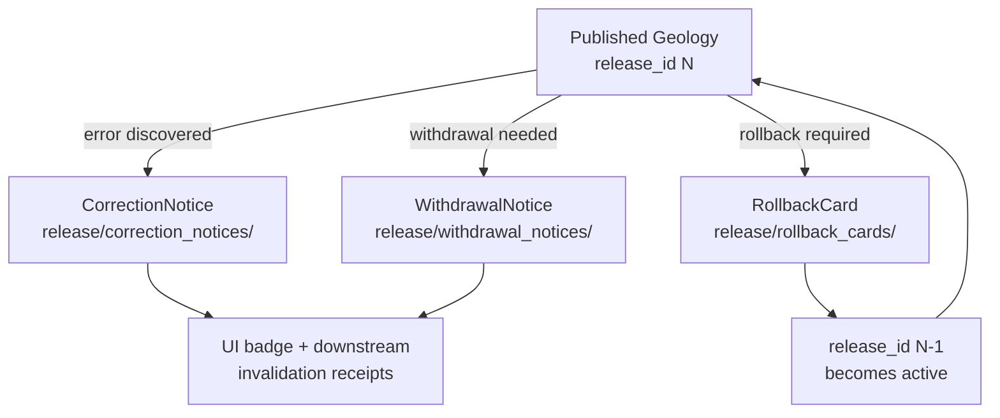

<!-- [KFM_META_BLOCK_V2]
doc_id: kfm://doc/geology-release-index
title: Geology and Natural Resources — Release Index
type: standard
version: v1
status: draft
owners: <geology-domain-steward> · <release-steward> · <docs-steward>   # placeholder — confirm in CODEOWNERS
created: 2026-05-17
updated: 2026-06-04
policy_label: public
related:
  - docs/domains/geology/README.md
  - docs/domains/geology/POLICY.md
  - docs/domains/geology/PRESERVATION_MATRIX.md
  - docs/domains/geology/OPEN_QUESTIONS.md
  - docs/doctrine/lifecycle-law.md
  - docs/doctrine/directory-rules.md
  - ai-build-operating-contract.md   # CONTRACT_VERSION = "3.0.0"
  - release/README.md
  - data/published/layers/geology/README.md
tags: [kfm, geology, release, lifecycle, governance]
notes:
  - Index doc only — not the release authority. ReleaseManifest objects live under release/manifests/.
  - Doctrine-adjacent; pins CONTRACT_VERSION = "3.0.0".
  - MapLibre ML-code citations corrected this revision: prior ML-058-0xx / ML-M-0xx codes were not present in the MapLibre master; real codes are ML-065-043 (rollback target), ML-066-061 / ML-067-040 (cache invalidation). See Citation key.
  - Implementation claims are PROPOSED until verified against a mounted repo.
[/KFM_META_BLOCK_V2] -->

<a id="top"></a>

# Geology and Natural Resources — Release Index

> Human-readable index of every release surface — candidates, manifests, promotion decisions, published layers, correction notices, withdrawal notices, rollback cards, and changelog entries — for the KFM **Geology and Natural Resources** domain.


<!-- TODO: replace with grounded badge URLs (CI, last-updated) once release tooling for geology is wired. -->

**Status:** `draft` · **Owners:** `<geology-domain-steward>`, `<release-steward>`, `<docs-steward>` · **Last updated:** `2026-06-04`

---

## Quick jump

- [1. Purpose & non-purpose](#1-purpose--non-purpose)
- [2. Repo fit](#2-repo-fit)
- [3. Release object families used by Geology](#3-release-object-families-used-by-geology)
- [4. Release surfaces map (where things live)](#4-release-surfaces-map-where-things-live)
- [5. Lifecycle flow for a Geology release](#5-lifecycle-flow-for-a-geology-release)
- [6. Release gates specific to Geology](#6-release-gates-specific-to-geology)
- [7. Sensitivity & rights posture for released Geology artifacts](#7-sensitivity--rights-posture-for-released-geology-artifacts)
- [8. Active release register (placeholder)](#8-active-release-register-placeholder)
- [9. Published layer inventory (placeholder)](#9-published-layer-inventory-placeholder)
- [10. Correction, withdrawal, and rollback path](#10-correction-withdrawal-and-rollback-path)
- [11. Reviewer separation of duties](#11-reviewer-separation-of-duties)
- [12. Open verification items](#12-open-verification-items)
- [13. Related docs](#13-related-docs)
- [Appendix A — Geology object families and release-time sensitivity defaults](#appendix-a--geology-object-families-and-release-time-sensitivity-defaults)
- [Appendix B — ReleaseManifest field expectations for Geology](#appendix-b--releasemanifest-field-expectations-for-geology)

---

<a id="1-purpose--non-purpose"></a>

## 1. Purpose & non-purpose

This file is a **navigable index** of the Geology domain's release surface — a single place a steward, reviewer, or downstream consumer can open to answer:

- What Geology releases are in flight, published, corrected, withdrawn, or rolled back?
- Where do the canonical decision artifacts live for each?
- Which gates must pass before a Geology candidate becomes a published artifact?
- What is the public-safe posture for each Geology object family at release time?

> [!IMPORTANT]
> **This document is documentation. It is not the release authority.**
> The authoritative release decision for any Geology artifact is the corresponding `ReleaseManifest` under `release/manifests/`, supported by its `PromotionDecision`, `EvidenceBundle`, `ValidationReport`, `PolicyDecision`, `ReviewRecord`, and `RollbackCard`. If this index ever disagrees with those artifacts, **the artifacts win** — and the drift is a `docs/registers/DRIFT_REGISTER.md` entry, not a license to update doctrine.

### What this doc does NOT cover

| Out of scope here | Where it lives |
|---|---|
| Geology domain identity, ubiquitous language, object scope | `docs/domains/geology/README.md` (see related docs) |
| Geology sensitivity tier rules in depth | `docs/domains/geology/POLICY.md` and `PRESERVATION_MATRIX.md` (see related docs) |
| Field-level schema shape of `ReleaseManifest`, etc. | `schemas/contracts/v1/release/` (per Directory Rules §6) |
| Cross-domain release doctrine | `docs/doctrine/lifecycle-law.md`, `release/README.md` |
| Per-source admission cadence | `docs/runbooks/<geology source refresh runbook>` |

[Back to top](#top)

---

<a id="2-repo-fit"></a>

## 2. Repo fit

Per **Directory Rules §12 (Domain Placement Law)** and **§6.1** [DIRRULES], the Geology domain MUST NOT be a root folder. Its surface is spread across responsibility roots; this index lives in the docs lane.

```text
docs/domains/geology/RELEASE_INDEX.md   ← this file (PROPOSED path; aligned with Domain Placement Law)
```

**Upstream of this doc** (sources of truth this index points at — all PROPOSED until repo evidence is mounted):

```text
release/manifests/<geology-release-id>.json          # the actual ReleaseManifest objects
release/candidates/geology/<candidate_id>/           # in-flight release candidate dossiers
release/promotion_decisions/<decision_id>.json       # PromotionDecision records
release/rollback_cards/<rollback_id>.json            # RollbackCard records
release/correction_notices/<notice_id>.json          # CorrectionNotice records
release/withdrawal_notices/<notice_id>.json          # withdrawal records
release/signatures/                                  # DSSE / Sigstore artifacts
release/changelog/                                   # release-level changelog
data/published/layers/geology/                       # released public-safe layer artifacts
data/proofs/evidence_bundle/<…>                      # supporting EvidenceBundles
data/catalog/domain/geology/                         # catalog records / closure
data/registry/sources/geology/                       # source descriptors (KGS, KCC, etc.)
```

**Downstream of this doc** (consumers of the Geology release surface):

```text
apps/governed-api/...        # serves released Geology layer + Evidence Drawer payloads
apps/explorer-web/...         # consumes governed-api; never reads data/published/ directly
docs/runbooks/...             # ops runbooks for geology refresh, rollback drills
docs/reports/...              # release / correction / drift reports
```

> [!NOTE]
> **Lane-path form (CONFLICTED).** The doctrinal slug used here is **`docs/domains/geology/`** (Directory Rules §6.1, §12 segment form) [DIRRULES]. A prior Encyclopedia draft section (`§7.8` of `kfm_encyclopedia.pdf`) lists a long-form `docs/domains/geology-and-natural-resources/`, and the Atlas §24.13 crosswalk uses *flat* lane paths (`policy/sensitivity/`, `schemas/contracts/v1/geology/`) rather than the `…/domains/geology/` segment form. These are defensible alternatives; this index uses the §12 segment form and flags the discrepancy in [§12](#12-open-verification-items) as ADR-class drift.

[Back to top](#top)

---

<a id="3-release-object-families-used-by-geology"></a>

## 3. Release object families used by Geology

CONFIRMED doctrine across the Encyclopedia, Domains Culmination Atlas (§24.2 Receipt Catalog), and Directory Rules [ENCY] [DIRRULES]:

| Object family | Role at release time | Canonical home (per Directory Rules) | Status for Geology |
|---|---|---|---|
| **`SourceDescriptor`** | Identifies each Geology source (e.g., KGS, KCC, USGS) with role, rights, sensitivity, citation. | `data/registry/sources/geology/` | CONFIRMED doctrine / PROPOSED implementation |
| **`EvidenceBundle` / `EvidenceRef`** | Bundles the support — sources, claims, citations, `spec_hash`, rights, sensitivity, limitations — that any Geology public claim resolves through. | `data/proofs/evidence_bundle/` | CONFIRMED doctrine / PROPOSED implementation |
| **`ValidationReport`** | Records validator outcomes for Geology objects (schema, geometry validity, source-role, resource-class, public-safe geometry, borehole/well-log rights, catalog closure, AI evidence-before-model). | `data/proofs/validation_report/` | CONFIRMED doctrine / PROPOSED implementation; validators are PROPOSED per Atlas §10.K |
| **`PolicyDecision`** | `ALLOW / RESTRICT / DENY / ABSTAIN / ERROR` verdict at promotion or runtime for a Geology candidate or query. | evaluated under `policy/` (segment-form `policy/domains/geology/` vs flat `policy/sensitivity/` is CONFLICTED — see §12) → emitted under `data/receipts/` | CONFIRMED doctrine / PROPOSED implementation |
| **`ReviewRecord`** | Human reviewer outcome where Geology release significance, sensitivity, or rights triggers review. | `data/receipts/` and/or `release/promotion_decisions/` | CONFIRMED doctrine / PROPOSED implementation |
| **`PromotionDecision`** | Governed state transition: `approved / denied / rollback_required`, with `review_outcome ∈ {ANSWER, ABSTAIN, DENY, ERROR}`. | `release/promotion_decisions/` | CONFIRMED doctrine / PROPOSED implementation |
| **`ReleaseManifest`** | Binds released Geology artifacts to digests, evidence refs, rollback target, signatures, time. | `release/manifests/` | CONFIRMED doctrine / PROPOSED implementation |
| **`LayerManifest` / `TileArtifactManifest` / `StyleManifest`** | Map-side release artifacts for Geology layers (bedrock, surficial, structures, cross-sections, generalized boreholes/resources). | per `schemas/contracts/v1/map/...`; artifacts live in `data/published/layers/geology/` | CONFIRMED doctrine / PROPOSED implementation |
| **`CorrectionNotice`** | Public correction record for a previously released Geology claim. | `release/correction_notices/` | CONFIRMED doctrine / PROPOSED implementation |
| **`RollbackCard`** | Rollback decision and target prior release for a Geology release. | `release/rollback_cards/` | CONFIRMED doctrine / PROPOSED implementation |
| **Withdrawal notice** | Records a withdrawn (not corrected) Geology release. | `release/withdrawal_notices/` | CONFIRMED doctrine / PROPOSED implementation |
| **`RealityBoundaryNote`** | For Geology, attaches to **3D / cross-section / synthetic-surface** carriers to flag reconstruction vs direct evidence. | per `release/` or `data/published/`, scoped to artifact | CONFIRMED doctrine / PROPOSED implementation |

> [!TIP]
> **Do not collapse these into one "release blob."** Per repeated KFM doctrine, `RunReceipt`, `PromotionDecision`, `ReleaseManifest`, and `CorrectionNotice` are **separate governed object families** — that separation is what makes partial revocation, replay, and audit reconstruction possible later.

[Back to top](#top)

---

<a id="4-release-surfaces-map-where-things-live"></a>

## 4. Release surfaces map (where things live)

> [!WARNING]
> **`data/published/` ≠ `release/`.** `data/published/layers/geology/` owns the released **artifacts** consumers read (e.g., PMTiles, GeoJSON, GeoParquet sidecars). `release/` owns the release **decisions** (manifest, proof closure, rollback/correction path, signatures). Mixing them is one of the documented drift patterns (Directory Rules §13.2) [DIRRULES].

| Surface | Path (PROPOSED until mounted-repo confirms) | Owns | Consumed by |
|---|---|---|---|
| Geology release candidates | `release/candidates/geology/` | Dossier per candidate: linked sources, evidence, validation report, policy outcome, review state, intended artifacts. | Reviewers; promotion gate; this index. |
| Geology release manifests | `release/manifests/` (filtered by `domain: geology`) | Canonical `ReleaseManifest` per `release_id`: artifacts[], digests, evidence_refs, rollback_target, time. | Public consumers via governed API; rollback tooling; this index. |
| Geology promotion decisions | `release/promotion_decisions/` (filtered by domain) | `PromotionDecision` per candidate: gate outcomes, reviewer, rollback target, reasons. | Audit; this index. |
| Geology rollback cards | `release/rollback_cards/` (filtered by domain) | `RollbackCard`: release_id, rollback_to, reason, invalidates[], review_ref, time. | Rollback drills; correction lineage; this index. |
| Geology correction notices | `release/correction_notices/` (filtered by domain) | `CorrectionNotice`: claim_ref, prior_release_ref, change_summary, invalidates[], review_ref. | Public UI badges; downstream invalidation; this index. |
| Geology withdrawal notices | `release/withdrawal_notices/` (filtered by domain) | Withdrawn release records. | Public UI badges; rollback lineage. |
| Geology release signatures | `release/signatures/` | DSSE / Sigstore / cosign artifacts and Rekor UUIDs for Geology releases. | Verification tooling. |
| Geology changelog entries | `release/changelog/` | Release-level changelog rows mentioning Geology releases. | Humans; release announcements. |
| Geology published layers | `data/published/layers/geology/` | PMTiles, GeoJSON, GeoParquet, COG sidecars per layer; per-layer `LayerManifest` and `TileArtifactManifest`. | `apps/governed-api/`; tile/CDN delivery. |
| Geology catalog closure | `data/catalog/domain/geology/` | STAC / DCAT / PROV records that gate Catalog Closure for a candidate. | Catalog Closure validator; release gate. |
| Geology source registry | `data/registry/sources/geology/` | Append-only `SourceDescriptor` records for KGS, KCC, USGS, etc. | All upstream stages; source-role checks. |

[Back to top](#top)

---

<a id="5-lifecycle-flow-for-a-geology-release"></a>

## 5. Lifecycle flow for a Geology release

The flow below is the **doctrinal** path. Implementation maturity per stage is PROPOSED until repo evidence is mounted.

```mermaid
flowchart LR
  subgraph SRC["Geology sources"]
    KGS["KGS / USGS / KCC<br/>(NEEDS VERIFICATION:<br/>source descriptors)"]
  end

  subgraph LIFECYCLE["Lifecycle invariant (Directory Rules §9.1)"]
    RAW["RAW<br/>raw/geology/<br/>immutable capture<br/>+ SourceDescriptor"]
    WORK["WORK / QUARANTINE<br/>work/geology/<br/>quarantine/geology/"]
    PROC["PROCESSED<br/>processed/geology/<br/>+ ValidationReport<br/>+ EvidenceRef"]
    CAT["CATALOG / TRIPLET<br/>catalog/domain/geology/<br/>+ EvidenceBundle<br/>+ release candidate"]
    PUB["PUBLISHED<br/>data/published/layers/geology/<br/>(public-safe artifacts)"]
  end

  subgraph RELEASE["Release decision plane (release/)"]
    CAND["release/candidates/geology/<br/>candidate dossier"]
    POL["PolicyDecision<br/>(deny-by-default for<br/>unclear rights /<br/>sensitive geometry)"]
    REV["ReviewRecord<br/>(steward separation<br/>of duties)"]
    PROM["PromotionDecision<br/>approved / denied /<br/>rollback_required"]
    MAN["ReleaseManifest<br/>release/manifests/"]
    SIG["DSSE / cosign /<br/>Rekor signatures"]
    ROLL["RollbackCard /<br/>CorrectionNotice /<br/>WithdrawalNotice"]
  end

  KGS --> RAW --> WORK --> PROC --> CAT
  CAT --> CAND
  CAND --> POL --> REV --> PROM
  PROM -- "approved" --> MAN --> SIG --> PUB
  PROM -- "denied" --> WORK
  PUB -. "correction / rollback / withdrawal" .-> ROLL
  ROLL -. "invalidates derivatives" .-> PUB
```



> [!NOTE]
> The diagram is **CONFIRMED doctrine** for the staging, gates, and object families. **PROPOSED implementation** for any wiring details (validators, CI workflows, CDN delivery, signature backend). Verify against a mounted repo before quoting any wiring claim from this diagram.

[Back to top](#top)

---

<a id="6-release-gates-specific-to-geology"></a>

## 6. Release gates specific to Geology

Geology inherits the **cross-domain release gates** (validation, policy, evidence closure, catalog closure, manifest, signing, rollback target) and adds **domain-specific** ones drawn from Atlas Ch. 10 §I–§K [DOM-GEOL] [ENCY]. All listed validators/tests are CONFIRMED doctrine / PROPOSED implementation.

### 6.1 Cross-domain gates (applied to every Geology release)

```text
[ ] Source closure         — every input has a resolvable SourceDescriptor (role, rights, sensitivity, citation, time, hash).
[ ] Schema validation      — schema/contracts/v1/... validators pass on every released object.
[ ] Geometry validity      — geometry valid; no over-precise public geometry for sensitive object families.
[ ] Evidence closure       — every released claim resolves to an EvidenceBundle.
[ ] Catalog closure        — STAC/DCAT/PROV records resolve; no orphan artifacts.
[ ] Policy decision         — PolicyDecision = ALLOW (deny-by-default otherwise).
[ ] Review state            — ReviewRecord present where release significance or sensitivity triggers review.
[ ] Manifest closure        — ReleaseManifest references all artifacts; digests match; rollback_target set.
[ ] Signature / attestation — DSSE / cosign; Rekor UUID recorded back in the manifest.
[ ] Rollback drill          — RollbackCard exists and replay verification passes for the target.
[ ] Correction path         — public correction route is documented and reachable.
```

### 6.2 Geology-specific gates (PROPOSED test surface; Atlas §10.K) [DOM-GEOL]

```text
[ ] Source-role anti-collapse        — KGS / KCC / USGS / model / interpretation source roles cannot be flattened.
[ ] Resource-class anti-collapse     — Occurrence / Deposit / Estimate / Permit / Production / Reserve remain distinct.
[ ] Public-safe geometry             — Exact borehole, sample, sensitive resource, well-log, and private well locations default to restricted or generalized.
[ ] Borehole / well-log rights       — Rights / sensitivity resolved before any subsurface point is publicly released.
[ ] Catalog closure (geology slice)  — STAC/DCAT/PROV for every released Geology layer and bundle.
[ ] AI evidence-before-model         — Focus Mode / Evidence Drawer denies model-only synthesis on Geology claims.
[ ] 3D / cross-section admission     — RealityBoundaryNote present for synthetic surfaces, reconstructed scenes, or interpretation-heavy cross-sections (per ADR-S-07; OPEN).
```

> [!CAUTION]
> Unclear rights, unresolved source role, missing evidence, unresolved sensitivity, or absent release state **block public promotion**. This is **doctrine, not preference** [ENCY] [DIRRULES]. A Geology candidate that fails any of the gates above MUST NOT acquire `published` status by any mechanism — including file move, alias swap, or "ops fix." Disposition for sensitive geology objects routes through `ai-build-operating-contract.md §23.2`.

<details>
<summary>Expanded gate detail — failure-mode register for Geology releases</summary>

| Failure mode | Symptom at gate | Required outcome |
|---|---|---|
| Borehole point released with exact private-well coordinates | Public-safe geometry validator | `DENY` at PolicyDecision; quarantine the candidate; emit `RedactionReceipt` if generalization is attempted. |
| Model-inferred mineral occurrence presented as confirmed deposit | Resource-class anti-collapse | `DENY`; require separate `Occurrence` / `Estimate` / `Reserve` classification per source role. |
| Interpretation-heavy cross-section released without `RealityBoundaryNote` | 3D / cross-section admission | `DENY` or `RESTRICT` pending steward review; promotion held. |
| Geology layer with unresolved KGS / KCC rights | Source rights validator | `DENY`; rights resolved or restricted release path only. |
| `ReleaseManifest` missing `rollback_target` | Manifest closure | `DENY`; release fails closed. Release test denies missing `rollback_target` (MapLibre ML-065-043) [DIRRULES] [MAP-MASTER]. |
| `EvidenceRef` does not resolve to a complete `EvidenceBundle` | Evidence closure | `DENY` or `ABSTAIN`; promotion held until bundle is complete. |
| Stale upstream KGS feed referenced as fresh | Stale-state validator | Stale-state badge required on any derivative; release MAY proceed only with explicit stale label. |

</details>

[Back to top](#top)

---

<a id="7-sensitivity--rights-posture-for-released-geology-artifacts"></a>

## 7. Sensitivity & rights posture for released Geology artifacts

CONFIRMED doctrine: Geology's sensitivity posture defaults to **restricted or generalized** for exact subsurface and resource detail; aggregate and unit-level public geometry are routine [DOM-GEOL] [ENCY]. Tier values below are PROPOSED (per Atlas §24.5, T0–T4 scheme) and subject to ADR-S-05 — **except** the two rows grounded in Atlas §24.14, marked **CONFIRMED default**.

| Object family | Public-default sensitivity | Release-time rule |
|---|---|---|
| `GeologicUnit`, `Lithology`, `StratigraphicInterval`, `GeologicAge` | T0 (aggregate / unit polygon) — **`GeologicUnit`/`Lithology` CONFIRMED default per §24.14** | Public-safe by default; cite source and version. |
| `FaultStructure`, `CrossSection` (interpretation-bounded) | T0 / T1 depending on uncertainty surface (PROPOSED) | Public; `RealityBoundaryNote` for reconstruction-heavy cross-sections. |
| `Borehole`, `WellLog`, `CoreSample`, `GeochemistrySample` | **T2 / T4 default** for exact location (PROPOSED) | DENY exact coordinates by default; allow only generalized geometry with steward review. |
| `GeophysicalObservation` (raster / volumes) | T0 / T1 (PROPOSED) | Public for unit-scale; finer detail per source rights. |
| `MineralOccurrence` | **T0 aggregate / T2 detail — CONFIRMED default per §24.14** | Keep `Occurrence` distinct from `Deposit` / `Estimate` / `Reserve`. |
| `ResourceDeposit`, `ResourceEstimate` | **T0 aggregate / T2 detail — CONFIRMED default per §24.14 (`MineralOccurrence/ResourceEstimate` row)** | DENY field-level economic-significance claims without explicit rights. |
| `ExtractionSite`, `ReclamationRecord` | T0 / T1 (PROPOSED) | Public-safe for status; private operator/permit detail held back. |
| `HydrostratigraphicUnit` | T0 (PROPOSED) | Public; cross-links to Hydrology domain per Atlas §2.2 [ENCY]. |

> [!IMPORTANT]
> **Borehole / well-log / sensitive resource public policy is NEEDS VERIFICATION** [DOM-GEOL] Atlas §10.N. This index uses the doctrinal default (deny-by-default for exact location) until the policy is resolved and recorded in `policy/domains/geology/` (or flat `policy/sensitivity/` per the §12 path conflict) plus an ADR.

[Back to top](#top)

---

<a id="8-active-release-register-placeholder"></a>

## 8. Active release register (placeholder)

This section is the **operational table** for in-flight and recently published Geology releases. The rows below are **placeholders**; populate from `release/manifests/`, `release/candidates/geology/`, and `release/promotion_decisions/` when the repo is mounted.

| `release_id` | Candidate dossier | State | `PromotionDecision` | Layers in scope | Evidence bundle ref | Signed | Rollback target | Notes |
|---|---|---|---|---|---|---|---|---|
| `<TODO geol-YYYYMMDD-NN>` | `release/candidates/geology/<…>/` | `candidate` \| `approved` \| `published` \| `rolled_back` \| `withdrawn` | `<TODO>` | `<bedrock \| surficial \| structures \| cross-section \| …>` | `<bundle_id>` | `<sig_status>` | `<prior release_id>` | `NEEDS VERIFICATION` |
| `<TODO>` | `<TODO>` | `<TODO>` | `<TODO>` | `<TODO>` | `<TODO>` | `<TODO>` | `<TODO>` | `<TODO>` |
| `<TODO>` | `<TODO>` | `<TODO>` | `<TODO>` | `<TODO>` | `<TODO>` | `<TODO>` | `<TODO>` | `<TODO>` |

> [!NOTE]
> Rows MUST be sourced from the canonical artifacts under `release/`. If a row here ever drifts from the underlying `ReleaseManifest`, the artifact wins and the row is rewritten — not the manifest.

[Back to top](#top)

---

<a id="9-published-layer-inventory-placeholder"></a>

## 9. Published layer inventory (placeholder)

This section lists the released, public-safe Geology layers visible through `apps/governed-api/`. Populate from `data/published/layers/geology/` and the layer manifests indexed there.

| Layer id | Layer title | Geometry | Source(s) | `LayerManifest` | `TileArtifactManifest` | Current `release_id` | Sensitivity (PROPOSED) | Notes |
|---|---|---|---|---|---|---|---|---|
| `<TODO geol-bedrock>` | Bedrock geology (unit polygons) | polygon | KGS / USGS | `<…/layer_manifest.json>` | `<…/tile_artifact_manifest.json>` | `<release_id>` | T0 | aggregate / unit only |
| `<TODO geol-surficial>` | Surficial geology | polygon | KGS / USGS | `<…>` | `<…>` | `<…>` | T0 | — |
| `<TODO geol-structures>` | Faults & folds (structures) | line | KGS / USGS | `<…>` | `<…>` | `<…>` | T0 / T1 | — |
| `<TODO geol-boreholes-public-safe>` | Boreholes (generalized public-safe) | point (generalized) | KGS borehole repository | `<…>` | `<…>` | `<…>` | T2 (generalized only) | exact locations DENIED by default |
| `<TODO geol-cross-section>` | Cross-sections | line + sidecar | KGS / interpretation | `<…>` | `<…>` | `<…>` | T0 / T1 | `RealityBoundaryNote` required for interpretation-heavy sections |
| `<TODO geol-resources-aggregate>` | Mineral occurrences (aggregate) | point / polygon | KGS / USGS | `<…>` | `<…>` | `<…>` | T0 aggregate | `Occurrence` only — not `Deposit` / `Reserve` |

> [!TIP]
> Each row should have a one-line note about which **`Geology cross-section`** or **`3D/terrain/scene`** viewing mode (per the Master Viewing Mode Atlas, Encyclopedia §11) it powers [ENCY]. That binding is what makes "release_id → layer_id → viewing_mode" auditable end-to-end.

[Back to top](#top)

---

<a id="10-correction-withdrawal-and-rollback-path"></a>

## 10. Correction, withdrawal, and rollback path



| Path | Trigger | Required artifact(s) | Effect |
|---|---|---|---|
| **Correction** | Released Geology claim is wrong (e.g., wrong unit assignment) | `CorrectionNotice` + updated `EvidenceBundle` | Public UI surfaces the correction badge; downstream derivatives invalidated. |
| **Withdrawal** | Release should not have happened (e.g., rights resolution failure post-publication) | `WithdrawalNotice` | Layer becomes unavailable through governed API; lineage preserved. |
| **Rollback** | A previously-released `release_id` should be restored | `RollbackCard` + replay verification | Prior `release_id` becomes active; current `release_id` lineage retained, not deleted. |

> [!CAUTION]
> **Rollback is required to be drilled** — an untested rollback is not a rollback. The MapLibre master (ML-065-043, Ch. U) requires that each release candidate identify its rollback target and that the release test deny a missing `rollback_target`; Directory Rules §9.2 requires a rollback target before promotion. This applies to Geology cross-section, bedrock, and resource layers as much as to any other geo-bearing carrier [MAP-MASTER] [DIRRULES].

[Back to top](#top)

---

<a id="11-reviewer-separation-of-duties"></a>

## 11. Reviewer separation of duties

Pending **ADR-S-09** (reviewer role separation; OPEN), Geology releases SHOULD enforce separation between:

| Role | Responsibility | MUST NOT also be |
|---|---|---|
| Source steward | Curates `SourceDescriptor` for KGS / KCC / USGS | Sole approver of releases that depend on that source |
| Domain steward | Confirms domain semantics, anti-collapse, sensitivity posture for Geology | Sole approver of the `PromotionDecision` for the same candidate |
| Release steward | Owns `ReleaseManifest`, `RollbackCard`, signing, changelog | Sole submitter of the candidate dossier |
| Sensitivity reviewer | Reviews borehole / well-log / resource public-safety | Sole policy author for the same artifact |

This table is **PROPOSED** until ADR-S-09 lands and `docs/governance/` records the threshold at which tooling enforces separation versus custom. Until then, document the reviewer chain explicitly in each `PromotionDecision`.

[Back to top](#top)

---

<a id="12-open-verification-items"></a>

## 12. Open verification items

This register tracks Geology-release-specific items pending mounted-repo verification or ADR resolution. Mirror to `docs/registers/VERIFICATION_BACKLOG.md` when added there.

| Item | Status | Evidence that would settle it | Atlas / doctrine pointer |
|---|---|---|---|
| Confirm KGS and KCC `SourceDescriptor` records exist and pass schema validation. | **NEEDS VERIFICATION** | `data/registry/sources/geology/` + validator output | Atlas §10.N |
| Confirm borehole / well-log public release policy. | **NEEDS VERIFICATION** | `policy/domains/geology/` (or `policy/sensitivity/`) + ADR | Atlas §10.I, §10.N |
| Define resource classification scheme (`Occurrence` / `Deposit` / `Estimate` / `Reserve` / `Production`) and matching anti-collapse tests. | **NEEDS VERIFICATION** | `schemas/contracts/v1/domains/geology/` + `tests/domains/geology/` | Atlas §10.K |
| Confirm Geology governed-API surface, MapLibre layer wiring, and Evidence Drawer payload integration. | **NEEDS VERIFICATION** | `apps/governed-api/` route registry + `schemas/contracts/v1/map/` | Atlas §10.J |
| **Resolve object-family naming drift**: §10.B short forms (`Borehole`) vs §10.E `…Reference` forms; `Resource Deposit` (§B) vs `ResourceEstimate` (§C/§24.14). | **CONFLICTED** | ADR or schema PR fixing one canonical family-name set | Atlas §10.B / §10.E / §24.14 |
| **Resolve lane-path form**: `docs/domains/geology/` + `policy/domains/geology/` (§12 segment) vs `docs/domains/geology-and-natural-resources/` (ENCY §7.8) vs Atlas §24.13 flat (`policy/sensitivity/`, `schemas/contracts/v1/geology/`). | **CONFLICTED** | Drift register entry + ADR | DIRRULES §6.1, §12; ENCY §7.8; Atlas §24.13 |
| Resolve `release_index` placement: keep as `RELEASE_INDEX.md` here, or also mirror as machine-readable register under `control_plane/`. | **OPEN** | ADR | DIRRULES §6.2 |
| Resolve 3D / cross-section admission policy and `RealityBoundaryNote` minimum receipts. | **OPEN** | ADR-S-07 | Atlas §24.12 |
| Resolve sensitivity tier scheme (T0–T4) adoption for Geology. | **OPEN** | ADR-S-05 | Atlas §24.5 |
| Confirm Geology validators (source-role, resource-class, public-safe geometry, borehole/well-log rights, catalog closure, AI evidence-before-model). | **PROPOSED** | `tools/validators/geology/` + `tests/domains/geology/` | Atlas §10.K |
| Confirm Geology rollback drill exists and replays prior `release_id`. | **NEEDS VERIFICATION** | `tests/domains/geology/rollback/` + receipt | DIRRULES §9.2; MapLibre ML-065-043 |

[Back to top](#top)

---

<a id="13-related-docs"></a>

## 13. Related docs

> [!NOTE]
> Targets below are **PROPOSED relative paths** aligned with Directory Rules §6.1 and §12. Confirm presence in the mounted repo before linking from external surfaces; replace with permalinks for pinning when stable.

- `docs/domains/geology/README.md` — Geology domain scope, ubiquitous language, object families.
- `docs/domains/geology/POLICY.md` — Geology policy & sensitivity posture (states intent; enforcement in `policy/`).
- `docs/domains/geology/PRESERVATION_MATRIX.md` — Per-object-family preservation, tier, transform, release rules.
- `docs/domains/geology/OPEN_QUESTIONS.md` — Geology open-questions register (`OQ-GEOL-NN`).
- `docs/doctrine/lifecycle-law.md` — `RAW → WORK / QUARANTINE → PROCESSED → CATALOG / TRIPLET → PUBLISHED`.
- `docs/doctrine/directory-rules.md` — §6.1 (`docs/`), §9.1 (`data/`), §9.2 (`release/`), §12 (Domain Placement Law), §13 (anti-patterns).
- `ai-build-operating-contract.md` — operating law, §23.2 sensitive-domain matrix (`CONTRACT_VERSION = "3.0.0"`).
- `release/README.md` — Cross-domain release decisions root.
- `data/published/layers/geology/README.md` — Released Geology layer artifacts.
- `docs/standards/PROV.md` — Provenance profile underpinning `EvidenceBundle`/`EvidenceRef`.
- `docs/standards/PMTILES.md` — PMTiles governance for delivered Geology layers.
- `docs/standards/OGC-API-TILES.md` — OGC API — Tiles delivery for Geology layers.
- `docs/registers/DRIFT_REGISTER.md` — Track Geology release drift between this index and canonical artifacts.
- `docs/registers/VERIFICATION_BACKLOG.md` — Cross-doc verification queue.
- Atlas Ch. 10 (`KFM_Domains_Culmination_Atlas_v1_1.pdf`, §I–§N) — Geology domain doctrine baseline.

[Back to top](#top)

---

<a id="appendix-a--geology-object-families-and-release-time-sensitivity-defaults"></a>

## Appendix A — Geology object families and release-time sensitivity defaults

<details>
<summary>Expand: Atlas Ch. 10 §B object scope mapped to release-time defaults</summary>

Drawn from Atlas Ch. 10 §B (object scope) and §I (sensitivity, rights, publication posture) [DOM-GEOL] [ENCY]. Sensitivity tier values are **PROPOSED** pending ADR-S-05, except the §24.14-grounded rows (marked **CONFIRMED default**).

> [!NOTE]
> **Object-family naming drift (CONFLICTED).** The names below use the §10.B short conceptual forms. The §10.E "Main object families" table uses `…Reference` and variant forms (`BoreholeReference`, `Well LogReference`, `GeochemistrySampleReference`, `SurficialUnit`, `StructureFeature`, `GeologyBoundaryVersion`). The canonical set is unresolved — see [§12](#12-open-verification-items).

| Object family | Geometry typically released publicly | Default sensitivity | Anti-collapse partner(s) | Notes |
|---|---|---|---|---|
| `GeologicUnit` | unit polygon | **T0 (CONFIRMED — §24.14)** | `Lithology`, `StratigraphicInterval`, `GeologicAge` | unit ≠ lithology; preserve distinct fields. |
| `Lithology` | inherits unit | **T0 (CONFIRMED — §24.14)** | `GeologicUnit` | — |
| `StratigraphicInterval` | column / cross-section span | T0 (PROPOSED) | `GeologicAge` | — |
| `GeologicAge` | annotation | T0 (PROPOSED) | `StratigraphicInterval` | — |
| `FaultStructure` (§E `StructureFeature`) | line | T0 / T1 (PROPOSED) | — | uncertainty surface where applicable. |
| `Borehole` (§E `BoreholeReference`) | **generalized** point (default) | **T2 / T4 (PROPOSED)** | `WellLog`, `CoreSample` | exact location DENY by default. |
| `WellLog` (§E `Well LogReference`) | sidecar to borehole | **T2 / T4 (PROPOSED)** | `Borehole`, `CoreSample` | rights resolution prerequisite. |
| `CoreSample` | sidecar to borehole | T2 / T4 (PROPOSED) | `Borehole`, `WellLog` | — |
| `GeophysicalObservation` | raster / volume | T0 / T1 (PROPOSED) | — | scale / support must be validated. |
| `GeochemistrySample` (§E `GeochemistrySampleReference`) | generalized point | T2 / T4 (PROPOSED) | — | rights and laboratory chain. |
| `MineralOccurrence` | point / polygon (aggregate) | **T0 aggregate; T2 detail (CONFIRMED — §24.14)** | `ResourceDeposit`, `ResourceEstimate` | distinct from `Deposit` / `Estimate`. |
| `ResourceDeposit` / `ResourceEstimate` | polygon / aggregate | **T0 aggregate; T2 detail (CONFIRMED — §24.14)** | `MineralOccurrence` | `Resource Deposit` (§B) vs `ResourceEstimate` (§C/§24.14) name drift — see §12. |
| `ExtractionSite` | site polygon | T0 / T1 (PROPOSED) | `ReclamationRecord` | private operator detail held back. |
| `ReclamationRecord` | site polygon | T0 / T1 (PROPOSED) | `ExtractionSite` | — |
| `CrossSection` | line + interpretation sidecar | T0 / T1 (PROPOSED) | `GeologicUnit`, `StratigraphicInterval` | `RealityBoundaryNote` for reconstruction-heavy. |
| `HydrostratigraphicUnit` | polygon / column | T0 (PROPOSED) | `GeologicUnit` (geol) ↔ aquifer/aquitard (hydro) | cross-links to Hydrology per Atlas §2.2. |

</details>

[Back to top](#top)

---

<a id="appendix-b--releasemanifest-field-expectations-for-geology"></a>

## Appendix B — `ReleaseManifest` field expectations for Geology

<details>
<summary>Expand: Geology-side expectations for the canonical <code>ReleaseManifest</code> shape</summary>

Drawn from Atlas §24.2 (Receipt Catalog), Directory Rules §19 (Glossary), and the MapLibre master Ch. M (LayerManifest / TileArtifactManifest / MapReleaseManifest) and Ch. U (Testing, CI, Validation, Rollback, Proof Objects) [ENCY] [DIRRULES] [MAP-MASTER]. **All field-level shape is normative in `schemas/contracts/v1/release/release_manifest.schema.json` (PROPOSED path) — this is a documentation expectation only.**

| Field | Geology-specific expectation | Truth label |
|---|---|---|
| `release_id` | Stable, dereferenceable; appears in the changelog row and in this index. | CONFIRMED doctrine |
| `domain` | `geology` (matches the Directory Rules canonical slug). | CONFIRMED doctrine |
| `artifacts[]` | Includes layer artifacts (PMTiles, GeoJSON, GeoParquet, COG sidecar), `LayerManifest`, `TileArtifactManifest`, and any cross-section / 3D sidecar; each with `digest`. | CONFIRMED doctrine / PROPOSED enum coverage |
| `evidence_refs[]` | Resolves to one or more `EvidenceBundle`s under `data/proofs/evidence_bundle/`. | CONFIRMED doctrine |
| `spec_hash` | Carried through; emitted via canonical JSON of the manifest frontmatter (MapLibre master: `spec_hash` PROPOSED via canonical-JSON emission). | CONFIRMED doctrine / PROPOSED canonicalization detail |
| `published_at` | UTC timestamp. | CONFIRMED doctrine |
| `rollback_target` | Prior `release_id` for this domain/layer set; release test denies a missing target (MapLibre ML-065-043). | CONFIRMED doctrine |
| `policy_decision_ref` | Reference to the `PolicyDecision` that approved this release (MapLibre ML-067-030: manifest points to policy decisions with ids/timestamps). | PROPOSED |
| `review_ref` | Reference to the `ReviewRecord` chain that signed off. | PROPOSED |
| `signatures[]` | DSSE / cosign / Rekor UUID block. | CONFIRMED doctrine |
| `supersedes[]` | Prior `release_id`(s) this release replaces. | CONFIRMED doctrine |
| `reality_boundary_notes[]` | Required for 3D / interpretation-heavy cross-section artifacts. | PROPOSED |
| `cache_keys[]` | For tile / CDN invalidation; cache-invalidation record is itself release proof (MapLibre ML-066-061 / ML-067-040). | PROPOSED |

</details>

[Back to top](#top)

---

## Citation key

- **[DOM-GEOL]** — `KFM_Domains_Culmination_Atlas_v1_1.pdf`, Ch. 10 (Geology and Natural Resources), §B / §I / §J / §K / §N; §24.5 (tier scheme); §24.14 (object-family × domain matrix).
- **[ENCY]** — `kfm_encyclopedia.pdf`, §7.8 (Geology and Natural Resources) and §11 (Master Viewing Mode Atlas).
- **[DIRRULES]** — `directory-rules.md`, §6.1 (`docs/`), §6.2 (`control_plane/`), §9.1 (`data/`), §9.2 (`release/`), §12 (Domain Placement Law), §13 (anti-patterns), §15 (Required README contract).
- **[MAP-MASTER]** — `Master MapLibre Components-Functions-Features v2.1`, Ch. M (LayerManifest, StyleManifest, TileArtifactManifest, MapReleaseManifest) and Ch. U (Testing, CI, Validation, Rollback, and Proof Objects). Specific codes referenced: **ML-065-043** (rollback target / release test denies missing `rollback_target`), **ML-066-061** and **ML-067-040** (cache-invalidation record is release proof), **ML-067-030** (manifest references PolicyDecision ids).
- **[BUILD-MANUAL]** — `KFM_Unified_Implementation_Architecture_Build_Manual.md`, §10.8 (Geology and natural resources): coverage, risks, public posture.

> [!NOTE]
> **Citation correction (v1 revision).** A prior draft cited MapLibre codes `ML-058-043`, `ML-058-044`, `ML-058-045`, `ML-M-046`, and `ML-M-105`. Those identifiers are **not present** in the MapLibre master, which uses the `ML-065-*` / `ML-066-*` / `ML-067-*` scheme. The underlying doctrine (rollback target required, cache-invalidation-as-proof, canonical-JSON `spec_hash`) is real and has been re-pointed to the actual codes above. The "`spec_hash` excludes itself from canonicalization" claim was unsupported in the master and has been softened to the supported canonical-JSON-emission statement.

---

<div align="center">

**Related docs:** [README](./README.md) · [POLICY](./POLICY.md) · [Lifecycle law](../../doctrine/lifecycle-law.md) · [Directory Rules](../../doctrine/directory-rules.md) · [release/](../../../release/README.md)

**Last updated:** 2026-06-04 · **Doc version:** v1 (draft) · `CONTRACT_VERSION = "3.0.0"`

[Back to top](#top)

</div>
