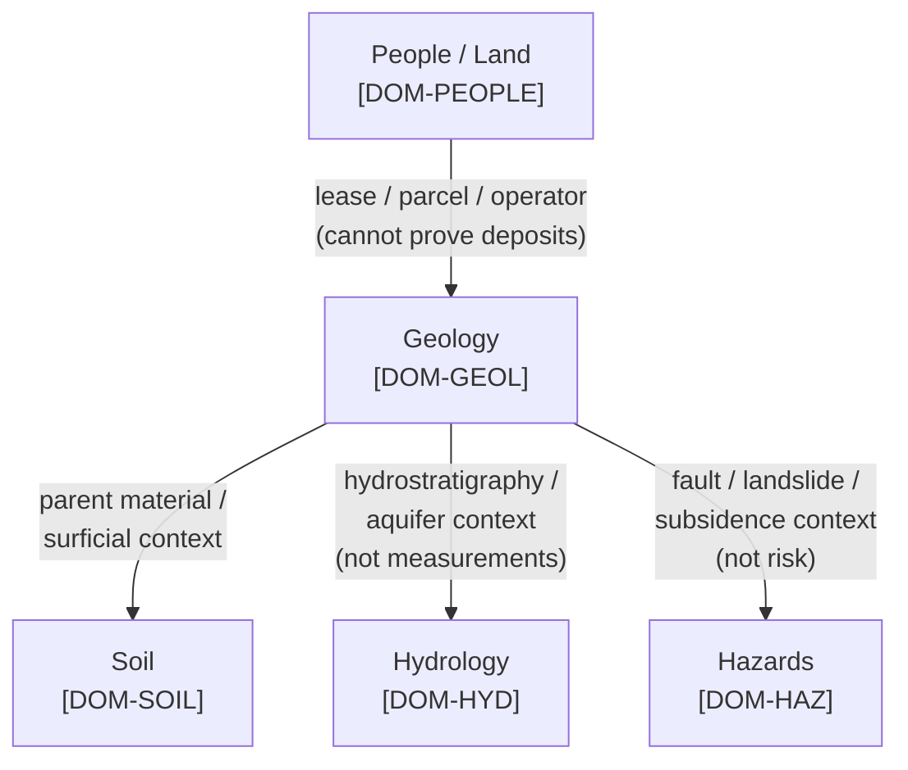
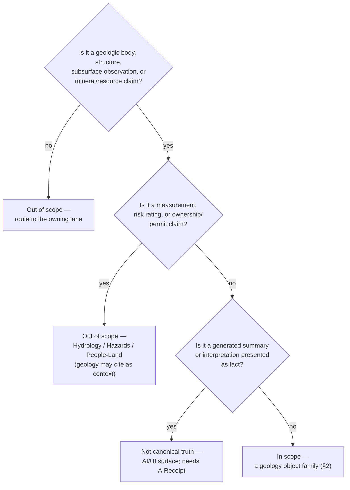

<!-- [KFM_META_BLOCK_V2]
doc_id: kfm://doc/geology-scope
title: Geology and Natural Resources — Domain Scope & Boundary
type: standard
version: v1
status: draft
owners: <geology-domain-steward> · <docs-steward>   # placeholder — confirm in CODEOWNERS
created: 2026-06-04
updated: 2026-06-04
policy_label: public
related:
  - docs/domains/geology/README.md
  - docs/domains/geology/POLICY.md
  - docs/domains/geology/PRESERVATION_MATRIX.md
  - docs/domains/geology/OPEN_QUESTIONS.md
  - docs/domains/geology/RELEASE_INDEX.md
  - docs/doctrine/directory-rules.md
  - ai-build-operating-contract.md   # CONTRACT_VERSION = "3.0.0"
tags: [kfm, geology, scope, bounded-context, governance]
notes:
  - Bounded-context boundary doc for the geology lane. Authoritative owns/does-not-own line is DOM-GEOL §10.B.
  - Doctrine-adjacent; pins CONTRACT_VERSION = "3.0.0".
  - Object-family naming drift in the corpus (§10.B short forms vs §10.E Reference forms; Resource Deposit vs ResourceEstimate) is surfaced as CONFLICTED, not resolved here.
  - All repo-shaped paths PROPOSED pending mounted-repo and ADR verification.
[/KFM_META_BLOCK_V2] -->

# Geology and Natural Resources — Domain Scope & Boundary

> The bounded-context definition for the geology lane (`[DOM-GEOL]`): what this domain **owns**, what it **explicitly does not own**, and where each boundary edge hands off to a neighbor. This doc fixes the line; the README orients, POLICY governs sensitivity, and PRESERVATION_MATRIX governs per-family rules.

| Field | Value |
|---|---|
| **Status** | `draft` |
| **Owners** | `<geology-domain-steward>` · `<docs-steward>` *(placeholders — confirm in CODEOWNERS)* |
| **Authority** | Subordinate to `ai-build-operating-contract.md` (`CONTRACT_VERSION = "3.0.0"`); boundary is `DOM-GEOL §10.B` |
| **Lane** | Geology / Natural Resources — `[DOM-GEOL]`, Atlas Ch. 10 |
| **Updated** | 2026-06-04 |

> [!IMPORTANT]
> The **authoritative owns / does-not-own statement is `DOM-GEOL §10.B`**. This document restates that boundary and adds the per-edge handoff detail; where this page and the dossier disagree, the dossier prevails and the conflict is logged in `docs/registers/DRIFT_REGISTER.md`.

---

## Contents

- [1. Domain identity](#1-domain-identity)
- [2. What this domain owns](#2-what-this-domain-owns)
- [3. What this domain explicitly does NOT own](#3-what-this-domain-explicitly-does-not-own)
- [4. Boundary handoffs (edge by edge)](#4-boundary-handoffs-edge-by-edge)
- [5. The four claim-class boundaries](#5-the-four-claim-class-boundaries)
- [6. In-scope vs out-of-scope quick test](#6-in-scope-vs-out-of-scope-quick-test)
- [7. Scope edge cases](#7-scope-edge-cases)
- [8. Open questions & verification](#8-open-questions--verification)
- [9. Related docs](#9-related-docs)

---

## 1. Domain identity

**CONFIRMED doctrine / PROPOSED implementation (DOM-GEOL §10.A).** The Geology and Natural Resources domain governs bedrock and surficial geology, stratigraphy, lithology, structures, boreholes, logs, cores, geophysics, geochemistry, the mineral/resource distinction, extraction and reclamation context, public-safe layers, and bounded AI over released geology evidence.

Per the Domain-Driven Design pattern that underpins KFM, a domain is a **bounded context**: a boundary within which the model's terms have one consistent meaning. The geology lane's job is to keep that meaning stable — a geology object means a sourced, dated, role-typed, evidence-bound geologic claim, and nothing in this lane lets a map polygon, an interpretation, or an AI summary stand in for that.

> [!NOTE]
> "Govern" is the operative verb, not "store." Governing means: enforce source-role discipline, bind every public claim to an `EvidenceBundle`, deny-by-default for exact subsurface and private-well exposure, keep the claim classes distinct, and route every promotion through a governed state transition.

[↑ Back to top](#top)

---

## 2. What this domain owns

**CONFIRMED / PROPOSED (DOM-GEOL §10.B).** The geology lane owns canonical truth for the following object families:

> [!CAUTION]
> **Object-family naming drift (CONFLICTED).** The list below uses the **§10.B owns-list short forms** verbatim. The §10.C / §10.E tables use `…Reference` and variant forms for several of these (`BoreholeReference`, `Well LogReference`, `GeochemistrySampleReference`, `SurficialUnit`, `StructureFeature`, `GeologyBoundaryVersion`), and §10.C uses `ResourceEstimate` where §10.B says `Resource Deposit`. The canonical family-name set is unresolved — see [§8](#8-open-questions--verification). Do not treat either casing as authoritative until an ADR or schema PR fixes it.

| # | Owned object family (§10.B) | What the lane is canonical for |
|---|---|---|
| 1 | `Geologic Unit` | Mapped lithostratigraphic / chronostratigraphic bodies and their attribution. |
| 2 | `Lithology` | The material character of a unit or sample. |
| 3 | `Stratigraphic Interval` | Named intervals with bounded contacts and age model. |
| 4 | `Geologic Age` | Chronostratigraphic / geochronologic time-scope assertions with uncertainty. |
| 5 | `Fault Structure` | Structural lines/surfaces with sense-of-slip and confidence. |
| 6 | `Borehole` | Drilled locations with subsurface observations (exact location restricted). |
| 7 | `Well Log` | Subsurface log series tied to a borehole (rights-controlled, e.g. KGS LAS). |
| 8 | `Core Sample` | Physical core/sample references with location and custody context. |
| 9 | `Geophysical Observation` | Field or remote-sensed geophysical measurements. |
| 10 | `Geochemistry Sample` | Geochemical sample references with analyte set and uncertainty. |
| 11 | `Mineral Occurrence` | A documented presence — **not** a deposit, **not** an estimate. |
| 12 | `Resource Deposit` | A delineated body with characterization — **not** an estimate. |
| 13 | `Extraction Site` | Sites of past/present extraction (physical claim, distinct from permit/operator). |
| 14 | `Reclamation Record` | Reclamation status, plan, and observations. |
| 15 | `CrossSection` | 2D interpretive sections with explicit interpretation version. |
| 16 | `Hydrostratigraphic Unit` | The geology↔hydrology bridge object (context, not measurement). |

Each owned family carries source role, evidence binding, distinct temporal scopes (source / observed / valid / retrieval / release / correction), and a PROPOSED deterministic identity (`source_id + object_role + temporal_scope + normalized_digest`).

[↑ Back to top](#top)

---

## 3. What this domain explicitly does NOT own

**CONFIRMED / PROPOSED (DOM-GEOL §10.B).** The following remain **outside canonical geology truth**:

| Not owned | Owning lane | Geology's permitted relationship |
|---|---|---|
| Hydrology measurements (gauges, flow, levels, water quality) | Hydrology `[DOM-HYD]` | Geology supplies hydrostratigraphy *context* only; it never produces or restates a measurement. |
| Soils | Soil `[DOM-SOIL]` | Geology supplies parent-material / surficial *context*; soil objects are Soil's. |
| Hazards risk (fault/landslide/subsidence risk, life-safety) | Hazards `[DOM-HAZ]` | Geology supplies structural context; **Hazards owns risk**; KFM is never an alert authority. |
| Ownership / lease / permit / title claims | People / Land `[DOM-PEOPLE]` | Geology objects MUST NOT prove ownership; lease/parcel/operator relations are context, not proof. |
| UI / AI statements | Governed AI / UI `[GAI]` `[UIAI]` | Generated language is interpretive; it is never canonical geology truth and always carries an `AIReceipt`. |

> [!WARNING]
> The single most common scope violation in this lane is **letting a related-lane object harden into geology truth** — e.g., treating a lease boundary as proof of a deposit, or a fault trace as a hazard risk rating. The boundary holds in both directions: geology does not absorb neighbors' truth, and neighbors do not absorb geology's.

[↑ Back to top](#top)

---

## 4. Boundary handoffs (edge by edge)

**CONFIRMED doctrine (DOM-GEOL §10.F).** Each cross-lane relation preserves ownership, source role, sensitivity, and `EvidenceBundle` support. The four edges below are the geology-owned edges enumerated in §10.F; the diagram shows the direction of context flow.

| Edge | Relation type | Constraint (what must hold) |
|---|---|---|
| Geology → Soil | Parent material and surficial context | Soil owns soil objects; geology provides parent-material context only. |
| Geology → Hydrology | Hydrostratigraphy and aquifer context | Geology supplies `Hydrostratigraphic Unit`; **does not replace** hydrology measurements. |
| Geology → Hazards | Fault / landslide / subsidence risk *context* | Geology provides structural context; **Hazards owns risk**. |
| People/Land → Geology | Lease, parcel, operator relation | Geology objects MUST NOT prove ownership; the relation cannot prove a deposit. |

> [!NOTE]
> DOM-GEOL §10.F enumerates exactly these four geology-owned edges. Relations to Planetary/3D (cross-section/subsurface scenes), Archaeology (lithic source-area context), and Agriculture are **INFERRED** from cross-cutting doctrine and are not in the §10.F table; per Atlas v1.1's completeness note, the §10.F section remains the authoritative edge list. Treat any edge beyond the four above as PROPOSED until added to the dossier.

[↑ Back to top](#top)

---

## 5. The four claim-class boundaries

Beyond the cross-lane edges, the geology lane has an **internal boundary** that is part of its scope: the claim classes must stay distinct. This is the geology analogue of source-role anti-collapse.

> [!IMPORTANT]
> **Distinctness rule (CONFIRMED — DOM-GEOL §10.I):** `Occurrence`, `Deposit`, `Estimate`, `Permit`, `Production`, and `Reserve` claims MUST remain distinct — in storage, in evidence bundles, in the graph projection, and in any public-facing summary.

| Claim class | Is | Is NOT |
|---|---|---|
| Occurrence | A documented presence at a location | A delineated body; a quantity |
| Deposit | A delineated, characterized body | A quantified estimate |
| Estimate | A quantity under a stated reporting framework | An economically recoverable reserve |
| Reserve | The economically recoverable subset of an estimate | Reported production |
| Permit | A regulatory authorization | Evidence that production occurred |
| Production | Reported extraction over an interval | Proof of an estimate or reserve |

A polygon labelled "deposit" is **not** an estimate; a permit is **not** an attestation of production. Crossing any of these lines is a correctness failure, not a formatting choice, and AI/UI surfaces MUST NOT collapse them.

[↑ Back to top](#top)

---

## 6. In-scope vs out-of-scope quick test

A decision aid for contributors deciding whether an object or claim belongs in the geology lane. When in doubt, the owning-lane test wins.

| If the thing is… | …it is | …and lives with |
|---|---|---|
| A bedrock/surficial unit, fault, stratigraphic interval, age | **in scope** | Geology |
| A borehole / well log / core / geophysics / geochemistry record | **in scope** (sensitivity-gated) | Geology |
| A mineral occurrence, resource deposit, estimate, extraction/reclamation record | **in scope** (claim-class distinct) | Geology |
| A gauge reading, flow, water-level, water-quality value | out of scope | Hydrology |
| A flood/landslide/subsidence *risk* rating | out of scope | Hazards |
| A lease, parcel, title, permit-as-ownership claim | out of scope | People/Land |
| A model summary or AI answer presented as geologic fact | not canonical truth | Governed AI (with `AIReceipt`) |

[↑ Back to top](#top)

---

## 7. Scope edge cases

Edge cases where the boundary is easy to get wrong

- **Hydrostratigraphic units.** Geology owns `Hydrostratigraphic Unit` as a *bridge* object — the geologic framing of an aquifer/aquitard. It does **not** own the aquifer's measured water levels or yields; those are Hydrology's. The unit is geology; the measurement is hydrology.
- **Oil & gas wells.** A well's geologic record (borehole, log, tops) is geology. The well's regulatory permit and production reporting (e.g., KCC) are *regulatory/ownership* context, not geology truth — keep the claim classes (§5) distinct.
- **Cross-sections.** A `CrossSection` is geology, but it is interpretive. When a section is reconstruction-heavy or rendered in 3D, it requires a `RealityBoundaryNote` so the surface fidelity is not mistaken for evidence fidelity.
- **Fault structures vs hazard.** A mapped `Fault Structure` is geology. The *risk* a fault poses (seismic, subsidence, landslide) is Hazards. Geology supplies the structure as context; it never publishes a risk rating.
- **Extraction vs ownership.** An `Extraction Site` (the physical site) is geology. Who owns or operates it, and under what lease/permit, is People/Land and regulatory context — geology cites it, never proves it.
- **Resource estimates.** An estimate is geology, but it is framework-bound. Comparing estimates across reporting frameworks requires an explicit crosswalk, not a silent merge.

[↑ Back to top](#top)

---

## Open questions register

| ID | Question | Owner role | Resolution path |
|---|---|---|---|
| OQ-GEOL-SCOPE-01 | Resolve object-family naming drift: §10.B short forms vs §10.E `…Reference` forms; `Resource Deposit` (§B) vs `ResourceEstimate` (§C). | `<geology-domain-steward>` | ADR or schema PR fixing one canonical family-name set; drift entry |
| OQ-GEOL-SCOPE-02 | Should the Planetary/3D, Archaeology, and Agriculture relations be added to DOM-GEOL §10.F as formal geology-owned edges, or do they belong to the neighbor lanes? | `<geology-domain-steward>` | Dossier review; CROSS_LANE_RELATIONS reconciliation |
| OQ-GEOL-SCOPE-03 | Is `SurficialUnit` (§10.E) a distinct owned family or a sub-type of `Geologic Unit` (§10.B owns-list)? | `<geology-domain-steward>` | Schema review of `contracts/domains/geology/` |
| OQ-GEOL-SCOPE-04 | Confirm the claim-class set is complete and that each class has a distinct contract/schema type (anti-collapse enforceable). | `<geology-domain-steward>` | Inspect `contracts/`/`schemas/`; author anti-collapse tests |

## Open verification backlog

These items remain `NEEDS VERIFICATION` before this document promotes from `draft` to `published`:

1. The canonical geology object-family name set (resolves OQ-GEOL-SCOPE-01 / -03).
2. Whether the §10.F edge list is complete or extended (OQ-GEOL-SCOPE-02).
3. That each claim class has a distinct, enforceable contract/schema type (OQ-GEOL-SCOPE-04).

## Changelog v0 → v1

| Change | Type (per contract §37) | Reason |
|---|---|---|
| Initial geology scope & boundary doc authored | new | Fix the bounded-context line for the lane; complement README/POLICY/PRESERVATION_MATRIX |
| Object-family naming drift surfaced as CONFLICTED | new | Record the §10.B vs §10.E corpus drift for ADR routing (consistent with the rest of the suite) |
| §10.F edge list marked authoritative; extra edges marked INFERRED | clarification | Prevent the four-edge list from silently growing |

> **Backward compatibility.** New file; no prior anchors to preserve. Section anchors introduced here should be treated as stable.

## Definition of done

This document is done enough to enter the repository when:

- it is placed according to Directory Rules (under `docs/domains/geology/`);
- a geology domain steward and a docs steward review it;
- the owns/does-not-own line matches `DOM-GEOL §10.B` exactly (or the dossier is updated in lockstep);
- it is linked from `docs/domains/geology/README.md`;
- it does not conflict with accepted ADRs;
- any conflict with the dossier or repo conventions is logged in `docs/registers/DRIFT_REGISTER.md`;
- the `GENERATED_RECEIPT.json` planned in the authoring notes is wired into CI;
- future changes follow `ai-build-operating-contract.md §37` lifecycle.

[↑ Back to top](#top)

---

## 9. Related docs

- `docs/domains/geology/README.md` — lane landing page and orientation.
- `docs/domains/geology/POLICY.md` — sensitivity & rights posture (states intent; `policy/` enforces).
- `docs/domains/geology/PRESERVATION_MATRIX.md` — per-object-family preservation/tier/transform rules.
- `docs/domains/geology/OPEN_QUESTIONS.md` — geology open-questions register.
- `docs/domains/geology/RELEASE_INDEX.md` — release-surface index.
- `docs/doctrine/directory-rules.md` — §12 Domain Placement Law.
- `ai-build-operating-contract.md` — operating law, §23.2 sensitive-domain matrix (`CONTRACT_VERSION = "3.0.0"`).
- Atlas Ch. 10 (`KFM_Domains_Culmination_Atlas_v1_1.pdf`), §10.A (identity), §10.B (scope/non-ownership), §10.F (cross-lane), §10.I (sensitivity/claim-class).
- KFM Encyclopedia §7.8 — Geology and Natural Resources.

---

*Last updated: 2026-06-04 · Status: `draft` · `CONTRACT_VERSION = "3.0.0"` · `[DOM-GEOL]`*

[↑ Back to top](#top)
