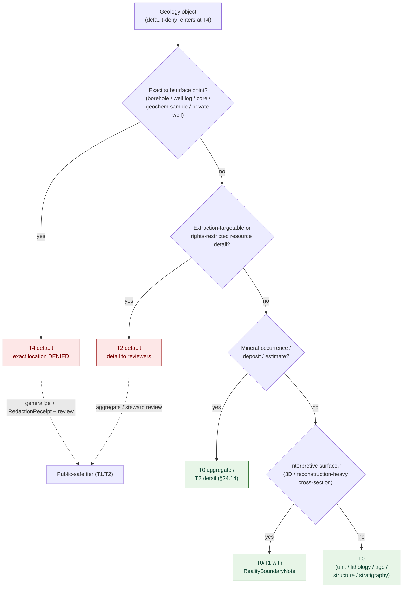
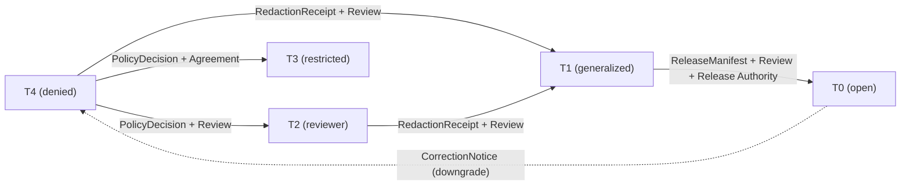

<!-- [KFM_META_BLOCK_V2]
doc_id: kfm://doc/geology-sensitivity
title: Geology and Natural Resources — Sensitivity Classification & Decision Lattice
type: standard
version: v1
status: draft
owners: <geology-domain-steward> · <sensitivity-reviewer> · <policy-steward>   # placeholder — confirm in CODEOWNERS
created: 2026-06-04
updated: 2026-06-04
policy_label: public
related:
  - docs/domains/geology/README.md
  - docs/domains/geology/POLICY.md
  - docs/domains/geology/PRESERVATION_MATRIX.md
  - docs/domains/geology/RELEASE_INDEX.md
  - docs/domains/geology/SCOPE.md
  - docs/domains/geology/OPEN_QUESTIONS.md
  - ai-build-operating-contract.md   # CONTRACT_VERSION = "3.0.0"; §23 sensitive-domain matrix
  - policy/sensitivity/
  - docs/doctrine/directory-rules.md
tags: [kfm, geology, sensitivity, tiers, governance]
notes:
  - Classification rubric + decision lattice for geology objects. Disposition authority is ai-build-operating-contract.md §23.2/§23.3; enforcement is policy/. This doc maps geology objects to those rules; it does not re-derive them.
  - Doctrine-adjacent; pins CONTRACT_VERSION = "3.0.0".
  - The §23.2 matrix has NO explicit geology row; the most-restrictive applicable row plus the §23.3 default govern. Surfaced, not papered over.
  - T0–T4 tier scheme is PROPOSED (Atlas §24.5; ADR-S-05). All repo-shaped paths PROPOSED pending mounted-repo verification.
[/KFM_META_BLOCK_V2] -->

# Geology and Natural Resources — Sensitivity Classification & Decision Lattice

> How to classify a geology object's sensitivity tier (T0–T4), which transforms and receipts move it toward public release, and which `ai-build-operating-contract.md §23.2` rows apply. This doc is the **classification rubric**; `POLICY.md` states posture, `PRESERVATION_MATRIX.md` carries the per-family rules, and `policy/` enforces.

-red)

| Field | Value |
|---|---|
| **Status** | `draft` |
| **Owners** | `<geology-domain-steward>` · `<sensitivity-reviewer>` · `<policy-steward>` *(placeholders — confirm in CODEOWNERS)* |
| **Disposition authority** | `ai-build-operating-contract.md §23.2` matrix + `§23.3` default (`CONTRACT_VERSION = "3.0.0"`) |
| **Enforcement home (PROPOSED)** | `policy/sensitivity/` |
| **Lane** | Geology / Natural Resources — `[DOM-GEOL]`, Atlas Ch. 10 + §24.5 |
| **Updated** | 2026-06-04 |

> [!IMPORTANT]
> **This doc classifies; it does not decide.** The authoritative disposition for any sensitive geology object is the `ai-build-operating-contract.md §23.2` matrix (or the `§23.3` default where no row matches), and the machine-enforced rules live under `policy/`. This page maps geology objects onto those rules so a reviewer can classify quickly. Where this page and the matrix or a `policy/` bundle disagree, **they win** and the conflict is logged in `docs/registers/DRIFT_REGISTER.md`.

> [!CAUTION]
> The `§23.2` matrix has **no explicit geology row**. Per the matrix's own ratification note, until geology defaults are ratified the **most restrictive applicable row applies**, and where no row matches the **`§23.3` default** governs: `DENY` public exact exposure, `GENERALIZE` before publication, `REDACT` when needed, `QUARANTINE` uncertain source material, `REQUIRE` steward review, `REQUIRE` transform receipt, `ABSTAIN` when support is inadequate.

---

## Contents

- [1. What this doc is for](#1-what-this-doc-is-for)
- [2. Tier scheme (T0–T4)](#2-tier-scheme-t0t4)
- [3. The classification lattice](#3-the-classification-lattice)
- [4. Geology objects → applicable §23.2 rows](#4-geology-objects--applicable-232-rows)
- [5. Geology object tier reference](#5-geology-object-tier-reference)
- [6. Sensitive joins that fail closed](#6-sensitive-joins-that-fail-closed)
- [7. Transforms, receipts, and reviewers](#7-transforms-receipts-and-reviewers)
- [8. Worked classification examples](#8-worked-classification-examples)
- [9. Open questions & verification](#9-open-questions--verification)
- [10. Related docs](#10-related-docs)

---

## 1. What this doc is for

A reviewer classifying a geology object needs to answer, in order: *what tier is this by default, which transform makes it publishable, which reviewer must sign off, and which `§23.2` row applies?* This document is the rubric and lattice for those four questions, scoped to geology.

It deliberately does **not** restate the full posture (that is `POLICY.md`) or the per-family preservation rules (that is `PRESERVATION_MATRIX.md`). The division of labor:

| Doc | Answers |
|---|---|
| `SCOPE.md` | Is this object even geology's? |
| `SENSITIVITY.md` *(this doc)* | What tier is it, and how does it move toward release? |
| `POLICY.md` | What is the lane's overall sensitivity & rights posture? |
| `PRESERVATION_MATRIX.md` | What must be preserved per family, per lifecycle phase? |
| `policy/` *(machine)* | The enforced allow/deny/restrict decision. |

[↑ Back to top](#top)

---

## 2. Tier scheme (T0–T4)

The project-wide tier scheme (Atlas §24.5.1; adoption **PROPOSED**, tracked as ADR-S-05). Tier is independent of lifecycle phase — a `WellLog` at T4 is still preserved through every phase; it is the *release* that is denied.

| Tier | Name | Definition | Default audience |
|---|---|---|---|
| **T0** | Open | Public-safe, no transformation required beyond standard release. | Any public client via governed API |
| **T1** | Generalized | Public-safe only after generalization, fuzzing, aggregation, or redaction; transform reviewed and recorded. | Any public client via governed API |
| **T2** | Reviewer | Released only to authenticated reviewers or domain stewards; policy-bounded; correction path active. | Stewards, reviewers, named collaborators |
| **T3** | Restricted | Released only under named agreement (rights/sovereignty/consent), recorded. | Named authorized parties only |
| **T4** | Denied | Not released to any audience; record existence disclosed only as steward review permits. | — |

[↑ Back to top](#top)

---

## 3. The classification lattice

The decision path for classifying a geology object's public-release tier. Default-deny on ingest: an object enters at T4 until a `SourceDescriptor` + rights review establish a higher-trust default.

> [!NOTE]
> The lattice encodes the geology default posture (DOM-GEOL §10.I: exact subsurface/private-well locations default to restricted or generalized public geometry) plus the §24.14 occurrence/estimate defaults. It is a **classification aid, not the decision**: the decision is the §23.2/§23.3 disposition recorded as a `PolicyDecision`.

[↑ Back to top](#top)

---

## 4. Geology objects → applicable §23.2 rows

The `§23.2` matrix has no geology row, so geology objects map onto the **most restrictive applicable row** plus the `§23.3` default. The mapping below is **INFERRED** (the matrix does not name geology) and **PROPOSED** pending steward ratification.

| Geology object / surface | Applicable §23.2 row (INFERRED) | Default disposition | Required reviewer | Required receipts |
|---|---|---|---|---|
| Exact borehole / core / private-well location | Exact-harm coordinates | `DENY`; generalize or full denial | Security / sensitivity reviewer | `RedactionReceipt` |
| KGS LAS well logs / rights-controlled source content | Restricted source terms | `DENY` derivative public release | Rights reviewer | `PolicyDecision`; `SourceDescriptor` rights field |
| Operator / permit ↔ private parcel join | Private land assertions | `ABSTAIN` unless rights documented | Rights reviewer | `PolicyDecision` |
| Extraction-targetable mineral/deposit coordinates | Exact-harm coordinates | `DENY`; generalize or full denial | Security / sensitivity reviewer | `RedactionReceipt` |
| Any geology object with no clear row | §23.3 default | `DENY` exact / `GENERALIZE` / `QUARANTINE` / steward review / transform receipt / `ABSTAIN` | Geology + sensitivity reviewer | `RedactionReceipt`; `PolicyDecision` |

> [!WARNING]
> Do not read "no geology row" as "geology is unrestricted." The opposite holds: with no ratified row, the **most restrictive applicable row and the §23.3 default both apply**. Promoting a geology object on the basis of a missing row is a fail-open error.

[↑ Back to top](#top)

---

## 5. Geology object tier reference

Default public-release tiers per geology object family. Two rows are **CONFIRMED-grounded** in Atlas §24.14 (`GeologicUnit / Lithology` = T0; `MineralOccurrence / ResourceEstimate` = T0 aggregate / T2 detail); the rest are **PROPOSED** extensions of DOM-GEOL §10.I pending ADR-S-05.

> [!CAUTION]
> **Object-family naming drift (CONFLICTED).** Names below use the DOM-GEOL §10.B short forms; the §10.E table uses `…Reference` / variant forms. The canonical set is unresolved — see [§9](#9-open-questions--verification) and the suite-wide note in `SCOPE.md`.

| Object family | Default tier | Basis |
|---|---|---|
| `GeologicUnit`, `Lithology` | **T0** | CONFIRMED default — Atlas §24.14 |
| `StratigraphicInterval`, `GeologicAge` | T0 | PROPOSED (DOM-GEOL §10.I; routine public map content) |
| `FaultStructure` | T0 / T2 *(detailed seismotectonic)* | PROPOSED |
| `CrossSection` | T0 / T1 *(`RealityBoundaryNote` if reconstruction-heavy)* | PROPOSED |
| `Borehole`, `WellLog`, `CoreSample`, `GeochemistrySample` *(exact location)* | **T4** | PROPOSED (DOM-GEOL §10.I exact-location default; §23.2 exact-harm row) |
| `WellLog` *(KGS LAS / rights-controlled content)* | **T4** until rights cleared | PROPOSED (§23.2 restricted-source-terms row) |
| `GeophysicalObservation` | T0 / T1 | PROPOSED |
| `MineralOccurrence`, `ResourceDeposit`, `ResourceEstimate` | **T0 aggregate / T2 detail** | CONFIRMED default — Atlas §24.14 (`MineralOccurrence/ResourceEstimate` row) |
| `ExtractionSite`, `ReclamationRecord` | T0 / T1 *(private operator detail held back)* | PROPOSED |
| `HydrostratigraphicUnit` | T0 | PROPOSED |

[↑ Back to top](#top)

---

## 6. Sensitive joins that fail closed

DOM-GEOL §10.D records that geology sources carry "sensitive joins fail closed." A join can raise the sensitivity of an otherwise-public object — classify the **join result**, not just the inputs.

| Join | Why it's sensitive | Fail-closed outcome |
|---|---|---|
| Borehole/well-log point × private parcel | Re-identifies a private well or operator site | `DENY`; generalize geometry, suppress the parcel link |
| Operator × extraction site × parcel | Builds an ownership/operations profile | `ABSTAIN` unless rights documented (§23.2 private-land row) |
| Occurrence cluster × precise coordinates | Enables extraction-targeting | `DENY` exact; publish only aggregated occurrence density |
| KGS LAS curve × public reproduction | Redistributes rights-controlled content | `DENY` derivative public release until terms cleared |
| Geochemistry anomaly × fine grid | Resource fingerprinting | `DENY` fine grid; publish binned/aggregated anomaly only |

> [!IMPORTANT]
> A T0 input joined to a T0 input can produce a T4 result. The classification attaches to the **output claim**, and the join itself is a transform that must carry an `AggregationReceipt` or `RedactionReceipt`.

[↑ Back to top](#top)

---

## 7. Transforms, receipts, and reviewers

Moving a geology object toward public release is a transform with a receipt and a review. Upgrades (toward public) need **both** a transform receipt **and** a review record; downgrades (toward restricted) need only a `CorrectionNotice` (Atlas §24.5.3).

| Transform | Receipt | Typical reviewer | Tier motion |
|---|---|---|---|
| Coordinate generalization (cell-binning) | `RedactionReceipt` | Sensitivity reviewer | T4 → T1, T2 → T1 |
| Coordinate fuzzing | `RedactionReceipt` | Sensitivity reviewer | T4 → T1 |
| Aggregation (county / basin / play rollup) | `AggregationReceipt` | Geology steward | T2 → T1, T1 → T0 |
| Attribute suppression (operator / owner) | `RedactionReceipt` | Rights reviewer | T2 → T1, T4 → T2 |
| Rights clearance (named agreement) | `PolicyDecision` + `ReviewRecord` | Rights reviewer + rights-holder | T4 → T3 |
| Reality-boundary annotation (3D / cross-section) | `RepresentationReceipt` + `RealityBoundaryNote` | Geology steward | enables interpretive public surface |

> [!NOTE]
> Required reviewers beyond the domain steward follow `§23.2`: a **security/sensitivity reviewer** for exact-harm coordinates, a **rights reviewer** for restricted-source and private-land cases. Reviewer separation of duties is pending ADR-S-09 (see `RELEASE_INDEX.md §11`).

[↑ Back to top](#top)

---

## 8. Worked classification examples

Four worked classifications

**A — Statewide bedrock geology layer.** `GeologicUnit` polygons from KGS at map scale. → No exact subsurface point, no restricted content. **T0** (Atlas §24.14). Standard release; cite source and version. No `§23.2` row triggered.

**B — Individual oil/gas well log (KGS LAS).** Exact location + rights-controlled curves. → Two rows apply: exact-harm coordinates (`DENY` exact) and restricted source terms (`DENY` derivative). Most restrictive wins. **T4** until rights cleared; only a generalized, rights-cleared derivative reaches T1/T2 with `RedactionReceipt` + rights reviewer.

**C — County mineral-occurrence density layer.** Point occurrences aggregated to a county rollup. → §24.14 occurrence default is T0 aggregate / T2 detail. The aggregate layer is **T0** *with* an `AggregationReceipt`; the underlying point records stay at their own tier (a T0 aggregate does not back-fill T0 onto the sources).

**D — Interpretive subsurface cross-section rendered in 3D.** Reconstruction-heavy `CrossSection`. → No exact private point, but interpretive. **T0/T1 with a `RealityBoundaryNote`** so surface fidelity is not mistaken for evidence fidelity; `RepresentationReceipt` required.

[↑ Back to top](#top)

---

## Open questions register

| ID | Question | Owner role | Resolution path |
|---|---|---|---|
| OQ-GEOL-SENS-01 | Should geology get an explicit `§23.2` row, or is the most-restrictive-applicable-row + §23.3 mapping sufficient? | `<sensitivity-reviewer>` + `<geology-domain-steward>` | Steward ratification during §23 v3.x adoption; possibly ADR |
| OQ-GEOL-SENS-02 | Ratify the geology object tier reference (§5) — which defaults are canon vs the §24.14-grounded two? | `<geology-domain-steward>` + `<policy-steward>` | Steward decision; ADR-S-05 extension |
| OQ-GEOL-SENS-03 | Does a `policy/sensitivity/` bundle governing geology geometry/joins exist, or is it a gap? | `<policy-steward>` | Repo inspection; author bundle if absent |
| OQ-GEOL-SENS-04 | Resolve object-family naming drift (§10.B short vs §10.E `…Reference`). | `<geology-domain-steward>` | ADR or schema PR; drift entry |

## Open verification backlog

These items remain `NEEDS VERIFICATION` before this document promotes from `draft` to `published`:

1. Whether a geology `policy/sensitivity/` bundle exists (OQ-GEOL-SENS-03).
2. Ratification status of the §5 tier reference and the §4 row mapping (OQ-GEOL-SENS-01 / -02).
3. The canonical geology object-family name set (OQ-GEOL-SENS-04).

## Changelog v0 → v1

| Change | Type (per contract §37) | Reason |
|---|---|---|
| Initial geology sensitivity classification & lattice authored | new | Fill the SENSITIVITY.md gap referenced by POLICY/RELEASE_INDEX/README; provide a reviewer-facing classification rubric |
| §23.2 "no geology row" surfaced | new | Make the most-restrictive-applicable-row + §23.3 default mapping explicit rather than implied |
| Object tier reference grounded to §24.14 where possible | clarification | Distinguish CONFIRMED-default rows from PROPOSED ones |

> **Backward compatibility.** New file; no prior anchors to preserve. Section anchors introduced here should be treated as stable.

## Definition of done

This document is done enough to enter the repository when:

- it is placed according to Directory Rules (under `docs/domains/geology/`);
- a geology domain steward, a sensitivity reviewer, and a policy steward review it;
- the §4 row mapping and §5 tier reference are ratified or replaced by a steward decision;
- it is linked from `docs/domains/geology/README.md` and `POLICY.md`;
- it does not conflict with the `§23.2` matrix once geology defaults are ratified;
- any conflict with `policy/sensitivity/` bundles or the dossier is logged in `docs/registers/DRIFT_REGISTER.md`;
- the `GENERATED_RECEIPT.json` planned in the authoring notes is wired into CI;
- future changes follow `ai-build-operating-contract.md §37` lifecycle.

[↑ Back to top](#top)

---

## 10. Related docs

- `docs/domains/geology/POLICY.md` — geology policy & sensitivity posture (states intent).
- `docs/domains/geology/PRESERVATION_MATRIX.md` — per-object-family preservation/tier/transform rules.
- `docs/domains/geology/SCOPE.md` — bounded-context boundary (is it geology's at all?).
- `docs/domains/geology/RELEASE_INDEX.md` — release surface + reviewer separation (§11).
- `docs/domains/geology/OPEN_QUESTIONS.md` — geology open-questions register.
- `docs/domains/geology/README.md` — lane landing page.
- `ai-build-operating-contract.md` — §23.1 sensitive-domain list, §23.2 matrix, §23.3 default (`CONTRACT_VERSION = "3.0.0"`).
- `policy/sensitivity/` — canonical sensitivity bundles (enforcement home).
- Atlas Ch. 10 §10.D / §10.I (geology sensitivity & sources), §24.5 (tier scheme), §24.14 (object × domain defaults).
- `docs/doctrine/directory-rules.md` — §6.5 `policy/` canonical, §12 Domain Placement Law.

---

*Last updated: 2026-06-04 · Status: `draft` · `CONTRACT_VERSION = "3.0.0"` · `[DOM-GEOL]`*

[↑ Back to top](#top)
