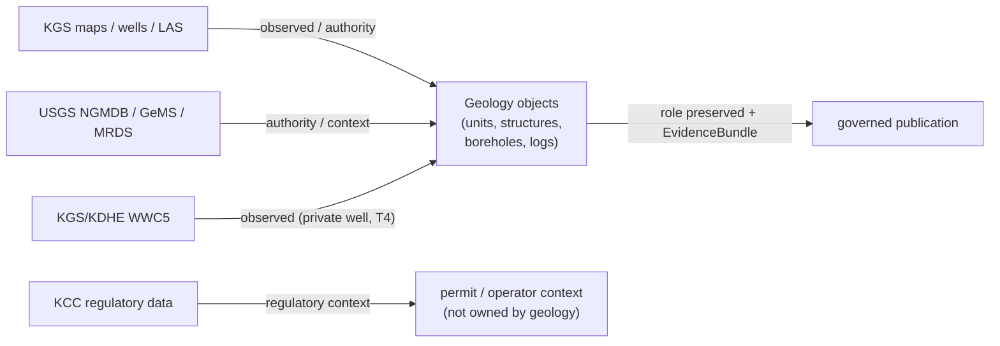

<!-- [KFM_META_BLOCK_V2]
doc_id: kfm://doc/geology-sources
title: Geology and Natural Resources — Source Families & Source-Role Discipline
type: standard
version: v1
status: draft
owners: <geology-domain-steward> · <source-steward> · <docs-steward>   # placeholder — confirm in CODEOWNERS
created: 2026-06-04
updated: 2026-06-04
policy_label: public
related:
  - docs/domains/geology/README.md
  - docs/domains/geology/SCOPE.md
  - docs/domains/geology/SENSITIVITY.md
  - docs/domains/geology/POLICY.md
  - docs/domains/geology/PRESERVATION_MATRIX.md
  - docs/domains/geology/RELEASE_INDEX.md
  - data/registry/sources/geology/
  - schemas/contracts/v1/source/source-descriptor.json
  - ai-build-operating-contract.md   # CONTRACT_VERSION = "3.0.0"
  - docs/doctrine/directory-rules.md
tags: [kfm, geology, sources, source-role, registry, governance]
notes:
  - Source-family registry index + source-role discipline for the geology lane. Authoritative source-family list is DOM-GEOL §10.D; canonical SourceDescriptor records live in data/registry/sources/geology/.
  - Doctrine-adjacent; pins CONTRACT_VERSION = "3.0.0".
  - Source-role classes and SourceDescriptor field shape are CONFIRMED doctrine (Atlas §24.1) / PROPOSED implementation; field names are illustrative, not authoritative, until the mounted schema is verified.
  - All rights/terms entries are NEEDS VERIFICATION per DOM-GEOL §10.D. All repo-shaped paths PROPOSED.
[/KFM_META_BLOCK_V2] -->

# Geology and Natural Resources — Source Families & Source-Role Discipline

> The geology lane's source families (KGS, KCC, USGS, …), the source-role each may carry, and the anti-collapse rules that keep an observed reading from being relabeled a regulation, a model, or an aggregate. This is the human-facing index; the canonical records are `SourceDescriptor`s under `data/registry/sources/geology/`.

| Field | Value |
|---|---|
| **Status** | `draft` |
| **Owners** | `<geology-domain-steward>` · `<source-steward>` · `<docs-steward>` *(placeholders — confirm in CODEOWNERS)* |
| **Authoritative source list** | `DOM-GEOL §10.D` |
| **Canonical records** | `SourceDescriptor` under `data/registry/sources/geology/` *(PROPOSED path)* |
| **Source-role doctrine** | Atlas §24.1 Master Source-Role Anti-Collapse Register |
| **Lane** | Geology / Natural Resources — `[DOM-GEOL]`, Atlas Ch. 10 |
| **Updated** | 2026-06-04 |

> [!IMPORTANT]
> This is an **index**, not the source registry. The canonical, machine-readable record for each source is a `SourceDescriptor` under `data/registry/sources/geology/`, governed by `schemas/contracts/v1/source/source-descriptor.json` (per Directory Rules §7.4 / ADR-0001). Where this page and a descriptor disagree, the descriptor wins and the conflict is logged in `docs/registers/DRIFT_REGISTER.md`.

> [!CAUTION]
> Every source family below carries **rights and current terms `NEEDS VERIFICATION`** (DOM-GEOL §10.D) and **sensitive joins fail closed**. A source MUST NOT promote past `WORK / QUARANTINE` until its `SourceDescriptor` records confirmed rights, role, and sensitivity.

---

## Contents

- [1. What this doc is for](#1-what-this-doc-is-for)
- [2. Source-role classes (the seven roles)](#2-source-role-classes-the-seven-roles)
- [3. Geology source families](#3-geology-source-families)
- [4. Source families → roles → object families](#4-source-families--roles--object-families)
- [5. Anti-collapse: the geology failure mode](#5-anti-collapse-the-geology-failure-mode)
- [6. SourceDescriptor shape (illustrative)](#6-sourcedescriptor-shape-illustrative)
- [7. Admission checklist](#7-admission-checklist)
- [8. Open questions & verification](#8-open-questions--verification)
- [9. Related docs](#9-related-docs)

---

## 1. What this doc is for

A contributor admitting or citing a geology source needs to know: *which source families the lane recognizes, what role each may carry, what rights posture applies, and which anti-collapse rule protects the citation.* This document is that index, scoped to geology. It complements the suite as follows:

| Doc | Answers |
|---|---|
| `SCOPE.md` | Is this object geology's at all? |
| `SOURCES.md` *(this doc)* | Which sources feed geology, and what role does each carry? |
| `SENSITIVITY.md` | What tier is the object, and how does it move toward release? |
| `POLICY.md` | What is the lane's overall sensitivity & rights posture? |
| `data/registry/sources/geology/` | The canonical `SourceDescriptor` records (machine). |

[↑ Back to top](#top)

---

## 2. Source-role classes (the seven roles)

**CONFIRMED doctrine (Atlas §24.1.1).** Source role is a first-class identity attribute, **set at admission on the `SourceDescriptor` and preserved through every promotion**. Promotion does not upgrade an observation to a regulation, a model to an aggregate, or a candidate to a verified record — those are separate governed transitions.

| Role | Definition | Geology example | Allowed downstream |
|---|---|---|---|
| **Observed** | A direct reading or first-hand evidentiary record tied to place and time. | A logged borehole; a geochemistry sample analysis. | May feed modeled or aggregate products; never relabeled regulatory or administrative. |
| **Regulatory** | An authoritative determination by a governing body with legal/administrative force. | A KCC regulatory determination on an oil/gas well. | Cite as regulatory context; never an observed event or a modeled estimate. |
| **Modeled** | A derived product from inputs/assumptions/fitted parameters; uncertainty preserved. | A resource estimate surface; a geophysical inversion. | Cite with model identity, run receipt, and bounds; never an observation. |
| **Aggregate** | A summary/total/average over a unit; individual-record fidelity is lost. | A county-level mineral-occurrence rollup; a basin resource-estimate summary. | Cite with `AggregationReceipt`; **never treated as a per-place record**. |
| **Administrative** | A compiled agency record for registration/accounting — not an observation or regulation. | A well-permit roster; an operator registry compilation. | Cite as administrative context; never collapsed with observation or regulation. |
| **Candidate** | A proposed record awaiting validation/dedup/review; not yet authoritative. | Quarantined KGS connector output; an unmerged occurrence record. | Cite as candidate evidence in `WORK / QUARANTINE`; never `PUBLISHED` without promotion. |
| **Synthetic** | Simulated/reconstructed/AI/interpolated content with no first-hand observation. | A synthetic subsurface surface; an AI-drafted geology summary. | Carries `RealityBoundaryNote` + `RepresentationReceipt`; never queried as observed reality. |

> [!NOTE]
> A single source family can carry **different roles for different records**. KGS oil-and-gas data, for example, can supply *observed* well logs, *administrative* permit rosters, and *aggregate* production summaries — each record's role is fixed by its own descriptor, not by the family.

[↑ Back to top](#top)

---

## 3. Geology source families

**CONFIRMED / PROPOSED (DOM-GEOL §10.D).** The eight families below are the geology source spine. Rights/terms are `NEEDS VERIFICATION` for all; sensitive joins fail closed for all.

| Source family | Operator | Role envelope (per §10.D) | Rights / sensitivity | Freshness |
|---|---|---|---|---|
| KGS data & geologic maps | Kansas Geological Survey | authority / observation / context / model *as role requires* | terms `NEEDS VERIFICATION`; sensitive joins fail closed | source-vintage / cadence |
| KGS surficial geology & geologic maps | Kansas Geological Survey | authority / observation / context / model | terms `NEEDS VERIFICATION` | source-vintage |
| USGS NGMDB / GeMS | U.S. Geological Survey | authority / observation / context / model | terms `NEEDS VERIFICATION` | source-vintage |
| KGS oil & gas wells / production | Kansas Geological Survey | authority / observation / context / model | terms `NEEDS VERIFICATION`; **exact private-well exposure DENY** | source-vintage / cadence |
| KCC oil & gas regulatory data | Kansas Corporation Commission | authority / observation / context / model | terms `NEEDS VERIFICATION` | cadence-specific |
| KGS/KDHE WWC5 water-well program | KGS / Kansas Dept. of Health & Environment | authority / observation / context / model | terms `NEEDS VERIFICATION`; **private-well details DENY** | cadence-specific |
| KGS LAS digital well logs & well tops | Kansas Geological Survey | authority / observation / context / model | **rights-controlled**; redistribution class `NEEDS VERIFICATION` per dataset | source-vintage |
| USGS MRDS | U.S. Geological Survey | authority / observation / context / model | terms `NEEDS VERIFICATION` | source-vintage |

> [!TIP]
> Sources sometimes added in adjacent docs (USGS 3DEP terrain, state/operator extraction records, reclamation program records, geophysics/geochemistry archives) are **not** in the DOM-GEOL §10.D list. If admitted, treat them as **PROPOSED / INFERRED additions** and route a dossier-extension question rather than presenting them as part of the canonical eight — see [Q3](#8-open-questions--verification).

[↑ Back to top](#top)

---

## 4. Source families → roles → object families

How each source family typically feeds the geology object families (per `SCOPE.md §2`). The role column is the **typical** role for that feed; the descriptor fixes the actual role per record.

| Source family | Typical role(s) | Feeds object families |
|---|---|---|
| KGS / USGS NGMDB·GeMS geologic & surficial maps | authority / observation | `GeologicUnit`, `Lithology`, `StratigraphicInterval`, `GeologicAge`, `FaultStructure`, `CrossSection`, `HydrostratigraphicUnit` |
| KGS oil & gas wells | observation / administrative | `Borehole`, `WellLog`, `CoreSample` |
| KGS LAS digital well logs / tops | observation *(rights-controlled)* | `WellLog` |
| KCC oil & gas regulatory data | regulatory / administrative | permit/operator *context* (not an owned geology claim — see `SCOPE.md §3`) |
| KGS/KDHE WWC5 water-well program | observation / administrative | `Borehole` (private-well; T4 default) |
| USGS MRDS | authority / context | `MineralOccurrence`, `ResourceDeposit` |
| Geophysics / geochemistry feeds | observation / modeled | `GeophysicalObservation`, `GeochemistrySample` |

[↑ Back to top](#top)

---

## 5. Anti-collapse: the geology failure mode

**CONFIRMED doctrine (Atlas §24.1.2).** The lifecycle and governed API fail closed when source roles are conflated. Geology is named explicitly in one anti-collapse failure mode and is exposed to the others.

> [!WARNING]
> **Aggregate cited as a per-place truth (§24.1.2 — geology named).** Citing a county-level mineral-occurrence rollup or a basin resource-estimate summary as if it were a single-location record is **DENIED**: the join from an aggregate cell to a single record is refused, and an AI surface `ABSTAIN`s. The required guardrail is an `AggregationReceipt` plus a geometry-scope guard.

| Collapse pattern | Geology exposure | Denied outcome | Required guardrail |
|---|---|---|---|
| **Aggregate cited as per-place truth** *(geology named)* | County occurrence rollup / basin estimate read as a point record | `DENY` join aggregate→single; `ABSTAIN` at AI | `AggregationReceipt`; geometry-scope guard |
| Modeled product labeled observed | Resource estimate or geophysical inversion shown as a measurement | `DENY` at publication; `ABSTAIN` at AI | `ModelRunReceipt` + uncertainty surface + role-preserving DTO field |
| Candidate exposed on a public surface | Quarantined KGS connector output reaches `PUBLISHED` | `DENY` at trust membrane; route to `QUARANTINE` | Promotion gate; no `PUBLISHED` edge to `WORK / QUARANTINE` |
| Synthetic presented as observed | Synthetic subsurface surface / AI summary shown as evidence | `DENY` publication; `HOLD` for steward review | `RealityBoundaryNote`; `RepresentationReceipt`; UI badge |
| AI text treated as evidence | A Focus Mode geology answer cited as the source | `DENY` publication; `ABSTAIN` at Focus Mode | Cite-or-abstain; `AIReceipt` mandatory |

> [!IMPORTANT]
> Anti-collapse pairs with the **claim-class** distinctness rule (`SCOPE.md §5`: Occurrence ≠ Deposit ≠ Estimate ≠ Permit ≠ Production ≠ Reserve). Source-role anti-collapse protects *how a source is labeled*; claim-class anti-collapse protects *what kind of claim it makes*. Both must hold.

[↑ Back to top](#top)

---

## 6. SourceDescriptor shape (illustrative)

**CONFIRMED doctrine / PROPOSED implementation (Atlas §24.1.3).** Source-role is a `SourceDescriptor` field. The fields below are the **illustrative PROPOSED shape** — field names are *not* asserted as the mounted schema. Canonical home defaults to `schemas/contracts/v1/source/source-descriptor.json` per Directory Rules §7.4 / ADR-0001.

| Field | Type / vocabulary | Required | Notes |
|---|---|---|---|
| `source_role` | enum: `observed \| regulatory \| modeled \| aggregate \| administrative \| candidate \| synthetic` | MUST | Set at admission; **never edited in place** — corrections produce a new descriptor + `CorrectionNotice`. |
| `role_authority` | string (issuing body / model identity / steward) | MUST when role ∈ {regulatory, modeled, aggregate} | Disambiguates the authoring authority for cite text (e.g., KCC, KGS). |
| `role_aggregation_unit` | geometry-scope token (county, basin, year, …) | MUST when `source_role = aggregate` | Prevents geometry-scope drift on join. |
| `role_model_run_ref` | `EvidenceRef` → `ModelRunReceipt` | MUST when `source_role = modeled` | Pins inputs, parameters, version of a resource estimate / inversion. |
| `role_synthetic_basis` | `{ method, inputs, reality_boundary_note_ref }` | MUST when `source_role = synthetic` | Records what is and is not real in the carrier. |
| `role_candidate_disposition` | enum: `pending \| merged \| rejected \| quarantined` | MUST when `source_role = candidate` | `PUBLISHED` edge forbidden until merged. |
| rights / sensitivity / cadence / citation / ingest hash | per `SourceDescriptor` core | MUST | The admission anchor for every downstream receipt (per Atlas §24.2). |

> [!NOTE]
> **NEEDS VERIFICATION:** the actual field names and file presence in the mounted `SourceDescriptor` schema are not asserted here. An ADR or schema PR is the authoritative resolution.

[↑ Back to top](#top)

---

## 7. Admission checklist

Before a geology source reaches `data/raw/geology/`:

- [ ] A `SourceDescriptor` exists in `data/registry/sources/geology/<source_id>/`.
- [ ] `source_role` is set (one of the seven §2 roles) and matches the record, not the family.
- [ ] `role_authority` is recorded for regulatory / modeled / aggregate records.
- [ ] Rights, license, attribution, and redistribution class are recorded (esp. KGS LAS).
- [ ] Sensitivity is classified; exact subsurface / private-well geometry is flagged deny-by-default (see `SENSITIVITY.md`).
- [ ] Freshness / cadence expectation is recorded.
- [ ] The connector emits only to `data/raw/` or `data/quarantine/` — **never** publishes (watcher-as-non-publisher).
- [ ] An ingest receipt is produced with content hash and citation.

> [!CAUTION]
> A source with unresolved rights, role, or sensitivity stays in `WORK / QUARANTINE`. "Promote now, classify later" is a fail-open error this lane does not permit.

[↑ Back to top](#top)

---

## Open questions register

| ID | Question | Owner role | Resolution path |
|---|---|---|---|
| OQ-GEOL-SRC-01 | Do `SourceDescriptor` records exist for the eight §10.D families with confirmed rights/role/sensitivity? | `<source-steward>` | Repo inspection of `data/registry/sources/geology/`; record in VERIFICATION_BACKLOG |
| OQ-GEOL-SRC-02 | What is the redistribution class for KGS LAS well logs and KGS/KCC oil-and-gas data — open, licensed-only, or restricted? | `<rights-holder-rep>` + `<source-steward>` | Confirm upstream terms; encode in descriptor rights field |
| OQ-GEOL-SRC-03 | Should USGS 3DEP, extraction records, reclamation records, and geophysics/geochemistry archives be added to DOM-GEOL §10.D, or are they out-of-list context? | `<geology-domain-steward>` | Dossier-extension review; CROSS_LANE / SCOPE reconciliation |
| OQ-GEOL-SRC-04 | Confirm the `SourceDescriptor` schema home and field names at `schemas/contracts/v1/source/source-descriptor.json`. | `<schema-steward>` | Directory Rules §7.4 + ADR-0001 check against repo |

## Open verification backlog

These items remain `NEEDS VERIFICATION` before this document promotes from `draft` to `published`:

1. Existence and rights-completeness of the eight `SourceDescriptor` records (OQ-GEOL-SRC-01, -02).
2. The canonical source-family list (eight vs extended) (OQ-GEOL-SRC-03).
3. The mounted `SourceDescriptor` schema home and field names (OQ-GEOL-SRC-04).

## Changelog v0 → v1

| Change | Type (per contract §37) | Reason |
|---|---|---|
| Initial geology source-families & source-role doc authored | new | Fill the SOURCES.md gap referenced by README/SENSITIVITY/RELEASE_INDEX |
| Source-role classes + SourceDescriptor shape grounded to Atlas §24.1 | clarification | Use the canonical seven-role register and illustrative field shape rather than inventing roles/fields |
| Out-of-list sources marked PROPOSED/INFERRED | clarification | Keep the §10.D eight-family list authoritative; route additions via ADR/dossier |

> **Backward compatibility.** New file; no prior anchors to preserve. Section anchors introduced here should be treated as stable.

## Definition of done

This document is done enough to enter the repository when:

- it is placed according to Directory Rules (under `docs/domains/geology/`);
- a geology domain steward and a source steward review it;
- the source-family list matches `DOM-GEOL §10.D` (or the dossier is updated in lockstep);
- it is linked from `docs/domains/geology/README.md`;
- it does not conflict with accepted ADRs (esp. ADR-0001 schema home);
- any conflict with the dossier or `SourceDescriptor` records is logged in `docs/registers/DRIFT_REGISTER.md`;
- the `GENERATED_RECEIPT.json` planned in the authoring notes is wired into CI;
- future changes follow `ai-build-operating-contract.md §37` lifecycle.

[↑ Back to top](#top)

---

## 9. Related docs

- `docs/domains/geology/README.md` — lane landing page.
- `docs/domains/geology/SCOPE.md` — owned object families and boundary.
- `docs/domains/geology/SENSITIVITY.md` — tier classification & decision lattice.
- `docs/domains/geology/POLICY.md` — sensitivity & rights posture.
- `docs/domains/geology/PRESERVATION_MATRIX.md` — per-family preservation rules.
- `docs/domains/geology/RELEASE_INDEX.md` — release surface index.
- `data/registry/sources/geology/` — canonical `SourceDescriptor` records *(PROPOSED path)*.
- `schemas/contracts/v1/source/source-descriptor.json` — `SourceDescriptor` schema home *(PROPOSED; Directory Rules §7.4 / ADR-0001)*.
- `ai-build-operating-contract.md` — operating law, §23 sensitive-domain matrix (`CONTRACT_VERSION = "3.0.0"`).
- Atlas Ch. 10 §10.D (source families); §24.1 (Source-Role Anti-Collapse Register); §24.2 (Receipt Catalog).
- `docs/doctrine/directory-rules.md` — §7.4 schema home, §12 Domain Placement Law.

---

*Last updated: 2026-06-04 · Status: `draft` · `CONTRACT_VERSION = "3.0.0"` · `[DOM-GEOL]`*

[↑ Back to top](#top)
