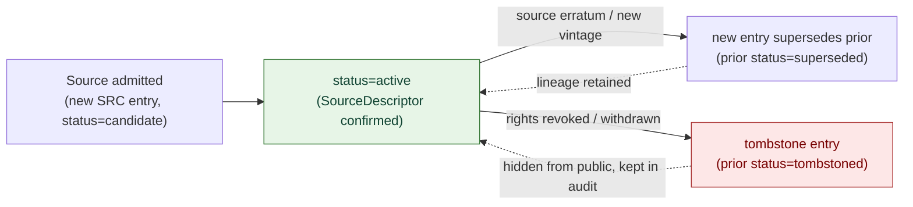
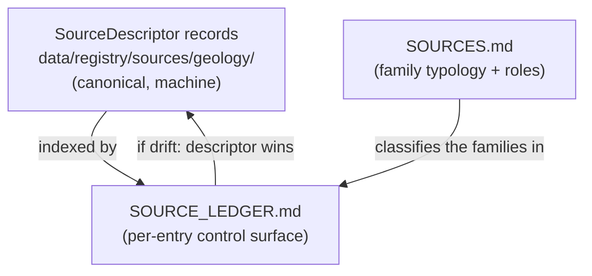

<!-- [KFM_META_BLOCK_V2]
doc_id: kfm://doc/geology-source-ledger
title: Geology and Natural Resources — Source Ledger
type: standard
version: v1
status: draft
owners: <geology-domain-steward> · <source-steward> · <docs-steward>   # placeholder — confirm in CODEOWNERS
created: 2026-06-04
updated: 2026-06-04
policy_label: public
related:
  - docs/domains/geology/README.md
  - docs/domains/geology/SOURCES.md
  - docs/domains/geology/SENSITIVITY.md
  - docs/domains/geology/POLICY.md
  - docs/domains/geology/RELEASE_INDEX.md
  - data/registry/sources/geology/
  - schemas/contracts/v1/source/source-descriptor.json
  - ai-build-operating-contract.md   # CONTRACT_VERSION = "3.0.0"
  - docs/doctrine/directory-rules.md
tags: [kfm, geology, source-ledger, provenance, audit, governance]
notes:
  - Append-only control surface enumerating geology SRC entries. A control surface, not a bibliography — it states what each source can support and what it cannot prove (Atlas Ch. 2 / corpus Source Ledger form).
  - Distinct from SOURCES.md (source-family index + role discipline). The ledger is per-entry and append-only; SOURCES.md is typological.
  - Doctrine-adjacent; pins CONTRACT_VERSION = "3.0.0".
  - SRC- entries below are PROPOSED placeholders; canonical per-source records are SourceDescriptor objects under data/registry/sources/geology/. Revocation is by tombstone, never deletion (C1-06, PROPOSED).
  - All rights/terms NEEDS VERIFICATION. All repo-shaped paths PROPOSED.
[/KFM_META_BLOCK_V2] -->

# Geology and Natural Resources — Source Ledger

> The append-only control surface for the geology lane's sources. Each entry states **what a source can support and what it cannot prove**, its role and status, and its supersession/tombstone lineage. This is not a bibliography and not the canonical registry — the canonical records are `SourceDescriptor`s under `data/registry/sources/geology/`.

| Field | Value |
|---|---|
| **Status** | `draft` |
| **Owners** | `<geology-domain-steward>` · `<source-steward>` · `<docs-steward>` *(placeholders — confirm in CODEOWNERS)* |
| **Ledger discipline** | Append-only; revocation by tombstone, never deletion (C1-06, **PROPOSED**) |
| **Canonical records** | `SourceDescriptor` under `data/registry/sources/geology/` *(PROPOSED path)* |
| **Authoritative family list** | `DOM-GEOL §10.D` (see `SOURCES.md`) |
| **Lane** | Geology / Natural Resources — `[DOM-GEOL]`, Atlas Ch. 10 |
| **Updated** | 2026-06-04 |

> [!IMPORTANT]
> **This ledger is a control surface, not a bibliography.** It records what each source *can support* and what it *cannot prove*; external facts embedded in a source remain source-supported only and are `NEEDS VERIFICATION` before any operational pin, source activation, access decision, or release claim. The machine-canonical record for each source is its `SourceDescriptor`; where ledger and descriptor disagree, the descriptor wins and the conflict is logged in `docs/registers/DRIFT_REGISTER.md`.

> [!CAUTION]
> The `SRC-GEOL-*` entries in [§4](#4-the-geology-source-ledger) are **PROPOSED placeholders**. No `source_id` is asserted to exist until verified against `data/registry/sources/geology/`. Rights/terms are `NEEDS VERIFICATION` for every entry, and sensitive joins fail closed.

---

## Contents

- [1. What a Source Ledger is](#1-what-a-source-ledger-is)
- [2. Ledger discipline (append-only)](#2-ledger-discipline-append-only)
- [3. Ledger entry shape](#3-ledger-entry-shape)
- [4. The geology source ledger](#4-the-geology-source-ledger)
- [5. Status & lifecycle of a ledger entry](#5-status--lifecycle-of-a-ledger-entry)
- [6. Supersession & tombstones](#6-supersession--tombstones)
- [7. Relationship to SourceDescriptor and SOURCES.md](#7-relationship-to-sourcedescriptor-and-sources)
- [8. Open questions & verification](#8-open-questions--verification)
- [9. Related docs](#9-related-docs)

---

## 1. What a Source Ledger is

A Source Ledger is a KFM control-surface artifact: a per-entry register that, for each source, states its identity, role, status, **what it can support**, and **what it cannot prove**. The corpus form is explicit — *"This ledger is a control surface, not a bibliography. It states what each source can support and what it cannot prove."* (Atlas Ch. 2 Master Source Ledger; recurring Source Ledger tables across the corpus.)

For the geology lane, this ledger enumerates the geology `SRC-` entries, anchored to the eight source families of `DOM-GEOL §10.D` (catalogued typologically in `SOURCES.md`). Its job is to make every geology source's **support boundary** explicit and auditable, so a reviewer can answer "can this source carry this claim?" without re-reading the source.

> [!NOTE]
> "What it cannot prove" is the load-bearing column. A KGS geologic map can *support* a `GeologicUnit` polygon; it *cannot prove* a resource reserve, a private well's exact location's public-safety, or a hazard risk rating. The ledger fixes those limits up front.

[↑ Back to top](#top)

---

## 2. Ledger discipline (append-only)

**PROPOSED doctrine (C1-06 Immutable, Append-Only Audit Ledger of Receipts; KFM-P1-PROG-0054).** The ledger is **append-only**: entries are never mutated in place, and a source is never deleted from the ledger. Corrections and revocations are written as **new entries** (a new descriptor + `CorrectionNotice`, or a tombstone), so the system can always prove what it relied on at a given time.

> [!IMPORTANT]
> **Revocation does not delete.** A tombstone entry points at the retracted entry, records the reason, the supersession reference, and the timestamp. Public clients hide tombstoned sources; the lineage and audit graph remain explorable (C1-06).

[↑ Back to top](#top)

---

## 3. Ledger entry shape

Each ledger row uses the corpus Source-Ledger column shape, adapted for a domain lane. Fields are the **human-facing** projection; the machine-canonical fields live on the `SourceDescriptor`.

| Column | Meaning |
|---|---|
| `source_id` | Stable `SRC-GEOL-NN` identifier; dereferences to a `SourceDescriptor`. |
| Source / title | The source family or specific dataset. |
| Type | Source type (survey data, regulatory data, well-log archive, mineral database, …). |
| Source role | One of the seven roles (observed / regulatory / modeled / aggregate / administrative / candidate / synthetic) — see `SOURCES.md §2`. |
| Status | Ledger lifecycle state (see [§5](#5-status--lifecycle-of-a-ledger-entry)). |
| Can support | What claims this source may back. |
| Cannot prove | The explicit support boundary — what it must **not** be cited for. |
| Rights / sensitivity | Rights posture and sensitivity flags. |

[↑ Back to top](#top)

---

## 4. The geology source ledger

> [!CAUTION]
> **PROPOSED placeholder entries.** `source_id`s below are illustrative `SRC-GEOL-NN` placeholders pending `data/registry/sources/geology/` verification. The eight source families are CONFIRMED from `DOM-GEOL §10.D`; the IDs, exact roles, and rights are PROPOSED / `NEEDS VERIFICATION`.

| `source_id` | Source / title | Type | Source role(s) | Status | Can support | Cannot prove | Rights / sensitivity |
|---|---|---|---|---|---|---|---|
| `SRC-GEOL-01` *(TODO)* | KGS data & geologic maps | Survey data / maps | authority / observation | PROPOSED | `GeologicUnit`, `Lithology`, `FaultStructure`, `CrossSection` | resource reserves; hazard risk; ownership | terms `NEEDS VERIFICATION`; joins fail closed |
| `SRC-GEOL-02` *(TODO)* | KGS surficial geology & maps | Survey data / maps | authority / observation | PROPOSED | `GeologicUnit` (surficial), `StratigraphicInterval` | subsurface certainty beyond mapped vintage | terms `NEEDS VERIFICATION` |
| `SRC-GEOL-03` *(TODO)* | USGS NGMDB / GeMS | Federal geologic database | authority / observation | PROPOSED | `GeologicUnit`, `StratigraphicInterval`, `GeologicAge` | Kansas-specific currency beyond source vintage | terms `NEEDS VERIFICATION` |
| `SRC-GEOL-04` *(TODO)* | KGS oil & gas wells / production | Well & production data | observation / administrative / aggregate | PROPOSED | `Borehole`, `WellLog`, production *aggregates* | a reserve; per-place truth from an aggregate; ownership | **exact private-well exposure DENY**; terms `NEEDS VERIFICATION` |
| `SRC-GEOL-05` *(TODO)* | KCC oil & gas regulatory data | Regulatory data | regulatory / administrative | PROPOSED | permit/operator *regulatory context* | an observed geologic event; production-as-fact; deposit | terms `NEEDS VERIFICATION` |
| `SRC-GEOL-06` *(TODO)* | KGS/KDHE WWC5 water-well program | Water-well program | observation / administrative | PROPOSED | `Borehole` (water well, generalized) | exact private-well public geometry | **private-well details DENY**; terms `NEEDS VERIFICATION` |
| `SRC-GEOL-07` *(TODO)* | KGS LAS digital well logs / tops | Well-log archive | observation *(rights-controlled)* | PROPOSED | `WellLog`, well tops | public reproduction without rights clearance | **rights-controlled**; redistribution class `NEEDS VERIFICATION` |
| `SRC-GEOL-08` *(TODO)* | USGS MRDS | Mineral resources database | authority / context | PROPOSED | `MineralOccurrence`, `ResourceDeposit` | a `ResourceEstimate` or reserve; extraction-targetable exact coords | terms `NEEDS VERIFICATION`; joins fail closed |

> [!WARNING]
> **The "Cannot prove" column is enforceable doctrine, not a courtesy note.** Citing a source past its support boundary triggers the relevant anti-collapse DENY (`SOURCES.md §5`): an aggregate cited per-place, a regulatory record cited as observation, or an occurrence cited as a reserve all fail closed.

[↑ Back to top](#top)

---

## 5. Status & lifecycle of a ledger entry

| Status | Meaning | Public visibility |
|---|---|---|
| `candidate` | Admitted, awaiting `SourceDescriptor` confirmation, rights, role, sensitivity. | Not public; `WORK / QUARANTINE` only |
| `active` | Confirmed descriptor; may back released claims within its support boundary. | Citable on public surfaces |
| `superseded` | Replaced by a newer entry (new vintage / corrected descriptor); lineage retained. | Hidden from default public views; in audit graph |
| `tombstoned` | Revoked (rights withdrawn, source retracted); not deleted. | Hidden from public; in audit graph |

> [!NOTE]
> Status transitions are governed transitions, not edits. `candidate → active` requires a confirmed `SourceDescriptor` and (where sensitivity applies) a `ReviewRecord`; `active → superseded`/`tombstoned` appends a new entry with a `CorrectionNotice` or tombstone reference.

[↑ Back to top](#top)

---

## 6. Supersession & tombstones

A geology source changes over time (KGS issues a new map vintage; a license is revoked). The ledger handles both without losing history.

| Event | Ledger action | Required artifact |
|---|---|---|
| New source vintage / corrected descriptor | New entry; prior set `superseded` with forward reference | new `SourceDescriptor` + `CorrectionNotice` |
| Source erratum upstream | New entry or annotation; prior lineage retained | `CorrectionNotice` linked to the source's `EvidenceBundle` |
| Rights revocation / source withdrawal | Tombstone entry pointing at the retracted `source_id`, with reason + timestamp | tombstone (C1-06); `PolicyDecision`; downstream `RollbackCard` where releases depended on it |

> [!CAUTION]
> A tombstoned source that backed a published geology layer triggers the correction/rollback path (`RELEASE_INDEX.md §10`): the dependent release is corrected, withdrawn, or rolled back, and downstream derivatives are invalidated. A source cannot be quietly dropped while its derived layers stay public.

[↑ Back to top](#top)

---

## 7. Relationship to SourceDescriptor and SOURCES.md

The three surfaces are distinct and must not be collapsed:

| Surface | Form | Authority |
|---|---|---|
| `SourceDescriptor` (`data/registry/sources/geology/`) | Machine record, one per source, append-only | **Canonical** — the truth |
| `SOURCE_LEDGER.md` *(this doc)* | Human-facing per-entry control surface; support boundaries | Navigational index of the descriptors |
| `SOURCES.md` | Source-*family* typology + the seven-role discipline | Conceptual reference |

> [!IMPORTANT]
> If this ledger and a `SourceDescriptor` disagree on role, rights, or status, **the descriptor governs** and the ledger row is rewritten — never the descriptor. The drift is logged in `docs/registers/DRIFT_REGISTER.md`.

[↑ Back to top](#top)

---

## Open questions register

| ID | Question | Owner role | Resolution path |
|---|---|---|---|
| OQ-GEOL-LDG-01 | Do `SourceDescriptor` records exist for the eight families, and what are their real `source_id`s? | `<source-steward>` | Repo inspection of `data/registry/sources/geology/`; replace placeholders |
| OQ-GEOL-LDG-02 | Is the append-only audit ledger (C1-06) realized, and is it file-based, DB-backed, or event-log-backed? | `<source-steward>` + `<release-steward>` | ADR (C1-06 is PROPOSED; backend undecided) |
| OQ-GEOL-LDG-03 | Should this human-facing ledger be the source of truth for "can support / cannot prove," or should those fields live on the `SourceDescriptor`? | `<schema-steward>` + `<docs-steward>` | Schema review; ADR on support-boundary field home |
| OQ-GEOL-LDG-04 | What is the canonical home for the machine ledger — `data/registry/sources/geology/` vs an audit-ledger path (e.g., `data/AUDIT/`)? | `<source-steward>` | Directory Rules check; reconcile with C1-06 |

## Open verification backlog

These items remain `NEEDS VERIFICATION` before this document promotes from `draft` to `published`:

1. Real `source_id`s and `SourceDescriptor` existence for all eight entries (OQ-GEOL-LDG-01).
2. Whether the append-only audit ledger is implemented and where (OQ-GEOL-LDG-02, -04).
3. Rights/redistribution class per source, especially KGS LAS and KGS/KCC oil-and-gas (`SOURCES.md` OQ-GEOL-SRC-02).

## Changelog v0 → v1

| Change | Type (per contract §37) | Reason |
|---|---|---|
| Initial geology source ledger authored | new | Provide the per-entry control surface complementing the SOURCES.md typology |
| Append-only / tombstone discipline grounded to C1-06 | clarification | Use the corpus audit-ledger doctrine rather than inventing ledger mechanics |
| Support-boundary ("cannot prove") column made enforceable | clarification | Tie the boundary to the §5 anti-collapse DENY rules in SOURCES.md |

> **Backward compatibility.** New file; no prior anchors to preserve. Section anchors introduced here should be treated as stable.

## Definition of done

This document is done enough to enter the repository when:

- it is placed according to Directory Rules (under `docs/domains/geology/`);
- a geology domain steward and a source steward review it;
- the entries match real `SourceDescriptor` records (placeholders replaced);
- it is linked from `docs/domains/geology/README.md` and `SOURCES.md`;
- it does not conflict with accepted ADRs (esp. ADR-0001 schema home, C1-06 ledger backend);
- any conflict with descriptors or the dossier is logged in `docs/registers/DRIFT_REGISTER.md`;
- the `GENERATED_RECEIPT.json` planned in the authoring notes is wired into CI;
- future changes follow `ai-build-operating-contract.md §37` lifecycle.

[↑ Back to top](#top)

---

## 9. Related docs

- `docs/domains/geology/SOURCES.md` — source-family typology + the seven-role discipline.
- `docs/domains/geology/README.md` — lane landing page.
- `docs/domains/geology/SENSITIVITY.md` — tier classification & decision lattice.
- `docs/domains/geology/POLICY.md` — sensitivity & rights posture.
- `docs/domains/geology/RELEASE_INDEX.md` — release surface; correction/rollback (§10).
- `data/registry/sources/geology/` — canonical `SourceDescriptor` records *(PROPOSED path)*.
- `schemas/contracts/v1/source/source-descriptor.json` — `SourceDescriptor` schema home *(PROPOSED; Directory Rules §7.4 / ADR-0001)*.
- `ai-build-operating-contract.md` — operating law (`CONTRACT_VERSION = "3.0.0"`).
- Atlas Ch. 2 (Master Source Ledger); Ch. 10 §10.D (geology sources); §24.1 (source-role anti-collapse).
- C1-06 / KFM-P1-PROG-0054 — Immutable, Append-Only Audit Ledger of Receipts *(PROPOSED)*.

---

*Last updated: 2026-06-04 · Status: `draft` · `CONTRACT_VERSION = "3.0.0"` · `[DOM-GEOL]`*

[↑ Back to top](#top)
