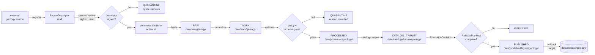

<!-- [KFM_META_BLOCK_V2]
doc_id: kfm://doc/geology-source-registry-v1
title: Geology — Source Registry
type: standard
version: v1
status: draft
owners: TBD — geology-domain-steward · source-registry-steward · docs-steward
created: 2026-05-17
updated: 2026-06-04
policy_label: public
related:
  - docs/domains/geology/README.md
  - docs/domains/geology/SOURCES.md
  - docs/domains/geology/SOURCE_LEDGER.md
  - docs/domains/geology/SENSITIVITY.md
  - docs/domains/geology/POLICY.md
  - schemas/contracts/v1/source/source-descriptor.json
  - docs/doctrine/directory-rules.md
  - ai-build-operating-contract.md   # CONTRACT_VERSION = "3.0.0"
  - docs/doctrine/trust-membrane.md
  - docs/doctrine/lifecycle-law.md
  - docs/standards/PROV.md
  - data/registry/sources/geology/
tags: [kfm, geology, source-registry, governance, doctrine]
notes:
  - Source-admission / authority-control doctrine surface. Distinct from SOURCES.md (family typology), SOURCE_LEDGER.md (per-entry control surface), and SENSITIVITY.md (tier lattice) — see §1.4.
  - Doctrine-adjacent; pins CONTRACT_VERSION = "3.0.0".
  - Citation correction (v1 revision): prior KFM-IDX-* identifiers and Build Manual §30.11 did not exist in the corpus; re-pointed to Atlas §24.1 / §24.1.3, Build Manual §6 (Pre-RAW) and §10.8 (Geology). See §16 citation note.
  - Source families inherited from Atlas §10.D and Encyclopedia §7.8.
  - Sensitivity posture for borehole / well-log / private-well exact geometry is CONFIRMED doctrine (Atlas §10.I); defaults to restricted or generalized public geometry.
  - Drafted under no-mounted-repo conditions; all repo paths labeled PROPOSED.
[/KFM_META_BLOCK_V2] -->

<a id="top"></a>

# 🪨 Geology — Source Registry

> Domain source-**admission** and authority-control surface for the Kansas Frontier
> Matrix **Geology & Natural Resources** lane. Records which sources may shape
> public Geology claims, at what source role, under what rights and sensitivity
> posture, and through which gates — before connectors, watchers, or layers are
> activated.


**Status:** draft · **Owners:** TBD — geology-domain-steward · source-registry-steward · docs-steward · **Last updated:** 2026-06-04

---

## 📑 Contents

- [1. Purpose and scope](#1-purpose-and-scope)
- [2. Repo fit and placement](#2-repo-fit-and-placement)
- [3. What this registry covers — and what it does not](#3-what-this-registry-covers--and-what-it-does-not)
- [4. Source-role taxonomy for Geology](#4-source-role-taxonomy-for-geology)
- [5. Source family register](#5-source-family-register)
- [6. SourceDescriptor surface (illustrative, PROPOSED)](#6-sourcedescriptor-surface-illustrative-proposed)
- [7. Admission lifecycle: pre-RAW → PUBLISHED](#7-admission-lifecycle-pre-raw--published)
- [8. Anti-collapse register: Geology knowledge-character rules](#8-anti-collapse-register-geology-knowledge-character-rules)
- [9. Sensitivity, rights, and publication posture](#9-sensitivity-rights-and-publication-posture)
- [10. Activation workflow: from descriptor to first PR](#10-activation-workflow-from-descriptor-to-first-pr)
- [11. Validators, tests, and no-network fixtures](#11-validators-tests-and-no-network-fixtures)
- [12. Cross-lane relations](#12-cross-lane-relations)
- [13. Governed AI behavior for Geology sources](#13-governed-ai-behavior-for-geology-sources)
- [14. Directory placement (PROPOSED)](#14-directory-placement-proposed)
- [15. Open questions and verification backlog](#15-open-questions-and-verification-backlog)
- [16. Related docs](#16-related-docs)

---

## 1. Purpose and scope

This registry is the **doctrine surface** that decides whether an external geology
or natural-resources source may shape public KFM claims, what kind of claim it may
support, and under which gates it must enter the lifecycle. It is the human-facing
companion to whatever lives at `data/registry/sources/geology/` (PROPOSED, see §14)
and to the canonical `SourceDescriptor` schema (PROPOSED home:
`schemas/contracts/v1/source/source-descriptor.json` per Directory Rules §7.4 and
ADR-0001).

**Three things this registry is.** (1) An **authority-control surface** — it
records who is allowed to say what about Geology, in which role, under which
rights, and at which sensitivity tier. (2) A **trust-membrane boundary** — every
admitted source is bound to a source-role and a sensitivity posture before any
connector or watcher activates against it. (3) A **doctrine anchor** — it
preserves the geology-specific anti-collapse rules (occurrence ≠ deposit ≠
estimate ≠ permit ≠ production ≠ reserve) that the rest of the lane depends on.

**Three things this registry is not.** (1) It is **not a catalog** — released
data and layers live under `data/catalog/`, `data/published/`, and `release/`,
not here. (2) It is **not a connector** — fetcher code lives in `connectors/`
under the responsibility root, not in `docs/`. (3) It is **not a publication
authority** — admission to this registry permits intake and review; it does not
grant a public surface. Promotion remains a separate governed transition.

> [!NOTE]
> Adding a source family to this registry is a **doctrine decision**, not an
> implementation step. The corresponding `SourceDescriptor` instances, fixtures,
> validators, policies, and connectors are separate, governed artifacts produced
> after the source-role and sensitivity posture have been recorded here. **[CONFIRMED doctrine; PROPOSED implementation]**

### 1.4 Relationship to sibling geology source docs

This registry is one of four source-facing geology docs; they are distinct and must not be collapsed.

| Doc | Role | This registry's relationship |
|---|---|---|
| `SOURCE_REGISTRY.md` *(this doc)* | **Admission / authority-control doctrine** — decides *whether* a family is admitted and the activation workflow | The decision surface |
| `SOURCES.md` | Source-**family** typology + the seven source-role classes | Conceptual reference this doc applies |
| `SOURCE_LEDGER.md` | Per-entry append-only control surface ("can support / cannot prove") | Records the admitted entries |
| `SENSITIVITY.md` | Tier (T0–T4) classification & decision lattice | Supplies the sensitivity posture this doc records at admission |

[⬆ Back to top](#top)

---

## 2. Repo fit and placement

| Property | Value |
|---|---|
| **Canonical path** | `docs/domains/geology/SOURCE_REGISTRY.md` |
| **Responsibility root** | `docs/` — human-facing control plane |
| **Domain segment** | `domains/geology/` per Directory Rules §12 (Domain Placement Law) |
| **Doc type** | Standard doc (KFM Meta Block v2 applies) |
| **Authority** | CONFIRMED for **placement**; PROPOSED for any specific repo path quoted below until verified against the mounted repo |
| **Governs** | Source admission, source-role, rights, sensitivity, freshness, activation gates for the Geology lane |
| **Does not govern** | Object meaning (`contracts/`), machine shape (`schemas/`), allow/deny policy (`policy/`), connector implementation (`connectors/`), pipeline behavior (`pipelines/`), or release decisions (`release/`) |
| **Schema-home convention** | `schemas/contracts/v1/source/source-descriptor.json` per Directory Rules §7.4 + ADR-0001 — PROPOSED, NEEDS VERIFICATION |
| **Data registry home** | `data/registry/sources/geology/` (PROPOSED, Directory Rules §9.1) |

**Why this path.** Directory Rules §12 establishes the lane pattern uniformly:
domain files live as **segments inside responsibility roots**, never as new root
folders. `geology` is one of the enumerated domains in §12 alongside hydrology,
soil, fauna, flora, habitat, atmosphere, archaeology, hazards, agriculture,
roads-rail-trade, settlements-infrastructure, and people-dna-land. The
human-explanation responsibility lives under `docs/`; the doctrine for one
domain therefore lives under `docs/domains/<domain>/`. **[CONFIRMED — Directory Rules §3, §12]**

> [!NOTE]
> **Lane-path form (CONFLICTED).** The segment paths used throughout this doc
> (`policy/domains/geology/`, `schemas/contracts/v1/domains/geology/`) follow
> Directory Rules §12. The Atlas §24.13 crosswalk uses a *flat* form
> (`policy/sensitivity/`, `schemas/contracts/v1/geology/`). Both are defensible;
> this doc uses the §12 segment form pending ADR resolution. See §15.

[⬆ Back to top](#top)

---

## 3. What this registry covers — and what it does not

### 3.1 In scope (this registry decides)

- **Source identity**: who/what the source is, where it lives, who maintains it. **[CONFIRMED doctrine]**
- **Source role**: the kind of claim this source may support (observed, regulatory, modeled, aggregate, administrative, candidate, synthetic). **[CONFIRMED doctrine — Atlas §24.1.1; PROPOSED enum surface — Atlas §24.1.3]**
- **Rights state**: license, terms, attribution, redistribution class, consent or steward conditions. **[CONFIRMED doctrine]**
- **Sensitivity posture**: default exposure class for the source's geometry, identity, and joins (notably: borehole, well-log, sample point, sensitive resource, private-well locations). **[CONFIRMED doctrine — Atlas §10.I]**
- **Freshness expectations**: cadence, retrieval method, `source_head` evidence, drift posture. **[CONFIRMED doctrine — Build Manual §6 Pre-RAW watcher events]**
- **Activation gate**: the prerequisites that must be met before a connector or watcher can run against this source. **[CONFIRMED doctrine; PROPOSED implementation]**

### 3.2 Out of scope (these registries / docs decide)

| Concern | Home |
|---|---|
| What a Geology object *means* | `contracts/domains/geology/` (PROPOSED) |
| Field-level *shape* of Geology objects | `schemas/contracts/v1/domains/geology/` (PROPOSED) |
| Allow / deny / abstain / error decisions at the gate | `policy/domains/geology/` (PROPOSED) |
| Source-specific fetcher code | `connectors/<source_id>/` (PROPOSED) |
| Pipeline orchestration | `pipelines/domains/geology/` (PROPOSED) |
| Released catalog records | `data/catalog/domain/geology/` (PROPOSED) |
| Public-safe layers | `data/published/layers/geology/` (PROPOSED) |
| Release decisions and rollback | `release/candidates/geology/` + `data/rollback/geology/` (PROPOSED) |

> [!IMPORTANT]
> This registry is a **doctrine surface**. The presence of a source family here
> does not imply a working connector, an admitted descriptor instance, a passing
> validator, a published layer, or any other implementation artifact. Each of
> those is a separate governed deliverable. **[CONFIRMED doctrine]**

[⬆ Back to top](#top)

---

## 4. Source-role taxonomy for Geology

A Geology source enters the registry with **exactly one** source role. Where a
single publisher legitimately plays more than one role (e.g., KGS publishes
geologic-unit polygons *and* well-log archives *and* oil-and-gas production
summaries), each role is recorded as a **separate** `SourceDescriptor` instance,
not folded into a single multi-role descriptor.

### 4.1 Role enum (CONFIRMED classes, PROPOSED field surface)

The seven role classes are **CONFIRMED doctrine** (Atlas §24.1.1 Master Source-Role
Anti-Collapse Register). The descriptor field surface that carries them is
**PROPOSED** (Atlas §24.1.3 states it is "illustrative, not authoritative"), so
field-level naming is subject to ADR-driven normalization.

| Role | What it can support | What it cannot support |
|---|---|---|
| `observed` | Measured geophysical or geochemical observations; recorded core samples; field-survey records | Inferred unit boundaries; regulatory status; legal title |
| `regulatory` | Permits, regulatory orders, production filings, well-record filings, operator status | Independent observation of unit/lithology; ground-truth claims |
| `modeled` | Interpreted unit polygons, geostatistical surfaces, structural reconstructions, hydrostratigraphic correlations | Direct measurement claims; "the rock is here" without a model receipt |
| `aggregate` | County-level resource summaries, statewide production tables, NGMDB-style compilations | Per-borehole, per-well, or per-feature truth |
| `administrative` | Source-publisher compilations (GeMS index, KGS catalogs), naming registries | Observed geology; legal status |
| `candidate` | Pre-review intake records emitted by watchers (e.g., KGS feed change) | Public exposure; truth at any surface |
| `synthetic` | Generated cross-sections, AI-summarized stratigraphy, illustrative 3D scenes | Reality claims; observed structure |

> [!WARNING]
> Role mis-assignment is one of the most consequential drift modes in Geology.
> A **regulatory** production record cannot be cited as an **observed** rock
> occurrence; a **modeled** unit polygon cannot stand in for **observed**
> borehole evidence; an **aggregate** county summary cannot be joined to a single
> place as if it were per-place truth. Anti-collapse validators enforce this at
> the gate (see §8 and §11). **[CONFIRMED doctrine — Atlas §24.1.2 anti-collapse failure modes; geology named in the "aggregate cited as per-place truth" row]**

[⬆ Back to top](#top)

---

## 5. Source family register

The families below are the canonical Geology sources surfaced by the KFM domain
atlas and capability encyclopedia. **Names and topical scope are CONFIRMED**
doctrine; **per-source rights, terms, cadence, and current endpoint state remain
NEEDS VERIFICATION** at the descriptor instance level (no live status check has
been performed in this session).

> [!NOTE]
> Families 1–8 are the **CONFIRMED `DOM-GEOL §10.D` eight**. Families 9–12 (3DEP,
> non-KGS borehole repositories, geophysics/geochemistry sources, mining/reclamation
> records) are **INFERRED additions** not enumerated in §10.D; treat them as
> PROPOSED until added to the dossier (mirrors `SOURCES.md` Q3 / OQ-GEOL-SRC-03).

| # | Source family | Indicative roles | Sensitivity posture | Freshness | Status |
|---|---|---|---|---|---|
| 1 | **Kansas Geological Survey (KGS)** — geologic data and maps (umbrella) | observed · administrative · aggregate | Surface units typically public-safe; subsurface joins restricted | Source-vintage specific | CONFIRMED family (§10.D) · descriptor PROPOSED |
| 2 | **KGS surficial geology** and Kansas geologic maps | observed · modeled | Public-safe at published map scale; cross-section detail review-gated | Source-vintage specific | CONFIRMED family (§10.D) · descriptor PROPOSED |
| 3 | **USGS NGMDB / GeMS** geologic map index and compiled maps | aggregate · administrative · modeled | Public-safe at compiled scale | Source-vintage specific | CONFIRMED family (§10.D) · descriptor PROPOSED |
| 4 | **KGS oil-and-gas wells and production** | observed · regulatory · aggregate | Exact well points → restricted/generalized; aggregated production may be public | Cadence specific | CONFIRMED family (§10.D) · descriptor PROPOSED |
| 5 | **KCC oil-and-gas regulatory data** | regulatory · administrative | Filing records may be public; precise operator joins reviewed | Cadence specific | CONFIRMED family (§10.D) · descriptor PROPOSED |
| 6 | **KGS / KDHE WWC5** water-well program | observed · regulatory · administrative | **Private-well exact location defaults to DENY/generalize** | Cadence specific | CONFIRMED family (§10.D) · descriptor PROPOSED |
| 7 | **KGS LAS digital well logs and well tops** | observed · modeled | **Exact well-log points default to restricted/generalized**; rights gate | Source-vintage specific | CONFIRMED family (§10.D) · descriptor PROPOSED |
| 8 | **USGS MRDS** Mineral Resources Data System | aggregate · observed · administrative | Public-safe at compiled scale; sensitive occurrence joins reviewed | Source-vintage specific | CONFIRMED family (§10.D) · descriptor PROPOSED |
| 9 | **3DEP terrain** (geomorphology / surficial context) | observed · modeled | Public-safe at standard resolutions | Cadence specific | INFERRED (not in §10.D) · descriptor PROPOSED |
| 10 | **Borehole / well-log repositories** (non-KGS, where rights allow) | observed | **Exact borehole points default to restricted/generalized** | Source-vintage specific | INFERRED (not in §10.D) · descriptor PROPOSED |
| 11 | **Geophysics & geochemistry sources** (field surveys, lab reports) | observed | Sensitive sample sites reviewed; aggregate public-safe | Source-vintage specific | INFERRED (not in §10.D) · descriptor PROPOSED |
| 12 | **Mining / reclamation program records** | regulatory · administrative | Site-level exposure reviewed; aggregate context public-safe | Cadence specific | INFERRED (not in §10.D) · descriptor PROPOSED |

**Sources for the table.** [Atlas §10.D] · [Encyclopedia §7.8] · [Unified Build Manual **§10.8**]. Family **names** for rows 1–8 are CONFIRMED in those documents. Source **roles**, **rights**, and **sensitivity** values above are the *defaults this registry will record at descriptor creation*; per-source terms are **NEEDS VERIFICATION** until a steward signs the descriptor. Rows 9–12 are **INFERRED** additions pending dossier confirmation.

> [!CAUTION]
> Several Geology families carry **deny-by-default** exact-location posture
> (private wells, individual borehole points, sensitive well logs, individual
> mineral occurrence points). Mass extraction or join from these to identifying
> attributes (parcel, operator, owner) is denied by default at the trust
> membrane regardless of source rights. See §9. **[CONFIRMED doctrine — Atlas §10.I; Encyclopedia sensitivity register]**

[⬆ Back to top](#top)

---

## 6. SourceDescriptor surface (illustrative, PROPOSED)

The `SourceDescriptor` is the canonical envelope through which a Geology source
enters KFM. The descriptor surface below is **illustrative**, drawn from Atlas
§24.1.3. **Field names, types, and required-ness are PROPOSED** until the mounted
schema is verified; §24.1.3 explicitly states the surface is "illustrative, not
authoritative."

### 6.1 Required across all Geology descriptors

| Field | Type / vocab | Required? | Notes |
|---|---|---|---|
| `source_id` | URI / stable string | MUST | Stable identity for the source family + role |
| `source_role` | enum (see §4.1) | MUST | One role per descriptor; new role → new descriptor |
| `domain` | enum | MUST | `geology` |
| `rights_state` | enum: `cleared` · `restricted` · `unknown` · `denied` | MUST | `unknown` fails closed; descriptor cannot reach `cleared` without steward sign-off |
| `sensitivity_class` | enum | MUST | Tied to §9 posture; controls geometry-publication defaults |
| `update_cadence` | structured: `{ kind, interval, basis }` | MUST | `unknown` quarantines downstream freshness checks |
| `retrieval_method` | enum: `http_pull` · `file_drop` · `api_query` · `manual` · `mirror` | MUST | Drives connector contract |
| `endpoint` | URL or identifier | MUST | May be a registry handle when no direct endpoint applies |
| `source_head` | structured: `{ etag, last_modified, content_length, sha256 }` | SHOULD | Captured by watcher; cannot substitute for substantive validation |
| `contact` | structured: `{ org, role, email }` | MUST | Disambiguates the authoring authority |
| `permitted_claims` | list of object families this source may carry | MUST | E.g. `[GeologicUnit, Lithology]` for a geologic-map source |
| `not_authoritative_for` | list of object families this source must *not* carry | MUST | Anti-collapse anchor — e.g. KCC regulatory data is not authoritative for `MineralOccurrence` |
| `admissibility_limits` | free-text notes + structured caveats | MUST | E.g. "no field-level join to private parcels" |

### 6.2 Required when role demands it

Per Atlas §24.1.3, role-conditional fields are required when the role demands them.

| Field | Required when | Why |
|---|---|---|
| `role_authority` | role ∈ {`regulatory`, `modeled`, `aggregate`} | Names the authoring body (KCC, KGS, USGS); needed for citation text |
| `role_aggregation_unit` | role = `aggregate` | Prevents geometry-scope drift on join (e.g., county-level production must not be joined to one well) |
| `role_model_run_ref` | role = `modeled` | Pins inputs, parameters, and version that produced the value (`EvidenceRef → ModelRunReceipt`) |
| `role_synthetic_basis` | role = `synthetic` | `{ method, inputs, reality_boundary_note_ref }` — what is and is not real |
| `role_candidate_disposition` | role = `candidate` | `pending` · `merged` · `rejected` · `quarantined`; `PUBLISHED` edge forbidden |

### 6.3 Companion records (PROPOSED)

The pre-RAW companion objects below are drawn from the Build Manual §6 Pre-RAW table (`EventEnvelope`, `EventRunReceipt`, `SourceIntakeRecord`) and the MapLibre master's `SourceDescriptor`/`DriftSummary` mapping (ML-066/067).

| Record | Purpose | Lifecycle binding |
|---|---|---|
| `SourceIntakeRecord` | Records admission decision for a new source or idea packet; carries pre-RAW candidate state | Pre-RAW / Registry (Build Manual §6); never a public surface |
| `EventEnvelope` / `EventRunReceipt` | Capture and sign a watcher / upload / source-change event before RAW | Pre-RAW (Build Manual §6); no public exposure |
| `DriftSummary` | Material-change description bound to a descriptor + receipt | Inputs to a steward review; not authority (MapLibre master ML-066/067) |
| `RunReceipt` | Per-run execution evidence from a connector or watcher | Bound to descriptor by `source_id` + `spec_hash` |

**Source.** Atlas §24.1.3 (descriptor surface); Build Manual §6 (Pre-RAW `EventEnvelope` / `EventRunReceipt` / `SourceIntakeRecord`); MapLibre master ML-066/067 (`SourceDescriptor` ↔ `DriftSummary` mapping). Fields and required-ness above are **PROPOSED**.

[⬆ Back to top](#top)

---

## 7. Admission lifecycle: pre-RAW → PUBLISHED



> [!NOTE]
> Promotion is a **governed state transition, not a file move.** A descriptor
> moving from `unknown` rights to `cleared` rights is itself a governed event;
> any pipeline that bypasses validators, policy gates, evidence-bundle
> creation, catalog closure, and a `PromotionDecision` violates the invariant
> regardless of which directory the bytes ended up in.
> **[CONFIRMED — Directory Rules §9.1; ai-build-operating-contract.md lifecycle law]**

### 7.1 Stage gates for Geology (mirrors Atlas §10.H)

| Stage | Handling | Gate | Status |
|---|---|---|---|
| **pre-RAW** | Register `SourceDescriptor`; steward signs rights + role; emit `EventEnvelope` / `SourceIntakeRecord` | Descriptor exists and is signed | PROPOSED |
| **RAW** | Capture immutable source payload or reference with source role, rights, sensitivity, citation, time, and hash | `SourceDescriptor` resolves; RAW capture receipt emitted | PROPOSED |
| **WORK / QUARANTINE** | Normalize schema, geometry, time, identity, evidence, rights, and policy; hold failures | Validation and policy gate pass, or quarantine reason recorded | PROPOSED |
| **PROCESSED** | Emit validated normalized objects, receipts, and public-safe candidates | `EvidenceRef`, `ValidationReport`, and digest closure exist | PROPOSED |
| **CATALOG / TRIPLET** | Emit catalog records, `EvidenceBundle`s, graph/triplet projections, release candidates | Catalog/proof closure passes | PROPOSED |
| **PUBLISHED** | Serve released public-safe artifacts through governed APIs and manifests | `ReleaseManifest`, correction path, rollback target, review/policy state exist | PROPOSED |

**Source.** [CONFIRMED doctrine for the lifecycle invariant — Directory Rules §9.1; PROPOSED for the geology-specific application — Atlas §10.H; Build Manual §10.8.]

[⬆ Back to top](#top)

---

## 8. Anti-collapse register: Geology knowledge-character rules

Geology is one of the lanes where **knowledge-character collapse** is most
likely and most damaging. The register below names the collapses this registry
explicitly denies. Each rule maps to a source-role constraint, a sensitivity
posture, and a validator family.

| # | Collapse to deny | What it would do wrong | Anti-collapse rule |
|---|---|---|---|
| 1 | **Occurrence → Deposit** | Treat a single mineral occurrence record as a deposit-class claim | Distinct `permitted_claims`: a `MRDS`-style occurrence source MUST NOT carry `ResourceDeposit` |
| 2 | **Deposit → Reserve** | Treat a deposit interpretation as a verified reserve estimate | `ResourceEstimate` requires a model-source descriptor with `role_model_run_ref` |
| 3 | **Estimate → Production** | Cite a reserve estimate as production fact | Production claims require a regulatory/observed source role; modeled cannot satisfy |
| 4 | **Permit → Operation** | Treat a regulatory permit as evidence that operation occurred | `regulatory` role supports filing facts only, not field-occurrence facts |
| 5 | **Regulatory layer → Observation** | Treat a KCC filing layer as observed structure or production | DENY publication of regulatory layer as observed evidence — [Atlas §24.1.2 anti-collapse register] |
| 6 | **Aggregate cell → Per-place truth** | Join a county-level production aggregate to a single well | `role_aggregation_unit` MUST be preserved; aggregation receipt required at join — [Atlas §24.1.2, geology named] |
| 7 | **Compiled map → Observation** | Treat a compiled administrative map (NGMDB index entry) as observed unit polygon | `administrative` role cannot satisfy `observed` claim; model-source must declare `role_model_run_ref` |
| 8 | **Geologic claim ↔ Legal/title claim** | Conflate a geologic unit with a parcel boundary, operator, lease, or title | Geology never owns ownership/lease/permit/title — [Atlas §10.B explicit non-ownership] |
| 9 | **Borehole/well point → Public layer** | Publish exact borehole or well-log point geometry as a default public layer | DENY by default; require steward review + geoprivacy transform receipt — [Atlas §10.I] |
| 10 | **Synthetic cross-section → Observed structure** | Treat a generated cross-section as observed structural evidence | `synthetic` role MUST carry `role_synthetic_basis` and `RealityBoundaryNote` |

**Source.** [CONFIRMED doctrine — Atlas §10.B / §10.I; §24.1.1–24.1.2 Source-Role Anti-Collapse Register; Encyclopedia §7.8]. **PROPOSED** implementation across the validator suite.

[⬆ Back to top](#top)

---

## 9. Sensitivity, rights, and publication posture

### 9.1 Default sensitivity classes for Geology sources

The classes below operate as **defaults at descriptor creation**. A steward may
narrow or widen exposure with a documented `PolicyDecision` and a transform
receipt; defaults persist until the decision is recorded. The classes map onto
the T0–T4 tier scheme detailed in `SENSITIVITY.md`.

| Class | Description | Default public posture | ~Tier |
|---|---|---|---|
| `public-safe-aggregate` | County or larger aggregate summaries | ALLOW public release at the aggregated unit | T0 |
| `public-safe-generalized` | Compiled maps, regional units, geomorphology context | ALLOW public release at the published scale | T0 / T1 |
| `restricted-exact` | Borehole points, well-log points, sample points, private wells, sensitive resource occurrences | **DENY public exact geometry**; generalized public derivative allowed after steward review and transform receipt | T4 → T1 |
| `review-only` | Pre-promotion candidate records (watchers, drift detectors) | DENY public surface; available to stewards only | T2 |
| `denied` | Sources with unresolved rights, unresolved role, or active denial | DENY all public derivatives until resolution | T4 |

### 9.2 Geology-specific deny defaults (CONFIRMED doctrine)

> [!CAUTION]
> **Exact borehole, sample, sensitive resource, well-log, and private-well
> locations default to restricted or generalized public geometry. Occurrence,
> deposit, estimate, permit, production, and reserve claims MUST remain
> distinct.** Unclear rights, unresolved source role, missing evidence,
> unresolved sensitivity, or absent release state **blocks public promotion**.
> Disposition for sensitive geology objects routes through
> `ai-build-operating-contract.md §23.2` / §23.3 — this registry records the
> posture; it does not re-derive the matrix. **[CONFIRMED — Atlas §10.I; Encyclopedia §7.8]**

### 9.3 Rights gates

Every Geology source must clear a rights gate **before** connector activation. The gate considers:

- **License / terms** of the upstream publisher (KGS, KCC, USGS, KDHE, others).
- **Attribution** requirements and whether they propagate to derivatives.
- **Redistribution class** — may KFM emit derived tiles? cached GeoParquet? PMTiles?
- **Joins** — can the source be joined to parcels, operators, owners, regulatory filings, sensitive species, or archaeology without crossing a deny-default?
- **API keys, quotas, contact** — operational evidence that the upstream relationship is recorded.

Rights `unknown` is **not** equivalent to rights `cleared`. Unknown fails closed
into QUARANTINE; only `cleared` + signed descriptor unlocks RAW capture.

[⬆ Back to top](#top)

---

## 10. Activation workflow: from descriptor to first PR

The workflow below is the **standard path** from "we think this source belongs"
to "this source can run." Every step is governed; none of them is a file move.

1. **Propose the source family** here in `SOURCE_REGISTRY.md` via PR (this doc).
2. **Open a draft `SourceDescriptor`** at `data/registry/sources/geology/<source_id>/descriptor.draft.yaml` (PROPOSED path) with `rights_state: unknown`.
3. **Run the rights review**: license, attribution, redistribution, joins, API keys, contact, sensitivity defaults.
4. **Steward signs** the descriptor: `rights_state` advances to `cleared` or `restricted`; `source_role`, `permitted_claims`, and `not_authoritative_for` are pinned.
5. **Author the connector** under `connectors/<source_id>/` (PROPOSED). Connector is bounded, persisted, tested, rate-aware, rights-aware, and **non-publishing** (watcher-as-non-publisher invariant, Build Manual §6).
6. **Author no-network fixtures** under `fixtures/domains/geology/<source_id>/` (PROPOSED): at minimum one positive, one negative-rights, one negative-role, one stale-data, one quarantine-reason.
7. **Author the policy bundle** under `policy/domains/geology/` (PROPOSED): role-mismatch deny, sensitivity transforms, public-safe geometry rules.
8. **Wire the watcher** (if cadence-sensitive) to emit `EventEnvelope` / `SourceIntakeRecord` envelopes — never to publish.
9. **Catalog closure & release manifest**: only after PROCESSED → CATALOG → release-candidate gates pass, and only with `PromotionDecision` recorded.

> [!IMPORTANT]
> Steps 1–4 are **doctrine work**. Steps 5–9 are **implementation work**.
> Implementation may not run ahead of doctrine: a connector for an unsigned
> descriptor is a violation of the activation workflow regardless of how
> useful the data looks. **[CONFIRMED doctrine — Build Manual §6; watcher-as-non-publisher invariant]**

[⬆ Back to top](#top)

---

## 11. Validators, tests, and no-network fixtures

The validator and test families below are the **PROPOSED** Geology-lane coverage
that must exist before any Geology source can reach PUBLISHED. **Family names
are CONFIRMED** per Atlas §10.K; **paths, exit codes, and harness wiring are
PROPOSED** until verified.

| Family | Purpose | PROPOSED home |
|---|---|---|
| Source-role validators | Enforce role enum, role-conditional fields, role-mismatch denial | `tools/validators/source_role/` |
| Rights validators | Enforce `rights_state ≠ unknown` before RAW capture; license/attribution/redistribution coverage | `tools/validators/rights/` |
| Resource-class anti-collapse | Enforce occurrence ≠ deposit ≠ estimate ≠ permit ≠ production ≠ reserve | `tools/validators/geology/resource_class/` |
| Public-safe geometry | Enforce default deny on exact borehole, well-log, sample, sensitive resource, private well | `tools/validators/geology/public_safe_geometry/` |
| Borehole / well-log rights | Per-source rights check before any derivative emission | `tools/validators/geology/borehole_rights/` |
| Catalog closure | Every published Geology layer has descriptor, schema, validation, policy, release evidence | `tools/validators/catalog_closure/` |
| AI evidence-before-model | AI may not answer Geology questions without `EvidenceBundle` resolution | `tools/validators/ai/evidence_before_model/` |
| No-network fixtures | Offline reproduction of every source path; positive + negative cases | `fixtures/domains/geology/<source_id>/` |

> [!NOTE]
> A validator family without **negative-case fixtures** does not count as
> coverage. Each Geology validator must demonstrably DENY when DENY is
> required, ABSTAIN when ABSTAIN is required, and ERROR cleanly when ERROR is
> required. The validator exit-code contract remains PROPOSED KFM-wide (ADR pending).

[⬆ Back to top](#top)

---

## 12. Cross-lane relations

Geology lives next to several other lanes. The constraints below name how
Geology may reference those lanes **without taking over their truth**.

| This lane | Related lane | Relation type | Geology-side constraint |
|---|---|---|---|
| Geology | Soil | Parent material and surficial context | Geology may carry parent-material / surficial pointers; Soil owns canonical soil truth |
| Geology | Hydrology | Hydrostratigraphy and aquifer context | Geology may carry hydrostratigraphic units; **must not replace** hydrology measurements |
| Geology | Hazards | Fault / landslide / subsidence context | Geology may carry structural context; **must not own** risk or alerting |
| Geology | People & Land | Lease / parcel / operator relation | Relation cannot prove deposits; ownership/lease/permit/title remain outside Geology |
| Geology | Settlements & Infrastructure | Resource extraction near settlements *(INFERRED — beyond §10.F)* | Public-safe context only; precise infrastructure-exposure joins reviewed |
| Geology | Archaeology | Subsurface or geomorphology near sensitive sites *(INFERRED — beyond §10.F)* | DENY exact joins by default; consult Archaeology sensitivity register |

**Source.** [CONFIRMED — Atlas §10.F (the four geology-owned edges: Soil, Hydrology, Hazards, People/Land); INFERRED for the Settlements and Archaeology rows, which are not in §10.F]. Every relation must preserve ownership, source role, sensitivity, and `EvidenceBundle` support.

[⬆ Back to top](#top)

---

## 13. Governed AI behavior for Geology sources

**CONFIRMED doctrine / PROPOSED implementation (Atlas §10.L).** AI may:

- Summarize **released** Geology `EvidenceBundle`s.
- Compare evidence across released sources.
- Explain limitations, uncertainty, and source-role differences.
- Draft steward-review notes on candidate sources.

**AI must ABSTAIN when:**

- Evidence is insufficient or unresolved.
- A source's role does not support the claim type.
- Release state for the supporting evidence is missing.

**AI must DENY when:**

- Policy, rights, sensitivity, or release state blocks the request.
- The request would expose exact borehole, well-log, sample, private-well, or sensitive resource locations not authorized for public derivation.
- The request would conflate geology with legal/title claims.

**AI never:**

- Acts as the root source of truth for Geology.
- Substitutes for `SourceDescriptor`, `EvidenceBundle`, validators, or release decisions.
- Treats compiled, regulatory, modeled, aggregate, administrative, candidate, or synthetic material as observed.
- Reads RAW / WORK content — only released `EvidenceBundle`s.

**Source.** [CONFIRMED doctrine — Atlas §10.L; Encyclopedia §7.8; governed-AI doctrine].

[⬆ Back to top](#top)

---

## 14. Directory placement (PROPOSED)

The placement table below is the registry's **PROPOSED** map into the canonical
roots. Every path is governed by Directory Rules §3 (responsibility-root
authority) and §12 (Domain Placement Law); domain segments live under
responsibility roots, never as new root folders.

<details>
<summary><strong>📁 Geology lane placement table (PROPOSED)</strong></summary>

```text
docs/domains/geology/                            # this doc + domain doctrine
  ├── README.md                                  # PROPOSED — domain README
  ├── SOURCE_REGISTRY.md                         # ← THIS DOCUMENT
  └── ...                                        # other doctrine files

contracts/domains/geology/                       # object-family meaning
  ├── geologic_unit.md
  ├── borehole.md
  ├── resource_deposit.md
  └── ...

schemas/contracts/v1/domains/geology/            # machine shape, per ADR-0001
  ├── geologic_unit.schema.json
  ├── borehole.schema.json
  └── ...

schemas/contracts/v1/source/                     # cross-domain
  └── source-descriptor.json                     # canonical SourceDescriptor home

policy/domains/geology/                          # ALLOW / DENY / ABSTAIN / ERROR
  ├── role_mismatch.rego
  ├── public_safe_geometry.rego
  └── borehole_rights.rego

tests/domains/geology/                           # enforceability proof
  ├── source_role/
  ├── resource_class/
  ├── public_safe_geometry/
  └── catalog_closure/

fixtures/domains/geology/                        # golden / valid / invalid
  ├── <source_id>/
  │   ├── positive/
  │   ├── negative_rights/
  │   ├── negative_role/
  │   └── stale/

connectors/                                      # source-specific fetchers
  ├── kgs_oilgas/
  ├── kgs_wwc5/
  ├── kgs_las_well_logs/
  ├── kcc_oilgas_regulatory/
  ├── usgs_ngmdb/
  ├── usgs_mrds/
  └── ...

pipelines/domains/geology/                       # executable pipeline logic
pipeline_specs/geology/                          # declarative pipeline config

data/raw/geology/<source_id>/<run_id>/           # lifecycle: RAW
data/work/geology/<run_id>/                      # lifecycle: WORK
data/quarantine/geology/<reason>/<run_id>/       # lifecycle: QUARANTINE
data/processed/geology/<dataset_id>/<version>/   # lifecycle: PROCESSED
data/catalog/domain/geology/                     # lifecycle: CATALOG
data/published/layers/geology/                   # lifecycle: PUBLISHED
data/registry/sources/geology/                   # SourceDescriptor instances
data/rollback/geology/<release_id>/              # rollback targets

release/candidates/geology/                      # release decisions for the lane
```

**All paths above are PROPOSED.** Directory Rules authority is CONFIRMED; the
authority of any specific path quoted is PROPOSED until verified against
mounted-repo evidence. None of these paths have been inspected in the current
session.

</details>

[⬆ Back to top](#top)

---

## 15. Open questions and verification backlog

The items below are explicit. Each one blocks something downstream and is labeled
with status and a one-line settle path.

| # | Item | Status | Evidence that would settle it |
|---|---|---|---|
| 1 | Verify the canonical `SourceDescriptor` schema home and field set against the mounted repo (Atlas §24.1.3 declares it illustrative) | NEEDS VERIFICATION | `schemas/contracts/v1/source/source-descriptor.json` present + ADR-0001 status |
| 2 | Confirm or normalize the Geology source-role enum (is `aggregate` a top-level role or a modifier of `observed`?) | OPEN | ADR amending Atlas §24.1.3 |
| 3 | Verify per-family **current rights / terms** for KGS, KCC, KDHE WWC5, USGS NGMDB, USGS MRDS, 3DEP | NEEDS VERIFICATION | Signed `SourceDescriptor` instances |
| 4 | Confirm `KGS LAS digital well logs` rights and redistribution class | NEEDS VERIFICATION | Source rights review record |
| 5 | Define resource-classification scheme (occurrence / deposit / estimate / permit / production / reserve) as enforceable validator | NEEDS VERIFICATION | Resource-class anti-collapse validator + fixtures |
| 6 | Define borehole / well-log public policy thresholds (generalization radius? township-level? section-level?) | NEEDS VERIFICATION | `PolicyDecision` record + transform receipt fixture |
| 7 | Verify Geology API surface route names and `GeologyDecisionEnvelope` DTO | UNKNOWN | Routes documented under `contracts/` + tests |
| 8 | Verify MapLibre integration: layer manifests, tile artifact manifests, Evidence Drawer payload for Geology | NEEDS VERIFICATION | Manifests present + viewer tests |
| 9 | Confirm `data/registry/sources/geology/` is the canonical descriptor home (vs `data/registry/source_descriptors/<domain>/`) | NEEDS VERIFICATION | ADR or per-root README |
| 10 | Validator exit-code contract (KFM-wide PROPOSED) | OPEN | ADR + tools/validators harness |
| 11 | Watcher activation cadence per source family (HEAD/ETag/Last-Modified + content-hash policy) | NEEDS VERIFICATION | Per-source descriptor `update_cadence` records |
| 12 | Hydrostratigraphy hand-off contract with Hydrology — what does Geology emit vs what does Hydrology consume? | OPEN | Cross-lane contract doc + tests |
| 13 | Sensitive-occurrence joins (Geology × Archaeology, Geology × People-Land) — denial fixtures | NEEDS VERIFICATION | Negative-case fixtures + policy deny tests |
| 14 | `SourceIntakeRecord` core profile vs Geology-specific extensions | OPEN | Schema + fixtures (Atlas open questions on SourceIntakeRecord ownership / CandidateDelta relation) |
| 15 | Source-family list scope: are rows 9–12 (3DEP, non-KGS boreholes, geophysics/geochemistry, mining/reclamation) added to §10.D or out-of-list context? | OPEN | Dossier-extension review (mirrors `SOURCES.md` OQ-GEOL-SRC-03) |
| 16 | Lane-path form: §12 segment (`policy/domains/geology/`) vs Atlas §24.13 flat (`policy/sensitivity/`) | CONFLICTED | ADR; drift entry |

[⬆ Back to top](#top)

---

## 16. Related docs

- `docs/domains/geology/README.md` — Geology lane doctrine landing page · *TODO if absent*
- `docs/domains/geology/SOURCES.md` — source-family typology + the seven source-role classes
- `docs/domains/geology/SOURCE_LEDGER.md` — per-entry append-only source ledger
- `docs/domains/geology/SENSITIVITY.md` — tier (T0–T4) classification & decision lattice
- `docs/domains/geology/POLICY.md` — sensitivity & rights posture
- `docs/domains/atmosphere/SOURCE_REGISTRY.md` — sibling registry; structural precedent for this document
- `docs/doctrine/directory-rules.md` — placement authority for every path in §14
- `ai-build-operating-contract.md` — operating law, §23 sensitive-domain matrix (`CONTRACT_VERSION = "3.0.0"`)
- `docs/doctrine/trust-membrane.md` — the membrane that source-role and rights gates participate in · *TODO if absent*
- `docs/doctrine/lifecycle-law.md` — RAW → PUBLISHED invariant · *TODO if absent*
- `docs/standards/PROV.md` — W3C PROV-O / PAV provenance profile (related: provenance fields on emitted Geology objects)
- `docs/standards/PMTILES.md` — PMTiles v3 governance (related: published Geology tiles)
- `docs/standards/OGC-API-TILES.md` — OGC API Tiles delivery (related: Geology layer delivery)
- `contracts/domains/geology/` · `schemas/contracts/v1/domains/geology/` · `policy/domains/geology/` · `data/registry/sources/geology/` — lane segments · *TODO if absent*
- Atlas Ch. 10 §10.B / §10.D / §10.F / §10.H / §10.I / §10.K / §10.L; §24.1 (Source-Role Anti-Collapse Register); Build Manual §6 (Pre-RAW), §10.8 (Geology)

> [!NOTE]
> **Citation correction (v1 revision).** A prior draft cited `KFM-IDX-SRC-001/002/004`,
> `KFM-IDX-API-004`, `KFM-IDX-POL-002`, `KFM-IDX-VAL-003`, `KFM-IDX-APP-006`,
> `KFM-IDX-MOD-008`, a "`KFM-IDX-GAI cluster`," and "Unified Build Manual §30.11."
> None of those identifiers exist in the corpus (the only `KFM-IDX-` form present is
> `KFM-IDX-EVT-`, itself an open question), and the Build Manual's geology section is
> **§10.8**, not §30.11 (§30 covers the MapLibre renderer ADR). The underlying doctrine
> is real and has been re-pointed: descriptor surface → Atlas **§24.1.3**; source-role
> anti-collapse → Atlas **§24.1**; pre-RAW watcher records (`EventEnvelope`,
> `EventRunReceipt`, `SourceIntakeRecord`) → Build Manual **§6**; `SourceDescriptor` ↔
> `DriftSummary` mapping → MapLibre master **ML-066/067**.

> [!NOTE]
> Several related-doc paths are marked *TODO if absent* because they have not
> been verified against a mounted repo in this session. If you find them at
> different paths, update the links and open a `docs/registers/DRIFT_REGISTER.md`
> entry; if they are absent entirely, treat them as PROPOSED.

---

<sub>📌 **KFM** · Geology — Source Registry · v1 (draft) · `CONTRACT_VERSION = "3.0.0"` · Last updated 2026-06-04</sub>

[⬆ Back to top](#top)
