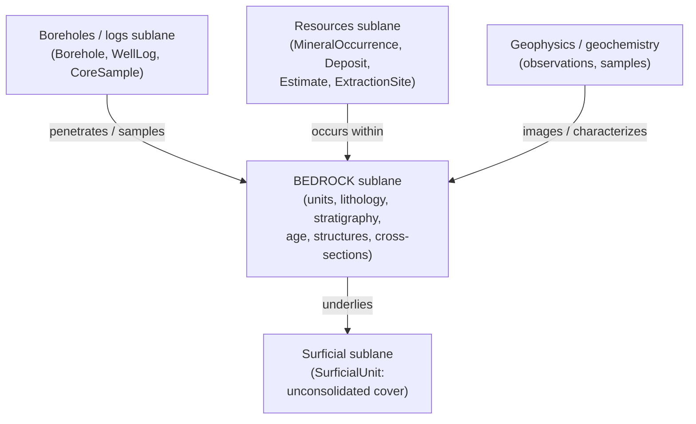

<!-- [KFM_META_BLOCK_V2]
doc_id: kfm://doc/geology-sublane-bedrock
title: Geology — Bedrock Sublane
type: standard
version: v1
status: draft
owners: <geology-domain-steward> · <docs-steward>   # placeholder — confirm in CODEOWNERS
created: 2026-06-04
updated: 2026-06-04
policy_label: public
related:
  - docs/domains/geology/README.md
  - docs/domains/geology/SCOPE.md
  - docs/domains/geology/SOURCES.md
  - docs/domains/geology/SENSITIVITY.md
  - docs/domains/geology/PRESERVATION_MATRIX.md
  - docs/domains/geology/RELEASE_INDEX.md
  - ai-build-operating-contract.md   # CONTRACT_VERSION = "3.0.0"
  - docs/doctrine/directory-rules.md
tags: [kfm, geology, bedrock, sublane, stratigraphy, governance]
notes:
  - Sublane slice of the geology lane scoped to BEDROCK geology. Owns bedrock units, lithology, stratigraphy, age, structures, and cross-sections; explicitly excludes surficial cover (the surficial sublane) and subsurface point records (the boreholes/logs sublane).
  - Doctrine-adjacent; pins CONTRACT_VERSION = "3.0.0".
  - Bedrock/surficial split is CONFIRMED (Atlas §10.A identity; §10.G names a distinct "bedrock unit map" viewing product). Object-family naming drift (§10.B short vs §10.E/§10.C Reference forms) surfaced as CONFLICTED.
  - Bedrock units are the lowest-sensitivity geology content (mostly T0); subsurface/resource detail is out of this sublane. All repo paths PROPOSED.
[/KFM_META_BLOCK_V2] -->

# Geology — Bedrock Sublane

> The bedrock slice of the geology lane (`[DOM-GEOL]`): mapped bedrock units, their lithology, the stratigraphy and age that order them, and the structures and cross-sections that deform and section them. This sublane is mostly public-safe T0 content. It does **not** own surficial cover, subsurface point records, or resource claims — those are sibling sublanes.

| Field | Value |
|---|---|
| **Status** | `draft` |
| **Owners** | `<geology-domain-steward>` · `<docs-steward>` *(placeholders — confirm in CODEOWNERS)* |
| **Parent lane** | Geology / Natural Resources — `[DOM-GEOL]`, Atlas Ch. 10 |
| **Sublane scope** | Bedrock geology (Atlas §10.A bedrock/surficial split; §10.G "bedrock unit map") |
| **Default sensitivity** | Mostly **T0** (`GeologicUnit`/`Lithology` CONFIRMED T0 per §24.14) |
| **Updated** | 2026-06-04 |

> [!IMPORTANT]
> This sublane doc is a **scoped slice**, not a second copy of the lane. The lane-wide boundary, sources, sensitivity, and release rules live in `SCOPE.md`, `SOURCES.md`, `SENSITIVITY.md`, and `RELEASE_INDEX.md`; this doc narrows them to bedrock. Where this doc and a lane-wide doc disagree, the lane-wide doc governs and the conflict is logged in `docs/registers/DRIFT_REGISTER.md`.

---

## Contents

- [1. What the bedrock sublane is](#1-what-the-bedrock-sublane-is)
- [2. Object families this sublane owns](#2-object-families-this-sublane-owns)
- [3. Sublane boundaries (what bedrock is NOT)](#3-sublane-boundaries-what-bedrock-is-not)
- [4. Bedrock source feeds](#4-bedrock-source-feeds)
- [5. Sensitivity posture](#5-sensitivity-posture)
- [6. Viewing product: the bedrock unit map](#6-viewing-product-the-bedrock-unit-map)
- [7. Bedrock-specific anti-collapse](#7-bedrock-specific-anti-collapse)
- [8. Open questions & verification](#8-open-questions--verification)
- [9. Related docs](#9-related-docs)

---

## 1. What the bedrock sublane is

**CONFIRMED doctrine (Atlas §10.A).** The geology lane's one-line identity governs "**bedrock**/surficial geology, stratigraphy, lithology, structures, …" — bedrock and surficial are named as distinct halves at the top of the lane. The bedrock sublane is the half concerned with the **consolidated rock record**: the mapped units of solid rock, their material character, the stratigraphic and chronologic framework that orders them, and the structural features and cross-sections that deform and depict them.

Bedrock is the **anchor sublane** of geology: it is the lowest-sensitivity, most-published content (bedrock unit polygons at map scale), and the other sublanes attach to it — surficial cover sits on it, boreholes penetrate it, resources occur within it, hydrostratigraphy reframes it.

> [!NOTE]
> "Bedrock" here means the rock-record framework, not depth. A unit can crop out at the surface and still be bedrock; what makes it *surficial* sublane content is being unconsolidated cover (alluvium, loess, glacial deposits), which `SurficialUnit` carries — see [§3](#3-sublane-boundaries-what-bedrock-is-not).

[↑ Back to top](#top)

---

## 2. Object families this sublane owns

The bedrock-relevant subset of the lane's `§10.B` owns-list plus the bedrock `§10.C` terms.

> [!CAUTION]
> **Object-family naming drift (CONFLICTED).** Names use the §10.B short forms; §10.C/§10.E use variant forms (`StructureFeature` for `Fault Structure`; `GeologyBoundaryVersion`; `StratigraphicCorrelation`). Canonical set unresolved — see [§8](#8-open-questions--verification) and `SCOPE.md`.

| Object family | What it carries in the bedrock sublane |
|---|---|
| `Geologic Unit` | A mapped body of consolidated rock with attribution (the core bedrock object). |
| `Lithology` | The material character of a bedrock unit (limestone, shale, sandstone, …). |
| `Stratigraphic Interval` | A named interval with bounded contacts ordering the bedrock record. |
| `Geologic Age` | The chronostratigraphic / geochronologic time-scope of a unit or interval, with uncertainty. |
| `StratigraphicCorrelation` *(§10.C)* | The correlation of intervals across locations (interpretive). |
| `Fault Structure` / `StructureFeature` *(§10.E)* | Structural lines/surfaces deforming the bedrock, with sense-of-slip and confidence. |
| `CrossSection` | A 2D interpretive section through the bedrock record (interpretation-versioned). |
| `GeologyBoundaryVersion` *(§10.C)* | The versioned boundary geometry of a bedrock unit (provenance of the line itself). |

> [!NOTE]
> `HydrostratigraphicUnit` is the **bridge** object to hydrology and is owned by the lane, but it is the geology↔hydrology reframing of the bedrock/aquifer framework rather than a pure bedrock object; it is governed primarily through the cross-lane edge (`SCOPE.md §4`), not this sublane.

[↑ Back to top](#top)

---

## 3. Sublane boundaries (what bedrock is NOT)

The bedrock sublane sits among sibling sublanes. The boundaries below keep bedrock from absorbing them.

| Not in this sublane | Owning sublane | Why the line matters |
|---|---|---|
| `SurficialUnit` (alluvium, loess, glacial cover) | Surficial sublane | Surficial cover is unconsolidated and separately mapped; the §10.G "surficial unit map" is a distinct product. |
| `Borehole`, `WellLog`, `CoreSample` (subsurface points) | Boreholes/logs sublane | These are point records with deny-by-default exact geometry; bedrock units are public polygons. Mixing them imports T4 sensitivity into a T0 sublane. |
| `MineralOccurrence`, `ResourceDeposit`, `ResourceEstimate`, `ExtractionSite`, `ReclamationRecord` | Resources sublane | A unit is *where* rock is; a resource is a *claim about value/recoverability* in it. Claim classes stay distinct (`SCOPE.md §5`). |
| `GeophysicalObservation`, `GeochemistrySample` | Geophysics/geochemistry sublane | These characterize the bedrock but are observations/samples, not the mapped unit. |
| Hydrology measurements, soils, hazard risk, ownership | Other lanes | Lane-level non-ownership (`SCOPE.md §3`). |

> [!WARNING]
> The defining bedrock-sublane error is **importing a borehole's exact location into a bedrock map**. A bedrock `GeologicUnit` polygon is public-safe T0; a `Borehole` point is T4 by default. The unit is bedrock-sublane content; the borehole that confirmed it is boreholes-sublane content with its own sensitivity gate.

[↑ Back to top](#top)

---

## 4. Bedrock source feeds

The bedrock-relevant subset of the lane's `§10.D` source families (full typology in `SOURCES.md`).

| Source family | Typical role | Feeds (bedrock) |
|---|---|---|
| KGS data & geologic maps | authority / observation | `GeologicUnit`, `Lithology`, `StratigraphicInterval`, `StructureFeature`, `CrossSection` |
| USGS NGMDB / GeMS | authority / aggregate / modeled | `GeologicUnit`, `StratigraphicInterval`, `GeologicAge` |
| KGS geophysics (where it constrains structure) | observation / modeled | `StructureFeature`, `CrossSection` *(as supporting evidence, not the unit)* |

> [!NOTE]
> The **surficial** KGS feed (`SOURCES.md` family 2) feeds the surficial sublane, not this one. KGS oil-and-gas, LAS well logs, WWC5, and MRDS feed the boreholes/logs and resources sublanes. The bedrock sublane's feeds are predominantly the **authority/observation map sources**, which is part of why it is the lowest-sensitivity sublane.

[↑ Back to top](#top)

---

## 5. Sensitivity posture

| Object family | Default tier | Basis |
|---|---|---|
| `GeologicUnit`, `Lithology` | **T0** | CONFIRMED default — Atlas §24.14 |
| `StratigraphicInterval`, `GeologicAge`, `StratigraphicCorrelation` | T0 | PROPOSED (routine public map content; §10.I) |
| `StructureFeature` / `Fault Structure` | T0 / T1 *(detailed seismotectonic detail T2)* | PROPOSED |
| `CrossSection` | T0 / T1 — **`RealityBoundaryNote` required if reconstruction-heavy** | PROPOSED; interpretive-surface rule |
| `GeologyBoundaryVersion` | T0 | PROPOSED (provenance of a public line) |

> [!IMPORTANT]
> Bedrock is the **public face** of the geology lane: bedrock unit maps are the routine, citeable, T0 product. The one sensitivity nuance is **interpretation**, not location — a reconstruction-heavy `CrossSection` requires a `RealityBoundaryNote` so a drawn surface is not read as observed structure (`SENSITIVITY.md`; Grid C **S→O** in `SOURCE_ROLE_MATRIX.md`). Exact-location sensitivity does not arise in this sublane because point records live elsewhere.

[↑ Back to top](#top)

---

## 6. Viewing product: the bedrock unit map

**PROPOSED viewing product (Atlas §10.G).** §10.G names "bedrock unit map" as a distinct domain viewing product, separate from the surficial unit map and the structure/fault view.

| Aspect | Bedrock unit map |
|---|---|
| Primary geometry | `GeologicUnit` polygons (bedrock) |
| Overlays | `StructureFeature` lines; `StratigraphicInterval` / `GeologicAge` attribution; `CrossSection` lines |
| Layer artifacts | PMTiles / GeoJSON + `LayerManifest` + `TileArtifactManifest` (per `RELEASE_INDEX.md §9`) |
| Cross-cutting | Evidence Drawer, time-aware state, trust badges, correction/stale-state view, governed Focus Mode (CONFIRMED, §10.G) |
| Release tier | T0 public-safe |

> [!NOTE]
> The bedrock unit map binds to the lane's release surface: `release_id → layer_id (bedrock) → viewing_mode`. That chain is what makes a published bedrock map auditable end-to-end (`RELEASE_INDEX.md §9`).

[↑ Back to top](#top)

---

## 7. Bedrock-specific anti-collapse

The lane-wide anti-collapse rules (`SOURCE_ROLE_MATRIX.md §5`) apply; the bedrock-specific cases:

| Collapse to deny | Why it's wrong | Guardrail |
|---|---|---|
| **Modeled unit polygon → observed bedrock** | An interpreted/compiled unit boundary presented as a measured contact | Modeled descriptor with `role_model_run_ref`; never relabeled observed (Grid C **M→O**) |
| **Cross-section → observed structure** | A drawn interpretive section read as measured subsurface fact | `RealityBoundaryNote` + `RepresentationReceipt`; synthetic/interpretive flagged (Grid C **S→O**) |
| **Bedrock unit ↔ surficial unit** | Treating mapped bedrock as the unconsolidated cover above it (or vice versa) | Distinct `GeologicUnit` vs `SurficialUnit` families; the bedrock/surficial split (§10.A) |
| **Unit boundary as a fixed truth** | Citing one `GeologyBoundaryVersion` as the only/eternal boundary | Boundary is versioned; cite the version + its `EvidenceBundle` |
| **Bedrock unit → resource claim** | Implying value/recoverability from the presence of a unit | Resource claim classes are separate (`SCOPE.md §5`); a unit is not a deposit |

[↑ Back to top](#top)

---

## Open questions register

| ID | Question | Owner role | Resolution path |
|---|---|---|---|
| OQ-GEOL-BED-01 | Confirm the bedrock object-family set vs the surficial set — is `SurficialUnit` cleanly partitioned from `GeologicUnit`, or is it a sub-type? | `<geology-domain-steward>` | Schema review of `contracts/domains/geology/`; SCOPE OQ-GEOL-SCOPE-03 |
| OQ-GEOL-BED-02 | Resolve object-family naming drift (`Fault Structure`/`StructureFeature`; `GeologyBoundaryVersion`; `StratigraphicCorrelation`). | `<geology-domain-steward>` | ADR or schema PR; drift entry |
| OQ-GEOL-BED-03 | Ratify the bedrock tier rows beyond the two §24.14-grounded ones (structures, cross-sections, boundary versions). | `<geology-domain-steward>` + `<policy-steward>` | ADR-S-05 extension |
| OQ-GEOL-BED-04 | Confirm the "bedrock unit map" viewing product, its layer manifests, and Evidence Drawer payload. | `<geology-domain-steward>` | `apps/governed-api/` + `schemas/contracts/v1/map/` |

## Open verification backlog

These items remain `NEEDS VERIFICATION` before this document promotes from `draft` to `published`:

1. The bedrock/surficial object partition (OQ-GEOL-BED-01).
2. The canonical bedrock object-family name set (OQ-GEOL-BED-02).
3. The bedrock unit map viewing-product wiring (OQ-GEOL-BED-04).

## Changelog v0 → v1

| Change | Type (per contract §37) | Reason |
|---|---|---|
| Initial bedrock sublane doc authored | new | First geology sublane slice; scope bedrock vs the surficial/borehole/resource siblings |
| Bedrock/surficial split grounded to §10.A + §10.G | clarification | Use the corpus's explicit bedrock vs surficial distinction and the named "bedrock unit map" product |
| Object-family naming drift surfaced as CONFLICTED | new | Consistent with the rest of the geology suite |

> **Backward compatibility.** New file; no prior anchors to preserve. Section anchors introduced here should be treated as stable.

## Definition of done

This document is done enough to enter the repository when:

- it is placed according to Directory Rules (under `docs/domains/geology/`);
- a geology domain steward reviews it;
- the bedrock object-family set matches the dossier (or the dossier is updated in lockstep);
- it is linked from `docs/domains/geology/README.md` and `SCOPE.md`;
- it does not conflict with accepted ADRs;
- any conflict with lane-wide docs or the dossier is logged in `docs/registers/DRIFT_REGISTER.md`;
- the `GENERATED_RECEIPT.json` planned in the authoring notes is wired into CI;
- future changes follow `ai-build-operating-contract.md §37` lifecycle.

[↑ Back to top](#top)

---

## 9. Related docs

- `docs/domains/geology/SCOPE.md` — lane boundary; owned object families; claim-class distinctness.
- `docs/domains/geology/SOURCES.md` — full source-family typology (bedrock feeds are a subset).
- `docs/domains/geology/SENSITIVITY.md` — tier classification & decision lattice.
- `docs/domains/geology/SOURCE_ROLE_MATRIX.md` — anti-collapse grids (Grid C referenced in §7).
- `docs/domains/geology/PRESERVATION_MATRIX.md` — per-family preservation rules.
- `docs/domains/geology/RELEASE_INDEX.md` — release surface; published bedrock layers (§9).
- `docs/domains/geology/README.md` — lane landing page.
- `ai-build-operating-contract.md` — operating law (`CONTRACT_VERSION = "3.0.0"`).
- Atlas Ch. 10 §10.A (bedrock/surficial identity); §10.B / §10.C (object families); §10.G (bedrock unit map viewing product); §10.I (sensitivity); §24.14 (tier defaults).
- Sibling sublane docs *(PROPOSED)*: `SUBLANE-SURFICIAL.md`, `SUBLANE-BOREHOLES.md`, `SUBLANE-RESOURCES.md`.

---

*Last updated: 2026-06-04 · Status: `draft` · `CONTRACT_VERSION = "3.0.0"` · `[DOM-GEOL]` · sublane: bedrock*

[↑ Back to top](#top)
