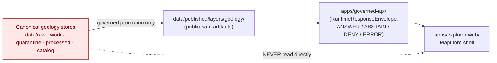
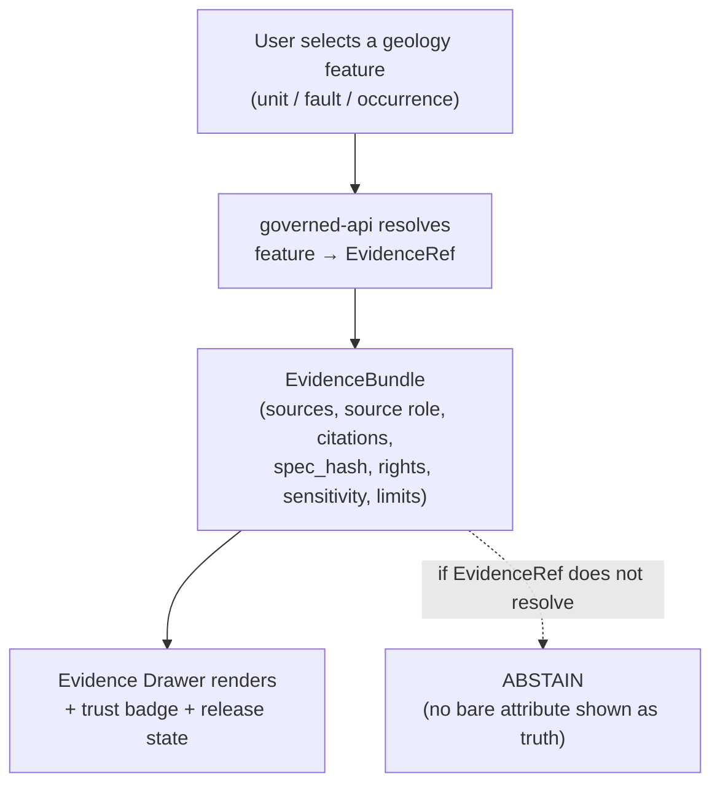

<!-- [KFM_META_BLOCK_V2]
doc_id: kfm://doc/geology-ui-map-surfaces
title: Geology and Natural Resources — UI & Map Surfaces
type: standard
version: v1
status: draft
owners: <geology-domain-steward> · <ui-steward> · <docs-steward>   # placeholder — confirm in CODEOWNERS
created: 2026-06-04
updated: 2026-06-04
policy_label: public
related:
  - docs/domains/geology/README.md
  - docs/domains/geology/SCOPE.md
  - docs/domains/geology/SENSITIVITY.md
  - docs/domains/geology/RELEASE_INDEX.md
  - docs/domains/geology/SUBLANE-BEDROCK.md
  - docs/architecture/maplibre-3d.md
  - ai-build-operating-contract.md   # CONTRACT_VERSION = "3.0.0"
  - docs/doctrine/directory-rules.md
tags: [kfm, geology, ui, map, maplibre, evidence-drawer, governance]
notes:
  - Map-side / UI surface contract for the geology lane. Enumerates the §10.G viewing products and binds each through the governed shell, Evidence Drawer, trust badges, and the trust membrane.
  - Doctrine-adjacent; pins CONTRACT_VERSION = "3.0.0".
  - Renderer posture: MapLibre GL JS is the sole browser-side renderer; Cesium is retired (doctrine-CONFIRMED at directory-rules v1.3; ADR PROPOSED at docs/architecture/maplibre-3d.md, NOT YET FILED). Reflected here.
  - Geology API/UI integration (§10.J) is NEEDS VERIFICATION. Object-family naming drift CONFLICTED. All repo paths PROPOSED.
[/KFM_META_BLOCK_V2] -->

# Geology and Natural Resources — UI & Map Surfaces

> The map layers, viewing modes, and UI surfaces the geology lane exposes — and the governance that wraps every one of them. Each geology surface reads through the governed API (never canonical stores), carries an Evidence Drawer, a trust badge, and a sensitivity-redacted default, and is bound to a `ReleaseManifest`. The renderer is MapLibre GL JS.

-informational)

| Field | Value |
|---|---|
| **Status** | `draft` |
| **Owners** | `<geology-domain-steward>` · `<ui-steward>` · `<docs-steward>` *(placeholders — confirm in CODEOWNERS)* |
| **Viewing products** | `DOM-GEOL §10.G` |
| **Renderer** | **MapLibre GL JS, sole browser-side renderer** (Cesium retired) — directory-rules v1.3; ADR PROPOSED at `docs/architecture/maplibre-3d.md` |
| **Trust law** | MapLibre master Category A (Renderer Boundary & KFM Trust Law) |
| **Lane** | Geology / Natural Resources — `[DOM-GEOL]`, Atlas Ch. 10 |
| **Updated** | 2026-06-04 |

> [!IMPORTANT]
> **No geology map surface is a truth surface by display alone.** Per the KFM Trust Law, no popup, layer, or Focus Mode answer acts as a public truth surface before its `EvidenceBundle`, `LayerManifest`, `PolicyDecision`, `PromotionDecision`, and `ReleaseManifest` exist. A rendered bedrock polygon is a *view of a released claim*, not the claim itself. Where this doc and a manifest disagree, the manifest governs and the drift is logged in `docs/registers/DRIFT_REGISTER.md`.

---

## Contents

- [1. The trust membrane for geology surfaces](#1-the-trust-membrane-for-geology-surfaces)
- [2. Renderer posture (MapLibre, sole)](#2-renderer-posture-maplibre-sole)
- [3. Geology viewing products (§10.G)](#3-geology-viewing-products-10g)
- [4. Cross-cutting UI surfaces](#4-cross-cutting-ui-surfaces)
- [5. The Evidence Drawer for geology](#5-the-evidence-drawer-for-geology)
- [6. Sensitivity at the map surface](#6-sensitivity-at-the-map-surface)
- [7. Layer → manifest → release binding](#7-layer--manifest--release-binding)
- [8. Open questions & verification](#8-open-questions--verification)
- [9. Related docs](#9-related-docs)

---

## 1. The trust membrane for geology surfaces

**CONFIRMED doctrine.** The public geology UI sits behind the trust membrane: it reads released, public-safe artifacts through `apps/governed-api/` and **never** reads `data/raw/`, `data/work/`, `data/quarantine/`, or canonical stores directly (Directory Rules §7.1 trust-membrane; MapLibre master Category A).

> [!WARNING]
> A geology layer that bypasses the governed API — a tile served straight from a canonical store, a direct file read in the client — is a **trust-membrane violation** (Directory Rules §7.1), regardless of whether the data happens to be public-safe. The membrane is the rule, not the data's sensitivity.

[↑ Back to top](#top)

---

## 2. Renderer posture (MapLibre, sole)

> [!NOTE]
> **Renderer decision (CONFIRMED doctrine / PROPOSED ADR).** MapLibre GL JS is KFM's **sole browser-side renderer**; **Cesium is retired** from the architecture. This is doctrine-CONFIRMED at `directory-rules.md` v1.3; the ADR text is drafted at `docs/architecture/maplibre-3d.md` Appendix B and is **NOT YET FILED** against the live ADR set. Every geology surface below — including any 3D cross-section or terrain scene — renders on MapLibre plus its plugin ecosystem (three.js custom layer, `3d-tiles-renderer`, `maplibre-three-plugin`, `deck.gl` interleaved, `pmtiles`, `maplibre-cog-protocol`), not Cesium.

| Geology rendering need | MapLibre mechanism |
|---|---|
| Bedrock / surficial unit polygons | vector tiles (PMTiles) + fill layers |
| Faults / structures | line layers |
| Cross-sections (2D) | line + sidecar; popup/side panel |
| Terrain / geomorphology context | `raster-dem` + `setTerrain` + `hillshade` |
| 3D / interpretive subsurface scenes | three.js custom layer / `deck.gl` interleaved (with `RealityBoundaryNote`) |
| Generalized borehole points | circle layer (generalized geometry only) |

[↑ Back to top](#top)

---

## 3. Geology viewing products (§10.G)

**PROPOSED viewing products (Atlas §10.G).** The lane's named map products, each bound to a sublane and a default sensitivity tier.

> [!CAUTION]
> **Object-family naming drift (CONFLICTED)** affects the layers these products carry (`Borehole`/`BoreholeReference`, etc.) — see `UBIQUITOUS_LANGUAGE.md §3`.

| Viewing product | Sublane | Primary layer(s) | Default tier | Notes |
|---|---|---|---|---|
| **Bedrock unit map** | Bedrock | `GeologicUnit` (bedrock) polygons | T0 | The public face; see `SUBLANE-BEDROCK.md §6`. |
| **Surficial unit map** | Surficial | `SurficialUnit` polygons | T0 | Distinct from bedrock per §10.A split. |
| **Structure / fault view** | Bedrock | `FaultStructure` / `StructureFeature` lines | T0 / T1 | Confidence/uncertainty surfaced where applicable. |
| **Stratigraphy / correlation view** | Bedrock | `StratigraphicInterval`, `StratigraphicCorrelation`, `CrossSection` | T0 / T1 | `RealityBoundaryNote` for reconstruction-heavy sections. |
| **Borehole public-generalized view** | Boreholes/logs | `Borehole` (generalized points) | **T2 (generalized only)** | **Exact locations DENIED by default**; only generalized geometry shown. |
| **Mineral occurrence / deposit summary** | Resources | `MineralOccurrence` (aggregate) | T0 aggregate / T2 detail | `Occurrence` only — never relabeled `Deposit`/`Reserve`. |
| **Extraction / reclamation context** | Resources | `ExtractionSite`, `ReclamationRecord` | T0 / T1 | Private operator/permit detail held back. |

> [!IMPORTANT]
> The **borehole public-generalized view** is the one geology product with a hard sensitivity gate at the surface: it renders generalized geometry only, and the exact-location layer is never published (`SENSITIVITY.md`; `SUBLANE-BEDROCK.md §3`). The view name encodes the rule.

[↑ Back to top](#top)

---

## 4. Cross-cutting UI surfaces

**CONFIRMED doctrine (Atlas §10.G; MapLibre master).** Every geology viewing product is wrapped by the same cross-cutting surfaces:

| Surface | What it does for geology |
|---|---|
| **Evidence Drawer** | Resolves the selected geology feature to its `EvidenceBundle` — sources, source role, citations, `spec_hash`, rights, sensitivity, limitations (see §5). |
| **Time-aware state** | Lets the user move the view across source / observed / valid / release times, which stay distinct per object (§10.E). |
| **Trust badges** | Surface release state, source role, and confidence so a modeled unit is never mistaken for an observed one. |
| **Sensitivity-redacted view** | The default public view; exact subsurface/private-well geometry is generalized or withheld. |
| **Correction / stale-state view** | Surfaces `CorrectionNotice` badges and stale-source warnings on affected layers (`RELEASE_INDEX.md §10`). |
| **Governed Focus Mode** | Bounded AI over released geology evidence — cite-or-abstain, `AIReceipt` mandatory; never the source of truth. |

> [!NOTE]
> These are not optional chrome — they are the surfaces that make a geology map *inspectable*. A layer without an Evidence Drawer binding and a trust badge is not a governed geology surface.

[↑ Back to top](#top)

---

## 5. The Evidence Drawer for geology

The Evidence Drawer is the click-to-truth surface: selecting a geology feature opens its evidence, not just its attributes.

| Drawer field | Geology content |
|---|---|
| Source(s) + role | e.g. KGS geologic map, role `observed` / `authority` |
| Citation | source title, vintage, URL/handle |
| Source role | the seven-class role (`SOURCE_ROLE_MATRIX.md`) — modeled vs observed made explicit |
| Sensitivity | tier + any redaction/generalization applied (`RedactionReceipt`) |
| Limitations | scale, support, interpretation caveats; `RealityBoundaryNote` for cross-sections |
| Release state | `release_id`, published_at, correction/stale badges |

> [!IMPORTANT]
> **Evidence-before-attribute.** If a geology feature's `EvidenceRef` does not resolve to a complete `EvidenceBundle`, the surface `ABSTAIN`s rather than showing the bare attribute as fact (geology §10.K AI-evidence-before-model gate; KFM cite-or-abstain).

[↑ Back to top](#top)

---

## 6. Sensitivity at the map surface

The map is where sensitivity defaults become visible (or, correctly, invisible). The surface enforces what `SENSITIVITY.md` classifies.

| At the surface | Rule |
|---|---|
| Exact borehole / well-log / private-well points | **Not rendered publicly**; generalized layer only (T4 → T1 with `RedactionReceipt`). |
| Mineral occurrence detail | Aggregate density public (T0); per-point detail reviewer-gated (T2). |
| Extraction operator / permit detail | Held back; status/context only. |
| Reconstruction-heavy 3D cross-section | Rendered only with a `RealityBoundaryNote` badge; synthetic ≠ observed. |
| Any layer with unresolved rights | Not published — fails the release gate, never reaches the surface. |

> [!CAUTION]
> The map surface is **fail-closed**: a sensitive geology layer that has not been generalized, reviewed, and receipted does not render publicly. There is no "show it now, redact later" path — the redaction is a precondition of publication, not a post-hoc fix.

[↑ Back to top](#top)

---

## 7. Layer → manifest → release binding

Each rendered geology layer is auditable back to its release decision: `release_id → layer_id → viewing_mode`.

| Layer artifact | Manifest | Binds to |
|---|---|---|
| PMTiles / GeoJSON / GeoParquet (per layer) | `LayerManifest` | the layer's id, source, sensitivity |
| Tile set | `TileArtifactManifest` | digests, cache keys |
| Style | `StyleManifest` | the MapLibre style rules for the layer |
| The release | `ReleaseManifest` | `release_id`, evidence refs, `rollback_target`, signatures (`RELEASE_INDEX.md`) |

> [!NOTE]
> This binding is what makes a geology map *reversible*: a `CorrectionNotice` or `RollbackCard` on a `release_id` propagates to the layer and surfaces a badge in the UI (`RELEASE_INDEX.md §10`). A surface with no manifest binding cannot be corrected or rolled back, and therefore cannot be governed.

[↑ Back to top](#top)

---

## Open questions register

| ID | Question | Owner role | Resolution path |
|---|---|---|---|
| OQ-GEOL-UI-01 | Confirm the geology governed-API surface, route names, and the geology `RuntimeResponseEnvelope` / decision DTO (§10.J). | `<ui-steward>` + `<geology-domain-steward>` | `apps/governed-api/` route registry + tests |
| OQ-GEOL-UI-02 | Confirm `LayerManifest` / `TileArtifactManifest` / `StyleManifest` shapes and the Evidence Drawer payload for geology. | `<ui-steward>` | `schemas/contracts/v1/map/` + viewer tests |
| OQ-GEOL-UI-03 | Confirm the borehole-generalization parameters at the surface (grid size / cell / fuzzing radius). | `<sensitivity-reviewer>` | `PolicyDecision` + `RedactionReceipt` fixtures (mirrors SENSITIVITY / REGISTRY items) |
| OQ-GEOL-UI-04 | Confirm the MapLibre-sole-renderer ADR is filed (currently NOT YET FILED) and the geology 3D cross-section path uses the sanctioned plugin set. | `<ui-steward>` | `docs/architecture/maplibre-3d.md` Appendix B ADR filing |

## Open verification backlog

These items remain `NEEDS VERIFICATION` before this document promotes from `draft` to `published`:

1. The geology governed-API surface and decision envelope (OQ-GEOL-UI-01).
2. The map manifest shapes and Evidence Drawer payload (OQ-GEOL-UI-02).
3. The borehole-generalization surface parameters (OQ-GEOL-UI-03).
4. The renderer-decision ADR filing status (OQ-GEOL-UI-04).

## Changelog v0 → v1

| Change | Type (per contract §37) | Reason |
|---|---|---|
| Initial geology UI & map surfaces doc authored | new | Provide the map-side surface contract complementing the data/source/release docs |
| Renderer posture set to MapLibre-sole (Cesium retired) | clarification | Reflect directory-rules v1.3 / maplibre-3d.md doctrine; flag ADR NOT YET FILED |
| Trust-membrane and Evidence-Drawer binding made explicit | clarification | Tie every surface to governed-API + EvidenceBundle + manifest |

> **Backward compatibility.** New file; no prior anchors to preserve. Section anchors introduced here should be treated as stable.

## Definition of done

This document is done enough to enter the repository when:

- it is placed according to Directory Rules (under `docs/domains/geology/`);
- a geology domain steward and a UI steward review it;
- the viewing-product list matches `DOM-GEOL §10.G` (or the dossier is updated in lockstep);
- the governed-API surface and map manifests are verified (OQ-GEOL-UI-01/-02);
- it is linked from `docs/domains/geology/README.md`;
- it does not conflict with the MapLibre-sole-renderer ADR once filed;
- any conflict with manifests or the dossier is logged in `docs/registers/DRIFT_REGISTER.md`;
- the `GENERATED_RECEIPT.json` planned in the authoring notes is wired into CI;
- future changes follow `ai-build-operating-contract.md §37` lifecycle.

[↑ Back to top](#top)

---

## 9. Related docs

- `docs/domains/geology/RELEASE_INDEX.md` — release surface; layer/manifest binding (§7); correction/rollback (§10).
- `docs/domains/geology/SENSITIVITY.md` — tier classification the surface enforces.
- `docs/domains/geology/SUBLANE-BEDROCK.md` — bedrock unit map viewing product (§6).
- `docs/domains/geology/SOURCE_ROLE_MATRIX.md` — source-role surfaced in the Evidence Drawer.
- `docs/domains/geology/SCOPE.md` — what the lane owns (and what the UI must not claim).
- `docs/domains/geology/README.md` — lane landing page.
- `docs/architecture/maplibre-3d.md` — MapLibre-sole-renderer ADR (PROPOSED; NOT YET FILED).
- `ai-build-operating-contract.md` — operating law, finite outcomes (`CONTRACT_VERSION = "3.0.0"`).
- Atlas Ch. 10 §10.G (viewing products); §10.J (API/UI integration — NEEDS VERIFICATION); §10.K (AI evidence-before-model).
- Master MapLibre Components-Functions-Features v2.1 — Category A (Renderer Boundary & KFM Trust Law); Categories K, M, Q, T, W.

---

*Last updated: 2026-06-04 · Status: `draft` · `CONTRACT_VERSION = "3.0.0"` · `[DOM-GEOL]`*

[↑ Back to top](#top)
