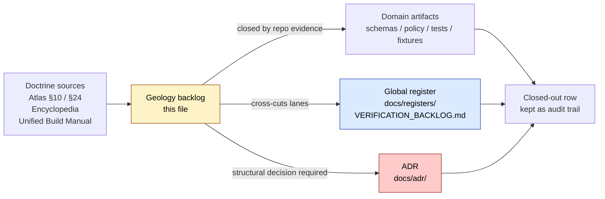
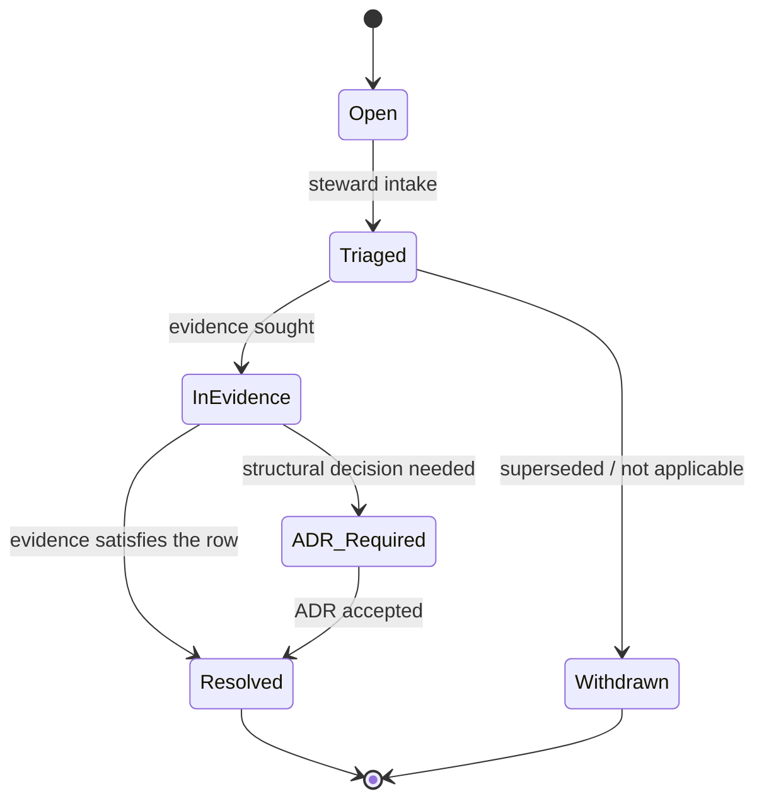

<!-- [KFM_META_BLOCK_V2]
doc_id: kfm://doc/geology-verification-backlog
title: Geology and Natural Resources — Verification Backlog
type: standard
version: v0.1
status: draft
owners: <geology-domain-stewards> · <release-manager> · <security-reviewer>  # TODO: assign in CODEOWNERS
created: 2026-05-17
updated: 2026-06-04
policy_label: public
related:
  - docs/registers/VERIFICATION_BACKLOG.md
  - docs/registers/DRIFT_REGISTER.md
  - docs/registers/AUTHORITY_LADDER.md
  - docs/domains/geology/README.md
  - docs/domains/geology/OPEN_QUESTIONS.md
  - docs/adr/
  - ai-build-operating-contract.md   # CONTRACT_VERSION = "3.0.0"
  - directory-rules.md
tags: [kfm, domain, geology, verification, governance, backlog, register]
notes:
  - Domain-scoped feeder into docs/registers/VERIFICATION_BACKLOG.md (Directory Rules §18).
  - Doctrine-adjacent; pins CONTRACT_VERSION = "3.0.0".
  - Primary rows mirror Atlas §10.N verbatim; supplementary rows are derived from Atlas §10.D/K/I, Encyclopedia §7.8, and Unified Build Manual §10.8 (geology) / §25 (open verification backlog).
  - Citation correction (v0.1 revision): prior "Unified Build Manual §6.11 (30.11)" did not exist; the geology section is §10.8 and the verification backlog is §25. Re-pointed. See changelog.
  - ADR-S identifiers (S-01..S-15) are the real §24.12 Master Open-ADR Backlog set; exact number↔title pairing per row is NEEDS VERIFICATION against the §24.12 table.
[/KFM_META_BLOCK_V2] -->

# Geology and Natural Resources — Verification Backlog

> Domain-scoped register of open verification items, source-rights checks, validator
> gaps, and ADR-class questions for the **Geology and Natural Resources** lane.
> This file feeds the repository-wide `docs/registers/VERIFICATION_BACKLOG.md` and does
> not replace it.

<!-- TODO: replace decorative shields with live CI / coverage / ADR-pass badges once available. -->

| Field | Value |
|---|---|
| **Status** | `draft` — register itself is `NEEDS VERIFICATION` until stewards sign off. |
| **Authority class** | Domain register · subordinate feeder into `docs/registers/VERIFICATION_BACKLOG.md`. |
| **Owners** | `<geology-domain-stewards>` · `<release-manager>` · `<security-reviewer>` *(TODO — assign in `CODEOWNERS`).* |
| **Last reviewed** | 2026-06-04 |
| **Doctrinal basis** | Atlas §10 (Geology and Natural Resources) · Atlas §24.12 (Master Open-ADR Backlog, 15 ADR-S items) · Encyclopedia §7.8 · Unified Build Manual §10.8 (geology) and §25 (open verification backlog) · Directory Rules §12 (Domain Placement Law) and §18 (Open Questions) · `ai-build-operating-contract.md` (`CONTRACT_VERSION = "3.0.0"`). |

---

## Contents

1. [Purpose and scope](#1-purpose-and-scope)
2. [How this register works](#2-how-this-register-works)
3. [Lifecycle of a backlog item](#3-lifecycle-of-a-backlog-item)
4. [Section A — Primary verification backlog](#section-a--primary-verification-backlog)
5. [Section B — Source-rights verification queue](#section-b--source-rights-verification-queue)
6. [Section C — Validators, tests, fixtures](#section-c--validators-tests-fixtures)
7. [Section D — Feature and capability backlog](#section-d--feature-and-capability-backlog)
8. [Section E — Open ADR-class questions](#section-e--open-adr-class-questions)
9. [Section F — Implementation-layer unknowns](#section-f--implementation-layer-unknowns)
10. [Triage cadence and ownership](#triage-cadence-and-ownership)
11. [Open questions](#open-questions)
12. [Related docs](#related-docs)

---

## 1. Purpose and scope

This document is the **Geology and Natural Resources** lane's consolidated verification
backlog. It exists to keep three concerns visible in one place:

- **What still needs to be checked** before a geology artifact (source descriptor,
  schema, policy, validator, release, or rollback target) can be treated as confirmed.
- **What carries open rights or sensitivity uncertainty** that blocks public promotion
  under the geology lane's deny-by-default posture for exact borehole, sample, sensitive
  resource, well-log, and private well locations (Atlas §10.I).
- **What is ADR-class** under Directory Rules §2.4 and SHOULD be elevated to
  `docs/adr/` before a path, schema, policy, or release surface is treated as canonical.

> [!IMPORTANT]
> This is a **domain feeder register**, not a parallel authority. The repository-wide
> verification register is `docs/registers/VERIFICATION_BACKLOG.md` (Directory Rules
> §18). Items closed here MUST be reflected upstream where they cross the geology
> lane boundary; items that are wholly internal to the geology lane MAY remain here.

### In scope

- **Geology object families** *(CONFIRMED doctrine, PROPOSED field realization — Atlas
  §10.B, §10.E)*: `GeologicUnit`, `SurficialUnit`, `Lithology`,
  `StratigraphicInterval`, `GeologicAge`, `FaultStructure`, `Borehole`, `WellLog`,
  `CoreSample`, `GeophysicalObservation`, `GeochemistrySample`, `MineralOccurrence`,
  `ResourceDeposit`, `ExtractionSite`, `ReclamationRecord`, `CrossSection`,
  `HydrostratigraphicUnit`.

  > [!NOTE]
  > **Object-family naming drift (CONFLICTED).** The §10.B owns-list short forms above
  > drift against the §10.C/§10.E variant forms (`BoreholeReference`, `Well LogReference`,
  > `GeochemistrySampleReference`, `StructureFeature`, `GeologyBoundaryVersion`), and
  > `ResourceDeposit` (§10.B) drifts against `ResourceEstimate` (§10.C). Tracked as
  > **GEO-AQ-08** in [Section E](#section-e--open-adr-class-questions).
- **Geology source families** *(Atlas §10.D — all listed `NEEDS VERIFICATION`)*:
  KGS data and maps; KGS surficial geology and geologic maps; USGS NGMDB and GeMS;
  KGS oil and gas wells and production; KCC oil and gas regulatory data; KGS/KDHE
  WWC5 and water-well program; KGS LAS digital well logs and well tops; USGS MRDS.

### Out of scope (other lanes own)

- Hydrology measurements → `docs/domains/hydrology/`.
- Soil property claims → `docs/domains/soil/`.
- Hazards risk decisions → `docs/domains/hazards/`.
- Ownership, lease, permit, and title claims → `docs/domains/people-dna-land/`.
- UI- or AI-shape statements unsupported by an `EvidenceBundle` (always denied or
  abstained per `[GAI]` doctrine).

[⬆ back to top](#top)

---

## 2. How this register works

> [!NOTE]
> The closure protocol diagrammed above is **PROPOSED**. The exact PR template,
> required sign-offs, and audit-trail retention rule are `NEEDS VERIFICATION` until the
> global register and the geology domain `README.md` land in the repo.

### Conformance language

This register inherits the RFC 2119-style usage of Directory Rules §2.2.

| Token | Effect |
|---|---|
| **MUST / MUST NOT** | Non-negotiable. Closure that violates a MUST is not accepted. |
| **SHOULD / SHOULD NOT** | Strong default; deviation needs PR-body justification or a per-row note. |
| **MAY** | Permitted; stay consistent within the geology lane. |

[⬆ back to top](#top)

---

## 3. Lifecycle of a backlog item

| Stage | Definition | Required artifact |
|---|---|---|
| **Open** | Raised in doctrine or in a PR; not yet triaged. | This file + cross-link in PR body. |
| **Triaged** | A steward has read the row and assigned an owner. | Owner + target evidence type recorded in the row. |
| **InEvidence** | Evidence-gathering in progress (registry inspection, fixture run, repo scan). | Linked branch, fixture, or CI check. |
| **Resolved** | Row closed against admissible evidence per the project source hierarchy. | Linked CONFIRMED artifact + entry in the change log. |
| **ADR-Required** | Cannot close without a §2.4 ADR. | Open ADR draft under `docs/adr/`. |
| **Withdrawn** | Superseded, duplicated, or determined out of scope. | Brief justification + supersession link. |

[⬆ back to top](#top)

---

## Section A — Primary verification backlog

> **Source:** Atlas §10.N (verbatim). All four rows are doctrinally listed as
> `NEEDS VERIFICATION` and require admissible repo evidence to close.

| # | Item | Evidence that would settle it | Status | Owner | ADR-class link |
|---|---|---|---|---|---|
| **GEO-VB-01** | Verify KGS and KCC source descriptors. | Mounted repo files, schemas, registry entries, tests, logs, emitted artifacts, review records, or release manifests. | NEEDS VERIFICATION | *(TODO)* | Touches **ADR-S-04** (source-role vocabulary). |
| **GEO-VB-02** | Verify borehole/well-log public policy. | Mounted repo files, schemas, registry entries, tests, logs, emitted artifacts, review records, or release manifests. | NEEDS VERIFICATION | *(TODO)* | Touches **ADR-S-05** (sensitivity tier scheme). |
| **GEO-VB-03** | Define resource classification scheme and tests. | Mounted repo files, schemas, registry entries, tests, logs, emitted artifacts, review records, or release manifests. | NEEDS VERIFICATION | *(TODO)* | **PROPOSED new ADR** — see [Section E](#section-e--open-adr-class-questions), GEO-AQ-04. |
| **GEO-VB-04** | Verify geology API, MapLibre, and Evidence Drawer integration. | Mounted repo files, schemas, registry entries, tests, logs, emitted artifacts, review records, or release manifests. | NEEDS VERIFICATION | *(TODO)* | Resolved by closing **GEO-IU-08** under [Section F](#section-f--implementation-layer-unknowns). |

> [!CAUTION]
> Until **GEO-VB-02** (borehole/well-log public policy) is closed, the geology lane's
> deny-by-default posture for **exact borehole, sample, sensitive resource, well-log,
> and private well locations** MUST remain in force at every public surface
> (Atlas §10.I; Encyclopedia §7.8 risk register). No public release may bypass
> this posture without a documented exception in `docs/registers/DRIFT_REGISTER.md`.
> Sensitive-domain disposition routes through `ai-build-operating-contract.md §23.2` / §23.3.

[⬆ back to top](#top)

---

## Section B — Source-rights verification queue

Atlas §10.D lists **eight** geology source families, all with rights and current
terms in `NEEDS VERIFICATION` and sensitive joins failing closed. Promotion to a
confirmed `SourceDescriptor` requires per-source admissible evidence.

> [!WARNING]
> Per Atlas §10.I and Directory Rules trust-membrane doctrine, **unclear rights**
> blocks public promotion regardless of how clean the pipeline is otherwise. Do not
> publish a geology layer with any row below still marked `NEEDS VERIFICATION` without
> a recorded exception in `docs/registers/DRIFT_REGISTER.md`.

| # | Source family | Role candidates | Rights / sensitivity | Freshness | Status |
|---|---|---|---|---|---|
| **GEO-SR-01** | Kansas Geological Survey (KGS) data and maps | authority / observation / context / model | rights & current terms NEEDS VERIFICATION; sensitive joins fail closed | source-vintage or cadence specific | NEEDS VERIFICATION |
| **GEO-SR-02** | KGS surficial geology and geologic maps | authority / observation / context / model | rights & current terms NEEDS VERIFICATION; sensitive joins fail closed | source-vintage or cadence specific | NEEDS VERIFICATION |
| **GEO-SR-03** | USGS NGMDB and GeMS | authority / observation / context / model | rights & current terms NEEDS VERIFICATION; sensitive joins fail closed | source-vintage or cadence specific | NEEDS VERIFICATION |
| **GEO-SR-04** | KGS oil and gas wells and production | authority / observation / context / model | rights & current terms NEEDS VERIFICATION; sensitive joins fail closed | source-vintage or cadence specific | NEEDS VERIFICATION |
| **GEO-SR-05** | KCC oil and gas regulatory data | authority / observation / context / model / regulatory | rights & current terms NEEDS VERIFICATION; sensitive joins fail closed | source-vintage or cadence specific | NEEDS VERIFICATION |
| **GEO-SR-06** | KGS/KDHE WWC5 and water-well program | authority / observation / context / model | rights & current terms NEEDS VERIFICATION; sensitive joins fail closed | source-vintage or cadence specific | NEEDS VERIFICATION |
| **GEO-SR-07** | KGS LAS digital well logs and well tops | authority / observation / context / model | rights & current terms NEEDS VERIFICATION; sensitive joins fail closed | source-vintage or cadence specific | NEEDS VERIFICATION |
| **GEO-SR-08** | USGS MRDS | authority / observation / context / model | rights & current terms NEEDS VERIFICATION; sensitive joins fail closed | source-vintage or cadence specific | NEEDS VERIFICATION |

> [!NOTE]
> The "Role candidates" column uses the lane's `§10.D` role-envelope phrasing
> (`authority / observation / context / model`). The canonical seven source-role
> classes that a `SourceDescriptor` records are the Atlas §24.1.1 set
> (`observed / regulatory / modeled / aggregate / administrative / candidate /
> synthetic`); reconciling the two vocabularies is part of **GEO-AQ-02** / **ADR-S-04**.

<strong>Per-source verification checklist (apply to each GEO-SR row)</strong>

For each source family, closure requires the following evidence (MUST):

- [ ] Current license / terms-of-use captured in the source descriptor (SPDX ID
      where applicable; raw license text or canonical URL preserved).
- [ ] Source role(s) chosen from the source-role enum *(pending **ADR-S-04** — see
      [Section E](#section-e--open-adr-class-questions))*.
- [ ] Cadence / freshness statement recorded with a source-head check
      (ETag / `Last-Modified` or equivalent).
- [ ] Sovereignty / cultural sensitivity flags recorded where applicable.
- [ ] Sensitive-join class declared and tested against a deny fixture.
- [ ] Public-safe geometry transform path declared if the source carries exact
      coordinates (pending **GEO-AQ-05** thresholds).
- [ ] Source descriptor lives under `data/registry/sources/geology/` per Domain
      Placement Law (Directory Rules §12). *PROPOSED path; verify on mount.*
- [ ] Attribution string recorded for public layers and Evidence Drawer payloads.

[⬆ back to top](#top)

---

## Section C — Validators, tests, fixtures

> **Source:** Atlas §10.K (all `PROPOSED`) and Encyclopedia §7.8. Cross-domain
> validator inheritance (schema, citation, rollback, no-network, etc.) is summarized in
> the collapsible block below and is not duplicated as separate rows.

| # | Validator / test family | Purpose | Status |
|---|---|---|---|
| **GEO-VT-01** | Source-role validators | Prevent collapse of source roles; require the declared role to match the source kind (Atlas §24.1 anti-collapse register). | PROPOSED |
| **GEO-VT-02** | Resource-class anti-collapse tests | Keep `MineralOccurrence`, `ResourceDeposit`, `ResourceEstimate`, permit, production, and reserve claims distinct; deny merges that erase the distinction (Atlas §10.I). | PROPOSED |
| **GEO-VT-03** | Public-safe geometry tests | Confirm exact borehole / sample / sensitive resource / well-log / private well coordinates are generalized or restricted before public emission. | PROPOSED |
| **GEO-VT-04** | Borehole / well-log rights tests | Verify the rights and source-role context required before a borehole or well-log artifact may be promoted to public release. | PROPOSED |
| **GEO-VT-05** | Catalog closure tests | Prove every CATALOG / TRIPLET geology artifact resolves a complete `EvidenceBundle` and `ValidationReport` chain. | PROPOSED |
| **GEO-VT-06** | AI evidence-before-model tests | Prove Focus Mode geology answers resolve `EvidenceRef → EvidenceBundle` before language is composed, and abstain when evidence is insufficient. | PROPOSED |

<strong>Cross-domain validator inheritance (read-only summary)</strong>

In addition to the geology-specific list above, the geology lane MUST also satisfy
the repository-wide validator families documented in Encyclopedia §7.8 and the
unified Validation and Test Plan: schema validation; `SourceDescriptor` validation;
rights validation; sensitivity validation; evidence closure; temporal logic; geometry
validity; policy deny tests; citation validation; release-manifest validation;
rollback drill; no-network fixtures; non-regression tests. Closure of these families
happens in the canonical test homes, not in this register.

[⬆ back to top](#top)

---

## Section D — Feature and capability backlog

> **Source:** Encyclopedia §7.8 (geology feature backlog), Atlas §10.G
> (map and viewing products), and §10.N thin-slice plan. All rows are `PROPOSED` until
> the corresponding evidence path is established. GEO-FB-05 is a **DENY invariant**,
> not a feature to be built.

| # | Group | Feature | Actor / action | Evidence needed | Validation path | Status |
|---|---|---|---|---|---|---|
| **GEO-FB-01** | Build first | Geology source registry + no-network fixture | steward / developer | `SourceDescriptor` + synthetic fixture | schema / source / rights validators | PROPOSED |
| **GEO-FB-02** | Build first | Geology Evidence Drawer inspector | public / researcher / steward | `EvidenceBundle` for one feature | evidence closure + citation tests | PROPOSED |
| **GEO-FB-03** | After proof lane | Geology time slider and compare mode | researcher / steward | versioned observations / layers | temporal-logic tests | PROPOSED |
| **GEO-FB-04** | Ambitious / research | Cross-domain geology analytics and graph queries | researcher / AI assistant | source-backed triples + model receipts | graph-projection tests | PROPOSED |
| **GEO-FB-05** | DENY by default | Unreviewed exact sensitive geology locations or private data | public visitor | policy approval + redaction receipt | policy deny tests | **DENY** *(invariant; not a buildable row)* |
| **GEO-FB-06** | Thin-slice (Atlas §10.N + Encyclopedia §7.8) | One-county geologic-unit fixture with borehole / cross-section evidence and public-safe generalized resource context | steward | `EvidenceBundle`-backed unit inspector | catalog closure + Drawer + citation tests | PROPOSED |

[⬆ back to top](#top)

---

## Section E — Open ADR-class questions

These items intersect Directory Rules §2.4 triggers (schema home, source-role
vocabulary, sensitivity tier scheme, cross-lane joins, stale-state propagation) and
SHOULD NOT be silently closed by a PR. They are routed to `docs/adr/` rather than to
this register.

> [!NOTE]
> ADR-S identifiers below are the real **Atlas §24.12 Master Open-ADR Backlog** set
> (15 ADR-S items, S-01..S-15). The exact **number↔title pairing** per row is
> `NEEDS VERIFICATION` against the §24.12 table; the *subjects* are CONFIRMED.

| # | Question | Why ADR-class | Linked Master Open-ADR (Atlas §24.12) | Status |
|---|---|---|---|---|
| **GEO-AQ-01** | Confirm schema home for geology contracts: `schemas/contracts/v1/domains/geology/...` per ADR-0001 default, or alternative. | Schema-home rule is explicitly ADR-required (Directory Rules §2.4(3)). | **ADR-S-01** (Schema home) — *pairing NEEDS VERIFICATION* | OPEN |
| **GEO-AQ-02** | Source-role vocabulary and evolution rule for geology, reconciling the §10.D role envelope with the §24.1.1 seven-class set. | Source-role anti-collapse is doctrine-significant for resource claims. | **ADR-S-04** (Source-role vocabulary) — *pairing NEEDS VERIFICATION* | OPEN |
| **GEO-AQ-03** | Sensitivity tier scheme (T0–T4) and placement of exact boreholes, samples, sensitive resources, well-logs, and private wells into the deny-by-default tier. | Tier scheme directly governs public release; adoption is doctrine-class. | **ADR-S-05** (Sensitivity tier scheme) — *pairing NEEDS VERIFICATION* | OPEN |
| **GEO-AQ-04** | **Resource classification scheme:** distinct vocabularies and validators for `MineralOccurrence`, `ResourceDeposit`, `ResourceEstimate`, `ExtractionSite`, permit, production, and reserve. | Resource-class anti-collapse is geology-specific doctrine but reaches into release admissibility; vocabulary stability matters. | **PROPOSED new ADR** — *"Geology resource classification scheme."* Closes **GEO-VB-03**. | OPEN |
| **GEO-AQ-05** | Public-geometry transform thresholds for boreholes, samples, sensitive resources, and well-logs. | Defines the operational form of `public-safe geometry tests` (GEO-VT-03); affects every public geology layer. | **PROPOSED new ADR** *(may inherit from a cross-domain transform-profile ADR if one is adopted).* | OPEN |
| **GEO-AQ-06** | Cross-lane join policy: which `Geology × Soil`, `Geology × Hydrology`, `Geology × Hazards`, `Geology × People/Land` joins require steward review, are denied, or are open. | Cross-lane joins are inference-risk multipliers; geology sits on the boundary of soil parent-material, hydrostratigraphy, fault/landslide context, and lease/parcel/operator claims (Atlas §10.F). | **ADR-S-14** (Cross-lane join policy) — *pairing NEEDS VERIFICATION* | OPEN |
| **GEO-AQ-07** | Stale-state propagation: how `ResourceEstimate`, `Borehole`, and source-vintage cadence interact with downstream Hydrology / Hazards consumers. | Cross-lane staleness is a correction-path question (Atlas §24.8). | **ADR-S-10** (Stale-state propagation) — *pairing NEEDS VERIFICATION* | OPEN |
| **GEO-AQ-08** | Object-family naming drift: §10.B owns-list short forms vs §10.C/§10.E `…Reference`/variant forms; `ResourceDeposit` vs `ResourceEstimate`. | Names that feed schema/contract types must be stable before any schema PR pins them. | **PROPOSED new ADR / schema PR** — drift entry. | CONFLICTED |
| **GEO-AQ-09** | Lane-path form: §12 segment (`docs/domains/geology/`, `policy/domains/geology/`) vs Atlas §24.13 flat (`policy/sensitivity/`, `schemas/contracts/v1/geology/`). | Path home is a §2.4 ADR trigger. | **PROPOSED new ADR** — drift entry. | CONFLICTED |

> [!TIP]
> When a GEO-AQ row produces an accepted ADR, do not delete it. Mark the row
> `Resolved`, retain the audit trail, and add a forward link to the ADR id. This
> preserves the doctrinal lineage Directory Rules expects for structural moves.

[⬆ back to top](#top)

---

## Section F — Implementation-layer unknowns

> **Source:** Unified Build Manual §10.8 (Geology and natural resources) and §25
> (Open verification backlog). Repeated here for visibility; closure depends on a
> mounted repository scan and so is bounded per the repository preflight rule. Each
> row is `UNKNOWN` until inspected on a mounted repo.

| # | Implementation unknown | Disposition | Settled by |
|---|---|---|---|
| **GEO-IU-01** | Actual source rights per geology source family. | UNKNOWN | Per-source SPDX ID + license text + cadence captured under `data/registry/sources/geology/` and verified against [Section B](#section-b--source-rights-verification-queue). |
| **GEO-IU-02** | Schema authority (default: `schemas/contracts/v1/domains/geology/` per ADR-0001). | UNKNOWN | Mounted repo inspection + **GEO-AQ-01** closure. |
| **GEO-IU-03** | Package manager and runtime stack supporting geology pipelines and adapters. | UNKNOWN | Mounted inspection of `pipelines/domains/geology/` and `apps/governed-api/`. |
| **GEO-IU-04** | Validator language and harness for geology validators (GEO-VT-01 … GEO-VT-06). | UNKNOWN | Inspect `tools/validators/` and `tests/domains/geology/`. |
| **GEO-IU-05** | Database / graph stack supporting `Geology × Hydrology` hydrostratigraphic links. | UNKNOWN | Cross-domain runtime inspection. |
| **GEO-IU-06** | CI workflows enforcing geology validators and deny fixtures. | UNKNOWN | Inspect `.github/workflows/` for geology-tagged jobs. |
| **GEO-IU-07** | Emitted proofs and signed receipts for geology releases. | UNKNOWN | Inspect `data/proofs/`, `data/receipts/`, and `release/candidates/geology/`. |
| **GEO-IU-08** | Runtime behavior at the geology API, MapLibre adapter, and Evidence Drawer (resolves **GEO-VB-04**). | UNKNOWN | End-to-end smoke against the governed API + Evidence Drawer + MapLibre adapter on a mounted repo. |

> [!NOTE]
> **Renderer posture.** Any geology MapLibre-adapter verification (GEO-IU-08) is now
> bounded by the MapLibre-sole-renderer decision (Cesium retired; doctrine-CONFIRMED at
> `directory-rules.md` v1.3, ADR PROPOSED at `docs/architecture/maplibre-3d.md`, **not
> yet filed**). Confirm the geology adapter targets MapLibre, not Cesium.

[⬆ back to top](#top)

---

## Triage cadence and ownership

> [!NOTE]
> The triage cadence below is **PROPOSED** and mirrors the pattern in Atlas §24.11
> (governance health indicators). It becomes operational when the geology
> entry in `CODEOWNERS` is populated.

- Geology stewards SHOULD review this register at least **once per release cycle**
  and whenever a geology-tagged drift entry lands in
  `docs/registers/DRIFT_REGISTER.md`.
- Every Open / Triaged row SHOULD have a named owner within one review cycle of
  being raised. Rows still unowned at the next cycle SHOULD be reassigned or
  withdrawn with a brief justification.
- Closure of any **GEO-AQ** row requires an accepted ADR (`status: accepted`) and a
  visible link from the ADR to this file.
- Closure of any **GEO-VB / GEO-SR / GEO-VT / GEO-FB / GEO-IU** row requires
  admissible evidence per the project source hierarchy and a PR comment naming the
  artifact that carries it.

### Aging policy *(PROPOSED)*

| Age (since last touch) | Posture |
|---|---|
| ≤ 30 days | Normal; no action required. |
| 31–90 days | Owner SHOULD comment with a status update or reassign. |
| > 90 days | Row is flagged for triage; close, downgrade, withdraw, or escalate to ADR. |

### Closure checklist

When closing a row, an owner MUST:

1. Update the row's `Status` to `CONFIRMED` (or `Withdrawn` with justification).
2. Link the artifact that carried the evidence (schema file, fixture, test, release
   manifest, ADR id, etc.).
3. Mirror the closure to `docs/registers/VERIFICATION_BACKLOG.md` if the row crosses
   the geology lane boundary.
4. If the closure changes any path or schema, follow Directory Rules §14 migration
   discipline.

[⬆ back to top](#top)

---

## Open questions

These are register-level questions, distinct from the per-row items above. They are
not individual backlog entries and SHOULD NOT be closed by PRs against this file;
they SHOULD be elevated to the global register or to ADRs as they harden.

- **OPEN — per-domain register convention.** Is `docs/domains/<domain>/VERIFICATION_BACKLOG.md`
  (this file's pattern) the agreed convention, or should domain items live only in
  `docs/registers/VERIFICATION_BACKLOG.md` with domain tags? *(`NEEDS VERIFICATION`
  against existing per-domain conventions in the mounted repo; if conflict, open
  a `docs/registers/DRIFT_REGISTER.md` entry.)*
- **OPEN — machine-readable sibling.** Should this register have a machine-readable
  index sibling (e.g., `verification_backlog.yaml` in `control_plane/`) so that
  aging and ownership can be reported automatically? *(`NEEDS VERIFICATION`; affects
  `control_plane/` authority class.)*
- **OPEN — ADR supersession.** When a GEO-AQ row produces an ADR, does the ADR
  supersede the row immediately, or does the row stay open until the ADR's
  migration plan is also complete? *(`NEEDS VERIFICATION`; ties into Directory
  Rules §14 migration discipline.)*
- **OPEN — global naming alignment.** The corpus carries both `PROV.md` and
  `PROVENANCE.md` references for the same provenance profile. Whichever name is
  chosen affects how this register links provenance-related evidence rows. *(Flagged
  for ADR resolution — not geology-specific, listed for awareness only.)*

[⬆ back to top](#top)

---

## Related docs

- [`docs/registers/VERIFICATION_BACKLOG.md`](../../registers/VERIFICATION_BACKLOG.md) — repository-wide verification register *(this file feeds it).*
- [`docs/registers/DRIFT_REGISTER.md`](../../registers/DRIFT_REGISTER.md) — conflicts between doctrine and repo state.
- [`docs/registers/AUTHORITY_LADDER.md`](../../registers/AUTHORITY_LADDER.md) — what governs what.
- [`docs/domains/geology/README.md`](./README.md) — geology domain landing page. *(TODO if not yet present.)*
- [`docs/domains/geology/OPEN_QUESTIONS.md`](./OPEN_QUESTIONS.md) — geology open-questions register (`OQ-GEOL-NN`).
- [`docs/adr/`](../../adr/) — Architecture Decision Records, including any ADRs raised from [Section E](#section-e--open-adr-class-questions).
- [`ai-build-operating-contract.md`](../../../ai-build-operating-contract.md) — operating law, §23 sensitive-domain matrix (`CONTRACT_VERSION = "3.0.0"`).
- [`directory-rules.md`](../../../directory-rules.md) — placement law (§12) and open-questions guidance (§18).
- Atlas §10 (Geology and Natural Resources) and §24.12 (Master Open-ADR Backlog) — doctrinal source for this register.
- Encyclopedia §7.8 (Geology and Natural Resources) — feature backlog and risk register.
- Unified Implementation Architecture Build Manual §10.8 (Geology) and §25 (Open verification backlog) — open verification items.

---

**Last updated:** 2026-06-04 · **Lane:** Geology and Natural Resources · **Authority class:** domain feeder register · `CONTRACT_VERSION = "3.0.0"` · [⬆ back to top](#top)
