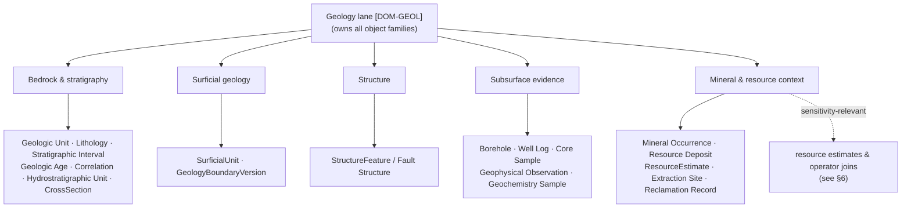

<!-- [KFM_META_BLOCK_V2]
doc_id: kfm://doc/geology-sublanes-index
title: Geology — Sublanes Index
type: standard
version: v1
status: draft
owners: <geology-domain-steward> # PLACEHOLDER — assign before review
created: 2026-06-03
updated: 2026-06-03
policy_label: public
related: [docs/domains/geology/README.md, schemas/contracts/v1/geology/, contracts/geology/, ai-build-operating-contract.md, directory-rules.md]
tags: [kfm]
notes: [CONTRACT_VERSION = "3.0.0"; this is the sublanes index for the Geology lane (Atlas Ch.10, [DOM-GEOL]); the SET of sublanes is INFERRED from the Atlas object families (§E) and viewing products (§G), not a verbatim doctrine list; the docs/domains/<domain>/sublanes/ directory segment is PROPOSED — no Directory Rules section verified establishing it; all repo paths PROPOSED until verified]
[/KFM_META_BLOCK_V2] -->

# 🪨 Geology — Sublanes Index

> Navigation index for the Geology lane's sublanes — the cohesive sub-areas (bedrock & stratigraphy, surficial geology, structure, subsurface evidence, and mineral/resource context) that organize the domain's object families. A sublane is an organizational grouping *inside* the Geology lane; it is not a new domain or a new responsibility root.

<!-- TODO: replace with real Shields.io endpoints (CI, last-updated) once wired -->

| Field | Value |
|---|---|
| **Status** | `draft` |
| **Owners** | `<geology-domain-steward>` *(PLACEHOLDER — assign before review)* |
| **Updated** | 2026-06-03 |
| **Lane** | Geology / Natural Resources `[DOM-GEOL]` (Atlas Ch. 10) |
| **Parent** | [`docs/domains/geology/README.md`](../README.md) |
| **Authority** | `ai-build-operating-contract.md` v3.0 · `directory-rules.md` |

---

## Contents

- [1. What a sublane is](#1-what-a-sublane-is)
- [2. Placement note](#2-placement-note)
- [3. The Geology sublanes](#3-the-geology-sublanes)
- [4. Sublane → object family map](#4-sublane--object-family-map)
- [5. Sublane structure diagram](#5-sublane-structure-diagram)
- [6. Sensitivity across sublanes](#6-sensitivity-across-sublanes)
- [7. What does not belong in a sublane](#7-what-does-not-belong-in-a-sublane)
- [Open questions register](#open-questions-register)
- [Open verification backlog](#open-verification-backlog)
- [Changelog](#changelog-v0--v1)
- [Definition of done](#definition-of-done)
- [Related docs](#related-docs)

---

## 1. What a sublane is

A **sublane** is a cohesive sub-area *inside* the Geology lane — a way to organize the lane's object families so the documentation, schemas, and review surfaces don't become one undifferentiated pile. Geology is wide (bedrock through resource economics), so sublanes keep each cluster legible.

> [!IMPORTANT]
> A sublane is **organizational, not authoritative**. It does not create a new domain, a new responsibility root, or a new authority boundary. The Geology lane still owns all of its object families; the sublanes simply group them. Per Directory Rules, domains are lane segments inside responsibility roots — and a sublane is a finer segment still, never a root.

[↑ Back to top](#contents)

---

## 2. Placement note

**Path (as requested):** `docs/domains/geology/sublanes/README.md`

> [!WARNING]
> **The `sublanes/` directory segment is PROPOSED.** KFM doctrine documents a "sublane docs" *pattern* (used in prior Fauna and Flora work), but I have not verified a Directory Rules section that establishes `docs/domains/<domain>/sublanes/` as a canonical subfolder. The path is consistent with the lane-segment principle (§12) and reasonable, but treat it as `NEEDS VERIFICATION` until confirmed against repo conventions, and log it in `docs/registers/DRIFT_REGISTER.md` if it diverges from how other domains organize sublanes.

Responsibility-root reminder: this index is a `docs/` explainer. The corresponding machine surfaces live under their own roots — schemas at `schemas/contracts/v1/geology/`, object meaning at `contracts/geology/` — and are *not* reorganized by these sublanes unless an ADR says so.

[↑ Back to top](#contents)

---

## 3. The Geology sublanes

> [!NOTE]
> **The sublane set below is INFERRED** from the Atlas Geology object families (§E) and viewing products (§G). It is a reasonable grouping, not a verbatim doctrine list. The Atlas does not enumerate "sublanes" by name; confirm the grouping with the geology steward (see Open questions).

| Sublane | Covers | Primary viewing product (Atlas §G) |
|---|---|---|
| **Bedrock & stratigraphy** | Geologic Unit, Lithology, Stratigraphic Interval, Geologic Age, StratigraphicCorrelation, Hydrostratigraphic Unit, CrossSection | bedrock unit map; stratigraphy/correlation view |
| **Surficial geology** | SurficialUnit, GeologyBoundaryVersion | surficial unit map |
| **Structure** | StructureFeature / Fault Structure | structure/fault view |
| **Subsurface evidence** | Borehole / BoreholeReference, Well Log / Well LogReference, Core Sample, Geophysical Observation, Geochemistry Sample / SampleReference | borehole public-generalized view |
| **Mineral & resource context** | Mineral Occurrence, Resource Deposit, ResourceEstimate, Extraction Site, Reclamation Record | mineral occurrence/deposit summary; extraction/reclamation context |

Each sublane, once confirmed, would carry its own docs under this folder (e.g., `bedrock-stratigraphy/README.md`) following the domain doc-suite pattern. The names above are PROPOSED slugs.

[↑ Back to top](#contents)

---

## 4. Sublane → object family map

CONFIRMED object-family spine (Atlas §E) / PROPOSED sublane grouping. Every Geology object family is assigned to exactly one sublane; no family is owned by two sublanes.

| Object family (`[DOM-GEOL]`) | Sublane |
|---|---|
| Geologic Unit | Bedrock & stratigraphy |
| Lithology | Bedrock & stratigraphy |
| Stratigraphic Interval | Bedrock & stratigraphy |
| Geologic Age | Bedrock & stratigraphy |
| StratigraphicCorrelation | Bedrock & stratigraphy |
| Hydrostratigraphic Unit | Bedrock & stratigraphy |
| CrossSection | Bedrock & stratigraphy |
| SurficialUnit | Surficial geology |
| GeologyBoundaryVersion | Surficial geology |
| StructureFeature / Fault Structure | Structure |
| Borehole / BoreholeReference | Subsurface evidence |
| Well Log / Well LogReference | Subsurface evidence |
| Core Sample | Subsurface evidence |
| Geophysical Observation | Subsurface evidence |
| Geochemistry Sample / SampleReference | Subsurface evidence |
| Mineral Occurrence | Mineral & resource context |
| Resource Deposit | Mineral & resource context |
| ResourceEstimate | Mineral & resource context |
| Extraction Site | Mineral & resource context |
| Reclamation Record | Mineral & resource context |

> [!NOTE]
> The Atlas uses two name variants for several families (e.g., `Borehole` in §B vs `BoreholeReference` in §E; `Mineral Occurrence` consistently). Both are shown above; the canonical name is set by the schema (`schemas/contracts/v1/geology/`) per ADR-0001, not by this index.

[↑ Back to top](#contents)

---

## 5. Sublane structure diagram

[↑ Back to top](#contents)

---

## 6. Sensitivity across sublanes

Geology is not a deny-by-default lane like Flora rare-plant locations, but its sublanes carry uneven risk. The boundary discipline matters most at the **resource** sublane.

| Sublane | Sensitivity posture |
|---|---|
| Bedrock & stratigraphy | Generally public-safe (published geologic maps). |
| Surficial geology | Generally public-safe. |
| Structure | Generally public-safe. |
| Subsurface evidence | Boreholes published as **public-generalized** view (Atlas §G); precise private well data may carry rights/owner constraints. |
| Mineral & resource context | **Most sensitivity-relevant.** ResourceEstimate is `modeled` (never an observed reserve fact); operator/lease/parcel joins cannot prove deposits and must respect People/Land privacy. |

> [!CAUTION]
> **Geology explicitly does not own ownership/lease/permit/title claims** (Atlas §B). A resource or extraction record must not be joined to a private operator or parcel in a way that asserts what the geology cannot prove — "lease, parcel, operator relation cannot prove deposits" (Atlas §F). `ResourceEstimate` is a modeled product carrying `role_model_run_ref`, never an observed quantity. `[DOM-GEOL]`

[↑ Back to top](#contents)

---

## 7. What does not belong in a sublane

- **Hydrology measurements, soils, hazards risk** — context only; Geology cites, never owns (Atlas §B).
- **Ownership / lease / permit / title claims** — People/Land owns these; a sublane references but cannot assert them.
- **Machine schemas** — `schemas/contracts/v1/geology/`, not reorganized by these doc sublanes.
- **A new domain or root** — a sublane is a grouping inside the Geology lane, never a promotion to lane or root status.

[↑ Back to top](#contents)

---

## Open questions register

| ID | Question | Owner role | Resolution path |
|---|---|---|---|
| OQ-GEOL-SUB-01 | Is `docs/domains/<domain>/sublanes/` an established directory convention, or should sublanes be flat sections in the lane README? | docs steward | Directory Rules check; compare to how Fauna/Flora organize sublanes; `DRIFT_REGISTER` if divergent. |
| OQ-GEOL-SUB-02 | Is the five-sublane grouping (§3) the steward's intended partition, or should it differ (e.g., split geophysics from geochemistry)? | geology steward | Steward decision against the Atlas object families. |
| OQ-GEOL-SUB-03 | What are the canonical sublane slugs (`bedrock-stratigraphy`, etc.)? | docs steward | Naming decision consistent with lane conventions. |
| OQ-GEOL-SUB-04 | What is the sensitivity policy home for the resource sublane (operator/lease joins)? | policy reviewer | `policy/domains/geology/` (PROPOSED) + cross-lane join policy ADR-S-14. |

## Open verification backlog

These items remain `NEEDS VERIFICATION` before promotion from `draft` to `published`:

1. The `sublanes/` directory convention (vs. flat README sections).
2. The intended sublane partition and slugs.
3. Canonical object-family names (schema-driven).
4. Resource-sublane sensitivity/join policy home.
5. Reviewer / steward owners (currently PLACEHOLDER).

## Changelog v0 → v1

| Change | Type (per contract §37) | Reason |
|---|---|---|
| Initial Geology sublanes index created | new | No prior file; sublane set INFERRED from Atlas §E object families and §G viewing products. |

> **Backward compatibility.** New file; no anchors to preserve. The sublane set is INFERRED and may be re-partitioned by the steward.

## Definition of done

This document is done enough to enter the repository when:

- the `sublanes/` placement convention is confirmed (or the doc is relocated/flattened) per Directory Rules;
- the geology steward confirms or revises the §3 sublane partition;
- a docs steward reviews it;
- it is linked from `docs/domains/geology/README.md`;
- it does not conflict with accepted ADRs (notably ADR-0001 schema home);
- any convention divergence is logged in `docs/registers/DRIFT_REGISTER.md`;
- the `GENERATED_RECEIPT.json` planned in Section 2 is wired into CI;
- placeholder owners and sublane slugs are resolved.

---

### Related docs

- [`docs/domains/geology/README.md`](../README.md) — Geology lane orientation *(parent; TODO confirm)*
- `schemas/contracts/v1/geology/` — Geology object schemas (canonical names)
- `contracts/geology/` — Geology object meaning
- `policy/domains/geology/` — Geology policy bundle *(PROPOSED)*
- `ai-build-operating-contract.md` — operating contract (`CONTRACT_VERSION = "3.0.0"`)
- `directory-rules.md` — placement law (§12 Domain Placement Law)

**Last updated:** 2026-06-03 · **Contract:** `CONTRACT_VERSION = "3.0.0"`

[↑ Back to top](#contents)
