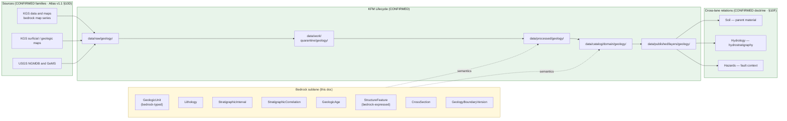

<!-- [KFM_META_BLOCK_V2]
doc_id: kfm://doc/geology-sublane-bedrock
title: Geology Sublane — Bedrock
type: standard
version: v2
status: draft
owners: <geology-domain-steward> (placeholder — verify against repo CODEOWNERS)
created: 2026-05-17
updated: 2026-06-03
policy_label: public
related:
  - docs/domains/geology/README.md                 # PROPOSED — verify presence
  - docs/domains/geology/sublanes/surficial.md      # PROPOSED sibling
  - docs/domains/geology/sublanes/structures.md     # PROPOSED sibling
  - docs/domains/geology/sublanes/stratigraphy.md   # PROPOSED sibling
  - docs/domains/hydrology/                         # cross-lane: hydrostratigraphy
  - docs/domains/soil/                              # cross-lane: parent material
  - docs/domains/hazards/                           # cross-lane: fault / subsidence context
  - schemas/contracts/v1/domains/geology/           # PROPOSED schema home (ADR-0001 default)
  - contracts/domains/geology/                      # PROPOSED semantic contract home
  - policy/domains/geology/                          # PROPOSED policy home
  - data/published/layers/geology/                  # PROPOSED layer outputs
  - ai-build-operating-contract.md                  # canonical operating contract
  - directory-rules.md                              # §12 Domain Placement Law, §5 Canonical Root Tree
  - docs/registers/DRIFT_REGISTER.md                # terminology-drift + sublane-folder routing
tags: [kfm, geology, bedrock, lithostratigraphy, sublane]
notes:
  - "CONTRACT_VERSION = 3.0.0 pinned per ai-build-operating-contract.md."
  - "v2 reconciliation: object-family names aligned to Atlas v1.1 Ch. 10C canonical casing. Prior v1 used FaultStructure (drift); corrected to StructureFeature. See Changelog and DRIFT_REGISTER routing."
  - "The docs/domains/<domain>/sublanes/<sublane>.md path is PROPOSED. Directory Rules §12 establishes the responsibility-root lane pattern and shows docs/domains/<domain>/ as a directory, but does not enumerate a sublanes/ subfolder. Resolve via ADR before this layout is treated as canon."
  - "Owners, CI badge URLs, and exact related-doc paths are placeholders pending mounted-repo verification."
[/KFM_META_BLOCK_V2] -->

# 🪨 Geology Sublane — Bedrock

> Governance, semantics, and publication posture for **bedrock geology** inside the KFM Geology / Natural Resources domain lane. Bedrock here means consolidated rock units (formations, members, groups, lithologies, ages, contacts, and bedrock-expressed structures) — as distinct from the surficial sublane, which owns unconsolidated cover.

[](#)
[](#)
[](#)
[](#)
[](#)
[](#)
[](#)

**Status:** draft · **Owners:** `<geology-domain-steward>` *(placeholder)* · **Contract:** `CONTRACT_VERSION = "3.0.0"` · **Last updated:** 2026-06-03

> [!IMPORTANT]
> **Sublane folder is PROPOSED.** Directory Rules §12 (Domain Placement Law) establishes the lane pattern and shows `docs/domains/<domain>/` as a directory, but it does **not** enumerate a `sublanes/` subfolder. The path used here — `docs/domains/geology/sublanes/bedrock.md` — should be confirmed by an ADR or migrated to a flat-prefix scheme (for example `docs/domains/geology/SUBLANE-BEDROCK.md`) before the structure is treated as canonical. See [§13 — Open Questions](#13--open-questions) and the [Open Questions Register](#open-questions-register).

> [!NOTE]
> **v2 terminology reconciliation.** This revision aligns object-family names to the **Atlas v1.1 Ch. 10C** canonical set. The prior v1 used `FaultStructure`; the Atlas canonical term is **`StructureFeature`**. This was terminology drift, now corrected here and routed to `docs/registers/DRIFT_REGISTER.md`. See the [Changelog](#changelog-v1--v2).

---

## Mini-TOC

- [1 · Scope](#1--scope)
- [2 · Repo Fit](#2--repo-fit)
- [3 · Inputs](#3--inputs)
- [4 · Exclusions](#4--exclusions)
- [5 · Sublane Map (Mermaid)](#5--sublane-map-mermaid)
- [6 · Object Families & Ubiquitous Language](#6--object-families--ubiquitous-language)
- [7 · Source Families & Source Roles](#7--source-families--source-roles)
- [8 · Spatial & Temporal Model](#8--spatial--temporal-model)
- [9 · Map & Viewing Products](#9--map--viewing-products)
- [10 · Pipeline Shape (RAW → PUBLISHED)](#10--pipeline-shape-raw--published)
- [11 · Sensitivity, Rights, and Publication Posture](#11--sensitivity-rights-and-publication-posture)
- [12 · Cross-Lane Relations](#12--cross-lane-relations)
- [13 · Open Questions](#13--open-questions)
- [Companion sections](#open-questions-register)
- [Related Docs](#related-docs)

---

## 1 · Scope

**CONFIRMED doctrine / PROPOSED sublane scope.** The bedrock sublane governs the **consolidated-rock surface and subsurface fabric** of the Geology / Natural Resources lane:

- **Lithostratigraphic units** (formations, members, groups) and their map polygons — carried as `GeologicUnit` instances typed to consolidated rock.
- **Lithology** descriptors associated with bedrock units (limestone, shale, sandstone, evaporite, etc.).
- **`StratigraphicInterval`** assignments (formal lithostratigraphic intervals referenced by a unit).
- **Geologic age / chronostratigraphy** (`GeologicAge`) attached to bedrock units.
- **Bedrock-expressed structural features** (`StructureFeature`: faults, folds, contacts) where carried as part of a bedrock map.
- **`CrossSection`** interpretations through bedrock units.
- **`GeologyBoundaryVersion`** — the *interpretation version* and uncertainty attached to a bedrock map.
- Public-safe, generalized **bedrock unit map** delivery.

Doctrine basis: the Geology lane explicitly owns **bedrock/surficial geology, stratigraphy, lithology, structures, geomorphology** and associated subsurface/observational context, and pairs **polygons for units, lines for structures/cross-sections, points for boreholes/samples** (Atlas v1.1 §10A–B; ENCY §7.8).

> [!NOTE]
> "Bedrock" here is a **map sublane**, not a separate bounded context. The bedrock sublane reuses the Geology lane's canonical object families (`GeologicUnit`, `Lithology`, `StratigraphicInterval`, `StratigraphicCorrelation`, `GeologicAge`, `StructureFeature`, `CrossSection`, `GeologyBoundaryVersion`) with semantics narrowed to **consolidated rock**. `SurficialUnit`, `BoreholeReference`, `Well LogReference`, `Geochemistry SampleReference`, `Mineral Occurrence`, `Resource Deposit`, `ResourceEstimate`, and `Extraction Site` remain in their own sublanes when they exist.

[Back to top ↑](#-geology-sublane--bedrock)

---

## 2 · Repo Fit

**PROPOSED placement.** This file lives under the Geology lane segment of the `docs/` responsibility root.

```text
docs/
└── domains/
    └── geology/
        ├── README.md                  # PROPOSED — domain landing
        └── sublanes/                  # PROPOSED — see §13 Open Questions
            ├── bedrock.md             # <— THIS FILE
            ├── surficial.md           # PROPOSED sibling
            ├── stratigraphy.md        # PROPOSED sibling
            ├── structures.md          # PROPOSED sibling
            ├── boreholes-wells.md     # PROPOSED sibling
            ├── geophysics.md          # PROPOSED sibling
            ├── geochemistry.md        # PROPOSED sibling
            └── resources.md           # PROPOSED sibling (mineral/resource/extraction/reclamation)
```

**Directory Rules basis (CONFIRMED against `directory-rules.md`):**

- **§12 Domain Placement Law** — geology is a **lane segment** inside responsibility roots, never a root folder. The example lane uses `docs/domains/<domain>/` as a directory; the `sublanes/` child is an *extension* of that pattern and is **not yet enumerated** in §12.
- **§5 Canonical Root Tree** — `docs/` is the human-facing control-plane root.
- **§4 Placement Protocol (Step 3)** — domain is a segment inside a responsibility root.
- **§13.1 / ADR-0001** — `schemas/contracts/v1/...` is the canonical schema home; `contracts/` retains semantic Markdown only.

**Upstream (doctrine that governs this file):**

- `directory-rules.md` — §12 Domain Placement Law, §5 Canonical Root Tree, §4 Placement Protocol (CONFIRMED).
- `ai-build-operating-contract.md` — canonical operating contract, `CONTRACT_VERSION = "3.0.0"` (CONFIRMED).
- `docs/domains/geology/README.md` — Geology lane charter (PROPOSED; verify presence).
- Atlas v1.1 Ch. 10 — Geology / Natural Resources (CONFIRMED doctrine).
- `kfm_encyclopedia.pdf` §7.8 — Geology and Natural Resources (CONFIRMED doctrine).

**Downstream (artifacts that consume this sublane's semantics):**

- `contracts/domains/geology/` — semantic Markdown contracts for `GeologicUnit`, `StratigraphicInterval`, etc. **(PROPOSED home)**
- `schemas/contracts/v1/domains/geology/` — JSON Schemas per ADR-0001 default. **(PROPOSED home)**
- `policy/domains/geology/` — admissibility and release rules for bedrock layers. **(PROPOSED home)**
- `tests/domains/geology/` and `fixtures/domains/geology/` — bedrock-specific test fixtures. **(PROPOSED home)**
- `data/published/layers/geology/` — released bedrock layer manifests. **(PROPOSED home)**
- `pipeline_specs/geology/` — bedrock ingestion / normalization pipeline specs. **(PROPOSED home)**

[Back to top ↑](#-geology-sublane--bedrock)

---

## 3 · Inputs

Material that **belongs** in or is referenced by this sublane:

- **Bedrock map data** from the Kansas Geological Survey (KGS) and USGS — geologic map polygons (unit codes, lithology, age, source map).
- **Stratigraphic nomenclature** for Kansas bedrock (formation / member / group references).
- **Lithologic descriptions** attached to mapped units.
- **Structural overlays** (`StructureFeature`: faults, contacts) when delivered with a bedrock map.
- **Map metadata** — series, vintage, scale, attribution, license, interpretation version.
- **`CrossSection` interpretations** through bedrock units.
- **Generalization receipts** describing how exact polygon geometry was transformed to public-safe form.

> [!TIP]
> Inputs enter via the standard **`SourceDescriptor` → source-activation decision** path. A KGS bedrock map series is not implicitly active; it requires a recorded source role, license review, attribution, and a recorded activation decision before connectors emit to `data/raw/geology/`. *(The named outcome object `SourceActivationDecision` is PROPOSED — verify the exact term against `contracts/` before treating it as canonical.)*

[Back to top ↑](#-geology-sublane--bedrock)

---

## 4 · Exclusions

Material that **does not** belong here, and where it goes instead:

| Out of scope for bedrock sublane | Lives in | Canonical object family |
|---|---|---|
| Unconsolidated / Quaternary cover units | `docs/domains/geology/sublanes/surficial.md` *(PROPOSED)* | `SurficialUnit` |
| Borehole logs, well logs, core descriptions | `docs/domains/geology/sublanes/boreholes-wells.md` *(PROPOSED)* | `BoreholeReference`, `Well LogReference` |
| Geophysical surveys (seismic, gravity, magnetics) | `docs/domains/geology/sublanes/geophysics.md` *(PROPOSED)* | *(geophysics object family — verify)* |
| Geochemistry samples and assays | `docs/domains/geology/sublanes/geochemistry.md` *(PROPOSED)* | `Geochemistry SampleReference` |
| Mineral occurrences, resource deposits/estimates, extraction, reclamation | `docs/domains/geology/sublanes/resources.md` *(PROPOSED)* | `Mineral Occurrence`, `Resource Deposit`, `ResourceEstimate`, `Extraction Site` |
| Soil map units, components, horizons, properties | `docs/domains/soil/` (Soil lane) | `SoilMapUnit`, `SoilComponent`, … |
| Aquifer / hydrostratigraphic *measurements* | `docs/domains/hydrology/` (Geology contributes `Hydrostratigraphic Unit` context) | `Hydrostratigraphic Unit` (context only) |
| Hazard / risk assessment derived from bedrock structure | `docs/domains/hazards/` (Geology contributes context, not risk) | — |
| Mineral / lease ownership, title, operator records | `docs/domains/people-dna-land/` (Geology cannot prove ownership) | — |
| Cross-cutting governance (`EvidenceBundle`, `RunReceipt`, `ReleaseManifest` semantics) | `contracts/evidence/`, `contracts/runtime/`, `contracts/release/` *(PROPOSED homes)* | — |

> [!WARNING]
> **Anti-collapse.** A bedrock map polygon is **not** a verified exact unit outcrop, **not** a verified subsurface presence at depth, and **not** a resource estimate. Promotion across that boundary requires evidence, source-role discipline, and a release decision — not visual proximity on a map. This mirrors the Geology lane's explicit non-ownership of ownership/lease/permit/title claims (Atlas v1.1 §10B).

[Back to top ↑](#-geology-sublane--bedrock)

---

## 5 · Sublane Map (Mermaid)

PROPOSED — illustrative; reflects doctrine relationships, not a verified runtime graph.



> [!NOTE]
> The lifecycle path `RAW → WORK / QUARANTINE → PROCESSED → CATALOG / TRIPLET → PUBLISHED` is **CONFIRMED doctrine** (Directory Rules §0; Atlas v1.1 §1 Operating Law and §10H). The bedrock semantics overlay on this lifecycle; nothing in the sublane bypasses it.

[Back to top ↑](#-geology-sublane--bedrock)

---

## 6 · Object Families & Ubiquitous Language

CONFIRMED terms (Atlas v1.1 §10C, §10E; cross-domain object-family spine §2.2); PROPOSED field realizations until the geology schema is mounted.

> [!CAUTION]
> **Casing and naming are load-bearing.** The Atlas uses **`StructureFeature`** (not `FaultStructure`), **`SurficialUnit`**, **`Geochemistry SampleReference`**, **`Well LogReference`**, **`Mineral Occurrence`**, **`Resource Deposit`**, and **`Extraction Site`** with these exact forms. Do not silently rename them to industry-generic equivalents. The v1 form `FaultStructure` was drift and is corrected here.

| Term | Bedrock-sublane meaning | Identity (PROPOSED) | Citation |
|---|---|---|---|
| **`GeologicUnit`** | A consolidated-rock mapping unit (formation/member/group) as carried by a specific bedrock map series. | `source_id + object_role + temporal_scope + normalized_digest` | Atlas §10C/E; ENCY §7.8 |
| **`Lithology`** | The rock-type descriptor associated with a bedrock unit (e.g., limestone, shale, sandstone). | A **descriptor of** a `GeologicUnit`, not a free-standing object on a map. | Atlas §10C |
| **`StratigraphicInterval`** | A formal lithostratigraphic interval (formation/member/group) referenced by a unit. | Same as above. | Atlas §10C |
| **`StratigraphicCorrelation`** | A correlation assertion across mapped units; **interpretive** — never raised to canonical map fact without evidence. | Same as above. | Atlas §10C |
| **`GeologicAge`** | A chronostratigraphic age (period / epoch / stage) attached to a bedrock unit. | Vocabulary-bounded; tracked against the source map's age system. | Atlas §10C |
| **`StructureFeature`** | A structural feature delivered with the bedrock map (fault trace, fold, contact). *(Corrects v1 `FaultStructure`.)* | Same identity basis. | Atlas §10C/E |
| **`CrossSection`** | Interpretive section through bedrock units; carries its own evidence and interpretation version. | Same identity basis. | Atlas §10E; ENCY §7.8 |
| **`GeologyBoundaryVersion`** | Tracks **interpretation version and uncertainty** for a bedrock map. Each refit / rebound of a unit is a new version, not an overwrite. | Same identity basis. | Atlas §10C/E |

> [!IMPORTANT]
> A bedrock map polygon's identity is **bound to its source map series and vintage**, not to the rock itself. Re-mapping the same outcrop produces a new `GeologyBoundaryVersion`, not a correction of the prior unit's truth value.

<details>
<summary><b>Geology lane object families not owned by the bedrock sublane</b></summary>

These belong to sibling sublanes. Listed here for terminology fidelity (Atlas v1.1 §2.2, §10C/E):

- `SurficialUnit` — unconsolidated cover (surficial sublane).
- `BoreholeReference`, `Well LogReference` — subsurface observations (boreholes-wells sublane).
- `Geochemistry SampleReference` — geochemistry sublane.
- `Mineral Occurrence`, `Resource Deposit`, `ResourceEstimate`, `Extraction Site` — resources sublane.

The bedrock sublane may **reference** these via cross-lane relations, but MUST NOT promote their content onto a bedrock layer.

</details>

[Back to top ↑](#-geology-sublane--bedrock)

---

## 7 · Source Families & Source Roles

CONFIRMED source families (Atlas v1.1 §10D). The Geology lane's source ledger is broader than bedrock alone; the families below are the bedrock-relevant subset plus the lane families a bedrock sublane MUST NOT silently co-opt.

| Source family | Bedrock relevance | Source-role posture (CONFIRMED doctrine) | Citation |
|---|---|---|---|
| **KGS data and maps** | Primary bedrock-map authority for Kansas. | authority / observation / context / model **as source role requires**; rights & current terms **NEEDS VERIFICATION**; sensitive joins fail closed. | Atlas §10D |
| **KGS surficial geology and geologic maps** | Bedrock-relevant *only* for the bedrock components of geologic maps; surficial content routes to the surficial sublane. | Same posture. | Atlas §10D |
| **USGS NGMDB and GeMS** | Federal geologic-map database / GeMS schema; compilation-scale bedrock units. | Same posture. | Atlas §10D |
| KGS oil and gas wells and production | **Out of bedrock scope** — subsurface/production; resources & boreholes sublanes. | Same posture; sensitive joins fail closed. | Atlas §10D |
| KCC oil and gas regulatory data | **Out of bedrock scope** — regulatory/operator. | Same posture. | Atlas §10D |
| KGS/KDHE WWC5 and water-well program | **Out of bedrock scope** — water wells. | Same posture. | Atlas §10D |
| KGS LAS digital well logs and well tops | **Out of bedrock scope** — well logs/tops. | Same posture. | Atlas §10D |
| USGS MRDS | **Out of bedrock scope** — mineral resources; resources sublane. | Same posture. | Atlas §10D |
| USGS 3DEP terrain | `terrain_context` only — never a unit-identity source. | Visual context only. | Atlas (Spatial Foundation §10D / MAP-MASTER) |

> [!WARNING]
> **Source roles cannot be inferred from convenience.** A geophysical anomaly is not a confirmed bedrock unit. A borehole encountering a lithology is not a remapped unit boundary. Promotion of evidence across these roles is a **governed state transition**, not a join. The Atlas posture is explicit: each source's role is "authority / observation / context / model **as source role requires**," and **sensitive joins fail closed**.

> [!CAUTION]
> **License / attribution gate (NEEDS VERIFICATION).** The Atlas marks KGS / USGS "rights and current terms" as **NEEDS VERIFICATION**. KGS / USGS-derived COGs and tile artifacts MUST NOT publish until license and attribution are settled. Bedrock layers MUST fail release when license, source series, or attribution is missing. *(The specific MapLibre-dossier clause IDs cited in v1 — e.g., "ML-057-008" — are not verified in this session and are removed pending confirmation against the dossier.)*

[Back to top ↑](#-geology-sublane--bedrock)

---

## 8 · Spatial & Temporal Model

CONFIRMED doctrine (Atlas v1.1 §10E; ENCY §7.8):

- **Geometry**
  - **Polygons** for bedrock units (`GeologicUnit`).
  - **Lines** for `StructureFeature` (faults, contacts) and `CrossSection` traces.
  - **Cross-sections** as interpretive 2D sections; **3D surfaces / voxels** only when justified, with representation receipts.
- **Interpretation versioning** — every refit produces a new `GeologyBoundaryVersion`; prior versions are preserved in lineage, not overwritten.
- **Uncertainty** — tracked at the unit and at the boundary line (e.g., approximate, inferred, concealed).
- **Temporal handling** (Atlas v1.1 §10E — "source, observed, valid, retrieval, release, and correction times stay distinct where material"):
  - `source_time` (publication date of the source map).
  - `observed_time` (field-mapping date when known).
  - `valid_time` (when the unit is considered current).
  - `retrieval_time` (when KFM pulled the source).
  - `release_time` (KFM release).
  - `correction_time` (when a correction notice has been applied).

> [!TIP]
> Geologic age (Cretaceous, Permian, etc.) and **time-of-mapping** are different. The bedrock sublane must carry **both** — confusing them is a classic anti-collapse failure that the temporal model is built to prevent.

[Back to top ↑](#-geology-sublane--bedrock)

---

## 9 · Map & Viewing Products

PROPOSED sublane products (derived from Atlas v1.1 §10G and the cross-cutting viewing-products doctrine; ENCY §7.8):

| Product | Geometry | Purpose | Status |
|---|---|---|---|
| **Bedrock unit map** | Polygon | Public-safe generalized bedrock unit polygons with unit code, lithology, age, and source vintage. | PROPOSED |
| **Lithology view** | Polygon (derived) | Recolor / re-symbolize the bedrock unit map by lithology class. | PROPOSED |
| **Geologic age view** | Polygon (derived) | Recolor by chronostratigraphic age. | PROPOSED |
| **Bedrock structure overlay** | Line | `StructureFeature` (faults, contacts) delivered with the bedrock map, with uncertainty classes. | PROPOSED |
| **Cross-section view** | Line + 2D section | Interpretive sections through bedrock units; carries representation receipt and evidence burden. | PROPOSED |
| **Interpretation-version diff** | Polygon (compare) | Compare two `GeologyBoundaryVersion` instances; flag changed polygons. | PROPOSED |
| **Uncertainty view** | Polygon (style overlay) | Visualize unit / boundary uncertainty classes. | PROPOSED |

CONFIRMED cross-cutting view doctrine (Atlas §10G "Cross-cutting viewing products"; MAP-MASTER; GAI): every bedrock product participates in **Evidence Drawer, time-aware state, trust badges, sensitivity-redacted view, correction/stale-state view, and governed Focus Mode**. The bedrock sublane does not define its own renderer; it consumes the same governed map shell / Evidence Drawer / AIReceipt envelope as every other lane.

[Back to top ↑](#-geology-sublane--bedrock)

---

## 10 · Pipeline Shape (RAW → PUBLISHED)

CONFIRMED doctrine; PROPOSED sublane application. Promotion is a **governed state transition, not a file move** (Directory Rules §0; Atlas v1.1 §10H).

| Stage | Bedrock-sublane handling | Gate | Status |
|---|---|---|---|
| **RAW** | Capture KGS / USGS bedrock map source payload (geometry as delivered + sidecar metadata) with source role, rights, sensitivity, citation, time, hash. | `SourceDescriptor` exists. | PROPOSED |
| **WORK / QUARANTINE** | Normalize CRS, geometry, attribute schema, unit-code crosswalk, age vocabulary, lithology vocabulary, identity, evidence, rights, policy. Hold failures (e.g., missing attribution, license unconfirmed, unknown unit code). | Validation + policy gate pass, or quarantine reason recorded. | PROPOSED |
| **PROCESSED** | Emit validated normalized `GeologicUnit` objects, `Lithology` descriptors, `GeologicAge` assignments, `StructureFeature` overlays, and public-safe candidate geometry. Emit `EvidenceRef` and `ValidationReport`; close digest. | `EvidenceRef`, `ValidationReport`, digest closure exist. | PROPOSED |
| **CATALOG / TRIPLET** | Emit catalog records, `EvidenceBundle`s, graph/triplet projections (`GeologicUnit` ↔ `Lithology` ↔ `GeologicAge` ↔ `StratigraphicInterval`), and release candidates. | Catalog / proof closure passes. | PROPOSED |
| **PUBLISHED** | Serve released public-safe bedrock layer artifacts (GeoParquet + COG/PMTiles) through governed APIs and a `ReleaseManifest`. | `ReleaseManifest`, correction path, rollback target, and review / policy state exist. | PROPOSED |

> [!CAUTION]
> **Watcher-as-non-publisher invariant.** A bedrock watcher that detects a KGS map series update **MAY emit a candidate `PromotionDecision`**; it MUST NOT write to `data/processed/geology/` or `data/published/layers/geology/` directly. Promotion is reserved to the governed pipeline.

[Back to top ↑](#-geology-sublane--bedrock)

---

## 11 · Sensitivity, Rights, and Publication Posture

CONFIRMED / PROPOSED (Atlas v1.1 §10; ENCY §7.8; operating contract §23.2 sensitive-domain matrix):

- **Bedrock unit polygons** are generally **public-safe when generalized** — public release is *permitted* provided rights, attribution, license, and source role are settled.
- **Resource estimates, extraction sites, exact borehole locations, well-log details, sensitive proprietary geometry** remain in **other sublanes** with deny-by-default or restricted defaults — they MUST NOT be promoted via the bedrock sublane.
- **Anti-collapse rule:** `Mineral Occurrence`, `Resource Deposit`, `ResourceEstimate`, `Extraction Site`, permit, production, and reserve claims must remain distinct from bedrock map units.
- **Default-deny on missing release inputs:** Unclear rights, unresolved source role, missing evidence, unresolved sensitivity, or absent release state **blocks public promotion** (CONFIRMED doctrine; Atlas §1 Operating Law; ENCY; Directory Rules).

> [!IMPORTANT]
> **A bedrock map on the map is not a resource map.** A user clicking a bedrock polygon must see the **bedrock unit identity** plus its `EvidenceBundle` — never a resource estimate, an extraction location, or a borehole location, unless those are independently released by their own sublanes.

[Back to top ↑](#-geology-sublane--bedrock)

---

## 12 · Cross-Lane Relations

CONFIRMED doctrine (Atlas v1.1 §10F). Each relation MUST preserve **ownership, source role, sensitivity, and `EvidenceBundle` support** — none of these are joins of convenience.

| This sublane | Related lane | Relation | Constraint |
|---|---|---|---|
| Bedrock | **Soil** | Bedrock unit → soil **parent material** / surficial context | Bedrock unit does **not** replace soil map unit truth. |
| Bedrock | **Hydrology** | Bedrock unit → **hydrostratigraphy** / aquifer context (`Hydrostratigraphic Unit`) | Bedrock unit does **not** replace hydrologic measurements or aquifer extent claims. |
| Bedrock | **Hazards** | Bedrock `StructureFeature` → **fault / landslide / subsidence** context | Bedrock sublane provides context only; Hazards owns risk. |
| Bedrock | **People / Land** | Bedrock unit ↔ lease / parcel / operator records | A bedrock unit **cannot prove** mineral title, lease validity, or production. |
| Bedrock | **Archaeology** | Bedrock outcrop ↔ rockshelter / quarry context | Bedrock sublane provides geologic context only; Archaeology owns site claims and exact-coordinate denial. |

[Back to top ↑](#-geology-sublane--bedrock)

---

## 13 · Open Questions

| # | Question | Evidence that would settle it | Status |
|---|---|---|---|
| 1 | Is `docs/domains/<domain>/sublanes/<sublane>.md` an accepted layout, or should sublane docs use a flat-prefix scheme (e.g., `docs/domains/geology/SUBLANE-BEDROCK.md`)? | An ADR amending Directory Rules §12, or a mounted-repo precedent in another domain. | NEEDS VERIFICATION |
| 2 | Does the Geology lane carry semantic contracts under `contracts/domains/geology/` (Markdown) and machine schemas under `schemas/contracts/v1/domains/geology/` per ADR-0001? | Mounted-repo inspection; ADR-0001 status. | NEEDS VERIFICATION |
| 3 | Which KGS bedrock map series is the **default** authoritative source for Kansas bedrock, and at what scale? | A source-activation decision for the KGS bedrock series in `data/registry/sources/geology/`. | UNKNOWN |
| 4 | Are KGS license / attribution terms compatible with COG / PMTiles publication for the chosen series? | License review record; the Atlas marks KGS/USGS rights as NEEDS VERIFICATION (§10D). | NEEDS VERIFICATION |
| 5 | What is the canonical age-vocabulary (ICS chart edition / KGS local nomenclature) for bedrock `GeologicAge`? | A vocabulary file under `control_plane/` or `schemas/`. | UNKNOWN |
| 6 | What is the **generalization rule** for the public-safe bedrock unit map (target scale, simplification tolerance, attribute redaction)? | A policy entry under `policy/domains/geology/` plus a generalization receipt fixture. | NEEDS VERIFICATION |
| 7 | How are interpretation-version diffs (`GeologyBoundaryVersion`) surfaced in the Evidence Drawer and in correction notices? | UI / Evidence Drawer payload contract; correction-notice schema. | PROPOSED |
| 8 | Do bedrock `CrossSection`s require an explicit **representation receipt** distinct from the source map's receipt? | An ADR or contract update on 2.5D/3D representation receipts. | PROPOSED |
| 9 | What is the exact name of the source-activation outcome object (`SourceActivationDecision` is PROPOSED)? | `contracts/` semantic-contract inspection. | NEEDS VERIFICATION |

[Back to top ↑](#-geology-sublane--bedrock)

---

## Open questions register

| ID | Question | Owner role | Resolution path |
|---|---|---|---|
| OQ-GEOL-BEDROCK-01 | Accept `sublanes/` subfolder vs flat-prefix scheme under `docs/domains/geology/`. | docs steward + directory-rules owner | ADR amending Directory Rules §12; DRIFT_REGISTER entry until resolved. |
| OQ-GEOL-BEDROCK-02 | Confirm geology contract/schema homes (`contracts/domains/geology/`, `schemas/contracts/v1/domains/geology/`). | geology domain steward | Mounted-repo inspection + ADR-0001 check. |
| OQ-GEOL-BEDROCK-03 | Designate default authoritative KGS bedrock map series + scale. | geology domain steward + source authority | Source-activation decision in `data/registry/sources/geology/`. |
| OQ-GEOL-BEDROCK-04 | Resolve KGS/USGS license + attribution for COG/PMTiles publication. | rights reviewer | License review record; close Atlas §10D NEEDS VERIFICATION. |
| OQ-GEOL-BEDROCK-05 | Reconcile `StructureFeature` vs prior `FaultStructure` drift across all geology docs. | geology domain steward | DRIFT_REGISTER entry + sweep of sibling docs. |

## Open verification backlog

These items remain `NEEDS VERIFICATION` before promotion from `draft` to `published`:

1. Sublane folder layout (`sublanes/` vs flat prefix) — Directory Rules §12 silent.
2. Geology contract/schema homes against mounted repo and ADR-0001.
3. Default KGS bedrock map series and scale.
4. KGS/USGS license and attribution terms for tile/COG publication (Atlas §10D rights = NEEDS VERIFICATION).
5. Exact source-activation outcome object name.
6. MapLibre-dossier clause IDs governing geology tile publication (v1's "ML-057-008" / "ML-062-028..033" unverified; removed pending confirmation).
7. Bedrock `GeologicAge` canonical vocabulary.
8. Generalization rule + receipt fixture for the public-safe bedrock map.

## Changelog v1 → v2

| Change | Type (per contract §37) | Reason |
|---|---|---|
| `FaultStructure` → `StructureFeature` across the doc | reconciliation | Align to Atlas v1.1 §10C/E canonical object-family name; prior form was drift. |
| Expanded §7 source families to the Atlas §10D ledger (KGS data/maps, KGS surficial/geologic maps, USGS NGMDB+GeMS, KGS oil&gas, KCC, WWC5, LAS logs, USGS MRDS) | gap closure | v1 named only generic "KGS"/"USGS"; Atlas lists the full ledger and the bedrock-relevant subset. |
| Removed unverified MapLibre-dossier clause IDs (`ML-057-008`, `ML-062-028..033`) | reconciliation | Could not verify against the dossier in this session; replaced with labeled NEEDS VERIFICATION. |
| Added `CONTRACT_VERSION = "3.0.0"` pin + badge | housekeeping | Doctrine-adjacent doc requirement. |
| Added companion sections (Open Qs register, Verification backlog, Changelog, DoD) | new | Doctrine-doc companion pattern. |
| Labeled `SourceActivationDecision` as PROPOSED | clarification | Exact outcome-object name not verified against `contracts/`. |
| Added object-family fidelity `<details>` block | clarification | Preserve Atlas casing for sibling-sublane families. |

> **Backward compatibility.** Section anchors and the §1–§14 numbering are preserved; §14 "Related Docs" is retained below the new companion sections. The only semantic rename is `FaultStructure` → `StructureFeature`; any inbound links to a `FaultStructure` term anchor may break and are flagged in the DRIFT_REGISTER routing.

## Definition of done

This document is done enough to enter the repository when:

- it is placed according to Directory Rules (sublane-folder question OQ-GEOL-BEDROCK-01 resolved);
- a docs steward and the geology domain steward review it;
- it is linked from the Geology lane `README.md` / doctrine index;
- it does not conflict with accepted ADRs (ADR-0001 schema home; any sublane-folder ADR);
- the `FaultStructure` → `StructureFeature` drift and the sublane-folder question are logged in `docs/registers/DRIFT_REGISTER.md`;
- the `GENERATED_RECEIPT.json` planned in Section 2 is wired into CI;
- future changes follow the operating contract §37 lifecycle.

---

## Related Docs

PROPOSED — verify each path against the mounted repo before linking.

- `docs/domains/geology/README.md` — Geology lane charter.
- `docs/domains/geology/sublanes/surficial.md` — Sibling sublane for unconsolidated cover (`SurficialUnit`).
- `docs/domains/geology/sublanes/structures.md` — Sibling sublane for structural geology (`StructureFeature`).
- `docs/domains/geology/sublanes/stratigraphy.md` — Sibling sublane for stratigraphic correlation.
- `docs/domains/geology/sublanes/boreholes-wells.md` — Sibling sublane for subsurface observations.
- `docs/domains/geology/sublanes/resources.md` — Sibling sublane for mineral / resource / extraction context.
- `docs/domains/hydrology/` — Cross-lane (hydrostratigraphy).
- `docs/domains/soil/` — Cross-lane (parent material).
- `docs/domains/hazards/` — Cross-lane (fault / landslide / subsidence context).
- `directory-rules.md` §12 — Domain Placement Law; §5 Canonical Root Tree; §4 Placement Protocol.
- `ai-build-operating-contract.md` — canonical operating contract (`CONTRACT_VERSION = "3.0.0"`).
- Atlas v1.1 Ch. 10 — Geology / Natural Resources.
- `kfm_encyclopedia.pdf` §7.8 — Geology and Natural Resources.
- `docs/registers/DRIFT_REGISTER.md` — terminology-drift + sublane-folder routing.

---

<details>
<summary><b>Appendix A · Bedrock-sublane checklist (PROPOSED reviewer aid)</b></summary>

A non-normative checklist for PRs that touch bedrock-sublane artifacts. Promote to `docs/runbooks/geology/BEDROCK_REVIEW.md` if it survives use.

- [ ] **Source activation** — `SourceDescriptor` exists; source-activation decision records role, rights, license, attribution.
- [ ] **Source role** — bedrock map source declared as a map authority; not silently used as a subsurface authority.
- [ ] **Schema home** — JSON Schema under `schemas/contracts/v1/domains/geology/...` (ADR-0001 default).
- [ ] **Identity** — `GeologicUnit` identity binds `source_id + object_role + temporal_scope + normalized_digest`.
- [ ] **Interpretation versioning** — every refit produces a new `GeologyBoundaryVersion`; prior versions preserved.
- [ ] **Temporal fields** — source / observed / valid / retrieval / release / correction times carried where material.
- [ ] **Public-safe geometry** — generalization rule applied; generalization receipt emitted.
- [ ] **Anti-collapse** — no `Mineral Occurrence`, `Resource Deposit`, `ResourceEstimate`, `Extraction Site`, or borehole-detail content rides in on the bedrock layer.
- [ ] **Evidence closure** — `EvidenceRef` resolves to a populated `EvidenceBundle`.
- [ ] **Release inputs** — `ReleaseManifest`, correction path, rollback target, review/policy state all present.
- [ ] **License / attribution** — KGS / USGS attribution and license text carried in the `LayerManifest`.
- [ ] **Terminology** — `StructureFeature` (not `FaultStructure`); Atlas casing preserved.
- [ ] **Cross-lane** — soil / hydrology / hazards joins, if any, preserve ownership, source role, and `EvidenceBundle` support.

</details>

<details>
<summary><b>Appendix B · Anti-pattern register (illustrative)</b></summary>

| Anti-pattern | Symptom | Fix |
|---|---|---|
| **Map-as-truth** | A bedrock polygon is treated as verified subsurface presence at depth. | Restate as a *mapped* unit at the source scale; require borehole / geophysics evidence for depth claims. |
| **Lithology = unit** | UI labels the polygon "Limestone" without referencing the `GeologicUnit`. | Render unit identity first (e.g., "Stone Corral Fm"); `Lithology` is a descriptor of the unit. |
| **Silent re-bound** | A new KGS release overwrites the prior unit polygon without a new `GeologyBoundaryVersion`. | Treat every refit as a new version; preserve prior in lineage; emit a correction notice if it changes a published artifact. |
| **License skipped** | A KGS-derived COG / PMTiles bundle goes to release without recorded license / attribution. | Fail release; require license review and attribution in the `LayerManifest` (Atlas §10D rights = NEEDS VERIFICATION). |
| **Resource bleed** | A bedrock layer surfaces resource-estimate attributes on click. | Strip resource attributes; route `Mineral Occurrence` / `ResourceEstimate` claims through the resources sublane with its own policy posture. |
| **Term drift** | A doc reuses `FaultStructure`. | Use `StructureFeature` per Atlas §10C/E; log drift in DRIFT_REGISTER. |
| **Watcher publishes** | A bedrock watcher writes to `data/processed/geology/` or `data/published/layers/geology/`. | Watcher emits candidate decision only; promotion is governed. |

</details>

---

**Last updated:** 2026-06-03 · **Doc status:** draft (v2) · **Authority:** doctrine CONFIRMED / paths PROPOSED · **Contract:** `CONTRACT_VERSION = "3.0.0"` · [Back to top ↑](#-geology-sublane--bedrock)
