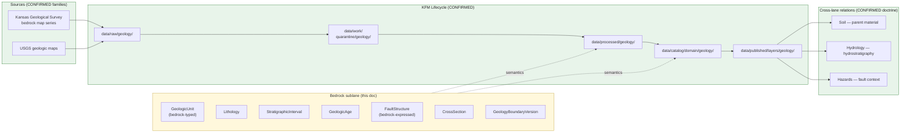

<!-- [KFM_META_BLOCK_V2]
doc_id: kfm://doc/geology-sublane-bedrock
title: Geology Sublane — Bedrock
type: standard
version: v1
status: draft
owners: <geology-domain-steward> (placeholder — verify against repo CODEOWNERS)
created: 2026-05-17
updated: 2026-05-17
policy_label: public
related:
  - docs/domains/geology/README.md          # PROPOSED — verify presence
  - docs/domains/geology/sublanes/surficial.md   # PROPOSED sibling
  - docs/domains/geology/sublanes/structures.md  # PROPOSED sibling
  - docs/domains/geology/sublanes/stratigraphy.md # PROPOSED sibling
  - docs/domains/hydrology/                 # cross-lane: hydrostratigraphy
  - docs/domains/soil/                      # cross-lane: parent material
  - schemas/contracts/v1/domains/geology/   # PROPOSED schema home (ADR-0001 default)
  - policy/domains/geology/                 # PROPOSED policy home
  - data/published/layers/geology/          # PROPOSED layer outputs
tags: [kfm, geology, bedrock, lithostratigraphy, sublane]
notes:
  - The `docs/domains/<domain>/sublanes/<sublane>.md` path is PROPOSED. Directory Rules §12 establishes the responsibility-root lane pattern but does not yet enumerate a `sublanes/` subfolder under `docs/domains/<domain>/`. Resolve via ADR before this layout is treated as canon.
  - Owners, CI badge URLs, and exact related-doc paths are placeholders pending mounted-repo verification.
[/KFM_META_BLOCK_V2] -->

# 🪨 Geology Sublane — Bedrock

> Governance, semantics, and publication posture for **bedrock geology** inside the KFM Geology / Natural Resources domain lane. Bedrock here means consolidated rock units (formations, members, groups, lithologies, ages, contacts, and bedrock-expressed structures) — as distinct from the surficial sublane, which owns unconsolidated cover.

[](#)
[](#)
[](#)
[](#)
[](#)
[](#)

**Status:** draft · **Owners:** `<geology-domain-steward>` *(placeholder)* · **Last updated:** 2026-05-17

> [!IMPORTANT]
> **Sublane folder is PROPOSED.** Directory Rules §12 (Domain Placement Law) does not currently enumerate a `sublanes/` subfolder under `docs/domains/<domain>/`. The path used here — `docs/domains/geology/sublanes/bedrock.md` — should be confirmed by an ADR or migrated to a flat-prefix scheme (for example `docs/domains/geology/SUBLANE-BEDROCK.md`) before the structure is treated as canonical. See [§13 — Open Questions](#13--open-questions).

---

## Mini-TOC

- [1 · Scope](#1--scope)
- [2 · Repo Fit](#2--repo-fit)
- [3 · Inputs](#3--inputs)
- [4 · Exclusions](#4--exclusions)
- [5 · Sublane Map (Mermaid)](#5--sublane-map-mermaid)
- [6 · Object Families & Ubiquitous Language](#6--object-families--ubiquitous-language)
- [7 · Source Families & Source Roles](#7--source-families--source-roles)
- [8 · Spatial & Temporal Model](#8--spatial--temporal-model)
- [9 · Map & Viewing Products](#9--map--viewing-products)
- [10 · Pipeline Shape (RAW → PUBLISHED)](#10--pipeline-shape-raw--published)
- [11 · Sensitivity, Rights, and Publication Posture](#11--sensitivity-rights-and-publication-posture)
- [12 · Cross-Lane Relations](#12--cross-lane-relations)
- [13 · Open Questions](#13--open-questions)
- [14 · Related Docs](#14--related-docs)

---

## 1 · Scope

**CONFIRMED doctrine / PROPOSED sublane scope.** The bedrock sublane governs the **consolidated-rock surface and subsurface fabric** of the Geology / Natural Resources lane:

- **Lithostratigraphic units** (formations, members, groups) and their map polygons.
- **Lithology** descriptors associated with bedrock units (limestone, shale, sandstone, evaporite, etc.).
- **Geologic age / chronostratigraphy** attached to bedrock units.
- **Bedrock-expressed structural features** (faults, folds, contacts) where carried as part of a bedrock map.
- **Bedrock cross-sections** (interpretive sections through bedrock units).
- **GeologyBoundaryVersion** — the *interpretation version* and uncertainty attached to a bedrock map.
- Public-safe, generalized **bedrock unit map** delivery.

Doctrine basis: the Geology lane explicitly owns **bedrock geology, surficial geology, geologic age, structures, geomorphology** and associated subsurface/observational context, and pairs **polygons for units, lines for structures/cross-sections, points for boreholes/samples**.

> [!NOTE]
> "Bedrock" here is a **map sublane**, not a separate bounded context. The bedrock sublane reuses the Geology lane's canonical object families (GeologicUnit, Lithology, StratigraphicInterval, GeologicAge, FaultStructure, CrossSection, GeologyBoundaryVersion) with semantics narrowed to **consolidated rock**. Borehole, well-log, geophysics, geochemistry, mineral, and resource semantics remain in their own sublanes when they exist.

[Back to top ↑](#-geology-sublane--bedrock)

---

## 2 · Repo Fit

**PROPOSED placement.** This file lives under the Geology lane segment of the `docs/` responsibility root.

```text
docs/
└── domains/
    └── geology/
        ├── README.md                  # PROPOSED — domain landing
        └── sublanes/                  # PROPOSED — see §13 Open Questions
            ├── bedrock.md             # <— THIS FILE
            ├── surficial.md           # PROPOSED sibling
            ├── stratigraphy.md        # PROPOSED sibling
            ├── structures.md          # PROPOSED sibling
            ├── boreholes-wells.md     # PROPOSED sibling
            ├── geophysics.md          # PROPOSED sibling
            ├── geochemistry.md        # PROPOSED sibling
            └── resources.md           # PROPOSED sibling (extraction/reclamation)
```

**Upstream (doctrine that governs this file):**

- `directory-rules.md` — §12 Domain Placement Law, §5 Canonical Root Tree (CONFIRMED).
- `docs/domains/geology/README.md` — Geology lane charter (PROPOSED; verify presence).
- `KFM_Domains_Culmination_Atlas_v1_1.pdf` Ch. 10 — Geology / Natural Resources (CONFIRMED doctrine).
- `kfm_encyclopedia.pdf` §7.8 — Geology and Natural Resources (CONFIRMED doctrine).

**Downstream (artifacts that consume this sublane's semantics):**

- `contracts/domains/geology/` — semantic Markdown contracts for `GeologicUnit`, `StratigraphicInterval`, etc. **(PROPOSED home)**
- `schemas/contracts/v1/domains/geology/` — JSON Schemas per ADR-0001 default. **(PROPOSED home)**
- `policy/domains/geology/` — admissibility and release rules for bedrock layers. **(PROPOSED home)**
- `tests/domains/geology/` and `fixtures/domains/geology/` — bedrock-specific test fixtures. **(PROPOSED home)**
- `data/published/layers/geology/` — released bedrock layer manifests. **(PROPOSED home)**
- `pipeline_specs/geology/` — bedrock ingestion / normalization pipeline specs. **(PROPOSED home)**

[Back to top ↑](#-geology-sublane--bedrock)

---

## 3 · Inputs

Material that **belongs** in or is referenced by this sublane:

- **Bedrock map data** from the Kansas Geological Survey (KGS) and USGS — geologic map polygons (unit codes, lithology, age, source map).
- **Stratigraphic nomenclature** for Kansas bedrock (formation / member / group references).
- **Lithologic descriptions** attached to mapped units.
- **Structural overlays** (faults, contacts) when delivered with a bedrock map.
- **Map metadata** — series, vintage, scale, attribution, license, interpretation version.
- **Cross-section interpretations** through bedrock units.
- **Generalization receipts** describing how exact polygon geometry was transformed to public-safe form.

> [!TIP]
> Inputs enter via the standard **SourceDescriptor → SourceActivationDecision** path. A KGS bedrock map series is not implicitly active; it requires a recorded source role, license review, attribution, and a source-activation decision before connectors emit to `data/raw/geology/`.

[Back to top ↑](#-geology-sublane--bedrock)

---

## 4 · Exclusions

Material that **does not** belong here, and where it goes instead:

| Out of scope for bedrock sublane | Lives in |
|---|---|
| Unconsolidated / Quaternary cover units | `docs/domains/geology/sublanes/surficial.md` *(PROPOSED)* |
| Borehole logs, well logs, core descriptions | `docs/domains/geology/sublanes/boreholes-wells.md` *(PROPOSED)* |
| Geophysical surveys (seismic, gravity, magnetics) | `docs/domains/geology/sublanes/geophysics.md` *(PROPOSED)* |
| Geochemistry samples and assays | `docs/domains/geology/sublanes/geochemistry.md` *(PROPOSED)* |
| Mineral occurrences, resource deposits, extraction sites, reclamation | `docs/domains/geology/sublanes/resources.md` *(PROPOSED)* |
| Soil map units, components, horizons, properties | `docs/domains/soil/` (Soil lane) |
| Aquifer / hydrostratigraphic *measurements* | `docs/domains/hydrology/` (Geology contributes hydrostratigraphic *units*) |
| Hazard / risk assessment derived from bedrock structure | `docs/domains/hazards/` (Geology contributes context, not risk) |
| Mineral / lease ownership, title, operator records | `docs/domains/people-dna-land/` (Geology cannot prove ownership) |
| Cross-cutting governance (EvidenceBundle, RunReceipt, ReleaseManifest semantics) | `contracts/evidence/`, `contracts/runtime/`, `contracts/release/` |

> [!WARNING]
> **Anti-collapse.** A bedrock map polygon is **not** a verified exact unit outcrop, **not** a verified subsurface presence at depth, and **not** a resource estimate. Promotion across that boundary requires evidence, source-role discipline, and a release decision — not visual proximity on a map.

[Back to top ↑](#-geology-sublane--bedrock)

---

## 5 · Sublane Map (Mermaid)

PROPOSED — illustrative; reflects doctrine relationships, not a verified runtime graph.



> [!NOTE]
> The lifecycle path `RAW → WORK/QUARANTINE → PROCESSED → CATALOG/TRIPLET → PUBLISHED` is **CONFIRMED doctrine** (Directory Rules §0; Atlas v1.1 §10). The bedrock semantics overlay on this lifecycle; nothing in the sublane bypasses it.

[Back to top ↑](#-geology-sublane--bedrock)

---

## 6 · Object Families & Ubiquitous Language

CONFIRMED terms (Atlas v1.1 §10C); PROPOSED field realizations until the geology schema is mounted.

| Term | Bedrock-sublane meaning | Identity (PROPOSED) | Citation |
|---|---|---|---|
| **GeologicUnit** | A consolidated-rock mapping unit (formation/member/group) as carried by a specific bedrock map series. | `source_id + object_role + temporal_scope + normalized_digest` | Atlas v1.1 §10C; ENCY §7.8 |
| **Lithology** | The rock-type descriptor associated with a bedrock unit (e.g., limestone, shale, sandstone). | Same as above; lithology is a **descriptor of** a `GeologicUnit`, not a free-standing object on a map. | Atlas v1.1 §10C |
| **StratigraphicInterval** | A formal lithostratigraphic interval (formation/member/group) referenced by a unit. | Same as above. | Atlas v1.1 §10C |
| **StratigraphicCorrelation** | A correlation assertion across mapped units; **interpretive** — never raised to canonical map fact without evidence. | Same as above. | Atlas v1.1 §10C |
| **GeologicAge** | A chronostratigraphic age (period / epoch / stage) attached to a bedrock unit. | Vocabulary-bounded; tracked against the source map's age system. | Atlas v1.1 §10C |
| **FaultStructure** | A structural feature delivered with the bedrock map (fault trace, contact). | Same identity basis. | Atlas v1.1 §10C |
| **CrossSection** | Interpretive section through bedrock units; carries its own evidence and interpretation version. | Same identity basis. | ENCY §7.8 |
| **GeologyBoundaryVersion** | Tracks **interpretation version and uncertainty** for a bedrock map. Each refit / rebound of a unit is a new version, not an overwrite. | Same identity basis. | Atlas v1.1 §10C |

> [!IMPORTANT]
> A bedrock map polygon's identity is **bound to its source map series and vintage**, not to the rock itself. Re-mapping the same outcrop produces a new `GeologyBoundaryVersion`, not a correction of the prior unit's truth value.

[Back to top ↑](#-geology-sublane--bedrock)

---

## 7 · Source Families & Source Roles

CONFIRMED source families (ENCY §7.8; Atlas v1.1):

- **Kansas Geological Survey (KGS)** — bedrock map series for Kansas.
- **USGS** — federal geologic map series and compilations (state geologic maps, national-scale syntheses).

PROPOSED source-role assignments for the bedrock sublane:

| Source family | PROPOSED source role | Cannot prove | Notes |
|---|---|---|---|
| KGS bedrock map series | `bedrock_map_authority` (interpretive map; not subsurface observation) | Subsurface presence at arbitrary depth; resource estimates; ownership. | Subject to license review and attribution gates. |
| USGS state / national geologic maps | `bedrock_map_authority` (compilation scale) | Local-scale unit detail beyond compilation scale. | Generalization vs. KGS state-scale must be made explicit in the LayerManifest. |
| 3DEP terrain (EXT-3DEP) | `terrain_context` only | Bedrock unit identity. | Used as visual context, never as a unit-identity source. |

> [!WARNING]
> **Source roles cannot be inferred from convenience.** A geophysical anomaly is not a confirmed bedrock unit. A borehole encountering a lithology is not a remapped unit boundary. Promotion of evidence across these roles is a **governed state transition**, not a join.

License/attribution gate (CONFIRMED from MapLibre dossier, ML-057-008): KGS-derived COGs and tile artifacts may only be published after license review. Bedrock layers MUST fail release when license, source series, or attribution is missing.

[Back to top ↑](#-geology-sublane--bedrock)

---

## 8 · Spatial & Temporal Model

CONFIRMED doctrine (ENCY §7.8D):

- **Geometry**
  - **Polygons** for bedrock units.
  - **Lines** for faults, contacts, and cross-section traces.
  - **Cross-sections** as interpretive 2D sections; **3D surfaces / voxels** only when justified, with representation receipts.
- **Interpretation versioning** — every refit produces a new `GeologyBoundaryVersion`; prior versions are preserved in lineage, not overwritten.
- **Uncertainty** — tracked at the unit and at the boundary line (e.g., approximate, inferred, concealed).
- **Temporal handling** (Atlas v1.1 §10E)
  - `source_time` (publication date of the source map).
  - `observed_time` (field-mapping date when known).
  - `valid_time` (when the unit is considered current).
  - `retrieval_time` (when KFM pulled the source).
  - `release_time` (KFM release).
  - `correction_time` (when a correction notice has been applied).
  - These stay **distinct** wherever they materially diverge.

> [!TIP]
> Geologic age (Cretaceous, Permian, etc.) and **time-of-mapping** are different. The bedrock sublane must carry **both** — confusing them is a classic anti-collapse failure that the temporal model is built to prevent.

[Back to top ↑](#-geology-sublane--bedrock)

---

## 9 · Map & Viewing Products

PROPOSED sublane products (derived from Atlas v1.1 §10G; ENCY §7.8E and §11):

| Product | Geometry | Purpose | Status |
|---|---|---|---|
| **Bedrock unit map** | Polygon | Public-safe generalized bedrock unit polygons with unit code, lithology, age, and source vintage. | PROPOSED |
| **Lithology view** | Polygon (derived) | Recolor / re-symbolize the bedrock unit map by lithology class. | PROPOSED |
| **Geologic age view** | Polygon (derived) | Recolor by chronostratigraphic age. | PROPOSED |
| **Bedrock structure overlay** | Line | Faults and contacts delivered with the bedrock map, with uncertainty classes. | PROPOSED |
| **Cross-section view** | Line + 2D section | Interpretive sections through bedrock units; carries representation receipt and evidence burden. | PROPOSED |
| **Interpretation-version diff** | Polygon (compare) | Compare two `GeologyBoundaryVersion` instances; flag changed polygons. | PROPOSED |
| **Uncertainty view** | Polygon (style overlay) | Visualize unit / boundary uncertainty classes. | PROPOSED |

CONFIRMED cross-cutting view doctrine (MAP-MASTER; GAI): every bedrock product participates in **Evidence Drawer, time-aware state, trust badges, sensitivity-redacted view, correction/stale-state view, and governed Focus Mode**. The bedrock sublane does not define its own renderer; it consumes the same MapLibre/Evidence Drawer/AIReceipt envelope as every other lane.

[Back to top ↑](#-geology-sublane--bedrock)

---

## 10 · Pipeline Shape (RAW → PUBLISHED)

CONFIRMED doctrine; PROPOSED sublane application. Promotion is a **governed state transition, not a file move** (Directory Rules §0; Atlas v1.1 §10H).

| Stage | Bedrock-sublane handling | Gate | Status |
|---|---|---|---|
| **RAW** | Capture KGS / USGS bedrock map source payload (geometry as delivered + sidecar metadata) with source role, rights, sensitivity, citation, time, hash. | `SourceDescriptor` exists. | PROPOSED |
| **WORK / QUARANTINE** | Normalize CRS, geometry, attribute schema, unit code crosswalk, age vocabulary, lithology vocabulary, identity, evidence, rights, policy. Hold failures (e.g., missing attribution, license unconfirmed, unknown unit code). | Validation + policy gate pass, or quarantine reason recorded. | PROPOSED |
| **PROCESSED** | Emit validated normalized `GeologicUnit` objects, lithology descriptors, age assignments, structural overlays, and public-safe candidate geometry. Emit `EvidenceRef` and `ValidationReport`; close digest. | `EvidenceRef`, `ValidationReport`, digest closure exist. | PROPOSED |
| **CATALOG / TRIPLET** | Emit catalog records, `EvidenceBundle`s, graph/triplet projections (`GeologicUnit` ↔ `Lithology` ↔ `GeologicAge` ↔ `StratigraphicInterval`), and release candidates. | Catalog / proof closure passes. | PROPOSED |
| **PUBLISHED** | Serve released public-safe bedrock layer artifacts (GeoParquet + COG/PMTiles per MapLibre dossier) through governed APIs and a `ReleaseManifest`. | `ReleaseManifest`, correction path, rollback target, and review / policy state exist. | PROPOSED |

> [!CAUTION]
> **Watcher-as-non-publisher invariant.** A bedrock watcher that detects a KGS map series update **MAY emit a candidate `PromotionDecision`**; it MUST NOT write to `data/processed/geology/` or `data/published/layers/geology/` directly. Promotion is reserved to the governed pipeline.

[Back to top ↑](#-geology-sublane--bedrock)

---

## 11 · Sensitivity, Rights, and Publication Posture

CONFIRMED / PROPOSED (Atlas v1.1 §10I; ENCY §7.8):

- **Bedrock unit polygons** are generally **public-safe when generalized** — public release is *permitted* provided rights, attribution, license, and source role are settled.
- **Resource estimates, extraction sites, exact borehole locations, well-log details, sensitive proprietary geometry** remain in **other sublanes** with deny-by-default or restricted defaults — they MUST NOT be promoted via the bedrock sublane.
- **Anti-collapse rule:** Occurrence, deposit, estimate, permit, production, and reserve claims must remain distinct from bedrock map units.
- **Default-deny on missing release inputs:** Unclear rights, unresolved source role, missing evidence, unresolved sensitivity, or absent release state **blocks public promotion** (CONFIRMED doctrine; ENCY; Directory Rules).

> [!IMPORTANT]
> **A bedrock map on the map is not a resource map.** A user clicking a bedrock polygon must see the **bedrock unit identity** plus its `EvidenceBundle` — never a resource estimate, an extraction location, or a borehole location, unless those are independently released by their own sublanes.

[Back to top ↑](#-geology-sublane--bedrock)

---

## 12 · Cross-Lane Relations

CONFIRMED doctrine (Atlas v1.1 §10F). Each relation MUST preserve **ownership, source role, sensitivity, and EvidenceBundle support** — none of these are joins of convenience.

| This sublane | Related lane | Relation | Constraint |
|---|---|---|---|
| Bedrock | **Soil** | Bedrock unit → soil **parent material** | Bedrock unit does **not** replace soil map unit truth. |
| Bedrock | **Hydrology** | Bedrock unit → **hydrostratigraphic** unit context (aquifer host rock) | Bedrock unit does **not** replace hydrologic measurements or aquifer extent claims. |
| Bedrock | **Hazards** | Bedrock fault → **fault / landslide / subsidence** context | Bedrock sublane provides context only; Hazards owns risk. |
| Bedrock | **People / Land** | Bedrock unit ↔ lease / parcel / operator records | A bedrock unit **cannot prove** mineral title, lease validity, or production. |
| Bedrock | **Archaeology** | Bedrock outcrop ↔ rockshelter / quarry context | Bedrock sublane provides geologic context only; Archaeology owns site claims and exact-coordinate denial. |

[Back to top ↑](#-geology-sublane--bedrock)

---

## 13 · Open Questions

| # | Question | Evidence that would settle it | Status |
|---|---|---|---|
| 1 | Is `docs/domains/<domain>/sublanes/<sublane>.md` an accepted layout, or should sublane docs use a flat-prefix scheme (e.g., `docs/domains/geology/SUBLANE-BEDROCK.md`)? | An ADR amending Directory Rules §12, or a mounted-repo precedent in another domain. | NEEDS VERIFICATION |
| 2 | Does the Geology lane carry its semantic contracts under `contracts/domains/geology/` (Markdown) and machine schemas under `schemas/contracts/v1/domains/geology/` per ADR-0001? | Mounted-repo inspection; ADR-0001 status. | NEEDS VERIFICATION |
| 3 | Which KGS bedrock map series is the **default** authoritative source for Kansas bedrock in KFM, and at what scale? | A `SourceActivationDecision` for the KGS bedrock series in `data/registry/sources/geology/`. | UNKNOWN |
| 4 | Are KGS license / attribution terms compatible with COG / PMTiles publication for the chosen series? | License review record; cross-reference MapLibre dossier ML-057-008. | NEEDS VERIFICATION |
| 5 | What is the canonical age-vocabulary (ICS chart edition / KGS local nomenclature) for bedrock `GeologicAge`? | A vocabulary file under `control_plane/` or `schemas/`. | UNKNOWN |
| 6 | What is the **generalization rule** for the public-safe bedrock unit map (target scale, simplification tolerance, attribute redaction)? | A policy entry under `policy/domains/geology/` plus a generalization receipt fixture. | NEEDS VERIFICATION |
| 7 | How are interpretation-version diffs (`GeologyBoundaryVersion`) surfaced in the Evidence Drawer and in correction notices? | UI / Evidence Drawer payload contract; correction-notice schema. | PROPOSED |
| 8 | Do bedrock cross-sections require an explicit **representation receipt** distinct from the source map's receipt? | An ADR or contract update on 2.5D/3D representation receipts. | PROPOSED |

[Back to top ↑](#-geology-sublane--bedrock)

---

## 14 · Related Docs

PROPOSED — verify each path against the mounted repo before linking.

- `docs/domains/geology/README.md` — Geology lane charter.
- `docs/domains/geology/sublanes/surficial.md` — Sibling sublane for unconsolidated cover.
- `docs/domains/geology/sublanes/structures.md` — Sibling sublane for structural geology.
- `docs/domains/geology/sublanes/stratigraphy.md` — Sibling sublane for stratigraphic correlation.
- `docs/domains/geology/sublanes/boreholes-wells.md` — Sibling sublane for subsurface observations.
- `docs/domains/geology/sublanes/resources.md` — Sibling sublane for mineral / resource / extraction context.
- `docs/domains/hydrology/` — Cross-lane (hydrostratigraphy).
- `docs/domains/soil/` — Cross-lane (parent material).
- `docs/domains/hazards/` — Cross-lane (fault / landslide / subsidence context).
- `directory-rules.md` §12 — Domain Placement Law.
- `KFM_Domains_Culmination_Atlas_v1_1.pdf` Ch. 10 — Geology / Natural Resources.
- `kfm_encyclopedia.pdf` §7.8 — Geology and Natural Resources.
- `Master_MapLibre_Components-Functions-Features.pdf` ML-057-008, ML-062-028..033 — KGS / geology tile publication constraints.

---

<details>
<summary><b>Appendix A · Bedrock-sublane checklist (PROPOSED reviewer aid)</b></summary>

A non-normative checklist for PRs that touch bedrock-sublane artifacts. Promote to `docs/runbooks/geology/BEDROCK_REVIEW.md` if it survives use.

- [ ] **Source activation** — `SourceDescriptor` exists; `SourceActivationDecision` records role, rights, license, attribution.
- [ ] **Source role** — bedrock map source declared as `bedrock_map_authority`; not silently used as a subsurface authority.
- [ ] **Schema home** — JSON Schema under `schemas/contracts/v1/domains/geology/...` (ADR-0001 default).
- [ ] **Identity** — `GeologicUnit` identity binds `source_id + object_role + temporal_scope + normalized_digest`.
- [ ] **Interpretation versioning** — every refit produces a new `GeologyBoundaryVersion`; prior versions preserved.
- [ ] **Temporal fields** — `source_time`, `observed_time`, `valid_time`, `retrieval_time`, `release_time`, `correction_time` all carried where material.
- [ ] **Public-safe geometry** — generalization rule applied; generalization receipt emitted.
- [ ] **Anti-collapse** — no resource estimate, deposit, extraction-site, or borehole-detail content rides in on the bedrock layer.
- [ ] **Evidence closure** — `EvidenceRef` resolves to a populated `EvidenceBundle`.
- [ ] **Release inputs** — `ReleaseManifest`, correction path, rollback target, review/policy state all present.
- [ ] **License / attribution** — KGS / USGS attribution and license text carried in the LayerManifest.
- [ ] **Cross-lane** — soil / hydrology / hazards joins, if any, preserve ownership, source role, and EvidenceBundle support.

</details>

<details>
<summary><b>Appendix B · Anti-pattern register (illustrative)</b></summary>

| Anti-pattern | Symptom | Fix |
|---|---|---|
| **Map-as-truth** | A bedrock polygon is treated as verified subsurface presence at depth. | Restate as a *mapped* unit at the source scale; require borehole / geophysics evidence for depth claims. |
| **Lithology = unit** | UI labels the polygon "Limestone" without referencing the unit. | Render unit identity first (e.g., "Stone Corral Fm"); lithology is a descriptor of the unit. |
| **Silent re-bound** | A new KGS release overwrites the prior unit polygon without a new `GeologyBoundaryVersion`. | Treat every refit as a new version; preserve prior in lineage; emit a correction notice if it changes a published artifact. |
| **License skipped** | A KGS-derived COG / PMTiles bundle goes to release without recorded license / attribution. | Fail release per ML-057-008; require license review and attribution in the LayerManifest. |
| **Resource bleed** | A bedrock layer surfaces resource-estimate attributes on click. | Strip resource attributes; route resource claims through the resources sublane with its own policy posture. |
| **Watcher publishes** | A bedrock watcher writes to `data/processed/geology/` or `data/published/layers/geology/`. | Watcher emits candidate decision only; promotion is governed. |

</details>

---

**Last updated:** 2026-05-17 · **Doc status:** draft · **Authority:** doctrine CONFIRMED / paths PROPOSED · [Back to top ↑](#-geology-sublane--bedrock)
