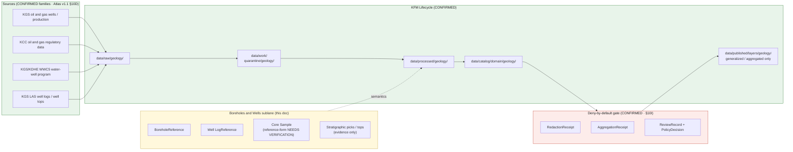

<!-- [KFM_META_BLOCK_V2]
doc_id: kfm://doc/geology-sublane-boreholes-wells
title: Geology Sublane — Boreholes & Wells
type: standard
version: v1
status: draft
owners: <geology-domain-steward> (placeholder — verify against repo CODEOWNERS)
created: 2026-06-03
updated: 2026-06-03
policy_label: restricted
related:
  - docs/domains/geology/README.md                       # PROPOSED — verify presence
  - docs/domains/geology/sublanes/bedrock_geology.md      # PROPOSED sibling (consumes well evidence as context)
  - docs/domains/geology/sublanes/surficial_geology.md    # PROPOSED sibling
  - docs/domains/geology/sublanes/stratigraphy.md         # PROPOSED sibling
  - docs/domains/geology/sublanes/geophysics.md           # PROPOSED sibling
  - docs/domains/geology/sublanes/geochemistry.md         # PROPOSED sibling
  - docs/domains/geology/sublanes/resources.md            # PROPOSED sibling
  - docs/domains/hydrology/                               # cross-lane: water wells / withdrawals
  - docs/domains/people-dna-land/                         # cross-lane: private-well owner / parcel joins
  - schemas/contracts/v1/domains/geology/                 # PROPOSED schema home (ADR-0001 default)
  - schemas/contracts/v1/receipts/                        # PROPOSED receipt schema home
  - contracts/domains/geology/                            # PROPOSED semantic contract home
  - policy/domains/geology/                                # PROPOSED policy home
  - policy/sensitivity/geology/                            # PROPOSED sensitivity home
  - data/published/layers/geology/                        # PROPOSED layer outputs
  - ai-build-operating-contract.md                        # canonical operating contract
  - directory-rules.md                                    # §12 Domain Placement Law, §5 Canonical Root Tree
  - docs/registers/DRIFT_REGISTER.md                      # naming-convention + sublane-folder routing
tags: [kfm, geology, boreholes, wells, well-logs, cores, sensitive, sublane]
notes:
  - "CONTRACT_VERSION = 3.0.0 pinned per ai-build-operating-contract.md."
  - "SENSITIVE LANE. Exact borehole / sample / well-log / private-well locations default to restricted or generalized geometry (Atlas v1.1 §10I). policy_label set to restricted at the doc level; public derivatives are generalized/aggregated only, with a RedactionReceipt or AggregationReceipt and a ReviewRecord."
  - "Object-family names follow Atlas v1.1 Ch. 10C/E canonical casing: BoreholeReference, Well LogReference. The §10B scope also names Borehole, Well Log, Core Sample as object classes; a CoreSampleReference reference-form is NOT enumerated in §10E and is marked NEEDS VERIFICATION."
  - "Filename uses a hyphen (boreholes-wells.md). The bedrock_geology.md sibling used underscores (boreholes_wells.md). Hyphen-vs-underscore is a naming-convention drift; routed to DRIFT_REGISTER (OQ-GEOL-BWELL-06)."
  - "The docs/domains/<domain>/sublanes/<sublane>.md path is PROPOSED; Directory Rules §12 does not enumerate a sublanes/ subfolder. Resolve via ADR."
  - "Owners, CI badge URLs, route names, and exact related-doc paths are placeholders pending mounted-repo verification."
[/KFM_META_BLOCK_V2] -->

# 🛢️ Geology Sublane — Boreholes & Wells

> Governance, semantics, and **deny-by-default** publication posture for **subsurface point observations** inside the KFM Geology / Natural Resources domain lane: boreholes, well logs, and core samples. This sublane carries the lane's most location-sensitive evidence and is **restricted by default** — public derivatives are generalized or aggregated, never raw point geometry.

[](#)
[](#)
[](#)
[](#)
[](#)
[](#)
[](#)
[](#)

**Status:** draft · **Owners:** `<geology-domain-steward>` *(placeholder)* · **Contract:** `CONTRACT_VERSION = "3.0.0"` · **Policy label:** `restricted` · **Last updated:** 2026-06-03

> [!CAUTION]
> **Sensitive sublane — fail closed.** Atlas v1.1 §10I is explicit: *exact borehole, sample, sensitive-resource, well-log, and private-well locations default to restricted or generalized public geometry.* Exact point geometry, owner identity, and proprietary log content are **denied by default**. Any public release requires generalization or aggregation **plus** a `RedactionReceipt` or `AggregationReceipt`, a `ReviewRecord`, and a `PolicyDecision`. When rights, owner-privacy, or source role are unclear, **quarantine or deny** — never publish on uncertainty. See [§11 — Sensitivity, Rights, and Publication Posture](#11--sensitivity-rights-and-publication-posture).

> [!IMPORTANT]
> **Sublane folder is PROPOSED.** Directory Rules **§12 (Domain Placement Law)** establishes the lane pattern and shows `docs/domains/<domain>/` as a directory, but it does **not** enumerate a `sublanes/` subfolder. The path used here — `docs/domains/geology/sublanes/boreholes-wells.md` — should be confirmed by an ADR or migrated to a flat-prefix scheme (e.g. `docs/domains/geology/SUBLANE-BOREHOLES-WELLS.md`) before the structure is treated as canonical. See [§13 — Open Questions](#13--open-questions).

> [!NOTE]
> **Filename-convention note.** This file uses a hyphen (`boreholes-wells.md`); the `bedrock_geology.md` sibling referenced an underscore form (`boreholes_wells.md`). Hyphen-vs-underscore for sublane filenames is unresolved drift — routed to `docs/registers/DRIFT_REGISTER.md` (OQ-GEOL-BWELL-06).

---

## Mini-TOC

- [1 · Scope](#1--scope)
- [2 · Repo Fit](#2--repo-fit)
- [3 · Inputs](#3--inputs)
- [4 · Exclusions](#4--exclusions)
- [5 · Sublane Map (Mermaid)](#5--sublane-map-mermaid)
- [6 · Object Families & Ubiquitous Language](#6--object-families--ubiquitous-language)
- [7 · Source Families & Source Roles](#7--source-families--source-roles)
- [8 · Spatial & Temporal Model](#8--spatial--temporal-model)
- [9 · Map & Viewing Products](#9--map--viewing-products)
- [10 · Pipeline Shape (RAW → PUBLISHED)](#10--pipeline-shape-raw--published)
- [11 · Sensitivity, Rights, and Publication Posture](#11--sensitivity-rights-and-publication-posture)
- [12 · Cross-Lane Relations](#12--cross-lane-relations)
- [13 · Open Questions](#13--open-questions)
- [Companion sections](#open-questions-register)
- [Related Docs](#related-docs)

---

## 1 · Scope

**CONFIRMED doctrine / PROPOSED sublane scope.** The boreholes-and-wells sublane governs **subsurface point observations and their logs** within the Geology / Natural Resources lane:

- **`BoreholeReference`** — a reference to a drilled hole (water well, oil/gas well, stratigraphic test, geotechnical boring) carried as geology evidence or a released derivative.
- **`Well LogReference`** — a reference to a wireline / geophysical / driller's log associated with a borehole (e.g., LAS digital logs, well tops).
- **Core Sample** *(§10B scope object)* — physical core / cuttings descriptions referenced as evidence. *(A `CoreSampleReference` reference-form is NOT enumerated in Atlas §10E; treat the reference object name as NEEDS VERIFICATION.)*
- **Well-derived stratigraphic picks / tops** — depth-referenced unit contacts read from logs, carried as evidence that *supports* (never replaces) `StratigraphicInterval` and `GeologicUnit` claims in the bedrock / stratigraphy sublanes.
- **Public-safe generalized / aggregated** borehole-density and well-availability products.

Doctrine basis: the Geology lane explicitly owns **boreholes, logs, cores** and pairs **points for boreholes/samples** (Atlas v1.1 §10A–B; ENCY §7.8). This sublane is the home for the lane's **point-geometry, location-sensitive** evidence.

> [!NOTE]
> This sublane is **evidence-bearing, not map-authoritative for units.** A borehole encountering a lithology is **evidence** that may support a unit pick; it is not itself a remapped unit boundary. Unit-boundary authority stays in the bedrock / surficial / stratigraphy sublanes.

[Back to top ↑](#-geology-sublane--boreholes--wells)

---

## 2 · Repo Fit

**PROPOSED placement.** This file lives under the Geology lane segment of the `docs/` responsibility root.

```text
docs/
└── domains/
    └── geology/
        ├── README.md                   # PROPOSED — domain landing
        └── sublanes/                   # PROPOSED — see §13 Open Questions
            ├── bedrock_geology.md      # PROPOSED sibling (consumes well evidence as context)
            ├── surficial_geology.md    # PROPOSED sibling
            ├── stratigraphy.md         # PROPOSED sibling
            ├── structures.md           # PROPOSED sibling
            ├── boreholes-wells.md      # <— THIS FILE
            ├── geophysics.md           # PROPOSED sibling
            ├── geochemistry.md         # PROPOSED sibling
            └── resources.md            # PROPOSED sibling
```

**Directory Rules basis (CONFIRMED against `directory-rules.md`):**

- **§12 Domain Placement Law** — geology is a **lane segment** inside responsibility roots, never a root folder. The `sublanes/` child extends the §12 lane pattern and is **not yet enumerated** there.
- **§5 Canonical Root Tree** — `docs/` is the human-facing control-plane root.
- **§4 Placement Protocol (Step 3)** — domain is a segment inside a responsibility root, named in the PR.
- **§13.1 / ADR-0001** — `schemas/contracts/v1/...` is the canonical schema home; `contracts/` retains semantic Markdown only.

**Upstream (doctrine that governs this file):**

- `directory-rules.md` — §12 Domain Placement Law, §5 Canonical Root Tree, §4 Placement Protocol (CONFIRMED).
- `ai-build-operating-contract.md` — canonical operating contract, `CONTRACT_VERSION = "3.0.0"`; §23.2 sensitive-domain matrix (CONFIRMED).
- `docs/domains/geology/README.md` — Geology lane charter (PROPOSED; verify presence).
- Atlas v1.1 Ch. 10 §10B/I — Geology scope and sensitivity posture (CONFIRMED doctrine).
- Atlas v1.1 §24.5 / unified doctrine §15–16 — T0–T4 tier scheme and per-domain sensitivity matrix (CONFIRMED doctrine).

**Downstream (artifacts that consume this sublane's semantics):**

- `contracts/domains/geology/` — semantic Markdown contracts for `BoreholeReference`, `Well LogReference`. **(PROPOSED home)**
- `schemas/contracts/v1/domains/geology/` — JSON Schemas per ADR-0001 default. **(PROPOSED home)**
- `schemas/contracts/v1/receipts/` — `RedactionReceipt`, `AggregationReceipt` shapes. **(PROPOSED home)**
- `policy/domains/geology/` and `policy/sensitivity/geology/` — admissibility, deny-by-default, and release rules. **(PROPOSED homes)**
- `tests/domains/geology/` and `fixtures/domains/geology/` — borehole/well-log rights + sensitive-geometry-deny fixtures. **(PROPOSED home)**
- `data/published/layers/geology/` — released **generalized/aggregated** borehole-density layers only. **(PROPOSED home)**

[Back to top ↑](#-geology-sublane--boreholes--wells)

---

## 3 · Inputs

Material that **belongs** in or is referenced by this sublane:

- **Well / borehole records** from KGS oil-and-gas, KGS/KDHE WWC5 water-well program, and stratigraphic-test catalogs (with source role, rights, sensitivity, citation, time, hash).
- **Well logs** — KGS LAS digital well logs and well tops; driller's and wireline logs.
- **Core / cuttings descriptions** referenced as evidence.
- **Depth-referenced stratigraphic picks / tops** read from logs.
- **Owner-privacy and rights metadata** (public vs. private well; proprietary log embargoes).
- **Generalization / aggregation receipts** describing how exact point geometry was transformed to public-safe form.

> [!TIP]
> Inputs enter via the standard **`SourceDescriptor` → source-activation decision** path. A well-record source is not implicitly active; it requires a recorded source role, rights / owner-privacy review, license review, attribution, and a recorded activation decision before connectors emit to `data/raw/geology/`. *(`SourceActivationDecision` as a named object is PROPOSED — verify against `contracts/`.)*

[Back to top ↑](#-geology-sublane--boreholes--wells)

---

## 4 · Exclusions

Material that **does not** belong here, and where it goes instead:

| Out of scope for boreholes-wells sublane | Lives in | Canonical object family |
|---|---|---|
| Bedrock map units, lithostratigraphy, contacts | `docs/domains/geology/sublanes/bedrock_geology.md` *(PROPOSED)* | `GeologicUnit`, `Lithology`, `StructureFeature` |
| Surficial / unconsolidated cover units | `docs/domains/geology/sublanes/surficial_geology.md` *(PROPOSED)* | `SurficialUnit` |
| Stratigraphic correlation as map fact | `docs/domains/geology/sublanes/stratigraphy.md` *(PROPOSED)* | `StratigraphicInterval`, `StratigraphicCorrelation` |
| Geophysical surveys (seismic, gravity, magnetics) | `docs/domains/geology/sublanes/geophysics.md` *(PROPOSED)* | *(geophysics object family — verify)* |
| Geochemistry samples and assays | `docs/domains/geology/sublanes/geochemistry.md` *(PROPOSED)* | `Geochemistry SampleReference` |
| Mineral occurrences, resource deposits/estimates, extraction | `docs/domains/geology/sublanes/resources.md` *(PROPOSED)* | `Mineral Occurrence`, `Resource Deposit`, `ResourceEstimate`, `Extraction Site` |
| Hydrologic **measurements** (water levels, withdrawals, flow) | `docs/domains/hydrology/` (Hydrology lane) | Hydrology object families |
| Private-well **owner identity / parcel** assertions | `docs/domains/people-dna-land/` (Geology cannot prove ownership) | — |
| Production / permit / regulatory authority claims | `docs/domains/geology/sublanes/resources.md` + regulatory source role | — |
| Cross-cutting governance (`EvidenceBundle`, `RunReceipt`, `ReleaseManifest` semantics) | `contracts/evidence/`, `contracts/runtime/`, `contracts/release/` *(PROPOSED homes)* | — |

> [!WARNING]
> **Anti-collapse.** A borehole is **not** a remapped unit boundary, **not** a production claim, **not** a resource estimate, and **not** proof of who owns the land or the well. The Geology lane explicitly does **not** own ownership / lease / permit / title claims (Atlas §10B). Promotion across any of these boundaries requires evidence, source-role discipline, and a release decision — never a spatial join of convenience.

[Back to top ↑](#-geology-sublane--boreholes--wells)

---

## 5 · Sublane Map (Mermaid)

PROPOSED — illustrative; reflects doctrine relationships, not a verified runtime graph.



> [!NOTE]
> The lifecycle path `RAW → WORK / QUARANTINE → PROCESSED → CATALOG / TRIPLET → PUBLISHED` is **CONFIRMED doctrine** (Directory Rules §0; Atlas v1.1 §1 Operating Law and §10H). For this sublane, the **catalog → published** edge passes through a deny-by-default gate: no exact-geometry well point reaches `PUBLISHED` without a redaction/aggregation transform and a recorded review.

[Back to top ↑](#-geology-sublane--boreholes--wells)

---

## 6 · Object Families & Ubiquitous Language

CONFIRMED terms (Atlas v1.1 §10B/C/E); PROPOSED field realizations until the geology schema is mounted.

> [!CAUTION]
> **Casing and naming are load-bearing.** The Atlas uses **`BoreholeReference`** and **`Well LogReference`** (note the space in `Well LogReference` as printed in the Atlas object-family tables). Do not silently rename these to industry-generic equivalents such as "WellLog" or "Borehole" without an ADR.

| Term | Boreholes-wells meaning | Identity (PROPOSED) | Citation |
|---|---|---|---|
| **`BoreholeReference`** | A reference to a drilled hole (water, oil/gas, stratigraphic test, geotechnical) carried as geology evidence or released derivative. | `source_id + object_role + temporal_scope + normalized_digest` | Atlas §10C/E; ENCY §7.8 |
| **`Well LogReference`** | A reference to a wireline / geophysical / driller's log (LAS digital logs, well tops) associated with a borehole. | Same identity basis. | Atlas §10C/E |
| **Core Sample** | A physical core / cuttings description referenced as evidence. Named in §10B scope. | Same identity basis (reference-form name NEEDS VERIFICATION). | Atlas §10B |
| **Stratigraphic pick / top** *(evidence)* | A depth-referenced unit contact read from a log; **supports** a `StratigraphicInterval` / `GeologicUnit` claim, never replaces it. | Bound to its `Well LogReference` and depth datum. | Atlas §10B/E (INFERRED naming) |

> [!IMPORTANT]
> A well's evidentiary value is **bound to its source and vintage**, not to the rock at depth as a settled fact. The same well re-interpreted yields a new evidence assertion, tracked in lineage — it does not silently overwrite a prior unit pick.

<details>
<summary><b>Geology lane object families not owned by this sublane</b></summary>

Listed for terminology fidelity (Atlas v1.1 §10C/E). This sublane may **reference** these via cross-lane relations or evidence support, but MUST NOT promote their content as its own:

- `GeologicUnit`, `Lithology`, `StratigraphicInterval`, `StratigraphicCorrelation`, `StructureFeature`, `GeologyBoundaryVersion` — bedrock / surficial / stratigraphy / structures sublanes.
- `Geochemistry SampleReference` — geochemistry sublane.
- `Mineral Occurrence`, `Resource Deposit`, `ResourceEstimate`, `Extraction Site` — resources sublane.
- `Hydrostratigraphic Unit` — geology-owned context that supports the Hydrology lane (cross-lane only).

</details>

[Back to top ↑](#-geology-sublane--boreholes--wells)

---

## 7 · Source Families & Source Roles

CONFIRMED source families (Atlas v1.1 §10D). These are precisely the **out-of-bedrock-scope** families flagged in the bedrock sublane — here they are the sublane's **primary** sources.

| Source family | Relevance | Source-role posture (CONFIRMED doctrine) | Citation |
|---|---|---|---|
| **KGS oil and gas wells and production** | Primary well / borehole catalog (oil & gas). | authority / observation / context / model **as source role requires**; rights & current terms **NEEDS VERIFICATION**; **sensitive joins fail closed**. | Atlas §10D |
| **KCC oil and gas regulatory data** | Regulatory / operator context for wells. | Same posture; regulatory role ≠ geology authority. | Atlas §10D |
| **KGS/KDHE WWC5 and water-well program** | Water-well completion records (private-well sensitivity). | Same posture; **owner privacy in scope**. | Atlas §10D |
| **KGS LAS digital well logs and well tops** | Wireline log content and depth-referenced tops. | Same posture; proprietary-log embargo possible. | Atlas §10D |
| KGS data and maps (bedrock/geologic) | Context only — a well does not remap a unit. | Map authority for units stays in bedrock/surficial sublanes. | Atlas §10D |

> [!WARNING]
> **Source roles cannot be inferred from convenience.** A regulatory record (KCC) is not a geology authority. A log encountering a lithology is **evidence**, not a remapped unit boundary. A well in a parcel is not proof of who owns the well. Promotion across these roles is a **governed state transition**, not a join. The Atlas posture is uniform: each source's role is "authority / observation / context / model **as source role requires**," and **sensitive joins fail closed**.

> [!CAUTION]
> **Rights / owner-privacy gate (NEEDS VERIFICATION).** The Atlas marks KGS / KCC / WWC5 / LAS "rights and current terms" as **NEEDS VERIFICATION** (§10D). Private-well owner identity and proprietary log content MUST NOT publish until rights and owner-privacy are settled. Records MUST fail release when rights, source role, or owner-privacy status is missing or unclear.

[Back to top ↑](#-geology-sublane--boreholes--wells)

---

## 8 · Spatial & Temporal Model

CONFIRMED doctrine (Atlas v1.1 §10B/E; ENCY §7.8):

- **Geometry**
  - **Points** for boreholes and samples (exact points are **sensitive** — see §11).
  - Depth-referenced attributes (tops, picks, log curves) attach to the point.
  - **Public products are generalized or aggregated** (density grids, county/township roll-ups) — never raw exact points.
- **Uncertainty** — location precision, depth-datum uncertainty, and interpretation confidence tracked explicitly.
- **Temporal handling** (Atlas v1.1 §10E — "source, observed, valid, retrieval, release, and correction times stay distinct where material"):

| Time facet | Boreholes-wells meaning |
|---|---|
| `source_time` | Date the source record / log was published or filed. |
| `observed_time` | Drilling / logging date, when known. |
| `valid_time` | Window the well record is considered current. |
| `retrieval_time` | When KFM pulled the source. |
| `release_time` | When KFM released the (generalized/aggregated) derivative. |
| `correction_time` | When a `CorrectionNotice` was applied. |

> [!TIP]
> A well's **logging date** and the **geologic age** of the units it penetrates are different axes. Carry both; never collapse the time the data was collected into the age of the rock.

[Back to top ↑](#-geology-sublane--boreholes--wells)

---

## 9 · Map & Viewing Products

PROPOSED sublane products. Note the contrast with map-authoritative sublanes: **public products here are deliberately coarse.**

| Product | Geometry | Purpose | Default tier | Status |
|---|---|---|---|---|
| **Borehole density grid** | Aggregated cell | Public-safe well-availability density without exact points. | T1 | PROPOSED |
| **Well-availability summary** | Aggregated (county / township) | Counts / coverage roll-ups with suppression for small cells. | T0 / T1 | PROPOSED |
| **Exact borehole point layer** | Point | Reviewer / steward use only; never a public tier by default. | **T2–T4** | PROPOSED |
| **Well-log evidence panel** | Attribute (Evidence Drawer) | Released-evidence summary of a log that supports a unit pick. | T2 | PROPOSED |
| **Stratigraphic-tops cross-tie** | Point + depth | Evidence support to bedrock/stratigraphy unit picks; reviewer-bounded. | T2 | PROPOSED |

CONFIRMED cross-cutting view doctrine (Atlas §10G; MAP-MASTER; GAI): every product participates in **Evidence Drawer, time-aware state, trust badges, sensitivity-redacted view, correction/stale-state view, and governed Focus Mode**. The default surface for this sublane is the **sensitivity-redacted view**; exact points are suppressed unless the requester is policy-authorized.

> [!CAUTION]
> A public click on a borehole-density cell must return the **aggregate** plus its `AggregationReceipt` — never an exact well point, owner, or proprietary log content.

[Back to top ↑](#-geology-sublane--boreholes--wells)

---

## 10 · Pipeline Shape (RAW → PUBLISHED)

CONFIRMED doctrine; PROPOSED sublane application. Promotion is a **governed state transition, not a file move** (Directory Rules §0; Atlas v1.1 §10H).

| Stage | Boreholes-wells handling | Gate | Status |
|---|---|---|---|
| **RAW** | Capture well / log / core source payload with source role, **rights & owner-privacy**, sensitivity, citation, time, hash. | `SourceDescriptor` exists. | PROPOSED |
| **WORK / QUARANTINE** | Normalize CRS, point geometry, depth datum, log schema, identity, evidence, rights, policy. **Quarantine** any record with unconfirmed rights, unknown owner-privacy status, or unclear source role. | Validation + policy gate pass, or quarantine reason recorded. | PROPOSED |
| **PROCESSED** | Emit validated `BoreholeReference` / `Well LogReference` evidence and **public-safe candidate** generalized/aggregated geometry. Emit `EvidenceRef`, `ValidationReport`; close digest. | `EvidenceRef`, `ValidationReport`, digest closure exist. | PROPOSED |
| **CATALOG / TRIPLET** | Emit catalog records, `EvidenceBundle`s, graph/triplet projections, and release candidates. | Catalog / proof closure passes. | PROPOSED |
| **PUBLISHED** | Serve **only generalized / aggregated** public-safe artifacts through governed APIs and a `ReleaseManifest`, each carrying a `RedactionReceipt` or `AggregationReceipt`. | `ReleaseManifest`, `RedactionReceipt`/`AggregationReceipt`, `ReviewRecord`, `PolicyDecision`, correction path, rollback target. | PROPOSED |

> [!CAUTION]
> **Watcher-as-non-publisher invariant.** A well-source watcher that detects new records **MAY emit a candidate `PromotionDecision`**; it MUST NOT write to `data/processed/geology/` or `data/published/layers/geology/` directly. For this sublane the invariant is doubly important: a watcher MUST NOT auto-publish exact point geometry under any circumstances.

[Back to top ↑](#-geology-sublane--boreholes--wells)

---

## 11 · Sensitivity, Rights, and Publication Posture

CONFIRMED / INFERRED (Atlas v1.1 §10I; operating contract §23.2; T0–T4 tier scheme §24.5 / unified doctrine §15–16):

- **Default-deny on exact location.** Exact borehole, sample, well-log, and **private-well** locations default to **restricted or generalized** geometry (Atlas §10I, CONFIRMED).
- **Anti-collapse.** Occurrence, deposit, estimate, permit, production, and reserve claims must remain distinct from borehole evidence (Atlas §10I, CONFIRMED).
- **Default-deny on missing inputs.** Unclear rights, unresolved source role, missing evidence, unresolved sensitivity, or absent release state **blocks public promotion** (Atlas §1 Operating Law and §10I; Directory Rules — CONFIRMED).

The tier assignments below are **INFERRED from §10I** (the Atlas per-domain tier matrix §24.5.2 names archaeology, fauna, flora, people, infrastructure rows but does not print an explicit boreholes-wells row). Treat the specific tier values as **PROPOSED**, grounded in the §10I posture and the cross-domain tier scheme.

| Object class | Default tier (PROPOSED, from §10I) | Allowed transform | Required gates |
|---|---|---|---|
| Exact borehole / well / core point | **T2–T4** | Generalize to density grid or aggregate to county/township → T1. | `RedactionReceipt` or `AggregationReceipt` + `ReviewRecord` + `PolicyDecision`. |
| Private-well location + owner | **T4** | De-identify owner + generalize geometry → T2 at most; owner identity never reaches a public tier. | `RedactionReceipt` + `ReviewRecord` + `PolicyDecision`. |
| Proprietary log content (embargoed) | **T3–T4** | Release only under named agreement, or after embargo, recorded. | `PolicyDecision` + `ReviewRecord` + agreement. |
| Aggregated borehole density | **T1** | Aggregation with small-cell suppression. | `AggregationReceipt`. |
| County/township well-availability summary | **T0 / T1** | Aggregation; suppression for small counts. | `AggregationReceipt`. |

**Tier transitions are governed** (CONFIRMED, Atlas §24.5.3): `T4 → T1` requires `RedactionReceipt + ReviewRecord`; `T4 → T2` requires `PolicyDecision + ReviewRecord`; `T4 → T3` requires `PolicyDecision + ReviewRecord + agreement`; all transitions are reversible (revocation returns the object toward T4 with a `CorrectionNotice`).

> [!IMPORTANT]
> **A well point is not a public artifact.** A public requester must receive a **generalized or aggregated** answer plus its receipt — never an exact point, an owner identity, or proprietary log content, unless that requester is policy-authorized and the transition has been recorded. Per the operating contract §23.2 most-restrictive-applicable-row rule, when no row clearly matches, the default disposition is **deny exact exposure, generalize, redact, quarantine uncertain material, require steward review, require a transform receipt, and abstain when support is inadequate.**

[Back to top ↑](#-geology-sublane--boreholes--wells)

---

## 12 · Cross-Lane Relations

CONFIRMED doctrine (Atlas v1.1 §10F). Each relation MUST preserve **ownership, source role, sensitivity, and `EvidenceBundle` support** — none are joins of convenience.

| This sublane | Related lane | Relation | Constraint |
|---|---|---|---|
| Boreholes-Wells | **Bedrock / Stratigraphy** | Well tops / picks → **evidence support** for `GeologicUnit` / `StratigraphicInterval` | Evidence supports; it does **not** remap a unit boundary. |
| Boreholes-Wells | **Hydrology** | Water-well records → aquifer / withdrawal **context** | Geology contributes well evidence; Hydrology owns measurements and aquifer-extent claims. |
| Boreholes-Wells | **People / Land** | Private well ↔ owner / parcel | A well **cannot prove** ownership; private-well × parcel joins are **T4** and deny by default. |
| Boreholes-Wells | **Resources** | Oil/gas well ↔ production / deposit | A well is **not** a production claim or a `ResourceEstimate`; route those through the resources sublane. |
| Boreholes-Wells | **Hazards** | Subsurface void / abandoned well ↔ subsidence context | Geology provides context only; Hazards owns risk. |

[Back to top ↑](#-geology-sublane--boreholes--wells)

---

## 13 · Open Questions

| # | Question | Evidence that would settle it | Status |
|---|---|---|---|
| 1 | Is `docs/domains/<domain>/sublanes/<sublane>.md` an accepted layout, or should sublane docs use a flat-prefix scheme? | An ADR amending Directory Rules §12, or a mounted-repo precedent. | NEEDS VERIFICATION |
| 2 | Does the Geology lane carry semantic contracts under `contracts/domains/geology/` and machine schemas under `schemas/contracts/v1/domains/geology/` per ADR-0001? | Mounted-repo inspection; ADR-0001 status. | NEEDS VERIFICATION |
| 3 | What is the canonical **reference-form** name for cores (`CoreSampleReference`?) — §10E enumerates `BoreholeReference` and `Well LogReference` but not a core reference object. | `contracts/` / schema inspection; geology object-family ADR. | NEEDS VERIFICATION |
| 4 | What are the **default tier values** for boreholes-wells object classes? §24.5.2 has no explicit geology row; tiers here are INFERRED from §10I. | An explicit geology row added to the per-domain tier matrix, or a `policy/sensitivity/geology/` entry. | PROPOSED |
| 5 | What is the **owner-privacy rule** for WWC5 private-well records (de-identification threshold, allowed geometry generalization)? | A `policy/sensitivity/geology/` entry + a sensitive-geometry-deny fixture. | NEEDS VERIFICATION |
| 6 | Are KGS / KCC / WWC5 / LAS license, embargo, and owner-privacy terms compatible with any public (even generalized) release? | License + rights review record; Atlas marks these NEEDS VERIFICATION (§10D). | NEEDS VERIFICATION |
| 7 | What small-cell **suppression rule** applies to the borehole-density and well-availability aggregates? | An `AggregationReceipt` suppression_rule fixture under `policy/`/`fixtures/`. | NEEDS VERIFICATION |
| 8 | What is the exact name of the source-activation outcome object (`SourceActivationDecision` is PROPOSED)? | `contracts/` semantic-contract inspection. | NEEDS VERIFICATION |
| 9 | Filename convention: hyphen (`boreholes-wells.md`) vs underscore (`boreholes_wells.md`) for sublane files? | Mounted-repo precedent or a docs-naming ADR. | NEEDS VERIFICATION |

[Back to top ↑](#-geology-sublane--boreholes--wells)

---

## Open questions register

| ID | Question | Owner role | Resolution path |
|---|---|---|---|
| OQ-GEOL-BWELL-01 | Accept `sublanes/` subfolder vs flat-prefix scheme under `docs/domains/geology/`. | docs steward + directory-rules owner | ADR amending Directory Rules §12; DRIFT_REGISTER entry. |
| OQ-GEOL-BWELL-02 | Confirm geology contract/schema/receipt homes. | geology domain steward | Mounted-repo inspection + ADR-0001 check. |
| OQ-GEOL-BWELL-03 | Canonical core-reference object name (`CoreSampleReference`?). | geology domain steward | Geology object-family ADR / schema PR. |
| OQ-GEOL-BWELL-04 | Default tier values for boreholes-wells object classes. | geology domain steward + rights reviewer | Add explicit geology row to §24.5.2 / `policy/sensitivity/geology/`. |
| OQ-GEOL-BWELL-05 | WWC5 private-well owner-privacy and generalization rule. | rights reviewer + geology domain steward | `policy/sensitivity/geology/` entry + sensitive-geometry-deny fixture. |
| OQ-GEOL-BWELL-06 | Sublane filename convention: hyphen vs underscore. | docs steward | Docs-naming ADR; DRIFT_REGISTER entry. |

## Open verification backlog

These items remain `NEEDS VERIFICATION` before promotion from `draft` to `published`:

1. Sublane folder layout (`sublanes/` vs flat prefix) — Directory Rules §12 silent.
2. Geology contract / schema / receipt homes against mounted repo and ADR-0001.
3. Canonical core-reference object name.
4. Default tier values for boreholes-wells object classes (no explicit §24.5.2 geology row).
5. WWC5 private-well owner-privacy / de-identification rule.
6. KGS / KCC / WWC5 / LAS license, embargo, and owner-privacy terms (Atlas §10D = NEEDS VERIFICATION).
7. Small-cell suppression rule for density / availability aggregates.
8. Exact source-activation outcome object name.
9. Filename convention (hyphen vs underscore).

## Changelog v0 → v1

| Change | Type (per contract §37) | Reason |
|---|---|---|
| New sublane doc created at `docs/domains/geology/sublanes/boreholes-wells.md` | new | First boreholes-and-wells sublane doc. |
| Object families set to Atlas v1.1 §10C/E canonical casing (`BoreholeReference`, `Well LogReference`) | new | Terminology fidelity. |
| §7 source families set to the Atlas §10D out-of-bedrock subset (KGS oil&gas, KCC, WWC5, LAS) | new | These are this sublane's primary sources. |
| Added explicit deny-by-default sensitivity posture, T-tier table, and tier-transition gates | new | §10I + §24.5 require fail-closed handling of exact well geometry. |
| Added companion sections (Open Qs register, Verification backlog, Changelog, DoD) | new | Doctrine-doc companion pattern. |

> **Backward compatibility.** New file; no prior anchors to preserve. Anchors use GitHub auto-slug of the H1 "🛢️ Geology Sublane — Boreholes & Wells"; verify the leading-emoji + ampersand slug renders as `#-geology-sublane--boreholes--wells` on the target GitHub instance.

## Definition of done

This document is done enough to enter the repository when:

- it is placed according to Directory Rules (sublane-folder question OQ-GEOL-BWELL-01 resolved);
- the filename convention (hyphen vs underscore) is resolved (OQ-GEOL-BWELL-06);
- a docs steward, the geology domain steward, **and a rights reviewer** review it (sensitive lane);
- it is linked from the Geology lane `README.md` / doctrine index;
- it does not conflict with accepted ADRs (ADR-0001 schema home; any sublane-folder ADR; geology object-family ADR);
- the sensitive-domain disposition and tier rules are mirrored in `policy/sensitivity/geology/` (or that gap is logged);
- naming and folder questions are logged in `docs/registers/DRIFT_REGISTER.md`;
- the `GENERATED_RECEIPT.json` planned at authoring time is wired into CI;
- future changes follow the operating contract §37 lifecycle.

---

## Related Docs

PROPOSED — verify each path against the mounted repo before linking.

- `docs/domains/geology/README.md` — Geology lane charter.
- `docs/domains/geology/sublanes/bedrock_geology.md` — Sibling sublane (consumes well evidence as context).
- `docs/domains/geology/sublanes/surficial_geology.md` — Sibling sublane for unconsolidated cover.
- `docs/domains/geology/sublanes/stratigraphy.md` — Sibling sublane for stratigraphic correlation.
- `docs/domains/geology/sublanes/resources.md` — Sibling sublane for mineral / resource / extraction context.
- `docs/domains/hydrology/` — Cross-lane (water wells / withdrawals; aquifer context).
- `docs/domains/people-dna-land/` — Cross-lane (private-well owner / parcel; deny by default).
- `directory-rules.md` §12 — Domain Placement Law; §5 Canonical Root Tree; §4 Placement Protocol.
- `ai-build-operating-contract.md` — canonical operating contract (`CONTRACT_VERSION = "3.0.0"`); §23.2 sensitive-domain matrix.
- Atlas v1.1 Ch. 10 §10B/I — Geology scope and sensitivity posture.
- Atlas v1.1 §24.5 — Sensitivity / rights tier reference (T0–T4) and tier transitions.
- `docs/registers/DRIFT_REGISTER.md` — naming-convention + sublane-folder routing.

---

<details>
<summary><b>Appendix A · Boreholes-wells review checklist (PROPOSED reviewer aid — sensitive lane)</b></summary>

A non-normative checklist for PRs that touch boreholes-wells artifacts. Promote to `docs/runbooks/geology/BOREHOLES_WELLS_REVIEW.md` if it survives use.

- [ ] **Source activation** — `SourceDescriptor` exists; activation decision records role, rights, **owner-privacy**, license, attribution.
- [ ] **Source role** — well source declared as observation/evidence; regulatory data (KCC) not treated as geology authority.
- [ ] **Schema home** — JSON Schema under `schemas/contracts/v1/domains/geology/...`; receipts under `schemas/contracts/v1/receipts/`.
- [ ] **Identity** — `BoreholeReference` / `Well LogReference` identity binds `source_id + object_role + temporal_scope + normalized_digest`.
- [ ] **Exact geometry suppressed** — no raw well point in any public-tier artifact; density/aggregate only.
- [ ] **Receipt present** — `RedactionReceipt` or `AggregationReceipt` accompanies every public derivative.
- [ ] **Review present** — `ReviewRecord` + `PolicyDecision` recorded for the tier transition.
- [ ] **Owner privacy** — private-well owner de-identified; owner identity never on a public tier.
- [ ] **Embargo** — proprietary log content respected; T3 release only under named agreement.
- [ ] **Anti-collapse** — no production / deposit / `ResourceEstimate` / ownership content riding on well evidence.
- [ ] **Evidence closure** — `EvidenceRef` resolves to a populated `EvidenceBundle`.
- [ ] **Cross-lane** — hydrology / people-land / resources joins preserve ownership, source role, sensitivity, and `EvidenceBundle` support.

</details>

<details>
<summary><b>Appendix B · Anti-pattern register (illustrative)</b></summary>

| Anti-pattern | Symptom | Fix |
|---|---|---|
| **Exact points published** | A public layer renders raw well/borehole points. | Suppress points; publish density/aggregate only with `AggregationReceipt`; record `ReviewRecord` + `PolicyDecision`. |
| **Owner leak** | A private-well popup shows owner name or parcel. | De-identify; route owner/parcel claims to People/Land (T4); never on a public tier. |
| **Well-as-unit** | A well top is promoted to a remapped unit boundary. | Keep it as **evidence** supporting a `GeologicUnit` pick; unit authority stays in bedrock/stratigraphy. |
| **Regulatory-as-authority** | KCC regulatory data treated as geology truth. | Record source role as regulatory context; do not collapse into geology authority. |
| **Embargo skipped** | Proprietary LAS log content released without agreement. | Hold at T3–T4; release only under named agreement with `PolicyDecision` + `ReviewRecord`. |
| **Watcher publishes points** | A well-source watcher writes exact points to `data/published/`. | Watcher emits candidate `PromotionDecision` only; exact geometry never auto-published. |
| **Resource bleed** | A well layer surfaces production / `ResourceEstimate` attributes. | Strip them; route through the resources sublane with its own posture. |

</details>

---

**Last updated:** 2026-06-03 · **Doc status:** draft (v1) · **Authority:** doctrine CONFIRMED / paths PROPOSED · **Sensitivity:** restricted · deny-by-default · **Contract:** `CONTRACT_VERSION = "3.0.0"` · [Back to top ↑](#-geology-sublane--boreholes--wells)
