<!-- [KFM_META_BLOCK_V2]
doc_id: kfm://doc/geology-sublane-geochemistry
title: Geology Sublane — Geochemistry
type: standard
version: v1
status: draft
owners: <geology-domain-steward> (placeholder — verify against repo CODEOWNERS)
created: 2026-06-03
updated: 2026-06-03
policy_label: restricted
related:
  - docs/domains/geology/README.md                       # PROPOSED — verify presence
  - docs/domains/geology/sublanes/bedrock_geology.md      # PROPOSED sibling
  - docs/domains/geology/sublanes/boreholes-wells.md      # PROPOSED sibling (cores / cuttings overlap)
  - docs/domains/geology/sublanes/geophysics.md           # PROPOSED sibling
  - docs/domains/geology/sublanes/resources.md            # PROPOSED sibling (assay ≠ deposit)
  - docs/domains/soil/                                    # cross-lane: soil geochemistry boundary
  - docs/domains/hydrology/                               # cross-lane: water-quality boundary
  - docs/domains/people-dna-land/                         # cross-lane: sample-on-private-land
  - schemas/contracts/v1/domains/geology/                 # PROPOSED schema home (ADR-0001 default)
  - schemas/contracts/v1/receipts/                        # PROPOSED receipt schema home
  - contracts/domains/geology/                            # PROPOSED semantic contract home
  - policy/domains/geology/                                # PROPOSED policy home
  - policy/sensitivity/geology/                            # PROPOSED sensitivity home
  - data/published/layers/geology/                        # PROPOSED layer outputs
  - ai-build-operating-contract.md                        # canonical operating contract
  - directory-rules.md                                    # §12 Domain Placement Law, §5 Canonical Root Tree
  - docs/registers/DRIFT_REGISTER.md                      # naming-convention + sublane-folder routing
tags: [kfm, geology, geochemistry, samples, assays, sensitive, sublane]
notes:
  - "CONTRACT_VERSION = 3.0.0 pinned per ai-build-operating-contract.md."
  - "SENSITIVE LANE. Atlas v1.1 §10I names sample locations explicitly: exact borehole, sample, sensitive-resource, well-log, and private-well locations default to restricted or generalized geometry. policy_label set to restricted; public derivatives are generalized/aggregated with a RedactionReceipt or AggregationReceipt plus a ReviewRecord and PolicyDecision."
  - "Distinctive anti-collapse concern: a geochemical anomaly / assay value is NOT a Mineral Occurrence, Resource Deposit, or ResourceEstimate. Assay-to-deposit collapse is the lane's primary failure mode."
  - "Object-family name follows Atlas v1.1 Ch. 10C/E canonical casing: 'Geochemistry SampleReference' (with the space as printed). The §10B scope object is 'Geochemistry Sample'."
  - "Filename uses no separator suffix (geochemistry.md). Sibling files diverge on hyphen vs underscore (boreholes-wells.md vs boreholes_wells.md); routed to DRIFT_REGISTER (OQ-GEOL-GCHEM-06)."
  - "The docs/domains/<domain>/sublanes/<sublane>.md path is PROPOSED; Directory Rules §12 does not enumerate a sublanes/ subfolder. Resolve via ADR."
  - "Owners, CI badge URLs, route names, and exact related-doc paths are placeholders pending mounted-repo verification."
[/KFM_META_BLOCK_V2] -->

# 🧪 Geology Sublane — Geochemistry

> Governance, semantics, and **deny-by-default** publication posture for **geochemical samples and assays** inside the KFM Geology / Natural Resources domain lane. This sublane carries sample-point evidence and elemental/analytical results — location-sensitive material whose distinctive risk is **assay-to-deposit collapse**: a geochemical anomaly is evidence, never a confirmed `Mineral Occurrence`, `Resource Deposit`, or `ResourceEstimate`.

[](#)
[](#)
[](#)
[](#)
[](#)
[](#)
[](#)
[](#)

**Status:** draft · **Owners:** `<geology-domain-steward>` *(placeholder)* · **Contract:** `CONTRACT_VERSION = "3.0.0"` · **Policy label:** `restricted` · **Last updated:** 2026-06-03

> [!CAUTION]
> **Sensitive sublane — fail closed.** Atlas v1.1 §10I names **sample** locations directly: *exact borehole, sample, sensitive-resource, well-log, and private-well locations default to restricted or generalized public geometry.* Exact sample-point geometry and full assay tables are **denied by default**. Any public release requires generalization or aggregation **plus** a `RedactionReceipt` or `AggregationReceipt`, a `ReviewRecord`, and a `PolicyDecision`. When rights, source role, or resource-sensitivity are unclear, **quarantine or deny**. See [§11 — Sensitivity, Rights, and Publication Posture](#11--sensitivity-rights-and-publication-posture).

> [!IMPORTANT]
> **Sublane folder is PROPOSED.** Directory Rules **§12 (Domain Placement Law)** establishes the lane pattern and shows `docs/domains/<domain>/` as a directory, but it does **not** enumerate a `sublanes/` subfolder. The path used here — `docs/domains/geology/sublanes/geochemistry.md` — should be confirmed by an ADR or migrated to a flat-prefix scheme (e.g. `docs/domains/geology/SUBLANE-GEOCHEMISTRY.md`) before the structure is treated as canonical. See [§13 — Open Questions](#13--open-questions).

> [!NOTE]
> **Filename-convention note.** Sibling sublane files diverge on hyphen vs underscore (`boreholes-wells.md` vs the `boreholes_wells.md` referenced elsewhere). Unresolved drift — routed to `docs/registers/DRIFT_REGISTER.md` (OQ-GEOL-GCHEM-06).

---

## Mini-TOC

- [1 · Scope](#1--scope)
- [2 · Repo Fit](#2--repo-fit)
- [3 · Inputs](#3--inputs)
- [4 · Exclusions](#4--exclusions)
- [5 · Sublane Map (Mermaid)](#5--sublane-map-mermaid)
- [6 · Object Families & Ubiquitous Language](#6--object-families--ubiquitous-language)
- [7 · Source Families & Source Roles](#7--source-families--source-roles)
- [8 · Spatial & Temporal Model](#8--spatial--temporal-model)
- [9 · Map & Viewing Products](#9--map--viewing-products)
- [10 · Pipeline Shape (RAW → PUBLISHED)](#10--pipeline-shape-raw--published)
- [11 · Sensitivity, Rights, and Publication Posture](#11--sensitivity-rights-and-publication-posture)
- [12 · Cross-Lane Relations](#12--cross-lane-relations)
- [13 · Open Questions](#13--open-questions)
- [Companion sections](#open-questions-register)
- [Related Docs](#related-docs)

---

## 1 · Scope

**CONFIRMED doctrine / PROPOSED sublane scope.** The geochemistry sublane governs **geochemical sample evidence and analytical results** within the Geology / Natural Resources lane:

- **`Geochemistry SampleReference`** — a reference to a geochemical sample (rock, soil-geochem, stream-sediment, water-geochem, core/cuttings split) carried as geology evidence or a released derivative.
- **Assay / analytical results** — elemental concentrations, isotopic ratios, and analytical metadata attached to a sample reference.
- **Sample-collection context** — method, lab, detection limits, QA/QC, and analytical-batch metadata as evidence qualifiers.
- **Public-safe generalized / aggregated** geochemistry products (e.g., element-concentration density surfaces with suppressed exact points).

Doctrine basis: the Geology lane explicitly owns **geochemistry** and the **Geochemistry Sample** object (Atlas v1.1 §10A–B; ENCY §7.8). The §10B scope names "Geochemistry Sample"; the §10C/E object-family tables carry it as **`Geochemistry SampleReference`**.

> [!NOTE]
> This sublane is **evidence-bearing, not resource-authoritative.** An assay value is evidence about composition at a point; it is **not** a mineral deposit, a resource estimate, or a prospect. Resource semantics stay in the resources sublane with their own posture.

[Back to top ↑](#-geology-sublane--geochemistry)

---

## 2 · Repo Fit

**PROPOSED placement.** This file lives under the Geology lane segment of the `docs/` responsibility root.

```text
docs/
└── domains/
    └── geology/
        ├── README.md                   # PROPOSED — domain landing
        └── sublanes/                   # PROPOSED — see §13 Open Questions
            ├── bedrock_geology.md      # PROPOSED sibling
            ├── surficial_geology.md    # PROPOSED sibling
            ├── stratigraphy.md         # PROPOSED sibling
            ├── structures.md           # PROPOSED sibling
            ├── boreholes-wells.md      # PROPOSED sibling (cores / cuttings overlap)
            ├── geophysics.md           # PROPOSED sibling
            ├── geochemistry.md         # <— THIS FILE
            └── resources.md            # PROPOSED sibling (assay ≠ deposit)
```

**Directory Rules basis (CONFIRMED against `directory-rules.md`):**

- **§12 Domain Placement Law** — geology is a **lane segment** inside responsibility roots, never a root folder. The `sublanes/` child extends the §12 lane pattern and is **not yet enumerated** there.
- **§5 Canonical Root Tree** — `docs/` is the human-facing control-plane root.
- **§4 Placement Protocol (Step 3)** — domain is a segment inside a responsibility root, named in the PR.
- **§13.1 / ADR-0001** — `schemas/contracts/v1/...` is the canonical schema home; `contracts/` retains semantic Markdown only.

**Upstream (doctrine that governs this file):**

- `directory-rules.md` — §12 Domain Placement Law, §5 Canonical Root Tree, §4 Placement Protocol (CONFIRMED).
- `ai-build-operating-contract.md` — canonical operating contract, `CONTRACT_VERSION = "3.0.0"`; §23.2 sensitive-domain matrix (CONFIRMED).
- `docs/domains/geology/README.md` — Geology lane charter (PROPOSED; verify presence).
- Atlas v1.1 Ch. 10 §10B/I — Geology scope and sensitivity posture (CONFIRMED doctrine).
- Atlas v1.1 §24.5 / unified doctrine §15–16 — T0–T4 tier scheme and per-domain sensitivity matrix (CONFIRMED doctrine).

**Downstream (artifacts that consume this sublane's semantics):**

- `contracts/domains/geology/` — semantic Markdown contract for `Geochemistry SampleReference`. **(PROPOSED home)**
- `schemas/contracts/v1/domains/geology/` — JSON Schemas per ADR-0001 default. **(PROPOSED home)**
- `schemas/contracts/v1/receipts/` — `RedactionReceipt`, `AggregationReceipt` shapes. **(PROPOSED home)**
- `policy/domains/geology/` and `policy/sensitivity/geology/` — admissibility, deny-by-default, release rules. **(PROPOSED homes)**
- `tests/domains/geology/` and `fixtures/domains/geology/` — sample-rights + assay-anti-collapse + sensitive-geometry-deny fixtures. **(PROPOSED home)**
- `data/published/layers/geology/` — released **generalized/aggregated** geochemistry surfaces only. **(PROPOSED home)**

[Back to top ↑](#-geology-sublane--geochemistry)

---

## 3 · Inputs

Material that **belongs** in or is referenced by this sublane:

- **Geochemical sample records** — rock, stream-sediment, soil-geochem, and water-geochem samples (with source role, rights, sensitivity, citation, time, hash).
- **Assay / analytical results** — elemental concentrations, isotopic ratios, detection limits, units.
- **Analytical metadata** — lab, method, QA/QC, batch, sample-prep notes.
- **Sample-collection geometry** — exact collection points (**sensitive** — see §11).
- **Generalization / aggregation receipts** describing how exact points and full assay tables were transformed to public-safe form.

> [!TIP]
> Inputs enter via the standard **`SourceDescriptor` → source-activation decision** path. A geochemistry source is not implicitly active; it requires a recorded source role, rights / resource-sensitivity review, license review, attribution, and a recorded activation decision before connectors emit to `data/raw/geology/`. *(`SourceActivationDecision` as a named object is PROPOSED — verify against `contracts/`.)*

[Back to top ↑](#-geology-sublane--geochemistry)

---

## 4 · Exclusions

Material that **does not** belong here, and where it goes instead:

| Out of scope for geochemistry sublane | Lives in | Canonical object family |
|---|---|---|
| Bedrock map units, lithostratigraphy, contacts | `docs/domains/geology/sublanes/bedrock_geology.md` *(PROPOSED)* | `GeologicUnit`, `Lithology`, `StructureFeature` |
| Borehole / well-log / core **location & log** records | `docs/domains/geology/sublanes/boreholes-wells.md` *(PROPOSED)* | `BoreholeReference`, `Well LogReference` |
| Geophysical surveys (seismic, gravity, magnetics) | `docs/domains/geology/sublanes/geophysics.md` *(PROPOSED)* | *(geophysics object family — verify)* |
| Mineral occurrences, resource deposits/estimates, extraction | `docs/domains/geology/sublanes/resources.md` *(PROPOSED)* | `Mineral Occurrence`, `Resource Deposit`, `ResourceEstimate`, `Extraction Site` |
| Soil map units, components, horizons, properties | `docs/domains/soil/` (Soil lane) | `SoilMapUnit`, `SoilComponent`, … |
| Water-**quality** measurements as a hydrologic record | `docs/domains/hydrology/` (Hydrology lane) | Hydrology object families |
| Sample-on-private-land **owner / parcel** assertions | `docs/domains/people-dna-land/` (Geology cannot prove ownership) | — |
| Cross-cutting governance (`EvidenceBundle`, `RunReceipt`, `ReleaseManifest` semantics) | `contracts/evidence/`, `contracts/runtime/`, `contracts/release/` *(PROPOSED homes)* | — |

> [!WARNING]
> **Anti-collapse (the defining rule of this sublane).** A geochemical **anomaly or assay value is not** a `Mineral Occurrence`, **not** a `Resource Deposit`, and **not** a `ResourceEstimate`. The Geology lane explicitly does **not** own ownership / lease / permit / title claims (Atlas §10B), and §10I requires occurrence, deposit, estimate, permit, production, and reserve claims to remain **distinct** from sample evidence. Promotion from "elevated assay" to "deposit" requires independent evidence and a release decision through the **resources** sublane — never a threshold-on-a-map.

[Back to top ↑](#-geology-sublane--geochemistry)

---

## 5 · Sublane Map (Mermaid)

PROPOSED — illustrative; reflects doctrine relationships, not a verified runtime graph.

```mermaid
flowchart LR
  subgraph SRC["Sources (CONFIRMED families · Atlas v1.1 §10D)"]
    MRDS["USGS MRDS<br/>mineral / geochem records"]
    KGS["KGS data and maps<br/>geochem programs"]
  end

  subgraph GCHEM["Geochemistry sublane (this doc)"]
    GSR["Geochemistry SampleReference"]
    ASSAY["Assay / analytical results<br/>(evidence)"]
    META["Analytical metadata<br/>lab / method / QA-QC"]
  end

  subgraph GATE["Deny-by-default gate (CONFIRMED · §10I)"]
    REDACT["RedactionReceipt"]
    AGG["AggregationReceipt"]
    REV["ReviewRecord + PolicyDecision"]
  end

  subgraph LIFECYCLE["KFM Lifecycle (CONFIRMED)"]
    RAW["data/raw/geology/"]
    WORK["data/work/<br/>quarantine/geology/"]
    PROC["data/processed/geology/"]
    CAT["data/catalog/domain/geology/"]
    PUB["data/published/layers/geology/<br/>generalized / aggregated only"]
  end

  RESOURCES["Resources sublane<br/>(deposit / estimate authority)"]

  MRDS --> RAW
  KGS --> RAW
  RAW --> WORK --> PROC --> CAT

  GCHEM -. semantics .-> PROC
  CAT --> GATE
  GATE --> PUB
  GCHEM -. evidence only .-> RESOURCES

  classDef proposed fill:#fff8dc,stroke:#bfa040,color:#333;
  classDef confirmed fill:#e8f4ea,stroke:#2e7d32,color:#1b1b1b;
  classDef sensitive fill:#fdecea,stroke:#c0392b,color:#1b1b1b;
  class GCHEM proposed;
  class SRC,LIFECYCLE confirmed;
  class GATE sensitive;
```



> [!NOTE]
> The lifecycle `RAW → WORK / QUARANTINE → PROCESSED → CATALOG / TRIPLET → PUBLISHED` is **CONFIRMED doctrine** (Directory Rules §0; Atlas v1.1 §1 Operating Law and §10H). The **catalog → published** edge passes through a deny-by-default gate: no exact sample point or full assay table reaches `PUBLISHED` without a redaction/aggregation transform and a recorded review. The **evidence-only** edge to the resources sublane never carries deposit authority.

[Back to top ↑](#-geology-sublane--geochemistry)

---

## 6 · Object Families & Ubiquitous Language

CONFIRMED terms (Atlas v1.1 §10B/C/E); PROPOSED field realizations until the geology schema is mounted.

> [!CAUTION]
> **Casing and naming are load-bearing.** The Atlas object-family tables print **`Geochemistry SampleReference`** (with the internal space). The §10B scope names the underlying object "**Geochemistry Sample**." Do not silently collapse these to "GeochemSample" or similar without an ADR.

| Term | Geochemistry meaning | Identity (PROPOSED) | Citation |
|---|---|---|---|
| **`Geochemistry SampleReference`** | A reference to a geochemical sample carried as geology evidence or released derivative. | `source_id + object_role + temporal_scope + normalized_digest` | Atlas §10C/E; ENCY §7.8 |
| **Geochemistry Sample** | The underlying sample object named in §10B scope. | Same identity basis (reference-form is `Geochemistry SampleReference`). | Atlas §10B |
| **Assay / analytical result** *(evidence)* | Elemental / isotopic values attached to a sample reference; **evidence**, not a deposit claim. | Bound to its `Geochemistry SampleReference` and analytical batch. | Atlas §10B/E (INFERRED naming) |
| **Analytical metadata** *(qualifier)* | Lab, method, detection limit, QA/QC, batch that qualify the assay's reliability. | Bound to the sample reference. | INFERRED from §10B/E |

> [!IMPORTANT]
> A sample's evidentiary value is **bound to its source, lab, and vintage**, not promoted to a settled compositional fact about the surrounding rock. Re-analysis yields a new evidence assertion in lineage; it does not silently overwrite a prior result.

<details>
<summary><b>Geology lane object families not owned by this sublane</b></summary>

Listed for terminology fidelity (Atlas v1.1 §10C/E). This sublane may **reference** these or **support** them with evidence, but MUST NOT promote their content as its own:

- `GeologicUnit`, `Lithology`, `StratigraphicInterval`, `StratigraphicCorrelation`, `StructureFeature`, `GeologyBoundaryVersion` — bedrock / surficial / stratigraphy / structures sublanes.
- `BoreholeReference`, `Well LogReference` — boreholes-wells sublane.
- `Mineral Occurrence`, `Resource Deposit`, `ResourceEstimate`, `Extraction Site` — resources sublane. **A geochemistry assay is evidence toward these, never one of them.**

</details>

[Back to top ↑](#-geology-sublane--geochemistry)

---

## 7 · Source Families & Source Roles

CONFIRMED source families (Atlas v1.1 §10D). The most directly relevant family is USGS MRDS (mineral-resource records that carry geochemical sample data); KGS programs also contribute geochemical samples.

| Source family | Relevance | Source-role posture (CONFIRMED doctrine) | Citation |
|---|---|---|---|
| **USGS MRDS** | Mineral-resource records including geochemical sample / assay content. | authority / observation / context / model **as source role requires**; rights & current terms **NEEDS VERIFICATION**; **sensitive joins fail closed**. | Atlas §10D |
| **KGS data and maps** | KGS geochemistry programs and sample data. | Same posture. | Atlas §10D |
| KGS oil and gas wells and production | Core / cuttings geochemistry overlaps boreholes-wells; location handling there. | Same posture; route well/core location through boreholes-wells. | Atlas §10D |
| KGS LAS well logs and well tops | Geochemical logs tied to wells; coordinate with boreholes-wells. | Same posture. | Atlas §10D |

> [!WARNING]
> **Source roles cannot be inferred from convenience.** A mineral-resource record (MRDS) that includes an assay is a **sample observation**, not a confirmed deposit at that point. Promotion of an assay value into a resource claim is a **governed state transition** through the resources sublane, not a join. The Atlas posture is uniform: each source's role is "authority / observation / context / model **as source role requires**," and **sensitive joins fail closed**.

> [!CAUTION]
> **Rights / resource-sensitivity gate (NEEDS VERIFICATION).** The Atlas marks MRDS / KGS "rights and current terms" as **NEEDS VERIFICATION** (§10D). Exact sample geometry and full assay tables MUST NOT publish until rights and resource-sensitivity are settled. Records MUST fail release when rights, source role, or sensitivity status is missing or unclear.

[Back to top ↑](#-geology-sublane--geochemistry)

---

## 8 · Spatial & Temporal Model

CONFIRMED doctrine (Atlas v1.1 §10B/E; ENCY §7.8):

- **Geometry**
  - **Points** for sample-collection sites (exact points are **sensitive** — see §11).
  - Assay values and analytical metadata attach to the sample point.
  - **Public products are generalized or aggregated** (element-concentration density surfaces, grid roll-ups) — never raw exact points with full assay tables.
- **Uncertainty** — location precision, detection limits, analytical error, and below-detection handling tracked explicitly.
- **Temporal handling** (Atlas v1.1 §10E — "source, observed, valid, retrieval, release, and correction times stay distinct where material"):

| Time facet | Geochemistry meaning |
|---|---|
| `source_time` | Date the source record / dataset was published or filed. |
| `observed_time` | Sample-collection / analysis date, when known. |
| `valid_time` | Window the sample result is considered current. |
| `retrieval_time` | When KFM pulled the source. |
| `release_time` | When KFM released the (generalized/aggregated) derivative. |
| `correction_time` | When a `CorrectionNotice` was applied (e.g., lab re-analysis). |

> [!TIP]
> A sample's **analysis date** and the **geologic age** of the material sampled are different axes. Carry both; never collapse the time of analysis into the age of the rock.

[Back to top ↑](#-geology-sublane--geochemistry)

---

## 9 · Map & Viewing Products

PROPOSED sublane products. As with boreholes-wells, **public products here are deliberately coarse.**

| Product | Geometry | Purpose | Default tier | Status |
|---|---|---|---|---|
| **Element-concentration surface** | Aggregated grid | Public-safe generalized concentration density without exact points. | T1 | PROPOSED |
| **Sample-density summary** | Aggregated (county / grid) | Coverage roll-ups with small-cell suppression. | T0 / T1 | PROPOSED |
| **Exact sample point + full assay** | Point + attributes | Reviewer / steward use only; never a public tier by default. | **T2–T4** | PROPOSED |
| **Assay evidence panel** | Attribute (Evidence Drawer) | Released-evidence summary of an assay supporting a study; reviewer-bounded. | T2 | PROPOSED |

CONFIRMED cross-cutting view doctrine (Atlas §10G; MAP-MASTER; GAI): every product participates in **Evidence Drawer, time-aware state, trust badges, sensitivity-redacted view, correction/stale-state view, and governed Focus Mode**. The default surface here is the **sensitivity-redacted view**; exact points and full assay tables are suppressed unless the requester is policy-authorized.

> [!CAUTION]
> A public click on a concentration-surface cell must return the **aggregate** plus its `AggregationReceipt` — never an exact sample point, a full assay table, or any framing that implies a deposit.

[Back to top ↑](#-geology-sublane--geochemistry)

---

## 10 · Pipeline Shape (RAW → PUBLISHED)

CONFIRMED doctrine; PROPOSED sublane application. Promotion is a **governed state transition, not a file move** (Directory Rules §0; Atlas v1.1 §10H).

| Stage | Geochemistry handling | Gate | Status |
|---|---|---|---|
| **RAW** | Capture sample / assay source payload with source role, **rights & resource-sensitivity**, citation, time, hash. | `SourceDescriptor` exists. | PROPOSED |
| **WORK / QUARANTINE** | Normalize CRS, point geometry, units, detection-limit handling, analytical metadata, identity, evidence, rights, policy. **Quarantine** any record with unconfirmed rights, unclear source role, or resource-sensitivity flags. | Validation + policy gate pass, or quarantine reason recorded. | PROPOSED |
| **PROCESSED** | Emit validated `Geochemistry SampleReference` evidence and **public-safe candidate** generalized/aggregated surfaces. Emit `EvidenceRef`, `ValidationReport`; close digest. | `EvidenceRef`, `ValidationReport`, digest closure exist. | PROPOSED |
| **CATALOG / TRIPLET** | Emit catalog records, `EvidenceBundle`s, graph/triplet projections, and release candidates. | Catalog / proof closure passes. | PROPOSED |
| **PUBLISHED** | Serve **only generalized / aggregated** public-safe artifacts through governed APIs and a `ReleaseManifest`, each carrying a `RedactionReceipt` or `AggregationReceipt`. | `ReleaseManifest`, `RedactionReceipt`/`AggregationReceipt`, `ReviewRecord`, `PolicyDecision`, correction path, rollback target. | PROPOSED |

> [!CAUTION]
> **Watcher-as-non-publisher invariant.** A geochemistry-source watcher **MAY emit a candidate `PromotionDecision`**; it MUST NOT write to `data/processed/geology/` or `data/published/layers/geology/` directly, and MUST NOT auto-publish exact sample points or full assay tables under any circumstances.

[Back to top ↑](#-geology-sublane--geochemistry)

---

## 11 · Sensitivity, Rights, and Publication Posture

CONFIRMED / INFERRED (Atlas v1.1 §10I; operating contract §23.2; T0–T4 tier scheme §24.5 / unified doctrine §15–16):

- **Default-deny on exact location and full assay.** Exact **sample** locations default to **restricted or generalized** geometry (Atlas §10I names "sample" explicitly, CONFIRMED). Full assay tables that could reveal a prospect are treated with the same caution.
- **Anti-collapse.** Occurrence, deposit, estimate, permit, production, and reserve claims must remain distinct from sample evidence (Atlas §10I, CONFIRMED). This is the lane's primary failure mode.
- **Default-deny on missing inputs.** Unclear rights, unresolved source role, missing evidence, unresolved sensitivity, or absent release state **blocks public promotion** (Atlas §1 Operating Law and §10I; Directory Rules — CONFIRMED).

The tier assignments below are **INFERRED from §10I** (the Atlas per-domain tier matrix §24.5.2 does not print an explicit geology row). Treat the specific tier values as **PROPOSED**, grounded in the §10I posture and the cross-domain tier scheme.

| Object class | Default tier (PROPOSED, from §10I) | Allowed transform | Required gates |
|---|---|---|---|
| Exact sample point + full assay | **T2–T4** | Generalize to concentration surface or aggregate to grid/county → T1. | `RedactionReceipt` or `AggregationReceipt` + `ReviewRecord` + `PolicyDecision`. |
| Assay that reveals a prospect / resource signal | **T3–T4** | Release only under named agreement, or after sensitivity review, recorded. | `PolicyDecision` + `ReviewRecord` + agreement where applicable. |
| Sample on private land (owner-linkable) | **T4** | De-identify + generalize geometry → T2 at most; owner identity never on a public tier. | `RedactionReceipt` + `ReviewRecord` + `PolicyDecision`. |
| Aggregated element-concentration surface | **T1** | Aggregation with small-cell suppression. | `AggregationReceipt`. |
| County/grid sample-density summary | **T0 / T1** | Aggregation; suppression for small counts. | `AggregationReceipt`. |

**Tier transitions are governed** (CONFIRMED, Atlas §24.5.3): `T4 → T1` requires `RedactionReceipt + ReviewRecord`; `T4 → T2` requires `PolicyDecision + ReviewRecord`; `T4 → T3` requires `PolicyDecision + ReviewRecord + agreement`; all transitions are reversible (revocation returns the object toward T4 with a `CorrectionNotice`).

> [!IMPORTANT]
> **An assay is not a deposit, and a sample point is not a public artifact.** A public requester must receive a **generalized or aggregated** answer plus its receipt — never an exact point, a full assay table, or any framing that implies a mineral deposit, unless the requester is policy-authorized and the transition is recorded. Per operating contract §23.2, when no row clearly matches, the default disposition is **deny exact exposure, generalize, redact, quarantine uncertain material, require steward review, require a transform receipt, and abstain when support is inadequate.**

[Back to top ↑](#-geology-sublane--geochemistry)

---

## 12 · Cross-Lane Relations

CONFIRMED doctrine (Atlas v1.1 §10F). Each relation MUST preserve **ownership, source role, sensitivity, and `EvidenceBundle` support** — none are joins of convenience.

| This sublane | Related lane | Relation | Constraint |
|---|---|---|---|
| Geochemistry | **Resources** | Assay → **evidence toward** `Mineral Occurrence` / `Resource Deposit` | Evidence supports; it does **not** establish a deposit or estimate — that authority lives in the resources sublane. |
| Geochemistry | **Boreholes-Wells** | Core / cuttings assay ↔ borehole / log | Sample evidence ties to a borehole; **location handling stays under boreholes-wells**. |
| Geochemistry | **Bedrock / Stratigraphy** | Assay → composition **evidence** for a `GeologicUnit` | Supports unit characterization; does not remap a unit boundary. |
| Geochemistry | **Soil** | Soil-geochem boundary | Soil **map units / properties** belong to Soil; geochemistry holds the sample/assay evidence only. |
| Geochemistry | **Hydrology** | Water-geochem boundary | Water-**quality measurements** as a hydrologic record belong to Hydrology. |
| Geochemistry | **People / Land** | Sample on private land ↔ owner / parcel | A sample **cannot prove** ownership; owner-linkable joins are **T4** and deny by default. |

[Back to top ↑](#-geology-sublane--geochemistry)

---

## 13 · Open Questions

| # | Question | Evidence that would settle it | Status |
|---|---|---|---|
| 1 | Is `docs/domains/<domain>/sublanes/<sublane>.md` an accepted layout, or should sublane docs use a flat-prefix scheme? | An ADR amending Directory Rules §12, or a mounted-repo precedent. | NEEDS VERIFICATION |
| 2 | Does the Geology lane carry semantic contracts under `contracts/domains/geology/` and machine schemas under `schemas/contracts/v1/domains/geology/` per ADR-0001? | Mounted-repo inspection; ADR-0001 status. | NEEDS VERIFICATION |
| 3 | What are the canonical field realizations for assay results and analytical metadata on `Geochemistry SampleReference`? | `contracts/` / schema inspection; geology object-family ADR. | NEEDS VERIFICATION |
| 4 | What are the **default tier values** for geochemistry object classes? §24.5.2 has no explicit geology row; tiers here are INFERRED from §10I. | An explicit geology row added to the per-domain tier matrix, or a `policy/sensitivity/geology/` entry. | PROPOSED |
| 5 | What **assay-to-resource anti-collapse rule** is enforced (which assay attributes trigger resource-sensitivity review)? | A `policy/sensitivity/geology/` entry + an assay-anti-collapse test fixture. | NEEDS VERIFICATION |
| 6 | What small-cell **suppression rule** applies to concentration surfaces and sample-density aggregates? | An `AggregationReceipt` suppression_rule fixture under `policy/`/`fixtures/`. | NEEDS VERIFICATION |
| 7 | Are MRDS / KGS license and resource-sensitivity terms compatible with any public (even generalized) release? | License + rights review record; Atlas marks these NEEDS VERIFICATION (§10D). | NEEDS VERIFICATION |
| 8 | What is the exact name of the source-activation outcome object (`SourceActivationDecision` is PROPOSED)? | `contracts/` semantic-contract inspection. | NEEDS VERIFICATION |
| 9 | Filename convention: hyphen vs underscore vs bare for sublane files? | Mounted-repo precedent or a docs-naming ADR. | NEEDS VERIFICATION |

[Back to top ↑](#-geology-sublane--geochemistry)

---

## Open questions register

| ID | Question | Owner role | Resolution path |
|---|---|---|---|
| OQ-GEOL-GCHEM-01 | Accept `sublanes/` subfolder vs flat-prefix scheme under `docs/domains/geology/`. | docs steward + directory-rules owner | ADR amending Directory Rules §12; DRIFT_REGISTER entry. |
| OQ-GEOL-GCHEM-02 | Confirm geology contract/schema/receipt homes. | geology domain steward | Mounted-repo inspection + ADR-0001 check. |
| OQ-GEOL-GCHEM-03 | Field realizations for assay results / analytical metadata on `Geochemistry SampleReference`. | geology domain steward | Geology object-family ADR / schema PR. |
| OQ-GEOL-GCHEM-04 | Default tier values for geochemistry object classes. | geology domain steward + rights reviewer | Add explicit geology row to §24.5.2 / `policy/sensitivity/geology/`. |
| OQ-GEOL-GCHEM-05 | Assay-to-resource anti-collapse rule (which attributes trigger resource-sensitivity review). | geology domain steward + rights reviewer | `policy/sensitivity/geology/` entry + assay-anti-collapse fixture. |
| OQ-GEOL-GCHEM-06 | Sublane filename convention: hyphen vs underscore vs bare. | docs steward | Docs-naming ADR; DRIFT_REGISTER entry. |

## Open verification backlog

These items remain `NEEDS VERIFICATION` before promotion from `draft` to `published`:

1. Sublane folder layout (`sublanes/` vs flat prefix) — Directory Rules §12 silent.
2. Geology contract / schema / receipt homes against mounted repo and ADR-0001.
3. Field realizations for assay results and analytical metadata.
4. Default tier values for geochemistry object classes (no explicit §24.5.2 geology row).
5. Assay-to-resource anti-collapse rule and trigger attributes.
6. Small-cell suppression rule for concentration / density aggregates.
7. MRDS / KGS license and resource-sensitivity terms (Atlas §10D = NEEDS VERIFICATION).
8. Exact source-activation outcome object name.
9. Filename convention (hyphen vs underscore vs bare).

## Changelog v0 → v1

| Change | Type (per contract §37) | Reason |
|---|---|---|
| New sublane doc created at `docs/domains/geology/sublanes/geochemistry.md` | new | First geochemistry sublane doc. |
| Object family set to Atlas v1.1 §10C/E canonical casing (`Geochemistry SampleReference`) | new | Terminology fidelity; §10B scope object is "Geochemistry Sample". |
| §7 source families centered on USGS MRDS + KGS (§10D) | new | MRDS carries mineral/geochem sample content. |
| Added deny-by-default sensitivity posture, T-tier table, tier-transition gates, and the assay-vs-deposit anti-collapse rule | new | §10I names sample locations; assay-to-deposit collapse is the lane's defining risk. |
| Added companion sections (Open Qs register, Verification backlog, Changelog, DoD) | new | Doctrine-doc companion pattern. |

> **Backward compatibility.** New file; no prior anchors to preserve. Anchors use GitHub auto-slug of the H1 "🧪 Geology Sublane — Geochemistry"; verify the leading-emoji slug renders as `#-geology-sublane--geochemistry` on the target GitHub instance.

## Definition of done

This document is done enough to enter the repository when:

- it is placed according to Directory Rules (sublane-folder question OQ-GEOL-GCHEM-01 resolved);
- the filename convention is resolved (OQ-GEOL-GCHEM-06);
- a docs steward, the geology domain steward, **and a rights reviewer** review it (sensitive lane);
- it is linked from the Geology lane `README.md` / doctrine index;
- it does not conflict with accepted ADRs (ADR-0001 schema home; any sublane-folder ADR; geology object-family ADR);
- the assay-to-resource anti-collapse rule and tier rules are mirrored in `policy/sensitivity/geology/` (or that gap is logged);
- naming and folder questions are logged in `docs/registers/DRIFT_REGISTER.md`;
- the `GENERATED_RECEIPT.json` planned at authoring time is wired into CI;
- future changes follow the operating contract §37 lifecycle.

---

## Related Docs

PROPOSED — verify each path against the mounted repo before linking.

- `docs/domains/geology/README.md` — Geology lane charter.
- `docs/domains/geology/sublanes/bedrock_geology.md` — Sibling sublane (unit composition evidence).
- `docs/domains/geology/sublanes/boreholes-wells.md` — Sibling sublane (cores / cuttings overlap; location handling).
- `docs/domains/geology/sublanes/resources.md` — Sibling sublane (deposit / estimate authority; assay ≠ deposit).
- `docs/domains/soil/` — Cross-lane (soil geochemistry boundary).
- `docs/domains/hydrology/` — Cross-lane (water-quality boundary).
- `docs/domains/people-dna-land/` — Cross-lane (sample-on-private-land owner / parcel; deny by default).
- `directory-rules.md` §12 — Domain Placement Law; §5 Canonical Root Tree; §4 Placement Protocol.
- `ai-build-operating-contract.md` — canonical operating contract (`CONTRACT_VERSION = "3.0.0"`); §23.2 sensitive-domain matrix.
- Atlas v1.1 Ch. 10 §10B/I — Geology scope and sensitivity posture.
- Atlas v1.1 §24.5 — Sensitivity / rights tier reference (T0–T4) and tier transitions.
- `docs/registers/DRIFT_REGISTER.md` — naming-convention + sublane-folder routing.

---

<details>
<summary><b>Appendix A · Geochemistry review checklist (PROPOSED reviewer aid — sensitive lane)</b></summary>

A non-normative checklist for PRs that touch geochemistry artifacts. Promote to `docs/runbooks/geology/GEOCHEMISTRY_REVIEW.md` if it survives use.

- [ ] **Source activation** — `SourceDescriptor` exists; activation decision records role, rights, **resource-sensitivity**, license, attribution.
- [ ] **Source role** — sample source declared as observation/evidence; MRDS not treated as deposit authority.
- [ ] **Schema home** — JSON Schema under `schemas/contracts/v1/domains/geology/...`; receipts under `schemas/contracts/v1/receipts/`.
- [ ] **Identity** — `Geochemistry SampleReference` identity binds `source_id + object_role + temporal_scope + normalized_digest`.
- [ ] **Exact geometry suppressed** — no raw sample point or full assay table in any public-tier artifact; surface/aggregate only.
- [ ] **Assay anti-collapse** — no assay value framed as a `Mineral Occurrence`, `Resource Deposit`, or `ResourceEstimate`.
- [ ] **Receipt present** — `RedactionReceipt` or `AggregationReceipt` accompanies every public derivative.
- [ ] **Review present** — `ReviewRecord` + `PolicyDecision` recorded for the tier transition.
- [ ] **Private land** — owner-linkable samples de-identified; owner identity never on a public tier.
- [ ] **Detection limits** — below-detection handling and analytical error carried in evidence.
- [ ] **Evidence closure** — `EvidenceRef` resolves to a populated `EvidenceBundle`.
- [ ] **Cross-lane** — resources / boreholes-wells / soil / hydrology / people-land joins preserve ownership, source role, sensitivity, and `EvidenceBundle` support.

</details>

<details>
<summary><b>Appendix B · Anti-pattern register (illustrative)</b></summary>

| Anti-pattern | Symptom | Fix |
|---|---|---|
| **Assay-as-deposit** | An elevated assay is rendered or described as a mineral deposit / prospect. | Keep it as **evidence**; route deposit/estimate claims through the resources sublane with independent support. |
| **Exact points published** | A public layer renders raw sample points with full assay tables. | Suppress; publish concentration surface / density aggregate with `AggregationReceipt`; record `ReviewRecord` + `PolicyDecision`. |
| **Prospect leak** | A full assay table reveals a resource signal on a public tier. | Hold at T3–T4; release only under named agreement / after sensitivity review. |
| **Owner leak** | A sample-on-private-land record exposes owner or parcel. | De-identify; route owner/parcel claims to People/Land (T4); never on a public tier. |
| **Detection-limit drop** | Below-detection values reported as zero / absence. | Preserve detection-limit metadata; never assert absence from a non-detect. |
| **Source-role drift** | MRDS treated as a deposit authority. | Record source role as observation/context; deposit authority is the resources sublane. |
| **Watcher publishes points** | A geochemistry watcher writes exact points to `data/published/`. | Watcher emits candidate `PromotionDecision` only; exact geometry never auto-published. |

</details>

---

**Last updated:** 2026-06-03 · **Doc status:** draft (v1) · **Authority:** doctrine CONFIRMED / paths PROPOSED · **Sensitivity:** restricted · deny-by-default · **Contract:** `CONTRACT_VERSION = "3.0.0"` · [Back to top ↑](#-geology-sublane--geochemistry)
