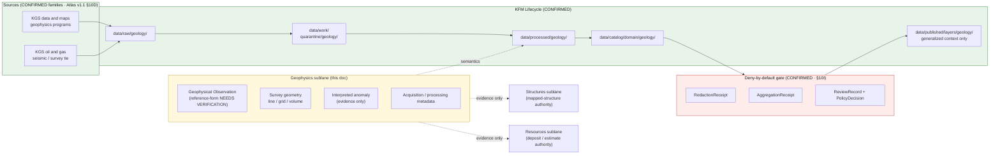

<!-- [KFM_META_BLOCK_V2]
doc_id: kfm://doc/geology-sublane-geophysics
title: Geology Sublane — Geophysics
type: standard
version: v1
status: draft
owners: <geology-domain-steward> (placeholder — verify against repo CODEOWNERS)
created: 2026-06-03
updated: 2026-06-03
policy_label: restricted
related:
  - docs/domains/geology/README.md                       # PROPOSED — verify presence
  - docs/domains/geology/sublanes/bedrock_geology.md      # PROPOSED sibling
  - docs/domains/geology/sublanes/structures.md           # PROPOSED sibling (anomaly ≠ mapped structure)
  - docs/domains/geology/sublanes/boreholes-wells.md      # PROPOSED sibling (survey ↔ well tie)
  - docs/domains/geology/sublanes/geochemistry.md         # PROPOSED sibling
  - docs/domains/geology/sublanes/resources.md            # PROPOSED sibling (anomaly ≠ deposit)
  - docs/domains/hazards/                                 # cross-lane: fault / subsidence context
  - docs/domains/people-dna-land/                         # cross-lane: survey-on-private-land
  - schemas/contracts/v1/domains/geology/                 # PROPOSED schema home (ADR-0001 default)
  - schemas/contracts/v1/receipts/                        # PROPOSED receipt schema home
  - contracts/domains/geology/                            # PROPOSED semantic contract home
  - policy/domains/geology/                                # PROPOSED policy home
  - policy/sensitivity/geology/                            # PROPOSED sensitivity home
  - data/published/layers/geology/                        # PROPOSED layer outputs
  - ai-build-operating-contract.md                        # canonical operating contract
  - directory-rules.md                                    # §12 Domain Placement Law, §5 Canonical Root Tree
  - docs/registers/DRIFT_REGISTER.md                      # object-name + naming-convention routing
tags: [kfm, geology, geophysics, seismic, gravity, magnetics, sensitive, sublane]
notes:
  - "CONTRACT_VERSION = 3.0.0 pinned per ai-build-operating-contract.md."
  - "OBJECT-NAME GAP. Atlas §10B scope names 'Geophysical Observation' as an owned object class, but the §10C/E object-family tables and the §2.2 cross-domain spine do NOT enumerate a geophysics reference-form. The reference-form name (GeophysicalObservation? GeophysicalObservationReference?) is therefore NEEDS VERIFICATION and is NOT invented here. See Open Questions OQ-GEOL-GPHYS-03."
  - "SENSITIVE LANE. A geophysical anomaly is a classic prospect signal; seismic / proprietary surveys carry rights and resource-sensitivity. policy_label set to restricted; public derivatives are generalized/aggregated with a RedactionReceipt or AggregationReceipt plus a ReviewRecord and PolicyDecision."
  - "Distinctive anti-collapse concerns: (1) anomaly ≠ Mineral Occurrence / Resource Deposit / ResourceEstimate; (2) anomaly ≠ mapped StructureFeature without independent evidence."
  - "Filename uses bare form (geophysics.md). Sibling files diverge on hyphen vs underscore vs bare; routed to DRIFT_REGISTER (OQ-GEOL-GPHYS-06)."
  - "The docs/domains/<domain>/sublanes/<sublane>.md path is PROPOSED; Directory Rules §12 does not enumerate a sublanes/ subfolder. Resolve via ADR."
  - "Owners, CI badge URLs, route names, and exact related-doc paths are placeholders pending mounted-repo verification."
[/KFM_META_BLOCK_V2] -->

# 📡 Geology Sublane — Geophysics

> Governance, semantics, and **deny-by-default** publication posture for **geophysical surveys and observations** inside the KFM Geology / Natural Resources domain lane: seismic, gravity, magnetics, resistivity, and related subsurface-imaging methods. The lane's distinctive risk is **anomaly collapse** — a geophysical anomaly is interpretive evidence, never a confirmed mapped structure and never a mineral deposit.

[](#)
[](#)
[](#)
[](#)
[](#)
[](#)
[](#)
[](#)

**Status:** draft · **Owners:** `<geology-domain-steward>` *(placeholder)* · **Contract:** `CONTRACT_VERSION = "3.0.0"` · **Policy label:** `restricted` · **Last updated:** 2026-06-03

> [!CAUTION]
> **Sensitive sublane — fail closed.** Geophysical surveys are interpretive and frequently proprietary. Raw survey traces, processed volumes, and survey-line geometry are **denied by default** until rights, source role, and resource-sensitivity are settled. Any public release requires generalization or aggregation **plus** a `RedactionReceipt` or `AggregationReceipt`, a `ReviewRecord`, and a `PolicyDecision`. When rights, source role, or sensitivity are unclear, **quarantine or deny**. See [§11 — Sensitivity, Rights, and Publication Posture](#11--sensitivity-rights-and-publication-posture).

> [!WARNING]
> **Object-name gap (NEEDS VERIFICATION).** The Atlas §10B scope names **Geophysical Observation** as an owned geology object class, but the §10C/E object-family tables and the §2.2 cross-domain object-family spine do **not** enumerate a geophysics **reference-form** (the way they carry `BoreholeReference`, `Well LogReference`, `Geochemistry SampleReference`). The canonical reference-form name is therefore **not invented here** — it is carried as "Geophysical Observation" (§10B scope) and flagged for resolution. See [§6](#6--object-families--ubiquitous-language) and [OQ-GEOL-GPHYS-03](#open-questions-register).

> [!IMPORTANT]
> **Sublane folder is PROPOSED.** Directory Rules **§12 (Domain Placement Law)** establishes the lane pattern and shows `docs/domains/<domain>/` as a directory, but it does **not** enumerate a `sublanes/` subfolder. The path used here — `docs/domains/geology/sublanes/geophysics.md` — should be confirmed by an ADR or migrated to a flat-prefix scheme before the structure is treated as canonical. See [§13 — Open Questions](#13--open-questions).

---

## Mini-TOC

- [1 · Scope](#1--scope)
- [2 · Repo Fit](#2--repo-fit)
- [3 · Inputs](#3--inputs)
- [4 · Exclusions](#4--exclusions)
- [5 · Sublane Map (Mermaid)](#5--sublane-map-mermaid)
- [6 · Object Families & Ubiquitous Language](#6--object-families--ubiquitous-language)
- [7 · Source Families & Source Roles](#7--source-families--source-roles)
- [8 · Spatial & Temporal Model](#8--spatial--temporal-model)
- [9 · Map & Viewing Products](#9--map--viewing-products)
- [10 · Pipeline Shape (RAW → PUBLISHED)](#10--pipeline-shape-raw--published)
- [11 · Sensitivity, Rights, and Publication Posture](#11--sensitivity-rights-and-publication-posture)
- [12 · Cross-Lane Relations](#12--cross-lane-relations)
- [13 · Open Questions](#13--open-questions)
- [Companion sections](#open-questions-register)
- [Related Docs](#related-docs)

---

## 1 · Scope

**CONFIRMED doctrine / PROPOSED sublane scope.** The geophysics sublane governs **geophysical survey evidence and observations** within the Geology / Natural Resources lane:

- **Geophysical Observation** *(§10B scope object)* — references to geophysical survey results: seismic, gravity, magnetics, resistivity/EM, radiometric, and related methods, carried as geology evidence or released derivatives.
- **Survey geometry** — line, grid, or volume extents of a survey (**sensitive** — see §11).
- **Interpreted anomalies / horizons** — interpretive features derived from a survey, carried as **evidence** that may *support* (never replace) `StructureFeature`, `GeologicUnit`, or resource claims in other sublanes.
- **Acquisition / processing metadata** — method, parameters, processing version, and uncertainty qualifying the observation's reliability.
- **Public-safe generalized** geophysics context products.

Doctrine basis: the Geology lane explicitly owns **geophysics** and the **Geophysical Observation** object (Atlas v1.1 §10A–B; ENCY §7.8).

> [!NOTE]
> This sublane is **interpretive evidence, not map authority.** A geophysical anomaly is a model-and-data product about the subsurface; it is **not** a mapped fault, **not** a unit boundary, and **not** a mineral deposit. Map and resource authority stay in the structures / bedrock / resources sublanes.

[Back to top ↑](#-geology-sublane--geophysics)

---

## 2 · Repo Fit

**PROPOSED placement.** This file lives under the Geology lane segment of the `docs/` responsibility root.

```text
docs/
└── domains/
    └── geology/
        ├── README.md                   # PROPOSED — domain landing
        └── sublanes/                   # PROPOSED — see §13 Open Questions
            ├── bedrock_geology.md      # PROPOSED sibling
            ├── surficial_geology.md    # PROPOSED sibling
            ├── stratigraphy.md         # PROPOSED sibling
            ├── structures.md           # PROPOSED sibling (anomaly ≠ mapped structure)
            ├── boreholes-wells.md      # PROPOSED sibling (survey ↔ well tie)
            ├── geophysics.md           # <— THIS FILE
            ├── geochemistry.md         # PROPOSED sibling
            └── resources.md            # PROPOSED sibling (anomaly ≠ deposit)
```

**Directory Rules basis (CONFIRMED against `directory-rules.md`):**

- **§12 Domain Placement Law** — geology is a **lane segment** inside responsibility roots, never a root folder. The `sublanes/` child extends the §12 lane pattern and is **not yet enumerated** there.
- **§5 Canonical Root Tree** — `docs/` is the human-facing control-plane root.
- **§4 Placement Protocol (Step 3)** — domain is a segment inside a responsibility root, named in the PR.
- **§13.1 / ADR-0001** — `schemas/contracts/v1/...` is the canonical schema home; `contracts/` retains semantic Markdown only.

**Upstream (doctrine that governs this file):**

- `directory-rules.md` — §12 Domain Placement Law, §5 Canonical Root Tree, §4 Placement Protocol (CONFIRMED).
- `ai-build-operating-contract.md` — canonical operating contract, `CONTRACT_VERSION = "3.0.0"`; §23.2 sensitive-domain matrix (CONFIRMED).
- `docs/domains/geology/README.md` — Geology lane charter (PROPOSED; verify presence).
- Atlas v1.1 Ch. 10 §10B/I — Geology scope and sensitivity posture (CONFIRMED doctrine).
- Atlas v1.1 §24.5 / unified doctrine §15–16 — T0–T4 tier scheme and per-domain sensitivity matrix (CONFIRMED doctrine).

**Downstream (artifacts that consume this sublane's semantics):**

- `contracts/domains/geology/` — semantic Markdown contract for the geophysics object (name pending; see §6). **(PROPOSED home)**
- `schemas/contracts/v1/domains/geology/` — JSON Schemas per ADR-0001 default. **(PROPOSED home)**
- `schemas/contracts/v1/receipts/` — `RedactionReceipt`, `AggregationReceipt` shapes. **(PROPOSED home)**
- `policy/domains/geology/` and `policy/sensitivity/geology/` — admissibility, deny-by-default, release rules. **(PROPOSED homes)**
- `tests/domains/geology/` and `fixtures/domains/geology/` — survey-rights + anomaly-anti-collapse + sensitive-geometry-deny fixtures. **(PROPOSED home)**
- `data/published/layers/geology/` — released **generalized** geophysics context layers only. **(PROPOSED home)**

[Back to top ↑](#-geology-sublane--geophysics)

---

## 3 · Inputs

Material that **belongs** in or is referenced by this sublane:

- **Geophysical survey records** — seismic, gravity, magnetic, resistivity/EM, radiometric (with source role, rights, sensitivity, citation, time, hash).
- **Survey geometry** — line / grid / volume extents (**sensitive** — see §11).
- **Interpreted anomalies / horizons** — interpretive products carried as evidence.
- **Acquisition / processing metadata** — method, parameters, processing version, uncertainty.
- **Generalization / aggregation receipts** describing how raw survey content and exact geometry were transformed to public-safe form.

> [!TIP]
> Inputs enter via the standard **`SourceDescriptor` → source-activation decision** path. A geophysics source is not implicitly active; it requires a recorded source role, rights / proprietary-survey review, license review, attribution, and a recorded activation decision before connectors emit to `data/raw/geology/`. *(`SourceActivationDecision` as a named object is PROPOSED — verify against `contracts/`.)*

[Back to top ↑](#-geology-sublane--geophysics)

---

## 4 · Exclusions

Material that **does not** belong here, and where it goes instead:

| Out of scope for geophysics sublane | Lives in | Canonical object family |
|---|---|---|
| Mapped faults / folds / contacts as map fact | `docs/domains/geology/sublanes/structures.md` *(PROPOSED)* | `StructureFeature` |
| Bedrock map units, lithostratigraphy | `docs/domains/geology/sublanes/bedrock_geology.md` *(PROPOSED)* | `GeologicUnit`, `Lithology` |
| Borehole / well-log location & log records | `docs/domains/geology/sublanes/boreholes-wells.md` *(PROPOSED)* | `BoreholeReference`, `Well LogReference` |
| Geochemistry samples and assays | `docs/domains/geology/sublanes/geochemistry.md` *(PROPOSED)* | `Geochemistry SampleReference` |
| Mineral occurrences, resource deposits/estimates, extraction | `docs/domains/geology/sublanes/resources.md` *(PROPOSED)* | `Mineral Occurrence`, `Resource Deposit`, `ResourceEstimate`, `Extraction Site` |
| Hazard / risk assessment from geophysics | `docs/domains/hazards/` (Hazards lane) | — |
| Survey-on-private-land **owner / parcel** assertions | `docs/domains/people-dna-land/` (Geology cannot prove ownership) | — |
| Cross-cutting governance (`EvidenceBundle`, `RunReceipt`, `ReleaseManifest` semantics) | `contracts/evidence/`, `contracts/runtime/`, `contracts/release/` *(PROPOSED homes)* | — |

> [!WARNING]
> **Anti-collapse (the defining rule of this sublane).** A geophysical anomaly **is not** a `Mineral Occurrence`, `Resource Deposit`, or `ResourceEstimate`, **and is not** a mapped `StructureFeature`. The Geology lane explicitly does **not** own ownership / lease / permit / title claims (Atlas §10B), and §10I requires occurrence, deposit, estimate, permit, production, and reserve claims to remain **distinct** from evidence. Promotion from "anomaly" to "fault" or "deposit" requires independent evidence and a release decision through the **structures** or **resources** sublane — never an interpretation rendered as fact.

[Back to top ↑](#-geology-sublane--geophysics)

---

## 5 · Sublane Map (Mermaid)

PROPOSED — illustrative; reflects doctrine relationships, not a verified runtime graph.



> [!NOTE]
> The lifecycle `RAW → WORK / QUARANTINE → PROCESSED → CATALOG / TRIPLET → PUBLISHED` is **CONFIRMED doctrine** (Directory Rules §0; Atlas v1.1 §1 Operating Law and §10H). The **catalog → published** edge passes through a deny-by-default gate; the **evidence-only** edges to structures and resources never carry map or deposit authority.

[Back to top ↑](#-geology-sublane--geophysics)

---

## 6 · Object Families & Ubiquitous Language

CONFIRMED scope term (Atlas v1.1 §10B); reference-form **NEEDS VERIFICATION**; PROPOSED field realizations until the geology schema is mounted.

> [!CAUTION]
> **Object-name discipline.** The §10B scope names **Geophysical Observation**. Unlike `BoreholeReference`, `Well LogReference`, and `Geochemistry SampleReference`, the §10C/E object-family tables do **not** print a geophysics reference-form. This doc therefore uses the scope term and **does not invent** a reference name; the canonical name is an open ADR/schema question (OQ-GEOL-GPHYS-03).

| Term | Geophysics meaning | Identity (PROPOSED) | Citation |
|---|---|---|---|
| **Geophysical Observation** | A reference to a geophysical survey result (seismic, gravity, magnetics, resistivity/EM, radiometric) carried as geology evidence or released derivative. | `source_id + object_role + temporal_scope + normalized_digest` | Atlas §10B (scope); §10E reference-form **NEEDS VERIFICATION** |
| **Survey geometry** *(qualifier)* | Line / grid / volume extent of a survey; **sensitive** geometry. | Bound to its Geophysical Observation. | INFERRED from §10B/I |
| **Interpreted anomaly** *(evidence)* | An interpretive feature derived from a survey; **supports** but does not establish a `StructureFeature` / resource claim. | Bound to its Geophysical Observation and processing version. | INFERRED from §10B; anti-collapse per §10I |
| **Acquisition / processing metadata** *(qualifier)* | Method, parameters, processing version, uncertainty qualifying the observation. | Bound to the observation. | INFERRED from §10B/E |

> [!IMPORTANT]
> A geophysical observation's value is **bound to its acquisition, processing version, and source**, not promoted to a settled subsurface fact. Reprocessing yields a new evidence assertion in lineage; it does not silently overwrite a prior interpretation.

<details>
<summary><b>Geology lane object families not owned by this sublane</b></summary>

Listed for terminology fidelity (Atlas v1.1 §10C/E). This sublane may **support** these with evidence, but MUST NOT promote its anomalies as one of them:

- `StructureFeature` — structures sublane. **A geophysical anomaly is evidence toward a structure, never the mapped structure itself.**
- `GeologicUnit`, `Lithology`, `StratigraphicInterval`, `StratigraphicCorrelation`, `GeologyBoundaryVersion` — bedrock / surficial / stratigraphy sublanes.
- `BoreholeReference`, `Well LogReference` — boreholes-wells sublane.
- `Geochemistry SampleReference` — geochemistry sublane.
- `Mineral Occurrence`, `Resource Deposit`, `ResourceEstimate`, `Extraction Site` — resources sublane. **An anomaly is evidence toward these, never one of them.**

</details>

[Back to top ↑](#-geology-sublane--geophysics)

---

## 7 · Source Families & Source Roles

CONFIRMED source families (Atlas v1.1 §10D). The §10D ledger does not list a dedicated geophysics source family; geophysics evidence arrives via KGS programs and via the oil-and-gas survey/seismic tie.

| Source family | Relevance | Source-role posture (CONFIRMED doctrine) | Citation |
|---|---|---|---|
| **KGS data and maps** | KGS geophysics programs and survey data. | authority / observation / context / model **as source role requires**; rights & current terms **NEEDS VERIFICATION**; **sensitive joins fail closed**. | Atlas §10D |
| **KGS oil and gas wells and production** | Seismic / survey content tied to oil & gas exploration. | Same posture; proprietary-survey embargo likely. | Atlas §10D |
| USGS NGMDB / GeMS | Compilation-scale geologic context (not raw geophysics). | Context only; not a geophysics observation authority. | Atlas §10D |

> [!WARNING]
> **Source roles cannot be inferred from convenience.** A processed seismic volume is an **interpretation of an observation**, not a confirmed structure. Promotion from anomaly to mapped structure or to a resource claim is a **governed state transition** through the structures or resources sublane, not a join. The Atlas posture is uniform: each source's role is "authority / observation / context / model **as source role requires**," and **sensitive joins fail closed**.

> [!CAUTION]
> **Rights / proprietary-survey gate (NEEDS VERIFICATION).** The Atlas marks KGS sources' "rights and current terms" as **NEEDS VERIFICATION** (§10D). Proprietary seismic and survey content frequently carries embargoes. Raw survey traces, processed volumes, and exact survey geometry MUST NOT publish until rights and resource-sensitivity are settled. Records MUST fail release when rights, source role, or sensitivity status is missing or unclear.

[Back to top ↑](#-geology-sublane--geophysics)

---

## 8 · Spatial & Temporal Model

CONFIRMED doctrine (Atlas v1.1 §10B/E; ENCY §7.8):

- **Geometry**
  - **Lines / grids / volumes** for survey extents; **points** for station readings (exact geometry is **sensitive** — see §11).
  - Interpreted anomalies / horizons attach to the survey geometry.
  - **Public products are generalized** (coarse coverage footprints, derived context surfaces) — never raw traces or exact survey lines.
- **Uncertainty** — acquisition error, processing-version differences, and interpretation confidence tracked explicitly.
- **Temporal handling** (Atlas v1.1 §10E — "source, observed, valid, retrieval, release, and correction times stay distinct where material"):

| Time facet | Geophysics meaning |
|---|---|
| `source_time` | Date the survey / dataset was published or filed. |
| `observed_time` | Acquisition date, when known. |
| `valid_time` | Window the observation / interpretation is considered current. |
| `retrieval_time` | When KFM pulled the source. |
| `release_time` | When KFM released the (generalized) derivative. |
| `correction_time` | When a `CorrectionNotice` was applied (e.g., reprocessing). |

> [!TIP]
> A survey's **acquisition date** and the **geologic age** of the units it images are different axes. Carry both; never collapse acquisition time into the age of the imaged rock.

[Back to top ↑](#-geology-sublane--geophysics)

---

## 9 · Map & Viewing Products

PROPOSED sublane products. As with the other subsurface sublanes, **public products here are deliberately coarse.**

| Product | Geometry | Purpose | Default tier | Status |
|---|---|---|---|---|
| **Survey coverage footprint** | Generalized polygon | Public-safe "where surveys exist" without exact lines. | T1 | PROPOSED |
| **Derived context surface** | Generalized raster | Public-safe generalized geophysical context (e.g., regional gravity/magnetic trend). | T1 | PROPOSED |
| **Raw survey traces / processed volume** | Line / grid / volume | Reviewer / steward use only; never a public tier by default. | **T2–T4** | PROPOSED |
| **Interpreted-anomaly evidence panel** | Attribute (Evidence Drawer) | Released-evidence summary of an anomaly supporting a study; reviewer-bounded. | T2 | PROPOSED |

CONFIRMED cross-cutting view doctrine (Atlas §10G; MAP-MASTER; GAI): every product participates in **Evidence Drawer, time-aware state, trust badges, sensitivity-redacted view, correction/stale-state view, and governed Focus Mode**. The default surface here is the **sensitivity-redacted view**; raw traces and exact survey geometry are suppressed unless the requester is policy-authorized.

> [!CAUTION]
> A public click on a survey-coverage footprint must return the **generalized footprint** plus its `RedactionReceipt` — never raw traces, exact survey lines, or any framing that implies a confirmed structure or deposit.

[Back to top ↑](#-geology-sublane--geophysics)

---

## 10 · Pipeline Shape (RAW → PUBLISHED)

CONFIRMED doctrine; PROPOSED sublane application. Promotion is a **governed state transition, not a file move** (Directory Rules §0; Atlas v1.1 §10H).

| Stage | Geophysics handling | Gate | Status |
|---|---|---|---|
| **RAW** | Capture survey / observation source payload with source role, **rights & proprietary-survey status**, sensitivity, citation, time, hash. | `SourceDescriptor` exists. | PROPOSED |
| **WORK / QUARANTINE** | Normalize CRS, survey geometry, method/parameter metadata, processing version, identity, evidence, rights, policy. **Quarantine** any record with unconfirmed rights, embargo flags, or unclear source role. | Validation + policy gate pass, or quarantine reason recorded. | PROPOSED |
| **PROCESSED** | Emit validated Geophysical Observation evidence and **public-safe candidate** generalized footprints/surfaces. Emit `EvidenceRef`, `ValidationReport`; close digest. | `EvidenceRef`, `ValidationReport`, digest closure exist. | PROPOSED |
| **CATALOG / TRIPLET** | Emit catalog records, `EvidenceBundle`s, graph/triplet projections, and release candidates. | Catalog / proof closure passes. | PROPOSED |
| **PUBLISHED** | Serve **only generalized** public-safe artifacts through governed APIs and a `ReleaseManifest`, each carrying a `RedactionReceipt` or `AggregationReceipt`. | `ReleaseManifest`, `RedactionReceipt`/`AggregationReceipt`, `ReviewRecord`, `PolicyDecision`, correction path, rollback target. | PROPOSED |

> [!CAUTION]
> **Watcher-as-non-publisher invariant.** A geophysics-source watcher **MAY emit a candidate `PromotionDecision`**; it MUST NOT write to `data/processed/geology/` or `data/published/layers/geology/` directly, and MUST NOT auto-publish raw traces, processed volumes, or exact survey geometry under any circumstances.

[Back to top ↑](#-geology-sublane--geophysics)

---

## 11 · Sensitivity, Rights, and Publication Posture

CONFIRMED / INFERRED (Atlas v1.1 §10I; operating contract §23.2; T0–T4 tier scheme §24.5 / unified doctrine §15–16):

- **Default-deny on raw content and exact geometry.** §10I requires **sensitive-resource** material and exact subsurface geometry to default to restricted or generalized form. Proprietary seismic/survey content is treated with the same caution (CONFIRMED posture; proprietary-survey specifics NEEDS VERIFICATION).
- **Anti-collapse.** Occurrence, deposit, estimate, permit, production, and reserve claims must remain distinct from observation evidence (Atlas §10I, CONFIRMED). Additionally, an anomaly must remain distinct from a mapped `StructureFeature`.
- **Default-deny on missing inputs.** Unclear rights, unresolved source role, missing evidence, unresolved sensitivity, or absent release state **blocks public promotion** (Atlas §1 Operating Law and §10I; Directory Rules — CONFIRMED).

The tier assignments below are **INFERRED from §10I** (the Atlas per-domain tier matrix §24.5.2 does not print an explicit geology row). Treat the specific tier values as **PROPOSED**, grounded in the §10I posture and the cross-domain tier scheme.

| Object class | Default tier (PROPOSED, from §10I) | Allowed transform | Required gates |
|---|---|---|---|
| Raw survey traces / processed volume | **T2–T4** | Generalize to coverage footprint or derived context surface → T1. | `RedactionReceipt` or `AggregationReceipt` + `ReviewRecord` + `PolicyDecision`. |
| Proprietary / embargoed survey | **T3–T4** | Release only under named agreement or after embargo, recorded. | `PolicyDecision` + `ReviewRecord` + agreement. |
| Exact survey-line / station geometry | **T2–T4** | Generalize to coarse footprint → T1. | `RedactionReceipt` + `ReviewRecord`. |
| Survey on private land (owner-linkable) | **T4** | De-identify + generalize geometry → T2 at most; owner identity never on a public tier. | `RedactionReceipt` + `ReviewRecord` + `PolicyDecision`. |
| Generalized coverage footprint / context surface | **T1** | Generalization with coarse extent. | `RedactionReceipt` or `AggregationReceipt`. |

**Tier transitions are governed** (CONFIRMED, Atlas §24.5.3): `T4 → T1` requires `RedactionReceipt + ReviewRecord`; `T4 → T2` requires `PolicyDecision + ReviewRecord`; `T4 → T3` requires `PolicyDecision + ReviewRecord + agreement`; all transitions are reversible (revocation returns the object toward T4 with a `CorrectionNotice`).

> [!IMPORTANT]
> **An anomaly is not a structure, and a survey is not a public artifact.** A public requester must receive a **generalized** answer plus its receipt — never raw traces, exact survey geometry, or any framing that implies a confirmed fault or deposit, unless the requester is policy-authorized and the transition is recorded. Per operating contract §23.2, when no row clearly matches, the default disposition is **deny exact exposure, generalize, redact, quarantine uncertain material, require steward review, require a transform receipt, and abstain when support is inadequate.**

[Back to top ↑](#-geology-sublane--geophysics)

---

## 12 · Cross-Lane Relations

CONFIRMED doctrine (Atlas v1.1 §10F). Each relation MUST preserve **ownership, source role, sensitivity, and `EvidenceBundle` support** — none are joins of convenience.

| This sublane | Related lane | Relation | Constraint |
|---|---|---|---|
| Geophysics | **Structures** | Anomaly → **evidence toward** a `StructureFeature` | Evidence supports; it does **not** establish a mapped structure. |
| Geophysics | **Resources** | Anomaly → **evidence toward** `Mineral Occurrence` / `Resource Deposit` | Evidence supports; deposit / estimate authority lives in the resources sublane. |
| Geophysics | **Boreholes-Wells** | Survey ↔ borehole / log tie | Survey calibrated against well evidence; **location handling stays under boreholes-wells**. |
| Geophysics | **Bedrock / Stratigraphy** | Imaged horizon → **evidence** for a unit / interval | Supports unit characterization; does not remap a boundary. |
| Geophysics | **Hazards** | Subsurface void / fault image → subsidence / seismic context | Geology provides context only; Hazards owns risk. |
| Geophysics | **People / Land** | Survey on private land ↔ owner / parcel | A survey **cannot prove** ownership; owner-linkable joins are **T4** and deny by default. |

[Back to top ↑](#-geology-sublane--geophysics)

---

## 13 · Open Questions

| # | Question | Evidence that would settle it | Status |
|---|---|---|---|
| 1 | Is `docs/domains/<domain>/sublanes/<sublane>.md` an accepted layout, or should sublane docs use a flat-prefix scheme? | An ADR amending Directory Rules §12, or a mounted-repo precedent. | NEEDS VERIFICATION |
| 2 | Does the Geology lane carry semantic contracts under `contracts/domains/geology/` and machine schemas under `schemas/contracts/v1/domains/geology/` per ADR-0001? | Mounted-repo inspection; ADR-0001 status. | NEEDS VERIFICATION |
| 3 | What is the canonical **reference-form** name for geophysics? §10B names "Geophysical Observation" but §10C/E enumerate no geophysics reference object. | `contracts/` / schema inspection; geology object-family ADR. | NEEDS VERIFICATION |
| 4 | What are the **default tier values** for geophysics object classes? §24.5.2 has no explicit geology row; tiers here are INFERRED from §10I. | An explicit geology row added to the per-domain tier matrix, or a `policy/sensitivity/geology/` entry. | PROPOSED |
| 5 | What **proprietary-survey / embargo rule** applies (release timing, named-agreement requirements)? | A `policy/sensitivity/geology/` entry + a proprietary-survey-deny fixture. | NEEDS VERIFICATION |
| 6 | What is the **anomaly-anti-collapse rule** (which interpretation states may be surfaced, and how anomaly-vs-structure is enforced)? | A `policy/` entry + an anomaly-anti-collapse test fixture. | NEEDS VERIFICATION |
| 7 | Is there a dedicated geophysics **source family** in the source ledger, or does it route via KGS / oil-and-gas? | `data/registry/sources/geology/`; source-ledger inspection. | NEEDS VERIFICATION |
| 8 | What is the exact name of the source-activation outcome object (`SourceActivationDecision` is PROPOSED)? | `contracts/` semantic-contract inspection. | NEEDS VERIFICATION |
| 9 | Filename convention: hyphen vs underscore vs bare for sublane files? | Mounted-repo precedent or a docs-naming ADR. | NEEDS VERIFICATION |

[Back to top ↑](#-geology-sublane--geophysics)

---

## Open questions register

| ID | Question | Owner role | Resolution path |
|---|---|---|---|
| OQ-GEOL-GPHYS-01 | Accept `sublanes/` subfolder vs flat-prefix scheme under `docs/domains/geology/`. | docs steward + directory-rules owner | ADR amending Directory Rules §12; DRIFT_REGISTER entry. |
| OQ-GEOL-GPHYS-02 | Confirm geology contract/schema/receipt homes. | geology domain steward | Mounted-repo inspection + ADR-0001 check. |
| OQ-GEOL-GPHYS-03 | Canonical geophysics reference-form object name (not enumerated in §10C/E). | geology domain steward | Geology object-family ADR / schema PR; DRIFT_REGISTER entry. |
| OQ-GEOL-GPHYS-04 | Default tier values for geophysics object classes. | geology domain steward + rights reviewer | Add explicit geology row to §24.5.2 / `policy/sensitivity/geology/`. |
| OQ-GEOL-GPHYS-05 | Proprietary-survey / embargo and anomaly-anti-collapse rules. | rights reviewer + geology domain steward | `policy/sensitivity/geology/` entries + fixtures. |
| OQ-GEOL-GPHYS-06 | Sublane filename convention: hyphen vs underscore vs bare. | docs steward | Docs-naming ADR; DRIFT_REGISTER entry. |

## Open verification backlog

These items remain `NEEDS VERIFICATION` before promotion from `draft` to `published`:

1. Sublane folder layout (`sublanes/` vs flat prefix) — Directory Rules §12 silent.
2. Geology contract / schema / receipt homes against mounted repo and ADR-0001.
3. **Canonical geophysics reference-form object name** (gap between §10B scope and §10C/E tables).
4. Default tier values for geophysics object classes (no explicit §24.5.2 geology row).
5. Proprietary-survey / embargo rule and named-agreement requirements.
6. Anomaly-anti-collapse rule (anomaly vs `StructureFeature` vs deposit) and enforcement.
7. Dedicated geophysics source family vs routing via KGS / oil-and-gas.
8. Exact source-activation outcome object name.
9. Filename convention (hyphen vs underscore vs bare).

## Changelog v0 → v1

| Change | Type (per contract §37) | Reason |
|---|---|---|
| New sublane doc created at `docs/domains/geology/sublanes/geophysics.md` | new | First geophysics sublane doc. |
| Object term carried as §10B scope "Geophysical Observation"; reference-form flagged NEEDS VERIFICATION | new | §10C/E enumerate no geophysics reference object; no name invented. |
| §7 source families noted as routing via KGS + oil-and-gas (no dedicated §10D geophysics family) | new | The §10D ledger lists no standalone geophysics source. |
| Added deny-by-default sensitivity posture, T-tier table, tier-transition gates, and the anomaly-vs-structure / anomaly-vs-deposit anti-collapse rules | new | §10I sensitivity + proprietary-survey caution; anomaly collapse is the lane's defining risk. |
| Added companion sections (Open Qs register, Verification backlog, Changelog, DoD) | new | Doctrine-doc companion pattern. |

> **Backward compatibility.** New file; no prior anchors to preserve. Anchors use GitHub auto-slug of the H1 "📡 Geology Sublane — Geophysics"; verify the leading-emoji slug renders as `#-geology-sublane--geophysics` on the target GitHub instance.

## Definition of done

This document is done enough to enter the repository when:

- it is placed according to Directory Rules (sublane-folder question OQ-GEOL-GPHYS-01 resolved);
- the geophysics reference-form object name is resolved (OQ-GEOL-GPHYS-03);
- the filename convention is resolved (OQ-GEOL-GPHYS-06);
- a docs steward, the geology domain steward, **and a rights reviewer** review it (sensitive lane);
- it is linked from the Geology lane `README.md` / doctrine index;
- it does not conflict with accepted ADRs (ADR-0001 schema home; any sublane-folder ADR; geology object-family ADR);
- the proprietary-survey, anomaly-anti-collapse, and tier rules are mirrored in `policy/sensitivity/geology/` (or that gap is logged);
- object-name, naming, and folder questions are logged in `docs/registers/DRIFT_REGISTER.md`;
- the `GENERATED_RECEIPT.json` planned at authoring time is wired into CI;
- future changes follow the operating contract §37 lifecycle.

---

## Related Docs

PROPOSED — verify each path against the mounted repo before linking.

- `docs/domains/geology/README.md` — Geology lane charter.
- `docs/domains/geology/sublanes/structures.md` — Sibling sublane (mapped-structure authority; anomaly ≠ structure).
- `docs/domains/geology/sublanes/bedrock_geology.md` — Sibling sublane (unit / horizon evidence).
- `docs/domains/geology/sublanes/boreholes-wells.md` — Sibling sublane (survey ↔ well tie; location handling).
- `docs/domains/geology/sublanes/resources.md` — Sibling sublane (deposit / estimate authority; anomaly ≠ deposit).
- `docs/domains/hazards/` — Cross-lane (subsidence / seismic context).
- `docs/domains/people-dna-land/` — Cross-lane (survey-on-private-land owner / parcel; deny by default).
- `directory-rules.md` §12 — Domain Placement Law; §5 Canonical Root Tree; §4 Placement Protocol.
- `ai-build-operating-contract.md` — canonical operating contract (`CONTRACT_VERSION = "3.0.0"`); §23.2 sensitive-domain matrix.
- Atlas v1.1 Ch. 10 §10B/I — Geology scope and sensitivity posture.
- Atlas v1.1 §24.5 — Sensitivity / rights tier reference (T0–T4) and tier transitions.
- `docs/registers/DRIFT_REGISTER.md` — object-name + naming-convention routing.

---

<details>
<summary><b>Appendix A · Geophysics review checklist (PROPOSED reviewer aid — sensitive lane)</b></summary>

A non-normative checklist for PRs that touch geophysics artifacts. Promote to `docs/runbooks/geology/GEOPHYSICS_REVIEW.md` if it survives use.

- [ ] **Source activation** — `SourceDescriptor` exists; activation decision records role, rights, **proprietary-survey status**, license, attribution.
- [ ] **Source role** — survey declared as observation/evidence; not treated as confirmed-structure or deposit authority.
- [ ] **Object name** — pending OQ-GEOL-GPHYS-03; do not invent a reference-form name in artifacts.
- [ ] **Schema home** — JSON Schema under `schemas/contracts/v1/domains/geology/...`; receipts under `schemas/contracts/v1/receipts/`.
- [ ] **Raw content suppressed** — no raw traces, processed volume, or exact survey geometry in any public-tier artifact.
- [ ] **Anomaly anti-collapse** — no anomaly framed as a mapped `StructureFeature` or as a `Mineral Occurrence` / `Resource Deposit`.
- [ ] **Receipt present** — `RedactionReceipt` or `AggregationReceipt` accompanies every public derivative.
- [ ] **Review present** — `ReviewRecord` + `PolicyDecision` recorded for the tier transition.
- [ ] **Embargo** — proprietary surveys held at T3–T4; release only under named agreement.
- [ ] **Private land** — owner-linkable surveys de-identified; owner identity never on a public tier.
- [ ] **Evidence closure** — `EvidenceRef` resolves to a populated `EvidenceBundle`.
- [ ] **Cross-lane** — structures / resources / boreholes-wells / hazards / people-land joins preserve ownership, source role, sensitivity, and `EvidenceBundle` support.

</details>

<details>
<summary><b>Appendix B · Anti-pattern register (illustrative)</b></summary>

| Anti-pattern | Symptom | Fix |
|---|---|---|
| **Anomaly-as-structure** | A geophysical anomaly is rendered or described as a mapped fault. | Keep it as **evidence** toward a `StructureFeature`; mapped-structure authority is the structures sublane. |
| **Anomaly-as-deposit** | A geophysical high is described as a mineral deposit / prospect. | Keep it as **evidence**; route deposit/estimate claims through the resources sublane with independent support. |
| **Raw content published** | Raw traces or a processed volume appear on a public tier. | Suppress; publish generalized footprint / context surface with `RedactionReceipt`; record `ReviewRecord` + `PolicyDecision`. |
| **Embargo skipped** | Proprietary seismic released without agreement. | Hold at T3–T4; release only under named agreement with `PolicyDecision` + `ReviewRecord`. |
| **Invented object name** | An artifact uses a guessed geophysics reference-form name. | Hold the name pending OQ-GEOL-GPHYS-03; use the §10B scope term until resolved. |
| **Owner leak** | A survey-on-private-land record exposes owner or parcel. | De-identify; route owner/parcel claims to People/Land (T4); never on a public tier. |
| **Watcher publishes traces** | A geophysics watcher writes raw survey content to `data/published/`. | Watcher emits candidate `PromotionDecision` only; raw content never auto-published. |

</details>

---

**Last updated:** 2026-06-03 · **Doc status:** draft (v1) · **Authority:** doctrine CONFIRMED / paths PROPOSED · **Sensitivity:** restricted · deny-by-default · **Contract:** `CONTRACT_VERSION = "3.0.0"` · [Back to top ↑](#-geology-sublane--geophysics)
