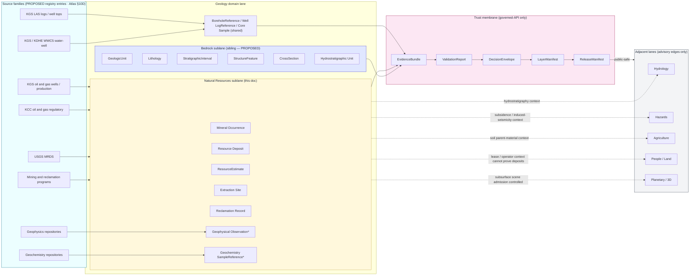

<!-- [KFM_META_BLOCK_V2]
doc_id: kfm://doc/docs-domains-geology-sublanes-natural-resources
title: Natural Resources Sublane — Geology Domain
type: domain-sublane
version: v0.2
status: draft
owners: <Geology domain steward — TODO confirm>; <Natural-Resources reviewer — TODO confirm>; <rights reviewer — TODO confirm>
created: 2026-05-17
updated: 2026-06-03
policy_label: restricted
related:
  - docs/domains/geology/README.md                       # PROPOSED — verify exists
  - docs/domains/README.md                                # PROPOSED — verify exists
  - docs/domains/geology/sublanes/bedrock_geology.md      # PROPOSED sibling
  - docs/domains/geology/sublanes/boreholes-wells.md      # PROPOSED sibling (shared subsurface objects)
  - docs/domains/geology/sublanes/geochemistry.md         # PROPOSED sibling (assay ≠ deposit)
  - docs/domains/geology/sublanes/geophysics.md           # PROPOSED sibling (anomaly ≠ deposit)
  - directory-rules.md                                    # §12 Domain Placement Law, §5 Canonical Root Tree
  - ai-build-operating-contract.md                        # canonical operating contract
  - docs/doctrine/trust-membrane.md                       # PROPOSED — verify exists
  - docs/doctrine/lifecycle-law.md                        # PROPOSED — verify exists
  - docs/architecture/contract-schema-policy-split.md     # PROPOSED — verify exists
  - docs/sources/source-roles.md                          # PROPOSED — verify path
  - docs/registers/DRIFT_REGISTER.md                      # terminology + naming-convention routing
tags: [kfm, domain, geology, natural-resources, sublane]
notes:
  - "CONTRACT_VERSION = 3.0.0 pinned per ai-build-operating-contract.md."
  - "v0.2 reconciliation: FaultStructure -> StructureFeature (Atlas §10C/E canonical; prior v0.1 used the drift form). Object names aligned to Atlas object-family casing: 'Mineral Occurrence', 'Resource Deposit', 'ResourceEstimate', 'Extraction Site', 'Reclamation Record', 'Geochemistry SampleReference', 'Well LogReference', 'BoreholeReference', 'Core Sample', 'Geophysical Observation', 'Hydrostratigraphic Unit'. Prior bare-CamelCase forms were drift; routed to DRIFT_REGISTER."
  - "v0.2 path normalization: schema/contract/policy homes use the Directory Rules §12 'domains/' segment (schemas/contracts/v1/domains/geology/, contracts/domains/geology/, policy/domains/geology/). Prior v0.1 mixed 'geology/' and 'contracts/geology/' forms; corrected and flagged."
  - "v0.2 sensitivity: policy_label raised draft->restricted at the doc level. NR is a deny-by-default sublane (exact extraction/well/occurrence locations, operator-private logs). Added explicit T0-T4 tier table and tier-transition gates per Atlas §24.5."
  - "Reclamation Record, Core Sample, Geophysical Observation appear in §10B scope but are NOT enumerated as reference-forms in the §10C/E object-family tables; their reference-form names are NEEDS VERIFICATION and are not invented here."
  - "Subfolder convention `sublanes/` is PROPOSED; not present in directory-rules.md §12. See §2 Repo fit."
  - "Implementation maturity is UNKNOWN — repo not mounted this session."
[/KFM_META_BLOCK_V2] -->

# 🪨 Natural Resources Sublane — Geology Domain

*Doctrinal scope for the resource-focused half of the Geology lane: minerals, oil and gas, extraction, reclamation, and resource estimates — kept distinct from bedrock/structural geology and from regulatory, legal, or hazards authority.*

<!-- Badge row: placeholders. Replace targets after CI / repo verification. -->
[](#)
[](#)
[](#)
[](#)
[](#)
[](#)
[](#)

> **Status:** draft &nbsp;·&nbsp; **Owners:** Geology domain steward · NR reviewer · rights reviewer (TODO confirm) &nbsp;·&nbsp; **Contract:** `CONTRACT_VERSION = "3.0.0"` &nbsp;·&nbsp; **Last updated:** 2026-06-03

> [!NOTE]
> **v0.2 terminology reconciliation.** This revision aligns object names to **Atlas v1.1 Ch. 10C/E** canonical casing. The prior v0.1 used `FaultStructure` (drift → corrected to **`StructureFeature`**) and bare-CamelCase resource names (`MineralOccurrence`, etc. → corrected to the Atlas forms **`Mineral Occurrence`**, **`Resource Deposit`**, **`ResourceEstimate`**, **`Extraction Site`**, **`Reclamation Record`**). Schema/contract/policy paths now use the Directory Rules §12 `domains/` segment. All renames are routed to `docs/registers/DRIFT_REGISTER.md`.

---

## Contents

- [0. Status & Authority](#0-status--authority)
- [1. Scope and one-line purpose](#1-scope-and-one-line-purpose)
- [2. Repo fit and placement caveat](#2-repo-fit-and-placement-caveat)
- [3. Inputs — what belongs in this sublane](#3-inputs--what-belongs-in-this-sublane)
- [4. Exclusions — what does *not* belong here](#4-exclusions--what-does-not-belong-here)
- [5. Sublane map — sources, objects, and trust path](#5-sublane-map--sources-objects-and-trust-path)
- [6. Ubiquitous language](#6-ubiquitous-language)
- [7. Source families and source roles](#7-source-families-and-source-roles)
- [8. Object families owned by this sublane](#8-object-families-owned-by-this-sublane)
- [9. Cross-lane relations](#9-cross-lane-relations)
- [10. Map and viewing products](#10-map-and-viewing-products)
- [11. Pipeline shape — RAW → PUBLISHED](#11-pipeline-shape--raw--published)
- [12. Sensitivity, rights, and publication posture](#12-sensitivity-rights-and-publication-posture)
- [13. Source-role anti-collapse — the critical NR discipline](#13-source-role-anti-collapse--the-critical-nr-discipline)
- [14. Validators, tests, fixtures](#14-validators-tests-fixtures)
- [15. Governed AI behavior for this sublane](#15-governed-ai-behavior-for-this-sublane)
- [16. Related docs](#16-related-docs)
- [17. Verification backlog and open questions](#17-verification-backlog-and-open-questions)
- [Companion sections](#open-questions-register)
- [Appendix — Proposed file homes and source-role worked examples](#appendix--proposed-file-homes-and-source-role-worked-examples)

---

## 0. Status & Authority

| Field | Value |
|---|---|
| **Document type** | Domain-sublane doctrine (sub-scope of the Geology domain) |
| **Authority of this sublane's *scope*** | CONFIRMED — derived directly from the Atlas "Geology and Natural Resources" canonical object families and source families (§10B–E) |
| **Authority of any *path* quoted here** | PROPOSED until verified against mounted-repo evidence |
| **Authority of the `sublanes/` subfolder convention** | **PROPOSED — not codified in `directory-rules.md` §12** (see §2.2). Treat as an organizational decomposition for documentation only; it does **not** create a parallel authority root. |
| **Parent lane** | Geology (`docs/domains/geology/`) — the canonical domain lane per Directory Rules §12 |
| **Schema / contract / policy home** | Unified under the parent lane: `schemas/contracts/v1/domains/geology/`, `contracts/domains/geology/`, `policy/domains/geology/` (PROPOSED placement per Directory Rules §4 Step 3 + §12) |
| **Owner** | Geology domain steward — TODO confirm; Natural-Resources reviewer — TODO confirm; rights reviewer — TODO confirm |
| **Lifecycle invariant** | RAW → WORK / QUARANTINE → PROCESSED → CATALOG / TRIPLET → PUBLISHED. Promotion is a **governed state transition, not a file move.** |
| **Supersedes** | v0.1 (terminology + path reconciliation; see Changelog) |
| **Implementation maturity** | UNKNOWN this session — repo not mounted. Doctrinal claims CONFIRMED from Atlas; implementation claims PROPOSED. |

[Back to top](#contents)

---

## 1. Scope and one-line purpose

**One-line purpose.** Govern Kansas natural-resource evidence — minerals, oil/gas, extraction, reclamation, and resource estimates — as a bounded sublane of the Geology domain, without conflating observation with regulation, regulation with title, or extraction records with hazards risk.

CONFIRMED doctrine, PROPOSED implementation: the Geology / Natural Resources domain owns **bedrock/surficial geology, stratigraphy, lithology, structures, geomorphology, boreholes, well logs, cores, geophysics, geochemistry, mineral/resource distinctions, and extraction/reclamation context**, and links to Hydrology via hydrostratigraphy (Atlas §10A–B). The Natural Resources sublane carves out the **resource-focused** subset and inherits all Geology-lane governance.

> [!IMPORTANT]
> **This sublane is a documentation decomposition, not an authority split.** Every canonical schema, contract, policy, validator, and pipeline for natural-resource evidence lives **under the Geology lane** (`schemas/contracts/v1/domains/geology/...`, `policy/domains/geology/...`, etc.). The sublane file exists so the resource-focused responsibilities can be read coherently in one place; it does not create a parallel root and does not bypass the trust membrane.

[Back to top](#contents)

---

## 2. Repo fit and placement caveat

### 2.1 Path

```text
docs/domains/geology/sublanes/natural_resources.md
```

### 2.2 Why this placement is PROPOSED

Directory Rules **§12 (Domain Placement Law)** shows the canonical lane segments (`docs/domains/geology/`, `contracts/domains/geology/`, `schemas/contracts/v1/domains/geology/`, …) and treats `docs/domains/<domain>/` as a directory, but it does **not** enumerate a `sublanes/` subfolder. The `sublanes/` segment used here is therefore a **PROPOSED organizational pattern** for grouping intra-lane scope documents (Geology splits cleanly into a "bedrock / stratigraphy / structures" half and a "natural resources" half).

> [!NOTE]
> **Recommended follow-up:** either (a) document the `sublanes/` convention in `docs/domains/README.md` or a per-root README, or (b) open an ADR amending `directory-rules.md` §12 to permit `docs/domains/<domain>/sublanes/<sublane>.md` as an explicit pattern. Until either lands, this file's location is PROPOSED / NEEDS VERIFICATION (OQ-GEOL-NR-01).

### 2.3 Upstream and downstream context

| Direction | Relation | Target (PROPOSED paths) |
|---|---|---|
| Upstream (authority) | Inherits scope from the Geology domain lane | `docs/domains/geology/README.md` (PROPOSED) |
| Upstream (doctrine) | Bound by lifecycle, trust membrane, truth-posture, Directory Rules | `directory-rules.md`, `ai-build-operating-contract.md`, `docs/doctrine/*.md` |
| Sibling (sublane) | Bedrock / surficial / structural geology sublane | `docs/domains/geology/sublanes/bedrock_geology.md` (PROPOSED) |
| Sibling (sublane) | Subsurface point evidence (shared objects) | `docs/domains/geology/sublanes/boreholes-wells.md` (PROPOSED) |
| Downstream (objects) | Object-family definitions | `contracts/domains/geology/{mineral_occurrence,resource_deposit,resource_estimate,extraction_site,reclamation_record}.md` (PROPOSED) |
| Downstream (shape) | Field shape | `schemas/contracts/v1/domains/geology/...` (PROPOSED — Directory Rules §12) |
| Downstream (policy) | Sensitivity, rights, release policy | `policy/domains/geology/...` (PROPOSED) |
| Downstream (data) | Lifecycle data | `data/{raw,work,quarantine,processed,catalog,published,registry}/geology/...` per Directory Rules §12 |

[Back to top](#contents)

---

## 3. Inputs — what belongs in this sublane

In scope for **Natural Resources** within the Geology domain:

- **Mineral evidence:** `Mineral Occurrence` records, `Resource Deposit` characterizations, mining-records context, `ResourceEstimate` documents.
- **Subsurface fluid resources:** oil and gas wells, production records (where rights allow), regulatory records (as **regulatory**, not as observation), well logs and well tops, cores, measured sections — where the use is resource-focused.
- **Extraction context:** active and historical `Extraction Site` records, operator-status context, permit and lease *context* (never as proof of deposit existence or as title authority).
- **Reclamation context:** reclamation programs, `Reclamation Record` status, post-extraction land-use context.
- **Resource-exploration evidence:** `Geochemistry SampleReference` and `Geophysical Observation` *insofar as they are deployed for resource characterization* — when used for bedrock mapping or structural geology, see the bedrock / geophysics sublanes.
- **Public-safe generalized derivatives** of any of the above (e.g., county-level mineral-occurrence summaries with exact coordinates redacted).

> [!TIP]
> The same physical record (e.g., a borehole or a well log) may serve **both** sublanes. The sublane affiliation is determined by **the source role and the use** declared in the `SourceDescriptor` and `EvidenceBundle` — not by the data's geometry or filename.

[Back to top](#contents)

---

## 4. Exclusions — what does *not* belong here

**Hard exclusions — owned by other lanes and never re-asserted from this sublane:**

| Excluded scope | Owning lane | Why |
|---|---|---|
| Hydrology measurements (streamflow, groundwater levels) | Hydrology | NR may receive `Hydrostratigraphic Unit` context only |
| Soil properties and soil surveys | Soil | NR may consume soil parent-material context as advisory only |
| Hazards risk truth (faults, landslides, subsidence, induced seismicity) | Hazards | NR emits geologic *context*; risk evaluation and life-safety messaging belong to Hazards (and KFM is never an alert authority) |
| Title, deed, lease, parcel, operator identity as **truth** | People / Genealogy / DNA / Land | NR may join *for context*; lease/parcel/operator relation **cannot prove deposits** (Atlas §10F) |
| Regulatory enforcement decisions | Out of KFM scope | KFM stores regulatory *records* with source-role `regulatory`; it does not act as a regulator |
| Bedrock unit / surficial unit / structural geology authority | Geology — bedrock / structures sublanes | This sublane focuses on resources; structural/stratigraphic primacy stays with those sublanes |
| UI / AI narrative claims about deposits | Map shell, Governed AI runtime | Downstream consumers; truth lives in `EvidenceBundle` |

[Back to top](#contents)

---

## 5. Sublane map — sources, objects, and trust path

The diagram shows where the Natural Resources sublane sits inside the Geology lane and how it connects to sources, to its object families, to the shared trust membrane, and to adjacent lanes. CONFIRMED structural pattern; PROPOSED specific nodes pending implementation.



*`Geophysical Observation` and `Geochemistry SampleReference` carry a source-role badge that determines which sublane is using them; both sublanes may legitimately reference the same instance.*

> [!NOTE]
> The arrows from the trust membrane to adjacent lanes are deliberately marked **public-safe**: cross-lane consumption happens via released `EvidenceBundle`s, not by reaching into NR's working data. This preserves the watcher-as-non-publisher and trust-membrane invariants.

[Back to top](#contents)

---

## 6. Ubiquitous language

CONFIRMED terms within the Geology domain that are **resource-focused** and therefore primary here, in **Atlas object-family casing**. Field realization is PROPOSED until schemas are authored under `schemas/contracts/v1/domains/geology/`.

> [!CAUTION]
> **Casing and naming are load-bearing.** The Atlas object-family tables (§10C/E, §2.2) print **`Mineral Occurrence`**, **`Resource Deposit`**, **`ResourceEstimate`**, **`Extraction Site`**, **`Reclamation Record`**, **`Geochemistry SampleReference`**, **`Well LogReference`**, **`BoreholeReference`**, and **`StructureFeature`** (not `FaultStructure`). The prior v0.1 bare-CamelCase forms were drift, corrected here.

| Term | Sublane meaning (CONFIRMED doctrine) | Field realization status |
|---|---|---|
| `Mineral Occurrence` | A documented mineral observation at a location, with source role, observation/retrieval time, and rights metadata. Existence of an occurrence record does **not** by itself establish economic deposit, lease, or title. | PROPOSED |
| `Resource Deposit` | A characterized accumulation of a natural resource, with explicit source role (observation vs. interpretation vs. model) and uncertainty support. | PROPOSED |
| `ResourceEstimate` | An estimate (volume, tonnage, recoverability) attributable to a specific method, source, and time. Estimates are **interpretations**, not measurements; never published without methodology and uncertainty. | PROPOSED |
| `Extraction Site` | A site at which extraction has taken or is taking place, with operator-status context and freshness. Operator identity is **People / Land** context, not NR truth. | PROPOSED |
| `Reclamation Record` | A documented reclamation status, program reference, or post-extraction land-use record. *(§10B scope object; reference-form not separately enumerated in §10E.)* | PROPOSED |
| `BoreholeReference` *(shared)* | A physical or recorded subsurface penetration. Resource-focused boreholes (oil/gas, exploration) anchor here; mapping/coring boreholes anchor in the bedrock / boreholes-wells sublane. | PROPOSED |
| `Well LogReference` *(shared)* | A digital or interpreted log of a borehole. Production-context logs anchor here; stratigraphic-mapping logs anchor in the bedrock sublane. | PROPOSED |
| `Core Sample` *(shared)* | A physical or digitized core sample. Sublane attribution follows source role and use. *(§10B scope object; reference-form NEEDS VERIFICATION.)* | PROPOSED |
| `Geophysical Observation` *(shared)* | A geophysical measurement; resource-exploration uses anchor here. *(§10B scope object; reference-form NEEDS VERIFICATION.)* | PROPOSED |
| `Geochemistry SampleReference` *(shared)* | A geochemistry sample; resource-prospecting uses anchor here. | PROPOSED |

> [!NOTE]
> All identity rules follow the Atlas PROPOSED deterministic basis: `source_id + object_role + temporal_scope + normalized_digest`. Source, observed, valid, retrieval, release, and correction times remain distinct where material.

[Back to top](#contents)

---

## 7. Source families and source roles

CONFIRMED doctrine: every source carries a declared **role**. The Atlas §10D ledger states each geology source's role as "authority / observation / context / model **as source role requires**"; the finer NR role vocabulary (`regulatory`, `aggregator`, `status`, `claim`, …) is governed by `docs/sources/source-roles.md` (PROPOSED). Rights and current terms are **NEEDS VERIFICATION** per source. **Sensitive joins fail closed by default.**

| Source family | Typical role(s) | Primary contribution to NR | Rights / sensitivity | Status |
|---|---|---|---|---|
| Kansas Geological Survey (KGS) data and maps | observation / context | Resource-context overlays, surficial/bedrock framing | Rights NEEDS VERIFICATION; sensitive joins fail closed | CONFIRMED source family (§10D) |
| KGS oil and gas wells and production | observation (production), aggregator | Well headers, production records | Rights NEEDS VERIFICATION; operator-private joins fail closed | CONFIRMED source family (§10D) |
| Kansas Corporation Commission (KCC) oil and gas regulatory | **regulatory** (never observation) | Permitting, regulatory status, enforcement records | Rights NEEDS VERIFICATION; regulatory status is not measurement | CONFIRMED source family (§10D) |
| KGS LAS digital well logs and well tops | observation / interpretation | Logs and tops for production and stratigraphy | Rights NEEDS VERIFICATION; some operator-private | CONFIRMED source family (§10D) |
| KGS / KDHE WWC5 and water-well program | observation / regulatory | Water-well completion (cross-shared with Hydrology context) | Rights NEEDS VERIFICATION; private-well joins fail closed | CONFIRMED source family (§10D) |
| USGS MRDS (Mineral Resources Data System) | aggregator / context | `Mineral Occurrence` records | Rights NEEDS VERIFICATION; exact-location sensitivity for some commodities | CONFIRMED source family (§10D) |
| Mining and reclamation programs | regulatory / status | Reclamation status, mine-permit context | Rights NEEDS VERIFICATION | INFERRED source family (NR-specific; verify against §10D ledger) |
| Geophysics repositories | observation / interpretation | Resource-exploration geophysics | Rights NEEDS VERIFICATION | INFERRED source family (verify against §10D) |
| Geochemistry repositories | observation / interpretation | Anomaly and prospecting samples | Rights NEEDS VERIFICATION | INFERRED source family (verify against §10D) |

> [!CAUTION]
> A source's **role** is the most consequential field in this sublane. KCC regulatory data is **not** an observation of production; KGS production aggregations are **not** title proof; MRDS occurrence records are **not** evidence of an economically viable deposit. Source-role confusion is the failure mode this sublane exists to prevent. See §13.

[Back to top](#contents)

---

## 8. Object families owned by this sublane

CONFIRMED doctrine (Atlas §10B–E, §2.2 object-family spine): the following are part of the Geology domain's canonical object family list and are **primarily** the responsibility of this sublane. Identity and temporal rules are PROPOSED — they follow the Atlas standard pattern below.

| Object | Sublane purpose | Identity rule (PROPOSED) | Temporal handling (CONFIRMED pattern) |
|---|---|---|---|
| `Mineral Occurrence` | Recorded mineral observation at a location | `source_id + object_role + temporal_scope + normalized_digest` | source / observed / valid / retrieval / release / correction kept distinct |
| `Resource Deposit` | Characterized resource accumulation | same identity pattern | same temporal handling |
| `ResourceEstimate` | Interpretation of size / recoverability with method and uncertainty | same identity pattern | same temporal handling |
| `Extraction Site` | Site at which extraction is or was occurring | same identity pattern | same temporal handling |
| `Reclamation Record` | Reclamation status / program reference *(§10B scope; reference-form not in §10E)* | same identity pattern | same temporal handling |
| `Geophysical Observation` *(shared with geophysics sublane)* | Geophysical measurement used in resource exploration *(§10B scope; reference-form NEEDS VERIFICATION)* | same identity pattern | same temporal handling |
| `Geochemistry SampleReference` *(shared with geochemistry sublane)* | Geochemistry sample used in prospecting / anomaly work | same identity pattern | same temporal handling |

Objects **co-listed in the Geology canonical family but primarily owned by the bedrock / structures sublanes** (referenced here only as cross-sublane context): `GeologicUnit`, `SurficialUnit`, `Lithology`, `StratigraphicInterval`, `StratigraphicCorrelation`, `StructureFeature`, `GeologyBoundaryVersion`, `CrossSection`, `Hydrostratigraphic Unit`. The shared subsurface types `BoreholeReference`, `Well LogReference`, and `Core Sample` are managed at the Geology lane level with sublane attribution carried in the `SourceDescriptor`.

[Back to top](#contents)

---

## 9. Cross-lane relations

CONFIRMED relations (Atlas §10F). Every relation must preserve **ownership, source role, sensitivity, and `EvidenceBundle` support**. Cross-lane relations are advisory: this sublane contributes context, not authority, to the other side.

| This sublane | Related lane | Relation | Hard constraint |
|---|---|---|---|
| NR | Hydrology | Hydrostratigraphic context; produced-water and injection wells link by well identifiers | NR cannot replace Hydrology measurements; injection-related risk belongs to Hazards |
| NR | Hazards | Subsidence above abandoned workings; induced-seismicity context; fault context | NR emits geologic context; Hazards owns risk. KFM is **never** an alert authority. |
| NR | Agriculture / Soil | Soil-parent-material and surface-material context | Advisory only; never regulatory or aggregate truth |
| NR | People / Genealogy / DNA / Land | Lease, parcel, operator relation for context | **Lease, parcel, operator relation cannot prove deposits** (§10F). Private person-parcel joins fail closed by default. |
| NR | Planetary / 3D | Subsurface units admitted to 3D scenes as context | Admission requires reality-boundary controls and the same `EvidenceBundle` as 2D |

[Back to top](#contents)

---

## 10. Map and viewing products

PROPOSED domain viewing products that are primarily NR-facing (Atlas §10G):

- `Mineral Occurrence` / `Resource Deposit` summary (public-generalized).
- Extraction / reclamation context view (public-generalized; precise operator locations restricted by default).
- Borehole / well-log inspector (public-generalized; operator-private logs restricted).
- Resource-context overlay on bedrock and surficial geology layers.
- Reclamation status view with freshness badge.

CONFIRMED cross-cutting viewing products that always apply (MAP-MASTER, GAI doctrine): **Evidence Drawer**, **time-aware state**, **trust badges** (source role, knowledge character, freshness, sensitivity), **sensitivity-redacted view**, **correction/stale-state view**, and **governed Focus Mode**.

> [!IMPORTANT]
> NR map products must surface the **source-role badge** prominently. A "production" layer that does not distinguish KCC regulatory records from KGS production observations is a doctrine violation, not a presentation issue.

[Back to top](#contents)

---

## 11. Pipeline shape — RAW → PUBLISHED

CONFIRMED doctrine; PROPOSED lane application. NR inherits the Geology lane's lifecycle. Promotion is a governed state transition, not a file move (Atlas §10H).

| Stage | Handling | Gate | Status |
|---|---|---|---|
| **RAW** | Capture immutable source payload or reference with source role, rights, sensitivity, citation, time, and hash | `SourceDescriptor` exists | PROPOSED |
| **WORK / QUARANTINE** | Normalize schema, geometry, time, identity, evidence, rights, policy; hold failures | Validation and policy gate pass, **or** quarantine reason recorded | PROPOSED |
| **PROCESSED** | Emit validated normalized objects, receipts, and public-safe candidates | `EvidenceRef`, `ValidationReport`, digest closure exist | PROPOSED |
| **CATALOG / TRIPLET** | Emit catalog records, `EvidenceBundle`s, graph / triplet projections, release candidates | Catalog / proof closure passes | PROPOSED |
| **PUBLISHED** | Public-safe layers, drawer payloads, release manifests with rollback / correction support | `ReleaseManifest`, `PolicyDecision`, correction & rollback paths | PROPOSED |

Data segments inferred from Directory Rules §12 (PROPOSED placements):

```text
data/raw/geology/{mineral_occurrences,oil_gas,reclamation,…}/
data/work/geology/…
data/quarantine/geology/…
data/processed/geology/…
data/catalog/domain/geology/…
data/published/layers/geology/…           # includes NR-facing layers
data/registry/sources/geology/…           # NR sources sit beside bedrock sources
release/candidates/geology/…
```

> [!NOTE]
> NR-specific subdirectory naming (e.g., `…/geology/natural_resources/…` vs. `…/geology/oil_gas/…`) is **not** prescribed by Directory Rules. Subdirectory schemes within a lane are free-form unless an ADR or per-root README pins them. Pick a scheme in the parent geology README and apply it consistently.

[Back to top](#contents)

---

## 12. Sensitivity, rights, and publication posture

CONFIRMED doctrine — these risks and mitigations are Atlas-standard for this domain and are *especially* acute for NR (Atlas §10I; operating contract §23.2; T0–T4 tier scheme §24.5).

| Risk | Mitigation |
|---|---|
| Rights uncertainty | Block public release until source terms and redistribution class are recorded in a `SourceDescriptor` and reviewed |
| Sensitive location exposure (mineral occurrences, active extraction, private wells) | Default redaction / generalization; restricted views; geoprivacy transform receipts (`RedactionReceipt`) |
| False precision (especially for resource estimates) | Surface uncertainty / support, scale, and source-role badges; abstain on over-precise claims |
| **Source-authority confusion** (the NR-specific top risk) | Use source-role registry; separate observation / model / regulatory / legal / status contexts (see §13) |
| Model hallucination in narrative / AI surfaces | Citation validation, finite outcomes, no direct model-to-public path |
| Stale data (regulatory and reclamation records age fast) | Freshness badges, retrieval / source / release times, stale-state policy |

**Tier posture (INFERRED from §10I; the Atlas per-domain tier matrix §24.5.2 has no explicit geology row — treat values as PROPOSED):**

| Object class | Default tier (PROPOSED) | Allowed transform | Required gates |
|---|---|---|---|
| `Mineral Occurrence` exact coords (theft/collection-risk commodities) | **T2–T4** | Generalize to county/coarse cell → T1. | `RedactionReceipt` + `ReviewRecord` + `PolicyDecision`. |
| `Extraction Site` precise / operator location | **T2–T4** | Generalize → T1; operator identity de-identified. | `RedactionReceipt` + `ReviewRecord`. |
| Operator-private logs / proprietary production volumes | **T3–T4** | Release only under named agreement, recorded. | `PolicyDecision` + `ReviewRecord` + agreement. |
| `ExtractionSite` × parcel × living person | **T4** | Deny-closed unless People/Land authorizes. | `RedactionReceipt` + `ReviewRecord` + `PolicyDecision`. |
| County-level `Mineral Occurrence` summary | **T0 / T1** | Aggregation; small-cell suppression. | `AggregationReceipt`. |

**Tier transitions are governed** (CONFIRMED, Atlas §24.5.3): `T4 → T1` requires `RedactionReceipt + ReviewRecord`; `T4 → T2` requires `PolicyDecision + ReviewRecord`; `T4 → T3` requires `PolicyDecision + ReviewRecord + agreement`; all reversible (revocation returns the object toward T4 with a `CorrectionNotice`).

**Deny-by-default classes for this sublane:**

- Exact private well coordinates without a documented rights-and-purpose review.
- Operator-private logs and proprietary production volumes.
- Joins of `Extraction Site` × land parcel × person for living individuals — fail closed unless the People / Land lane authorizes the join.
- `Mineral Occurrence` exact coordinates for commodities with known theft / collection risk — generalize by default.

> [!WARNING]
> KFM is **not** a regulator, **not** an alert authority, and **not** a permit office. NR datasets that look authoritative (KCC regulatory tables, reclamation orders) carry a `regulatory`-record source role and must be presented as records of an external authority's decisions, never as KFM's own determinations.

[Back to top](#contents)

---

## 13. Source-role anti-collapse — the critical NR discipline

The single most frequent failure pattern in resource data is **source-role collapse**: treating an observation as a regulatory determination, a regulatory record as a measurement, or a lease as evidence of a deposit. CONFIRMED cross-domain rule: **"source role cannot be inferred from convenience."**

| What it is | What it is **not** | Role that must be declared |
|---|---|---|
| KCC permit / order / enforcement record | An observation of what is in the ground | `regulatory` |
| KGS production aggregation | A direct measurement at each well at each moment | `observation` / `aggregator` (with `AggregationReceipt`) |
| USGS MRDS occurrence record | Proof of an economic deposit | `aggregator` |
| `ResourceEstimate` (P50, P90, etc.) | A measurement; a regulatory volume; or a financial filing | `model` / `interpretation` (with method and uncertainty) |
| Lease / parcel / operator identity | Proof that a deposit exists, or proof of title currency | `context` (People / Land owns the truth) |
| Reclamation order | Proof reclamation has completed | `regulatory` (status reflects the order, not the ground) |
| Operator-published production claim | A KFM-verifiable observation | `claim` / `context` (require independent corroboration) |

> [!IMPORTANT]
> Every NR `EvidenceBundle` and every NR map layer **must** declare and surface source role. A layer that combines records of different roles must label which role each feature carries (e.g., a well point from KGS production vs. KCC permit must badge its origin), or it must split into role-coherent layers.

[Back to top](#contents)

---

## 14. Validators, tests, fixtures

CONFIRMED doctrine — domain-specific tests must include public-safe redaction / generalization, source-role mismatch denial, stale-state handling, and non-regression for prior lineage where relevant.

**Standard set (applies to every domain, including NR):**

- Schema validation; source-descriptor validation; rights validation; sensitivity validation.
- Evidence closure; temporal-logic validation; geometry-validity validation.
- Policy-deny tests; citation validation; release-manifest validation.
- Rollback drill; no-network fixtures; non-regression tests.

**NR-specific additions (INFERRED from §13 and the Atlas §10I risk posture):**

- **Source-role mismatch denial:** a `regulatory`-role record routed to an `observation`-shaped consumer must fail closed.
- **Operator-private join denial:** any join touching operator-private logs without an approving review must fail closed.
- **Exact-location redaction non-regression:** `Mineral Occurrence` and `Extraction Site` coordinates must remain generalized in public layers across releases.
- **Resource-estimate citation requirement:** every released `ResourceEstimate` must carry method, uncertainty, and a resolvable `EvidenceRef`; uncited estimates must fail public release.
- **Lease-cannot-prove-deposit invariant:** automated test that a lease × `Extraction Site` join in CATALOG cannot upgrade an `Extraction Site` to `Resource Deposit` without independent evidence.
- **KCC ≠ observation invariant:** automated test that a `regulatory`-role KCC record cannot be aggregated as if it were `observation`-role.
- **Freshness-state regression for reclamation:** `Reclamation Record`s past a freshness threshold must surface a stale-state badge and route through review before re-promotion.

**Fixtures (PROPOSED):**

- One `Mineral Occurrence` fixture with exact coordinates in RAW, generalized in PUBLISHED, with full transform receipt.
- One oil/gas well fixture pairing a KGS observation record with a KCC regulatory record sharing the same API number — fixture proves the two roles do not collapse.
- One `Reclamation Record` fixture exercising stale-state freshness.
- One operator-private LAS log fixture proving the deny-closed path.

[Back to top](#contents)

---

## 15. Governed AI behavior for this sublane

CONFIRMED doctrine: AI is interpretive, not the root truth source. `EvidenceBundle` outranks generated language. Preferred order: define scope, retrieve evidence, resolve `EvidenceRef` to `EvidenceBundle`, apply policy and sensitivity, then answer with traceability, bounded confidence, or narrowed scope (Atlas §10L).

| AI behavior | Rule (CONFIRMED) |
|---|---|
| Outcome envelope | `ANSWER` / `ABSTAIN` / `DENY` / `ERROR` only. No free-form continuations. |
| Receipts | Every NR-touching response emits `AIReceipt` and `RuntimeResponseEnvelope` with `evidence_refs`, `policy_decision`, and `citation_validation`. |
| Uncited claims | Disallowed. Cite-or-abstain is the default truth posture. |
| Source-role surfacing | Any NR claim must surface the source role of the evidence (a model can't quietly turn a `regulatory` record into a stated production fact). |
| Sensitive locations | Default to generalized geometry; deny on exact coordinates unless reviewed. |
| Resource estimates | Always present with method, uncertainty, and `EvidenceRef` — never as a single number stripped of provenance. |

> [!NOTE]
> The trust membrane forbids a direct model-to-public path. AI answers consume the same `EvidenceBundle` and `DecisionEnvelope` that 2D and 3D renderers consume.

[Back to top](#contents)

---

## 16. Related docs

PROPOSED links — verify after repo mount.

- `../README.md` — Geology domain landing
- `./bedrock_geology.md` — sibling sublane (bedrock / stratigraphy / structures)
- `./boreholes-wells.md` — sibling sublane (shared subsurface objects)
- `./geochemistry.md` — sibling sublane (assay ≠ deposit)
- `./geophysics.md` — sibling sublane (anomaly ≠ deposit)
- `../../README.md` — `docs/domains/` index
- `../../../directory-rules.md` — placement law (§12 Domain Placement Law)
- `../../../ai-build-operating-contract.md` — canonical operating contract (`CONTRACT_VERSION = "3.0.0"`)
- `../../../doctrine/lifecycle-law.md` — RAW → PUBLISHED invariant
- `../../../doctrine/trust-membrane.md` — public-path discipline
- `../../../sources/source-roles.md` — registry of permitted source roles
- `../../../registers/DRIFT_REGISTER.md` — terminology + naming-convention routing
- `../../../adr/` — relevant ADRs (incl. the proposed ADR for the `sublanes/` convention)

[Back to top](#contents)

---

## 17. Verification backlog and open questions

| Item to verify | Evidence that would settle it | Status |
|---|---|---|
| Whether `sublanes/` is an accepted subfolder under `docs/domains/<domain>/` | An ADR or an entry in `docs/domains/README.md` documenting the convention | NEEDS VERIFICATION |
| Whether the parent `docs/domains/geology/README.md` exists | Mounted repo evidence | UNKNOWN |
| Whether NR schemas live under `schemas/contracts/v1/domains/geology/` or a NR-only sub-namespace | ADR; mounted repo evidence | NEEDS VERIFICATION |
| Reference-form names for `Reclamation Record`, `Core Sample`, `Geophysical Observation` (not in §10E) | Geology object-family ADR / schema PR | NEEDS VERIFICATION |
| Whether KGS, KCC, USGS MRDS, KGS LAS, and reclamation programs are active `SourceDescriptor`s | `data/registry/sources/geology/` entries | NEEDS VERIFICATION |
| Whether mining/reclamation, geophysics, and geochemistry repositories are in the §10D ledger or NR-specific additions | Source-ledger inspection | NEEDS VERIFICATION |
| Whether KCC regulatory data terms permit redistribution and at what cadence | Source terms review record | NEEDS VERIFICATION |
| Whether operator-private LAS log policy is encoded as a deny-closed test | `tests/domains/geology/...` | NEEDS VERIFICATION |
| Whether lease × `Extraction Site` × person joins are actively denied | Policy-deny test in `tests/domains/geology/...` | NEEDS VERIFICATION |
| Whether the "geology / resource distinction" is enforced by validator, not only by doctrine | `tools/validators/...` | NEEDS VERIFICATION |
| Whether `Mineral Occurrence` and `Extraction Site` already have public-safe generalization transforms | Released layer manifests; transform receipts | NEEDS VERIFICATION |
| Default tier values for NR object classes (no explicit §24.5.2 geology row) | Explicit geology row added to the matrix, or `policy/sensitivity/geology/` entry | PROPOSED |

[Back to top](#contents)

---

## Open questions register

| ID | Question | Owner role | Resolution path |
|---|---|---|---|
| OQ-GEOL-NR-01 | Accept `sublanes/` subfolder vs flat-prefix scheme under `docs/domains/geology/`. | docs steward + directory-rules owner | ADR amending Directory Rules §12; DRIFT_REGISTER entry. |
| OQ-GEOL-NR-02 | Confirm geology contract/schema/policy homes use the `domains/` segment. | geology domain steward | Mounted-repo inspection + ADR-0001 check. |
| OQ-GEOL-NR-03 | Reference-form names for `Reclamation Record`, `Core Sample`, `Geophysical Observation`. | geology domain steward | Geology object-family ADR / schema PR. |
| OQ-GEOL-NR-04 | Default tier values for NR object classes. | geology domain steward + rights reviewer | Add explicit geology row to §24.5.2 / `policy/sensitivity/geology/`. |
| OQ-GEOL-NR-05 | Whether mining/reclamation, geophysics, geochemistry repositories are §10D-ledger families or NR additions. | source authority | Source-ledger inspection; DRIFT_REGISTER entry. |
| OQ-GEOL-NR-06 | Reconcile `FaultStructure → StructureFeature` and bare-CamelCase → Atlas casing across all geology docs. | geology domain steward | DRIFT_REGISTER entry + sibling-doc sweep. |
| OQ-GEOL-NR-07 | Sublane filename convention (hyphen / underscore / bare) across geology sublanes. | docs steward | Docs-naming ADR; DRIFT_REGISTER entry. |

## Open verification backlog

These items remain `NEEDS VERIFICATION` before promotion from `draft` to `published`:

1. `sublanes/` folder layout vs flat-prefix scheme (Directory Rules §12 silent).
2. Geology contract/schema/policy homes against mounted repo and ADR-0001.
3. Reference-form names for `Reclamation Record`, `Core Sample`, `Geophysical Observation`.
4. Active `SourceDescriptor`s for KGS / KCC / MRDS / LAS / reclamation.
5. Whether mining/reclamation, geophysics, geochemistry repositories are §10D-ledger families.
6. KCC / operator-private rights and redistribution terms.
7. Deny-closed enforcement for operator-private logs and lease × site × person joins.
8. Validator (not doctrine-only) enforcement of the geology/resource distinction.
9. Default tier values for NR object classes.
10. Filename convention across geology sublanes.

## Changelog v0.1 → v0.2

| Change | Type (per contract §37) | Reason |
|---|---|---|
| `FaultStructure` → `StructureFeature` | reconciliation | Align to Atlas §10C/E canonical object-family name; prior form was drift. |
| Bare-CamelCase resource names → Atlas casing (`Mineral Occurrence`, `Resource Deposit`, `ResourceEstimate`, `Extraction Site`, `Reclamation Record`, `Geochemistry SampleReference`, `Well LogReference`, `BoreholeReference`, `Core Sample`, `Geophysical Observation`, `Hydrostratigraphic Unit`) | reconciliation | Terminology fidelity to the Atlas object-family tables. |
| Schema/contract/policy paths normalized to the `domains/` segment (`schemas/contracts/v1/domains/geology/`, `contracts/domains/geology/`, `policy/domains/geology/`) | reconciliation | Prior v0.1 mixed `geology/` and `contracts/geology/`; Directory Rules §12 uses `domains/`. |
| `policy_label` raised `public → restricted`; added T0–T4 tier table + tier-transition gates | clarification | NR is deny-by-default for exact extraction/well/occurrence locations (§10I). |
| Flagged `Reclamation Record`, `Core Sample`, `Geophysical Observation` reference-forms as NEEDS VERIFICATION | clarification | §10B scope names them; §10E does not enumerate reference-forms. |
| Added `CONTRACT_VERSION = "3.0.0"` pin + badge; added companion sections | housekeeping | Doctrine-adjacent doc requirements. |
| Added rights reviewer to owners | clarification | Sensitive lane requires rights review. |

> **Backward compatibility.** Section anchors and the §0–§17 numbering are preserved; companion sections were appended before the appendix. The semantic renames (`FaultStructure → StructureFeature`; CamelCase → Atlas casing) may break inbound links to old term anchors; flagged in the DRIFT_REGISTER routing.

## Definition of done

This document is done enough to enter the repository when:

- it is placed according to Directory Rules (sublane-folder question OQ-GEOL-NR-01 resolved);
- the filename + casing reconciliation is logged and applied across siblings (OQ-GEOL-NR-06 / -07);
- a docs steward, the geology domain steward, **and a rights reviewer** review it (sensitive lane);
- it is linked from the Geology lane `README.md` / doctrine index;
- it does not conflict with accepted ADRs (ADR-0001 schema home; any sublane-folder ADR; geology object-family ADR);
- the NR tier rules and deny-by-default classes are mirrored in `policy/sensitivity/geology/` (or that gap is logged);
- terminology, naming, and folder questions are logged in `docs/registers/DRIFT_REGISTER.md`;
- the `GENERATED_RECEIPT.json` planned at authoring time is wired into CI;
- future changes follow the operating contract §37 lifecycle.

[Back to top](#contents)

---

## Appendix — Proposed file homes and source-role worked examples

<details>
<summary><strong>A. PROPOSED file homes for NR objects (subject to Directory Rules and mounted-repo ADR)</strong></summary>

These follow Directory Rules §12 ("Domain Placement Law"). All paths are **PROPOSED** and use the `domains/` segment.

```text
contracts/domains/geology/
  mineral_occurrence.md
  resource_deposit.md
  resource_estimate.md
  extraction_site.md
  reclamation_record.md

schemas/contracts/v1/domains/geology/
  mineral_occurrence.schema.json
  resource_deposit.schema.json
  resource_estimate.schema.json
  extraction_site.schema.json
  reclamation_record.schema.json

policy/domains/geology/
  rights/        # source terms and redistribution class
  sensitivity/   # generalization & deny defaults for NR objects
  release/       # NR-specific release gates

tests/domains/geology/
  source_role_mismatch_test.<ext>
  operator_private_join_denial_test.<ext>
  exact_location_redaction_test.<ext>
  resource_estimate_citation_test.<ext>
  lease_cannot_prove_deposit_test.<ext>
  kcc_not_observation_test.<ext>
  reclamation_stale_state_test.<ext>

fixtures/domains/geology/
  natural_resources/
    mineral_occurrence_one_county.json
    well_kgs_observation_plus_kcc_regulatory.json
    reclamation_stale_record.json
    operator_private_las_log.json

pipelines/domains/geology/
  ingest_kgs_oil_gas.<ext>
  ingest_kcc_regulatory.<ext>
  ingest_mrds.<ext>
  ingest_reclamation.<ext>

pipeline_specs/geology/
  natural_resources/
    *.spec.yaml

data/registry/sources/geology/
  kgs_oil_gas_wells.yaml
  kcc_oil_gas_regulatory.yaml
  usgs_mrds.yaml
  kgs_las_logs.yaml
  kgs_kdhe_wwc5.yaml
  reclamation_programs.yaml

release/candidates/geology/
  natural_resources/<release_id>/...
```

</details>

<details>
<summary><strong>B. Worked source-role example — same well, two roles, two records</strong></summary>

Consider a single oil/gas well in Kansas with API number `15-XXX-XXXXX`. KGS publishes a production record for it; KCC publishes a regulatory permit and order history for it.

| Record | Source | Role | Permitted use | Forbidden use |
|---|---|---|---|---|
| Production aggregate (annual) | KGS | `observation` / `aggregator` | Time-series production layer with `AggregationReceipt` | Cannot be quoted as a regulatory volume; cannot be presented as title proof |
| Permit + enforcement history | KCC | `regulatory` | Regulatory-status layer; record of an external authority's decisions | Cannot be quoted as evidence of production; cannot be aggregated as if it were measurement |
| Operator identity | KCC / operator filings | `context` (with People / Land for living entities) | Operator-status badge on public-safe view | Cannot be used to prove deposits; cannot be joined to private individuals without review |

A KFM `EvidenceBundle` for this well's release surfaces all three records with their distinct roles; the released map layer never collapses them. AI answers about the well must cite the role-correct `EvidenceRef` for each claim and abstain when the role is unclear.

</details>

<details>
<summary><strong>C. Atlas / encyclopedia citations used in this document</strong></summary>

- Atlas v1.1 §10A–B — Geology / Natural Resources identity, scope, and explicit non-ownership.
- Atlas v1.1 §10C/E and §2.2 — ubiquitous language and the cross-domain object-family spine (canonical object casing).
- Atlas v1.1 §10D — source-family table and source roles.
- Atlas v1.1 §10F — cross-lane relations ("lease, parcel, operator relation cannot prove deposits").
- Atlas v1.1 §10G–L — viewing products, pipeline shape, sensitivity posture, API/schema surfaces, validators, governed AI.
- Atlas v1.1 §24.5 — sensitivity / rights tier reference (T0–T4) and tier transitions.
- `directory-rules.md` §4, §5, §12 — placement protocol, canonical root tree, and Domain Placement Law.
- `ai-build-operating-contract.md` — canonical operating contract; §23.2 sensitive-domain matrix; §37 lifecycle.
- Cross-domain rule: "source role cannot be inferred from convenience."

</details>

[Back to top](#contents)

---

**Last updated:** 2026-06-03 &nbsp;·&nbsp; **Version:** v0.2 (draft) &nbsp;·&nbsp; **Sensitivity:** restricted · deny-by-default &nbsp;·&nbsp; **Contract:** `CONTRACT_VERSION = "3.0.0"` &nbsp;·&nbsp; [Back to top](#contents)
