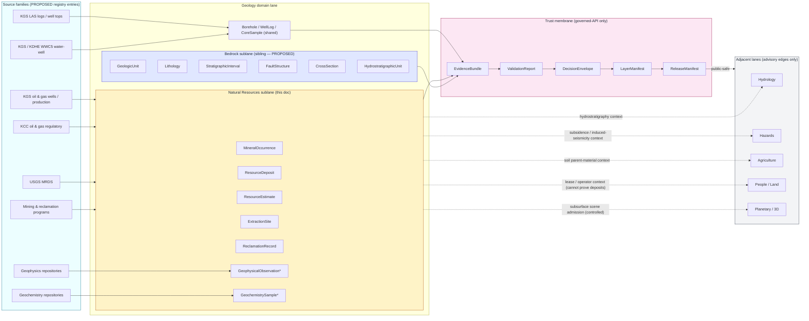

<!-- [KFM_META_BLOCK_V2]
doc_id: kfm://doc/docs-domains-geology-sublanes-natural-resources
title: Natural Resources Sublane — Geology Domain
type: domain-sublane
version: v0.1
status: draft
owners: <Geology domain steward — TODO confirm>; <Natural-Resources reviewer — TODO confirm>
created: 2026-05-17
updated: 2026-05-17
policy_label: public
related:
  - docs/domains/geology/README.md   # PROPOSED — verify exists
  - docs/domains/README.md            # PROPOSED — verify exists
  - docs/doctrine/directory-rules.md  # PROPOSED canonical home per directory-rules §0
  - docs/doctrine/trust-membrane.md   # PROPOSED — verify exists
  - docs/doctrine/lifecycle-law.md    # PROPOSED — verify exists
  - docs/architecture/contract-schema-policy-split.md  # PROPOSED — verify exists
  - docs/sources/source-roles.md      # PROPOSED — verify path
tags: [kfm, domain, geology, natural-resources, sublane]
notes:
  - "Subfolder convention `sublanes/` is PROPOSED; not present in directory-rules.md §6.1 or §12. See §2 Repo fit."
  - "All object-family, schema, contract, and policy homes remain under the unified `geology` lane per Atlas crosswalk and directory-rules §12."
  - "Implementation maturity is UNKNOWN — repo not mounted this session."
[/KFM_META_BLOCK_V2] -->

# Natural Resources Sublane — Geology Domain

*Doctrinal scope for the resource-focused half of the Geology lane: minerals, oil and gas, extraction, reclamation, and resource estimates — kept distinct from bedrock/structural geology and from regulatory, legal, or hazards authority.*

<!-- Badge row: placeholders. Replace targets after CI / repo verification. -->


> **Status:** draft &nbsp;·&nbsp; **Owners:** Geology domain steward (TODO confirm) &nbsp;·&nbsp; **Last updated:** 2026-05-17

---

## Contents

- [0. Status & Authority](#0-status--authority)
- [1. Scope and one-line purpose](#1-scope-and-one-line-purpose)
- [2. Repo fit and placement caveat](#2-repo-fit-and-placement-caveat)
- [3. Inputs — what belongs in this sublane](#3-inputs--what-belongs-in-this-sublane)
- [4. Exclusions — what does *not* belong here](#4-exclusions--what-does-not-belong-here)
- [5. Sublane map — sources, objects, and trust path](#5-sublane-map--sources-objects-and-trust-path)
- [6. Ubiquitous language](#6-ubiquitous-language)
- [7. Source families and source roles](#7-source-families-and-source-roles)
- [8. Object families owned by this sublane](#8-object-families-owned-by-this-sublane)
- [9. Cross-lane relations](#9-cross-lane-relations)
- [10. Map and viewing products](#10-map-and-viewing-products)
- [11. Pipeline shape — RAW → PUBLISHED](#11-pipeline-shape--raw--published)
- [12. Sensitivity, rights, and publication posture](#12-sensitivity-rights-and-publication-posture)
- [13. Source-role anti-collapse — the critical NR discipline](#13-source-role-anti-collapse--the-critical-nr-discipline)
- [14. Validators, tests, fixtures](#14-validators-tests-fixtures)
- [15. Governed AI behavior for this sublane](#15-governed-ai-behavior-for-this-sublane)
- [16. Related docs](#16-related-docs)
- [17. Verification backlog and open questions](#17-verification-backlog-and-open-questions)
- [Appendix — Proposed file homes and source-role worked examples](#appendix--proposed-file-homes-and-source-role-worked-examples)

---

## 0. Status & Authority

| Field | Value |
|---|---|
| **Document type** | Domain-sublane doctrine (sub-scope of the Geology domain) |
| **Authority of this sublane's *scope*** | CONFIRMED — derived directly from the encyclopedia's "Geology and Natural Resources" canonical object families and source families |
| **Authority of any *path* quoted here** | PROPOSED until verified against mounted-repo evidence |
| **Authority of the `sublanes/` subfolder convention** | **PROPOSED — not codified in `directory-rules.md`** (see §2.2 below). Treat as an organizational decomposition for documentation only; it does **not** create a parallel authority root. |
| **Parent lane** | Geology (`docs/domains/geology/`) — the canonical domain lane per directory-rules §12 |
| **Schema / contract / policy home** | Unified under the parent lane: `schemas/contracts/v1/geology/`, `contracts/geology/`, `policy/domains/geology/` (PROPOSED placement per directory-rules §4 step 3 and Atlas v1.1 crosswalk) |
| **Owner** | Geology domain steward — TODO confirm; Natural-Resources reviewer — TODO confirm |
| **Lifecycle invariant** | RAW → WORK / QUARANTINE → PROCESSED → CATALOG / TRIPLET → PUBLISHED. Promotion is a **governed state transition, not a file move.** |
| **Supersedes** | None |
| **Implementation maturity** | UNKNOWN this session — repo not mounted. Doctrinal claims here are CONFIRMED from encyclopedia and atlas; implementation claims are PROPOSED. |

[Back to top](#contents)

---

## 1. Scope and one-line purpose

**One-line purpose.** Govern Kansas natural-resource evidence — minerals, oil/gas, extraction, reclamation, and resource estimates — as a bounded sublane of the Geology domain, without conflating observation with regulation, regulation with title, or extraction records with hazards risk.

CONFIRMED doctrine, PROPOSED implementation: the Geology / Natural Resources domain "owns bedrock, surficial geology, geologic age, structures, geomorphology, boreholes, well logs, cores, geophysics, geochemistry, minerals, oil/gas/resource deposits, extraction and reclamation context. It links to hydrology via hydrostratigraphy." The Natural Resources sublane carves out the **resource-focused** subset of that scope and inherits all Geology-lane governance.

> [!IMPORTANT]
> **This sublane is a documentation decomposition, not an authority split.** Every canonical schema, contract, policy, validator, and pipeline for natural-resource evidence lives **under the Geology lane** (`schemas/contracts/v1/geology/...`, `policy/domains/geology/...`, etc.). The sublane file exists so that the resource-focused responsibilities can be read coherently in one place; it does not create a parallel root and does not bypass the trust membrane.

[Back to top](#contents)

---

## 2. Repo fit and placement caveat

### 2.1 Path

```text
docs/domains/geology/sublanes/natural_resources.md
```

### 2.2 Why this placement is PROPOSED

Directory Rules §6.1 sketches the `docs/domains/` tree as a flat per-domain layout — `docs/domains/geology/`, `docs/domains/hydrology/`, etc. — and §12 (Domain Placement Law) lists the canonical lane segments without naming a `sublanes/` subfolder. The `sublanes/` segment used here is therefore a **PROPOSED organizational pattern** for grouping intra-lane scope documents (e.g., Geology splits cleanly into a "bedrock / stratigraphy / structures" half and a "natural resources" half).

> [!NOTE]
> **Recommended follow-up:** either (a) document the `sublanes/` convention in `docs/domains/README.md` or a per-root README, or (b) open an ADR amending `docs/doctrine/directory-rules.md` §6.1 / §12 to permit `docs/domains/<domain>/sublanes/<sublane>.md` as an explicit pattern. Until either lands, this file's location is PROPOSED / NEEDS VERIFICATION.

### 2.3 Upstream and downstream context

| Direction | Relation | Target (PROPOSED paths) |
|---|---|---|
| Upstream (authority) | Inherits scope from the Geology domain lane | `docs/domains/geology/README.md` (PROPOSED) |
| Upstream (doctrine) | Bound by lifecycle, trust membrane, truth-posture, directory rules | `docs/doctrine/*.md` |
| Sibling (sublane) | Bedrock / surficial / structural geology sublane | `docs/domains/geology/sublanes/bedrock_geology.md` (PROPOSED — not yet authored) |
| Downstream (objects) | Object-family definitions | `contracts/domains/geology/{mineral_occurrence,resource_deposit,extraction_site,reclamation_record}.md` (PROPOSED) |
| Downstream (shape) | Field shape | `schemas/contracts/v1/geology/...` (PROPOSED — Atlas v1.1 crosswalk) |
| Downstream (policy) | Sensitivity, rights, release policy | `policy/domains/geology/...` (PROPOSED) |
| Downstream (data) | Lifecycle data | `data/{raw,work,quarantine,processed,catalog,published,registry}/geology/...` per directory-rules §12 |

[Back to top](#contents)

---

## 3. Inputs — what belongs in this sublane

In scope for **Natural Resources** within the Geology domain:

- **Mineral evidence:** mineral occurrence records, deposit characterizations, mining-records context, resource-estimate documents.
- **Subsurface fluid resources:** oil and gas wells, production records (where rights allow), regulatory records (as **regulatory**, not as observation), well logs and well tops, cores, measured sections — where the use is resource-focused.
- **Extraction context:** active and historical extraction sites, operator-status context, permit and lease *context* (never as proof of deposit existence or as title authority).
- **Reclamation context:** reclamation programs, reclamation status records, post-extraction land-use context.
- **Resource-exploration evidence:** geochemistry samples and geophysical observations *insofar as they are deployed for resource characterization* — when used for bedrock mapping or structural geology, see the bedrock sublane.
- **Public-safe generalized derivatives** of any of the above (e.g., county-level mineral occurrence summaries with exact coordinates redacted).

> [!TIP]
> The same physical record (e.g., a borehole or a well log) may serve **both** sublanes. The sublane affiliation is determined by **the source role and the use** declared in the SourceDescriptor and EvidenceBundle — not by the data's geometry or filename.

[Back to top](#contents)

---

## 4. Exclusions — what does *not* belong here

**Hard exclusions — these are owned by other lanes and never re-asserted from this sublane:**

| Excluded scope | Owning lane | Why |
|---|---|---|
| Hydrology measurements (streamflow, groundwater levels) | Hydrology | NR may receive hydrostratigraphic context only |
| Soil properties and soil surveys | Soil | NR may consume soil parent-material context as advisory only |
| Hazards risk truth (faults, landslides, subsidence, induced seismicity) | Hazards | NR emits geologic *context*; risk evaluation and life-safety messaging belong to Hazards (and KFM is never an alert authority) |
| Title, deed, lease, parcel, operator identity as **truth** | People / Genealogy / DNA / Land | NR may join *for context*; "lease, parcel, operator relation cannot prove deposits" |
| Regulatory enforcement decisions | Out of KFM scope | KFM stores regulatory *records* with source-role `regulatory`; it does not act as a regulator |
| Bedrock unit / surficial unit / structural geology authority | Geology — bedrock sublane | This sublane focuses on resources; structural/stratigraphic primacy stays with the bedrock sublane |
| UI / AI narrative claims about deposits | Map shell, Governed AI runtime | These are downstream consumers; truth lives in EvidenceBundle |

[Back to top](#contents)

---

## 5. Sublane map — sources, objects, and trust path

The diagram below shows where the Natural Resources sublane sits inside the Geology lane and how it connects to sources, to its object families, to the shared trust membrane, and to adjacent lanes. CONFIRMED structural pattern; PROPOSED specific nodes pending implementation.



*`GeophysicalObservation` and `GeochemistrySample` carry a source-role badge that determines which sublane is using them; both sublanes may legitimately reference the same instance.*

> [!NOTE]
> The arrows from the trust membrane to adjacent lanes are deliberately marked **public-safe**: cross-lane consumption happens via released EvidenceBundles, not by reaching into NR's working data. This preserves the watcher-as-non-publisher and trust-membrane invariants.

[Back to top](#contents)

---

## 6. Ubiquitous language

CONFIRMED terms within the Geology domain that are **resource-focused** and therefore primary here. Field realization is PROPOSED until schemas are authored under `schemas/contracts/v1/geology/`.

| Term | Sublane meaning (CONFIRMED doctrine) | Field realization status |
|---|---|---|
| `MineralOccurrence` | A documented mineral observation at a location, with source role, observation/retrieval time, and rights metadata. Existence of an occurrence record does **not** by itself establish economic deposit, lease, or title. | PROPOSED |
| `ResourceDeposit` | A characterized accumulation of a natural resource, with explicit source role (observation vs. interpretation vs. model) and uncertainty support. | PROPOSED |
| `ResourceEstimate` | An estimate (volume, tonnage, recoverability) attributable to a specific method, source, and time. Estimates are **interpretations**, not measurements; never published without methodology and uncertainty. | PROPOSED |
| `ExtractionSite` | A site at which extraction has taken or is taking place, with operator-status context and freshness. Operator identity is **People / Land** context, not NR truth. | PROPOSED |
| `ReclamationRecord` | A documented reclamation status, program reference, or post-extraction land-use record. | PROPOSED |
| `Borehole` *(shared)* | A physical or recorded subsurface penetration. Resource-focused boreholes (oil/gas, exploration) anchor here; mapping/coring boreholes anchor in the bedrock sublane. Same identity rule applies in both. | PROPOSED |
| `WellLog` *(shared)* | A digital or interpreted log of a borehole. Production-context logs anchor here; stratigraphic-mapping logs anchor in the bedrock sublane. | PROPOSED |
| `CoreSample` *(shared)* | A physical or digitized core sample. Sublane attribution follows source role and use. | PROPOSED |
| `GeophysicalObservation` *(shared)* | A geophysical measurement; resource-exploration uses anchor here. | PROPOSED |
| `GeochemistrySample` *(shared)* | A geochemistry sample; resource-prospecting uses anchor here. | PROPOSED |

> [!NOTE]
> All identity rules for these objects follow the encyclopedia's PROPOSED deterministic basis: `source id + object role + temporal scope + normalized digest`. Source, observed, valid, retrieval, release, and correction times remain distinct where material.

[Back to top](#contents)

---

## 7. Source families and source roles

CONFIRMED doctrine: every source carries a declared **role** (`authority`, `observation`, `context`, `model`, `regulatory`, `legal`, `status`, `aggregator` — exact set governed by `docs/sources/source-roles.md`, PROPOSED). Rights and current terms are NEEDS VERIFICATION per source. Sensitive joins fail closed by default.

| Source family | Typical role(s) | Primary contribution to NR | Rights / sensitivity | Status |
|---|---|---|---|---|
| Kansas Geological Survey (KGS) data and maps | observation / context | Resource-context overlays, surficial/bedrock framing | Rights NEEDS VERIFICATION; sensitive joins fail closed | CONFIRMED source family |
| KGS oil and gas wells and production | observation (production), aggregator | Well headers, production records | Rights NEEDS VERIFICATION; operator-private joins fail closed | CONFIRMED source family |
| Kansas Corporation Commission (KCC) oil and gas regulatory | **regulatory** (never observation) | Permitting, regulatory status, enforcement records | Rights NEEDS VERIFICATION; regulatory status is not measurement | CONFIRMED source family |
| KGS LAS digital well logs and well tops | observation / interpretation | Logs and tops for production and stratigraphy | Rights NEEDS VERIFICATION; some operator-private | CONFIRMED source family |
| KGS / KDHE WWC5 and water-well program | observation / regulatory | Water-well completion (cross-shared with Hydrology context) | Rights NEEDS VERIFICATION; private-well joins fail closed | CONFIRMED source family |
| USGS MRDS (Mineral Resources Data System) | aggregator / context | Mineral occurrence records | Rights NEEDS VERIFICATION; exact-location sensitivity for some commodities | CONFIRMED source family |
| Mining and reclamation programs | regulatory / status | Reclamation status, mine-permit context | Rights NEEDS VERIFICATION | CONFIRMED source family |
| Geophysics repositories | observation / interpretation | Resource-exploration geophysics | Rights NEEDS VERIFICATION | CONFIRMED source family |
| Geochemistry repositories | observation / interpretation | Anomaly and prospecting samples | Rights NEEDS VERIFICATION | CONFIRMED source family |

> [!CAUTION]
> A source's **role** is the most consequential field in this sublane. KCC regulatory data is **not** an observation of production; KGS production aggregations are **not** title proof; MRDS occurrence records are **not** evidence of an economically viable deposit. Source-role confusion is the failure mode this sublane exists to prevent. See §13.

[Back to top](#contents)

---

## 8. Object families owned by this sublane

CONFIRMED doctrine (encyclopedia §7.8 canonical object families and atlas §10): the following are part of the Geology domain's canonical object family list and are **primarily** the responsibility of this sublane. Identity and temporal rules are PROPOSED — they follow the encyclopedia's standard pattern below.

| Object | Sublane purpose | Identity rule (PROPOSED) | Temporal handling (CONFIRMED pattern) |
|---|---|---|---|
| `MineralOccurrence` | Recorded mineral observation at a location | `source_id + object_role + temporal_scope + normalized_digest` | source / observed / valid / retrieval / release / correction kept distinct |
| `ResourceDeposit` | Characterized resource accumulation | same identity pattern | same temporal handling |
| `ResourceEstimate` | Interpretation of size / recoverability with method and uncertainty | same identity pattern | same temporal handling |
| `ExtractionSite` | Site at which extraction is or was occurring | same identity pattern | same temporal handling |
| `ReclamationRecord` | Reclamation status / program reference | same identity pattern | same temporal handling |
| `GeophysicalObservation` *(shared with bedrock sublane)* | Geophysical measurement used in resource exploration | same identity pattern | same temporal handling |
| `GeochemistrySample` *(shared with bedrock sublane)* | Geochemistry sample used in prospecting / anomaly work | same identity pattern | same temporal handling |

Objects **co-listed in the Geology canonical family but primarily owned by the bedrock sublane** (referenced here only as cross-sublane context): `GeologicUnit`, `Lithology`, `StratigraphicInterval`, `GeologicAge`, `FaultStructure`, `CrossSection`, `HydrostratigraphicUnit`. The shared physical types `Borehole`, `WellLog`, and `CoreSample` are managed at the Geology lane level with sublane attribution carried in the SourceDescriptor.

[Back to top](#contents)

---

## 9. Cross-lane relations

CONFIRMED relations from the encyclopedia and atlas. Every relation must preserve **ownership, source role, sensitivity, and EvidenceBundle support**. Cross-lane relations are advisory: this sublane contributes context, not authority, to the other side.

| This sublane | Related lane | Relation | Hard constraint |
|---|---|---|---|
| NR | Hydrology | Hydrostratigraphic context; produced-water and injection wells link by well identifiers | NR cannot replace Hydrology measurements; injection-related risk belongs to Hazards |
| NR | Hazards | Subsidence above abandoned workings; induced-seismicity context; fault context | NR emits geologic context; Hazards owns risk. KFM is **never** an alert authority. |
| NR | Agriculture | Soil-parent-material and surface-material context | Advisory only; never regulatory or aggregate truth |
| NR | People / Genealogy / DNA / Land | Lease, parcel, operator relation for context | **Lease, parcel, operator relation cannot prove deposits.** Private person-parcel joins fail closed by default. |
| NR | Planetary / 3D | Subsurface units admitted to 3D scenes as context | Admission requires reality-boundary controls and the same EvidenceBundle as 2D |
| NR | Soil *(bedrock sublane edge, listed here for completeness)* | Parent-material / surficial context | Owned by the bedrock sublane; NR consumes downstream only |

[Back to top](#contents)

---

## 10. Map and viewing products

PROPOSED domain viewing products that are primarily NR-facing (from encyclopedia §7.8 and atlas §10):

- Mineral occurrence / deposit summary (public-generalized).
- Extraction / reclamation context view (public-generalized; precise operator locations restricted by default).
- Borehole / well-log inspector (public-generalized; operator-private logs restricted).
- Resource-context overlay on bedrock and surficial geology layers.
- Reclamation status view with freshness badge.

CONFIRMED cross-cutting viewing products that always apply (from MAP-MASTER, GAI doctrine):

- Evidence Drawer for every feature.
- Time-aware state (source / observed / valid / retrieval / release / correction).
- Trust badges (source role, knowledge character, freshness, sensitivity).
- Sensitivity-redacted view.
- Correction / stale-state view.
- Governed Focus Mode.

> [!IMPORTANT]
> NR map products must surface the **source-role badge** prominently. A "production" layer that does not distinguish KCC regulatory records from KGS production observations is a doctrine violation, not a presentation issue.

[Back to top](#contents)

---

## 11. Pipeline shape — RAW → PUBLISHED

CONFIRMED doctrine; PROPOSED lane application. NR inherits the Geology lane's lifecycle. Promotion is a governed state transition, not a file move.

| Stage | Handling | Gate | Status |
|---|---|---|---|
| **RAW** | Capture immutable source payload or reference with source role, rights, sensitivity, citation, time, and hash | `SourceDescriptor` exists | PROPOSED |
| **WORK / QUARANTINE** | Normalize schema, geometry, time, identity, evidence, rights, policy; hold failures | Validation and policy gate pass, **or** quarantine reason recorded | PROPOSED |
| **PROCESSED** | Emit validated normalized objects, receipts, and public-safe candidates | `EvidenceRef`, `ValidationReport`, digest closure exist | PROPOSED |
| **CATALOG / TRIPLET** | Emit catalog records, `EvidenceBundle`s, graph / triplet projections, release candidates | Catalog / proof closure passes | PROPOSED |
| **PUBLISHED** | Public-safe layers, drawer payloads, release manifests with rollback / correction support | `ReleaseManifest`, policy decision, correction & rollback paths | PROPOSED |

Data segments inferred from directory-rules §12 (PROPOSED placements):

```text
data/raw/geology/{mineral_occurrences,oil_gas,reclamation,…}/
data/work/geology/…
data/quarantine/geology/…
data/processed/geology/…
data/catalog/domain/geology/…
data/published/layers/geology/…           # includes NR-facing layers
data/registry/sources/geology/…           # NR sources sit beside bedrock sources
release/candidates/geology/…
```

> [!NOTE]
> NR-specific subdirectory naming (e.g., `…/geology/natural_resources/…` vs. `…/geology/oil_gas/…`) is **not** prescribed by Directory Rules. Subdirectory schemes within a lane are free-form unless an ADR or per-root README pins them. Pick a scheme in the parent geology README and apply it consistently.

[Back to top](#contents)

---

## 12. Sensitivity, rights, and publication posture

CONFIRMED doctrine — these risks and mitigations are encyclopedia-standard for this domain and are *especially* acute for NR.

| Risk | Mitigation |
|---|---|
| Rights uncertainty | Block public release until source terms and redistribution class are recorded in a SourceDescriptor and reviewed |
| Sensitive location exposure (mineral occurrences, active extraction, private wells) | Default redaction / generalization; restricted views; geoprivacy transform receipts |
| False precision (especially for resource estimates) | Surface uncertainty / support, scale, and source-role badges; abstain on over-precise claims |
| **Source-authority confusion** (the NR-specific top risk) | Use source-role registry; separate observation / model / regulatory / legal / status contexts (see §13) |
| Model hallucination in narrative / AI surfaces | Citation validation, finite outcomes, no direct model-to-public path |
| Stale data (regulatory and reclamation records age fast) | Freshness badges, retrieval / source / release times, stale-state policy |

**Deny-by-default classes for this sublane:**

- Exact private well coordinates without a documented rights-and-purpose review.
- Operator-private logs and proprietary production volumes.
- Joins of `ExtractionSite` × `LandParcel` × `Person` for living individuals — fail closed unless the People / Land lane authorizes the join.
- Mineral occurrence exact coordinates for commodities with known theft / collection risk (e.g., paleontology-adjacent occurrences, where applicable) — generalize by default.

> [!WARNING]
> KFM is **not** a regulator, **not** an alert authority, and **not** a permit office. NR datasets that look authoritative (KCC regulatory tables, reclamation orders) carry a regulatory-record source role and must be presented as records of an external authority's decisions, never as KFM's own determinations.

[Back to top](#contents)

---

## 13. Source-role anti-collapse — the critical NR discipline

The single most frequent failure pattern in resource data is **source-role collapse**: treating an observation as a regulatory determination, a regulatory record as a measurement, or a lease as evidence of a deposit. CONFIRMED cross-domain rule from the Unified Implementation Architecture Build Manual: "source role cannot be inferred from convenience."

| What it is | What it is **not** | Role that must be declared |
|---|---|---|
| KCC permit / order / enforcement record | An observation of what is in the ground | `regulatory` |
| KGS production aggregation | A direct measurement at each well at each moment | `observation` / `aggregator` (with aggregation receipt) |
| USGS MRDS occurrence record | Proof of an economic deposit | `aggregator` |
| Resource estimate (P50, P90, etc.) | A measurement; or a regulatory volume; or a financial filing | `model` / `interpretation` (with method and uncertainty) |
| Lease / parcel / operator identity | Proof that a deposit exists, or proof of title currency | `context` (People / Land owns the truth) |
| Reclamation order | Proof reclamation has completed | `regulatory` (status reflects the order, not the ground) |
| Operator-published production claim | A KFM-verifiable observation | `claim` / `context` (require independent corroboration) |

> [!IMPORTANT]
> Every NR EvidenceBundle and every NR map layer **must** declare and surface source role. A layer that combines records of different roles must label which role each feature carries (e.g., a well point that comes from KGS production vs. KCC permit must badge its origin), or it must split into role-coherent layers.

[Back to top](#contents)

---

## 14. Validators, tests, fixtures

CONFIRMED doctrine — domain-specific tests must include public-safe redaction / generalization, source-role mismatch denial, stale-state handling, and non-regression for prior lineage where relevant. The list below is the encyclopedia's standard test set plus NR-specific additions.

**Standard set (applies to every domain, including NR):**

- Schema validation; source-descriptor validation; rights validation; sensitivity validation.
- Evidence closure; temporal-logic validation; geometry-validity validation.
- Policy-deny tests; citation validation; release-manifest validation.
- Rollback drill; no-network fixtures; non-regression tests.

**NR-specific additions (INFERRED from §13 and the encyclopedia's risk table):**

- **Source-role mismatch denial:** a `regulatory`-role record routed to an `observation`-shaped consumer must fail closed.
- **Operator-private join denial:** any join touching operator-private logs without an approving review must fail closed.
- **Exact-location redaction non-regression:** mineral-occurrence and extraction-site coordinates must remain generalized in public layers across releases.
- **Resource-estimate citation requirement:** every released `ResourceEstimate` must carry method, uncertainty, and a resolvable EvidenceRef; uncited estimates must fail public release.
- **Lease-cannot-prove-deposit invariant:** automated test that a `Lease` × `ExtractionSite` join in CATALOG cannot upgrade an `ExtractionSite` to `ResourceDeposit` without independent evidence.
- **KCC ≠ observation invariant:** automated test that a `regulatory`-role KCC record cannot be aggregated as if it were `observation`-role.
- **Freshness-state regression for reclamation:** reclamation records past a freshness threshold must surface a stale-state badge and route through review before re-promotion.

**Fixtures (PROPOSED):**

- One mineral-occurrence fixture with exact coordinates in RAW, generalized in PUBLISHED, with full transform receipt.
- One oil/gas well fixture pairing a KGS observation record with a KCC regulatory record sharing the same API number — fixture proves the two roles do not collapse.
- One reclamation-record fixture exercising stale-state freshness.
- One operator-private LAS log fixture proving the deny-closed path.

[Back to top](#contents)

---

## 15. Governed AI behavior for this sublane

CONFIRMED doctrine: AI is interpretive, not the root truth source. EvidenceBundle outranks generated language. Preferred order: define scope, retrieve evidence, resolve EvidenceRef to EvidenceBundle, apply policy and sensitivity, then answer with traceability, bounded confidence, or narrowed scope.

| AI behavior | Rule (CONFIRMED) |
|---|---|
| Outcome envelope | `ANSWER` / `ABSTAIN` / `DENY` / `ERROR` only. No free-form continuations. |
| Receipts | Every NR-touching response emits `AIReceipt` and `RuntimeResponseEnvelope` with `evidence_refs`, `policy_decision`, and `citation_validation`. |
| Uncited claims | Disallowed. Cite-or-abstain is the default truth posture. |
| Source-role surfacing | Any NR claim must surface the source role of the evidence (a model can't quietly turn a `regulatory` record into a stated production fact). |
| Sensitive locations | Default to generalized geometry; deny on exact coordinates unless reviewed. |
| Resource estimates | Always present with method, uncertainty, and EvidenceRef — never as a single number stripped of provenance. |

> [!NOTE]
> The trust membrane forbids a direct model-to-public path. AI answers consume the same `EvidenceBundle` and `DecisionEnvelope` that 2D and 3D renderers consume.

[Back to top](#contents)

---

## 16. Related docs

PROPOSED links — verify after repo mount.

- `../README.md` — Geology domain landing
- `../sublanes/bedrock_geology.md` — sibling sublane (PROPOSED, not yet authored)
- `../../README.md` — `docs/domains/` index
- `../../../doctrine/directory-rules.md` — placement law
- `../../../doctrine/lifecycle-law.md` — RAW → PUBLISHED invariant
- `../../../doctrine/trust-membrane.md` — public-path discipline
- `../../../doctrine/truth-posture.md` — cite-or-abstain
- `../../../architecture/contract-schema-policy-split.md` — three-layer split
- `../../../sources/source-roles.md` — registry of permitted source roles
- `../../../registers/VERIFICATION_BACKLOG.md` — repo-wide verification queue
- `../../../adr/` — relevant ADRs (specifically: the proposed ADR for the `sublanes/` convention)

[Back to top](#contents)

---

## 17. Verification backlog and open questions

Open items inherited from the encyclopedia's verification backlog plus items raised by this sublane document.

| Item to verify | Evidence that would settle it | Status |
|---|---|---|
| Whether `sublanes/` is an accepted subfolder under `docs/domains/<domain>/` | An ADR or an entry in `docs/domains/README.md` documenting the convention | **NEEDS VERIFICATION (this doc raises this)** |
| Whether a sibling `bedrock_geology.md` sublane doc exists or is planned | Mounted repo evidence; ADR | UNKNOWN |
| Whether the parent `docs/domains/geology/README.md` exists | Mounted repo evidence | UNKNOWN |
| Whether NR-specific schemas live under `schemas/contracts/v1/geology/` or under a NR-only sub-namespace | ADR amending Atlas v1.1 crosswalk, or mounted repo evidence | NEEDS VERIFICATION |
| Whether KGS, KCC, USGS MRDS, and KGS LAS are currently active SourceDescriptors | `data/registry/sources/geology/` entries | NEEDS VERIFICATION |
| Whether KCC regulatory data terms permit redistribution and at what cadence | Source terms review record | NEEDS VERIFICATION |
| Whether operator-private LAS log policy is encoded as a deny-closed test | `tests/domains/geology/...` | NEEDS VERIFICATION |
| Whether lease × ExtractionSite × Person joins are actively denied | Policy-deny test in `tests/domains/geology/...` | NEEDS VERIFICATION |
| Whether the "geology / resource distinction" (per BLD-MANUAL §6.11) is enforced anywhere by validator, not only by doctrine | `tools/validators/...` | NEEDS VERIFICATION |
| Whether `MineralOccurrence` and `ExtractionSite` already have public-safe generalization transforms | Released layer manifests; transform receipts | NEEDS VERIFICATION |

[Back to top](#contents)

---

## Appendix — Proposed file homes and source-role worked examples

<details>
<summary><strong>A. PROPOSED file homes for NR objects (subject to Directory Rules and mounted-repo ADR)</strong></summary>

These follow directory-rules §12 ("Domain Placement Law") and the Atlas v1.1 §24.13 crosswalk row for Geology. All paths are **PROPOSED**.

```text
contracts/domains/geology/
  mineral_occurrence.md
  resource_deposit.md
  resource_estimate.md
  extraction_site.md
  reclamation_record.md

schemas/contracts/v1/geology/
  mineral_occurrence.schema.json
  resource_deposit.schema.json
  resource_estimate.schema.json
  extraction_site.schema.json
  reclamation_record.schema.json

policy/domains/geology/
  rights/        # source terms and redistribution class
  sensitivity/   # generalization & deny defaults for NR objects
  release/       # NR-specific release gates

tests/domains/geology/
  source_role_mismatch_test.<ext>
  operator_private_join_denial_test.<ext>
  exact_location_redaction_test.<ext>
  resource_estimate_citation_test.<ext>
  lease_cannot_prove_deposit_test.<ext>
  kcc_not_observation_test.<ext>
  reclamation_stale_state_test.<ext>

fixtures/domains/geology/
  natural_resources/
    mineral_occurrence_one_county.json
    well_kgs_observation_plus_kcc_regulatory.json
    reclamation_stale_record.json
    operator_private_las_log.json

pipelines/domains/geology/
  ingest_kgs_oil_gas.<ext>
  ingest_kcc_regulatory.<ext>
  ingest_mrds.<ext>
  ingest_reclamation.<ext>

pipeline_specs/geology/
  natural_resources/
    *.spec.yaml

data/registry/sources/geology/
  kgs_oil_gas_wells.yaml
  kcc_oil_gas_regulatory.yaml
  usgs_mrds.yaml
  kgs_las_logs.yaml
  kgs_kdhe_wwc5.yaml
  reclamation_programs.yaml

release/candidates/geology/
  natural_resources/<release_id>/...
```

</details>

<details>
<summary><strong>B. Worked source-role example — same well, two roles, two records</strong></summary>

Consider a single oil/gas well in Kansas with API number `15-XXX-XXXXX`. KGS publishes a production record for it; KCC publishes a regulatory permit and order history for it.

| Record | Source | Role | Permitted use | Forbidden use |
|---|---|---|---|---|
| Production aggregate (annual) | KGS | `observation` / `aggregator` | Time-series production layer with aggregation receipt | Cannot be quoted as a regulatory volume; cannot be presented as title proof |
| Permit + enforcement history | KCC | `regulatory` | Regulatory-status layer; record of an external authority's decisions | Cannot be quoted as evidence of production; cannot be aggregated as if it were measurement |
| Operator identity | KCC / operator filings | `context` (with People / Land for living entities) | Operator-status badge on public-safe view | Cannot be used to prove deposits; cannot be joined to private individuals without review |

A KFM EvidenceBundle for this well's release surfaces all three records with their distinct roles; the released map layer never collapses them. AI answers about the well must cite the role-correct EvidenceRef for each claim and abstain when the role is unclear.

</details>

<details>
<summary><strong>C. Encyclopedia citations used in this document</strong></summary>

- §7.8 "Geology and Natural Resources" (mission, boundary, source families, canonical object families, map layers, analytical functions, tests, risks).
- §10 (Domain Atlas v1.1) "Geology and Natural Resources" — ubiquitous language, source-family table, object-family table, cross-lane relations, pipeline shape.
- §24.13 (Atlas v1.1) — Atlas Section ↔ Dossier ↔ Responsibility Root Crosswalk row 10 for Geology / Natural Resources.
- Unified Implementation Architecture Build Manual §6.11 "Geology / Natural Resources" — scope, source authority, sensitivity posture, publication gates.
- Idea Index KFM-IDX-APP-006 "Roads, Rail, Trade, Settlements, Infrastructure, and Geology Boundary Discipline" — the "geology / resource distinction" boundary discipline.
- Directory Rules §6.1, §12 — `docs/domains/<domain>/` layout and Domain Placement Law.
- Encyclopedia cross-domain rule: "source role cannot be inferred from convenience" (Unified Build Manual, doctrinal cross-rule).

</details>

[Back to top](#contents)

---

### Related docs

- `../README.md` — Geology domain landing *(PROPOSED — verify exists)*
- `../sublanes/bedrock_geology.md` — sibling sublane *(PROPOSED, not yet authored)*
- `../../../doctrine/directory-rules.md` — placement law
- `../../../doctrine/lifecycle-law.md` — RAW → PUBLISHED invariant
- `../../../sources/source-roles.md` — registry of permitted source roles *(PROPOSED path)*

**Last updated:** 2026-05-17 &nbsp;·&nbsp; **Version:** v0.1 (draft) &nbsp;·&nbsp; [Back to top](#contents)
