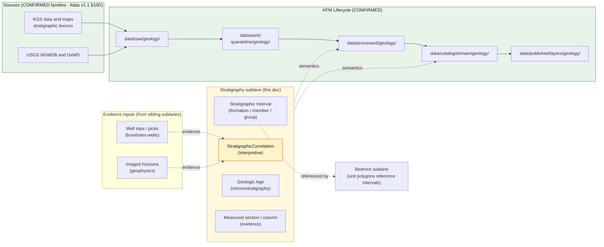

<!-- [KFM_META_BLOCK_V2]
doc_id: kfm://doc/geology-sublane-stratigraphy
title: Geology Sublane — Stratigraphy
type: standard
version: v1
status: draft
owners: <geology-domain-steward> (placeholder — verify against repo CODEOWNERS)
created: 2026-06-03
updated: 2026-06-03
policy_label: public
related:
  - docs/domains/geology/README.md                       # PROPOSED — verify presence
  - docs/domains/geology/sublanes/bedrock_geology.md      # PROPOSED sibling (units carry intervals)
  - docs/domains/geology/sublanes/surficial_geology.md    # PROPOSED sibling
  - docs/domains/geology/sublanes/structures.md           # PROPOSED sibling
  - docs/domains/geology/sublanes/boreholes-wells.md      # PROPOSED sibling (well tops are pick evidence)
  - docs/domains/geology/sublanes/geophysics.md           # PROPOSED sibling (imaged horizons are evidence)
  - docs/domains/hydrology/                               # cross-lane: hydrostratigraphy
  - docs/domains/soil/                                    # cross-lane: parent material
  - schemas/contracts/v1/domains/geology/                 # PROPOSED schema home (ADR-0001 default)
  - contracts/domains/geology/                            # PROPOSED semantic contract home
  - policy/domains/geology/                                # PROPOSED policy home
  - data/published/layers/geology/                        # PROPOSED layer outputs
  - ai-build-operating-contract.md                        # canonical operating contract
  - directory-rules.md                                    # §12 Domain Placement Law, §5 Canonical Root Tree
  - docs/registers/DRIFT_REGISTER.md                      # naming-convention + sublane-folder routing
tags: [kfm, geology, stratigraphy, lithostratigraphy, chronostratigraphy, correlation, sublane]
notes:
  - "CONTRACT_VERSION = 3.0.0 pinned per ai-build-operating-contract.md."
  - "PUBLIC-SAFE LANE. Stratigraphy carries nomenclature, intervals, ages, and correlations — no exact-location sensitivity like boreholes/geochemistry/geophysics. policy_label public; T0/T1 posture similar to bedrock_geology.md."
  - "DEFINING DISCIPLINE: StratigraphicCorrelation is interpretive — never raised to canonical map fact without evidence (Atlas §10C). Correlation-as-fact is the lane's primary anti-collapse concern."
  - "Object-family names follow Atlas v1.1 Ch. 10C/E canonical casing: 'Stratigraphic Interval', 'StratigraphicCorrelation'. 'Geologic Age' is named in §10B scope (chronostratigraphy) but has no separate reference-form in §10E; carried as the scope term."
  - "Filename uses bare form (stratigraphy.md). Sibling files diverge on hyphen vs underscore vs bare; routed to DRIFT_REGISTER (OQ-GEOL-STRAT-06)."
  - "The docs/domains/<domain>/sublanes/<sublane>.md path is PROPOSED; Directory Rules §12 does not enumerate a sublanes/ subfolder. Resolve via ADR."
  - "Owners, CI badge URLs, route names, and exact related-doc paths are placeholders pending mounted-repo verification."
[/KFM_META_BLOCK_V2] -->

# 📚 Geology Sublane — Stratigraphy

> Governance, semantics, and publication posture for **lithostratigraphy, chronostratigraphy, and correlation** inside the KFM Geology / Natural Resources domain lane: formal stratigraphic intervals (formation / member / group), geologic ages, and the correlation assertions that tie them across the state. The lane's defining discipline is that **`StratigraphicCorrelation` is interpretive** — a correlation is never raised to canonical map fact without evidence.

[](#)
[](#)
[](#)
[](#)
[](#)
[](#)
[](#)
[](#)

**Status:** draft · **Owners:** `<geology-domain-steward>` *(placeholder)* · **Contract:** `CONTRACT_VERSION = "3.0.0"` · **Last updated:** 2026-06-03

> [!IMPORTANT]
> **Sublane folder is PROPOSED.** Directory Rules **§12 (Domain Placement Law)** establishes the lane pattern and shows `docs/domains/<domain>/` as a directory, but it does **not** enumerate a `sublanes/` subfolder. The path used here — `docs/domains/geology/sublanes/stratigraphy.md` — should be confirmed by an ADR or migrated to a flat-prefix scheme (e.g. `docs/domains/geology/SUBLANE-STRATIGRAPHY.md`) before the structure is treated as canonical. See [§13 — Open Questions](#13--open-questions).

> [!CAUTION]
> **Correlation is interpretive, not map fact.** The defining anti-collapse rule of this sublane: a `StratigraphicCorrelation` — the claim that an interval at one location is the *same* interval at another — is an **interpretation carrying its own evidence and uncertainty**. It MUST NOT be rendered or described as a settled boundary fact. See [§6](#6--object-families--ubiquitous-language) and [§11](#11--anti-collapse-and-publication-posture).

---

## Mini-TOC

- [1 · Scope](#1--scope)
- [2 · Repo Fit](#2--repo-fit)
- [3 · Inputs](#3--inputs)
- [4 · Exclusions](#4--exclusions)
- [5 · Sublane Map (Mermaid)](#5--sublane-map-mermaid)
- [6 · Object Families & Ubiquitous Language](#6--object-families--ubiquitous-language)
- [7 · Source Families & Source Roles](#7--source-families--source-roles)
- [8 · Spatial & Temporal Model](#8--spatial--temporal-model)
- [9 · Map & Viewing Products](#9--map--viewing-products)
- [10 · Pipeline Shape (RAW → PUBLISHED)](#10--pipeline-shape-raw--published)
- [11 · Anti-Collapse and Publication Posture](#11--anti-collapse-and-publication-posture)
- [12 · Cross-Lane Relations](#12--cross-lane-relations)
- [13 · Open Questions](#13--open-questions)
- [Companion sections](#open-questions-register)
- [Related Docs](#related-docs)

---

## 1 · Scope

**CONFIRMED doctrine / PROPOSED sublane scope.** The stratigraphy sublane governs the **lithostratigraphic and chronostratigraphic framework** of the Geology / Natural Resources lane and the correlation assertions that connect it:

- **`Stratigraphic Interval`** — formal lithostratigraphic intervals (formation, member, group) and their nomenclature.
- **`StratigraphicCorrelation`** — interpretive assertions that two intervals are equivalent across locations; **carries its own evidence and uncertainty**.
- **Geologic Age** *(§10B scope; chronostratigraphy)* — period / epoch / stage assignments attached to intervals.
- **Stratigraphic column / measured-section** references — the ordered sequence of intervals at a location, carried as evidence.
- Public-safe **stratigraphic / correlation views** (nomenclature charts, correlation panels with uncertainty).

Doctrine basis: the Geology lane explicitly owns **stratigraphy** (Atlas §10A), and the §10B scope and §10C/E object families carry `Stratigraphic Interval`, `StratigraphicCorrelation`, and `Geologic Age` (chronostratigraphy).

> [!NOTE]
> This sublane owns the **nomenclature and correlation framework**, not the map polygons. A bedrock map polygon *references* a `Stratigraphic Interval`; the polygon's geometry is the bedrock sublane's. Stratigraphy provides the vocabulary and the cross-location ties.

[Back to top ↑](#-geology-sublane--stratigraphy)

---

## 2 · Repo Fit

**PROPOSED placement.** This file lives under the Geology lane segment of the `docs/` responsibility root.

```text
docs/
└── domains/
    └── geology/
        ├── README.md                   # PROPOSED — domain landing
        └── sublanes/                   # PROPOSED — see §13 Open Questions
            ├── bedrock_geology.md      # PROPOSED sibling (units carry intervals)
            ├── surficial_geology.md    # PROPOSED sibling
            ├── stratigraphy.md         # <— THIS FILE
            ├── structures.md           # PROPOSED sibling
            ├── boreholes-wells.md      # PROPOSED sibling (well tops are pick evidence)
            ├── geophysics.md           # PROPOSED sibling (imaged horizons are evidence)
            ├── geochemistry.md         # PROPOSED sibling
            └── resources.md            # PROPOSED sibling (pointer → natural_resources.md)
```

**Directory Rules basis (CONFIRMED against `directory-rules.md`):**

- **§12 Domain Placement Law** — geology is a **lane segment** inside responsibility roots, never a root folder. The `sublanes/` child extends the §12 lane pattern and is **not yet enumerated** there.
- **§5 Canonical Root Tree** — `docs/` is the human-facing control-plane root.
- **§4 Placement Protocol (Step 3)** — domain is a segment inside a responsibility root, named in the PR.
- **§13.1 / ADR-0001** — `schemas/contracts/v1/...` is the canonical schema home; `contracts/` retains semantic Markdown only.

**Upstream (doctrine that governs this file):**

- `directory-rules.md` — §12 Domain Placement Law, §5 Canonical Root Tree, §4 Placement Protocol (CONFIRMED).
- `ai-build-operating-contract.md` — canonical operating contract, `CONTRACT_VERSION = "3.0.0"` (CONFIRMED).
- `docs/domains/geology/README.md` — Geology lane charter (PROPOSED; verify presence).
- Atlas v1.1 Ch. 10 §10A–C/E — Geology scope and object families (CONFIRMED doctrine).
- `kfm_encyclopedia.pdf` §7.8 — Geology and Natural Resources (CONFIRMED doctrine).

**Downstream (artifacts that consume this sublane's semantics):**

- `contracts/domains/geology/` — semantic Markdown contracts for `Stratigraphic Interval`, `StratigraphicCorrelation`. **(PROPOSED home)**
- `schemas/contracts/v1/domains/geology/` — JSON Schemas per ADR-0001 default. **(PROPOSED home)**
- `policy/domains/geology/` — admissibility and release rules. **(PROPOSED home)**
- `tests/domains/geology/` and `fixtures/domains/geology/` — correlation-anti-collapse and age-vocabulary fixtures. **(PROPOSED home)**
- `data/published/layers/geology/` — released stratigraphic / correlation views. **(PROPOSED home)**
- `control_plane/` or `schemas/` — the chronostratigraphic age vocabulary. **(PROPOSED home)**

[Back to top ↑](#-geology-sublane--stratigraphy)

---

## 3 · Inputs

Material that **belongs** in or is referenced by this sublane:

- **Stratigraphic nomenclature** for Kansas (formation / member / group references, KGS lexicon).
- **Chronostratigraphic ages** (ICS chart edition and/or KGS local nomenclature) attached to intervals.
- **Measured sections / stratigraphic columns** referenced as evidence for an interval order.
- **Correlation assertions** across locations, each with its evidence basis and uncertainty.
- **Interval crosswalks** mapping source-map unit codes to formal intervals.

> [!TIP]
> Inputs enter via the standard **`SourceDescriptor` → source-activation decision** path. A stratigraphic lexicon or correlation source is not implicitly active; it requires a recorded source role, license review, attribution, and a recorded activation decision before connectors emit to `data/raw/geology/`. *(`SourceActivationDecision` as a named object is PROPOSED — verify against `contracts/`.)*

[Back to top ↑](#-geology-sublane--stratigraphy)

---

## 4 · Exclusions

Material that **does not** belong here, and where it goes instead:

| Out of scope for stratigraphy sublane | Lives in | Canonical object family |
|---|---|---|
| Bedrock map unit **polygons** and geometry | `docs/domains/geology/sublanes/bedrock_geology.md` *(PROPOSED)* | `GeologicUnit`, `Lithology` |
| Surficial / unconsolidated cover units | `docs/domains/geology/sublanes/surficial_geology.md` *(PROPOSED)* | `SurficialUnit` |
| Faults, folds, contacts as structural features | `docs/domains/geology/sublanes/structures.md` *(PROPOSED)* | `StructureFeature` |
| Well tops / picks as **subsurface point records** | `docs/domains/geology/sublanes/boreholes-wells.md` *(PROPOSED)* | `BoreholeReference`, `Well LogReference` |
| Imaged horizons from surveys | `docs/domains/geology/sublanes/geophysics.md` *(PROPOSED)* | *(geophysics object — verify)* |
| Soil horizons and soil map units | `docs/domains/soil/` (Soil lane) | `SoilMapUnit`, `Horizon` |
| Hydrostratigraphic **measurements** | `docs/domains/hydrology/` (Geology contributes `Hydrostratigraphic Unit` context) | `Hydrostratigraphic Unit` (context only) |
| Archaeological stratigraphy (site layers) | `docs/domains/archaeology/` (distinct `StratigraphicUnit`) | `StratigraphicUnit` (Archaeology) |
| Cross-cutting governance (`EvidenceBundle`, `RunReceipt`, `ReleaseManifest` semantics) | `contracts/evidence/`, `contracts/runtime/`, `contracts/release/` *(PROPOSED homes)* | — |

> [!WARNING]
> **Anti-collapse (the defining rule of this sublane).** A `StratigraphicCorrelation` — "this interval here is the same as that interval there" — **is an interpretation**, not a measured boundary. It MUST NOT be promoted to a settled map fact without evidence. Likewise, **geologic age** (Permian, Cretaceous) is distinct from **time-of-mapping / observation**; the temporal model keeps them separate. And note the **homonym hazard**: Geology's `Stratigraphic Interval` is not Archaeology's `StratigraphicUnit` — different lanes, different objects.

[Back to top ↑](#-geology-sublane--stratigraphy)

---

## 5 · Sublane Map (Mermaid)

PROPOSED — illustrative; reflects doctrine relationships, not a verified runtime graph.



> [!NOTE]
> The lifecycle `RAW → WORK / QUARANTINE → PROCESSED → CATALOG / TRIPLET → PUBLISHED` is **CONFIRMED doctrine** (Directory Rules §0; Atlas v1.1 §1 Operating Law and §10H). `StratigraphicCorrelation` (highlighted) is the interpretive node — it consumes evidence from well tops and imaged horizons but never becomes a settled boundary without that evidence resolving.

[Back to top ↑](#-geology-sublane--stratigraphy)

---

## 6 · Object Families & Ubiquitous Language

CONFIRMED terms (Atlas v1.1 §10B/C/E); PROPOSED field realizations until the geology schema is mounted.

> [!CAUTION]
> **Casing and naming are load-bearing.** The Atlas prints **`Stratigraphic Interval`** (with a space, §10C/E) and **`StratigraphicCorrelation`** (no space, §10C). **Geologic Age** is named in §10B scope as chronostratigraphy but has no separate reference-form in the §10E object table. Do not silently rename these to industry-generic equivalents.

| Term | Stratigraphy meaning | Identity (PROPOSED) | Citation |
|---|---|---|---|
| **`Stratigraphic Interval`** | A formal lithostratigraphic interval (formation / member / group) and its nomenclature. | `source_id + object_role + temporal_scope + normalized_digest` | Atlas §10C/E |
| **`StratigraphicCorrelation`** | An **interpretive** assertion that intervals are equivalent across locations; carries its own evidence and uncertainty. | Same identity basis; correlation is bound to its evidence set. | Atlas §10C |
| **Geologic Age** | A chronostratigraphic age (period / epoch / stage) attached to an interval. *(§10B scope; reference-form not in §10E.)* | Vocabulary-bounded; tracked against the source's age system. | Atlas §10B |
| **Measured section / column** *(evidence)* | The ordered sequence of intervals at a location; **evidence** for an interval order or correlation. | Bound to its source and location. | INFERRED from §10B/E |

> [!IMPORTANT]
> **Lithostratigraphy ≠ chronostratigraphy.** A `Stratigraphic Interval` (a rock unit) and its `Geologic Age` (a time span) are different axes; a single interval may be diachronous. Carry both, and never collapse "the Dakota Formation" (lithostratigraphy) into "the Cretaceous" (chronostratigraphy) as if they were the same statement.

<details>
<summary><b>Geology lane object families not owned by this sublane</b></summary>

Listed for terminology fidelity (Atlas v1.1 §10C/E). This sublane supplies the **vocabulary and correlation framework** these reference, but does not own their geometry:

- `GeologicUnit`, `Lithology` — bedrock sublane (polygons reference intervals).
- `SurficialUnit` — surficial sublane.
- `StructureFeature` — structures sublane.
- `BoreholeReference`, `Well LogReference` — boreholes-wells sublane (well tops are pick evidence).
- `GeologyBoundaryVersion` — bedrock/structures interpretation versioning.
- `Hydrostratigraphic Unit` — geology-owned context that supports the Hydrology lane.

**Homonym hazard:** Archaeology owns a distinct `StratigraphicUnit` (site layers) — a different object in a different lane. Do not cross-reference the two as the same family.

</details>

[Back to top ↑](#-geology-sublane--stratigraphy)

---

## 7 · Source Families & Source Roles

CONFIRMED source families (Atlas v1.1 §10D). Stratigraphy draws primarily on the nomenclature/lexicon side of the geology source ledger.

| Source family | Bedrock relevance | Source-role posture (CONFIRMED doctrine) | Citation |
|---|---|---|---|
| **KGS data and maps** | Kansas stratigraphic lexicon, nomenclature, and correlation charts. | authority / observation / context / model **as source role requires**; rights & current terms **NEEDS VERIFICATION**; sensitive joins fail closed. | Atlas §10D |
| **USGS NGMDB and GeMS** | Federal geologic-map database / GeMS schema; compilation-scale interval framework. | Same posture. | Atlas §10D |
| KGS LAS well logs and well tops | **Evidence input** for correlation; location handling stays under boreholes-wells. | Same posture; tops are pick evidence, not nomenclature authority. | Atlas §10D |

> [!WARNING]
> **Source roles cannot be inferred from convenience.** A well top is **evidence** for a correlation, not the correlation itself. A compilation-scale interval framework is not automatically correct at local scale. Promotion of evidence into a settled correlation is a **governed state transition**, not a join. The Atlas posture is uniform: each source's role is "authority / observation / context / model **as source role requires**," and **sensitive joins fail closed**.

> [!CAUTION]
> **Vocabulary and license gates (NEEDS VERIFICATION).** The Atlas marks KGS / USGS "rights and current terms" as **NEEDS VERIFICATION** (§10D). The **canonical age vocabulary** (which ICS chart edition, or KGS local nomenclature) is **UNKNOWN** until a vocabulary file is mounted (OQ-GEOL-STRAT-05).

[Back to top ↑](#-geology-sublane--stratigraphy)

---

## 8 · Spatial & Temporal Model

CONFIRMED doctrine (Atlas v1.1 §10B/E; ENCY §7.8):

- **Geometry** — stratigraphy is mostly **non-spatial nomenclature plus location-referenced evidence**. Where it renders, correlation panels are diagrammatic; measured sections are point-referenced.
- **Order and uncertainty** — interval order and correlation confidence are tracked explicitly (e.g., certain / probable / inferred correlation).
- **Interpretation versioning** — a re-correlation produces a new interpretation in lineage, not an overwrite (mirrors `GeologyBoundaryVersion` discipline in the bedrock sublane).
- **Temporal handling** (Atlas v1.1 §10E — "source, observed, valid, retrieval, release, and correction times stay distinct where material"):

| Time facet | Stratigraphy meaning |
|---|---|
| `source_time` | Publication date of the lexicon / correlation source. |
| `observed_time` | Section-measuring / logging date, when known. |
| `valid_time` | Window the nomenclature / correlation is considered current. |
| `retrieval_time` | When KFM pulled the source. |
| `release_time` | When KFM released the derivative. |
| `correction_time` | When a `CorrectionNotice` was applied (e.g., re-correlation). |

> [!TIP]
> **Geologic age** (the chronostratigraphic span) and the **temporal facets above** (when KFM handled the data) are different axes. Confusing the age of the rock with the date of the record is a classic anti-collapse failure the temporal model is built to prevent.

[Back to top ↑](#-geology-sublane--stratigraphy)

---

## 9 · Map & Viewing Products

PROPOSED sublane products (derived from Atlas v1.1 §10G "stratigraphy/correlation view"; ENCY §7.8):

| Product | Geometry | Purpose | Status |
|---|---|---|---|
| **Stratigraphic nomenclature chart** | Diagram (non-spatial) | Public-safe formation/member/group hierarchy with ages. | PROPOSED |
| **Correlation panel** | Diagram + location refs | Cross-location correlation of intervals **with uncertainty classes**. | PROPOSED |
| **Geologic age view** | Attribute overlay | Color/label intervals by chronostratigraphic age. | PROPOSED |
| **Measured-section view** | Point + column | A stratigraphic column at a location, carried as evidence. | PROPOSED |
| **Correlation-version diff** | Diagram (compare) | Compare two correlation interpretations; flag changed ties. | PROPOSED |

CONFIRMED cross-cutting view doctrine (Atlas §10G; MAP-MASTER; GAI): every product participates in **Evidence Drawer, time-aware state, trust badges, sensitivity-redacted view, correction/stale-state view, and governed Focus Mode**. Correlation products MUST surface the **interpretation / uncertainty badge** prominently.

> [!IMPORTANT]
> A correlation panel must visually distinguish **certain / probable / inferred** ties. A panel that renders an inferred correlation as a solid, certain line is a doctrine violation, not a presentation choice.

[Back to top ↑](#-geology-sublane--stratigraphy)

---

## 10 · Pipeline Shape (RAW → PUBLISHED)

CONFIRMED doctrine; PROPOSED sublane application. Promotion is a **governed state transition, not a file move** (Directory Rules §0; Atlas v1.1 §10H).

| Stage | Stratigraphy handling | Gate | Status |
|---|---|---|---|
| **RAW** | Capture lexicon / correlation / section source payload with source role, rights, sensitivity, citation, time, hash. | `SourceDescriptor` exists. | PROPOSED |
| **WORK / QUARANTINE** | Normalize interval nomenclature, age vocabulary, crosswalk of source unit codes to formal intervals, identity, evidence, rights, policy. Hold failures (unknown interval, unmapped age term). | Validation + policy gate pass, or quarantine reason recorded. | PROPOSED |
| **PROCESSED** | Emit validated `Stratigraphic Interval` records, `Geologic Age` assignments, and **evidence-bound** `StratigraphicCorrelation` candidates with uncertainty. Emit `EvidenceRef`, `ValidationReport`; close digest. | `EvidenceRef`, `ValidationReport`, digest closure exist. | PROPOSED |
| **CATALOG / TRIPLET** | Emit catalog records, `EvidenceBundle`s, graph/triplet projections (`Stratigraphic Interval` ↔ `Geologic Age` ↔ `GeologicUnit`), and release candidates. | Catalog / proof closure passes. | PROPOSED |
| **PUBLISHED** | Serve released public-safe nomenclature charts, correlation panels (with uncertainty), and age views through governed APIs and a `ReleaseManifest`. | `ReleaseManifest`, correction path, rollback target, review / policy state exist. | PROPOSED |

> [!CAUTION]
> **Watcher-as-non-publisher invariant.** A stratigraphy watcher that detects a lexicon / correlation update **MAY emit a candidate `PromotionDecision`**; it MUST NOT write to `data/processed/geology/` or `data/published/layers/geology/` directly. Promotion is reserved to the governed pipeline.

[Back to top ↑](#-geology-sublane--stratigraphy)

---

## 11 · Anti-Collapse and Publication Posture

CONFIRMED / PROPOSED (Atlas v1.1 §10C/I; operating contract §23.2; T0–T4 tier scheme §24.5):

- **Public-safe lane.** Stratigraphic nomenclature, intervals, ages, and correlation panels are generally **public-safe (T0 / T1)** — there is no exact-location sensitivity here as there is in boreholes-wells / geochemistry / geophysics. Public release is *permitted* provided rights, attribution, license, and source role are settled.
- **Correlation-as-fact anti-collapse (the lane's defining rule).** `StratigraphicCorrelation` is interpretive; it MUST carry evidence and uncertainty and MUST NOT be rendered as a settled boundary (Atlas §10C, CONFIRMED).
- **Lithostratigraphy ≠ chronostratigraphy.** Interval (rock) and age (time) must remain distinct objects.
- **Default-deny on missing release inputs.** Unclear rights, unresolved source role, missing evidence, or absent release state **blocks public promotion** (Atlas §1 Operating Law; Directory Rules — CONFIRMED).

| Object class | Default tier (PROPOSED, from §10I posture) | Allowed transform | Required gates |
|---|---|---|---|
| Stratigraphic nomenclature chart | **T0 / T1** | Generalization where source scale demands. | Standard release gates. |
| Correlation panel (with uncertainty) | **T0 / T1** | Render uncertainty classes; never flatten to certain. | Standard release gates; interpretation badge required. |
| Geologic age view | **T0 / T1** | None required beyond attribution. | Standard release gates. |

> [!IMPORTANT]
> **An interval is not its age, and a correlation is not a boundary.** A user viewing a correlation panel must see the **interpretation and uncertainty** plus the `EvidenceBundle` — never an inferred tie presented as a measured fact. Per operating contract §23.2, when support is inadequate, the runtime **abstains** rather than asserting a correlation.

[Back to top ↑](#-geology-sublane--stratigraphy)

---

## 12 · Cross-Lane Relations

CONFIRMED doctrine (Atlas v1.1 §10F). Each relation MUST preserve **ownership, source role, sensitivity, and `EvidenceBundle` support** — none are joins of convenience.

| This sublane | Related lane | Relation | Constraint |
|---|---|---|---|
| Stratigraphy | **Bedrock** | `Stratigraphic Interval` → referenced by `GeologicUnit` polygons | Stratigraphy supplies vocabulary; bedrock owns the polygon geometry. |
| Stratigraphy | **Boreholes-Wells** | Well tops / picks → **evidence** for a `StratigraphicCorrelation` | Tops are evidence; correlation authority stays here; location handling stays under boreholes-wells. |
| Stratigraphy | **Geophysics** | Imaged horizons → **evidence** for correlation | Anomaly/horizon is evidence; never the correlation itself. |
| Stratigraphy | **Hydrology** | Interval → **`Hydrostratigraphic Unit`** context (aquifer host) | Stratigraphy supplies the unit framework; Hydrology owns measurements. |
| Stratigraphy | **Soil** | Interval → parent-material context | Advisory only; Soil owns soil map units. |
| Stratigraphy | **Archaeology** | *Homonym only* — Geology `Stratigraphic Interval` ≠ Archaeology `StratigraphicUnit` | Distinct objects in distinct lanes; do not conflate. |

[Back to top ↑](#-geology-sublane--stratigraphy)

---

## 13 · Open Questions

| # | Question | Evidence that would settle it | Status |
|---|---|---|---|
| 1 | Is `docs/domains/<domain>/sublanes/<sublane>.md` an accepted layout, or should sublane docs use a flat-prefix scheme? | An ADR amending Directory Rules §12, or a mounted-repo precedent. | NEEDS VERIFICATION |
| 2 | Does the Geology lane carry semantic contracts under `contracts/domains/geology/` and machine schemas under `schemas/contracts/v1/domains/geology/` per ADR-0001? | Mounted-repo inspection; ADR-0001 status. | NEEDS VERIFICATION |
| 3 | Does `Geologic Age` get a reference-form object, or stay a vocabulary-bounded attribute on `Stratigraphic Interval`? | `contracts/` / schema inspection; geology object-family ADR. | NEEDS VERIFICATION |
| 4 | How is `StratigraphicCorrelation` uncertainty modeled and surfaced (certain / probable / inferred)? | Correlation schema + Evidence Drawer payload contract. | PROPOSED |
| 5 | What is the canonical **age vocabulary** (ICS chart edition / KGS local nomenclature)? | A vocabulary file under `control_plane/` or `schemas/`. | UNKNOWN |
| 6 | Which KGS stratigraphic lexicon / correlation source is the **default** authority, and at what scale? | A source-activation decision in `data/registry/sources/geology/`. | UNKNOWN |
| 7 | How is the **homonym hazard** (Geology `Stratigraphic Interval` vs Archaeology `StratigraphicUnit`) prevented in the graph/triplet layer? | A cross-lane namespace check; object-family ADR. | NEEDS VERIFICATION |
| 8 | Filename convention: hyphen vs underscore vs bare for sublane files? | Mounted-repo precedent or a docs-naming ADR. | NEEDS VERIFICATION |

[Back to top ↑](#-geology-sublane--stratigraphy)

---

## Open questions register

| ID | Question | Owner role | Resolution path |
|---|---|---|---|
| OQ-GEOL-STRAT-01 | Accept `sublanes/` subfolder vs flat-prefix scheme under `docs/domains/geology/`. | docs steward + directory-rules owner | ADR amending Directory Rules §12; DRIFT_REGISTER entry. |
| OQ-GEOL-STRAT-02 | Confirm geology contract/schema homes. | geology domain steward | Mounted-repo inspection + ADR-0001 check. |
| OQ-GEOL-STRAT-03 | `Geologic Age` as reference-form object vs attribute on `Stratigraphic Interval`. | geology domain steward | Geology object-family ADR / schema PR. |
| OQ-GEOL-STRAT-04 | Correlation uncertainty model (certain / probable / inferred) and Evidence Drawer surfacing. | geology domain steward + UI owner | Correlation schema + drawer payload contract. |
| OQ-GEOL-STRAT-05 | Canonical chronostratigraphic age vocabulary. | geology domain steward | Vocabulary file under `control_plane/` or `schemas/`. |
| OQ-GEOL-STRAT-06 | Sublane filename convention (hyphen / underscore / bare). | docs steward | Docs-naming ADR; DRIFT_REGISTER entry. |
| OQ-GEOL-STRAT-07 | Prevent Geology/Archaeology `Stratigraphic*` homonym collision in the graph layer. | geology + archaeology stewards | Cross-lane namespace check; object-family ADR. |

## Open verification backlog

These items remain `NEEDS VERIFICATION` before promotion from `draft` to `published`:

1. Sublane folder layout (`sublanes/` vs flat prefix) — Directory Rules §12 silent.
2. Geology contract/schema homes against mounted repo and ADR-0001.
3. `Geologic Age` object-vs-attribute realization.
4. Correlation uncertainty model and surfacing.
5. Canonical chronostratigraphic age vocabulary (UNKNOWN).
6. Default KGS stratigraphic lexicon / correlation source and scale (UNKNOWN).
7. Geology/Archaeology `Stratigraphic*` homonym prevention.
8. Filename convention (hyphen / underscore / bare).

## Changelog v0 → v1

| Change | Type (per contract §37) | Reason |
|---|---|---|
| New sublane doc created at `docs/domains/geology/sublanes/stratigraphy.md` | new | First stratigraphy sublane doc. |
| Object families set to Atlas v1.1 §10C/E canonical casing (`Stratigraphic Interval`, `StratigraphicCorrelation`; `Geologic Age` as §10B scope term) | new | Terminology fidelity. |
| Made `StratigraphicCorrelation`-is-interpretive the lane's defining anti-collapse rule | new | Atlas §10C marks correlation interpretive; correlation-as-fact is the lane's primary risk. |
| Added lithostratigraphy-≠-chronostratigraphy and the Geology/Archaeology `Stratigraphic*` homonym hazard | new | Both are classic stratigraphy collapse modes. |
| Public-safe T0/T1 posture (no exact-location sensitivity) | clarification | Distinguishes this lane from the restricted subsurface sublanes. |
| Added companion sections (Open Qs register, Verification backlog, Changelog, DoD) | new | Doctrine-doc companion pattern. |

> **Backward compatibility.** New file; no prior anchors to preserve. Anchors use GitHub auto-slug of the H1 "📚 Geology Sublane — Stratigraphy"; verify the leading-emoji slug renders as `#-geology-sublane--stratigraphy` on the target GitHub instance.

## Definition of done

This document is done enough to enter the repository when:

- it is placed according to Directory Rules (sublane-folder question OQ-GEOL-STRAT-01 resolved);
- the filename convention is resolved (OQ-GEOL-STRAT-06);
- a docs steward and the geology domain steward review it;
- it is linked from the Geology lane `README.md` / doctrine index;
- it does not conflict with accepted ADRs (ADR-0001 schema home; any sublane-folder ADR; geology object-family ADR);
- the correlation-uncertainty model and age vocabulary are pinned (OQ-GEOL-STRAT-04 / -05);
- the Geology/Archaeology `Stratigraphic*` homonym prevention is logged (OQ-GEOL-STRAT-07);
- naming and folder questions are logged in `docs/registers/DRIFT_REGISTER.md`;
- the `GENERATED_RECEIPT.json` planned at authoring time is wired into CI;
- future changes follow the operating contract §37 lifecycle.

---

## Related Docs

PROPOSED — verify each path against the mounted repo before linking.

- `docs/domains/geology/README.md` — Geology lane charter.
- `docs/domains/geology/sublanes/bedrock_geology.md` — Sibling sublane (unit polygons reference intervals).
- `docs/domains/geology/sublanes/surficial_geology.md` — Sibling sublane for unconsolidated cover.
- `docs/domains/geology/sublanes/structures.md` — Sibling sublane for structural geology.
- `docs/domains/geology/sublanes/boreholes-wells.md` — Sibling sublane (well tops are pick evidence).
- `docs/domains/geology/sublanes/geophysics.md` — Sibling sublane (imaged horizons are evidence).
- `docs/domains/hydrology/` — Cross-lane (hydrostratigraphy).
- `docs/domains/soil/` — Cross-lane (parent material).
- `docs/domains/archaeology/` — Cross-lane (distinct `StratigraphicUnit` — homonym hazard).
- `directory-rules.md` §12 — Domain Placement Law; §5 Canonical Root Tree; §4 Placement Protocol.
- `ai-build-operating-contract.md` — canonical operating contract (`CONTRACT_VERSION = "3.0.0"`).
- Atlas v1.1 Ch. 10 §10A–C/E — Geology scope and object families.
- `kfm_encyclopedia.pdf` §7.8 — Geology and Natural Resources.
- `docs/registers/DRIFT_REGISTER.md` — naming-convention + sublane-folder routing.

---

<details>
<summary><b>Appendix A · Stratigraphy review checklist (PROPOSED reviewer aid)</b></summary>

A non-normative checklist for PRs that touch stratigraphy artifacts. Promote to `docs/runbooks/geology/STRATIGRAPHY_REVIEW.md` if it survives use.

- [ ] **Source activation** — `SourceDescriptor` exists; activation decision records role, rights, license, attribution.
- [ ] **Source role** — lexicon/correlation source declared as nomenclature authority; well tops / horizons treated as evidence, not authority.
- [ ] **Schema home** — JSON Schema under `schemas/contracts/v1/domains/geology/...` (ADR-0001 default).
- [ ] **Identity** — `Stratigraphic Interval` / `StratigraphicCorrelation` identity binds `source_id + object_role + temporal_scope + normalized_digest`.
- [ ] **Correlation interpretive** — every `StratigraphicCorrelation` carries evidence + uncertainty; never rendered as a settled boundary.
- [ ] **Litho ≠ chrono** — `Stratigraphic Interval` and `Geologic Age` kept as distinct objects/attributes.
- [ ] **Age vocabulary** — chronostratigraphic terms bound to a recorded vocabulary (OQ-GEOL-STRAT-05).
- [ ] **Uncertainty rendered** — correlation panels distinguish certain / probable / inferred.
- [ ] **Homonym guard** — Geology `Stratigraphic Interval` not conflated with Archaeology `StratigraphicUnit`.
- [ ] **Evidence closure** — `EvidenceRef` resolves to a populated `EvidenceBundle`.
- [ ] **Cross-lane** — bedrock / boreholes-wells / hydrology joins preserve ownership, source role, and `EvidenceBundle` support.

</details>

<details>
<summary><b>Appendix B · Anti-pattern register (illustrative)</b></summary>

| Anti-pattern | Symptom | Fix |
|---|---|---|
| **Correlation-as-fact** | An inferred correlation is rendered as a solid, certain boundary. | Carry evidence + uncertainty; render certain/probable/inferred distinctly; abstain when support is inadequate. |
| **Litho = chrono** | "Dakota Formation" is treated as identical to "Cretaceous." | Keep `Stratigraphic Interval` (rock) and `Geologic Age` (time) distinct; allow diachronous intervals. |
| **Top-as-correlation** | A well top is promoted directly to a settled correlation. | Keep the top as **evidence**; correlation is a governed interpretation with its own evidence set. |
| **Homonym collision** | Geology `Stratigraphic Interval` joined to Archaeology `StratigraphicUnit` in the graph. | Namespace the objects per lane; never cross-reference as the same family. |
| **Silent re-correlation** | A new correlation overwrites the prior without a new interpretation version. | Treat re-correlation as a new interpretation in lineage; emit a `CorrectionNotice` if it changes a published artifact. |
| **Age-vocabulary drift** | Ages mixed across ICS editions / local nomenclature without record. | Bind to a recorded age vocabulary; record the edition (OQ-GEOL-STRAT-05). |

</details>

---

**Last updated:** 2026-06-03 · **Doc status:** draft (v1) · **Authority:** doctrine CONFIRMED / paths PROPOSED · **Contract:** `CONTRACT_VERSION = "3.0.0"` · [Back to top ↑](#-geology-sublane--stratigraphy)
